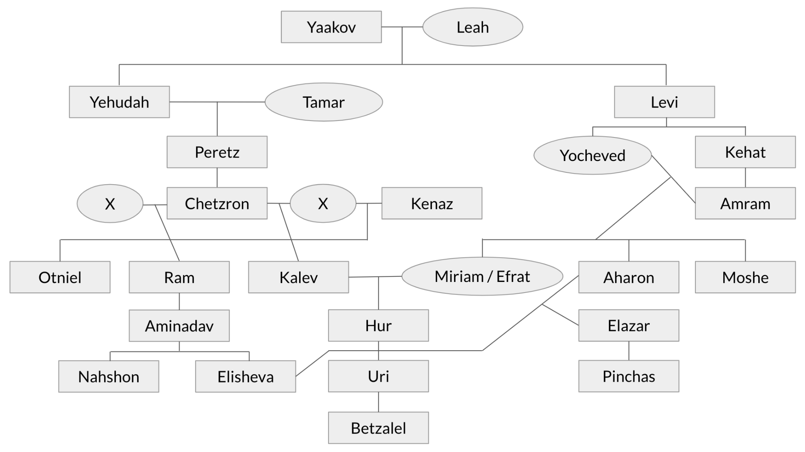
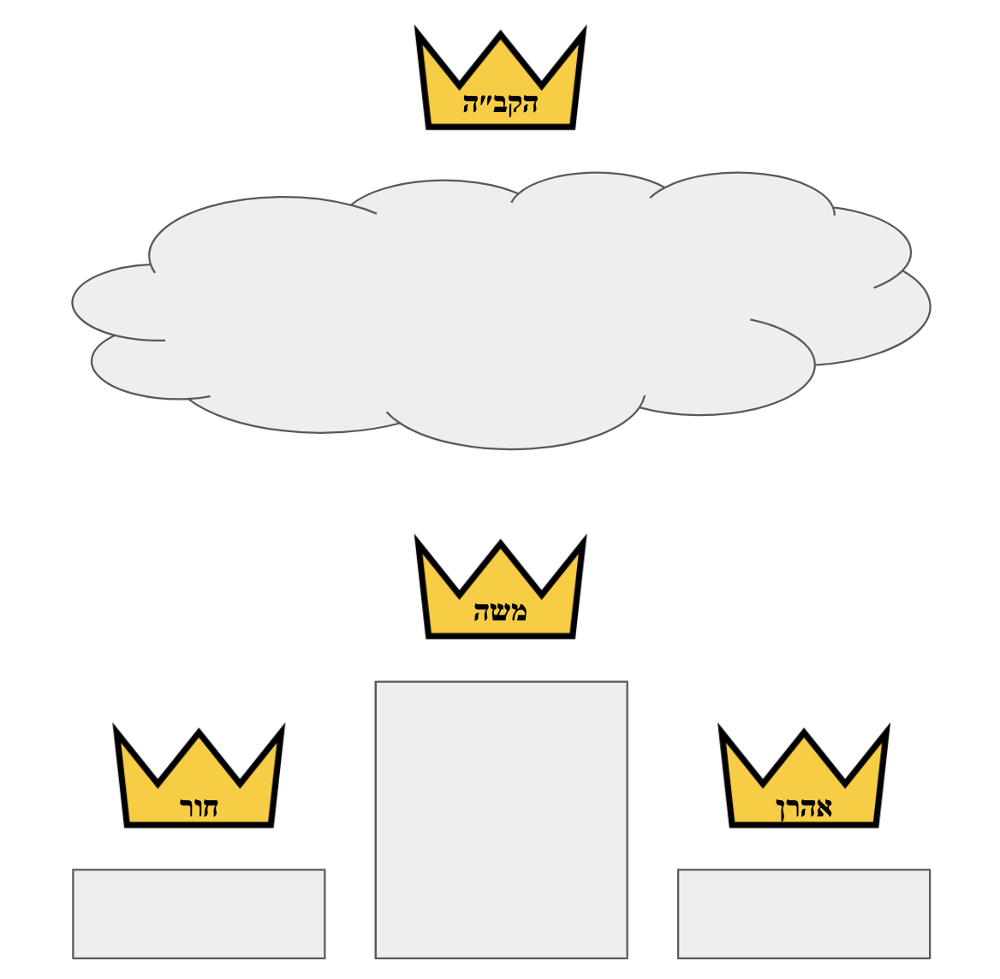

[חוט המשולש]{dir="rtl"}

***The life and legacy of Moshe Rabbeinu***

***through the lens of Midrash Aggadah***

*By: Ron Nahshon*

{width="6.5in" height="4.694444444444445in"}

**[Foreword]{.underline}**

[מנחם אב תשפ״ג]{dir="rtl"}

*August 2023*

This work is structured as follows:

(1) A **General** **Introduction**

(2) Chapter I: **Giv'at Rephidim**

(3) Chapter II: **Har Sinai**

(4) Chapter III: **Hor HaHar**

(5) Appendix: **Midrash Ha'Aliyah**

(6) Glossary & Acknowledgements

**(1) General Introduction**

The introduction speaks to the methodology employed in this work, a
methodology I refer to as *"meta-midrash"*. In short, it is an aggadic
midrash of aggadic midrashim, analyzing them using the exegetical tools
they use to analyze holy texts. For example, aggadic midrash weaves
together different pesukim from different books in Tanach to make a
cohesive whole, and the goal of this work is to engage in the same
exercise, but at the midrashic level: weaving together different
midrashic traditions into a cohesive whole.

The introduction also elucidates a theory of midrashic pedagogy I refer
to as [חוט המשולש]{dir="rtl"} in the spirit of (״[והחוט המשולש לא במהרה
ינתק״ (קהלת ד, יב]{dir="rtl"}, i.e. "The three-corded string does not
easily tear." It argues that there are three essential layers which are
combined to develop, in composite, classical aggadic midrashim:

(1) **Linguistic.** Begin with some anomaly or difficulty in the
    language, structure or grammar of one or more pesukim. This can be
    based on strange spelling, improper tense, etc.

(2) **Thematic.** Use those linguistic difficulties coupled with
    relevant contextual questions as a springboard to develop broader
    ideas in line with Rabbinic principles or beliefs.

(3) **Ethical.** Uses those developed ideas to teach lessons about how
    to live a better, more spiritually oriented life; or, how to relate
    to Judaism and the Creator in an intimate way.

*\*\* NOTE: General Introduction still needs to be written*

**(2) (3) (4) Chapters I, II & III**

These chapters contain the core content of this work. Each chapter
focuses on a different ascent of Moshe Rabbeinu up a hill or mountain,
and explores the respective ascent in midrashic depth.

Instead of systematically describing the three-tiered [חוט
המשולש]{dir="rtl"} structure I have chosen instead to discuss how
different midrashim contradict and complement each other in a more
poetic, analytical way, in the style of the midrashic literature itself
which is infamously non-structured. Along the way I do attempt to
highlight when the Rabbis are engaging in each level of exegesis and
propose what is likely motivating them, all while building a grander,
"meta-midrashic" narrative for each respective ascent.

Each chapter is structured similarly:

1)  **General Introduction** with **Notes**

2)  **Three** **Parts**, each of which contains an

    a)  **Introduction** with **Notes**

    b)  **Four** **Subsections** with **Notes**

Each chapter has \~**80-100** pages and \~**120-140** footnotes.

Some caveats:

- There is inconsistency in translations (my own)

- There is inconsistency in transliterations (editing needed)

- Page numbers / footnotes within each chapter need updating

- Spelling mistakes, grammar mistakes, etc.

The **Notes** after each **Part** should ideally be found at the bottom
of the pages which reference them. The current format has **Notes**
after the **Part** instead; this was due to formatting constraints and
will hopefully be adjusted for easier reading.

**(5) Appendix: Midrash Ha'Aliyah**

I took the midrashic insights developed in this work and, while trying
to stay reasonably true to the text of the work and the order its ideas
are developed in, created a new midrash called Midrash Ha'Aliyah. This
Midrash is written in Hebrew and in the style of the classical aggadic
midrashim of Hazal. In particular, this Midrash is meant to be similar
to works such as Midrash Rabbah, and pays homage to the authors of these
ancient masterpieces. It includes existing midrashim referenced in the
work while crafting new ones that stand alongside them, with the aim of
enriching them while maintaining the stylistic integrity of the
originals.

The structure of Midrash Ha'Aliyah aims to mirror the structure of the
work itself. It has **Three** **Perakim** ([פרקים]{dir="rtl"}), each of
which focuses on a different respective ascent of Moshe. Each **Perek**
contains **Sixteen Mishnayot** ([משניות]{dir="rtl"}) and has
\~**275-300** footnotes. Unlike in the main work the footnotes do not
contain any additional commentary; they simply list the sources being
quoted. An index is also available which categorizes the sources
referenced by the Midrash.

***Table of Contents***

(1) **General Introduction p. 05**

(2) **Chapter I: Givat Rephidim p. 06**

(3) **Chapter II: Har Sinai p. 92**

(4) **Chapter III: Hor HaHar p. 183**

(5) **Appendix: Midrash Ha'Aliyah p. 279**

***General Introduction***

***Chapter I***

[גבעת רפידים]{dir="rtl"}

[משה ◆ אהרן ◆ חור]{dir="rtl"}

[יהושע ◆ כלב ◆ בצלאל]{dir="rtl"}

**Givat Rephidim -** [גבעת רפידים]{dir="rtl"}

**Table of Contents**

**General Introduction**
............................................................... p. 03

**Notes for General Introduction**
............................................................... p. 06

*Part 1: Destined to Rule*

> **Introduction**
> ............................................................... p. 12
>
> 1\. Righteous Martyr
> ............................................................... p. 13
>
> 2\. Adam's Book
> ............................................................... p. 17
>
> 3\. Family Tree
> ............................................................... p. 19
>
> 4\. Seeds of Royalty
> ............................................................... p. 24
>
> **Notes for Part 1**
> ............................................................... p. 26

*Part 2: Three Crowns*

> **Introduction**
> ............................................................... p. 41
>
> 1\. Torah is Primary
> ............................................................... p. 41
>
> 2\. Biblical Triumvirate
> ............................................................... p. 43
>
> 3\. A Good Name
> ............................................................... p. 46
>
> 4\. Holy Unification
> ............................................................... p. 48
>
> **Notes for Part 2**
> ............................................................... p. 52

*Part 3: Divine Justice*

> **Introduction**
> ............................................................... p. 63
>
> 1\. National Atonement
> ............................................................... p. 65
>
> 2\. Paying It Forward
> ............................................................... p. 66
>
> 3\. Like Children
> ............................................................... p. 69
>
> 4\. Final Vengeance
> ............................................................... p. 71
>
> **Notes for Part 3**
> ............................................................... p. 74

**[General Introduction]{.underline}**

[וַיָּבֹ֖א עֲמָלֵ֑ק וַיִּלָּ֥חֶם עִם יִשְׂרָאֵ֖ל בִּרְפִידִֽם׃ וַיֹּ֨אמֶר מֹשֶׁ֤ה אֶל יְהוֹשֻׁ֙עַ֙ בְּחַר לָ֣נוּ אֲנָשִׁ֔ים וְצֵ֖א
הִלָּחֵ֣ם בַּעֲמָלֵ֑ק מָחָ֗ר אָנֹכִ֤י נִצָּב֙ עַל רֹ֣אשׁ הַגִּבְעָ֔ה וּמַטֵּ֥ה הָאֱלֹהִ֖ים בְּיָדִֽי׃ וַיַּ֣עַשׂ יְהוֹשֻׁ֗עַ כַּאֲשֶׁ֤ר
אָֽמַר לוֹ֙ מֹשֶׁ֔ה לְהִלָּחֵ֖ם בַּעֲמָלֵ֑ק וּמֹשֶׁה֙ אַהֲרֹ֣ן וְח֔וּר עָל֖וּ רֹ֥אשׁ הַגִּבְעָֽה׃ וְהָיָ֗ה כַּאֲשֶׁ֨ר יָרִ֥ים מֹשֶׁ֛ה
יָד֖וֹ וְגָבַ֣ר יִשְׂרָאֵ֑ל וְכַאֲשֶׁ֥ר יָנִ֛יחַ יָד֖וֹ וְגָבַ֥ר עֲמָלֵֽק׃ וִידֵ֤י מֹשֶׁה֙ כְּבֵדִ֔ים וַיִּקְחוּ אֶ֛בֶן וַיָּשִׂ֥ימוּ
תַחְתָּ֖יו וַיֵּ֣שֶׁב עָלֶ֑יהָ וְאַהֲרֹ֨ן וְח֜וּר תָּֽמְכ֣וּ בְיָדָ֗יו מִזֶּ֤ה אֶחָד֙ וּמִזֶּ֣ה אֶחָ֔ד וַיְהִ֥י יָדָ֛יו אֱמוּנָ֖ה
עַד בֹּ֥א הַשָּֽׁמֶשׁ׃ וַיַּחֲלֹ֧שׁ יְהוֹשֻׁ֛עַ אֶת עֲמָלֵ֥ק וְאֶת עַמּ֖וֹ לְפִי חָֽרֶב׃]{dir="rtl"}

[(שמות יז :ח-יג)]{dir="rtl"}

*"Amalek came and fought against Yisrael in Rephidim. Moshe said to
Yehoshua: Choose for us men, and go out to fight against Amalek;
tomorrow I will stand at the top of the hill, with the staff of G-d in
my hand. Yehoshua did as Moshe told him, to fight against Amalek, while
Moshe, Aharon and Hur ascended to the top of the hill. Whenever Moshe
raised his hand, Yisrael would gain the upper hand, but whenever
\[Moshe\] lowered his hand, Amalek would gain the upper hand. Moshe's
hands got heavy, so they took a rock and placed it under him and he sat
on it. Aharon and Hur supported \[Moshe's\] hands, one on one side and
one on the other side; and so his hands were steady until sunset.
Yehoshua weakened Amalek and his nation by the sword."*

***(Shmot 17: 8-13)***

A fledgling nation, recently granted its freedom from centuries of
oppression, treks through an unfriendly wilderness and into the unknown.
Bnai Yisrael struggle with their newfound freedom, divided into various
tribes and a large assortment of tagalongs, the I*erev rav*. Moshe is
undisputed and in charge, but who he commands is more akin to an amalgam
of slaves than a proud and free people. Millions wandering in the desert
demand clearly defined roles and responsibilities for various levels of
leadership; governmental structures need to be put into place, a system
of laws and courts must be established. Yet even a month after Bnai
Yisrael's independence was realized, other than Moshe himself no formal
positions have been designated.

It is with memories of slavery still fresh and present in their minds
that Bnai Yisrael are suddenly attacked for the first time. War is the
ultimate uniting force in times of uncertainty, and existential threat
by a ruthless enemy is a strong motivator to set aside any internal
strife and join together as one people. Yet no nation can survive such
trying times without strong leadership and a robust army; a show of
solidarity from Moshe and other heads of the people is necessary in
order to defeat Amalek. But what areas of leadership do the unique
circumstances of this new nation demand, and what type of political
structure is required to meet them?

In the haste to escape Egyptian bondage these questions have gone
unaddressed; Amalek has forced Moshe's hand much earlier than expected.
Amalek was eager to fight against the Jews, chomping at the bit like a
rabid dog.**^[1]{.underline}^** The pesukim indicate that the ambush was
sudden and unprovoked,**^[2]{.underline}^** catching Moshe and the
nation off guard. A general must immediately be appointed to lead Bnai
Yisrael into battle, and Moshe designates Yehoshua, described by the
Torah as a *na'ar*,**^[3]{.underline}^** to command the nation's
untrained forces.**^[4]{.underline}^** Moshe knows that Yehoshua alone
will not be enough to unify the people, for Amalek is a powerful enemy
and Bnai Yisrael are unaccustomed to fighting in
war.**^[5]{.underline}^** Moshe realizes that he too must be a symbol of
strength for the people, and elects to pray on their behalf in clear
view of the day-old soldiers; any necessary spiritual and military
preparations are implemented quickly and within 24 hours of the
attack,**^[6]{.underline}^** establishing a thematically meaningful
precedent for confrontation with Amalek in the
future.**^[7]{.underline}^**

As Moshe's hands grow heavy, two other important figures step in to
support him: Aharon and Hur. Aharon is certainly a familiar face to us,
and a natural contender to help Moshe inspire the troops fighting below.
He was, after all, introduced earlier in Sefer Shmot, and played a
central role in *yetziat mitzrayim*. And while this is the first we hear
of Yehoshua in the Torah, his worthiness for the role assigned to him
here is bolstered by the righteousness, loyalty and bravery he displays
later on in the Torah. In contrast, Hur is a complete enigma, a
mysterious figure who appears and disappears without any
explanation,**^[8]{.underline}^** and the clarity of his role within the
nobility of Bnai Yisrael is diametrically opposed to that of the others.

The imagery provoked by this story is incredibly powerful, almost
picturesque: Moshe sitting atop a hill perched on a rock, hands held
high by Aharon on one side and Hur on the other, while Yehoshua leads an
inexperienced army to victory over their more seasoned attackers in the
valley below. The visual of Moshe, Aharon and Hur united in grim
determination and connected with their hands stretched heavenward,
grasping the miraculous staff of G-d, is - as the pesukim tell us - a
symbol of *"faith until the sun set" (Shmot 17:12)***^[9]{.underline}^**
that surely boosted the peoples' morale. Why should this be so?

*"'When Moshe raised his hands, Yisrael had the upper hand' (Shmot
17:11). Did Moshe's hands determine victory or defeat? Rather, this
teaches you that whenever Yisrael looked up and gave over their hearts
to their Father in Heaven, they would have the upper hand, and if not,
they would fall."***^[10]{.underline}^**

[וְהָיָה כַּאֲשֶׁר יָרִים משֶׁה יָדוֹ וְגָבַר יִשְׂרָאֵל וְגוֹ\' (שמות יז, יא), וְכִי יָדָיו שֶׁל משֶׁה
עוֹשׂוֹת מִלְחָמָה אוֹ שׁוֹבְרוֹת מִלְחָמָה. אֶלָּא לוֹמַר לְךָ, כָּל זְמַן שֶׁהָיוּ יִשְׂרָאֵל מִסְתַּכְּלִים כְּלַפֵּי
מַעְלָה וּמְשַׁעְבְּדִין אֶת לִבָּם לַאֲבִיהֶם שֶׁבַּשָּׁמַיִם הָיוּ מִתְגַּבְּרִים. וְאִם לָאו, הָיוּ
נוֹפְלִין:]{dir="rtl"}**^[10]{.underline}^**

Another layer has been added to this symbolism: Hashem watching over the
people in Heaven, dwelling above Moshe, Aharon and Hur who are pointing
up with their hands towards Him, and who are standing above Yehoshua and
the people, who are in turn directing their eyes up towards Him as they
fight Amalek. This interconnectedness between the army, the leadership,
and HaKadosh Baruch Hu Himself generated a profound sense of unity that
allowed Yisrael to win and best the mighty antagonist; this achievement
was so noteworthy that Hashem commanded it be written in a book and
*"placed in Yehoshua's ear"*, perhaps as a testament to how one should
successful rally Bnai Yisrael in the future.

Moshe, Aharon and Yehoshua are all key players in the drama of Bnai
Yisrael's journey to Eretz Canaan, so Hur is in esteemed company. But
who was he? Surely the Torah does not hide essential information from us
unless there is good reason. Can Hur's prominence in the battle against
Bnai Yisrael's first enemy teach us something about why Bnai Yisrael
were able to win, against at best improbable odds? Can it shed light on
why Amalek, more than any other nation, is enshrined as the archnemesis
of Yisrael, and whose very existence must paradoxically be consciously
erased from the peoples' collective memory? And is the mystery of Hur's
sudden appearance and disappearance perhaps the key to unlocking a
greater understanding of what determines Bnai Yisrael's successes and
failures, not just in the desert, but for all
time?**^[11]{.underline}^**

**[Notes for General Introduction]{.underline}**

**1. Pesikta DeRav Kahana 3:8**

[עמלק (דברים כה:יז). עם ילק, פרח כהדין זחלה. דבר אחר עם לק, אומה שבאת
ללוק דמן של ישראל ככלב. ר\' לוי בשם ר\' שמעון בן חלפתא למה היה עמלק
דומה, לזבוב שהוא להוט אחר המכה, כך היה עמלק להוט אחר ישראל ככלב. תני בשם
ר\' נתן ארבע מאות פרסה פסע עמלק ובא לעשות מלחמה עם ישראל
ברפידים:]{dir="rtl"}

*"'Amalek' (Devarim 25:17). A nation of locusts: It flew down \[to
battle\] like a locust. Another idea: A licking nation. A people that
came to lick up the blood of Yisrael like a dog. Rabbi Levi says in the
name of Rabbi Shimon Ben Chalafta, to whom is Amalek comparable? To a
fly who is eagerly drawn to a wound; similarly, Amalek was eagerly drawn
to Yisrael like a dog. It was taught in the name of Rabbi Natan, Amalek
traveled 400 parasangs in order to do battle with Yisrael in Rephidim."*

The distance of 400 parasangs mentioned here is alternatively given as
the length from one end of Eretz Yisrael to the other, and as the length
of from one end of the Land of Egypt to the other. So determined was
Amalek to attack Bnai Yisrael that they traversed an incredible distance
in order to do so:

**Menachot 64b**

[תנו רבנן כשצרו מלכי בית חשמונאי זה על זה והיה הורקנוס מבחוץ ואריסטובלוס
מבפנים בכל יום ויום היו משלשלין להן דינרין בקופה ומעלין להן תמידין היה
שם זקן אחד שהיה מכיר בחכמת יוונית לעז להם בחכמת יוונית אמר להן כל זמן
שעסוקין בעבודה אין נמסרין בידכם למחר שלשלו להן דינרין בקופה והעלו להן
חזיר כיון שהגיע לחצי חומה נעץ צפרניו בחומה ונזדעזעה ארץ ישראל ארבע מאות
פרסה על ארבע מאות פרסה באותה שעה אמרו ארור שיגדל חזיר וארור שילמד בנו
חכמת יוונית:]{dir="rtl"}

*"The Rabbis taught: When the kings of the Hashmonaim were warring with
each other, Hyrcanus was on the outside and Aristobolus was on the
instead. Each day the \[people on the inside\] would send a box of coins
\[to the people on the outside, who would then\] send up \[animals for\]
the daily sacrifices. There was an elderly man \[inside\] who knew Greek
wisdom, and he communicated \[with the people outside\] using Greek
wisdom, and said to them, as long as these \[on the inside\] are engaged
in the Temple service, they will not be given over into your hands. The
next day they lowered the coins in a box, and they sent back a pig
\[which is not permissible as a sacrifice\]. Once the pig got halfway up
the wall, it inserted its hooves into the wall, and Eretz Yisrael shook
400 by 400 parasanges. At that time they said: Cursed is he who raises
pigs, and cursed is he who teaches his son Greek wisdom."*

**Megillah 3a**

[וְאָמַר רַבִּי יִרְמְיָה וְאִיתֵּימָא רַבִּי חִיָּיא בַּר אַבָּא: תַּרְגּוּם שֶׁל תּוֹרָה --- אוּנְקְלוֹס הַגֵּר
אֲמָרוֹ מִפִּי רַבִּי אֱלִיעֶזֶר וְרַבִּי יְהוֹשֻׁעַ. תַּרְגּוּם שֶׁל נְבִיאִים --- יוֹנָתָן בֶּן עוּזִּיאֵל אֲמָרוֹ
מִפִּי חַגַּי זְכַרְיָה וּמַלְאָכִי, וְנִזְדַּעְזְעָה אֶרֶץ יִשְׂרָאֵל אַרְבַּע מֵאוֹת פַּרְסָה עַל אַרְבַּע מֵאוֹת
פַּרְסָה. יָצְתָה בַּת קוֹל וְאָמְרָה: מִי הוּא זֶה שֶׁגִּילָּה סְתָרַיי לִבְנֵי אָדָם?]{dir="rtl"}

*"Rabbi Yirmiyah, and some say Rabbi Chiya Bar Abba, says, the
translation of Torah \[into Aramaic\] - Onkelos the proselyte said it
before Rabbi Eliezer and Rabbi Yehoshua. The translation of Nevi'im -
Yonatan Ben Uzziel said it before Haggai, Zechariah and Malachi, and
Eretz Yisrael shook 400 by 400 parasangs. A heavenly voice went out and
said: Who is the one that \[dared to\] reveal My secrets to mankind?"*

**Pesachim 94a**

[תָּא שְׁמַע: מִצְרַיִם הָיָה אַרְבַּע מֵאוֹת פַּרְסָה עַל אַרְבַּע מֵאוֹת פַּרְסָה, וּמִצְרַיִם אֶחָד מִשִּׁשִּׁים
בְּכוּשׁ, וְכוּשׁ אֶחָד מִשִּׁשִּׁים בָּעוֹלָם, וְעוֹלָם אֶחָד מִשִּׁשִּׁים בַּגָּן, וְגַן אֶחָד מִשִּׁשִּׁים בְּעֵדֶן,
וְעֵדֶן אֶחָד מִשִּׁשִּׁים בְּגֵיהִנָּם, נִמְצָא כׇּל הָעוֹלָם כּוּלּוֹ כְּכִיסּוּי קְדֵירָה
לְגֵיהִנָּם:]{dir="rtl"}

*"Come and hear, Egypt is 400 by 400 parasangs, and Egypt is
one-sixtieth of Cush, and Cush is one-sixtieth of the whole world, and
the whole world is one-sixtieth of the Gan \[of Eden\], and the Gan \[of
Eden\] is one-sixtieth of \[the entirety of\] Eden, and \[the entirety
of\] Eden is one-sixtieth of Gehinnom. It follows that the whole world
is like a pot cover compared to Gehinnom."*

**Breishit Rabbah 93:6**

[מִיָּד כָּעַס יְהוּדָה וְשָׁאַג בְּקוֹל גָּדוֹל וְהָלַךְ קוֹלוֹ אַרְבַּע מֵאוֹת פַּרְסָה עַד שֶׁשָּׁמַע חוּשִׁים בֶּן
דָּן וְקָפַץ מֵאֶרֶץ כְּנַעַן וּבָא אֵצֶל יְהוּדָה וְשָׁאֲגוּ שְׁנֵיהֶם וּבִקְשָׁה אֶרֶץ מִצְרַיִם
לֵהָפֵךְ:]{dir="rtl"}

*"Yehudah got angry and roared with a great voice, and his voice carried
400 parasangs until Hushim Ben Dan heard it and jumped from Eretz Canaan
\[to Egypt\] and came next to Yehudah, and the two of them roared and
the whole of the land of Egypt was in danger of being destroyed."*

**2. Devarim 25:17-19**

[זָכ֕וֹר אֵ֛ת אֲשֶׁר עָשָׂ֥ה לְךָ֖ עֲמָלֵ֑ק בַּדֶּ֖רֶךְ בְּצֵאתְכֶ֥ם מִמִּצְרָֽיִם׃ אֲשֶׁ֨ר קָֽרְךָ֜ בַּדֶּ֗רֶךְ וַיְזַנֵּ֤ב בְּךָ֙ כׇּל
הַנֶּחֱשָׁלִ֣ים אַֽחֲרֶ֔יךָ וְאַתָּ֖ה עָיֵ֣ף וְיָגֵ֑עַ וְלֹ֥א יָרֵ֖א אֱלֹהִֽים׃ וְהָיָ֡ה בְּהָנִ֣יחַ יְהֹוָ֣ה אֱלֹהֶ֣יךָ ׀ לְ֠ךָ֠
מִכׇּל אֹ֨יְבֶ֜יךָ מִסָּבִ֗יב בָּאָ֙רֶץ֙ אֲשֶׁ֣ר יְהֹוָה אֱ֠לֹהֶ֠יךָ נֹתֵ֨ן לְךָ֤ נַחֲלָה֙ לְרִשְׁתָּ֔הּ תִּמְחֶה֙ אֶת זֵ֣כֶר עֲמָלֵ֔ק
מִתַּ֖חַת הַשָּׁמָ֑יִם לֹ֖א תִּשְׁכָּֽח׃]{dir="rtl"}

*"Remember what Amalek did to you on the way, as you were leaving Egypt.
He surprised you on the way, and cut down all of the weak ones in the
rear, and you were tired and weary; he was not afraid of G-d. When
Hashem your G-d will leave you free on all your enemies around you in
the land that Hashem your G-d is giving you as a portion to inherit -
you shall erase the memory of Amalek from under the heavens; do not
forget."*

**3.** While *na'ar* is often translated as lad or youth, Yehoshua was
already 56 years old during the battle with Amalek. This leads Ibn Ezra
and Ramban to conclude that a more correct translation here would be
deputy or attendant. Either way it seems clear that at the time he was
an attendant to Moshe and not yet a holder of high office:

**Shmot 33:11**

[וְדִבֶּ֨ר יְהֹוָ֤ה אֶל מֹשֶׁה֙ פָּנִ֣ים אֶל פָּנִ֔ים כַּאֲשֶׁ֛ר יְדַבֵּ֥ר אִ֖ישׁ אֶל רֵעֵ֑הוּ וְשָׁב֙ אֶל הַֽמַּחֲנֶ֔ה וּמְשָׁ֨רְת֜וֹ
יְהוֹשֻׁ֤עַ בִּן נוּן֙ נַ֔עַר לֹ֥א יָמִ֖ישׁ מִתּ֥וֹךְ הָאֹֽהֶל׃]{dir="rtl"}

*"Hashem spoke with Moshe face to face, the way a man speaks to his
fellow. \[Moshe\] would return to the camp; but his attendant Yehoshua
Bin Nun was a deputy who did not leave from inside the tent."*

**Ramban to Shmot 33:11 d"h umesharto yehoshua bin nun na'ar**

[כתב ר\'\'א (אבן עזרא על שמות ל״ג:י״א) חיה יהושע מאה ועשר שנים (יהושע כד
כט), וחכמים אמרו (זבחים קיח:) כי שבע שנים כבש ושבע שנים חלק, א\'\'כ היה
בן חמשים ושש שנה, ואיך יקראהו הכתוב נער, וככה פירושו, ומשרתו יהושע בן
נון שירות נער. ועל דעתי דרך לשון הקדש שיקרא כל משרת נער, כי בעל השררה
הנכבד הוא האיש, והמשרת לו יקרא נער:]{dir="rtl"}

*"Ibn Ezra wrote that \[we know\] Yehoshua lived for 110 years (Yehoshua
24:29), and our sages said (Zevachim 118b) that it took seven years to
conquer \[Eretz Yisrael\] and seven years to divide \[it\] up. If so,
\[since Bnai Yisrael wandered in the desert for 40 years, subtract 110 -
7 - 7 - 40 = 56, which means Yehoshua\] was 56 years old \[during this
episode\], so how could the text call him a na'ar? \[Ibn Ezra\] answered
that \[Moshe's\] attendant Yehoshua Bin Nun' \[means\] his attendance
was like that of a youth. And in my opinion it is the way of the Holy
Tongue to call any attendant a na'ar \[regardless of age\], for a person
of authority is called ish and the one who attends to him is called
na'ar."*

Yehoshua himself also felt unworthy to be chosen for this role,
recognizing that Moshe saw in him potential that he then had to prove
was correct:

**Pesikta DeRav Kahana 3:1**

[אמר יהושע כמה גדולים יש כאן בדור הזה, אהרן וחור וע\' זקנים, ולא צוה משה
אלא לי, לא על חינם צווני אלא שראה שנופל בידי, ויעש יהושע כאשר אמר לו משה
להלחם בעמלק וגו\' (שם יז:י):]{dir="rtl"}

*"Yehoshua said, there are so many great people in this generation:
Aharon, Hur, the seventy elders. And yet, Moshe did not command anyone
other than me \[to lead the battle against Amalek\]. He did not command
me for naught but rather must have seen that \[Amalek\] will fall into
my hands. \[Therefore:\] 'Yehoshua did as Moshe told him, to fight
against Amalek' (Shmot 17:10)."*

**4.** An allusion to this idea may come from the fact that this is the
first time we hear of Yehoshua in the Torah and he is referred to as
such, yet the Torah informs us in Bemidbar 13:16 that Yehoshua's
original name was actually Hoshea; Moshe had renamed him by inserting a
*yud* at the beginning of his name. The midrash explains that this was
meant to strengthen Yehoshua and give him the courage and fortitude to
stand up against the rest of the spies:

**Sotah 34b**

[ויקרא משה להושע בן נון יהושע י-ה יושיעך מעצת מרגלים והיינו דכתיב ועבדי
כלב עקב היתה רוח אחרת עמו וגו\':]{dir="rtl"}

*"'Moshe called Hoshea Bin Nun Yehoshua'. \[This means\] may Yah save
you from the advice of the spies. This is why it says: 'My servant
Kalev, because he had a different spirit with him, etc.'"*

Perhaps Yehoshua is referred to with the *yud* in the battle of Amalek
as well because at this point too he was an inexperienced warrior and
needed the prayer of *"May Yah save you",* that HaKadosh Baruch Hu
should grant him victory in the campaign against Amalek. More than a
year later, before dispatching the spies, Moshe then reconfirmed the
name change in prayer that Yehoshua should be saved from their negative
influence.

**5.** This follows from observing that Moshe did not merely assign
Yehoshua to command the people in battle, but also felt it necessary to
take action of his own:

**Ramban to Shmot 33:9 d"h vayomer moshe el yehoshua**

[והיה כל הענין הזה שעשה משה רבינו, מפני שהיה עמלק גוי איתן וחזק מאד,
וישראל אינם מלומדי מלחמה ולא ראו אותה מעולם, כאשר אמר פן ינחם העם בראותם
מלחמה (שמות י״ג:י״ז), והוא עיף ויגע ככתוב במשנה תורה (דברים כה יח), על
כן פחד מהם והוצרך לכל התפלה והתחנה הזאת:]{dir="rtl"}

*"And this whole thing which Moshe Rabbeinu did, was because Amalek was
a very powerful and strong nation, and \[additionally\] Yisrael were not
taught in the ways of war and had never seen it before, as it says:
'Lest the nation will regret when they see war' (Shmot 13:17).
\[Additionally, the nation\] was tired and weak, as it says in Mishneh
Torah \[i.e. Sefer Devarim\] (Devarim 25:18). Therefore, \[Moshe\] was
afraid for \[Bnai Yisrael\] and felt it was necessary to \[also\] pray
and supplicate as much as possible."*

**6.** The word *machar*, usually translated as 'tomorrow', can also
connote a sense of immediacy and urgency, and here seems appropriate
given the hurried response to sudden war:

**Pesikta Zutarta Shmot 13:14 d"h vehaya ki yishalcha bincha machar**

[יש מחר לאחר זמן כגון זה, ודומה ומחר (על) \[אל\] כל עדת ישראל יקצוף
(יהושע כב יח) ויש מחר שהוא עכשיו, כגון מחר אנכי נצב (שמות יז ט), למחר
יהיה האות הזה (שם ח יט), וכל דומיהן:]{dir="rtl"}

*"There is 'tomorrow' which means after a long time such as here \[in
Shmot 13:14\], and similarly: 'Tomorrow He will get angry at the entire
congregation of Yisrael' (Yehoshua 22:18), and there is 'tomorrow' which
means now, as it says: 'Tomorrow I will stand' (Shmot 17:9), \[and
similarly\] 'Tomorrow this sign will appear' (Shmot 8:19), and all those
who are \[to be interpreted\] similarly."*

Whether *machar* is referring to Yehoshua meeting Amalek in battle - so
that Moshe could ascend the hill and pray beforehand - or referring to
Moshe ascending to pray - so that Yehoshua could set up for battle right
away - is grammatically ambiguous:

**Yoma 52a-b**

[וְהַתַּנְיָא, אִיסִי בֶּן יְהוּדָה אוֹמֵר: חָמֵשׁ מִקְרָאוֹת בַּתּוֹרָה אֵין לָהֶן הֶכְרֵעַ: ״שְׂאֵת״.
״מְשׁוּקָּדִים״. ״מָחָר״. ״אָרוּר״. ״וְקָם״:]{dir="rtl"}

*"Was it not taught, Issi Ben Yehudah said: There are five pesukim in
the Torah which cannot be decided \[from a grammatical perspective\]:
'lifted up', 'with almond blossoms', 'tomorrow', 'cursed', 'and will get
up'."*

**Tosafot to Yoma 52b d"h se'et meshukadim machar arur vekam**

[וכן מחר אי קאי אמלחמה ואנכי נצב על ראש הגבעה היום להתפלל קודם המלחמה
כדכתיב היערוך שועך לא בצר (איוב לו, יט) או קאי אאנכי נצב מחר
להתפלל:]{dir="rtl"}

*"And similarly 'tomorrow': Is it referring to the battle, and then 'I
will stand at the top of the hill' - today, to pray before the battle,
as it says: 'Will your limitless wealth help you' (Iyov 36:19)? Or is it
referring to 'I will stand' - tomorrow, to pray?"*

**7.** The concept of facing off against Amalek *machar* also appears in
the Purim story. Queen Esther invites King Achashverosh and Haman to an
intimate feast, during which she invites them again to a second feast
the following day. It is not clear from the Megillah itself why Esther
feels the need to do this; she accused Haman of attempting genocide
against her people at the second feast, but she could have just as
easily done that at the first one. Clearly something motivated Esther to
drag her plan out, and for the midrash this was a realization that when
Amalek presents a sudden and unexpected danger - as Haman's decree
clearly did - the only way to defeat him is by fighting back 'tomorrow':

**Yalkut Shimoni on Nach Remez 1056**

[ומחר אעשה כדבר המלך (אסתר ה:ח). מה ראתה לומר מחר, אלא שכל זרעה של עמלק
למדים ליפול למחר, וכן הוא אומר מחר אנכי נצב על ראש הגבעה (שמות
יז:ט):]{dir="rtl"}

*"'Tomorrow I will do as the king commands' (Esther 5:8). Why did she
feel it appropriate to say 'tomorrow'? Rather, it is learned that all
the offspring of Amalek are destined to fall 'tomorrow', as it says:
'Tomorrow I will stand at the top of the hill' (Shmot 17:9)."*

It follows that *machar* is used in the context of the battle with
Amalek both in the immediate, 'now' sense, and in the abstract, distant
future sense.

**8.** This point will be more fully developed in **Part I**.

**9.** The simple, *peshat* translation of the word *emunah* is
steadiness and permanence:

**Chizkuni to Shmot 17:12 d"h videy moshe kevedim**

[כל דבר העומד בחזקו ובעמדו ואינו מחליש ואינו נחסר מכמות שהיה קרוי אמונה
כמו ותקעתיו יתד במקום נאמן (ישעיהו כב:כג), שתרגומו באתר קיים. ועוד הרבה
אף כאן ויהי ידיו אמונה קיימות ועומדות ומרימות מטה האלוקים עד בא השמש
ודבר זה גרם להחליש יהושע את עמלק ואת עמו שהיו ישראל רואים את ידיו של משה
מרימות המטה ומתגברים:]{dir="rtl"}

*"Every thing which stands in its strength and uprightness and does not
weaken or lose from the quantity which it had is called 'emunah', like:
'And I will fasten him like a peg to a steady place' (Yishayahu 22:23),
whose translation is 'A lasting place'. And \[there are\] many other
examples. So too here, '\[Moshe's\] hands were steady, lasting and
upright and lifting the staff of G-d until the sun set. And it is this
which \[directly\] caused Yehoshua to weaken Amalek and his nation,
since Yisrael would see Moshe's hands lifting up the staff, and
prevail."*

Nevertheless, the aggadic interpretation understands *emunah* as
stemming from the concept of faith, and see in it a reference to
Avraham's faith in Hashem during *brit bein habetarim*:

**Tanchuma Yelamdenu Beshalach 10**

[אָז יָשִׁיר, וַיַּאֲמִינוּ בַּה\'. לְפִיכָךְ זָכוּ לֵירַשׁ אֶת הָאָרֶץ. אַתָּה מוֹצֵא בִּשְׂכַר אֲמָנָה
שֶׁהֶאֱמִין אַבְרָהָם אָבִינוּ בַּה\', יָרַשׁ הָעוֹלָם הַזֶּה וְהָעוֹלָם הַבָּא, שֶׁנֶּאֱמַר: וְהֶאֱמִן בַּה\'
וַיַּחְשְׁבֶהָ לּוֹ צְדָקָה (בראשית טו, ו). וְכֵן וַיַּאֲמֵן הָעָם (שמות ד, לא). וּכְתִיב: אֱמוּנִים
נֹצֵר ה\' וּמְשַׁלֵּם עַל יֶתֶר עֹשֵׂה גַאֲוָה (תהלים לא, כד). וְכֵן בְּמֹשֶׁה: וַיְהִי יָדָיו אֱמוּנָה
עַד בֹּא הַשָּׁמֶשׁ (שמות יז, יב):]{dir="rtl"}

*"'Then \[Moshe and Bnai Yisrael\] sang', 'They had faith in Hashem'.
Because of this \[faith\], they merited to inherit the
land.\[Similarly,\] you find that in return for the faith that Avraham
Avinu had in Hashem, he merited to inherit this world and the world to
come, as it says: 'He had faith in Hashem, and He considered it to him
for righteousness' (Breishit 15:6). Similarly: 'The nation had faith'
(Shmot 4:31), and it says: 'Hashem preserves the faithful, and repays
with extra those who are haughty' (Tehillim 31:24). And so too with
Moshe: 'His hands were \[a symbol of\] faith until the sun set' (Shmot
17:12)."*

The Targum understands *emunah* as a reference to Moshe's faith in
Hashem, and interprets the spreading of hands as a beseechment during
prayer:

**Targum Onkelos to Shmot 17:12**

[וִידֵי משֶׁה יְקָרָן וּנְסִיבוּ אַבְנָא וְשַׁוִיאוּ תְחוֹתוֹהִי וִיתֵב עֲלַהּ וְאַהֲרֹן וְחוּר סַעְדָן
בִּידוֹהִי מִכָּא חַד וּמִכָּא חַד וַהֲוָה יְדוֹהִי פְּרִיסָן בִּצְלוֹ עַד דְעַל שִׁמְשָׁא:]{dir="rtl"}

*"Moshe's hands were heavy, so they brought a rock and placed it under
him, and he sat on it. Aharon and Hur supported his hands, one on each
side, and his hands were spread outward in prayer until the sun set."*

**10.** Mishnah Rosh HaShanah 3:8.

**11.** In particular, the relationship between Hur on the one hand vs
Moshe and Aharon on the other will be a critical component of our
analysis. Understanding who Hur was and what his role is this story
represents is essential to the larger question of how Bnai Yisrael's
leadership is meant to operate.

**Part 1: Destined to Rule**

**[Introduction]{.underline}**

What makes Hur such a textbook subject for aggadic exegesis is not
simply that he is first portrayed by the Torah as a valued member of the
nation's elite while at the same time being introduced without any
background, history, or origin story; it is that the name Hur appears in
several other places in Tanach, and most of those references are
similarly ambiguous and obscure. On a *peshat* level, at least some of
these other references to a Hur must be talking about a different Hur
than Moshe's trustworthy supporter from the battle with Amalek. The
midrash, however, sees in the character of Hur a perfect opportunity: it
notes multiple anomalies in the text's language and grammar, resolves
them through a poetic conservation and unification of different Biblical
personalities, and reveals both important hashkafic cornerstones of
Chazal as well as valuable lessons on proper conduct and belief.

The second time the name Hur is mentioned it apparently refers to the
same person:

*"Moshe and Yehoshua, his attendant, rose up, and Moshe ascended the
mountain of G-d. He said to the elders, wait here for us until we
return. Aharon and Hur are here with you; anyone who has some legal
matter can come before them."***^[12]{.underline}^**

[וַיָּ֣קׇם מֹשֶׁ֔ה וִיהוֹשֻׁ֖עַ מְשָׁרְת֑וֹ וַיַּ֥עַל מֹשֶׁ֖ה אֶל הַ֥ר הָאֱלֹהִֽים׃ וְאֶל הַזְּקֵנִ֤ים אָמַר֙ שְׁבוּ לָ֣נוּ בָזֶ֔ה
עַ֥ד אֲשֶׁר נָשׁ֖וּב אֲלֵיכֶ֑ם וְהִנֵּ֨ה אַהֲרֹ֤ן וְחוּר֙ עִמָּכֶ֔ם מִי בַ֥עַל דְּבָרִ֖ים יִגַּ֥שׁ
אֲלֵהֶֽם׃]{dir="rtl"}**^[12]{.underline}^**

Here too we find Hur as a counterpart to Aharon; here too the context is
as a support for Moshe; and here too we also find Yehoshua making an
appearance, albeit again with a distinct function from Aharon and Hur.
Shmot 17 presents Hur and Aharon as Moshe's right-hand men in a literal
sense, while Shmot 24 deems them as Moshe's representatives in his
absence. They are Moshe's main artery of support, chosen to adjudicate
any crises in his stead while he is away, and again we get the
impression that Hur is already well established in his role as a leader.
Moshe assumes that everyone knows who Hur is, yet we the readers are
left in the dark.

If one stopped reading at this point and erased any prior knowledge of
how the Torah narrative unfolds, and instead tried to predict its
continuation solely based on what the text reveals up to and including
Shmot 24, one would expect Hur to continue as Aharon's peer going
forward. One would not be surprised if both of them played a vital role
in the remainder of Bnai Yisrael's sojourns in the desert and eventual
arrival in Eretz Canaan. Although Aharon is Moshe's brother and has a
pivotal role to play during *yetziat mitzrayim*, once Bnai Yisrael
become a nation free of Egypt's subjugation in Shmot 14, Aharon and Hur
are portrayed as complete equals both before and including *Matan
Torah*.

However, the fates of Aharon and Hur do not remain intertwined, and
cease to continue in parallel. Aharon becomes Kohen Gadol and has a
prominent leadership role in both a religious and political capacity
later on. But what of Hur? Shmot 17 and Shmot 24 are the only two
mentions of Hur in this capacity, namely as a top-level official and
supporter of Moshe's; after Moshe's ascent to Har Sinai he completely
disappears. The question becomes sharper: who was Hur? Why for a brief
period was he on the same level as Aharon and second only to Moshe
Rabbeinu, and why does he conspicuously disappear? Perhaps we can - and
should - use other mentions of Hur, even ones that on the surface refer
to someone else entirely, to help bridge our gap in understanding and
create a more holistic picture of who Hur actually was.

**[Righteous Martyr]{.underline}**

Moshe spends forty days and nights atop Har Sinai while Aharon and Hur
are left to manage the nation in his stead. The allotted period elapses
and Moshe fails to return; the restless people turn to Aharon with their
infamous demands:

*"The nation saw that Moshe was delayed in coming down from the
mountain, so the nation gathered around Aharon and said to him: Get up,
make us a god that will go before us, for this man Moshe who took us out
of Egypt - we do not know what happened to him. Aharon said to him:
Remove your golden rings that are on the ears of your wives, sons and
daughters, and bring them to me. The whole nation removed the golden
rings in their ears and brought them to Aharon. He took \[the rings\]
from their hands, and cast it into a mold, and made from it a molten
calf. \[The nation\] said: This is your god, Yisrael, who took you out
of Egypt. Aharon saw, and built an altar before it, and Aharon called
out and said: A holiday for Hashem tomorrow. \[The nation\] rose the
next morning, and they brought burnt offerings and brought sacrifices of
well-being; the nation sat to eat and drink, and got up to
play."***^[13]{.underline}^**

[וַיַּ֣רְא הָעָ֔ם כִּֽי בֹשֵׁ֥שׁ מֹשֶׁ֖ה לָרֶ֣דֶת מִן הָהָ֑ר וַיִּקָּהֵ֨ל הָעָ֜ם עַֽל אַהֲרֹ֗ן וַיֹּאמְר֤וּ אֵלָיו֙ ק֣וּם ׀ עֲשֵׂה
לָ֣נוּ אֱלֹהִ֗ים אֲשֶׁ֤ר יֵֽלְכוּ֙ לְפָנֵ֔ינוּ כִּי זֶ֣ה ׀ מֹשֶׁ֣ה הָאִ֗ישׁ אֲשֶׁ֤ר הֶֽעֱלָ֙נוּ֙ מֵאֶ֣רֶץ מִצְרַ֔יִם לֹ֥א יָדַ֖עְנוּ
מֶה הָ֥יָה לֽוֹ׃ וַיֹּ֤אמֶר אֲלֵהֶם֙ אַהֲרֹ֔ן פָּֽרְקוּ֙ נִזְמֵ֣י הַזָּהָ֔ב אֲשֶׁר֙ בְּאׇזְנֵ֣י נְשֵׁיכֶ֔ם בְּנֵיכֶ֖ם וּבְנֹתֵיכֶ֑ם
וְהָבִ֖יאוּ אֵלָֽי׃ וַיִּתְפָּֽרְקוּ֙ כׇּל הָעָ֔ם אֶת נִזְמֵ֥י הַזָּהָ֖ב אֲשֶׁ֣ר בְּאׇזְנֵיהֶ֑ם וַיָּבִ֖יאוּ אֶֽל אַהֲרֹֽן׃ וַיִּקַּ֣ח
מִיָּדָ֗ם וַיָּ֤צַר אֹתוֹ֙ בַּחֶ֔רֶט וַֽיַּעֲשֵׂ֖הוּ עֵ֣גֶל מַסֵּכָ֑ה וַיֹּ֣אמְר֔וּ אֵ֤לֶּה אֱלֹהֶ֙יךָ֙ יִשְׂרָאֵ֔ל אֲשֶׁ֥ר הֶעֱל֖וּךָ מֵאֶ֥רֶץ
מִצְרָֽיִם׃ וַיַּ֣רְא אַהֲרֹ֔ן וַיִּ֥בֶן מִזְבֵּ֖חַ לְפָנָ֑יו וַיִּקְרָ֤א אַֽהֲרֹן֙ וַיֹּאמַ֔ר חַ֥ג לַיהֹוָ֖ה מָחָֽר׃ וַיַּשְׁכִּ֙ימוּ֙
מִֽמׇּחֳרָ֔ת וַיַּעֲל֣וּ עֹלֹ֔ת וַיַּגִּ֖שׁוּ שְׁלָמִ֑ים וַיֵּ֤שֶׁב הָעָם֙ לֶֽאֱכֹ֣ל וְשָׁת֔וֹ וַיָּקֻ֖מוּ
לְצַחֵֽק׃]{dir="rtl"}**^[13]{.underline}^**

The people see that for some reason - Rabbi Yehoshua Ben Levi blames
Satan for the confusion**^[14]{.underline}^** - Moshe is delayed and has
not returned at the expected time. But Moshe had set up a contingency
plan, and explicitly put both Hur and Aharon in charge before he
ascended the mountain. To explore why Hur is absent while this terrible
debacle unfolds and from all subsequent narratives in the Torah, the
midrash notes that this is the first story told since Hur was last
mentioned as alive and well;**^[15]{.underline}^** it is also sensitive
to the fact that Aharon alone is consulted, while Hur, who was similarly
appointed by Moshe, is not. Midrash aggadah abhors a vacuum, and this
story of the golden calf is a turning point in the narrative as far as
Hur is concerned - something must be missing here, we are not being told
the whole story.

Given Hur's authoritative presence at the onset of 40 days, and the
total lack of backstory as to why he was chosen for that position, the
midrash explains where he disappeared to, while simultaneously
retroactively justifying his original position:

*"Rabbi Berachiyah said in the name of Rabbi Abba Bar Kahana, expounding
on the pasuk about Aharon. When Yisrael was about to commit that act
\[i.e. make the golden calf\] they first came to Hur, and they said to
him: 'Get up, make us a god' (Shmot 32:1). Since he did not listen to
them, they rose up and killed him. This is why it says: 'Also in your
wings we find the blood of the souls of the innocent and the poor'
(Yirmiyahu 2:34) - this refers to the blood of Hur, because they did:
'This is your god, Yisrael' (Shmot 32:4). Afterwards, they went to
Aharon and said to him: 'Get up, make us a god'. When Aharon heard about
what they did to Hur, he became afraid, as it says: 'Aharon saw, and
built an altar before it' (Shmot 32:5) - \[interpret it not as saw, but
was afraid:\] Aharon was frightened by the one slaughtered before him
\[i.e. Hur\]. Aharon said, what should I do? They have already killed
Hur, and he was a prophet. Now if they kill me, and I am a Kohen, they
will fulfill what it says: 'Should a Kohen and prophet be slain in the
sanctuary of Hashem (Eicha 2:20)', and immediately will be
exiled."***^[16]{.underline}^**

[רַבִּי בֶּרֶכְיָה בְּשֵׁם רַבִּי אַבָּא בַּר כַּהֲנָא פָּתַר קְרָיָא בְּאַהֲרֹן, בְּשָׁעָה שֶׁעָשׂוּ יִשְׂרָאֵל אוֹתוֹ
מַעֲשֶׂה, בַּתְּחִלָּה הָלְכוּ אֵצֶל חוּר, אָמְרוּ לוֹ (שמות לב, א): קוּם עֲשֵׂה לָנוּ אֱלֹהִים, כֵּיוָן
שֶׁלֹּא שָׁמַע לָהֶן עָמְדוּ עָלָיו וַהֲרָגוּהוּ, הֲדָא הוּא דִכְתִיב (ירמיה ב, לד): גַּם בִּכְנָפַיִךְ
נִמְצְאוּ דַּם וגו\', וְזֶהוּ דָּמוֹ שֶׁל חוּר, (ירמיה ב, לד): לֹא בַמַּחְתֶּרֶת מְצָאתִים כִּי עַל
כָּל אֵלֶּה, עַל אֲשֶׁר עָשׂוּ (שמות לב, ד): אֵלֶּה אֱלֹהֶיךָ יִשְׂרָאֵל. וְאַחַר כָּךְ הָלְכוּ אֵצֶל אַהֲרֹן,
אָמְרוּ לוֹ: קוּם עֲשֵׂה לָנוּ אֱלֹהִים, כֵּיוָן שֶׁשָּׁמַע אַהֲרֹן כֵּן מִיָּד נִתְיָרֵא, הֲדָא הוּא דִּכְתִיב
(שמות לב, ה): וַיַּרְא אַהֲרֹן וַיִּבֶן מִזְבֵּחַ לְפָנָיו, נִתְיָרֵא מֵהַזָּבוּחַ לְפָנָיו, אָמַר אַהֲרֹן מָה
אֶעֱשֶׂה הֲרֵי הָרְגוּ אֶת חוּר שֶׁהָיָה נָבִיא, עַכְשָׁיו אִם הוֹרְגִים אוֹתִי שֶׁאֲנִי כֹּהֵן מִתְקַיֵּם
עֲלֵיהֶם הַמִּקְרָא שֶׁכָּתוּב (איכה ב, כ): אִם יֵהָרֵג בְּמִקְדַּשׁ ה\' כֹּהֵן וְנָבִיא, וּמִיָּד הֵם
גּוֹלִין:]{dir="rtl"}**^[16]{.underline}^**

Hur was not only present when the golden calf was conceived of; he was
approached by the people before Aharon. Perhaps the nation felt that Hur
would be more amenable to acquiescing to their request than Aharon,
though in order to understand why we need to further understand who
exactly Hur was. Yet regardless of the people's motivation to approach
him first, Hur refused to listen to them, and in a rage the violent mob
took his life. This missing section of narrative conveniently ties
another loose knot in the story of the golden calf, namely a
justification for Aharon's actions: how could the future Kohen Gadol so
willingly agree to such outrageous and blasphemous demands? It would
take seeing Hur's slain body before him - and nothing less - to convince
a terrified Aharon he needed to meet the people's demands.

A later midrashic tradition**^[17]{.underline}^** provides some more
color to Hur's response:

*"The Rabbis say, Satan found his hands at that time, for Moshe was
shown suspended between the heavens and the earth, and he was showing
\[Moshe\] with his finger and saying: 'For this man Moshe' (Shmot 32:1).
At that time Hur stood up against them and said, stiff-necked ones, do
you not remember the miracles that HaKadosh Baruch Hu did for you?
Immediately they attacked him and killed him. They gathered against
Aharon, as it says: 'The nation gathered against Aharon' (Shmot 32:1)
and said to him, as we did to \[Hur\], so we will do to you \[if you do
not agree with our demands\]. When Aharon saw this, he was afraid, as it
says: 'Aharon saw, and built an altar before it' (Shmot 32:5)
\[interpret it not as saw, but was afraid\]. Which altar? The one which
was slaughtered before him \[i.e. Hur\]."***^[18]{.underline}^**

[רַבָּנָן אָמְרֵי הַשָֹּׂטָן מָצָא אֶת יָדָיו אוֹתָהּ שָׁעָה, שֶׁהָיָה משֶׁה נִרְאֶה תָּלוּי בֵּין הַשָּׁמַיִם וְהָאָרֶץ
וְהָיוּ מַרְאִין אוֹתוֹ בָּאֶצְבַּע וְאוֹמֵר: כִּי זֶה משֶׁה הָאִישׁ. אוֹתָהּ שָׁעָה עָמַד עֲלֵיהֶם חוּר וְאָמַר
לָהֶם קְצִיעֵי צַוָּארַיָא, אֵין אַתֶּם נִזְכָּרִים מַה נִּסִּים עָשָׂה לָכֶם הַקָּדוֹשׁ בָּרוּךְ הוּא, מִיָּד
עָמְדוּ עָלָיו וַהֲרָגוּהוּ. נִכַּנְסוּ עַל אַהֲרֹן, שֶׁנֶּאֱמַר: וַיִּקָּהֵל הָעָם עַל אַהֲרֹן (שמות לב, א),
וְאָמְרוּ לוֹ כְּשֵׁם שֶׁעָשִׂינוּ לָזֶה כָּךְ אָנוּ עוֹשִׂים לְךָ, כֵּיוָן שֶׁרָאָה אַהֲרֹן כָּךְ נִתְיָרֵא, שֶׁנֶּאֱמַר
(שמות לב, ה): וַיַּרְא אַהֲרֹן וַיִּבֶן מִזְבֵּחַ לְפָנָיו, מַהוּ מִזְבֵּחַ, מִן הַזָּבוּחַ
שֶׁלְּפָנָיו:]{dir="rtl"}**^[18]{.underline}^**

While Vayikra Rabbah simply states that Hur *"did not listen to them"*,
here we are told that *"Hur stood up against them"*. Hur rebukes the
people, calling them stiff-necked and even asking rhetorically if they
forgot the incredible, supernatural wonders G-d had performed on their
behalf not even 100 days earlier. This paints Hur in a light which
addresses one of our questions, at least partially. Why was Hur chosen
as Aharon's peer, as ostensibly the third most powerful member of Bnai
Yisrael? Because of his merit: he was a true leader who believed in
HaKadosh Baruch Hu and held firm in his convictions, challenging the
people to remain strong in their beliefs even when they were met with
opposition.

This midrash is aiming to add some depth to the question of how to be an
effective leader in times of crisis. What is the proper balance between
leading based on one's personal beliefs and losing sight of what's best
for the people? Put differently, what is the proper balance between
being sensitive to - and addressing the needs of - the common man,
without going to the extreme, becoming a sycophant and puppet without
any personal morals to guide one's decision-making? Aharon and Hur, two
leaders appointed by Moshe, are being set up as two different models of
leadership, and their subsequent reactions highlight the choices such
leaders can make.

Perhaps one message of this midrash, then, is to convey the importance
of sticking to one's guns, even in the face of a rising populist tide
and imminent personal danger. Or, perhaps the message is exactly the
opposite, namely that a well-rounded leader should have a lucid yet
subtle understanding of his people's needs in all situations, and know
when it is necessary to compromise. A third possibility is that the
midrash need not pass judgment on who was correct - Hur or Aharon - but
merely aims to highlight the tension between these two options. There
is, regardless, a clear message that comes from this comparison: a
leader of Bnai Yisrael needs to think carefully and be very deliberate
in the choices he makes, lest he be met with
disaster.**^[19]{.underline}^**

[While Vayikra Rabbah and Shmot Rabbah tell the same story, there are
two key differences in how they each portray the archetypal defender of
faith. In Vayikra Rabbah Hur does not say anything to the people; he is
simply described as having not listened to them, a passive approach
which nonetheless led to his death. Hur comes off as somewhat
restrained, does not make any inflammatory remarks or counter Bnai
Yisrael in their moment of passion. Shmot Rabbah, in contrast, describes
Hur as a zealot and an iconoclast, someone whose fiery and unsolicited
words provoked the people into action. Hur stood over the people and
rebuked them harshly, an active protestor instead of an unsympathetic
ear.]{.mark}**^[20]{.underline}^** []{.mark}

Still, we are left troubled. Even faced with the prospect of his own
death, should Aharon have caved to pressure, or stood strong and refused
to condone idolatry? *Avodah Zarah* was later deemed by Rabbinic decree
as one of three cardinal sins that a person should die for rather than
violate;**^[21]{.underline}^** how much more so when one's actions would
cause many other Jewish people to sin as well?

*"Why did \[HaKadosh Baruch Hu\] elevate Aharon and his sons to \[the
station of Kehunah\]? Rabbi Mani of She'av and Rabbi Yehoshua of Sichnin
said in the name of Rabbi Levi, when Yisrael sought to commit that act
\[i.e. make the golden calf\] they said to Aharon: 'Get up, make us a
god' (Shmot 32:1) ... Know that \[the nation\] killed Hur, for Moshe
told them before he ascended the mountain: 'Aharon and Hur are here with
you; anyone who has some legal matter can come before them' (Shmot
24:14), but after \[Moshe\] descended, you find that Hur is not referred
to as either living or dead. What does it say: 'And Moshe said to
Aharon, what did this people do to you, that you have brought a great
sin upon them' (ibid. 32:21) - therefore, \[conclude that\] they must
have killed Hur.*

*'Aharon saw, and built an altar before it' (Shmot 32:5). Immediately he
took a good ornament and threw it into the fire, as it says: 'I threw it
into the fire and this calf came out' (Shmot 32:24). Aharon was afraid
that HaKadosh Baruch Hu's heart held something against him \[for making
the golden calf\]. Therefore HaKadosh Baruch Hu said to Moshe: 'This is
the thing that you should do for them, to sanctify them as priests
before Me', in order to raise up and make great Aharon and his sons for
the Kehunah Gedolah, since it was known before Him that Aharon had acted
only out of fear, and therefore He let them know that HaKadosh Baruch
Hu's heart holds nothing against him."***^[22]{.underline}^**

[וּמָה רָאָה שֶׁיְּגַדֵּל לְאַהֲרֹן וּבָנָיו לְקַדֵּשׁ אוֹתָם? אָמַר רַבִּי מָנִי דְּשָׁאַב וְרַבִּי יְהוֹשֻׁעַ דְּסִכְנִין
בְּשֵׁם רַבִּי לֵוִי: בְּשָׁעָה שֶׁבִּקְשׁוּ יִשְׂרָאֵל לַעֲשׂוֹת אוֹתוֹ מַעֲשֶׂה, אָמְרוּ לְאַהֲרֹן, קוּם עֲשֵׂה לָנוּ
אֱלֹהִים (שמות לב, א) ... תֵּדַע לְךָ שֶׁהָרְגוּ לְחוּר, שֶׁבְּשָׁעָה שֶׁעָלָה מֹשֶׁה לָהָר מָה אָמַר לָהֶם:
הִנֵּה אַהֲרֹן וְחוּר עִמָּכֶם מִי בַעַל דְּבָרִים יִגַּשׁ אֲלֵיהֶם (שמות כד, יד). כְּשֶׁיָּרַד, אֵין אַתָּה
מוֹצֵא שֶׁהִזְכִּיר לְחוּר לֹא בַּחַיִּים וְלֹא בַּמָּוֶת. וּמַהוּ אוֹמֵר: וַיֹּאמֶר מֹשֶׁה אֶל אַהֲרֹן מֶה עָשָׂה
לְךָ הָעָם הַזֶּה כִּי הֵבֵאתָ וְגוֹ\' (שמות לב, כא) הֱוֵי, שֶׁהָרְגוּ לְחוּר.]{dir="rtl"}

[וַיַּרְא אַהֲרֹן וַיִּבֶן מִזְבֵּחַ (שמות לב, ה). מִיָּד נָטַל שָׁם טַס נֶזֶם שֶׁל זָהָב וְהִשְׁלִיכוֹ
לָאוּר, שֶׁנֶּאֱמַר: וָאַשְׁלִיכֵהוּ בָאֵשׁ וַיֵּצֵא הָעֵגֶל הַזֶּה (שמות לב, כד). וְהָיָה אַהֲרֹן מִתְיָרֵא
שֶׁמָּא יֵשׁ בְּלִבּוֹ שֶׁל הַקָּדוֹשׁ בָּרוּךְ הוּא עָלָיו כְּלוּם. לְפִיכָךְ אָמַר הַקָּדוֹשׁ בָּרוּךְ הוּא לְמֹשֶׁה:
וְזֶה הַדָּבָר אֲשֶׁר תַּעֲשֶׂה לָהֶם לְקַדֵּשׁ אֹתָם לְכַהֵן לִי, לְרוֹמֵם וּלְגַדֵּל לְאַהֲרֹן וּלְבָנָיו בִּכְהֻנָּה
גְּדוֹלָה, לְפִי שֶׁגָּלוּי וְיָדוּעַ לְפָנָיו שֶׁלֹּא עָשָׂה אַהֲרֹן אֶלָּא מִיִּרְאָה, וּלְפִיכָךְ הוֹדִיעָם שֶׁאֵין
בְּלִבּוֹ שֶׁל הַקָּדוֹשׁ בָּרוּךְ הוּא עָלָיו כְּלוּם:]{dir="rtl"}**^[22]{.underline}^**

This midrash succinctly and explicitly summarizes some of the questions
raised earlier regarding Hur's sudden appearance and disappearance, but
its primary motivation is vindication of Aharon as evidenced by its
opening and closing framework. Not only does Aharon not get killed, but
his sin - and Moshe's apparent anger - seem to go punished. Quite the
opposite: Aharon is Kohen Gadol, a great honor and one which at first
glance is difficult to understand given his actions. And yet, the
conclusion is unmistakable: Hur, idealistic and loyal to G-d, lies
slaughtered on the ground, while Aharon, realistic and unwilling to fall
on his sword, is promoted to the high priesthood.**^[23]{.underline}^**

Aharon's decision to cave and listen to the people, while less heroic in
a certain respect, was the proper course of action according to this
midrash. Hur died for his trouble, while Aharon escaped with both the
people's love and Hashem's approval. Is this really what we are meant to
take away from this episode, that bowing to pressure from an unruly
group is the wiser course of action while opposing them goes unnoticed
and unappreciated by history? The midrash has also painted itself into a
corner, since as it stands this conclusion has troubling *hashkafic*
implications: while the forgiveness shown towards Aharon is
understandable and expected from a G-d of mercy and love, HaKadosh
Baruch Hu is surely also a G-d of justice who rewards His righteous
servants and avenges the spilling of innocent blood. Hur's death rings
empty, and he seems to have died in vain - where do we find his due
reward, the recognition for his fidelity and courage?

**[Adam's Book]{.underline}**

The next time a person named Hur appears in the Torah is as a paternal
ancestor of Betzalel:

*"Hashem spoke to Moshe, see \[that\] I have called by name Betzalel son
of Uri son of Hur from the tribe of Yehudah. I have endowed him with a
spirit of G-d, with wisdom, insight and knowledge in every type of
craft. To make designs for work from gold, silver and copper, to cut
stones for setting and to carve wood, to work in every type of
craft."***^[24]{.underline}^**

[וַיְדַבֵּ֥ר יְהֹוָ֖ה אֶל מֹשֶׁ֥ה לֵּאמֹֽר׃ רְאֵ֖ה קָרָ֣אתִֽי בְשֵׁ֑ם בְּצַלְאֵ֛ל בֶּן אוּרִ֥י בֶן ח֖וּר לְמַטֵּ֥ה יְהוּדָֽה׃
וָאֲמַלֵּ֥א אֹת֖וֹ ר֣וּחַ אֱלֹהִ֑ים בְּחׇכְמָ֛ה וּבִתְבוּנָ֥ה וּבְדַ֖עַת וּבְכׇל מְלָאכָֽה׃ לַחְשֹׁ֖ב מַחֲשָׁבֹ֑ת לַעֲשׂ֛וֹת
בַּזָּהָ֥ב וּבַכֶּ֖סֶף וּבַנְּחֹֽשֶׁת: וּבַחֲרֹ֥שֶׁת אֶ֛בֶן לְמַלֹּ֖את וּבַחֲרֹ֣שֶׁת עֵ֑ץ לַעֲשׂ֖וֹת בְּכׇל
מְלָאכָֽה׃]{dir="rtl"}**^[24]{.underline}^**

There are two main schools of thought in the midrashic tradition as to
why Betzalel was singled out and chosen as the Mishkan's main artisan in
such a prodigious manner. The first approach is struck by the flowery
language used to single out Betzalel: HaKadosh Baruch Hu "calls him by
name", a concept not often used by the Torah, and he is filled with the
Divine spirit along with an abundance of "wisdom, insight and
knowledge", the very traits used by G-d to create the world as well as
the *Beit HaMikdash*.**^[25]{.underline}^** Emphasis is even placed on
the need for G-d Himself to appoint Betzalel instead of some emissary or
agent.**^[26]{.underline}^** Such unusually lofty designations and gifts
hardly seem commensurate with any theoretical actions Betzalel could
have taken to prove himself deserving of them. Instead they indicate a
deeper truth, that Betzalel had been predestined for this role, indeed
born in order to fulfill it. His soul had been created for this very
task since the beginning of creation; this is why Betzalel knew how to
harness the powers of creation themselves.**^[27]{.underline}^**

In particular, this midrashic tradition is puzzled by the phrase *"See,
I have called by name Betzalel"* (Shmot 31:2). Although seeing can also
mean taking to heart and internalizing, the word is still extraneous. It
therefore must refer to literal seeing, and teach us that HaKadosh
Baruch Hu actually has a way to demonstrate that Betzalel had been
called by name. But how is this possible?**^[28]{.underline}^** There
was a genealogical record of all mankind, written by G-d Himself in the
days of Adam HaRishon and detailing all people destined to exist - from
Adam himself until the end of days - and listed there among every other
person with his respective task in this world was Betzalel as architect
of the Mishkan.**^[29]{.underline}^**

The implications of this teaching are tremendous. Although it is
Betzalel specifically that was called by name, it is not unique to him.
On the contrary: every single person who ever lived or will live has
been similarly called by name since the earliest days of creation, his
mission in this world already known and ordained since the days of Adam
HaRishon. If G-d is the omniscient Master of all creation, He must
know - in the Divine sense, in a way that does not contradict that
fundamental cornerstone of human uniqueness, free
will**^[30]{.underline}^** - how all of history will unfold at the
outset, as various pesukim brought by the midrash attest. In this sense,
every single person was already designated from the womb - to borrow
Yishayahu's poetic language - for the life he leads and the role he
plays in the drama of human existence. The message is an affirmation of
purpose and meaning: every person is called by name, one should view his
life in this light. He has a place in this world, a destiny that is
specific for him and that has been written in the Book from the
beginning of time; the strange wording by Betzalel is meant to provide
the proof-text for this broader *hashkafic* principle.

As much as this idea explains the textual difficulty, it simultaneously
raises another problem: if Betzalel was not unique in this respect - as
the midrash readily admits - why is he the one with whom the concept of
being called by name is associated? Perhaps in response to this dilemma,
a variant of the midrashic tradition found in Midrash Shocher Tov and
Tanchuma Yelamdenu localizes the context of this principle to the
specific narrative of Moshe receiving instruction on how to build the
Mishkan. Moshe believed he was meant to construct it; why else would
HaKadosh Baruch Hu give him such detailed instructions and without an
indication of someone else to lead the effort? It is to dispel this idea
that G-d informs Moshe that Betzalel is called by
name.**^[31]{.underline}^** This resolves the quandary by explaining why
Betzalel is the one specifically whose name calling is explicit in the
text: it was required to alleviate any concern or confusion on Moshe's
part regarding who was meant for this holy task.**^[32]{.underline}^**
This explanation also draws a thematic parallel and support to other,
distinct midrashim which explore similar themes regarding supernatural
experiences that Moshe was privy to.**^[33]{.underline}^**

There is, however, an entirely different way to approach this
description of Betzalel. Betzalel was called by name, chosen as the
architect of the Mishkan, not because he was fated to do so from the
beginning of time, but in order to make amends for a terrible wrong
committed during the episode of the golden calf that had hitherto gone
unavenged: the tragic death of Hur. But this assumes some connection
between Hur's disappearance in Shmot 24 and the calling of Betzalel -
grandson of Hur - in Shmot 31. Could the fact that both stories involve
someone named Hur perhaps be the missing link between these stories?

**[Family Tree]{.underline}**

The terse description of Betzalel's paternal lineage provided in Sefer
Shmot is greatly expanded upon in Divrei HaYamim:

*"Kalev Ben Hetzron gave birth with his wife Azuvah, and with Yeriot.
These were her sons: Yesher, Shovav and Ardon. Azuvah died, and Kalev
took Efrat \[as a wife\], and she gave birth to Hur. Hur gave birth to
Uri, and Uri gave birth to Betzalel.*

*The sons of Yehudah: Peretz, Hetzron, Karmi, Hur and Shoval. Ra'aya son
of Shoval gave birth to Yachat, Yachat gave birth to Achumai and Lahad -
these are the Tzar'ati families. And these are the fathers of Eitam:
Yizre'el, Yishma and Yidbash, and their sister's name was Hatzlelponi.
Penuel the father of Gedor, and Ezer the father of Hushah - these are
the sons of Hur the first born of Efrat, the father of Beit
Lechem."***^[34]{.underline}^**

[וְכָלֵ֣ב בֶּן חֶצְר֗וֹן הוֹלִ֛יד אֶת עֲזוּבָ֥ה אִשָּׁ֖ה וְאֶת יְרִיע֑וֹת וְאֵ֣לֶּה בָנֶ֔יהָ יֵ֥שֶׁר וְשׁוֹבָ֖ב וְאַרְדּֽוֹן׃
וַתָּ֖מׇת עֲזוּבָ֑ה וַיִּֽקַּֽח ל֤וֹ כָלֵב֙ אֶת אֶפְרָ֔ת וַתֵּ֥לֶד ל֖וֹ אֶת חֽוּר׃ וְחוּר֙ הוֹלִ֣יד אֶת אוּרִ֔י וְאוּרִ֖י
הוֹלִ֥יד אֶת בְּצַלְאֵֽל׃]{dir="rtl"}

[בְּנֵ֖י יְהוּדָ֑ה פֶּ֧רֶץ חֶצְר֛וֹן וְכַרְמִ֖י וְח֥וּר וְשׁוֹבָֽל׃ וּרְאָיָ֤ה בֶן שׁוֹבָל֙ הֹלִ֣יד אֶת יַ֔חַת וְיַ֣חַת
הֹלִ֔יד אֶת אֲחוּמַ֖י וְאֶת לָ֑הַד אֵ֖לֶּה מִשְׁפְּח֥וֹת הַצָּֽרְעָתִֽי׃ וְאֵ֙לֶּה֙ אֲבִ֣י עֵיטָ֔ם יִזְרְעֶ֥אל וְיִשְׁמָ֖א
וְיִדְבָּ֑שׁ וְשֵׁ֥ם אֲחוֹתָ֖ם הַצְלֶלְפּֽוֹנִי׃ וּפְנוּאֵל֙ אֲבִ֣י גְדֹ֔ר וְעֵ֖זֶר אֲבִ֣י חוּשָׁ֑ה אֵ֤לֶּה בְנֵי חוּר֙ בְּכ֣וֹר
אֶפְרָ֔תָה אֲבִ֖י בֵּ֥ית לָֽחֶם׃]{dir="rtl"}**^[34]{.underline}^**

We already noted that the name of Betzalel's grandfather is Hur, and now
we are told that his father's name was Kalev, son of Hetzron. Hetzron
was the son of Peretz, who was one of the sons of Yehudah, son of Yaakov
Avinu. We are told that this Kalev had a wife named Azuvah, and when she
died he remarried a woman named Efrat who was Hur's mother; Hur was
Efrat's first born son.**^[35]{.underline}^** Betzalel was the
great-grandson of Kalev and Efrat, and Kalev himself was the
great-grandson of Yehudah and Tamar.**^[36]{.underline}^**

It appears that the Hur mentioned in Shmot 31 and Divrei HaYamim Aleph
was a generation after Moshe and Aharon, which makes it very possible
that they were contemporaries. Given that Moshe and Betzalel were
contemporaries - and that they were three generations removed - surely
it is not implausible to suggest that Betzalel's grandfather Hur, who
was only one generation removed, also overlapped with Moshe and Aharon.
This, however, is the limit of where the *peshat* can take us; beyond a
reasonable assumption that they lived at the same time, there is no
explicit indication that this Hur is related to the enigmatic Hur from
the battle of Amalek.

Aggadah cannot tolerate names or characters which are lacking in
background information, and it often attempts to lump multiple people
together and claim they are actually one and the
same.**^[37]{.underline}^** In particular, when one person is given many
names - or more commonly, when there are many unidentified names that
could be understood to belong to a single person - the midrash sees this
as an opportunity to highlight something relevant about that
person.**^[38]{.underline}^** Our case of two people named Hur, both
mentioned in the same Sefer and without much backstory, yet both
connected to prominent members of Bnai Yisrael and to Moshe in
particular, is a paradigmatic example of when this strategy should be
employed. The case to equate the two "Hurs" as one and the same is so
compelling that it feels almost trivial, as if the midrash's hands are
tied; it couldn't not make the association even if it wanted to, so
strong is the evidence alluding to this identification, so beautifully
are many open questions, textual anomalies, and - perhaps most
crucially - thematic and ethical considerations elucidated as a result.

To fully appreciate the many loose threads tied together by making this
single identification, we need to first dive into the midrashic
complexity of Betzalel's family tree, and focus in particular on another
name that appears multiple times: Kalev. Divrei HaYamim Aleph is
unequivocal in assigning a man named Kalev as Hur's father. We are
intimately familiar with someone named Kalev from later in the Torah,
though like with Hur the simple *peshat* does not equate the two:

*"Yehoshua Bin Nun and Kalev Ben Yefuneh from among those who scouted
out the land tore their clothes. They said to the entire congregation of
Bnai Yisrael: The land we passed through to scout out was very very
good. If Hashem desires us He will bring us into this land and give it
to us, a land which is flowing with milk and honey. Only do not rebel
against Hashem; do not be afraid of the locals of the land, for they are
our bread, their shadows have departed from them. Hashem is with us, do
not be afraid. The entire congregation sought to stone them with rocks;
and the glory of Hashem appeared by the Ohel Moed before all of Bnai
Yisrael.*

*My servant Kalev - because he had a different spirit with him, and
remained loyal to Me - I shall bring him into the land which he entered,
and his offspring shall inherit it."***^[39]{.underline}^**

[וִיהוֹשֻׁ֣עַ בִּן נ֗וּן וְכָלֵב֙ בֶּן יְפֻנֶּ֔ה מִן הַתָּרִ֖ים אֶת הָאָ֑רֶץ קָרְע֖וּ בִּגְדֵיהֶֽם׃ וַיֹּ֣אמְר֔וּ אֶל כׇּל
עֲדַ֥ת בְּנֵֽי יִשְׂרָאֵ֖ל לֵאמֹ֑ר הָאָ֗רֶץ אֲשֶׁ֨ר עָבַ֤רְנוּ בָהּ֙ לָת֣וּר אֹתָ֔הּ טוֹבָ֥ה הָאָ֖רֶץ מְאֹ֥ד מְאֹֽד׃ אִם חָפֵ֥ץ
בָּ֙נוּ֙ יְהֹוָ֔ה וְהֵבִ֤יא אֹתָ֙נוּ֙ אֶל הָאָ֣רֶץ הַזֹּ֔את וּנְתָנָ֖הּ לָ֑נוּ אֶ֕רֶץ אֲשֶׁר הִ֛וא זָבַ֥ת חָלָ֖ב וּדְבָֽשׁ׃ אַ֣ךְ
בַּיהֹוָה֮ אַל תִּמְרֹ֒דוּ֒ וְאַתֶּ֗ם אַל תִּֽירְאוּ֙ אֶת עַ֣ם הָאָ֔רֶץ כִּ֥י לַחְמֵ֖נוּ הֵ֑ם סָ֣ר צִלָּ֧ם מֵעֲלֵיהֶ֛ם וַֽיהֹוָ֥ה
אִתָּ֖נוּ אַל תִּירָאֻֽם׃ יֹּֽאמְרוּ֙ כׇּל הָ֣עֵדָ֔ה לִרְגּ֥וֹם אֹתָ֖ם בָּאֲבָנִ֑ים וּכְב֣וֹד יְהֹוָ֗ה נִרְאָה֙ בְּאֹ֣הֶל מוֹעֵ֔ד
אֶֽל כׇּל בְּנֵ֖י יִשְׂרָאֵֽל׃]{dir="rtl"}

[וְעַבְדִּ֣י כָלֵ֗ב עֵ֣קֶב הָֽיְתָ֞ה ר֤וּחַ אַחֶ֙רֶת֙ עִמּ֔וֹ וַיְמַלֵּ֖א אַחֲרָ֑י וַהֲבִֽיאֹתִ֗יו אֶל הָאָ֙רֶץ֙ אֲשֶׁר בָּ֣א שָׁ֔מָּה
וְזַרְע֖וֹ יוֹרִשֶֽׁנָּה׃]{dir="rtl"}**^[39]{.underline}^**

Sefer Yehoshua provides some interesting biographical details about
Kalev Ben Yefuneh as well:

*"The sons of Yehudah approached Yehoshua in Gilgal, and Kalev Ben
Yefuneh HaKenizi said to him: You know the thing which Hashem spoke to
Moshe the man of G-d about me and you at Kadesh Barnea. I was forty
years old when Moshe the servant of Hashem sent me from Kadesh Barnea to
spy out the land, and I returned a report to him that was from my
heart.*

*Yehoshua blessed \[Kalev\], and gave him Kalev Ben Yefuneh Hevron as an
inheritance. Hevron was an inheritance for Kalev Ben Yefuneh HaKenizi
from then until this day, because he had remained loyal to Hashem the
G-d of Yisrael. And the name of Hevron beforehand was Kiryat Arba; the
man \[Arba\] was great among the giants. And the land rested from
war."***^[40]{.underline}^**

[וַיִּגְּשׁ֨וּ בְנֵי יְהוּדָ֤ה אֶל יְהוֹשֻׁ֙עַ֙ בַּגִּלְגָּ֔ל וַיֹּ֣אמֶר אֵלָ֔יו כָּלֵ֥ב בֶּן יְפֻנֶּ֖ה הַקְּנִזִּ֑י אַתָּ֣ה יָדַ֡עְתָּ אֶֽת
הַדָּבָר֩ אֲשֶׁר דִּבֶּ֨ר יְהֹוָ֜ה אֶל מֹשֶׁ֣ה אִישׁ הָאֱלֹהִ֗ים עַ֧ל אֹדוֹתַ֛י וְעַ֥ל אֹדוֹתֶ֖יךָ בְּקָדֵ֥שׁ בַּרְנֵֽעַ׃ בֶּן
אַרְבָּעִ֨ים שָׁנָ֜ה אָנֹכִ֗י בִּ֠שְׁלֹ֠חַ מֹשֶׁ֨ה עֶבֶד יְהֹוָ֥ה אֹתִ֛י מִקָּדֵ֥שׁ בַּרְנֵ֖עַ לְרַגֵּ֣ל אֶת הָאָ֑רֶץ וָאָשֵׁ֤ב אֹתוֹ֙
דָּבָ֔ר כַּאֲשֶׁ֖ר עִם לְֽבָבִֽי׃]{dir="rtl"}

[וַֽיְבָרְכֵ֖הוּ יְהוֹשֻׁ֑עַ וַיִּתֵּ֧ן אֶת חֶבְר֛וֹן לְכָלֵ֥ב בֶּן יְפֻנֶּ֖ה לְנַחֲלָֽה׃ עַל כֵּ֣ן הָיְתָֽה חֶ֠בְר֠וֹן לְכָלֵ֨ב
בֶּן יְפֻנֶּ֤ה הַקְּנִזִּי֙ לְֽנַחֲלָ֔ה עַ֖ד הַיּ֣וֹם הַזֶּ֑ה יַ֚עַן אֲשֶׁ֣ר מִלֵּ֔א אַחֲרֵ֕י יְהֹוָ֖ה אֱלֹהֵ֥י יִשְׂרָאֵֽל׃ וְשֵׁ֨ם
חֶבְר֤וֹן לְפָנִים֙ קִרְיַ֣ת אַרְבַּ֔ע הָאָדָ֧ם הַגָּד֛וֹל בָּעֲנָקִ֖ים ה֑וּא וְהָאָ֥רֶץ שָֽׁקְטָ֖ה
מִמִּלְחָמָֽה׃]{dir="rtl"}**^[40]{.underline}^**

Who was Kalev Ben Yefuneh? It is true that he was both a representative
of the tribe of Yehudah and a contemporary of Moshe and Aharon, both of
which can also be said of Kalev Ben Hetzron.**^[41]{.underline}^** Yet
from a *peshat* perspective it is much easier to justify equating the
Hur from Shmot 24 with the Hur from Shmot 31, than it is to suggest
equating Kalev Ben Yefuneh with Kalev Ben Hetzron on the other. This is
because, as Ibn Ezra bitingly notes, there is indisputable evidence that
they are different people, as anyone with intellect would
understand.**^[42]{.underline}^** Presumably, the evidence he refers to
is Kalev Ben Yefuneh's testament to being forty years old when the
scouts were dispatched to spy out Eretz Canaan. That incident must have
happened after Betzalel was called by name and after the Mishkan was
built, since the sin of the spies occurred after Bnai Yisrael left Har
Sinai and had begun traveling in the desert. If we claim that Kalev Ben
Yefuneh is identical with Kalev Ben Hetzron, that would mean he was
Betzalel's great-grandfather. But, we just saw he could not have been
older than forty when Betzalel constructed the Mishkan. This puts an
immense strain on the logical possibility of Betzalel being of age to
lead such a project, for his great-grandfather was not even forty at the
time.

Surprisingly, despite the above we find the Jerusalem Talmud making this
very assertion:

*"Rabbi Yehudah Ben Pazi said in the name of Rabbi Yehoshua Ben Levi.
Rabbi Yosi BeRabbi Yehudah learned it from Achaz, as it was taught:
Achaz gave birth at age nine; Haran gave birth at age six; and Kalev
gave birth at age ten. This is in accordance with the one who taught:
Kalev Ben Hetzron is identical with Kalev Ben
Yefuneh."***^[43]{.underline}^**

[רִבִּי יְהוּדָה בֶּן פָּזִי בְשֵׁם רִבִּי יְהוֹשֻׁעַ בֶּן לֵוִי. מֵאָחָז לָמַד רִבִּי יוֹסֵי בֵּירִבִּי וּוּדָה.
דְּתַנֵּי. אָחָז הוֹלִיד בֶּן תֵּשַׁע וְהָרָן בֶּן שֵׁשׁ וְכָלֵב בֶּן עֶשֶׂר. כְּמָאן דָּמַר. הוּא כָּלֵב בֶּן
חֶצְרוֹן הוּא כָּלֵב בֶּן יְפוּנֶּה:]{dir="rtl"}**^[43]{.underline}^**

Midrashic license allows one to bend and exaggerate the traditional
boundaries in ways that *peshat* does not; nevertheless, midrash cannot
simply ignore logical impossibility. How can it tolerate the
"indisputable evidence" against such an interpretation?

*"Rabbi Chiya son of Rabbah Bar Nachmani said in the name of Rav Chisda,
and some will say Rav Chisda said in the name of Ze'iri, everyone agrees
by a \[male who is\] nine years and a day that his intercourse is valid,
and \[everyone agrees by a male who is\] under eight years that his
intercourse is not valid. They only argued regarding an eight year old:
Beit Shammai reasoned that we can learn from earlier generations, while
Beit Hillel reasoned that we cannot learn from earlier generations.*

*How do we know that the earlier generations gave birth \[at eight years
of age\]? ... From here: 'Betzalel Ben Uri Ben Hur from the tribe of
Yehudah' (Shmot 38:22), and it says: 'Azuvah died, and Kalev took Efrat
\[as a wife\], and she birthed Hur' (Divrei HaYamim Aleph 2:19). When
Betzalel made the Mishkan, how old was he? \[At least\] thirteen, as it
says: 'Every man from the work that they did' (Shmot 36:4), and it was
taught: The first year, Moshe made the Mishkan; in the second year, he
sent the spies, and it says: 'I \[Kalev\] was forty years only when
Moshe the servant of Hashem sent me, etc.' (Yehoshua 14:7), and now
behold I am eighty-five years old. So Kalev was forty, subtract fourteen
because of Betzalel \[since he must have been at least thirteen the year
before the spies were sent\]: This leaves twenty-six years. Subtract two
years for three pregnancies \[one preceding the birth of Hur, son of
Kalev, one preceding the birth of Uri, son of Hur, and one preceding the
birth of Bezalel, son of Uri\], and you find that each one gave birth at
eight years."***^[44]{.underline}^**

[אמר רבי חייא בריה דרבה בר נחמני אמר רב חסדא ואמרי לה אמר רב חסדא אמר
זעירי הכל מודים בבן תשע שנים ויום אחד שביאתו ביאה פחות מבן שמנה שאין
ביאתו ביאה לא נחלקו אלא בבן שמנה דב\"ש סברי גמרינן מדורות הראשונים ובית
הלל סברי לא גמרינן מדורות הראשונים.]{dir="rtl"}

[ודורות הראשונים מנלן דאוליד ... מהכא (שמות לח, כב) ובצלאל בן אורי בן
חור למטה יהודה וכתיב (דברי הימים א ב, יט) ותמת עזובה (אשת כלב) ויקח לו
כלב את אפרת ותלד לו את חור וכי עבד בצלאל משכן בר כמה הוי בר תליסר דכתיב
(שמות לו, ד) איש איש ממלאכתו אשר המה עושים ותניא שנה ראשונה עשה משה משכן
שניה הקים משכן ושלח מרגלים וכתיב (יהושע יד, ז) בן ארבעים שנה אנכי בשלח
משה עבד ה\' וגו\' ועתה הנה אנכי היום בן חמש ושמנים שנה כמה הויא להו
ארבעין דל ארביסר דהוה בצלאל פשא להו עשרים ושית דל תרתי שני דתלתא עיבורי
אשתכח דכל חד וחד בתמני אוליד:]{dir="rtl"}**^[44]{.underline}^**

This discussion is fascinating and somewhat unique in that it blurs the
line between midrashic fantasticism and legitimate halachic inquiry. For
Beit Shammai, the aggadic tradition that Kalev Ben Hetzron is identical
with Kalev Ben Yefunah / Kenaz is proof that the intercourse of an eight
year old boy in earlier generations was physically - and halachically -
viable. What was limited to a midrashic discussion has been expanded
into an entirely different realm, one with halachic ramifications and
very real implications for *hilchot kiddushin*. In addition to whatever
other ethical lessons, theological truths or moral adages these aggadot
will bear out in the end, we also conclude according to Beit Shammai
that even though a male becomes a man at thirteen years old, the
intercourse of an eight year old male is binding for marriage in
halachah.

Kalev Ben Yefuneh is granted an additional honorific in Yehoshua 14 not
found in the Torah: HaKenizi. This should remind us of the first judge
Otniel whose father's name was also Kenaz; indeed, Kalev Ben Yefuneh
HaKenizi and Otniel Ben Kenaz are explicitly described by Sefer Shoftim
as brothers.**^[45]{.underline}^** So if Kalev was the son of Kenaz, why
is he referred to as *"Ben Yefuneh"*? We already get a sense of where
this is likely headed: this is just the opportunity the midrash needs to
homiletically interpret the name of Kalev's father, because the pesukim
have an inherent contradiction between Kenaz and Yefuneh, and we know it
is in reference to the same person:

*"Was Kalev really the son of Kenaz - was he not the son of Yefuneh?
Rather, \[he was actually the son of someone named Kenaz, in which
case\] what does Yefuneh mean? That he turned from the advice of the
spies. But still, was \[Kalev\] really the son of Kenaz - was he not the
son of Hetzron, as it says: 'Kalev Ben Hetzron gave birth to Azuvah'
(Divrei HaYamim Aleph 2:18)? Rava said, \[Kalev\] was the stepson of
Kenaz \[but is still referred to as HaKenizi\]."***^[46]{.underline}^**

[וכלב בן קנז הוא והלא כלב בן יפונה הוא מאי יפונה שפנה מעצת מרגלים ואכתי
בן קנז הוא בן חצרון הוא דכתיב (דברי הימים א ב, יח) וכלב בן חצרון הוליד
את עזובה אמר רבא חורגיה דקנז הוא:]{dir="rtl"}**^[46]{.underline}^**

While this passage explains the tension between Kenaz and Yefuneh - a
tension that demands addressing, as the pesukim are explicit in
referring to the same man using both monikers - it also equates him with
Kalev Ben Hetzron, as the Jerusalem Talmud taught and in sharp conflict
with the *peshat* according to Ibn Ezra. Where do these midrashim get
this idea from, how do they justify it, and what is the primary
motivating factor pushing them to make this assertion?

*"'Since the midwives feared G-d, He made houses for them' (Shmot 1:21).
Rav and Shmuel: one said \[they received\] the houses of Kehunah and
Levayah, and the other said \[they received\] the houses of Malchut. The
one who said Kehunah and Levayah, this is a reference to Aharon and
Moshe, and the one who said Malchut - David was also descended from
Miriam, as it says: 'Azuvah died, and Kalev took Efrat \[as a wife\],
and she gave birth to Hur' (Divrei HaYamim Aleph 2:19), and it says:
'David was an Efratite' (Shmuel Aleph 17:12). 'Kalev Ben Hetzron gave
birth with his wife Azuvah, and with Yeriot. These were her sons:
Yesher, Shovav and Ardon' (Divrei HaYamim Aleph 2:18). \[Was he\] the
son of Hetzron - was he not the son of Yefuneh? Rather, \[he was
actually the son of someone named Hetzron, in which case\] what does
Yefuneh mean? That he turned from the advice of the spies. But still,
was \[Kalev\] really the son of Hetzron - was he not the son of Kenaz,
as it says: 'Otniel Ben Kenaz conquered it - he was Kalev's younger
brother' (Shoftim 1:13)? Rava said, \[Kalev\] was the stepson of Kenaz
\[but is still referred to as HaKenizi\]. You can see this is the case
from the fact that the text calls \[Kalev\] HaKenizi \[and not Ben
Kenaz, which indicates he was raised by him but not his son by
blood\]."***^[47]{.underline}^**

[וַיְהִי כִּי יָרְאוּ הַמְיַלְּדוֹת אֶת הָאֱלֹהִים וַיַּעַשׂ לָהֶם בָּתִּים (שמות א, כא) רַב וּשְׁמוּאֵל חַד
אָמַר בָּתֵּי כְהוּנָּה וּלְוִיָּה וְחַד אָמַר בָּתֵּי מַלְכוּת מַאן דְּאָמַר בָּתֵּי כְהוּנָּה וּלְוִיָּה אַהֲרֹן וּמֹשֶׁה
וּמַאן דְּאָמַר בָּתֵּי מַלְכוּת דָּוִד נָמֵי מִמִּרְיָם קָאָתֵי דִּכְתִיב וַתָּמׇת עֲזוּבָה אֵשֶׁת כָּלֵב וַיִּקַּח לוֹ
כָלֵב אֶת אֶפְרָת וַתֵּלֶד לוֹ אֶת חוּר (דברי הימים א ב, יט) וּכְתִיב וְדָוִד בֶּן אִישׁ אֶפְרָתִי
וְגוֹ׳ (שמואל א יז, יב). וְכָלֵב בֶּן חֶצְרוֹן הוֹלִיד אֶת עֲזוּבָה אִשָּׁה וְאֶת יְרִיעוֹת וְאֵלֶּה
בָנֶיהָ יֵשֶׁר וְשׁוֹבָב וְאַרְדּוֹן (דברי הימים א ב, יח) בֶּן חֶצְרוֹן בֶּן יְפֻנֶּה הוּא בֵּן שֶׁפָּנָה
מֵעֲצַת מְרַגְּלִים וְאַכַּתִּי בֶּן קְנַז הוּא דִּכְתִיב וַיִּלְכְּדָהּ עׇתְנִיאֵל בֶּן קְנַז אֲחִי כָלֵב אָמַר רָבָא
חוֹרְגוֹ דִּקְנַז הֲוָה דַּיְקָא נָמֵי דִּכְתִיב הַקְּנִזִּי שְׁמַע
מִינַּהּ:]{dir="rtl"}**^[47]{.underline}^**

The Talmud in Masechet Sotah's springboard is a comment made in the
first perek of Shmot in regards to the righteous midwives that defied
Pharaoh's decree and delivered male Jewish babies. Cryptically, we are
told that because of this *"He made houses for them"*, though it is not
clear who made the houses - in particular, Hashem or Pharaoh - or what
those houses actually were. The Talmud assumes that the object of this
clause is Hashem, but the identity of these houses is subject to
dispute. One opinion**^[48]{.underline}^** argues that the houses He
awarded the midwives with were the houses of Malchut, and is a reference
to the Davidic line. Yet how could these midwives be connected to David?
The answer is an astonishing one: David came from Miriam. Yet Miriam was
from the tribe of Levi, while David was from the tribe of Yehudah, so
how could this be?

Kalev Ben Hetzron is described as having married a woman named Azuvah
who died; he then married a woman named Efrat, who gave birth to Hur.
David is referred to as coming from Efrat, which on a *peshat* level is
a geographical reference but according to the midrash means he was
descended from Kalev Ben Hetzron's wife Efrat. This Efrat was none other
than Miriam, thus called because she caused Yisrael to increase and
multiply.**^[49]{.underline}^** The midrash draws many other similar
exegetical conclusions from the plethora of names found in Divrei
HaYamim, but the main thrust of this midrash teaches that Miriam, sister
of Aharon and Moshe, married Kalev Ben Hetzron, and as a result was the
maternal ancestor of David HaMelech.**^[50]{.underline}^**

This astonishing midrashic leap redefines the relationship between Moshe
and Betzalel as being meaningfully closer than we previously assumed.
Instead of third cousins thrice removed as the *peshat* would have led
us to believe, Betzalel's grandfather Hur has been transformed into
Moshe and Aharon's nephew, making Betzalel their great-grandnephew;
Pinchas was Betzalel's second cousin once removed.**^[51]{.underline}^**
In other words, Hur is the son of Miriam and Kalev Ben Yefuneh, and
therefore the nephew of Moshe and Aharon.**^[52]{.underline}^**

Among other incredible achievements accomplished by this midrash which
we will explore shortly, this tradition provides information on Miriam's
family, filling in where the text is silent. We know a fair amount about
Moshe's immediate family, and of course have volumes of genealogical
records for Aharon's priestly descendants, yet of Miriam's family we
know nothing. By wedding her to Kalev and providing her with a child who
has a major role to play in the pivotal stories of Har Sinai and *cheit
haeigel*, the midrash is giving her a fuller and richer backstory in the
process.

**[Seeds of Royalty]{.underline}**

Armed with this knowledge, we can finally understand what is motivating
the midrash to equate Kalev Ben Hetzron with Kalev Ben Yefuneh, aside
from a general desire to equate Biblical characters when feasible (see
above **Note 37**): a solution to the mystery of who the Hur from the
war of Amalek and the covenant at Har Sinai really was. If we still had
any doubts as to how all the pieces of the puzzle fit together, the
following midrash ties the disparate traditions together as one
harmonious whole:

*"\[Yisrael\] went to those who carried out the words of Moshe, \[i.e.\]
Aharon and Hur, the son of his sister \[Miriam\]. How do we know that
Hur was the son of \[Moshe's\] sister? Because it says: 'Kalev married
Efrat, who gave birth to Hur\" (Divrei HaYamim Aleph 2:19). Why was
Miriam called Efrat? Because she was a daughter of the palace, a
daughter of kings, one of the magnates of the generation; for every
prince and great man who arose in Israel had himself called an Efratite,
as it says: 'Yeravam Ben Nevat, an Efratite\" (Melachim Aleph 11:26);
and it says, 'David was the son of an Efratite\" (Shmuel Aleph 17:12).
Was he then an Efratite? Was he not from the tribe of Yehudah? Rather,
\[David\] was a nobleman, a son of kings, one of the magnates of the
generation.*

*But since Hur was from the tribe of Yehudah, and one of the magnates of
the generation, he began to reprove Israel with harsh words, and the
plunderers of Yisrael rose against him and killed him. Aharon rose and
saw that Hur, the son of his sister, had been slaughtered. He built for
\[Yisrael\] an altar, as it says: 'Aharon saw, and built an altar before
it' (Shmot 32:5)."***^[53]{.underline}^**

[הלכו להם אצל עושי דברו של משה, אהרן וחור בן אחותו. ומניין שהיה חור בן
אחותו, שנ\' ויקח לו כלב את אפרת ותלד לו את חור ולמה נקרא שמה של מרים
אפרת אלא פלטני של בת מלכים גדולי הדור שכל נשיא וגדול שעמד בישראל נקרא
שמו אפרתי שנאמר וירבעם בן נבט איש אפרתי וכן ודוד בן איש אפרתי וכי אפרתי
היה והלא משבט יהודה היה אלא פלטי בן מלכים גדולי הדור.]{dir="rtl"}

[ולפי שהיה חור משבט יהודה מגדולי הדור התחיל מוכיח את ישראל בדברים קשים
כזבים שבישראל עמדו עליו והרגוהו. וראה אהרן לחור שנהרג ובנה מזבח להם,
שנ\' וירא אהרן ויבן מזבח לפניו מה ראה ראה שנהרג חור בן אהרן ובנה להם
מזבח שנ\' ויבן מזבח:]{dir="rtl"}**^[53]{.underline}^**

For the first time we see the Hur from Shmot 17 and Shmot 24 referred to
as the son of Miriam, but it goes much further than that. He was one of
the greatest men in his generation, from the tribe of royalty: Yehudah.
Implicitly this midrash not only assumes that Kalev Ben Hetzron and
Kalev Ben Yefuneh are identical; it also assumes that Hur Ben Hetzron is
the same as the Hur appointed by Moshe - his uncle - alongside Aharon
during the battle against Amalek and the miraculous events at Har Sinai.

Now we can understand why according to Vayikra Rabbah Yisrael went to
Hur first, without even consulting Aharon. Hur was also of prestigious
stock, and a great man in his own right; perhaps, being a generation
younger than Aharon - who was already pushing 84 by this time - the
impatient masses felt he would be easier to sway or more sympathetic to
their cause.

A beautiful larger thematic connection is being drawn here as well. Hur
is not only the son of Miriam, but also of Kalev Ben Yefuneh, and both
of his parents' legacies are in defiantly standing up for what they
believed was right. Miriam refused to succumb to Pharaoh's genocidal
demands and acted in a way she felt was difficult and dangerous, but
morally obligatory; remarkably, during the spies incident Kalev stood up
to the popular, negative opinion of Bnai Yisrael with unshakeable
conviction and an unwavering support in HaKadosh Baruch Hu. The Torah
even tells us that Kalev would have been killed had Hashem not appeared
and protected him and Yehoshua with a cloud of Glory (Bemidbar 14:10).
Hur as portrayed in Shmot Rabbah does nearly exactly the same thing:
namely, he stands up to a wicked mob intent on evil and defends HaKadosh
Baruch Hu from their blasphemous claims. Yet unlike Kalev, Hur does not
receive Divine protection and does end up dead because of his actions.
One can't help but wonder if the midrash was inspired by Kalev - Hur's
father - as an influence used to shape the midrash description of Hur's
actions. Like father, like son - zealous on behalf of G-d and His honor,
willing to do whatever it takes to be the first one to remonstrate any
act aimed at undermining belief in HaKadosh Baruch
Hu.**^[54]{.underline}^**

**[Notes for Part 1]{.underline}**

**12.** Shmot 24:13-14.

**13.** Shmot 32:1-6.

**14. Shabbat 89a; see Rashi Shmot 32:1 d"h ki zeh moshe ha'ish**

[אָמַר רַבִּי יְהוֹשֻׁעַ בֶּן לֵוִי: מַאי דִּכְתִיב: ״וַיַּרְא הָעָם כִּי בֹשֵׁשׁ מֹשֶׁה״ --- אַל תִּקְרֵי
״בּוֹשֵׁשׁ״, אֶלָּא ״בָּאוּ שֵׁשׁ״. בְּשָׁעָה שֶׁעָלָה מֹשֶׁה לַמָּרוֹם אָמַר לָהֶן לְיִשְׂרָאֵל: לְסוֹף אַרְבָּעִים
יוֹם בִּתְחִלַּת שֵׁשׁ אֲנִי בָּא. לְסוֹף אַרְבָּעִים יוֹם בָּא שָׂטָן וְעִירְבֵּב אֶת הָעוֹלָם. אָמַר לָהֶן:
מֹשֶׁה רַבְּכֶם הֵיכָן הוּא? אָמְרוּ לוֹ: עָלָה לַמָּרוֹם. אָמַר לָהֶן: בָּאוּ שֵׁשׁ, וְלֹא הִשְׁגִּיחוּ עָלָיו.
מֵת, וְלֹא הִשְׁגִּיחוּ עָלָיו. הֶרְאָה לָהֶן דְּמוּת מִטָּתוֹ, וְהַיְינוּ דְּקָאָמְרִי לֵיהּ לְאַהֲרֹן: ״כִּי זֶה
מֹשֶׁה הָאִישׁ וְגוֹ׳״:]{dir="rtl"}

*"Rabbi Yehoshua Ben Levi said, why does it say: 'The nation saw that
Moshe delayed' (Shmot 32:1)? Don't read it as delayed, but rather as
'six passed'. When Moshe went up to the Heavens he said to Yisrael, I
will come back at the end of forty days, at the beginning of the sixth
\[hour\]. At the end of forty days Satan came and confused the world. He
said to \[Bnai Yisrael\]: Where is Moshe your Rabbi? They said to him:
He went up to heaven. He said to them: The sixth hour has come, but they
ignored him. \[He said to them:\] He has died, but they ignored him. He
showed them a vision of \[Moshe's\] bier, and this is what it means when
they say to Aharon: 'For this man Moshe' (Shmot 32:1)."*

**15.** Between Shmot 24:14 when Hur is last explicitly mentioned, and
Shmot 32:1-6 when he is inexplicably absent, are Parshiyot Terumah,
Tetzaveh and the beginning of Ki Tisa, all of which detail various
halachot about the Mishkan and other matters. There are no narratives
recording what happened at the bottom of Har Sinai during those 40 days
when Moshe was receiving those mitzvot.

**16.** Vayikra Rabbah 10:3.

**17.** The Encyclopedia Judaica places Vayikra Rabbah's composition and
redaction sometime between the 5th and 7th centuries C.E. while arguing
that Shmot Rabbah was not finalized until at least the 11th century C.E.

**18.** Shmot Rabbah 41:7.

**19.** **[Shir HaShirim Rabbah 6:11]{.mark}**

[דָּבָר אַחֵר אֶל גִּנַּת אֱגוֹז, אָמַר רֵישׁ לָקִישׁ מָה אֱגוֹז זֶה חָלָק, דִּתְנֵינַן רַבִּי שִׁמְעוֹן אוֹמֵר
אַף בַּחֲלִיקֵי אֱגוֹזִים, וְכָל מִי שֶׁעוֹלֶה לְרֹאשׁוֹ וְאֵינוֹ נוֹתֵן דַּעְתּוֹ הֵיאַךְ יַעֲלֶה הוּא נוֹפֵל
וּמֵת, וְנוֹטֵל שֶׁלּוֹ מִן הָאֱגוֹז, כָּךְ כָּל מִי שֶׁהוּא מַנְהִיג שְׂרָרָה עַל הַצִּבּוּר בְּיִשְׂרָאֵל וְאֵינוֹ
נוֹתֵן דַּעְתּוֹ הֵיאַךְ הוּא מַנְהִיג אֶת יִשְׂרָאֵל, סוֹף שֶׁהוּא נוֹפֵל וְנוֹטֵל שֶׁלּוֹ מִתַּחַת יְדֵיהֶם,
הֲדָא הוּא דִכְתִיב (ירמיה ב, ג): קֹדֶשׁ יִשְׂרָאֵל לַה\' רֵאשִׁית תְּבוּאָתֹה כָּל אֹכְלָיו יֶאְשָׁמוּ
וגו\':]{dir="rtl"}

*"Another idea: 'To the nut garden'. Reish Lakish said, just as a nut is
smooth, as it was taught: Rabbi Shimon says, just like with the trees of
nuts, that whoever goes up to its head and does not think about how he
is going up, will fall and die and get his portion from the nut, so too
whoever leads the community of Yisrael and does not think about how he
should be leading Yisrael, will end up falling and getting his portion
from them, as it says: 'Yisrael is holy to Hashem, the first crop,
whoever eats from it will be held guilty' (Yirmiyahu 2:3)."*

**20.** [As noted above in]{.mark} **Note 17** [Vayikra Rabbah was
composed centuries earlier than Shmot Rabbah, which itself rewrote and
reworked earlier midrashic traditions. Vayikra Rabbah is shorter, more
cryptic; it aims to address the linguistic challenges of Shmot 32:1-6
and fill in the thematic gaps in the narrative. Shmot Rabbah is
significantly more vivid, elaborating and sharpening the focus on Hur as
a foil to Aharon in order to emphasize the message about what it means
to be a leader in times of crisis.]{.mark}

**21. Sanhedrin 74a**

[א\"ר יוחנן משום ר\"ש בן יהוצדק נימנו וגמרו בעליית בית נתזה בלוד כל
עבירות שבתורה אם אומרין לאדם עבור ואל תהרג יעבור ואל יהרג חוץ מעבודת
כוכבים וגילוי עריות ושפיכות דמים:]{dir="rtl"}

*"Rabbi Yochanan said in the name of Rabbi Shimon Ben Yehotzadak, they
counted and concluded in the attic of Beit Nitza in Lod: We do not tell
a person to violate and die any sin in the Torah, except for idolatry,
adultery and murder."*

**22.** Tanchuma Yelamdenu Tetzaveh 10.

**23.** Although Aharon's capacity as Kohen Gadol and the special
clothes he merits to wear are mentioned before the sin of the golden
calf in Shmot 28, many midrashim and mefarshim interpret that in a
non-chronological order as a response to the sin, commanded only once
the golden calf had already occurred. See **Note 90** later in the
chpater.

There are other explanations in the midrashic literature as to why
Aharon merited the Kehunah Gedolah that has nothing to do with his
leadership during the sin of the Golden Calf. In particular, one midrash
argues that it was Moshe Rabbeinu who was originally supposed to lead as
both the Kohen Gadol and the King of Yisrael, but due to his strong
resistance at the burning bush the priesthood was taken from him and
given to his brother:

**Zevachim 102a**

[(שמות ד, יד) ויחר אף ה\' במשה רבי יהושע בן קרחה אומר כל חרון אף שבתורה
נאמר בו רושם וזה לא נאמר בו רושם ר\"ש בן יוחאי אומר אף זה נאמר בו רושם
שנאמר (שמות ד, יד) הלא אהרן אחיך הלוי והלא כהן הוא הכי קאמר אני אמרתי
אתה כהן והוא לוי עכשיו הוא כהן ואתה לוי:]{dir="rtl"}

*"'Hashem's anger flared against Moshe' (Shmot 4:14). Rabbi Yehoshua Ben
Korcha says, every flaring of anger in the Torah is said with a lasting
impression, except for here. Rabbi Shimon Bar Yochai says, even here
there is a lasting impression, as it says: 'Is Aharon your brother the
Levi' (Shmot 4:14) - was he not a Kohen? This is what it means to say: I
said you are a Kohen and he is a Levi, but now he is a Kohen and you are
a Levi."*

**Vayikra Rabbah 11:6**

[רַבִּי תַּנְחוּם בְּשֵׁם רַבִּי יוּדָן תָּנֵי כָּל שִׁבְעַת יְמֵי הַמִּלּוּאִים הָיָה משֶׁה מְשַׁמֵּשׁ בִּכְהֻנָּה גְדוֹלָה
וְלֹא שָׁרְתָה שְׁכִינָה עַל יָדוֹ, הֲדָא הוּא דִכְתִיב (ויקרא ט, כד): וַיַּרְא כָּל הָעָם וַיָּרֹנוּ
וַיִּפְּלוּ עַל פְּנֵיהֶם, אָמַר רַב שְׁמוּאֵל בַּר נַחְמָן, כָּל שִׁבְעַת יְמֵי הַסְּנֶה הָיָה הַקָּדוֹשׁ בָּרוּךְ
הוּא מְפַתֶּה אֶת משֶׁה שֶׁיֵּלֵךְ בִּשְׁלִיחוּתוֹ לְמִצְרַיִם, הֲדָא הוּא דִכְתִיב (שמות ד, י): גַּם
מִתְּמוֹל גַּם מִשִּׁלְשֹׁם גַּם מֵאָז דַּבֶּרְךָ אֶל עַבְדֶּךָ, הֲרֵי שִׁשָּׁה, וּבַשְּׁבִיעִי אָמַר לוֹ (שמות ד,
יג): שְׁלַח נָא בְּיַד תִּשְׁלָח, אָמַר לוֹ הַקָּדוֹשׁ בָּרוּךְ הוּא, משֶׁה, אַתְּ אוֹמֵר שְׁלַח נָא בְּיַד
תִּשְׁלָח, חַיֶּיךָ שֶׁאֲנִי צוֹרְרָה לְךָ בִּכְנָפֶיךָ, אֵימָתַי פָּרַע לוֹ, רַבִּי בֶּרֶכְיָה אָמַר רַבִּי לֵוִי
וְרַבִּי חֶלְבּוֹ, רַבִּי לֵוִי אָמַר כָּל שִׁבְעַת יְמֵי אֲדָר הָיָה משֶׁה מְבַקֵּשׁ תְּפִלָּה וְתַחֲנוּנִים שֶׁיִּכָּנֵס
לְאֶרֶץ יִשְׂרָאֵל, וּבַשְּׁבִיעִי אָמַר לוֹ (דברים ג, כז): כִּי לֹא תַעֲבֹר אֶת הַיַּרְדֵּן הַזֶּה. רַבִּי
חֶלְבּוֹ אָמַר כָּל שִׁבְעַת יְמֵי הַמִּלּוּאִים הָיָה מְשַׁמֵּשׁ בִּכְהֻנָּה גְדוֹלָה וְכַסָּבוּר שֶׁלּוֹ הִיא, בַּשְּׁבִיעִי
אָמַר לוֹ, לֹא שֶׁלְךָ הִיא אֶלָּא שֶׁל אַהֲרֹן אָחִיךָ הִיא, הֲדָא הוּא דִכְתִיב: וַיְהִי בַּיּוֹם
הַשְּׁמִינִי:]{dir="rtl"}

*"Rabbi Tanchum in the name of Rabbi Yudan taught, all seven days of the
inauguration \[of the Mishkan\] Moshe acted as Kohen Gadol, but the
Shechinah did not rest through his hand, as it says: 'The entire nation
saw, and were happy, and fell on their faces' (Vayikra 9:24). Rav Shmuel
Bar Nachman said, all seven days at the \[burning\] bush HaKadosh Baruch
Hu was enticing Moshe to go on his mission to Egypt, as it says: 'Even
yesterday even two days ago, even when you began speaking to your
servant' (Shmot 4:10); this is six \[days\], and on the seventh
\[Moshe\] said to \[HaKadosh Baruch Hu\]: 'Please send someone else'
(Shmot 4:13). HaKadosh Baruch Hu said to him, Moshe, you say 'please
send someone else', by your life I will clip your wings. When did He pay
him back? Rabbi Berechiah said, Rabbi Levi and Rabbi Chelbo \[argue\].
Rabbi Levi said, all seven days of Adar Moshe was praying and beseeching
that he should get to enter Eretz Yisrael, and on the seventh day He
said to him: 'You shall not cross this Yarden' (Devarim 3:27). Rabbi
Chelbo said, all seven days of the inauguration Moshe acted as Kohen
Gadol and thought that it belonged to him, and on the seventh day He
said to him, it is not yours but rather your brother Aharon's, as it
says: 'Behold, on the eighth day'."*

A variant on this tradition gives Aharon more credit, attributing Aharon
receiving the Kehunah as not just a negative result of Moshe's
punishment for his recalcitrance, but also as a positive reward for
Aharon's selflessness:

**Shmot Rabbah 3:17**

[מַה חֲרוֹן אַף הָיָה שָׁם, שֶׁנִּטְלָה כְּהֻנָּה מִמּשֶׁה וְנִתְּנָה לְאַהֲרֹן. אָמְרוּ רַבּוֹתֵינוּ זִכְרוֹנָם
לִבְרָכָה: הֲלֹא אַהֲרֹן אָחִיךָ הַלֵּוִי, וְכִי מֵאַחַר שֶׁאָמַר: אָחִיךָ, אֵינִי יוֹדֵעַ שֶׁהוּא לֵוִי, אֶלָּא
אָמַר לוֹ רָאוּי הָיִיתָ לִהְיוֹת כֹּהֵן וְהוּא לֵוִי, וּלְפִי שֶׁאַתָּה מְסָרֵב עַל דְּבָרַי, תִּהְיֶה אַתָּה
לֵוִי וְהוּא כֹהֵן, יָדַעְתִּי כִּי דַבֵּר יְדַבֵּר הוּא, לְפִי שֶׁאָמַרְתָּ: לֹא אִישׁ דְּבָרִים אָנֹכִי, לְכָךְ
דַּבֵּר יְדַבֵּר הוּא, וּמַה שֶּׁאַתָּה סָבוּר שֶׁהוּא מֵצֵר לֹא כֵן אֶלָּא שָׂמֵחַ, שֶׁנֶּאֱמַר: וְרָאֲךָ וְשָׂמַח
בְּלִבּוֹ. אָמַר רַבִּי שִׁמְעוֹן בֶּן רַבִּי יוֹסֵי הַלֵּב שֶׁשָֹּׂמַח בִּגְדֻלַּת אָחִיו יִלְבַּשׁ אוּרִים וְתֻמִּים,
שֶׁנֶּאֱמַר: וְהָיוּ עַל לֵב אַהֲרֹן:]{dir="rtl"}

*"What flaring anger was there? The Kehunah was taken from Moshe and
given to Aharon. The Rabbis of blessed memory say, 'Aharon your brother
the Levi' - from the fact that it says 'your brother', don't I know that
he was a Levi? Rather, this means that you \[Moshe\] were worthy to be a
Kohen and he \[Aharon\] a Levi, but because you refuse My words, you
will be Levi and he will be Kohen. 'I know that he can speak', for you
said: 'I am not a man of words'; therefore he will speak \[on your
behalf\], and that which you reasoned that he is distressed \[about
you\], it is not so, for he is happy, as it says: 'He will see you and
be happy in his heart'. Rabbi Shimon Ben Rabbi Yosi said, the heart
which was happy in the greatness of his brother shall \[merit to\] wear
the Urim VeTumim, as it says: 'They will be on Aharon's heart'."*

**24.** Shmot 31:1-5.

**25.** **Tanchuma Yelamdenu Vayakhel 5**

[רְאוּ מֶה עָשָׂה בְּצַלְאֵל, שֶׁנָּתַן הַקָּדוֹשׁ בָּרוּךְ הוּא בְּלִבּוֹ חָכְמָה, שֶׁנֶּאֱמַר: וָאֲמַלֵּא אֹתוֹ רוּחַ
אֱלֹהִים בְּחָכְמָה וּבִתְבוּנָה וּבְדַעַת. (שמות לא, ג). בִּשְׁלֹשָׁה דְבָרִים אֵלּוּ בָּרָא הַקָּדוֹשׁ בָּרוּךְ
הוּא עוֹלָמוֹ, שֶׁנֶּאֱמַר: ה\' בְּחָכְמָה יָסַד אָרֶץ, כּוֹנֵן שָׁמַיִם בִּתְבוּנָה, בְּדַעְתּוֹ תְּהוֹמוֹת
נִבְקָעוּ (משלי ג, יט-כ). וּבִשְׁלָשְׁתָּן עָשָׂה בְצַלְאֵל אֶת הַמִּשְׁכָּן. וְכֵן בֵּית הַמִּקְדָּשׁ בִּשְׁלָשְׁתָּן
נִבְנָה, שֶׁנֶּאֱמַר: בֶּן אִשָּׁה אַלְמָנָה הוּא מִמַּטֵּה נַפְתָּלִי וְאָבִיו אִישׁ צֹרִי חֹרֵשׁ נְחֹשֶׁת וַיִּמָּלֵא אֶת
הַחָכְמָה וְאת הַתְּבוּנָה וְאֶת הַדַּעַת (מלכים א ז, יד). וְכֵן לֶעָתִיד יִבָּנֶה בֵּית הַמִּקְדָּשׁ
בִּשְׁלָשְׁתָּן, שֶׁנֶּאֱמַר: בְּחָכְמָה יִבָּנֶה בָּיִת וּבִתְבוּנָה יִתְכּוֹנָן, וּבְדַעַת חֲדָרִים יִמָּלְאוּ כָּל הוֹן
יָקָר וְנָעִים (משלי כד ג, ד). הֱוֵי, וָאֲמַלֵּא אֹתוֹ רוּחַ אֱלֹהִים:]{dir="rtl"}

*"See what Betzalel did, that HaKadosh Baruch Hu gave his heart wisdom,
as it says: 'I have endowed him with a spirit of G-d, with wisdom,
insight and knowledge' (Shmot 31:3). With these three things HaKadosh
Baruch Hu created His world, as it says: 'Hashem established the earth
with wisdom, set the heavens with insight, and split open the depths
with His knowledge' (Mishlei 3:19-20). With these three Betzalel made
the Mishkan. And the Beit HaMikdash was built with these three as well,
as it says: 'The son of a widow from the tribe of Naftali, and his
father was a man from Tzor, a carver of copper, and he was filled with
wisdom, insight and knowledge' (Melachim Aleph 7:14). And so too in the
future the Beit HaMikdash will be built with these three, as it says:
'The house will be built with wisdom and set with insight, and the rooms
will be filled with all types of pleasing wealth with knowledge'
(Mishlei 24:3-4). This is why it says: 'I filled \[Betzalel\] with the
spirit of G-d.'"*

**26.** **Berachot 55a**

[אָמַר רַבִּי יוֹחָנָן: שְׁלֹשָׁה דְּבָרִים מַכְרִיז עֲלֵיהֶם הַקָּדוֹשׁ בָּרוּךְ הוּא בְּעַצְמוֹ וְאֵלּוּ הֵן:
רָעָב, וְשׂוֹבַע, וּפַרְנָס טוֹב. רָעָב דִּכְתִיב: ״כִּי קָרָא ה׳ לָרָעָב וְגוֹ׳״ (מלכים ב ח, א).
שׂוֹבַע דִּכְתִיב: ״וְקָרָאתִי אֶל הַדָּגָן וְהִרְבֵּיתִי אֹתוֹ״ (יחזקאל לו, כט). פַּרְנָס טוֹב
דִּכְתִיב: ״וַיֹּאמֶר ה׳ אֶל מֹשֶׁה לֵּאמֹר. רְאֵה קָרָאתִי בְשֵׁם בְּצַלְאֵל וְגוֹ׳״ (שמות לא,
א-ב):]{dir="rtl"}

*"Rabbi Yochanan said, HaKadosh Baruch Hu announced three things
Himself, and they are: famine, plenty, and a good benefactor. Famine, as
it says: 'For Hashem has declared a famine' (Melachim Bet 8:1). Plenty,
as it says: 'I have declared regarding the grain, and I have made it
plentiful' (Yehezkel 36:29). A good benefactor, as it says: 'Hashem
spoke to Moshe, see \[that\] I have called by name Betzalel (Shmot
31:1-2).'"*

**Midrash Aggadah to Shmot 31:2**

[מכאן אמרו רבותינו ז\"ל אין ממנין פרנס על הציבור אלא אם כן הכריזו עליו
לפני מלך מלכי המלכים מן השמים:]{dir="rtl"}

*"From here our Rabbis said, benefactors are not appointed over the
community unless it first has been announced before the King of Kings in
Heaven."*

**27.** **Berachot 55a**

[אָמַר רַב יְהוּדָה אָמַר רַב: יוֹדֵעַ הָיָה בְּצַלְאֵל לְצָרֵף אוֹתִיּוֹת שֶׁנִּבְרְאוּ בָּהֶן שָׁמַיִם וָאָרֶץ.
כְּתִיב הָכָא: ״וַיְמַלֵּא אֹתוֹ רוּחַ אֱלֹהִים בְּחׇכְמָה וּבִתְבוּנָה וּבְדַעַת״, וּכְתִיב הָתָם: ״ה׳
בְּחׇכְמָה יָסַד אָרֶץ כּוֹנֵן שָׁמַיִם בִּתְבוּנָה״. וּכְתִיב: ״בְּדַעְתּוֹ תְּהוֹמוֹת
נִבְקָעוּ״:]{dir="rtl"}

*"Rav Yehudah said in the name of Rav, Betzalel knew how to combine the
letters which were used to create the heavens and the earth. It says
here: 'He filled him with the spirit of G-d, with wisdom, insight and
knowledge', and it says there: 'Hashem established the earth with
wisdom, set the heavens with insight, and split open the depths with His
knowledge.'"*

**28.** One solution to this question is to claim that Betzalel has been
praised both above in Heaven and below on earth, symbolizing his ability
to bridge between the earthly and spiritual realms. This praise is also
evidence of his having been called by name from time immemorial:

**Tanchuma Yelamdenu Vayera 5**

[וְאַף בְּצַלְאֵל נִשְׁתַּבַּח לִפְנֵי הַקָּדוֹשׁ בָּרוּךְ הוּא וְנִשְׁתַּבַּח בָּעֶלְיוֹנִים וּבַתַּחְתּוֹנִים, שֶׁנֶּאֱמַר:
רְאֵה קָרָאתִי בְשֵׁם בְּצַלְאֵל (שמות לה, ל). רְאֵה בָּעֶלְיוֹנִים, רְאוּ בַּתַּחְתּוֹנִים. הֱוֵי אוֹמֵר,
וּמְצָא חֵן וְשֵׂכֶל טוֹב בְּעֵינֵי אֱלֹהִים וְאָדָם (משלי ג, ד):]{dir="rtl"}

*"Betzalel is praised before HaKadosh Baruch Hu, and he is praised above
and below, as it says: 'See, I have called Betzalel by name' (Shmot
35:5). See above, and see below. This is why it says: 'He \[i.e.
Betzalel\] found favor and good sense in the eyes of G-d and man'
(Mishlei 3:4)."*

**29.** **Midrash Shocher Tov 139:5**

[מיום שברא הקב\"ה לאדם הראשון כתב לו בספרו מה שהוא עתיד להעמיד ממנו עד
שיחיו המתים. וכה קורא לפניו דור דור ודורשיו דור דור ופרנסיו דור דור
וחכמיו דור דור ונביאיו דור דור וסופריו ותלמידיו עד שיחיו המתים. וכן הוא
אומר (בראשית ה א) זה ספר תולדות אדם. וכן אמר ישעיה (ישעיה מט א) ה\' מבטן
קראני ממעי אמי הזכיר שמי. וכן הוא אומר (שם מא ד) מי פעל ועשה קורא הדורות
מראש. רצה לומר מאדם הראשון:]{dir="rtl"}

*"From the day that HaKadosh Baruch Hu created Adam HaRishon, He wrote
in his book everyone who is destined to descend from him under the
resurrection of the dead. He also read before \[Adam\] each generation
and its seekers, benefactors, wise men, prophets, scribes and students
until the resurrection of the dead. And similarly it says: 'This is the
book of the genealogy of Adam' (Breishit 5:1), and Yishayahu said:
'Hashem called me from the stomach, from the intestines of my mother my
name was recalled' (Yishayahu 49:1). Similarly it says: 'Who acted and
did, \[who\] called the generations from the beginning' (Yishayahu
41:4), meaning from Adam HaRishon."*

**Tanchuma Yelamdenu Ki Tisa 12**

[וַיְדַבֵּר ה\' אֶל מֹשֶׁה לֵאמֹר, רְאֵה קָרָאתִי בְשֵׁם בְּצַלְאֵל (שמות לא, ב). אָמַר שְׁלֹמֹה: מַה
שֶּׁהָיָה כְּבָר נִקְרָא שְׁמוֹ וְנוֹדָע אֲשֶׁר הוּא אָדָם (קהלת ו, י). זֶה שֶׁאָמַר הַכָּתוּב: מִי פָעַל
וְעָשָׂה קֹרֵא הַדֹּרוֹת מֵרֹאשׁ (ישעיה מא, ד). אָמַר הַקָּדוֹשׁ בָּרוּךְ הוּא: מִשֶּׁהִתְקַנְתִּי מֵרֹאשׁ
לַעֲשׂוֹת אֶת הַמִּשְׁכָּן, כְּבָר קָרָאתִי לוֹ שֵׁם וְנוֹדָע אֲשֶׁר הוּא אָדָם. שֶׁאָדָם הָרִאשׁוֹן מֻטָּל גֹּלֶם,
הֶרְאָה לוֹ הַקָּדוֹשׁ בָּרוּךְ הוּא כָּל צַּדִּיק וְצַדִּיק שֶׁעוֹמֵד מִזַּרְעוֹ, יֵשׁ שֶׁתָּלוּי בְּרֹאשׁוֹ, וְיֵשׁ
תָּלוּי בִּשְׂעָרוֹ, וְיֵשׁ בְּצַוָּארוֹ, וְיֵשׁ בִּשְׁתֵּי עֵינָיו, וְיֵשׁ בְּחָטְמוֹ, וְיֵשׁ בְּפִיו, וְיֵשׁ בְּאָזְנָיו,
וְיֵשׁ בִּזְרוֹעוֹ ... וְאַף הֶרְאָה הַקָּדוֹשׁ בָּרוּךְ הוּא לְאָדָם, שֶׁאַבְרָהָם מַעֲמִיד מִמֶּנּוּ, וּבָנָיו
יוֹרְדִין לְמִצְרַיִם וּמִשְׁתַּעְבְּדִים שָׁם ... בְּצַלְאֵל עוֹשֶׂה אֶת הַמִּשְׁכָּן. רְאֵה קָרָאתִי בְשֵׁם בְּצַלְאֵל,
כְּבָר נִזְכַּר שְׁמוֹ וְנִקְרָא מִימוֹת אָדָם. הֱוֵי: מִי פָעַל וְעָשָׂה קֹרֵא הַדֹּרוֹת
מֵרֹאשׁ:]{dir="rtl"}

*"Hashem spoke to Moshe, see \[that\] I have called by name Betzalel'
(Shmot 31:2). Shlomo said: 'That which was, its name was already called
and it was known that he was Man' (Kohelet 6;10). This is as it says:
'Who acted and did, \[who\] called the generations from the beginning'
(Yishayahu 41:4). HaKadosh Baruch Hu said, from \[the time\] I set to
make the Mishkan, I had already called \[Betzalel's\] name and made
known that he was Man \[i.e. Adam\]. For Adam HaRishon was hung as a
golem, and HaKadosh Baruch Hu showed him every tzaddik destined to arise
from his descendants. Some hung from \[Adam's\] head, some from his
hair, some from his neck, some from his two eyes, some from his
nostrils, some from his mouth, some from his ears, and some from his
arms ... And HaKadosh Baruch Hu even showed Adam that Avraham would
descend from him, and \[Avraham's\] children would go down to Egypt and
be enslaved there ... and that Betzalel would make the Mishkan. 'See, I
have called by name Betzalel' - his name was already mentioned and
called from days of old. This is why it says: 'Who acted and did,
\[who\] called the generations from the beginning.'"*

**30.** The tension between Divine foreknowledge and human freedom of
choice is a topic whose full breadth is far beyond the scope of what is
discussed here. Suffice it to say that Rabbinic theology seems to
embrace the contradiction without attempting to resolve it in any
philosophically meaningful sense:

**Pirkei Avot 3:15**

[רַבִּי עֲקִיבָא אוֹמֵר ... הַכֹּל צָפוּי, וְהָרְשׁוּת נְתוּנָה, וּבְטוֹב הָעוֹלָם נִדּוֹן. וְהַכֹּל לְפִי
רֹב הַמַּעֲשֶׂה:]{dir="rtl"}

*"Rabbi Akiva said ... Everything is foreknown, yet freedom of choice is
granted. The world is judged with goodness, yet everything is in
accordance with the majority of \[one's\] deeds."*

Many Rishonim who lived in a world steeped in philosophical and logical
inquiry were compelled to address this paradox, and arrive at various
resolutions. Rambam, following in the spirit of Rabbi Akiva in Avot,
takes the compatibilist approach, arguing that since knowledge for the
Divine must involve the unity of the knowledge itself, the knower and
the known, it is entirely beyond the sphere of human comprehension and
does not pose any contradiction to our limited perception of free will:

**Morah Nevuchim Part I Chapter 68**

[כבר ידעת פרסום זה המאמר אשר אמרוהו הפילוסופים באלוה ית\' והוא אמרם שהוא
השכל והמשכיל והמושכל ושאלו השלשה ענינים בו ית\' הם ענין אחד אין רבוי בו.
וכבר זכרנו אנחנו זה גם כן בחבורנו הגדול משנה תורה שזה פנת דתנו כמו
שבארנו שם רצוני לומר היותו אחד לבד ולא יצורף אליו דבר אחר - רצוני לומר
שאין דבר קדמון זולתו:]{dir="rtl"}

*"You already are familiar with the well-known principle of the
philosophers regarding G-d may He be blessed, namely that He is the
knowledge, the knower, and the known. These three things are \[unified\]
as one in Him, and there is no plurality to it. We have also mentioned
this in our larger work, Mishneh Torah, and we have explained there that
it is a fundamental principle of our religion, namely, that He is
absolutely one, that nothing combines with Him, that is to say, there is
no Eternal thing besides Him."*

**31.** **Shmot Rabbah 40:2**

[קָרָאתִי בְשֵׁם בְּצַלְאֵל, אֵין כְּתִיב כָּאן, אֶלָּא רְאֵה קָרָאתִי, אַתָּה מוֹצֵא כְּשֶׁעָלָה משֶׁה לַמָּרוֹם
הֶרְאָה לוֹ הַקָּדוֹשׁ בָּרוּךְ הוּא כָּל כְּלֵי הַמִּשְׁכָּן וְאָמַר לוֹ כָּךְ וְכָךְ עֲשֵׂה (שמות כה, לא):
וְעָשִׂיתָ מְנֹרַת, (שמות כה, כג): וְעָשִׂיתָ שֻׁלְחָן, (שמות ל, א): וְעָשִׂיתָ מִזְבֵּחַ, כָּךְ כָּל
מַעֲשֵׂה הַמִּשְׁכָּן. בָּא משֶׁה לֵירֵד סָבוּר שֶׁהוּא עוֹשֶׂה אוֹתוֹ, קָרָא לוֹ הַקָּדוֹשׁ בָּרוּךְ הוּא אָמַר
לוֹ משֶׁה מֶלֶךְ עֲשִׂיתִיךָ אֵין דֶּרֶךְ הַמֶּלֶךְ לַעֲשׂוֹת דָּבָר, אֶלָּא גּוֹזֵר וַאֲחֵרִים עוֹשִׂים, אַף אַתָּה
אֵין לְךָ רְשׁוּת לַעֲשׂוֹת דָּבָר אֶלָּא אֱמֹר לָהֶם וְהֵם עוֹשִׂין, וְלֹא אָמַר לוֹ לְמִי יֹאמַר, אָמַר
משֶׁה לְמִי אֹמַר, אָמַר לוֹ אֲנִי מַרְאֶה לָךְ, וּמֶה עָשָׂה הַקָּדוֹשׁ בָּרוּךְ הוּא הֵבִיא לוֹ סִפְרוֹ שֶׁל
אָדָם הָרִאשׁוֹן וְהֶרְאָה לוֹ כָּל הַדּוֹרוֹת שֶׁהֵן עֲתִידִין לַעֲמֹד מִבְּרֵאשִׁית עַד תְּחִיַּת הַמֵּתִים, דּוֹר
וָדוֹר וּמְלָכָיו, דּוֹר וָדוֹר וּמַנְהִיגָיו, דּוֹר וָדוֹר וּנְבִיאָיו. אָמַר לוֹ כָּל אֶחָד וְאֶחָד
הִתְקַנְתִּיו מֵאוֹתָהּ שָׁעָה, וְכֵן בְּצַלְאֵל מֵאוֹתָהּ שָׁעָה הִתְקַנְתִּיו, הֱוֵי: רְאֵה קָרָאתִי בְשֵׁם
בְּצַלְאֵל:]{dir="rtl"}

*"It does not say 'I have called by name Betzalel' but rather 'See, I
have called'. You find that when Moshe went up to Heaven HaKadosh Baruch
Hu shows him all the utensils of the Mishkan, and said to him do the
following: 'Make a Menorah' (Shmot 25:31), 'Make a Shulchan' (Shmot
25:23), 'Make an altar' (Shmot 30:1), and similarly with all the
components of the Mishkan. When Moshe was ready to descend he thought he
was \[supposed to\] make \[the Mishkan\]. HaKadosh Baruch Hu called him
and said to him; Moshe, I made you a king and it is not the way for a
king to do anything \[himself\], rather he decrees and others do \[for
him\]. So too you do not have permission to do anything, rather say to
them and they will do. But \[HaKadosh Baruch Hu\] did not tell \[Moshe\]
who to tell, so Moshe said: Who should I tell? \[HaKadosh Baruch Hu\]
said to \[Moshe\]: I will show you. What did HaKadosh Baruch Hu do? He
brought \[Moshe\] the Book of Adam HaRishon and showed him all the
generations that were destined to exist from creation until the
resurrection of the dead; each generation with its kings, rulers and
prophets. He said to him: Each of these I set \[to rule\] at that time
\[i.e. creation\], and so too Betzalel I set at that time. This is why
it says; 'See, I have called by name Betzalel.''*

**[Pesikta Zutreta Shmot 35:30]{.mark}**

[ויאמר משה אל בני ישראל ראו קרא ה׳ בשם בצלאל. אמר להם, הקב״ה קראו ולא
מדעתי מניתיו:]{dir="rtl"}

*"Moshe said to Bnai Yisrael: 'See, Hashem called by name Betzalel'. He
said to them, HaKadosh Baruch Hu called \[Betzalel\], and he was
appointed without my knowledge."*

**32.** The version of this tradition recorded in Shmot Rabbah also
contains a radical difference not found in the others: whereas Shocher
Tov and Tanchuma Yelamdenu teach that HaKadosh Baruch Hu shares the Book
with Adam HaRishon, this version has it being shared with Moshe
Rabbeinu. This means that G-d revealed to Moshe the full story of human
history at Har Sinai, each and every person who would be born and how
everything would play out until the end of days. This takes the
already-challenging Divine foreknowledge of such events and goes even
further, arguing that a mortal man was given access to all the choices
men would make for all time. Taking this aspect of Shmot Rabbah at face
value potentially makes the question of human freedom of choice - at
least all humans born after Moshe Rabbeinu was granted this knowledge at
Har Sinai - more difficult, since the Maimonidean approach of Divine
unity as a way to avoid the problem cannot be similarly applied to Moshe
Rabbeinu.

A similar question can be posed regarding the tradition that the Amora
Shmuel had access to the same book, and through reading it knew that
Ravina and Rav Ashi would compile the Talmud Bavli, even though that was
only destined to occur several generations after Shmuel died:

**Bava Metzia 85b-86a**

[הוה קא מצטער רבי למסמכיה ולא הוה מסתייעא מילתא א\"ל לא לצטער מר לדידי
חזי לי סיפרא דאדם הראשון וכתיב ביה שמואל ירחינאה חכים יתקרי ורבי לא
יתקרי ואסו דרבי על ידו תהא רבי ור\' נתן סוף משנה רב אשי ורבינא סוף הוראה
וסימנך (תהלים עג, יז) עד אבוא אל מקדשי אל אבינה לאחריתם:]{dir="rtl"}

*"Rabbi \[Yehuda HaNasi\] made efforts to ordain \[Shmuel\] but was
unsuccessful. \[Shmuel\] said to him: The Master should not be upset
\[about my refusal, as I know that I am not destined to be ordained\]. I
myself saw the Book of Adam HaRishon, which says that Shmuel Yarchina'ah
shall be called wise, but he shall not be called rabbi, and Rabbi
\[Yehuda HaNasi\] shall be healed through him. I also saw written there:
Rabbi \[Yehuda HaNasi\] and Rabbi Natan are the end of the Mishna \[i.e.
the redactors of the Mishna\], while Rav Ashi and Ravina are the end of
instruction \[i.e. redactors of the Talmud\]. The sign for this: 'Until
I entered into the sanctuary \[mikdashei\] of God, and considered
\[avina\] their end' (Tehillim 73:17)."*

**33.** HaKadosh Baruch Hu showing Moshe the past and future by
displaying before him a physical manifestation of Adam HaRishon's Book
of genealogy contained within it two miracles: (1) G-d pointing
something out to Moshe - in this case, Betzalel's name - in the
physical, worldly plane; and (2) G-d transmitting knowledge to Moshe
that is outside the normal realm of human possibility to know.

Another example of the first miracle is used to explain parallel textual
difficulties regarding the construction of the Mishkan as a whole and
the Menorah in particular:

**Menachot 29a**

[תניא רבי יוסי ברבי יהודה אומר ארון של אש ושלחן של אש ומנורה של אש ירדו
מן השמים וראה משה ועשה כמותם שנאמר (שמות כה, מ) וראה ועשה כתבניתם אשר
אתה מראה בהר אלא מעתה (שמות כו, ל) והקמת את המשכן כמשפטו אשר הראית בהר
הכי נמי הכא כתיב כמשפטו התם כתיב כתבניתם א\"ר חייא בר אבא אמר ר\' יוחנן
גבריאל חגור כמין פסיקיא היה והראה לו למשה מעשה מנורה דכתיב וזה מעשה
המנורה תנא דבי רבי ישמעאל שלשה דברים היו קשין לו למשה עד שהראה לו הקב\"ה
באצבעו ואלו הן מנורה וראש חדש ושרצים מנורה דכתיב (במדבר ח, ד) וזה מעשה
המנורה וכו:]{dir="rtl"}

*"It was taught, Rabbi Yosi said in the name of Rabbi Yehudah, an Aron
of fire, a Shulchan of fire, and a Menorah of fire descended from
Heaven, and Moshe saw them and did like them, as it says: 'See, and do
according to their forms, as you were shown on the mountain' (Shmot
25:40). But then what about this: 'Set up the Mishkan according to its
laws, as you were shown on the mountain' (Shmot 26:30) - \[does this
mean to say that\] here too \[Moshe was shown a Mishkan of fire\]? \[No,
because\] here it says 'according to its laws', while there it says
'according to their forms' \[implying an exact replica\]. Rabbi Chiya
Bar Abba said in the name of Rabbi Yochanan, Gavriel \[the angel\] was
girded with a belt and he showed Moshe the design of the Menorah, as it
says: 'This is the design of the Menorah'. It was taught in the house of
Rabbi Yishmael, three things were difficult for Moshe until HaKadosh
Baruch Hu showed him them with His finger, and they are: Menora, Rosh
Chodesh, and \[impure\] creeping animals. Menorah, as it says: 'And this
is the design of the Menorah' (Bemidbar 8:4), etc."*

**Shir HaShirim Rabbah 3:11; Bemidbar Rabbah 12:8; Pesikta DeRav Kahana
1:3**

[רַבִּי יְהוֹשֻׁעַ דְּסִכְנִין בְּשֵׁם רַבִּי לֵוִי אָמַר אַתְּ מוֹצֵא בְּשָׁעָה שֶׁאָמַר הַקָּדוֹשׁ בָּרוּךְ הוּא לְמשֶׁה
עֲשֵׂה לִי מִשְׁכָּן הָיָה לוֹ לְהַעֲמִיד אַרְבָּעָה קוּנְדָּסִין וְלִמְתֹּחַ הַמִּשְׁכָּן עֲלֵיהֶם וַהֲרֵי הוּא מִשְׁכָּן,
אֲבָל הַקָּדוֹשׁ בָּרוּךְ הוּא לֹא עָשָׂה כֵן, אֶלָּא הֶעֱלָה אוֹתוֹ לְמַעְלָה וְהֶרְאָה אֵשׁ אֲדֻמָּה יְרֻקָּה
שְׁחוֹרָה לְבָנָה, וְאָמַר לוֹ עֲשֵׂה לִי כָּזֶה, אָמַר לְפָנָיו רִבּוֹנוֹ שֶׁל עוֹלָם וְכִי מִנַיִן יֵשׁ לִי
אֵשׁ שְׁחוֹרָה אֲדֻמָּה יְרֻקָּה וּלְבָנָה, אָמַר לוֹ (שמות כה, מ): בְּתַבְנִיתָם אֲשֶׁר אַתָּה מָרְאֶה בָּהָר
... רַבִּי בֶּרֶכְיָה בְּשֵׁם רַבִּי בְּצַלְאֵל לְמֶלֶךְ שֶׁנִּגְלָה לְבֶן בֵּיתוֹ בִּלְבוּשׁ נָאֶה שֶׁל מַרְגָּלִיטוֹן
וְאָמַר לוֹ עֲשֵׂה לִי כָּמוֹהוּ, אָמַר לוֹ אֲדֹנִי הַמֶּלֶךְ וְכִי יָכוֹל אֲנִי לַעֲשׂוֹת כָּמוֹהוּ. כָּךְ אָמַר
לוֹ הַקָּדוֹשׁ בָּרוּךְ הוּא לְמשֶׁה: עֲשֵׂה לִי מִשְׁכָּן, אָמַר לְפָנָיו רִבּוֹנוֹ שֶׁל עוֹלָם יָכוֹל אֲנִי
לַעֲשׂוֹת כָּמוֹהוּ, אָמַר לוֹ: וּרְאֵה וַעֲשֵׂה, אָמַר לוֹ יָכוֹל אֲנִי לַעֲשׂוֹת כָּמוֹהוּ, אָמַר לֵיהּ:
בְּתַבְנִיתָם, כְּשֵׁם שֶׁאַתָּה רוֹאֶה לְמַעְלָה עֲשֵׂה לְמַטָּה. עֲצֵי שִׁטִּים הַעֲמֵד אֵין כְּתִיב כָּאן, אֶלָּא
עוֹמְדִים, כִּנְתוּנִים בְּאִיסְטְרַטֵיאָה שֶׁל מַעְלָה, וְאִם אַתְּ עוֹשֶׂה לָזֶה שֶׁל מַעְלָה לְמַטָּה אֲנִי
מַנִּיחַ סִנְקְלֵיטוֹן שֶׁלִּי שֶׁל מַעְלָה וְיוֹרֵד וּמְצַמְצֵם שְׁכִינָתִי בֵּינֵיכֶם לְמַטָּה, כֵּיצַד, מַה
לְּמַעְלָה שְׂרָפִים עוֹמְדִים, אַף לְמַטָּה עֲצֵי שִׁטִּים עוֹמְדִים. מַה לְּמַעְלָה כּוֹכָבִים, אַף לְמַטָּה
כּוֹכָבִים. אָמַר רַבִּי חִיָּא בַּר אַבָּא מְלַמֵּד שֶׁהָיוּ קַרְסֵי זָהָב נִרְאִים בַּמִּשְׁכָּן כַּכּוֹכָבִים הַנִּרְאִים
בָּרָקִיעַ:]{dir="rtl"}

*"Rabbi Yehoshua from Sichnin said in the name of Rabbi Levi, you find
that when HaKadosh Baruch Hu said to Moshe: Make for Me a Mishkan,
\[Moshe\] should have just set up four pillars and spread out the
Mishkan on them, and that would have been a Tabernacle. But HaKadosh
Baruch Hu did not do this; rather He brought \[Moshe\] up high and
showed him red, green, black and white fire, and said to \[Moshe\]: Make
for Me like these. \[Moshe\] said to Him: Master of the Universe, do I
have red, green, black and white fire \[that I can make it\]? He said to
him: 'See, and do according to their forms, as you were shown on the
mountain' (Shmot 25:40) ... Rabbi Berechiah said in the name of Rabbi
Betzalel, \[to what is this comparable? To\] a king who was revealed to
the son of his house in a beautiful garment of jewels, and said to him:
Make for me like this. He said to him: My master the king, can I make
one like it? Similarly when HaKadosh Baruch Hu said to Moshe: Make for
Me a Mishkan, \[Moshe\] said to him: Master of the Universe, can I make
one like it? He said to him: 'See, and do'. He said to him: Can I make
one like it? He said to him: 'According to their design' - just as you
saw above, make below. It does not say here 'Stand up cedar trees' but
rather: 'Standing cedar wood', as though they are placed amongst the
hosts up above. If you do like that which is above, below, I will leave
My heavenly council above and descend and restrict My Shechinah amongst
you, below. How? Just as above Seraphim are standing, so too below:
'Standing cedar wood'; just as above there are stars, so too below there
are stars. Rabbi Chiya Bar Abba said, this teaches that there were gold
hooks in the Mishkan that looked like stars in the sky."*

Another example of the second miracle is repeated, albeit in a different
context, when Moshe is at death's door at the entrance of Eretz Canaan.
Just as Moshe was granted access to the generations before and after him
at Har Sinai, so too HaKadosh Baruch Hu showed him all the events that
transpired in the past as well as events that would transpire in the
future:

**Sifre Vezot HaBracha 357**

[עד הים האחרון - מלמד שהראהו פני כל המערב יושב על שלוותו, וחזר והראהו
מציקים המחזיקים בו. ד\"א אל תקרי עד הים האחרון אלא עד היום האחרון: מלמד
שהראהו את כל העולם כולו, מיום שנברא עד יום שיחיו המתים ...]{dir="rtl"}

[בקעת יריחו - מלמד שהראהו גוג וכל המונו, שעתידים ליפול בבקעת יריחו. ד\"א
מה בקעה זו כמות שהיא, ושדה זרועה שעורים כמות שהיא - כך הראהו כל העולם
כולו בבקעת יריחו:]{dir="rtl"}

*"To the Mediterranean Sea - this teaches that \[HaKadosh Baruch Hu\]
showed \[Moshe\] the entire west dwelling in serenity, and then He
showed him \[the entire west\] under duress and being conquered. Another
idea: Do not read it 'the Mediterranean Sea', but rather 'the last
day' - this teaches that HaKadosh Baruch Hu\] showed \[Moshe\] the
entire world, from the days it was created until the resurrection of the
dead ...*

*The valley of Yericho - this teaches that \[HaKadosh Baruch Hu\] showed
\[Moshe\] Gog and his hordes, who in the future will fall in the valley
of Yericho. Another idea: Just as in this valley one can see a field
\[sown with wheat and a field\] sown with barley, so too He showed him
the entire world, \[shrunken into\] the valley of Yericho."*

**34.** Divrei HaYamim Aleph 2:18-20; 4:1-4.

**35.** While he was the oldest son from his mother Efrat's side, he was
not the oldest from his father's side; Kalev had been previously married
to Azuvah who had birthed him sons before his marriage to Efrat, and
Divrei HaYamim Aleph 2 tell us of many other children born from Kalev's
concubines as well.

**36.** It follows that Aharon and Moshe were the same generation as
Kalev and Efrat:

{width="6.375in"
height="3.589377734033246in"}

The relationship between Moshe and Kalev Ben Hetzron was that of third
cousins; Moshe and Betzalel were third cousins thrice removed.

Moshe was 80 years old when the command to build the Mishkan was given,
so having someone three generations below him in a separate branch of
the family tree still be old enough to oversee the Mishkan's
construction is certainly plausible on a *peshat* level. The Talmud will
address this particular constraint by relying on a radical set of
assumptions (see **Note 43**).

**37.** This technique is colloquially referred to as the "Law of
Conservation of Biblical Characters".

In his comprehensive introduction to the Talmud, Rabbi Tzvi Hersh Chajes
details the underlying motivation behind this common aggadic
methodological tool:

**Mevo HaTalmud 21**

[ומפני הסיבה אשר הקדמנו למעלה. שהיה אצלם יסוד מוסד בדרכי הדרוש לשבח מעשה
הצדיקים בכל עוז, ולגנות ג״כ הרשעים בכל אופן האפשר. היה גם כן מדרכי הדרוש
הנהוג אצלם. להכניס אנשים מתחלפים תחת שם אחד, אם מצאו שדומים זה לזה, רק
באיזה תכונת הנפש ובכשרון המעשה, או שמצאו איזהו פעולות משני אנשים אשר
דומים זה לזה, או אם יש דמיון קרוב בשמות בין אנשים מתחלפים, אזי היה הנקל
להם, לעשות משני אלו איש אחד ...]{dir="rtl"}

[והכל נסתבב מן הכלל הראשי אשר היה להם ליסוד ולאבן פינה בענין הדרשות. דעל
צדיק וחסיד הרשות להדורש לשבחו ולפארו בכל אופן האפשר, ובכל מקום שנתפרש
במקרא קודש שבחו של צדיק אחד. היה להם לחוב לדרוש דרך אסמכתא ורמז להוסיף
עליו גם מעלותיו של צדיק אחר, וליתן את האמור כזה, גם על זה. ועל ידי זה
אנו מוצאים הצדיקים מקושטים בכל מעלה ומדה נכונה, ועל הרשע דרשו לרעה בכל
מה שהיו יכולים לדרוש ולמדו סתום כאן מן המפורש לרשע אחר במקום אחר להראות
כי איש רע עלול לכל ...]{dir="rtl"}

[דהנה בכ״מ יש תועלת עצום להכניס צדיקים שונים תחת שם אחר למען ליתן האמור
בזה על זה, וא״כ היא תועלת עצום בהרבות בשבח מעשה הצדיקים ...]{dir="rtl"}

[עכ״פ הנך רואה דהדורש היה לו בכל עת כוונה מיוחדת לפעול על העם, ולעורר את
לבבם הן ע״י הריבוי בשבח הצדיקים. או ע״י גנות הרשעים, או שאר ענין מוסרי
או הנהגה טובה, היו המטרה לדרשותיו]{dir="rtl"}:

*"And because of the reason we prefaced above, namely that \[the
Rabbis\] had a set principle in the ways of exegesis to praise the deeds
of tzaddikim with all of their strength and to disparage the wicked with
all tools at their disposal, it was also common practice for them to
gather multiple people under one name, if they found that these people
were similar to one another, even if just by some spiritual
characteristic or some admirable deed, or if \[the Rabbis\] found two
actions done by two people that were similar to each other, or if there
was some close similarity between the names of multiple people - then it
was easy for them, to make two people into one man ...*

*All this surround the general rule that \[the Rabbis\] had a core
principle, a foundation rock, regarding aggadah, that permission is
granted to the exegete to praise and glorify in every possible way a
tzaddik or a chassid, and in every place where the holy text states the
praise of some tzaddik there was an obligation to explain through
reference and allusion, to add onto it more praiseworthy qualities of
another tzaddik, and to give that which is said regarding one onto
another, and because of this we find tzaddikim bedecked with every
positive and proper character trait. For the wicked they interpreted to
his detriment in every possible way, and they learned that which was
hidden here from that which was made explicit there regarding somebody
wicked, to show that a bad person is bad for all ...*

*See that in many places there is a great advantage to gather different
tzaddikim under a different name in order to give that which is said
regarding one onto another, and if so it is a great benefit in
increasing the praise of the deeds of the righteous ...*

*In any case you see that the exegete had at all times the specific
intent to influence the nation, to stir their hearts whether through
increasing the praise of tzaddikim or through \[increasing the\]
disparagement of the wicked, or any other ethical or moral idea - this
was the purpose of their interpretations."*

**38.** Betzalel himself is a perfect example of this phenomenon: the
midrash attributes six separate names to him, completely disregarding
the simple meaning of the lineages in Divrei HaYamim and using the names
listed there as indicative of Betzalel's role in bringing Bnai Yisrael
and HaKadosh Baruch Hu together:

**Tanchuma Yelamdenu Ki Tisa 13**

[בְּצַלְאֵל נִקְרָא לוֹ שִׁשָּׁה, וְאַתָּה מְיַחֵס וּבָא מִשִּׁבְטוֹ שֶׁל יְהוּדָה בְּדִבְרֵי הַיָּמִים, שֶׁנֶּאֱמַר:
וּבְנֵי יְהוּדָה פֶּרֶץ חֶצְרוֹן וְכַרְמִי וְחוּר וְשׁוֹבָל (דה״‎א ד, א) ... וּרְאָיָה בֶן שׁוֹבָל הֹלִיד
אֶת יַחַת, וְיַחַת הֹלִיד אֶת אֲחוּמַי וְאֶת לָהַד, אֵלֶּה מִשְׁפְּחוֹת הַצָּרְעָתִי (דה״‎א ד, ב).
בְּצַלְאֵל, שֵׁם שֶׁקָּרְאָה לוֹ אִמּוֹ אֻמָּתוֹ. וְהַקָּדוֹשׁ בָּרוּךְ הוּא קָרָא לוֹ חֲמִשָּׁה, עַל שְׁמוֹ שֶׁל מִשְׁכָּן
שֶׁל אַהֲבָה. רְאָיָה, שֶׁהֶרְאָה הַקָּדוֹשׁ בָּרוּךְ הוּא לְכָל יִשְׂרָאֵל שֶׁהוּא מְתֻקָּן מִבְּרֵאשִׁית לַעֲשׂוֹת אֶת
הַמִּשְׁכָּן. בֶּן שׁוֹבָל, שֶׁהוּא בָּא לְהַעֲמִידוֹ. יַחַת, שֶׁנָּתַן חִתִּיתוֹ שֶׁל הַקָּדוֹשׁ בָּרוּךְ הוּא עַל
יִשְׂרָאֵל. אֲחוּמַי, שֶׁאִחָה אֶת יִשְׂרָאֵל לְהַקָּדוֹשׁ בָּרוּךְ הוּא. לָהַד, שֶׁהֶעֱמִיד הוֹד וְהָדָר בַּמִּשְׁכָּן
שֶׁהָיָה הֲדָרָן שֶׁל יִשְׂרָאֵל. וְרַבִּי אַדָּא בַּר חִיָּא אָמַר: לָהַד, שֶׁהַדַּל שֶׁבַּשְּׁבָטִים מִדַּבֵּק לוֹ
בַּמִּשְׁכָּן. וְאֵיזֶה? וְאִתּוֹ אָהֳלִיאָב בֶּן אֲחִיסָמָךְ לְמַטֵּה דָן (שמות לח, כג):]{dir="rtl"}

*"Betzalel had six different names. He came from the tribe of Yehudah as
his lineage in Divrei HaYamim \[confirms\], as it says: 'The sons of
Yehudah: Peretz, Hetzron, Karmi, Hur and Shoval' (Divrei HaYamim Aleph
4:1). 'Ra'aya son of Shoval gave birth to Yachat, Yachat gave birth to
Achumai and Lahad - these are the Tzar'ati families' (Divrei HaYamim
Aleph 4:2). Betzalel \[was\] the name that his mother originally gave
him. \[In addition,\] HaKadosh Baruch Hu called him \[another\] five
\[names\], based on the name of His Mishkan, out of love. (1) Ra'aya,
because HaKadosh Baruch Hu showed all of Yisrael that \[Betzalel\] was
predestined from creation to make the Mishkan. (2) Son of Shoval,
because he came to establish \[the Mishkan\]. (3) Yacht, because he gave
a cleansing of HaKadosh Baruch Hu before all of Yisrael. (4) Achumai,
because he united Yisrael with HaKadosh Baruch Hu. (5) Lahad, because he
established glory and beauty in the Mishkan, which was the beauty of
Yisrael. Rabbi Ada Bar Chiya said, Lahad, because the poorest of the
tribes cleaved to him \[in building\] the Mishkan. Which was this? 'With
him was Oholiav son of Achisamach from the tribe of Dan' (Shmot
38:23)."*

Divrei HaYamim contains ample material for this style of analysis, to
the point where the Rabbis felt that *"Divrei HaYamim was only given in
order to expound"*. The exhaustive, and oftentimes confusing, lineages
delineated in Divrei HaYamim are not meant to be taken at face value,
but rather are supposed to be interpreted exegetically. Unlike most
books in Tanach where in Rabbinic parlance there are multiple layers of
understanding, in particular both *peshat* and *derash* which can and
should coexist, Divrei HaYamim is not a work that lends itself to a
*peshat* level of understanding.

One of the more striking examples of this can be found in a discussion
of Moshe Rabbeinu's ten names:

[רַבִּי סִימוֹן בְּשֵׁם רַבִּי יְהוֹשֻׁעַ בֶּן לֵוִי וְרַבִּי חָמָא אֲבוּהָ דְּרַבִּי הוֹשַׁעְיָא בְּשֵׁם רַב, אָמְרֵי,
לֹא נִתַּן דִּבְרֵי הַיָּמִים אֶלָּא לִדָּרֵשׁ, (דברי הימים א ד, יח): וְאִשְׁתּוֹ הַיְּהֻדִיָּה יָלְדָה אֶת
יֶרֶד אֲבִי גְדוֹר וגו\', וְאִשְׁתּוֹ הַיְּהֻדִיָּה, זוֹ יוֹכֶבֶד, וְכִי מִשִּׁבְטוֹ שֶׁל יְהוּדָה הָיְתָה
וַהֲלוֹא מִשִּׁבְטוֹ שֶׁל לֵוִי הָיְתָה וְלָמָּה נִקְרָא שְׁמָהּ יְהֻדִיָּה, עַל שֵׁם שֶׁהֶעֱמִידָה יְהוּדִים בָּעוֹלָם.
יָלְדָה אֶת יֶרֶד, זֶה משֶׁה ...]{dir="rtl"}

[וְאֵלֶּה בְּנֵי בִּתְיָה בַת פַּרְעֹה (דברי הימים א ד, יח), רַבִּי יְהוֹשֻׁעַ דְּסִכְנִין בְּשֵׁם רַבִּי
לֵוִי אָמַר לָהּ הַקָּדוֹשׁ בָּרוּךְ הוּא לְבִתְיָה בַּת פַּרְעֹה, משֶׁה לֹא הָיָה בְּנֵךְ וּקְרָאתוֹ בְּנֵךְ, אַף
אַתְּ לֹא אַתְּ בִּתִּי וַאֲנִי קוֹרֵא אוֹתָךְ בִּתִּי, שֶׁנֶּאֱמַר: אֵלֶּה בְּנֵי בִּתְיָה, בַּת יָהּ. (דברי הימים
א ד, יח): אֲשֶׁר לָקַח \[לו\] מָרֶד, זֶה כָּלֵב. רַבִּי אַבָּא בַּר כַּהֲנָא וְרַבִּי יְהוּדָה בַּר
סִימוֹן חַד אָמַר זֶה מָרַד בַּעֲצַת מְרַגְּלִים וְזוֹ מָרְדָה בַּעֲצַת אָבִיהָ, יָבוֹא מוֹרֵד וְיִקַּח אֶת
הַמּוֹרָדֶת. וְחַד אָמַר זֶה הִצִּיל אֶת הַצֹּאן וְזוֹ הִצִּילָה אֶת הָרוֹעֶה. עֲשָׂרָה שֵׁמוֹת נִקְרְאוּ לוֹ
לְמשֶׁה...:]{dir="rtl"}

*\"Rabbi Simon in the name of Rabbi Yehoshua Ben Levi, and Rabbi Chama
the father of Rabbi Hoshaya in the name of Rav, said, Divrei HaYamim was
only given in order to expound. 'His wife the Jewess gave birth to Yered
Avigdor, etc.' (Divrei HaYamim Aleph 4:18). 'His wife the Jewess' - this
is Yocheved. But was she from the tribe of Yehudah? Was she not from the
tribe of Levi; why is she called a Jewess \[i.e. from the tribe of
Yehudah\]? Because she brought Jews into the world. \[How so?\] She gave
birth to Yered - this is Moshe ...*

*'These are the children of Bitya, daughter of Pharaoh (Divrei HaYamim
Aleph 4:18). Rabbi Yehoshua from Sichnin said in the name of Rabbi Levi,
HaKadosh Baruch Hu said to Bitya, daughter of Pharaoh: Moshe was not
your son, yet you called him your son; so too you are not My daughter,
yet I shall call you My daughter, as it says: 'These are the children of
Bitya' - the daughter of Yah. 'Who Mered took \[as a wife\]' (Divrei
HaYamim Aleph 4:18) - this is Kalev. Rabbi Abba Bar Kahana and Rabbi
Yehudah Bar Simon. One said \[Kalev is called Mered because\] he
rebelled against the advice of the spies and she rebelled against her
father's decree; let the rebel come and marry the rebel. The other said
\[Kalev is called Mered because\] he saved the flock \[Yisrael\] and she
saved the shepherd \[Moshe\]. Moshe had ten different names ...."*

**39.** Bemidbar 14:6-10, 24.

**40.** Yehoshua 14:6-7, 13-15.

**41.** As Yehudah's great-grandson, Kalev Ben Hetzron was indisputably
from the tribe of Yehudah, and given that he was the same generation as
Moshe and Aharon it is entirely reasonable that he was alive and a
leader in his own right at the same time.

**42.** **Ibn Ezra to Shmot 31:2 d"h re'eh**

[ועל דרך הפשט כלב בן יפונה איננו כלב בן חצרון בראיות גמורות. והמשכילים
יבינו:]{dir="rtl"}

*"By way of peshat, Kalev Ben Yefuneh and Kalev Ben Hetzron are not the
same; there is indisputable evidence that this is so. Those with
intellect will understand."*

**43.** Yerushalmi Yevamot 10:7.

**44.** Sanhedrin 69b; Yalkut Shimoni on Torah Remez 413.

**45.** **Shoftim 1:12-13**

[וַיֹּ֣אמֶר כָּלֵ֔ב אֲשֶׁר יַכֶּ֥ה אֶת קִרְיַת סֵ֖פֶר וּלְכָדָ֑הּ וְנָתַ֥תִּי ל֛וֹ אֶת עַכְסָ֥ה בִתִּ֖י לְאִשָּֽׁה׃ וַֽיִּלְכְּדָהּ֙
עׇתְנִיאֵ֣ל בֶּן קְנַ֔ז אֲחִ֥י כָלֵ֖ב הַקָּטֹ֣ן מִמֶּ֑נּוּ וַיִּתֶּן ל֛וֹ אֶת עַכְסָ֥ה בִתּ֖וֹ לְאִשָּֽׁה׃]{dir="rtl"}

*"Kalev said, whoever strikes Kiryat Sefer and conquers it - I will give
him my daughter Achsah in marriage. Otniel Ben Kenaz conquered it - he
was Kalev's younger brother - and \[Kalev\] gave Achsah his daughter to
\[Otniel\] as a wife."*

**46.** Temurah 16a.

Kalev was the son of Hetzron, but once Hetzron died his widow remarried
a man named Kenaz who then became Kalev's stepfather. It follows that
Kalev and Otniel, who was Kenaz's son from a different woman, were
maternal half-brothers:

**Rashi to Temurah 16a d"h horgei dekenaz**

[ועתניאל אחיו מן האם:]{dir="rtl"}

*"Otniel was \[Kalev's\] blood brother from his mother."*

This explanation fits nicely with the inconsistencies between sources.
Kalev was raised by Kenaz but was not his actual son, so mentioning him
in the context of the spies was less relevant than referring to Kalev
using an appellation that teaches something about his righteousness.

**47.** Sotah 11b-12a.

**48.** **Shmot Rabbah 1:13**

[מִי הָיוּ הַמְיַלְּדוֹת, רַב אָמַר כַּלָּה וַחֲמוֹתָהּ, יוֹכֶבֶד וֶאֱלִישֶׁבַע בַּת עֲמִינָדָב. רַבִּי שְׁמוּאֵל
בַּר נַחְמָן אָמַר, אִשָּׁה וּבִתָּהּ, יוֹכֶבֶד וּמִרְיָם.]{dir="rtl"}

*"Who were the midwives? Rav said, a mother-in-law and daughter-in-law,
Yocheved and Elisheva Bat Aminadav. Rabbi Shmuel Bar Nachman said, a
woman and her daughter, Yocheved and Miriam."*

The question of which Amora held which opinion in the previous passage
from Sotah is further complicated based on this (see above **Note 47**).
The dispute there is between Rav and Shmuel; one held the houses were a
reference to Aharon and Moshe while the other held they were a reference
to David and his descendants. Here Rav holds that the midwives Shifra
and Pu'ah were in fact Yocheved and Elisheva. Elisheva has strong ties
to Aharon: according to Shmot 6:23 she was his wife, though ostensibly
only after this episode, as Aharon was a mere three years old when Moshe
was born, which is after Pharaoh's decree was declared and the midwives
were active. But, she also has strong ties to the royal Davidic
monarchy: her father Aminadav and brother Nahshon were David's direct
partneral ancestors. Therefore, Rav's opinion in this midrash could
theoretically work with either explanation for what the houses provided
to the midwives were.

However, it seems more reasonable to claim that Rav should be matched
with the opinion that the houses were *Kehunah* and *Levayah* i.e.
Aharon and Moshe. This is because the second opinion attributed to Rabbi
Shmuel Bar Nachman argues that the second midwife was Miriam and not
Elisheva; this naturally matches the opinion from Sotah that the houses
were a reference to the Davidic dynasty, since - as the Talmud
explains - David came from Miriam. Since Rav argues against this
identification of the second midwife here, presumably he is the one who
held the midwives received houses of *Kehunah* and *Levayah*, as
Elisheva birthed the first generation of Kohanim while Yocheved was
herself Levi's daughter and birthed Moshe the Levite.

It is worth noting a slightly different version of the midrashic
tradition found in Sotah recorded in Shmot Rabbah. It ascribes kingship
to Moshe in addition to David, and gives Miriam the house of wisdom
instead of kingship directly:

**Shmot Rabbah 48:4**

[(שמות א, כא): וַיַּעַשׂ לָהֶם בָּתִּים, וּמָה הָיוּ הַבָּתִּים, בֵּית הַכְּהֻנָּה וּבֵית הַמַּלְכוּת.
יוֹכֶבֶד נָטְלָה כְּהֻנָּה וּמַלְכוּת, אַהֲרֹן כֹּהֵן גָּדוֹל, משֶׁה מֶלֶךְ, שֶׁנֶּאֱמַר (דברים לג, ה):
וַיְהִי בִישֻׁרוּן מֶלֶךְ. וּמִרְיָם נָטְלָה חָכְמָה, שֶׁהֶעֱמִידָה בְּצַלְאֵל, וְיָצָא מִמֶּנּוּ דָּוִד שֶׁהָיָה מֶלֶךְ,
שֶׁנֶּאֱמַר (דברי הימים א ב, יט): וַתֵּלֶד לוֹ \[אפרת\] אֶת חוּר, וּכְתִיב (שמואל א יז,
יב): וְדָוִד בֶּן אִישׁ אֶפְרָתִי, שֶׁבָּא מִן מִרְיָם שֶׁנִּקְרֵאת אֶפְרָת:]{dir="rtl"}

*"'He made houses for them' (Shmot 1:21). What were these houses?
Kehunah and Malchut. Yocheved took Kehunah and Malchut: Aharon \[was
the\] Kohen Gadol, \[and\] Moshe \[was the\] king, as it says: 'There
was a king in Yeshurun' (Devarim 33:5). Miriam took wisdom, and produced
Betzalel, and David the king came from him, as it says: 'Efrat gave
birth to Hur' (Divrei HaYamim Aleph 2:19), and it says: 'David was an
Efrati' (Shmuel Aleph 17:12), because he came from Miriam who was called
Efrat."*

**Tanchuma HaKadum Vayakhel 5**

[נטלה מרים שכרה, חכמה, שנאמר הן יראת ה\' היא חכמה (איוב כח, כח), העמיד
ממנה בצלאל שהיה חכם, ואמלא אותו רוח א-לקים (שמות לא, ב):]{dir="rtl"}

*"Miriam took her reward: wisdom, as it says: 'See, fear of Hashem is
wisdom' (Iyov 28:28). She produced Betzalel who was wise \[as it says\]:
'I filled him with the spirit of G-d' (Shmot 31:2)."*

**49.** **Shmot Rabbah 1:17**

[וַיְהִי כִּי יָרְאוּ הַמְיַלְּדֹת וגו\', רַב וְלֵוִי, חַד אָמַר בָּתֵּי כְּהֻנָּה וּבָתֵּי לְוִיָּה. וְחַד אָמַר
בָּתֵּי מַלְכוּת. בָּתֵּי כְּהֻנָּה וּלְוִיָּה מִמּשֶׁה וְאַהֲרֹן, בָּתֵּי מַלְכוּת מִמִּרְיָם, לְפִי שֶׁדָּוִד בָּא מִמִּרְיָם
... וַיִּקַּח לוֹ כָלֵב אֶת אֶפְרָת (דברי הימים א ב, יט), זוֹ מִרְיָם, לָמָּה נִקְרָא שְׁמָהּ
אֶפְרָת, שֶׁפָּרוּ וְרָבוּ יִשְׂרָאֵל עַל יָדֶיהָ:]{dir="rtl"}

*"'Because the midwives feared'. Rav and Levi, one said houses of
Kehunah and Levayah, while one said houses of Malchut. Kehunah and
Levayah from Moshe and Aharon; houses of Malchut from Miriam, because
David came from Miriam ... 'Kalev took Efrat' (Divrei HaYamim Aleph
2:19) - this is Miriam, and why was she called Efrat? Because Yisrael
increased and multiplied through her \[for as midwife she saved the male
babies\]."*

**50.** There is a glaring issue with the midrash's assertion that David
descended from Efrat, wife of Kalev and mother of Hur. Hetzron had three
sons: Yerachmiel, Ram and Kalev (Divrei HaYamim Aleph 2:9), and David
was a direct descendant of Ram:

**Rut 4:18-22**

[וְאֵ֙לֶּה֙ תּוֹלְד֣וֹת פָּ֔רֶץ פֶּ֖רֶץ הוֹלִ֥יד אֶת חֶצְרֽוֹן׃ וְחֶצְרוֹן֙ הוֹלִ֣יד אֶת רָ֔ם וְרָ֖ם הוֹלִ֥יד אֶת
עַמִּֽינָדָֽב׃ וְעַמִּֽינָדָב֙ הוֹלִ֣יד אֶת נַחְשׁ֔וֹן וְנַחְשׁ֖וֹן הוֹלִ֥יד אֶת שַׂלְמָֽה׃ וְשַׂלְמוֹן֙ הוֹלִ֣יד אֶת בֹּ֔עַז
וּבֹ֖עַז הוֹלִ֥יד אֶת עוֹבֵֽד׃ וְעֹבֵד֙ הוֹלִ֣יד אֶת יִשָׁ֔י וְיִשַׁ֖י הוֹלִ֥יד אֶת דָּוִֽד׃]{dir="rtl"}

*"This is the line of Peretz: Peretz birthed Hetzron. Hetzron birthed
Ram, and Ram birthed Aminadav. Aminadav birthed Nahshon, and Nahshon
birthed Salmon. Salmon birthed Boaz, and Boaz birthed Oved. Oved birthed
Yishai, and Yishai birthed David."*

David came from Ram son of Hetzron, not Kalev son of Hetzron. So how
could the midrash claim that David came from Miriam? She may have been
related as a cousin, but could not have been a direct ancestor. Maharsha
struggles with this question as well, and offers a far-fetched
suggestion:

**Chidushei Aggadot to Sotah 11b d"h vaya'as lahem batim**

[אך מה שאמר דכלב היה איש מרים ומהם יצא דוד צ\"ע דהא יחוסו של דוד מרם בן
חצרון בספר רות וד\"ה ומתוך הכתובים נראה דכלב לאו היינו רם דג\' בנים היו
לו לחצרון ירחמיאל ורם וכלוב דהיינו כלב כדמוכחי קראי דד\"ה ויש ליישב דאחד
מיוצאי בני רם נשא אשה מיוצאי בני כלב ולא היה דוד ממשפחת כלב אלא מצד אם
אלא שחשיבות מרים עשה זאת שנקראו אפרתים וק\"ל:]{dir="rtl"}

*"That which is said, that Kalev was Miriam's husband and David
descended from them - this requires further analysis, for David's
lineage came from Ram Ben Hetzron based on Rut and Divrei HaYamim, and
from the pesukim it seems that Kalev and Ram were not the same person,
for Hetzron had three children: Yerachmiel, Ram and Keluvai, who is
Kalev as the pesukim in Divrei HaYamim demonstrate. And it is possible
to reply that one of the descendants of Ram married one of the
descendants of Kalev, and that David was \[therefore\] not from the
family of Kalev except on his mother's side. But even so, because of
Miriam's importance it led to them being called Efratites."*

**51.** We can expand the family tree from **Note 36** to include
relationships uncovered and elucidated by the midrash:

{width="6.44204615048119in"
height="3.6302088801399823in"}

**52.** **Tanchuma Yelamdenu Ki Tisa 13**

[וַהֲרֵי אֵין חֶצְרוֹן אֶלָּא בֶּן בְּנוֹ שֶׁל יְהוּדָה הָיָה, דִּכְתִיב: וַיִּהְיוּ בְנֵי פֶרֶץ חֶצְרֹן וְחָמוּל
(בראשית מו, יב) ... מִשֶּׁמֵּת חֶצְרוֹן, בָּא כָּלֵב אֶל אֶפְרָת, זוֹ מִרְיָם, שֶׁפָּרוּ וְרָבוּ יִשְׂרָאֵל
עַל יָדֶיהָ. וּכְתִיב: וַתָּמָת עֲזוּבָה וַיִּקַח לוֹ כָלֵב אֶת אֶפְרָת וַתֵּלֶד לוֹ אֶת חוּר, וְחוּר
הוֹלִיד אֶת אוּרִי, וְאוּרִי הוֹלִיד אֶת בְּצַלְאֵל (דה״‎א ב, יט, כ):]{dir="rtl"}

*"Hetzron was Yehudah's grandson, as it says: 'The children of Peretz
were Hetzron and Hamul' (Breishit 46:12) ... When Hetzron died, Kalev
came to Efrat - this is Miriam, since Yisrael increased and multiplied
through her. And it says: 'Azuvah died, and Kalev took Efrat \[i.e.
Miriam\] and she gave birth to Hur, and Hur gave birth to Uri, and Uri
gave birth to Betzalel' (Divrei HaYamim Aleph 2:19-20)."*

**53.** Pirkei DeRabbi Eliezer 45.

**54.** **Bemidbar Rabbah 16:2**

[וַיָּבֹאוּ עַד נַחַל אֶשְׁכֹּל (במדבר יג, כג), לֹא רָצוּ לִטֹּל מִפֵּרוֹת אֶרֶץ יִשְׂרָאֵל אִלּוּלֵי כָּלֵב
שֶׁשָּׁלַף אֶת הַזַּיִן וַיָּרָץ לִפְנֵיהֶם וְאָמַר לָהֶם אִם אֵין אַתֶּם נוֹטְלִים אוֹ אַתֶּם הוֹרְגִים אוֹתִי
אוֹ אֲנִי הוֹרֵג אֶתְכֶם לֹא הָיוּ נוֹטְלִים, לְפִיכָךְ (יהושע יד, ט): אִם לֹא הָאָרֶץ אֲשֶׁר דָּרְכָה
רַגְלְךָ בָּהּ לְךָ תִהְיֶה:]{dir="rtl"}

*"'They came to Nachal Eshkol' (Bemidbar 13:23). They didn't want to
take from the fruits of Eretz Yisrael, and had Kalev not pulled his
sword and ran before them and said: If you don't take it, either you
will have to kill me or I will kill you - they would not have taken it.
This is why;' If not the land which your foot tread on shall be yours'
(Yehoshua 14:9)*

**Part 2: The Three Crowns**

**[Introduction]{.underline}**

Midrashic ingenuity and creativity has taken Hur and catapulted him from
a nobody to one of the most illustrious men of his generation: prince of
the tribe of Yehudah, nephew of Moshe and Aharon, son of Kalev Ben
Yefuneh and Miriam, progenitor of Betzalel the gifted artisan and the
eternal monarchy of David HaMelech. And Hur was noble not only by
birth,**^[55]{.underline}^** but by deed: he refused to cow to mob rule
seeking to overthrow Hashem and supplant Him with an idol, or perhaps
even proactively confronting and attacking them, risking and sacrificing
his own life in the process. His righteousness mirrored - and perhaps
even inspired - the actions of his father Kalev just over a year later;
Kalev was protected by G-d from meeting the same fate as his son, and as
a result of his actions he merited to outlive his entire generation and
enter Eretz Canaan. Why Hur was appointed alongside Aharon by Moshe is
now apparent: he was their nephew, the son of Miriam, and a great leader
alongside his illustrious uncles.**^[56]{.underline}^**

Revisiting that iconic scene atop the hill during the battle with
Amalek, we realize there is an added significance to the imagery of
Moshe, Aharon and Hur intertwined and supporting one another. They were
not merely three of the highest ranking members of Bnai Yisrael, but
they were siblings as well: Moshe, Aharon and Miriam, who as a woman
perhaps was not able to lead in that capacity and was instead
represented by her son Hur, the three children of Amram. Bitter rivalry
between brothers is what caused the exile down to Egypt and the
degradation of the Jewish people; unity between brothers is the secret
to their salvation.**^[57]{.underline}^**

At the same time, however, this war with Bnai Yisrael's archnemesis is
by its very nature not merely a battle localized by its time and
context, but rather a meta-historic precedent for the very definition of
what makes the Jewish people the chosen people of G-d, and as such the
presence of Hur and his uncles hand-in-hand represents something
fundamental to the Jewish character on a national, macro-historical
scale as well. In order to understand exactly what that point is, we
turn to an astute observation found in Pirkei Avot and found in several
variations scattered throughout the vast library of aggadic material.

**[Torah is Primary]{.underline}**

When discussing the many utensils commanded as part of the Mishkan's
construction, there are three in particular that are described with a
feature unique to them:

[וְעָשׂ֥וּ [אֲר֖וֹן]{.underline} עֲצֵ֣י שִׁטִּ֑ים אַמָּתַ֨יִם וָחֵ֜צִי אׇרְכּ֗וֹ וְאַמָּ֤ה וָחֵ֙צִי֙ רׇחְבּ֔וֹ וְאַמָּ֥ה
וָחֵ֖צִי קֹמָתֽוֹ׃ וְצִפִּיתָ֤ אֹתוֹ֙ זָהָ֣ב טָה֔וֹר מִבַּ֥יִת וּמִח֖וּץ תְּצַפֶּ֑נּוּ [וְעָשִׂ֧יתָ עָלָ֛יו זֵ֥ר זָהָ֖ב
סָבִֽיב]{.underline}׃ (שמות כה:י-יא)]{dir="rtl"}

[וְעָשִׂ֥יתָ [שֻׁלְחָ֖ן]{.underline} עֲצֵ֣י שִׁטִּ֑ים אַמָּתַ֤יִם אׇרְכּוֹ֙ וְאַמָּ֣ה רׇחְבּ֔וֹ וְאַמָּ֥ה וָחֵ֖צִי קֹמָתֽוֹ׃
וְצִפִּיתָ֥ אֹת֖וֹ זָהָ֣ב טָה֑וֹר [וְעָשִׂ֥יתָ לּ֛וֹ זֵ֥ר זָהָ֖ב סָבִֽיב]{.underline}׃ (שמות
כה:כג-כד)]{dir="rtl"}

[וְעָשִׂ֥יתָ [מִזְבֵּ֖חַ]{.underline} מִקְטַ֣ר קְטֹ֑רֶת עֲצֵ֥י שִׁטִּ֖ים תַּעֲשֶׂ֥ה אֹתֽוֹ׃ אַמָּ֨ה אׇרְכּ֜וֹ וְאַמָּ֤ה
רׇחְבּוֹ֙ רָב֣וּעַ יִהְיֶ֔ה וְאַמָּתַ֖יִם קֹמָת֑וֹ מִמֶּ֖נּוּ קַרְנֹתָֽיו׃ וְצִפִּיתָ֨ אֹת֜וֹ זָהָ֣ב טָה֗וֹר אֶת גַּגּ֧וֹ וְאֶת
קִירֹתָ֛יו סָבִ֖יב וְאֶת קַרְנֹתָ֑יו [וְעָשִׂ֥יתָ לּ֛וֹ זֵ֥ר זָהָ֖ב סָבִֽיב]{.underline}׃ (שמות
ל:א-ג)]{dir="rtl"}

The Aron, the Shulchan and the Mizbeach HaKetoret are all supposed to be
made with a crown of gold around their upper rims. This curiosity was
not lost on Rabbi Shimon Bar Yochai:

*"Rabbi Shimon Bar Yochai said, there are three crowns: a crown of
Malchut, a crown of Kehunah, and a crown of Torah. The crown of Malchut:
this is the Shulchan, as it says: 'A crown of gold around it' (Shmot
25:24). The crown of Kehunah: this is the Altar, as it says: 'A crown of
gold around it' (Shmot 30:3). And the crown of Torah: this is the Aron,
as it says: 'A crown of gold around it' (Shmot 25:11).*

*Why are they written as 'stranger' but read as 'crown'? To teach you
that if a person is worthy, they can be made for him into a crown, but
if not, a stranger. And why in regards to the others \[i.e. the Shulchan
and the altar\] does it say: 'You shall me for it', while for the Aron
it says: 'You shall make on it'? To teach you that the crown of Torah is
greater than the others; if a person merits Torah, it is as if he merits
all of the \[crowns\]."***^[58]{.underline}^**

[אָמַר רַבִּי שִׁמְעוֹן בֶּן יוֹחָאי, שְׁלשָׁה כְּתָרִים הֵם, כֶּתֶר מַלְכוּת וְכֶתֶר כְּהֻנָּה וְכֶתֶר תּוֹרָה.
כֶּתֶר מַלְכוּת, זֶה הַשֻׁלְחָן, דִּכְתִיב בּוֹ (שמות כה, כד): זֵר זָהָב סָבִיב. כֶּתֶר כְּהֻנָּה, זֶה
הַמִּזְבֵּחַ, דִּכְתִיב בּוֹ (שמות ל, ג): זֵר זָהָב סָבִיב. וְכֶתֶר תּוֹרָה זֶה הָאָרוֹן, דִּכְתִיב בּוֹ
(שמות כה, יא): זֵר זָהָב סָבִיב.]{dir="rtl"}

[לָמָּה נִכְתָּבִים זָר וְנִקְרָאִים זֵיר, אֶלָּא לוֹמַר לָךְ אִם אָדָם זוֹכֶה נַעֲשִׂים לוֹ זֵר, וְאִם לָאו
זָר. וּמִפְּנֵי מָה בְּכֻלָּן כְּתִיב (שמות כה, כד) (שמות ל, ג): וְעָשִׂיתָ לוֹ, וּבָאָרוֹן כְּתִיב
(שמות כה, יא): וְעָשִׂיתָ עָלָיו, לְלַמֶּדְךָ שֶׁכֶּתֶר תּוֹרָה מְעֻלָּה יוֹתֵר מִכֻּלָּן, זָכָה אָדָם לַתּוֹרָה
כְּאִלּוּ זָכָה לְכֻלָּן:]{dir="rtl"}**^[58]{.underline}^**

Each of these items represent an abstract concept, and the crowns which
adorn them indicate those concepts are differing areas of Jewish life
and leadership. The Shulchan is a symbol of wealth and
greatness**^[59]{.underline}^** and as such is a fitting symbol for
Malchut. Similarly, the Altar is an obvious candidate to represent the
Kehunah, as it was the vehicle through which the Kohanim performed their
required service and attained forgiveness for Yisrael before HaKadosh
Baruch Hu.**^[60]{.underline}^** Finally, the Aron contained within it
the "testimony which I shall give you" (Shmot 25:16), the two tablets of
stone upon which the ten commandments were engraved and which were a
microcosm for the entirety of Torah.**^[61]{.underline}^** It is to
teach these very abstractions that the Torah commands the respective
utensils be created with golden crowns.

This midrash also resolves two additional linguistic anomalies, both of
which are also noted and developed by Rabbi Yochanan in the
Talmud.**^[62]{.underline}^** Rabbis Shimon Bar Yochai and Yochanan
agree on how to interpret one, while diverging somewhat on their
understanding of the other. The first revolves around the tension
between how a word is recorded in a Sefer Torah, and how it is
pronounced. As a Sefer Torah is written without vowels, it lends itself
to many different interpretations. There is significant halachic debate
already in the days of the Tannaim on which takes precedence: the
written tradition or the verbal tradition.**^[63]{.underline}^** In the
realm of aggadah the stakes are not as high, with the two approaches
often being viewed as complementary and reconcilable instead of a binary
proposition. Even the plethora of ways in which a particular word can be
vowelized allow for a splintering of possible
explanations.**^[64]{.underline}^** The resolution offered here imitates
a style found in many places throughout the aggadic corpus, namely that
when two pesukim seem to suggest opposing ideas, they should be
understood as follows: one refers to when something or someone is good
or correct, while the other refers to when something or someone is bad
or less deserving.**^[65]{.underline}^** In this case, Rabbis Shimon Bar
Yochai and Yochanan agree that if a person is meritorious, these three
domains manifest as crowns on his head, but if he is not they become
distant strangers to him instead.

The second teaching emphasizes the centrality of Torah compared to other
aspects of life. Rabbi Shimon Bar Yochai's language is arguably
stronger, placing Torah above the other crowns**^[66]{.underline}^** and
even stating it is equal to all the crowns combined. Rabbi Yochanan,
while still making a point of maintaining Torah's importance, stops
short of raising it above the crowns of Malchut and Kehunah. His main
emphasis is not the Torah's lofty stature but its accessibility: what
makes the crown of Torah truly great is that anyone can claim it, unlike
the other two crowns which are strictly
hereditary.**^[67]{.underline}^**

Why is such strong emphasis given to Torah study over such prestigious
positions so heavily emphasized by the Torah? While the polemical nature
inherent in these ideas is outside the scope of this discussion, suffice
it to say that there are undoubtedly social-political influences
informing the Oral teachings at this time that lie within the historical
shift from a Temple-based Judaism to a religion that is able to survive
and thrive in exile, namely one that Rabbinic and based on study and
prayer over ritual sacrifice. Chazal were assuredly interested in
emphasizing both the superiority and accessibility of Torah to all Jews
compared to the other crowns.**^[68]{.underline}^**

**[Biblical Triumvirate]{.underline}**

The three crowns connote positions of authority, and Rabbi Shimon Bar
Yochai is ostensibly using the decorative ones present in the Mishkan to
highlight the political machinations of Bnai Yisrael's different
branches of government throughout the history of Nevi'im, in particular
the period of the Kings. These three realms were filled by specific
individuals throughout the generations, and those areas of dominion were
meant to interact with each other in a particular way. The crown of
Malchut was filled by the actual ruler, the man or woman who led the
people and exerted control over any and all political affairs. This
crown was filled by various judges during the era of Shoftim and by
actual kings once the monarchy was established in the days of Shaul and
David. The crown of Kehunah was filled by the Kohen Gadol, one of
Aharon's descendants who was chosen as the head Kohen and who was
responsible for the ritual and service related to the Mishkan and
eventually the Beit HaMikdash. The crown of Torah was filled by the head
Navi, a spiritual figure, a prophet who received communications from
HaKadosh Baruch Hu and who oftentimes had an audience with the other
crowns on matters ranging from the sundry and everyday to those of
righteousness and moral guidance.

There are several instances where these three crowns interacted and
influenced one another in a way that was crucial to the unfolding of
Jewish history during that period. Ideally the three crowns work
together in unison, towards a common goal, usually in the context of the
King choosing whether or not to listen to the Navi, and being either
helped or hindered in his prospects by the Kohen Gadol. This was indeed
the case at several critical junctures, where things went well for kings
who were humble and deferred to the other crowns, and went poorly if
they decided to ignore them. For example, Yoshiyahu was entirely unaware
of the existence of a Sefer Torah until Hilkiyahu the Kohen Gadol showed
one to him; this caused him to spearhead a mass revivalist *teshuvah*
movement which, as Huldah the Nevi'ah prophesied, in turn spared him
from the calamity destined to befall the kingdom after his death On the
other hand, Yoshiyahu later refused to pay heed to Yirmiyahu's warning
to let Pharaoh Necho pass through in peace,**^[69]{.underline}^** and
his insistence to meet the Egyptian king in battle led to his untimely
death (Divrei HaYamim Bet 34 and 35).

Another example is Uzziyahu, the righteous king who listened to the
visions of Zechariah, prophet of G-d, and was incredibly successful
against his enemies. However, he became arrogant and corrupt as a result
of his strength, and refused to obey the warning of Azaryahu the Kohen
Gadol not to bring incense into the Temple, that being reserved
exclusively for the Kohanic descendants of Aharon; he was punished with
leprosy and remained hidden away for the rest of his days until his
death (Divrei HaYamim Bet 26).

Another noteworthy example of this is how Yoash was hidden away in
safety as a young boy by Yehoyada the Kohen Gadol, who subsequently
assisted him in gaining power and ascending the throne. As long as Yoash
listened to Yehoyada and followed his mentorship, he was successful and
G-d fearing. After Yehoyada's death, however, Yoash was corrupted by
people in his court, and eventually condoned the murder of his son
Zechariah, a man who was both a Navi and the Kohen Gadol in his own
right (Divrei HaYamim Bet 24).

There are many other stories which describe this dynamic, and the text
continually drills home the larger theological point: when there is
discord and a lack of unity between the three crowns, disaster awaits
the Jewish people. If the King does not lend an ear to the Navi -
whether he is preaching a religious exhortation such as the removal of
*Avodah Zarah*, or providing a purely political suggestion such as
whether the King should surrender to Bavel - HaKadosh Baruch Hu hides
His face from the Jewish people. Similarly, if the King turns against
the Kohen Gadol and goes his own way, it ends up leading to unwanted
consequences for him. It is only when the representatives of each crown
are all on the same page and dealing honestly with each other that Bnai
Yisrael are also united, prosperous and righteous.

[This system of checks and balances between the three crowns was the de
facto leadership model which developed during Biblical times and existed
until the beginning of the *Bayit Sheni* period. At that point the crown
of Malchut was represented by Zerubavel - a descendant of the Davidic
line - the crown of Kehunah was represented by Yehoshua the Kohen Gadol,
and crown of Torah was represented by the last of the Nevi'im: Hagai,
Zechariah, and Malachi, and in the early days of the return from exile
the crowns all worked together in harmony as attested to by the
*neviim*.]{.mark}**^[70]{.underline}^** [These crowns are well
identified throughout early Jewish history, but it is Rabbi Shimon Bar
Yochai who formally defines them as the official spheres of leadership
on the national level. All of Bnai Yisrael, as it were, are crowned with
these three things, and in each generation certain people merit to wear
them.]{.mark} Although only certain individuals within Bnai Yisrael are
actually kings, priests and scholars, t[hese]{.mark} crowns conceptually
and metaphysically rest upon the entire nation.

The scope and breadth of these crowns can be applied to a sub-collective
of the Jewish people as a whole; each individual belongs not just to
Bnai Yisrael but also to a particular tribe, be it Kohanim from the
tribe of Levi, Kings from the tribe of Yehudah, or Torah scholars from
any of the twelve tribes. Is it possible that - in some sense - each of
these crowns also rests upon each tribe as well?

*"'They reach the threshing floor of Atad' (Breishit 50:10) ... It was
taught: They all came ready for battle, but once they saw Yosef's crown
hanging on Yaakov's coffin, each \[the sons of Esav, Yishmael and
Keturah\] took off his crown and \[also\] hung it on Yaakov's coffin.*

*It was \[also\] taught: They hung thirty-six crowns on Yaakov's
coffin."***^[71]{.underline}^**

[ויבואו עד גורן האטד (בראשית נ, י) \... תנא כולם למלחמה באו, כיון שראו
כתרו של יוסף תלוי בארונו של יעקב, נטלו כולן כתריהן ותלאום בארונו של
יעקב.]{dir="rtl"}

[תנא שלשים]{dir="rtl"} [וששה כתרים נתלו בארונו של
יעקב:]{dir="rtl"}**^[71]{.underline}^**

After Yaakov Avinu passed away Yosef organized a massive funeral
procession, escorting him with an entourage including his brothers from
Egypt to Eretz Canaan. The Talmud discusses how the sons of Esav,
Yishmael, and Keturah came to the funeral intent on waging war with
Yaakov's sons, but once they saw Yosef's crown hanging on the coffin
they were placated and also hung their own crowns onto it in solidarity.
The Talmud then mentions in the next line - introduced with the word
*tanna*, it was taught - that 36 crowns were hung on Yaakov's coffin.

There are two ways to interpret this passage. The first way is to view
the second passage as an addendum to the first, a corollary detail to
the prior story. In that case, the thirty-six crowns described must have
been hung by the sons of Esav, Yishmael, and Keturah; this is how Rashi
explains the passage.**^[72]{.underline}^** However, it is also possible
to read the second passage as an independent teaching. The Talmud is
bringing it here because it is already on the subject of crowns
decorating Yaakov's coffin, and so the number of crowns is directly
relevant. However, the owners of those crowns do not necessarily have to
be the three groups mentioned in the previous
teaching.**^[73]{.underline}^**

If we accept this idea, then the 36 crowns can be interpreted as
originally belonging to, not Yaakov's enemies, but his sons that
accompanied his body during the burial procession. It follows that
equally allocating 36 crowns among twelve tribes would indicate three
crowns for each son. And while the crowns of Malchut and Kehunah cannot
apply in the literal sense to tribes other than Yehuudah and Levi
respectively, this imagery of three crowns for each tribe, the eponymous
Bnai Yisrael, all hanging on the coffin of their father Yaakov, evokes a
sense of unity and togetherness that ultimately the crowns are meant to
represent in their purest form.**^[74]{.underline}^**

**[A Good Name]{.underline}**

Given Rabbi Shimon Bar Yochai's insistence that meriting the crown of
Torah is like meriting all three crowns at once, it is somewhat
surprising that elsewhere he mentions another crown being even greater:

*"Rabbi Shimon said, there are three crowns: the crown of Torah, the
crown of Kehunah, and the crown of Malchut; and the crown of a good name
supersedes them all."***^[75]{.underline}^**

[רַבִּי שִׁמְעוֹן אוֹמֵר, שְׁלשָׁה כְתָרִים הֵם, כֶּתֶר תּוֹרָה וְכֶתֶר כְּהֻנָּה וְכֶתֶר מַלְכוּת, וְכֶתֶר שֵׁם
טוֹב עוֹלֶה עַל גַּבֵּיהֶן:]{dir="rtl"}**^[75]{.underline}^**

The crown of Torah is above the crowns of Malchut and Kehunah, but the
crown of a good name is above even that of Torah. While the crowns of
Kehunah and Malchut can only be inherited, the crown of Torah can be
earned through study and effort; the crown of a good name can also be
earned by anyone, and its reach is much greater than
Torah.**^[76]{.underline}^** One variant of Rabbi Shimon Bar Yochai's
teaching has an even farther-reaching conclusion: the crown of a good
name is infinitely greater than that of the others, for while the crown
of Torah travels for three days, the crown of a good name has no limit
and can travel infinitely far in either direction.**^[77]{.underline}^**

Combining this last variant of Rabbi Shimon Bar Yochai's teaching found
in Kohelet Rabbah with the one in Shmot Rabbah (see above **Note 56**)
conveniently allows us to assign quantitative values, or points, to each
of the crowns under discussion. The crowns of Kehunah and Malchut are
described as the lowest-ranked and as equal to one another, similar in
their hereditary nature and their having ceased to exist as proper
functions with the destruction of the Beit HaMikdash. Each of these
crowns is equal to one point. The crown of Torah is superior to either
of the other crowns, and Shmot Rabbah informs us that one who merits it,
*"it is as if he merits all of the \[crowns\]."* The crown of Torah is
therefore equal to three points, since it is the sum of three individual
crowns - each of which is worth one point - and larger than any one of
them on its own. This assignment of three points also ties nicely into
Kohelet Rabbah's source for Torah's extent as three days' journey, which
it juxtaposes to a good name whose extent is infinite, surrounding the
entire world.

What does *shem tov*, a good name, mean in this context, and why does it
sit atop the other three crowns? The simple, straightforward
understanding that a good name refers to somebody's reputation and
actions.**^[78]{.underline}^** If a person is righteous and pleasant, if
he is known for his kindness and he is popular and well-liked, then he
has a "good name". The other three crowns are inferior to this one,
because in order for somebody to be an effective leader - whether that
title is inherited such as with Malchut or Kehunah, or whether it is
acquired such as with Torah - he must have the trust and respect of the
people he is leading. A king without a kingdom has nothing to rule.

However, there is another way to interpret the phrase *shem tov* in this
midrash, namely in the spirit of its most famous application. The
founder of Chassidut was known as the Ba'al Shem Tov, the master of the
Good Name, and he lived in a time where there were many Ba'alei Shem
wandering around in Eastern Europe. Master of the Name, or Good Name, is
a reference to someone who knows how to write amulets or special scrolls
that contain holy names of G-d in order to ward off evil spirits and
demons. It follows that *shem tov* can also be understood to mean not "a
good name" in a generic sense, but "the Good Name" is a very specific
sense: a moniker for HaKadosh Baruch Hu Himself.**^[79]{.underline}^**

If understood this way, our Mishnah takes on an entirely new meaning.
None of the three crowns can be successful unless they have the crown of
the Good Name above them; put differently, no Jewish leader can be
successful without a proper and constant recognition of G-d, without
working and serving with a sense of who the King of Kings is. To use
perhaps a more mundane terminology: no one can govern effectively in any
branch of government unless he carries himself with a profound sense of
responsibility, as a servant for a higher purpose and the greater good,
namely the well-being of the people he is responsible for. For Jewish
leaders this higher purpose is not just the prospering of Bnai Yisrael,
but also the glorification of His Name in the world, an overabundance of
good and moral behavior that the other nations of the world will
apprehend and come to recognize His dominion and Name as a
result.**^[80]{.underline}^** In fact, one midrashic tradition frames
the requirement to erase the memory of the wicked Amalek as a
prerequisite to enabling His Name and kingship to become unified in the
world.**^[81]{.underline}^**

Since the crown of Torah is greater than those of Kehunah or Malchut,
and given that the crown of a good name is *oleh al gabeihen*, which
literally means "above them" i.e. the other three crowns, we can take
this ranking scale inferred from this midrash in all of its variations
and visualize it using the numerical system discussed
above.**^[82]{.underline}^** It is this image which reveals the ultimate
secret of Hur's character, and unlocks a powerful understanding of just
how deep the thematic brilliance employed by the aggadic sages truly
runs.

**[Holy Unification]{.underline}**

We have seen the concept of three crowns derived from actual things,
real material utensils, items designed for the Mishkan and used in
service of G-d. It was then applied to the abstract, the world of Jewish
leadership and governance, the relationship between various leaders
throughout the centuries in Eretz Canaan. The symbolism is explicit, its
logic and meaning clear: a nation united and unified together in service
of HaKadosh Baruch Hu through all the channels available to them -
political and economic, material and religious, scholarly and
spiritual - have the support and strength their Creator on their side;
they cannot fail.

The rightful wearers of these crowns underwent numerous iterations
during the rise and fall of judges and kings, priests and prophets. Yet
a pressing question remains unaddressed: who were the first men to don
them? Who set the precedent for what the relationship between these
separate conduits to G-d could and should be? And is there a stronger
connection to their original source, the foundation of these crowns in
the physical world of the Mishkan?

The first person to merit donning the crown of Kehunah is undoubtedly
Aharon, appointed by G-d Himself as ancestor to all Kohanim that were to
bear it after him. Similarly, the first and quintessential
personification of the crown of Torah is none other than Moshe Rabbeinu,
the very man who brought the Torah down from Heaven, the lawgiver who
taught G-d's word to Bnai Yisrael, and ensured the beginning of its
successful transmission through the ages. The crowns of Kehunah and
Torah were first introduced and passed on by Moshe and Aharon; it
follows that the individual supposed to bear the mantle of the third
crown should have been initiated at the same
time.**^[82b]{.underline}^** Who, then, was the original paradigm of
Malchut?

*David was also descended from Miriam, as it says: 'Azuvah died, and
Kalev took Efrat \[as a wife\], and she gave birth to Hur' (Divrei
HaYamim Aleph 2:19), and it says: 'David was an Efratite' (Shmuel Aleph
17:12)***^[46]{.underline}^**

[דָּוִד נָמֵי מִמִּרְיָם קָאָתֵי דִּכְתִיב וַתָּמׇת עֲזוּבָה אֵשֶׁת כָּלֵב וַיִּקַּח לוֹ כָלֵב אֶת אֶפְרָת וַתֵּלֶד לוֹ
אֶת חוּר (דברי הימים א ב, יט) וּכְתִיב וְדָוִד בֶּן אִישׁ אֶפְרָתִי וְגוֹ׳ (שמואל א יז,
יב):]{dir="rtl"}**^[46]{.underline}^**

There stands one man who perfectly fits the requirement: Hur, son of
Kalev Ben Hetzron and Miriam Bat Amram. Effectively the third sibling to
Moshe and Aharon on his mother's side, and effectively the ancestor to
David HaMelech and the royal family tree on his father's side, Hur is
the bridge between two worlds: the independent world of Malchut
contained within the tribe of Yehudah, and the related worlds of Kehunah
and Torah both found in the tribe of Levi. Only a man such as Hur could
be the chosen one, the ultimate candidate for the crown of Malchut - he
represented in his person and lineage all that the king is meant to
embody and strive for on both a personal and communal level. He has
intimate ties to the other crowns, by blood and by action, by word and
by deed. Who is more fitting to exemplify and epitomize the third crown
than Hur?

It is armed with this knowledge that a glorious, brilliant light is
suddenly shed on the eternal relevance and importance of Amalek's attack
in Shmot 17. Moshe, the crown prince of Torah, is seated on a rock in
the middle. Aharon, the crown prince of Kehunah, is supporting his hand
on one side; Hur, the crown prince of Malchut, is supporting his hand on
the other. All three crowns thus make their first formal appearance
embodied by these legendary figures of Jewish leadership in an idyllic
realization of unshakeable unity. This more than anything else is a true
*emunah ad bo hashamesh*, a symbol of faith, commitment, love and
brotherhood that can overcome any struggle, is necessary to defeat the
polar opposite: a symbol of randomness, disloyalty, hatred and
divisiveness, the evil nation of Amalek.**^[83]{.underline}^**

Additionally, it was no accident that Moshe was seated in the middle of
Aharon and Hur, nor was it an accident that the text goes out of its way
to tell us this. Just as the Aron was first item to be commanded and
constructed, found in the center of the Mishkan at the holiest epicenter
of Divine immanence, and just as Torah is greater than either Kehunah or
Malchut because of its constant availability, so too here: Hur and
Aharon, while indispensable in their own areas of leadership, are
subservient to Moshe, to Torah's superior nature. Only then can the
human manifestation of all three crowns work in unison as co-leaders,
dependent on each other, happy for one another, and not in competition
but rather bonded as one.

Moshe, Aharon and Hur stand atop the hill, hands raised up to Heaven,
three crowns united, yet still something is missing: Bnai Yisrael are
only able to win the battle when the crowns' joined hands are stretched
Heavenward. The Mishnah wonders why this was so:

*"'Whenever Moshe raised his hand, Yisrael would gain the upper hand'
(Shmot 17:11). Did Moshe's hands make or break a battle? Rather this
teaches you that whenever Yisrael would look Heavenward and subjected
their hearts to their Father in Heaven, they would gain the upper hand.
But if not, they would fall."***^[10]{.underline}^**

[וְהָיָה כַּאֲשֶׁר יָרִים משֶׁה יָדוֹ וְגָבַר יִשְׂרָאֵל וְגוֹ\' (שמות יז, יא), וְכִי יָדָיו שֶׁל משֶׁה
עוֹשׂוֹת מִלְחָמָה אוֹ שׁוֹבְרוֹת מִלְחָמָה. אֶלָּא לוֹמַר לְךָ, כָּל זְמַן שֶׁהָיוּ יִשְׂרָאֵל מִסְתַּכְּלִים כְּלַפֵּי
מַעְלָה וּמְשַׁעְבְּדִין אֶת לִבָּם לַאֲבִיהֶם שֶׁבַּשָּׁמַיִם הָיוּ מִתְגַּבְּרִים. וְאִם לָאו, הָיוּ
נוֹפְלִין:]{dir="rtl"}**^[10]{.underline}^**

In order to vanquish Amalek, Bnai Yisrael had to recognize their Father
in Heaven; only when they directed their eyes and hearts upward would
they gain the upper hand in the fight against their enemy. Victory could
not be achieved without this, no matter how unified Moshe, Aharon and
Hur presented themselves as: at the end of the day it is Hashem who
fights for Yisrael and ensures their success in battle. Moshe's hands
directed up to Heaven symbolizes how the crown of a Good Name is above
the other three crowns: our Father in Heaven is above the crowns of
Torah, Kehunah and Malchut, and these are all dependent on Him in order
to be successful. Only with a unification of all of Yisrael through the
three crowns, combined with the ultimate unification of HaKadosh Baruch
Hu, can Yisrael win and emerge on top.**^[84]{.underline}^**

The image of how all the crowns interact with each other in a numerical
plane (see previous **Note 82**) thus mirrors the actual arrangement of
those crowns personified during the war with Amalek. Moshe was in the
middle, raised up slightly on a rock, with his hands supported on both
sides by the "lesser" Aharon and Hur. However, all of them reside
infinitely below the Holy Name, HaKadosh Baruch Hu's presence in Heaven,
which hovers above them and acts as a source of strength and motivation
for all the soldiers fighting in the field.**^[85]{.underline}^**

This rendering of Shmot 17 also allows for an innovative midrashic
rereading of the psalmist's famous paise of brotherly unity:

*"A song of ascents, to David. Behold how good and how pleasant it is
when brothers sit together. Like good oil on the head, which drips down
into the beard, the beard of Aharon, that comes down over the collar of
his robe. Like the dew of Hermon which comes down on the mountains of
Tzion, for there Hashem commanded the blessing, everlasting
life."***^[86]{.underline}^**

[שִׁ֥יר הַֽמַּעֲל֗וֹת לְדָ֫וִ֥ד הִנֵּ֣ה מַה טּ֭וֹב וּמַה נָּעִ֑ים שֶׁ֖בֶת אַחִ֣ים גַּם יָֽחַד׃ כַּשֶּׁ֤מֶן הַטּ֨וֹב ׀ עַל
הָרֹ֗אשׁ יֹרֵ֗ד עַֽל הַזָּקָ֥ן זְקַֽן אַהֲרֹ֑ן שֶׁ֝יֹּרֵ֗ד עַל פִּ֥י מִדּוֹתָֽיו׃ כְּטַל חֶרְמ֗וֹן שֶׁיֹּרֵד֮ עַל הַרְרֵ֢י צִ֫יּ֥וֹן
כִּ֤י שָׁ֨ם ׀ צִוָּ֣ה יְ֭הֹוָה אֶת הַבְּרָכָ֑ה חַ֝יִּ֗ים עַד
הָעוֹלָֽם׃]{dir="rtl"}**^[86]{.underline}^**

Who exactly are the brothers this *mizmor* is referring to, that it
celebrates their closeness so admiringly? There are several midrashic
traditions which interpret "brothers" as more of a concept than a
reference to actual siblings,**^[87]{.underline}^** but one prominent
idea notes the reference to Aharon in his priestly function in pasuk 2,
and infers from this an allusion to the beauty of Aharon and Moshe's
happiness for one another's greatness. Each was given a position of
honor, and each was not jealous over what the other
received.**^[88]{.underline}^** This, as Tanchuma HaKadum notes
acerbically, is the exception rather than the norm, as brothers tend to
be competitive and unwilling to cooperate with one
another.**^[89]{.underline}^**

Expanding on this idea, we can now understand this *mizmor* as referring
to a specific incident in Moshe and Aharons' life: the battle with
Amalek in Shmot 17. Hur is the third brother of Moshe and Aharon, the
heir and representative of Miriam; he is included in the designation of
brothers. The three crowns are all together, and only because of that
fact are Moshe's hands able to remain steady and Bnai Yisrael are able
to gain the upper hand. Initially Moshe tells Yehoshua that: *"I* w*ill
stand at the top of the hill"* (Shmot 17:9), yet in the end it requires
too much effort, and Moshe ends up sitting down on a rock: *"And he sat
on it"* (Shmot 17:12). Moshe Rabbeinu sitting down, his brothers Aharon
and Hur holding onto him as a single unit: this is truly [שבת אחים גם
יחד]{dir="rtl"}, where the three brothers are literally sitting
together, unified as one.

Alternatively, we can expand the concept of brothers even further and
suggest an alternate reading informed by invoking the aggadic principle
of *notrikon* ([נוטריקון]{dir="rtl"}), or acronym. The word
[אחים]{dir="rtl"} can be read as [ראשי תיבות]{dir="rtl"} for the names
of the four leaders mentioned in Shmot 17:

> [א = אהרון]{dir="rtl"}
>
> [ח = חור]{dir="rtl"}
>
> [י = יהושע]{dir="rtl"}
>
> [ם = משה]{dir="rtl"}

Including Yehoshua zooms out the scope of brothers from blood relatives
to the more metaphorical brothers-in-arms, though as we mentioned there
is midrashic precedent to interpret the word "brothers" here in the
non-literal sense. Yehoshua, too, was an essential player in our drama,
and he too needed to be together with Moshe and the others. It is this
all-encompassing power of unity, symbolic and military combined, which
must be harnessed in order to prevail over an enemy as daunting and
ruthless as Amalek.

A third possibility is to slightly alter the [נוטריקון]{dir="rtl"} in
light of Mishnah Rosh HaShanah's insight into Moshe's actions (see above
**Note 85**) and shift the value of the *yud* in the word
[אחים]{dir="rtl"}:

> [א = אהרון]{dir="rtl"}
>
> [ח = חור]{dir="rtl"}
>
> [י = יקוק]{dir="rtl"}
>
> [ם = משה]{dir="rtl"}

Now it is Moshe, Aharon and Hur who are all joined with Hashem Himself
atop the mountain; it is G-d Himself, dwelling together with His chosen
ones, who are described as good and pleasant by the *mizmor*. All four
crowns of Rabbi Shimon Bar Yochai, including the crown of a Good Name,
are necessary to successfully eradicate evil.**^[90]{.underline}^**

**[Notes for Part 2]{.underline}**

**55.** By way of comparison, the Talmud notes that Elisheva was
particularly well-connected and had five noble relatives which gave her
reason to be joyous:

**Zevachim 102a**

[חמש שמחות היתה אלישבע יתירה על בנות ישראל, יבמה מלך אישה כהן גדול בנה
סגן בן בנה משוח מלחמה ואחיה נשיא שבט:]{dir="rtl"}

*"Elisheva had five happinesses over \[the rest of\] the daughters of
Yisrael: (1) Her brother-in-law \[Moshe\] was a king, (2) Her husband
\[Aharon\] was a Kohen Gadol, (3) Her son \[Elazar\] was a deputy Kohen,
(4) Her grandson \[Pinchas\] was an army general, (5) Her brother
\[Nahshon\] was a prince of a tribe \[i.e. Yehudah\]."*

A similar list could be construction for Hur: (1) His uncle \[Moshe\]
was a king, (2) His other uncle \[Aharon\] was a Kohen Gadol, (3) His
grandson was \[Betzalel\] architect of the Mishkan, (4) His mother
\[Miriam\] was a prophetess, (5) His father \[Kalev\] was a prince of a
tribe:

**Bemidbar 34:18-19**

[וְנָשִׂ֥יא אֶחָ֛ד נָשִׂ֥יא אֶחָ֖ד מִמַּטֶּ֑ה תִּקְח֖וּ לִנְחֹ֥ל אֶת הָאָֽרֶץ׃ וְאֵ֖לֶּה שְׁמ֣וֹת הָאֲנָשִׁ֑ים לְמַטֵּ֣ה יְהוּדָ֔ה
כָּלֵ֖ב בֶּן יְפֻנֶּֽה]{dir="rtl"}׃

*"One prince for each tribe shall be taken to inherit the Land. These
are their names: from the tribe of Yehudah, Kalev Ben Yefuneh."*

**56.** **Bava Batra 110a**

[אמר רבא: הנושא אשה צריך שיבדוק באחיה שנאמר ויקח אהרן את אלישבע בת
עמינדב אחות נחשון (שמות ו כ\"ג). ממשמע שנאמר בת עמינדב איני יודע שאחות
נחשון היא, מה תלמוד לומר אחות נחשון, מכאן שהנושא אשה צריך שיבדוק באחיה.
תנא: רוב בנים דומין לאחי האם:]{dir="rtl"}

*"Rava said, whoever marries a woman must check her brothers first, as
it says: 'Aharon took Elisheva daughter of Aminadav, sister of Nahshon
\[as a wife\]' (Shmot 6:23). From the fact that it tells us 'daughter of
Aminadav', don't I know that she was Nahshon's sister - why does it say
'sister of Nahshon'? Learn from here that whoever marries a woman must
check her brothers first. It was taught: Most sons are similar to their
mother's brothers."*

Kalev married Miriam, sister to Aharon and Moshe. If Kalev had checked
the brothers of his potential wife before marrying her, he would not
have been disappointed: Aharon and Moshe are, after all, model
brothers-in-law to have. Since "most sons are similar to their mother's
brothers", odds were that Hur was destined to be similar to Aharon and
Moshe. Therefore, when Kalev married Miriam he was ensuring that his son
would be similar to his two uncles.

**57.** This concept is explored in depth in **Parts II** and **III**.

**58.** Shmot Rabbah 34:2.

**59.** **Rashi to Shmot 25:24 d"h zer zahav**

[סִימָן לְכֶתֶר מַלְכוּת, שֶׁהַשֻּׁלְחָן שֵׁם עֹשֶׁר וּגְדֻלָּה, כְּמוֹ שֶׁאוֹמְרִים שֻׁלְחַן
מְלָכִים:]{dir="rtl"}

*"It is a symbol for the crown of Malchut, since the table is an emblem
of wealth and greatness, as \[may be seen from the fact that people\]
speak of one's 'royal table' \[when they wish to state one is
exceedingly wealthy\]."*

**60.** **Tanchuma Yelamdenu Tetzaveh 14**

[וְעָשִׂיתָ מִזְבֵּחַ מִקְטַר קְטֹרֶת (שמות ל, א). מַהוּ קְטֹרֶת? ק\' קְדֻשָּׁה, ט\' טָהֳרָה, ר\'
רַחֲמִים, ת\' תִּקְוָה. אַמָּה אָרְכּוֹ וְאַמָּה רָחְבּוֹ וְגוֹ\' וְאַמָּתַיִם קֹמָתוֹ. מָה עִסְקוֹ שֶׁל מִזְבַּח
הַקְּטֹרֶת? כֵּיוָן שֶׁעָשׂוּ אוֹתוֹ מַעֲשֶׂה, בִּקֵּשׁ הַקָּדוֹשׁ בָּרוּךְ הוּא לְכַלּוֹתָן, עָמַד מֹשֶׁה בִּקֵּשׁ עֲלֵיהֶם
רַחֲמִים, כְּמָה שֶׁנֶּאֱמַר: וַיְחַל מֹשֶׁה אֶת פְּנֵי ה\' (שמות לב, יא). וְנֶחְבַּט בַּקַּרְקַע עַד
שֶׁנִּתְרַצָּה לוֹ הַקָּדוֹשׁ בָּרוּךְ הוּא, שֶׁנֶּאֱמַר: וַיִּנָּחֶם ה\' עַל הָרָעָה (שמות לב, יד). אָמַר
מֹשֶׁה: רִבּוֹנוֹ שֶׁל עוֹלָם, הֲרֵי כְּבָר נִתְרַצִּיתָ. מִי מוֹדִיעַ לְבָאֵי עוֹלָם שֶׁאַתָּה נִתְרַצִּיתָ
לְיִשְׂרָאֵל. אָמַר לוֹ: וְעָשׂוּ לִי מִקְדָּשׁ וְשָׁכַנְתִּי בְּתוֹכָם (שמות כה, ח), וְיִהְיוּ מַקְרִיבִין לִי
קָרְבָּנוֹת בְּתוֹכוֹ, וַאֲנִי אֲקַבֵּל מֵהֶם:]{dir="rtl"}

*"'You shall make a Mizbeach HaKetoret' (Shmot 30:1). What is ketoret
\[i.e. incense\]? K = holiness, T = purity, R = mercy, T = hope. It was
a cubit long, a cubit wide, and two cubits high. What was the purpose of
this Mizbeach HaKetoret? Since \[Bnai Yisrael\] committed that act
\[i.e. the golden calf\], HaKadosh Baruch Hu sought to destroy them, so
Moshe stood up and sought mercy for them, as it says: 'Moshe pleaded
before Hashem' (Shmot 32:11). He planted himself in the ground until
HaKadosh Baruch Hu listened to him, as it says: 'Hashem repented from
the evil \[He said He would do to His nation\]' (Shmot 32:14). Moshe
said: Master of the Universe, You may have forgiven, but who will tell
everyone who comes into the world that You have forgiven Yisrael? He
said to him: 'They shall make for me a Mikdash and I shall dwell within
them' (Shmot 25:8), and they will bring before Me sacrifices within it,
and I will accept them."*

**61.** **Rashi to Shmot 24:12 d"h et luchot ha'even**

[כָּל שֵׁשׁ מֵאוֹת וּשְׁלֹשׁ עֶשְׂרֵה מִצְווֹת בִּכְלַל עֲשֶׂרֶת הַדִּבְּרוֹת הֵן, וְרַבֵּנוּ סְעַדְיָה פֵּרֵשׁ בָּאַזְהָרוֹת
שֶׁיָּסַד לְכָל דִּבּוּר וְדִבּוּר מִצְווֹת הַתְּלוּיוֹת בּוֹ:]{dir="rtl"}

*"All 613 mitzvot are included in the ten commandments. Rabbeinu Saadia
\[Gaon\] specified in the work that he composed all the mitzvot
dependent on each and every commandment."*

**Berachot 5a**

[אָמַר רַבִּי לֵוִי בַּר חָמָא, אָמַר רַבִּי שִׁמְעוֹן בֶּן לָקִישׁ, מַאי דִּכְתִיב ״וְאֶתְּנָה לְךָ אֶת לֻחֹת
הָאֶבֶן וְהַתּוֹרָה וְהַמִּצְוָה אֲשֶׁר כָּתַבְתִּי לְהוֹרֹתָם״ (שמות כד, יב). ״לֻחֹת״ אֵלּוּ עֲשֶׂרֶת
הַדִּבְּרוֹת, ״תּוֹרָה״ זֶה מִקְרָא, ״וְהַמִּצְוָה״ זוֹ מִשְׁנָה, ״אֲשֶׁר כָּתַבְתִּי״ אֵלּוּ נְבִיאִים
וּכְתוּבִים, ״לְהוֹרוֹתָם״ זֶה תַּלְמוּד, מְלַמֵּד שֶׁכּוּלָּם נִתְּנוּ לְמֹשֶׁה מִסִּינַי:]{dir="rtl"}

*"Rabbi Levi Bar Hama said in the name of Rabbi Shimon Ben Lakish, why
does it says: 'I gave you the stone tablets, and the Torah, and the
mitzvah, which I wrote to instruct \[Bnai Yisrael\]' (Shmot 24:12)?
'Tablets' are the ten commandments; Torah is the Written Torah; mitzvah
is Mishnah; which I wrote is Nevi'im and Ketuvim; to instruct is Talmud;
this teaches that all of them were given to Moshe at Sinai."*

**62.** **Yoma 72b**

[אָמַר רַבִּי יוֹחָנָן, שְׁלֹשָׁה זֵירִים הֵן: שֶׁל מִזְבֵּחַ, וְשֶׁל אָרוֹן, וְשֶׁל שֻׁלְחָן. שֶׁל מִזְבֵּחַ -
זָכָה אַהֲרֹן וּנְטָלוֹ. שֶׁל שֻׁלְחָן - זָכָה דָּוִד וּנְטָלוֹ. שֶׁל אָרוֹן - עֲדַיִין מוּנָּח הוּא, כָּל
הָרוֹצֶה לִיקַּח - יָבֹא וְיִקַּח. שְׁמָּא תֹּאמַר פָּחוּת הוּא, תַּלְמוּד לוֹמַר: ״בִּי מְלָכִים יִמְלוֹכוּ״
(משלי ח, טו). רַבִּי יוֹחָנָן רָמֵי. כְּתִיב: ״זָר״, וְקָרֵינַן ״זֵיר״. זָכָה - נַעֲשֵׂית לוֹ
זֵיר, לֹא זָכָה - זָרָה הֵימֶנּוּ:]{dir="rtl"}

*"Rabbi Yochanan said, there are three crowns: The Altar, the Aron, and
the Shulchan. The Altar - Aharon merited and took it. The Shulchan -
David merited and took it. The Aron - it is laid out, and whoever wants
to take it can come and take it. And lest you say it is lesser \[because
of this\], it says: 'Through me \[i.e. Torah\] kings will reign'
(Mishlei 8:15). Rabbi Yochanan raised a contradiction: It is written
'stranger' but read 'crown'? If a person is worthy, they can be made for
him into a crown, but if not, a stranger."*

**63.** This debate is referred to as [יש אם למקרא או יש אם
למסורת]{dir="rtl"}. See Sanhedrin 4b in particular for a lengthy
discussion on the topic.

**64.** **Rabbeinu Bachya to Bemidbar 11:15 d"h ve'im kacha at oseh li**

[כי בספר תורה שאינו מנוקד יוכל האדם לקרוא ... כי האותיות כשאינן מנוקדות
סובלות כמה כוונות ומתחלקות לכמה ניצוצות, ומפני זה נצטוינו שלא לנקוד ספר
תורה כי משמעות כל מלה ומלה לפי הנקוד ואין משמעותה עם הנקוד כי אם ענין
אחד, ובלתי נקוד יוכל האדם להבין בה כמה ענינים נפלאים רבים ונכבדים והבן
זה, תצטרך אותו בהרבה מקומות, כגון ... (שמות ב׳:ה׳) ותשלח את אמתה ותקחה,
שהוא לשון שפחה, ואנו יכולים לקרוא אמתה, מלשון (דברים ג׳:י״א) באמת איש,
וכן הבינו אותה רז\"ל במדרש שאמרו אשתרבובי אשתרבב, ורבים
זולתם:]{dir="rtl"}

*"Because a Sefer Torah is not vowelized, a person can read \[in various
ways\] ... for the letters which are not vowelized can tolerate many
different interpretations and can be split into multiple sparks, and
because of this it was commanded not to vowelize a Sefer Torah, for the
meaning of every word is based on the vowelization, and if \[a word\] is
vowelized its meaning is only in one sense, but without vowels a person
can understand from it multiple great and wondrous ideas. Understand
this, for you will need it in many places. For example ... 'She sent her
maidservant out and took it' (Shmot 2:5), where it means a maidservant,
but we could also read it as 'her arm' where it means: 'In the arm
\[length\] of a man' (Devarim 3:11), and this is how the Rabbis
understood it in the midrash (Sotah 12b) when they said: 'It became much
longer'. And there are many other examples as well."*

**65.** Many examples of this method abound in the Rabbinic literature.
For example:

**Berachot 7b**

[וְאָמַר רַבִּי יוֹחָנָן מִשּׁוּם רַבִּי שִׁמְעוֹן בֶּן יוֹחַי: מוּתָּר לְהִתְגָּרוֹת בִּרְשָׁעִים בָּעוֹלָם הַזֶּה,
שֶׁנֶּאֱמַר: ״עֹזְבֵי תוֹרָה יְהַלְלוּ רָשָׁע וְשֹׁמְרֵי תוֹרָה יִתְגָּרוּ בָם״ (משלי כח, ד). תַּנְיָא נָמֵי
הָכִי, רַבִּי דּוֹסְתַּאי בְּרַבִּי מָתוּן אוֹמֵר: מוּתָּר לְהִתְגָּרוֹת בִּרְשָׁעִים בָּעוֹלָם הַזֶּה, שֶׁנֶּאֱמַר:
״עֹזְבֵי תוֹרָה יְהַלְלוּ רָשָׁע״ וְגוֹ׳ ... אִינִי?! וְהָאָמַר רַבִּי יִצְחָק: אִם רָאִיתָ רָשָׁע שֶׁהַשָּׁעָה
מְשַׂחֶקֶת לוֹ אַל תִּתְגָּרֶה בּוֹ, שֶׁנֶּאֱמַר: ״יָחִילוּ דְרָכָיו בְּכָל עֵת״ (תהלים י, ה) ...
וְאִיבָּעֵית אֵימָא: הָא וְהָא, בְּרָשָׁע שֶׁהַשָּׁעָה מְשַׂחֶקֶת לוֹ, וְלָא קַשְׁיָא, הָא, בְּצַדִּיק גָּמוּר, הָא,
בְּצַדִּיק שֶׁאֵינוֹ גָמוּר. דְּאָמַר רַב הוּנָא: מַאי דִּכְתִיב, ״לָמָּה תַבִּיט בּוֹגְדִים תַּחֲרִישׁ בְּבַלַּע
רָשָׁע צַדִּיק מִמֶּנּוּ״ (חבקוק א, יג), וְכִי רָשָׁע בּוֹלֵעַ צַדִּיק? וְהָא כְּתִיב: ה׳ לֹא יַעַזְבֶנּוּ
בְיָדוֹ (תהלים לז, לג), וּכְתִיב: ״לֹא יְאֻנֶּה לַצַּדִּיק כָּל אָוֶן״ (משלי יב, כא). אֶלָּא:
צַדִּיק מִמֶּנּוּ בּוֹלֵעַ, צַדִּיק גָּמוּר אֵינוֹ בּוֹלֵעַ:]{dir="rtl"}

*"Rabbi Yochanan said in the name of Rabbi Shimon Bar Yochai, it is
permitted to provoke the wicked in this world \[and not be afraid\], as
it says: 'Those who abandon Torah will praise wickedness, but those who
keep Torah shall fight them' (Mishlei 28:4). It was taught similarly,
Rabbi Dostai BeRabbi Mattun said, it is permitted to provoke the wicked
in this world \[and not be afraid\], as it says: 'Those who abandon
Torah will praise wickedness, but those who keep Torah shall fight them'
... But is this so? Does Rabbi Yitzchak not say, if you see that a
wicked person is having his hour, do not provoke him, as it says: 'His
ways prosper at all times' (Tehillim 10:5)? ... If you want, you can say
that both are referring to a wicked person who is having his hour, and
still it is not a contradiction: \[the first is referring to\] somebody
completely righteous, while \[the second is referring to\] somebody who
is not completely righteous, as Rav Huna said, why does it say: 'Why do
You look on those who deal treacherously and hold Your peace, when the
wicked swallows the man more righteous than he' (Habbakuk 1:13) - does
the wicked swallow the righteous? Does it not say: 'Hashem will not
leave \[the righteous\] in the hand \[of the wicked\]' (Tehillim 37:33),
and: 'No harm shall befall the righteous' (Mishlei 12:21)? Rather, the
wicked man swallows the man more righteous than him, but he does not
swallow someone who is completely righteous."*

**66.** Though Rabbi Shimon Bar Yochai does not allude to it, Torah's
primacy can also be understood from the fact that the Aron is the first
of the utensils commanded (Shmot 25:10-16), and it was the only utensil
whose location geographically was in the *kodesh hakodashim*, the most
hallowed and holy section of the Mishkan.

**67.** There are other versions of the three crowns found in various
aggadic works. For example, in one place Torah is swapped for the
birthright of the firstborn, while in another it is replaced with
holiness:

**Tanchuma Yelamdenu Vayechi 9**

[שלשה כתרים היו בידך, כהונה מלכות ובכורה:]{dir="rtl"}

*"There are three crowns in your hand: Kehunah, Malchut and the
birthright of the firstborn."*

**Vayikra Rabbah 24:2**

[אָמַר רַבִּי יוּדָן כְּתִיב: וְאַתָּה מָרוֹם, רוֹמְמוּת אַתָּה נוֹהֵג בְּעוֹלָמֶךָ, נָתַתָּ כְּהֻנָּה לְאַהֲרֹן
לְעוֹלָם (במדבר יח, יט): בְּרִית מֶלַח הִוא, נָתַתָּ מַלְכוּת לְדָוִד לְעוֹלָם, שֶׁנֶּאֱמַר (דברי
הימים ב יג, ה): הֲלֹא לָכֶם לָדַעַת כִּי ה\' אֱלֹהֵי יִשְׂרָאֵל נָתַן מַמְלָכָה. נָתַתָּ קְדֻשָּׁה
לְיִשְׂרָאֵל לְעוֹלָם, שֶׁנֶּאֱמַר: קְדשִׁים תִּהְיוּ (ויקרא יט, ב):]{dir="rtl"}

*"Rabbi Yudan said, it is written: 'You are raised up' - \[this means\]
You practice raising up in Your world. You gave Kehunah to Aharon
forever, as it says: 'It is a covenant of salt' (Bemidbar 18:19). You
gave Malchut to David forever, as it says: 'Do you not know that Hashem
the G-d of Yisrael gave dominion' (Divrei HaYamim Bet 13:5). \[And\] You
gave holiness to Yisrael forever, as it says: 'You shall be holy
(Vayikra 19:2).'"*

**68.** **Mishnah Horayot 3:8**

[כֹּהֵן קוֹדֵם לְלֵוִי, לֵוִי לְיִשְׂרָאֵל, יִשְׂרָאֵל לְמַמְזֵר, וּמַמְזֵר לְנָתִין, וְנָתִין לְגֵר, וְגֵר
לְעֶבֶד מְשֻׁחְרָר. אֵימָתַי, בִּזְמַן שֶׁכֻּלָּן שָׁוִין. אֲבָל אִם הָיָה מַמְזֵר תַּלְמִיד חָכָם וְכֹהֵן גָּדוֹל
עַם הָאָרֶץ, מַמְזֵר תַּלְמִיד חָכָם קוֹדֵם לְכֹהֵן גָּדוֹל עַם הָאָרֶץ:]{dir="rtl"}

*"Kohen precedes Levi, Levi precedes Yisrael, Yisrael precedes a
bastard, a bastard precedes a Natin, a Natin precedes a convert, and a
convert precedes a freed servant. When is this the case? When they are
all equal \[in knowledge and wisdom\]. But if the bastard was a scholar
while the Kohen Gadol was an ignoramus: a bastard scholar precedes an
ignorant Kohen Gadol."*

**Tosefta Horayot 2:8**

[חכם קודם למלך ישראל מת חכם אין לנו כיוצא בו מת מלך ישראל כל ישראל ראוים
למלכות:]{dir="rtl"}

*"A scholar precedes the King of Yisrael, for if a scholar dies there is
no one like him \[to replace him\] while if the King of Yisrael dies -
all of Yisrael are worthy of Malchut."*

**69.** **Ta'anit 22b**

[אמר רבי שמואל בר נחמני אמר רבי יונתן: מפני מה נענש יאשיהו מפני שהיה לו
לימלך בירמיהו ולא נמלך:]{dir="rtl"}

*"Rabbi Shmuel Bar Nahmani said in the name of Rabbi Yonatan, why was
Yoshiyahu punished \[by dying at the hands of Pharaoh Necho\]? Because
he should have consulted with Yirmiyahu and did not consult \[with
him\]."*

**70.** **Haggai 1:12-14**

[וישמע זרבבל  בן שלתיאל ויהושע בן יהוצדק הכהן הגדול וכל שארית העם בקול ה
אלקיהם ועל דברי חגי הנביא כאשר שלחו ה אלקיהם וייראו העם מפני ה ויאמר חגי
מלאך ה במלאכות ה לעם לאמר אני אתכם נאם ה ויער ה את רוח זרבבל בן שלתיאל
פחת יהודה ואת רוח יהושע בן יהוצדק הכהן הגדול ואת רוח כל שארית העם ויבאו
ויעשו מלאכה בבית ה צ-באות אלקיהם:]{dir="rtl"}

*"Zerubavel Ben Shealtiel, Yehoshua Ben Yehotzadak the Kohen Gadol and
all that were left of the nation of Hashem their G-d listened to His
voice and to the words of Haggai the prophet which Hashem their G-d sent
to them; the nation was afraid before Hashem. Haggai the messenger of
Hashem said to the nation, saying: I am with you, says Hashem. Hashem
roused the spirit of Zerubavel Ben Sheltiel the governor of Yehudah, and
Yehoshua Ben Yehotzadak the Kohen Gadol, and the spirits of all that
were left of the nation, and they came and performed the work on the
house of Hashem Tzeva'ot their G-d."*

**71.** Sotah 13a.

**72.** **Rashi to Sotah 13a d"h shloshim veshisha ketarim**

[י\"ב נשיאים דישמעאל וכ\"ג אלופים נמנו בעשו:]{dir="rtl"}

*"\[These thirty-six crowns corresponded to\] the twelve princes of
Yishmael and the twenty-three chieftains of Esav \[and one more for the
sons of Keturah\]."*

**73.** An even more radical suggestion would be to argue that not only
is the second passage not commenting directly on the first, but that the
two are not even in agreement and actually record conflicting traditions
on the number of crowns present on Yaakov's coffin and who they belonged
to. Although Rashi attempts to explain how the 36 crowns match up with
the sons of Esav, Yishmael and Keturah, there are chronological issues
with his idea:

**Rashash to Sotah 13a d"h shloshim veshisha ketarim**

[עיין רש״י. וקשה דהא האלופים השניים עדיין לא היו אז בעולם דהם היו אחר
מיתת הדור האחרון בשמנה המלכים בימי שאול ...:]{dir="rtl"}

*"See Rashi. And \[his explanation\] is difficult, for there were
chieftains \[of Esav\] that were not yet in the world, for they came
into existence after the death of the last generation of the eight
kings, in the days of Shaul ...."*

In this sense separating the second passage from the first removes the
need Rashi was motivated by to tie the numbers together, and instead the
passage as a whole can be approached as two distinct teachings about the
number of crowns on Yaakov's coffin, the first of which believes that
three groups of adversaries hung crowns - presumably four, one for each
group in addition to Yosef's own crown, though the number is not
specified - while the second believes that it was the remaining brothers
who hung crowns, three for each one and totaling 36 including Yosef's
own three crowns.

**74.** A similar idea can perhaps be found in a teaching regarding the
death of another tzaddik: Chizkiyahu, King of Yehudah. At his death
there were 36,000 people, and according to Tosafot the number 36 is
derived from the word *'lo'*, meaning him i.e. Chizkiyahu himself. This
is parallel to the 36 crowns placed on Yaakov's coffin and all
symbolizing brotherly unity under him i.e. Yaakov himself, and the word
'*lo'* is even used regarding Yaakov's death just as it is for
Chizkiyahu:

**Breishit 50:12**

[וַיַּעֲשׂ֥וּ בָנָ֖יו ל֑וֹ כֵּ֖ן כַּאֲשֶׁ֥ר צִוָּֽם׃]{dir="rtl"}

*"\[Yaakov's\] sons did for him as he had commanded them."*

**Bava Kamma 17a**

[ת\"ר וכבוד עשו לו במותו (דברי הימים ב לב, לג) זה חזקיה מלך יהודה שיצאו
לפניו שלשים וששה אלף חלוצי כתף דברי רבי יהודה א\"ל רבי נחמיה והלא לפני
אחאב עשו כן אלא שהניחו ס\"ת על מטתו ואמרו קיים זה מה שכתוב
בזה:]{dir="rtl"}

*"The Rabbis taught: 'They afforded \[Chizkiyahu\] honor in his death'
(Divrei HaYamim Bet 32:33). This is Chikiyahu, King of Yehudah, for
36,000 bare-shouldered men went out before him. Rabbi Nehemiah said to
him, did they not also go out before Achav \[who was wicked\]? Rather,
they placed a Sefer Torah on his bier and said: This one \[the king\]
fulfilled that which was written in this one \[the Sefer Torah\]."*

**Tosafot to Bava Kamma 17a d"h shloshim veshisha elef**

[לו בגימטריא הכי הוי:]{dir="rtl"}

*"\[The word for 'him' in Hebrew is\] 'lo', which in Gematria is equal
to \[36\]."*

**75.** Pirkei Avot 4:13.

**76.** An expanded midrashic exposition of Pirkei Avot adds onto Rabbi
Shimon Bar Yochai's teaching by combining it with Rabbi Yochanan's
opinion that the greatness of Torah comes from its democratic nature:

**Avot DeRabbi Natan 1:41**

[רבי שמעון אומר ג\' כתרים הם אלו הן. כתר תורה. וכתר כהונה. וכתר מלכות.
וכתר שם טוב עולה על גביהן. כתר כהונה כיצד אפילו נותן כסף וזהב שבעולם אין
נותנין לו כתר כהונה שנאמר והיתה לו ולזרעו אחריו ברית כהנת עולם (במדבר
כ\"ה י\"ג). כתר מלכות אפילו נותן כל כסף וזהב שבעולם אין נותנין לו כתר
מלכות שנאמר ודוד עבדי נשיא להם לעולם (יחזקאל ל\"ז כ\"ה). אבל כתר תורה
אינו כן. עמלה של תורה כל הרוצה ליטול יבא ויטול שנאמר הוי כל צמא לכו למים
(ישעיה נ\"ה א\'):]{dir="rtl"}

*"Rabbi Shimon Bar Yochai said, there are three crowns: a crown of
Torah, a crown of Kehunah and a crown of Malchut; and the crown of a
good name supersedes them all. The crown of Kehunah: even if one were to
give all the silver and gold in the world, they would not give him the
crown of Kehunah, as it says: 'It will be for him and his descendants
after him a priestly covenant forever' (Bemidbar 25:13). The crown of
Malchut: even if one were to give all the silver and gold in the world,
they would not give him the crown of Kehunah, as it says: 'David my
servant will rule over them forever' (Yechezkel 37:25). But the crown of
Torah is not this way; rather, whoever wants it can come take it, as it
says: 'Whoever is thirsty, let them go to the water' (Yishayahu 55:1)."*

**77.** **Kohelet Rabbah 7:1**

[אָמַר רַבִּי שִׁמְעוֹן בֶּן יוֹחָאי, חָבִיב שֵׁם טוֹב מֵאֲרוֹן הַבְּרִית, שֶׁאֲרוֹן הַבְּרִית לֹא הָלַךְ אֶלָּא
שְׁלשָׁה יָמִים, שֶׁנֶּאֱמַר (במדבר י, לג): וַאֲרוֹן בְּרִית ה\' נֹסֵעַ לִפְנֵיהֶם. וְשֵׁם טוֹב הוֹלֵךְ
מִסּוֹף הָעוֹלָם וְעַד סוֹפוֹ, מְנָא לָן, מִדָּוִד, שֶׁנֶּאֱמַר (דברי הימים א יד, יז): וַיֵּצֵא שֵׁם
דָּוִיד בְּכָל הָאֲרָצוֹת וַה\' נָתַן אֶת פַּחְדּוֹ עַל כָּל הַגּוֹיִם, חָבִיב שֵׁם טוֹב מִכְּהֻנָּה וּמַלְכוּת,
שֶׁכְּהֻנָּה וּמַלְכוּת בָּטְלוּ, וְשֵׁם טוֹב לֹא בָּטֵל:]{dir="rtl"}

*"Rabbi Shimon Bar Yochai said, a good name is more beloved than the
Aron, because the Aron only travels for three days, as it says: 'The
Aron of Hashem traveled before them \[for three days\]' (Bemidbar
10:33), while a good name travels from one end of the world to the
other. How do we know this? From David, as it says: 'David's name went
out to all the lands, and Hashem instilled a fear of him in all the
nations' (Divrei HaYamim Aleph 14:17). A good name is more beloved than
Kehunah and Malchut, for \[both\] Kehunah and Malchut have ceased while
a good name has not \[and never will\] cease."*

**78.** **Rabbi Ovadiah MiBartenura to Pirkei Avot 4:13 d"h v eketer
shem tov**

[מי שיש בידו מעשים טובים ושמועתו טובה מחמת מעשיו, לא מצינו לו כתר בתורה
שיהיו חייבים לנהוג בו כבוד, והוא עולה על גבי כולן, שכל השלשה כתרים
צריכים לו:]{dir="rtl"}

*"Whoever has in his hand good deeds, and his reputation is good because
of his deeds - \[about such a person\] we do not find a crown in the
Torah that have to give him honor, but rather he supersedes them all,
for all three of the crowns need him."*

**79.** According to the Zohar, HaKadosh Baruch Hu's name is actually
the Torah itself, and they are, in their true, undifferentiated essence,
one and the same:

**Zohar 2:90b**

[תָּאנֵי ר\' אֶלְעָזָר, בְּאִלֵּין עֶשֶׂר אֲמִירָן, אִתְגְּלִיפוּ כָּל פִּקּוּדֵי אוֹרַיְיתָא ... הָא
אוֹרַיְיתָא שְׁמָא דְּקוּדְשָׁא בְּרִיךְ הוּא הֲוִי, מַה שְּׁמָא דְּקוּדְשָׁא בְּרִיךְ הוּא אִתְגְּלִיף בְּעֶשֶׂר
אֲמִירָן, אוּף אוֹרַיְיתָא אִתְגְּלִיפָא בְּעֶשֶׂר אֲמִירָן. אִלֵּין עֶשֶׂר אֲמִירָן אִינּוּן שְׁמָא דְּקוּדְשָׁא
בְּרִיךְ הוּא. וְאוֹרַיְיתָא כֹּלָּא שְׁמָא חַד הֲוֵי, שְׁמָא קַדִּישָׁא דְּקוּדְשָׁא בְּרִיךְ הוּא מַמָּשׁ ... ר\'
יוֹסִי אָמַר, בְּקוּדְשָׁא בְּרִיךְ הוּא מַמָּשׁ זָכֵי, (ס\'\'א וכנסת ישראל) דְּהָא הוּא וּשְׁמֵיהּ חַד
הוּא, בְּרִיךְ שְׁמֵיהּ לְעָלַם וּלְעָלְמֵי עָלְמִין אָמֵן:]{dir="rtl"}

*"Rabbi Elazar taught: With these ten sayings \[i.e. the Ten
Commandments\] all the commands of the Torah were engraved ... the Torah
is the name of HaKadosh Baruch Hu: just as the name of HaKadosh Baruch
Hu was engraved with ten sayings, so too the Torah was engraved with ten
sayings. These ten sayings are \[therefore\] the name of HaKadosh Baruch
Hu. And the Torah is all one name, the holy Name of HaKadosh Baruch Hu
... Rabbi Yosi said, they actually merited HaKadosh Baruch Hu Himself,
because He and His name are unified. Blessed is His name for ever and
ever, Amen."*

**80.** **Zechariah 14:9**

[וְהָיָ֧ה יְהֹוָ֛ה לְמֶ֖לֶךְ עַל כׇּל הָאָ֑רֶץ בַּיּ֣וֹם הַה֗וּא יִהְיֶ֧ה יְהֹוָ֛ה אֶחָ֖ד וּשְׁמ֥וֹ אֶחָֽד׃]{dir="rtl"}

*"And Hashem will be king over all the land; on that day Hashem and His
Name will be one."*

**81. Mechilta DeRabbi Yishmael 17:10**

[רבי אלעזר המודעי אומר: כשבא עמלק להזיק את ישראל מתחת כנפי אביהם שבשמים,
אמר משה לפני הקדוש ברוך הוא: רבונו של עולם! בניך שאתה עתיד לפזרן תחת
רוחות השמים, שנאמר: \"כי בארבע רוחות השמים\" וגו\' (זכריה ב י), רשע זה
בא לכלן מתחת כנפיך, ספר תורה שנתת להם מי יקרא בו? ר\' אלעזר המודעי אומר:
אימתי יאבד שמן של אלו? בשעה שתעקר עבודה זרה היא ועובדיה ויהא המקום יחידי
בעולם ותהי מלכותו לעולם ולעולמי עולמים, באותה שעה \"ויצא ה\' ונלחם בגוים
ההם\", \"והיה ה\' למלך\" וגו\' (זכריה יד ג; זכריה יד ט); \"תרדוף באף
ותשמידם\" (איכה ג סו). ר\' נתן אומר, לא בא המן אלא זכר לדורות, שנאמר:
\"וימי הפורים האלה לא יעברו\" וגו\' (אסתר ט כח):]{dir="rtl"}

*["Rabbi Elazar HaModa'i says, when Amalek came to harm Yisrael from
under the wings of their Father in Heaven, Moshe said before HaKadosh
Baruch Hu: Master of the Universe, your sons who you are going to
disperse across the four winds of the heavens, as it says: 'For with
four winds of the heavens' (Zechariah 2:10) - this wicked one is coming
to destroy them from under Your wings. The Sefer Torah that You gave
them - who will read from it? Rabbi Elazar HaModa'i says, when will
\[Amalek's\] name be wiped out? When Avodah Zarah and her worshippers
will be uprooted; then there will be a singular place in the world, and
His kingdom will be for ever and ever. At that time: 'Hashem will go out
and fight against those nations' (Zechariah 14:3), 'And Hashem will be
king' (Zechariah 14:9), 'Chase them with anger and destroy them' (Eicha
3:66). Rabbi Natan says, Haman did not come \[into the world\] except to
\[cause\] a remembrance for all generations, as it says: 'These days of
Purim shall not cease' (Esther 9:28)."]{.mark}*

**82.** As infinity is not an actual number - and infinite height cannot
be represented visually - here it is represented pictorially as a cloud
that encompasses and engulfs the other three numbers:

{width="4.451983814523184in"
height="4.494792213473316in"}

**82b.** [While satisfying, the midrash by no means feels bound by any
time constraint confining the issuance of these crowns to a single
period of Jewish history, as]{.mark} **Note 67.** [demonstrates. There
are even opinions which directly assign Moshe and Aharon to the crowns
of Torah and Kehunah, but then assign the crowns of Malchut and Shem Tov
to David and Avraham respectively:]{.mark}

**[Iyyun Ya'akov Hullin 89a d"h natati gedulah le'avraham]{.mark}**

[[קחשיב ארבע גדולות לפי שיש בנו ארבעה כתרים: כתר תורה וכתר כהונה וכתר
מלכות וכתר שם טוב עולה על גביהם (אבות ד, יג). ובכל גדולה של ארבע גדולות
אלו השפילו עצמן. אברהם שהיה לו כתר שם טוב כדכתיב: ׳ואגדלה שמך׳ (בראשית
יב, ב), וכן הוא במדרש קהלת וי״ו שהוא נקרא כך כתר שם טוב, ואפילו הכי
השפיל עצמו. ומשה היה לו כתר תורה, ואהרון כתר כהונה, ודוד כתר מלכות,
וכולן השפילו את עצמן. לכך חשק ה׳ בהם כי: ׳אני את דכא׳ (ישעיה נז,
טו):]{dir="rtl"}]{.mark}

*"He listed out four great things because we have four crowns: Torah,
Kehunah, Malchut and a good name (Avot 4:13). In each great thing of
these four great things, someone lowered himself. Avraham had the crown
of a good name, as it says: 'I shall make your name great' (Breishit
12:2), and similarly in Kohelet Rabbah 6, that because of this it is
called a crown of a good name, and even so \[Avraham\] lowered himself.
Moshe had the crown of Torah, Aharon the crown of Kehunah and David the
crown of Malchut, and all of them lowered themselves. This is why Hashem
desired them, for: 'I am with the lowly' (Yishayahu 57:15).["]{.mark}*

**83.** [The notion that Moshe, Aharon and Hur received crowns when they
were unified agrees with the midrashic tradition that all of Bnai
Yisrael received crowns as Har Sinai, the place where they were all also
united as one:]{.mark}

**[Mechilta DeRabbi Yishmael 19:2; see Rashi to Shmot 19:2 d"h vayichan
sham yisrael]{.mark}**

[[כל מקום שהוא אומר ויסעו ויחנו, נוסעים במחלוקת וחונים במחלוקת, אבל כאן
השוו כולם לב אחד, לכך נאמ\' ויחן שם ישראל נגד ההר:]{dir="rtl"}]{.mark}

*["Every place where it says 'they journeyed', 'they camped', \[it
means\] they journeyed in strife and camped in strife. But here \[at Har
Sinai\], all of them were equal \[and unified\] with one heart. This is
why it says: 'Yisrael \[in the singular\] camped there across from the
mountain.'"]{.mark}*

**[Pirkei DeRabbi Eliezer 47]{.mark}**

[[ר\' אלעזר בן ערך אומר, כשירד הב\"ה על הר סיני ליתן התורה לישראל ירדו
עמו ששים רבוא של מלאכים כנגד ששים רבוא של גבורי ישראל ובידם זינות ופטרות
ועטרו את כל ישראל כתר שם המפורש וכל אותן הימים עד שלא באו לאותו מעשה היו
טובים לפני הב\"ה כמלאכי השרת ולא משל בהם מלאך המות ולא השליכו צואה כבני
אדם וכיון שעשו מעשה העגל כעס הב\"ה עליהם ויאמ\' לו סבור הייתי שתהיו
כמלאכי השרת שנ\' אני אמרתי אלהים אתם ובני עליון כולכם (תהלים פב, ו) עכשו
אכן כאדם תמותון וכאחד השרים תפולו (תהלים פב, ז) ... ויתנצלו בני ישראל את
עדים מהר חורב (שמות לג, ו):]{dir="rtl"}]{.mark}

*["Rabbi Elazar Ben Arach says, when HaKadosh Baruch Hu descended onto
Har Sinai to give the Torah to Yisrael, 600,000 angels descended with
him to parallel the 600,000 strong men of Yisrael, and in \[the
angels'\] hands were weapons and crowns, and they crowned all of Yisrael
with the crown of the Holy Name. And for all the time \[from then\]
until they committed that act \[i.e. the golden calf\], they were good
before HaKadosh Baruch Hu like the ministering angels. The angel of
death had no control over them, and they did not excrete like men. But
once they committed that act with the calf, HaKadosh Baruch Hu got angry
at them and said, I thought that you could be like ministering angels,
as it says: 'I said that you are gods, and all of you are sons of the
Most High' (Tehillim 82:6). Now: 'Behold, you will die like men, and
fall like princes' (Tehillim 82:7) ... 'Bnai Yisrael were stripped of
their crowns from Har Chorev \[i.e. Har Sinai\]' (Shmot 33:6)."]{.mark}*

[The crowns were stripped away from Bnai Yisrael after the sin of the
golden calf, for that sin violently ripped a hole in the unity of Bnai
Yisrael before their Father in Heaven. One tradition has those crowns
inherited by Moshe instead, perhaps symbolizing that he and he alone was
able to remain at the level of unity with Torah and G-d reached by the
people at Har Sinai:]{.mark}

**[Shabbat 88a]{.mark}**

[[דָּרַשׁ רַבִּי סִימַאי: בְּשָׁעָה שֶׁהִקְדִּימוּ יִשְׂרָאֵל ״נַעֲשֶׂה״ לְ״נִשְׁמָע״ בָּאוּ שִׁשִּׁים רִיבּוֹא שֶׁל
מַלְאֲכֵי הַשָּׁרֵת, לְכׇל אֶחָד וְאֶחָד מִיִּשְׂרָאֵל קָשְׁרוּ לוֹ שְׁנֵי כְתָרִים, אֶחָד כְּנֶגֶד ״נַעֲשֶׂה״ וְאֶחָד
כְּנֶגֶד ״נִשְׁמָע״. וְכֵיוָן שֶׁחָטְאוּ יִשְׂרָאֵל, יָרְדוּ מֵאָה וְעֶשְׂרִים רִיבּוֹא מַלְאֲכֵי חַבָּלָה
וּפֵירְקוּם, שֶׁנֶּאֱמַר: ״וַיִּתְנַצְּלוּ בְנֵי יִשְׂרָאֵל אֶת עֶדְיָם מֵהַר חוֹרֵב״. אָמַר רַבִּי חָמָא בְּרַבִּי
חֲנִינָא: בְּחוֹרֵב טָעֲנוּ, בְּחוֹרֵב פֵּרְקוּ. בְּחוֹרֵב טָעֲנוּ --- כְּדַאֲמַרַן, בְּחוֹרֵב פֵּרְקוּ ---
דִּכְתִיב: ״וַיִּתְנַצְּלוּ בְנֵי יִשְׂרָאֵל וְגוֹ׳״. אָמַר רַבִּי יוֹחָנָן: וְכוּלָּן זָכָה מֹשֶׁה וּנְטָלָן.
דִּסְמִיךְ לֵיהּ: ״וּמֹשֶׁה יִקַּח אֶת הָאֹהֶל״. אָמַר רֵישׁ לָקִישׁ: עָתִיד הַקָּדוֹשׁ בָּרוּךְ הוּא לְהַחֲזִירָן
לָנוּ, שֶׁנֶּאֱמַר: ״וּפְדוּיֵי ה׳ יְשֻׁבוּן וּבָאוּ צִיּוֹן בְּרִנָּה וְשִׂמְחַת עוֹלָם עַל רֹאשָׁם״ --- שִׂמְחָה
שֶׁמֵּעוֹלָם עַל רֹאשָׁם:]{dir="rtl"}]{.mark}

*["Rabbi Simai expounded, when Yisrael preceded 'we will do' with 'we
will listen', 600,000 ministering angels came and tied two crowns on
each and every one of Yisrael, one \[crown\] for 'we will do' and one
\[crown\] for 'we will listen'. Once Yisrael sinned, 1,200,000 angels of
destruction came down and removed them, as it says: 'Bnai Yisrael were
stripped of their crowns from Har Chorev \[i.e. Har Sinai\]' (Shmot
33:6). Rabbi Chama BeRabbi Chaninan says, at Chorev they put \[the
crowns\] on, and at Chorev they removed them. At Chorev they put on, as
was just said; at Chorev they removed them, as it says: 'Bnai Yisrael
were stripped.' Rabbi Yochanan says, Moshe merited to receive all of
them, and took them, as it says in the next pasuk: 'Moshe took the tent'
(Shmot 33:7). Reish Lakish says, in the future HaKadosh Baruch Hu will
return \[the crowns\] to us, as it says: 'And the captured of Hashem
will return, and come to Tzion in gladness, and with an eternal
happiness on their heads' (Yishayahu 35:10) - a happiness which used to
be on their heads."]{.mark}*

**84.** [**Malbim to Shmot 17:12 d"h veaharon vehur tamchu**]{.mark}

[שעסקם היה לאחדות ישראל ולאחדות השי\"ת:]{dir="rtl"}

*"Their goals \[in supporting Moshe's hands and staying on top of the
hill\] were the unification of Yisrael and the unification of Hashem,
may He Be Blessed."*

**85.** [The crown names are replaced with the actual names of their
respective owners during the battle against Amalek; the arrangement
echoes the physical description given of how they were situated atop the
hill as Yehoshua and the people were fighting below:]{.mark}

{width="3.4791666666666665in"
height="3.414886264216973in"}

**86.** []{.mark}Tehillim 133:1-3.

**87.** [**Tanna DeVei Eliyahu Rabbah 13:16**]{.mark}

[[ד\"א הנה מה טוב וגו\' עשה אדם מעש\"ט בילדותו והזקין וכופל את מעשיו
לטובה עליו הוא אומר הנה מה טוב וגו\'. ד\"א קרא אדם תורה נביאים וכתובים
בילדותו והזקין וכופל את מעשיו ושנה משנה ומדרש הלכות ואגדות עליו הוא אומר
הנה מה טוב ומה נעים וגו\'. ד\"א אם האחד יושב ושונה עם חבירו עליהן הוא
אומר הנה מה טוב וגו\':]{dir="rtl"}]{.mark}

*"Another idea: 'Behold how good'. A person does good deeds in his
youth, and then gets older and doubles his good deeds - about him it
says: 'Behold how good'. Another idea: A person reads Torah Nevi'im and
Ketuvim in his youth, and then gets older and doubles his deeds and
learns Mishnah and Midrash, halachot and aggadot - about him it says:
'Behold how good'. Another idea: If someone sits and learns with his
fellow, about them it says: 'Behold how good.'"*

**88.** []{.mark}**Tanchuma HaKadum Shmot 24**

[לך לקראת משה המדברה. זש\"ה מי יתנך כאח לי (שה\"ש ח א), ישראל אומרים
להקב\"ה מי יתנך כאח לי, כאיזה אח, את מוצא מתחילת ברייתו של עולם ועד
עכשיו האחין שונאין זה לזה, קין שנא להבל והרגו, שנאמר ויקם קין אל הבל
אחיו ויהרגהו (בראשית ד ח), ישמעאל שנא ליצחק, שנאמר ותרא שרה את בן הגר
המצרית אשר ילדה לאברהם מצחק (שם כא ט), ואין מצחק אלא שביקש להרגו, שנאמר
יקומו נא הנערים וישחקו לפנינו (ש\"ב ב יד), ועשו שנא ליעקב, שנאמר ויאמר
עשו בלבו וגו\' (בראשית כז מא), והשבטים שנאו ליוסף, שנאמר וישנאו אותו (שם
לז ד), וכאיזה אח, אמרו ישראל כמשה ואהרן, שנאמר הנה מה טוב ומה נעים וגו\'
(תהלים קלג א), שהיו אוהבים זה לזה, ומחבבים זה לזה, שבשעה שנטל משה את
המלכות, ואהרן כהונה גדולה, לא קנאו זה לזה, אלא היו שמחין, זה בגדולת זה,
וזה בגדולת זה:]{dir="rtl"}

*"'Go meet Moshe in the desert' (Shmot 4:27). This is as it says: 'If
only you were my brother' (Shir HaShirim 8:1). Yisrael say to HaKadosh
Baruch Hu, 'If only you were my brother' - which brother? You find that
from the beginning of the world until today brothers hand each other.
Kayin hated Hevel and killed him, as it says: 'Kayin stood against his
brother Hevel and killed him' (Breishit 4:8). Yishmael hated Yitzchak,
as it says: 'Sarah saw the son of Hagar the Egyptian that was born to
Avraham playing' (Breishit 21:9), and there is no playing other than
seeking to kill, as it says: 'Let the youths stand up before us and
play' (Shmuel Bet 2:14). Esav hated Yaakov, as it says: 'Esav said in
his heart' (Breishit 27;41). The tribes hated Yosef, as it says: 'They
hated him' (Breishit 37:4). So like which brother? Yisrael said, like
Moshe and Aharon, as it says: 'Behold how good and how pleasant it is
\[when brothers sit together\]' (Tehillim 133:1), because they loved one
another, and were dear to one another. For when Moshe took the kingship
and Aharon took the Kehunah Gedolah, they were not jealous of one
another, but rather were happy, each for the greatness of the other."*

**89.** This concept is explored in depth in **Chapters II** and
**III**.

**90.** The *mizmor* also makes reference to good oil in pasuk 2, which
reminds us of Kohelet's declaration that a \[good\] name is better than
good oil; in particular, while this particular good oil is described as
descending down Aharon's beard, the Good Name is up above Aharon and the
other two crowns:

**Kohelet Rabbah 7:1**

[טוֹב שֵׁם מִשֶּׁמֶן טוֹב, שֶׁמֶן טוֹב יוֹרֵד, וְשֵׁם טוֹב עוֹלֶה. שֶׁמֶן טוֹב לִשְׁעָתוֹ, וְשֵׁם טוֹב
לְעוֹלָם. שֶׁמֶן טוֹב כָּלֶה, וְשֵׁם טוֹב אֵינוֹ כָּלֶה. שֶׁמֶן טוֹב בְּדָמִים, וְשֵׁם טוֹב בְּחִנָם. שֶׁמֶן
טוֹב נוֹהֵג בַּחַיִּים, וְשֵׁם טוֹב נוֹהֵג בַּחַיִּים וּבַמֵּתִים. שֶׁמֶן טוֹב בָּעֲשִׁירִים, וְשֵׁם טוֹב
בָּעֲנִיִּים וּבָעֲשִׁירִים. שֶׁמֶן טוֹב מְהַלֵּךְ מִקִּיטוֹן לַטְרַקְלִין, וְשֵׁם טוֹב הוֹלֵךְ מִסּוֹף הָעוֹלָם
וְעַד סוֹפוֹ:]{dir="rtl"}

*"'A name is better than good oil' (Kohelet 7:1). Good oil descends,
while a good name ascends. Good oil is temporary, while a good name is
eternal. Good oil finishes, while a good name never finishes. Good oil
costs money, while a good name is free. Good oil is applicable for the
living, while a good name is applicable for the living and the dead.
Good oil is for the rich, while a good name is for the poor and the rich
\[alike\]. Good oil goes from the entrance to the main hall, while a
good name goes from one end of the world to the other."*

**Part 3: Divine Justice**

**[Introduction]{.underline}**

Perhaps more than any other, these midrashim all dance around the
singular question of what makes somebody a leader. There are two basic
models of how a leader should be chosen, and the Torah oscillates back
and forth between them, oftentimes embracing the tension between them
and using the dynamic engendered by their conflict to flesh out the
complexities hiding the benefits and faults of each one. The first
portrait of a leader is that of somebody born into the job. Dynastic
inheritance, ranging from monarchical absolutism to levitical
priesthood, the primacy of firstborn - all these speak to a belief that
being born into a certain caste predestines a man to a certain position
in society. This concept suffers from delegitimizing man's character as
a very real qualifying aspect of his ability to lead effectively. The
other perspective weighs a persons' actions and character as primary: a
leader is not born, but made. In the most extreme form, this concept
requires a leader to come from the outside, to be excluded, in order to
earn his way into the halls of power. A person born into privilege
cannot earn that position since he was given it for free to begin with;
effectively, this idea punishes those fortunate to be born into
leadership as unworthy of rule.

Both models have their merits, but alone each one is incomplete,
rewarding some at the expense of others and giving preference unfairly.
The Torah recognizes this, and therefore does not propose a
one-size-fits-all model for leadership, instead striking a balance,
telling stories of both great heroes and colossal failures from both
models while never directly addressing the question head on, letting the
stories paint a grayer and more nuanced picture. Avraham, Moshe, Aharon,
David, heads and founders of new eras in Jewish history - these men were
not born into greatness, but rather chosen for it by G-d. Commanded,
coerced and anointed, each had his own story, yet they all shared a
common iconoclastic undercurrent, shaping their own respective destinies
and defining the greatness that was to follow them on their own terms,
all while knowing full well their success was contingent on G-d's
blessing and approval. Yet Yitzchak, Yaakov, Pinchas, the righteous
kings of Davidic descent such as Chizkiyahu or Yoshiyahu - these are men
who also merited the mantle leadership, even though it came to them
through nepotism and birth status, but would not necessarily have been
effective leaders had it not been given to them at the outset. Does a
leader need to fight for his position, to protest the presumed fate
given to him by birth and redefining what his fate actually is? Or are
some people deserving of greatness because of circumstance, environment,
destiny?

Two portraits of Hur have emerged from the midrashim which use him as a
microcosm symbolizing these varied expectations for leadership. Hur was
born into greatness, at the nexus of the Levitic elite and the seeds of
monarchic royalty. Similarly, his grandson Betzalel was destined from
the beginning of the world to build the Mishkan, and was showered with
wisdom, insight and knowledge from above. Yet at the same time it was
action which demonstrated Hur's right to rule: He was loyal to G-d,
defending Him in the face of certain death, and having been tested in a
way most people are not, proved his merits as a leader. Similarly,
Betzalel demonstrates an ability to apply his wisdom in a way that
retroactively seems to justify his lofty position.**^[91]{.underline}^**
Clearly, then, the answer is not one model or the other, but a
combination of both; while the two approaches are different, they can
easily be seen as complementary instead of contradictory.

The dichotomy between a leader being born and raised and therefore
"pre-chosen" versus a leader charting his own path and meriting his
legacy is meant to teach us an important lesson regarding leadership: In
the eyes of the Torah, both are true, and ideally both are found in the
same person. The Torah is unapologetic on the following point: there is
absolutely value and merit, on some level and in some sense, to an
inherited relationship. For evidence look no further than the good kings
and Kohanim that appear later in Tanach. Lineage and birthright are
important concepts in Biblical, and to a lesser extent Rabbinic,
Judaism, and it plays heavily into how many leaders enshrined in the
national consciousness were chosen. Even though David was anointed and
had to fight tooth and nail to carve out the monarchy for himself, he
was simultaneously still somehow, paradoxically, descended from the very
tribe that had to rule. While this idea may be less palatable to modern
Western sensibilities, it cannot be dismissed and discarded wholesale.
To take the idea one step further: surely there are some people, all
things being equal, whose personalities and genetics make them more
suitable for rule than others. Yet their looks and even their
predispositions towards certain characteristics - charisma,
self-confidence and assuredness - are not distributed fairly; surely
they shall not be penalized because they were born with certain
advantages? In the same breath, however, this model alone runs the very
real risk of nepotism and "bad apples" as is evidenced by the bad kings
and priests who sprung up throughout the generations.

In other words, the midrashic literature acknowledges the pros and cons
of both models, while advocating as an ideal a leader who meets both
sets of criteria, He knows about nobility, can play politics, and has
been taught to understand and experience the demands of leadership. But,
at the same time he personally acts with, and demonstrates, the proper
character to rule. By casting Hur as symbolizing the crown of Malchut
yet also dying *al kiddush hashem*, the midrash is lifting him up as the
quintessential leader in both respects, the ultimate combination of
birthright and before the fact, and justification afterwards.

This perspective thrusts the ever-important question of theodicy in even
sharper focus. Why was Hur, the quintessential leader who had all the
benefits of both birth and virtue, allowed to die a tragic death? Was
Hur ever rewarded for his laudable sacrifice? What form did this reward
take? Was it of this world - *olam hazeh*, of another world - *olam
haba*, or perhaps of both?

**[National Atonement]{.underline}**

The rules surrounding building the Mishkan play a central role in the
Torah, spanning several parshiyot and expending much effort in detailing
all the smallest minutiae that accompanied its development. Yet the
order in which the text records it is famously difficult, for the story
of the golden calf seemingly breaks apart an otherwise logical and
cohesive whole: the laws are conveyed to Moshe before the people sin,
but they are only put into practice afterwards. Is this told
chronologically, and Moshe was commanded to build the Mishkan before
Bnai Yisrael went astray, or is it told out of order, and even the
initial command was only communicated after the golden calf episode had
transpired?

This famous question is subject to a debate between two of the most
prominent Rishonim. Ramban argues that we should always assume the Torah
is written in the order we find it in for a reason, unless there is a
compelling reason to think otherwise. Therefore, we should conclude that
the Mishkan's construction was decreed by HaKadosh Baruch Hu before the
golden calf,**^[92]{.underline}^** which would imply that the Mishkan's
purpose is simply as a place of worship where G-d can allow His presence
to dwell in this world.

Rashi disagrees, invoking the aggadic principle that *ein mukdam
ume'uchar batorah***^[93]{.underline}^** in order to dismiss Ramban's
concern. He is not without precedent, as the midrashim themselves make
this point as well:

*"There is no chronological order in the Torah. The incident with the
calf happened many days before the command to build the Mishkan, for the
tablets were broken on the 17th of Tammuz, and on Yom Kippur \[the 10th
of Tishrei\] HaKadosh Baruch Hu was appeased regarding Yisrael, and on
the next day they began with donations for the Mishkan, and it was
established on the 1st of Nissan \[of the following
year\]."***^[94]{.underline}^**

[אין מוקדם ומאוחר בתורה. מעשה העגל קודם לציווי מלאכת המשכן ימים רבים
היה, שהרי בשבעה עשר בתמוז נשתברו הלוחות, וביום הכיפורים נתרצה הקב\"ה
לישראל, ולמחרת התחילו בנדבת המשכן והוקם באחד
בניסן:]{dir="rtl"}**^[94]{.underline}^**

*"'They shall make a holy place for Me, and I shall dwell among them'
(Shmot 25:28). When was this section about the Mishkan said to Moshe? On
Yom Kippur itself, even though this section about the Mishkan comes
before the incident with the calf. Rabbi Yehudah BeRabbi Shalom says,
there is no chronological order to the Torah, as it says: 'Her ways
wander, but she doesn't know it' (Mishlei 5:6) - the things that move
around are the paths and sections of the Torah. So, on Yom Kippur it was
said to Moshe: 'They shall make a holy place for Me'. How do we know
this? Moshe went up \[Har Sinai\] on the 6th of Sivan, and he was there
for 40 days and 40 nights, and then he did another 40 days, and then he
did another 40 days, which totals 120 days. So you find that \[Bnai
Yisrael\] were atoned for on Yom Kippur, and on that day HaKadosh Baruch
Hu said to \[Moshe\]: 'They shall make a holy place for Me, and I shall
dwell among them', so that all the nations will know that they have been
atoned for regarding the incident with the calf. That is why it is
referred to as: 'Mishkan of testimony' (Shmot 38:29), for it is a
testimony to all the nations that HaKadosh Baruch Hu dwells in your
Mishkan. HaKadosh Baruch Hu said, may the gold of the Mishkan come and
atone for the gold that was used to make the calf, as it says: 'The
whole nation removed their golden earrings' (Shmot 32:3). That is why
their atonement is \[also\] through gold: 'And this is the donation you
shall take from them - gold, etc.' HaKadosh Baruch Hu said: 'I will
restore health to you, and heal your wounds' (Yirmiyahu
30:17)."***^[95]{.underline}^**

[וְעָשׂוּ לִי מִקְדָּשׁ וְשָׁכַנְתִּי בְּתוֹכָם (שמות כה, ח). אֵימָתַי נֶאֶמְרָה לְמֹשֶׁה הַפָּרָשָׁה הַזּוֹ שֶׁל
מִשְׁכָּן, בְּיוֹם הַכִּפּוּרִים עַצְמוֹ, אַף עַל פִּי שֶׁפָּרָשַׁת הַמִּשְׁכָּן קוֹדֶמֶת לְמַעֲשֵׂה הָעֵגֶל. אָמַר רַבִּי
יְהוּדָה בְּרַבִּי שַׁלּוּם: אֵין מֻקְדָּם וּמְאֻחָר בַּתּוֹרָה, שֶׁנֶּאֱמַר: נָעוּ מַעְגְּלֹתֶיהָ לֹא תֵדָע (משלי
ה, ו), מְטֻלְטָלוֹת הֵן שְׁבִילֶיהָ שֶׁל תּוֹרָה וּפָרָשִׁיּוֹתֶיהָ. הֱוֵי, בְּיוֹם הַכִּפּוּרִים נֶאֱמַר לְמֹשֶׁה
וְעָשׂוּ לִי מִקְדָּשׁ. מִנַּיִן? שֶׁכֵּן עָלָה מֹשֶׁה בְּשִׁשָּׁה בְּסִיוָן, וְעָשָׂה אַרְבָּעִים יוֹם וְאַרְבָּעִים
לַיְלָה, וְעוֹד עָשָׂה אַרְבָּעִים, וְעוֹד עָשָׂה אַרְבָּעִים, הֲרֵי מֵאָה וְעֶשְׂרִים. וְאַתָּה מוֹצֵא, שֶׁבְּיוֹם
הַכִּפּוּרִים נִתְכַּפֵּר לָהֶם, וּבוֹ בַּיּוֹם אָמַר לוֹ הַקָּדוֹשׁ בָּרוּךְ הוּא, וְעָשׂוּ לִי מִקְדָּשׁ וְשָׁכַנְתִּי
בְּתוֹכָם, כְּדֵי שֶׁיֵּדְעוּ כָּל הָאֻמּוֹת שֶׁנִּתְכַּפֵּר לָהֶם עַל מַעֲשֵׂה הָעֵגֶל. וּלְכָךְ נִקְרָא מִשְׁכַּן הָעֵדוּת
(שמות לח, כט), שֶׁהוּא עֵדוּת לְכָל בָּאֵי הָעוֹלָם, שֶׁהַקָּדוֹשׁ בָּרוּךְ הוּא שׁוֹכֵן בְּמִקְדַּשְׁכֶם.
אָמַר הַקָּדוֹשׁ בָּרוּךְ הוּא: יָבֹא זָהָב שֶׁבַּמִּשְׁכָּן וִיכַפֵּר עַל זָהָב שֶׁנַּעֲשָׂה בּוֹ אֶת הָעֵגֶל, שֶׁכָּתוּב
בּוֹ: וַיִּתְפָּרְקוּ כָּל הָעָם אֶת נִזְמֵי הַזָּהָב וְגוֹ\' (שמות לב, ג). וּלְכָךְ מִתְכַּפְּרִין בַּזָּהָב,
וְזֹאת הַתְּרוּמָה אֲשֶׁר תִּקְחוּ מֵאִתָּם זָהָב. אָמַר הַקָּדוֹשׁ בָּרוּךְ הוּא: כִּי אַעֲלֶה אֲרֻכָה לָךְ
וּמִמַּכּוֹתַיִךְ אֶרְפָּאֵךְ (ירמיה ל, יז):]{dir="rtl"}**^[95]{.underline}^**

As it often does, here Tanchuma Yelamdenu explicitly spells out the
reason motivating a certain midrashic exegesis, even when in older
versions of the same tradition that motivation is only implied and meant
to be read between the lines.**^[96]{.underline}^** The Mishkan must
have been commanded after the sin of the golden calf, because it its
primary function was as a vehicle of forgiveness for that very sin. It
would have been unfathomable in the eyes of the midrash to claim - as
Ramban does - that the Mishkan's construction was unrelated to the
catastrophic national failure wedged right in between its instructions
and execution; surely HaKadosh Baruch Hu's forgiveness of the people
must have gone beyond the simple act of deciding not to destroy
them.**^[97]{.underline}^** The Mishkan was not just a vessel to house
the Shechinah's presence, a place to offer sacrifices and perform
rituals. It served a higher purpose, one necessary to elevate the
people, erase the blemish that has stained them since the golden calf
was created and worshiped, and rekindle an active relationship with
their Creator.

**[Paying It Forward]{.underline}**

If the Mishkan's primary purpose was as expiation for the sin of the
golden calf as the aggadah declares, where does Betzalel fit into that
process? He was called by name to head the construction of G-d's
Tabernacle, and while one school of thought argues this designation was
from the beginning of time, another approach is to see in the
appointment of Betzalel - grandson of Hur Ben Hetzron - a reward to Hur
for his actions during that infamous episode:

*"'See, Hashem has called by name Betzalel Ben Uri Ben Hur'. Why does it
mention Hur here? Because when Yisrael wanted to worship Avodah Zarah,
\[Hur\] gave his life for HaKadosh Baruch Hu and did not let them until
they stood up and killed him. HaKadosh Baruch Hu said to him, by your
life I will pay you back. A parable: A king whose legions rebelled
against him. His general got up and fought against them, saying: You are
rebelling against the king. They stood up and killed him. The king
\[then\] said: If he had given me money I would have to pay him back,
how much more so that he has given his life over me. What shall I do for
him? I will make all children that come from him great leaders. So too
when Yisrael made the calf, Hur got up and gave his life over HaKadosh
Baruch Hu, who said to him: By your life, all children that come from
you - I shall increase their good name in the world, as it says: 'See,
Hashem has called by name Betzalel', 'He is filled with the spirit of
G-d'."***^[98]{.underline}^**

[רְאוּ קָרָא ה\' בְּשֵׁם בְּצַלְאֵל בֶּן אוּרִי בֶּן חוּר, מָה רָאָה לְהַזְכִּיר כָּאן חוּר, אֶלָּא בְּשָׁעָה
שֶׁבִּקְּשׁוּ יִשְׂרָאֵל לַעֲבֹד עֲבוֹדַת כּוֹכָבִים נָתַן נַפְשׁוֹ עַל הַקָּדוֹשׁ בָּרוּךְ הוּא וְלֹא הִנִּיחָן, עָמְדוּ
וַהֲרָגוּהוּ, אָמַר לוֹ הַקָּדוֹשׁ בָּרוּךְ הוּא חַיֶּיךָ שֶׁאֲנִי פּוֹרֵעַ לְךָ. מָשָׁל לְמֶלֶךְ שֶׁמָּרְדוּ עָלָיו
לִגְיוֹנוֹתָיו, עָמַד שַׂר הַצָּבָא שֶׁלּוֹ וְנִלְחַם עִמָּהֶם, אָמַר לָהֶם עַל הַמֶּלֶךְ אַתֶּם מוֹרְדִים, עָמְדוּ
וְהָרְגוּ אוֹתוֹ. אָמַר הַמֶּלֶךְ אִלּוּ מָמוֹן נָתַן לִי לֹא הָיִיתִי צָרִיךְ לִפְרֹעַ לוֹ, עַל אַחַת כַּמָּה
וְכַמָּה שֶׁנַּפְשׁוֹ נָתַן עָלַי, מָה אֲנִי עוֹשֶׂה לוֹ, אֶלָּא כָּל בָּנִים שֶׁיֵּצְאוּ מִמֶּנּוּ אֲנִי מַעֲמִידָם
דֻּכָּסִים וְאִפַּרְכִּים. כָּךְ בְּשָׁעָה שֶׁעָשׂוּ יִשְׂרָאֵל הָעֵגֶל עָמַד חוּר וְנָתַן נַפְשׁוֹ עַל הַקָּדוֹשׁ בָּרוּךְ
הוּא, אָמַר לוֹ חַיֶּיךָ כָּל בָּנִים הַיּוֹצְאִים מִמְּךָ אֲנִי מְגַדְּלָם שֵׁם טוֹב בָּעוֹלָם, שֶׁנֶּאֱמַר: רְאוּ
קָרָא ה\' בְּשֵׁם בְּצַלְאֵל, וַיְמַלֵּא אֹתוֹ רוּחַ
אֱלֹהִים:]{dir="rtl"}**^[98]{.underline}^**

If the Mishkan is a direct response to the incident of the golden calf,
who better to take the lead and be appointed in charge of its design
than Betzalel, the grandson of Hur? Is that not an appropriate way to
commemorate Hur's death and ensure atonement for all of Bnai Yisrael,
which thereby fulfills Hur's mission of protecting the people from sin,
albeit through *teshuva* rather than preventing the sin to begin
with?**^[99]{.underline}^**

Additionally, Hashem wished to show the people not only that He had
forgiven them for the grievous sin of *Avodah Zarah*; He had forgiven
them for the murder of His servant Hur as well. Having his grandson
engineer the vehicle of His presence among the people, signifying His
acceptance of their return to Him, demonstrates to Bnai Yisrael that
through their contributions and enthusiasm for the Mishkan they have
achieved atonement for Hur's gruesome death.

Let us direct our attention to the end of Shmot Rabbah. How specifically
does HaKadosh Baruch Hu promise to pay Hur back for his fidelity? By
noticing Hur's offspring and being "*megadlam shem tov baolam"*,
increasing their good name in the world. We see here the appearance of a
*shem tov*, a good name, and the midrash is imparting the reward ensured
by G-d: although Hur had been reviled by the people, his children and
offspring will be beloved by Bnai Yisrael.

However, the phrase "a good name", as discussed earlier in relation to
the three crowns, can also mean the name of G-d, and symbolize His
active presence and intervention in the world. If so, this underlines a
powerful answer to the accusations of [צדיק ורע לו]{dir="rtl"}. While
Hur was being murdered at the bottom of Har Sinai, HaKadosh Baruch Hu
was hidden, seemingly absent, unwilling to intervene and protect his
loyal prince. His revenge and payback is therefore the complete opposite
of *hester panim*: He personally calls Betzalel, grandson by name,
something He rarely does, to highlight how He is involved, how He does
care about the fates of His loved ones and pays them back, if not during
their lives, then in the lives of their descendants.

We can therefore interpret the words of Shmot Rabbah to mean as follows:
HaKadosh Baruch Hu is promising that He will increase, through the
children of Hur, His Good Name in the world. Sometimes it is hard to see
G-d and His hand playing a role in the world when bad things happen to
good people, but know, the midrash comforts us, that *"I will pay you
back"*. Have faith that just as Hur was rewarded for his righteousness,
you too will be rewarded; just as Betzalel was called by name as the
descendant of his grandfather Hur, so too HaKadosh Baruch Hu will shower
goodness and a Good Name upon your family if you follow in His ways. In
effect, then, this aggadic tradition is arguing for a Divine Presence,
the ultimate *keter shem tov*, and comforting its readers by saying:
while at times it may be hard to see G-d in the world on a personal or
even a national level, there is a system of justice in the world, and
there will come a time in the days of your descendants where the truth
of this system will make itself clear. This idea is a cornerstone of the
Rabbinic philosophy and belief, and by weaving the threads of Hur,
Betzalel, Kalev, Aharon and Moshe together our midrash lays the
groundwork for an important message about Divine Justice.

This idea is buttressed by the Kabbalistic teaching that after leaving
his body, Hur's soul enclothed the soul of his father Kalev, and it was
that which drove Kalev to act in a similar manner later on during the
episode with the spies:

*"The soul of Hur was bound up in the soul of Kalev. This is the secret
of: 'My servant Kalev had another spirit with him' (Bemidbar 14:24) -
the word for spirit has the same letters as
Hur."***^[100]{.underline}^**

[נשמתו של חור נתלבשה בנשמת כלב, זה סוד ועבדי כלב עקב היתה רוח אחרת עמו
(במדבר יד, כד), רו\"ח אותיות חור:]{dir="rtl"}**^[100]{.underline}^**

Not only were Kalev and Hur father and son, but Kalev carried on Hur's
legacy by standing up against the other spies. Hur was taken unjustly,
before his time, and never had the chance to be "laid to rest" or
redeemed in any recognizable way. It is to this larger point that the
midrash is hyper-attuned to, and seeks to understand the ramifications
from a hashkafic perspective: How are we to make sense of Hur's untimely
death in the face of such wanton tragedy? The parallel to Kalev Ben
Yefuneh's actions, along with the noteworthy description of Kalev has
having been possessed by a *"different spirit"* when he acted the way he
did, leads Yalkut Reuveni to draw the natural conclusion: Hur was
actually acting through Kalev, and this time his zealotry was rewarded:
he was to survive, enter Eretz Canaan and inherit Hevron: the city where
Avraham Yitzchak and Yaakov were buried (Breishit 23:19, 49:29), and the
place where his descendant David was initially recognized and crowned as
king over the tribe of Yehudah (Shmuel Bet 2:4). Although Hur's life was
cut short by Bnai Yisrael at the sin of the golden calf, his legacy -
indeed, his very soul**^[101]{.underline}^** - lived on through his
father, one of only two people who outlived G-d's promise that Bnai
Yisrael were destined to die in the desert.

Although Hur was condemned to death because of his fidelity to HaKadosh
Baruch Hu, in reality his essence outlived the rest of his generation.
Kalev entering Eretz Yisrael represents Hashem fulfilling His promise to
the Avot, and Kalev inheriting Hevron, the site of future Davidic rule,
represents Hashem fulfilling His promise to the tribe of
Yehudah.**^[102]{.underline}^** Hur, though he lay slain before Aharon,
lived on in the metaphorical sense - and even the literal sense - beyond
Aharon: while his convictions got him killed, they also enshrined him
and ensured his legacy would continue. And this in turn, shows how
HaKadosh Baruch Hu rewards His righteous servants and runs His world
with justice and fairness, even if it is not something easily
recognizable. Indeed, it is precisely because it is not readily apparent
to the eye that the seeds of such blessing can be planted, to grow and
blossom. Aharon saw Hur slaughtered before his eyes, yet it was with
that which was "hidden from the eye"**^[103]{.underline}^** that Hur's
blessing was able to come to fruition, to receive Divine repayment for
his loyalty and receive everlasting life and a portion in HaKadosh
Baruch Hu's chosen land.

**[Like Children]{.underline}**

Grandchildren are just as, if not more, precious to grandparents as
their own children, a sentiment any grandparent can attest
to.**^[104]{.underline}^** Children cause their parents much heartache
and stress, while grandchildren are pure joy and
enjoyment.**^[105]{.underline}^** While this emotional feeling is
certainly meaningful, there is halachic debate as to whether this
concept has any legal validity;**^[106]{.underline}^** and if so,
whether can be applied to the mitzvah of procreation:

*"It was taught: Rabbi Natan says, Beit Shammai say two boys \[are
required to fulfill the mitzvah of procreation\] while Beit Hillel say a
boy and a girl ...*

*\[It was taught:\] Grandchildren are like children. Abaye wanted to
derive from this that \[a person fulfills the mitzvah to procreate even
if his children die\] if his son has a son, if his daughter has a
daughter, and all the more so if his daughter has a son, but not if his
son has a daughter. Rava said to him, we require: 'He formed \[the
world\] to be inhabited\]' (Yishayahu 45:18), and here that stands
\[i.e. a son who has a daughter and passes away, she can take his place
in order to fulfill the mitzvah\]. Regardless, everyone agrees that two
grandchildren from one child is not enough. But is it not? Did the
Rabbis not say to Rav Sheshet, marry a woman and have sons, and he
responded to them, the sons of my daughters are my sons \[indicating
that one can fulfill the mitzvah to have a son and a daughter through
grandchildren\]? There \[Rav Sheshet\] was pushing them off, for Rav
Sheshet had become impotent from the lectures of Rav Huna \[which were
very long and Rav Sheshet did not relieve himself\].*

*Rabbah said to Rava Bar Mari, where do we know that which the Rabbis
said, that grandchildren are like children? If you will say from here:
'The girls are my daughters and the boys are my sons' (Breishit 31:43),
then when it continues: 'And your flocks are my flocks' does it mean
that as well? Rather, \[Lavan is saying that\] you acquired them from
me; so too here \[regarding your children\] you acquired them from me.
Rather, say from here: 'Afterwards Hetzron came to the daughter of
Machir, the father of Gilad, and she gave birth to Seguv' (Divrei
HaYamim Aleph 2:21), and it says: 'Out of Machir descended governors'
(Shoftim 5:14), and it says: 'Yehuudah is my governor' (Tehillim 60:9)
\[i.e. these governors, who were from the tribe of Yehudah, were also
called the sons of Machir, who was from the tribe of Menashe; this is
because they were the children of Machir's daughter and Hetzron,
indicating that grandchildren are like
children\]."***^[107]{.underline}^**

[תַּנְיָא רַבִּי נָתָן אוֹמֵר בֵּית שַׁמַּאי אוֹמְרִים שְׁנֵי זְכָרִים וּשְׁתֵּי נְקֵבוֹת וּבֵית הִלֵּל אוֹמְרִים
זָכָר וּנְקֵבָה ...]{dir="rtl"}

[בְּנֵי בָנִים הֲרֵי הֵם כְּבָנִים סְבַר אַבָּיֵי לְמֵימַר בְּרָא לִבְרָא וּבְרַתָּא לִבְרַתָּא וְכׇל שֶׁכֵּן בְּרָא
לִבְרַתָּא אֲבָל בְּרַתָּא לִבְרָא לָא אֲמַר לֵיהּ רָבָא לָשֶׁבֶת יְצָרָהּ (ישעיה מה, יח) בָּעֲיָא וְהָא
אִיכָּא דְּכוּלֵּי עָלְמָא מִיהַת תְּרֵי מֵחַד לָא וְלָא וְהָא אָמְרִי לֵיהּ רַבָּנַן לְרַב שֵׁשֶׁת נְסֵיב אִיתְּתָא
וְאוֹלֵיד בְּנֵי וַאֲמַר לְהוּ בְּנֵי בְרַתִּי בְּנֵי נִינְהוּ הָתָם דַּחוֹיֵי קָמְדַחֵי לְהוּ דְּרַב שֵׁשֶׁת אִיעֲקַר
מִפִּירְקֵיהּ דְּרַב הוּנָא.]{dir="rtl"}

[אֲמַר לֵיהּ רַבָּה לְרָבָא בַּר מָארִי מְנַָא הָא מִילְּתָא דַּאֲמוּר רַבָּנַן בְּנֵי בָנִים הֲרֵי הֵן כְּבָנִים
אִילֵּימָא מִדִּכְתִיב הַבָּנוֹת בְּנוֹתַי וְהַבָּנִים בָּנַי (בראשית לא, מג) אֶלָּא מֵעַתָּה וְהַצֹּאן צֹאנִי
הָכִי נָמֵי אֶלָּא דִּקְנֵית מִינַּאי הָכָא נָמֵי דִּקְנֵית מִינַּאי אֶלָּא מֵהָכָא וְאַחַר בָּא חֶצְרוֹן אֶל בַּת
מָכִיר אֲבִי גִלְעָד וַתֵּלֶד לוֹ אֶת שְׂגוּב (דברי הימים א ב, כא) וּכְתִיב מִנִּי מָכִיר יָרְדוּ
מְחוֹקְקִים (שופטים ה, יד) וּכְתִיב יְהוּדָה מְחוֹקְקִי (תהלים ס,
ט):]{dir="rtl"}**^[107]{.underline}^**

All Jewish men are required to have at least two children, a boy and a
girl,**^[108]{.underline}^** yet what if a man's children pass away
during his lifetime: has he fulfilled his obligation? Grandchildren are
in fact able to "replace" their children and enable their grandparents
to perform this mitzvah under certain conditions.**^[109]{.underline}^**
The source for this principle that grandchildren are considered like
children should be a familiar one: Hetzron - son of Peretz, and grandson
of Yehudah - had grandchildren who are considered as his own children by
Divrei HaYamim Aleph. [Surely, then, the same principle would apply to
Hetzron's own descendant, namely his son Hur: Just as Hetzron's
grandsons are considered as his sons, Hur's grandson Betzalel should be
considered as his own son. This perhaps strengthens the larger point
that Hur was rewarded for his actions through his descendants: although
technically it was Hur's grandson who received honor and was "called by
name" because of Hur, Betzalel was in practice considered like Hur's own
son. It other words: Hur's soul - indeed, his essential nature of
zealousness and loyalty towards Hashem - enclothed his father Kalev, who
was subsequently rewarded with entry to Eretz Canaan and an inheritance
in Hevron the land of his forefathers; and Hur's good name passed onto
his son/grandson Betzalel, who was subsequently honored as the main
artisan of the Mishkan, meant to house G-d's presence in this
world.]{.mark}

[Mishlei juxtaposes the concept of a male grandchild with that of a
crown:]{.mark}

*["]{.mark}The crown of the elderly is their sons' sons, and the beauty
of sons is their father."***^[110]{.underline}^**

[[עֲטֶ֣רֶת זְ֭קֵנִים בְּנֵ֣י בָנִ֑ים וְתִפְאֶ֖רֶת בָּנִ֣ים
אֲבוֹתָֽם׃]{dir="rtl"}]{.mark}**^[110]{.underline}^**

[This pasuk is applied to the righteous and demonstrates how just as
Yaakov inherited the beauty of Avraham, Avraham was retroactively
crowned by Yaakov.]{.mark}**^[111]{.underline}^** [This language of
crowning adds yet another layer of depth to Hur's reward. Hur's crown
was the crown of Kingship, and here we see that male grandchildren -
considered like children - inherit the crowns of their grandparents.
Hur's crown of leadership was realized by Betzalel being chosen to
construct the Mishkan; in effect he retroactively, even in death, was
both crowned through his offspring and passed his own crown dynastically
onto his child, just as kings are expected to do in
death.]{.mark}**^[112]{.underline}^** [Hur's spirit lived on through his
father Kalev, and his crown was passed onto his "son" Betzalel; just as
the midrash portrays him as the quintessential leader, both in pedigree
and in performance, it also demonstrates how he is the quintessential
model of someone who suffers but is rewarded in ways that are not
immediately recognizable but, upon reflection and with the proper faith
in the Divine order, become self-apparent.]{.mark}

**[Final Vengeance]{.underline}**

We have seen so far the name Hur appear in two distinct contexts:

- Shmot 17 and Shmot 24 in reference to Aharon's colleague and leader of
  Bnai Yisrael

- Shmot 31, Divrei HaYamim Aleph 2, and many other places in reference
  to the son of Kalev Ben Hetzron and the grandfather of Betzalel

The name Hur comes up in several other places in Tanach as well as
people's names,**^[113]{.underline}^** though those references do not
appear related and the aggadic literature does not attempt to
consolidate them the same way it does in the other
instances.**^[114]{.underline}^** There is, however, one other
association with the word Hur that refers, not to a person, but to a
thing:

*"At the end of many days, the king hosted a banquet for seven days in
the court of the king's palace garden for all the people who lived in
the capital of Shushan, high and low alike. \[There were hangings of\]
Hur, fine cotton and blue wool, caught up by cords of fine linen and
purple wool to silver rods and alabaster columns; and there were couches
of gold and silver on a pavement of marble, alabaster, mother-of-pearl,
and mosaics. Royal wine was served in abundance, as befits a king, in
golden chalices, chalices of varied design."***^[115]{.underline}^**

[וּבִמְל֣וֹאת ׀ הַיָּמִ֣ים הָאֵ֗לֶּה עָשָׂ֣ה הַמֶּ֡לֶךְ לְכׇל הָעָ֣ם הַנִּמְצְאִים֩ בְּשׁוּשַׁ֨ן הַבִּירָ֜ה לְמִגָּ֧דוֹל וְעַד
קָטָ֛ן מִשְׁתֶּ֖ה שִׁבְעַ֣ת יָמִ֑ים בַּחֲצַ֕ר גִּנַּ֥ת בִּיתַ֖ן הַמֶּֽלֶךְ׃ ח֣וּר ׀ כַּרְפַּ֣ס וּתְכֵ֗לֶת אָחוּז֙ בְּחַבְלֵי ב֣וּץ
וְאַרְגָּמָ֔ן עַל גְּלִ֥ילֵי כֶ֖סֶף וְעַמּ֣וּדֵי שֵׁ֑שׁ מִטּ֣וֹת ׀ זָהָ֣ב וָכֶ֗סֶף עַ֛ל רִֽצְפַ֥ת בַּהַט וָשֵׁ֖שׁ וְדַ֥ר וְסֹחָֽרֶת׃
וְהַשְׁקוֹת֙ בִּכְלֵ֣י זָהָ֔ב וְכֵלִ֖ים מִכֵּלִ֣ים שׁוֹנִ֑ים וְיֵ֥ין מַלְכ֛וּת רָ֖ב כְּיַ֥ד
הַמֶּֽלֶךְ׃]{dir="rtl"}**^[115]{.underline}^**

What does the word 'Hur' mean in this context? The same letters in
Aramaic are a root that means *white*; specifically, pure white, like
snow or sheep's wool.**^[116]{.underline}^** Indeed, that is how the
Amora Shmuel understands the word Hur in Esther as well, while Rav deems
it a cognate of a Hebrew root meaning *hole*:**^[117]{.underline}^**

*"'Hur, fine cotton and blue' (Esther 1:6). What is Hur? Rav said, \[a
fabric fashioned with\] lots of holes. Shmuel said, \[Achashverosh\]
spread out for them carpets of white wool ... 'There was a man from
Yehudah in the capital of Shushan' (Esther 2:5) ... \[Mordechai\] is
called a Yehudi \[from the tribe of Yehudah\], so apparently he was from
Yehudah, yet he is called a Yemini \[from the tribe of Binyamin\]? Rav
Nachman said, Mordechai was crowned with an honorary title. Rabbah Bar
Bar Hanna said in the name of Rabbi Yehoshua Ben Levi, \[Mordechai's\]
father was from Binyamin and his mother was from
Yehudah."***^[118]{.underline}^**

[(אסתר א, ו) חור כרפס ותכלת מאי חור רב אמר חרי חרי ושמואל אמר מילת לבנה
הציע להם ... איש יהודי היה בשושן הבירה (אסתר ב, ה) \... קרי ליה יהודי
אלמא מיהודה קאתי וקרי ליה ימיני אלמא מבנימין קאתי אמר רב נחמן מרדכי
מוכתר בנימוסו היה אמר רבה בר בר חנה אמר רבי יהושע בן לוי אביו מבנימין
ואמו מיהודה:]{dir="rtl"}**^[118]{.underline}^**

Hur is the first word on a long list of descriptive phrases intended to
portray the lavishness of Achashverosh's feast. Additionally, the word
Hur is somewhat unique in that the masoretic tradition has the first
letter [ח]{dir="rtl"} written larger than all the other letters. In
general, large and small masoretic letters are subject to midrashic
interpretation, and this [ח]{dir="rtl"} should be no
exception.**^[119]{.underline}^** The large [ח]{dir="rtl"} which opens
and begins the list of adjectives describing how grand and ostentatious
the banquet was further emphasizes the sense of royalty and grandeur the
party was meant to convey to all of its participants. Yet perhaps there
is also another layer of meaning hidden here which ties the concepts of
royalty, kingship, even gold - all prominent in Megillat Esther - to the
original Hur, noble wearer of the crown of Kingship.

As noted above, Mordechai is described as both a descendant of Binyamin
and Yehudah. One solution offered is that Mordechai's *"father was from
Binyamin and his mother was from Yehudah"*. His paternal lineage is
provided by the text, making his connection to Binyamin indisputable. At
the same time, the aggadah understands his mother as belonging to the
tribe of Yehudah, the tribe of kingship and royalty. It is attempting to
infuse an important Jewish leader with the force and authority of
leadership that the tribe of Yehudah commands and connotes. In this
respect, the midrash here in Megillah does to Mordechai's character what
it did to Hur elsewhere: it connects someone who is clearly an important
leader, but without any apparent connection to the paradigmatic tribe of
leadership, to that very tribe, while still maintaining their connection
to another important tribe through their second parent, namely the
tribes of Binyamin and Levi respectively.

The Talmud suggests another explanation for why Mordechai is described
as an *ish yehudi*. He was not actually a descendant of the tribe of
Yehudah on his mother's side; rather, the term *yehudi* is an epithet of
honor and distinction. The language used to describe this is striking:
*"Mordechai was crowned with an honorary title"*. This crowning was
figurative in the sense that he was a man of distinction, renown and
respect, rightfully earning a place in the canon of leadership, the
domain of the tribe of Yehudah.

What made Mordechai so deserving of this title, normally reserved for
the kings of Yehudah? He refused to bow down to anyone - or anything -
other than HaKadosh Baruch Hu. Mordechai was unwilling to prostrate
himself before Haman,**^[120]{.underline}^** even at great personal
risk. This reflects Hur's actions many generations earlier, when he also
refused to participate in idolatry against the prevailing opinion of the
time. These two men, separated by many hundreds of years, were both
examples of decision-makers who refused to compromise their beliefs, and
took the mantle of responsibility upon themselves in situations of
potential uncertainty and catastrophe. Both were great leaders, both
stood up to the Jewish masses and to Amalek, and both were eventually
honored by their nation and by HaKadosh Baruch Hu.

Not only did Mordechai balk at the mere thought of bowing down to Haman,
he was also adamant in his dedication to other mitzvot. Unless all the
other Jews of his generation who enjoyed the feast of
Achashverosh,**^[121]{.underline}^** Mordechai would not consume any
non-Kosher food or drink.**^[122]{.underline}^** This behavior of
refusing to eat non-Kosher food is also symbolically a tie to the
kingdom of Yehudah, for another important figure from that tribe Daniel
acted similarly when presented with non-Kosher food from the royal
palace.**^[123]{.underline}^** Again we see Mordechai echoing the deeds
of great men from the tribe of Yehudah, from royal stock: he truly was
an *ish yehudi*.

The most pronounced thematic thread tying Mordechai and Hur together,
however, is undoubtedly that they share a common enemy: Amalek. Hur is
introduced on the battlefield, in the first instance in Tanach where
Amalek is mentioned. Mordechai is also locked in combat with the wicked
Haman, descendant of Agag, king of Amalek, the last instance in Tanach
where Amalek is mentioned. Hur was only able to assist in the defeat of
Amalek because of the crown of Kingship granted to him at that very
moment, just as Mordechai was only able to defeat Haman because he too
was crowned with the title of *yehudi*, a man from the tribe of Yehudah,
either literally through his mother, or figuratively through his
actions.

And yet, when it comes to Amalek, defeat always comes at the hand of the
children of Rachel: Yehoshua, from the tribe of Ephraim, commands Bnai
Yisrael to victory during the era of Hur, while Mordechai, from the
tribe of Binyamin through his father, defeats Haman and destroys the
seed of Amalek, finishing the job that Yehoshua and Hur began. As great
as Hur was, Amalek's destiny was intertwined with the offspring of
Rachel: Ephraim, Menashe and Binyamin. Ultimately it had to be members
of those select tribes - from Yehoshua to Shaul to Mordechai - who were
destined to stamp out the evil of Amalek; indeed, this was a decree
issued in Heaven from the moment Yehoshua took up arms in
Rephidim.**^[124]{.underline}^** The justice is poetic: the enemy which
attacked the weak stragglers in the back of the camps, instead of facing
the strong soldiers leading in the front, deserve to be weakened and
exterminated by the descendants of the one who had been placed last, in
the rear of the camp.**^[125]{.underline}^** And yet, although the
children of Rachel are the ones locked in eternal combat with Amalek,
the tribe of Yehudah also has a role to play in their defeat, as
demonstrated through the leadership of Hur and
Mordechai.**^[126]{.underline}^**

**[Notes for Part 3]{.underline}**

**91.** **Berachot 55a**

[אָמַר רַבִּי שְׁמוּאֵל בַּר נַחְמָנִי אָמַר רַבִּי יוֹנָתָן: בְּצַלְאֵל עַל שֵׁם חׇכְמָתוֹ נִקְרָא. בְּשָׁעָה שֶׁאָמַר
לוֹ הַקָּדוֹשׁ בָּרוּךְ הוּא לְמֹשֶׁה: לֵךְ אֱמוֹר לוֹ לִבְצַלְאֵל ״עֲשֵׂה לִי מִשְׁכָּן אָרוֹן וְכֵלִים״. הָלַךְ
מֹשֶׁה וְהָפַךְ וְאָמַר לוֹ: ״עֲשֵׂה אָרוֹן וְכֵלִים וּמִשְׁכָּן״. אָמַר לוֹ: מֹשֶׁה רַבֵּינוּ, מִנְהָגוֹ שֶׁל
עוֹלָם אָדָם בּוֹנֶה בַּיִת וְאַחַר כָּךְ מַכְנִיס לְתוֹכוֹ כֵּלִים, וְאַתָּה אוֹמֵר ״עֲשֵׂה לִי אָרוֹן וְכֵלִים
וּמִשְׁכָּן״, כֵּלִים שֶׁאֲנִי עוֹשֶׂה, לְהֵיכָן אַכְנִיסֵם? שֶׁמָּא כָּךְ אָמַר לְךָ הַקָּדוֹשׁ בָּרוּךְ הוּא, ״עֲשֵׂה
מִשְׁכָּן אָרוֹן וְכֵלִים״?! אָמַר לוֹ: שֶׁמָּא בְּצֵל אֵל הָיִיתָ וְיָדַעְתָּ?]{dir="rtl"}

*"Rabbi Shmuel Bar Nachmani says in the name of Rabbi Yonatan, Betzalel
was named based on his wisdom. At the time when HaKadosh Baruch Hu said
to Moshe, go tell Betzalel: 'Make for Me a Mishkan, Aron and utensils',
Moshe went and switched the order and said \[to Betzalel\]: 'Make an
Aron, utensils and Mishkan'. He said to him, Moshe Rabbeinu, the way of
the world is that a person builds a house and after that he puts all the
utensils inside it, and you tell me: 'Make an Aron, utensils and
Mishkan' - the utensils that I make, where should I put them? Maybe
HaKadosh Baruch Hu said to you: 'Make \[for Me\] a Mishkan, Aron and
utensils'? \[Moshe\] said to \[Betzalel\]: Maybe you were in the shadow
of E-l, and that is how you knew."*

**92.** **Ramban to Vayikra 8:2 d"h kach et aharon**

[פרשה זו נאמרה שבעת ימים קודם הקמת המשכן, שאין מוקדם ומאוחר בתורה, לשון
רש\"י. ולמה נהפוך דברי אלקים חיים ... אבל הנכון שנאמר, כי נצטוה בהקמת
המשכן בכ\"ג באדר, והקים אותו, וכאשר עמד המשכן על מעמדו מיד קרא לו הש\"י
שהוא יושב הכרובים ... ועל דרך הישר, נצטוה משה במלאכת המשכן קודם למעשה
העגל, וכשנתרצה לו הקב\"ה והבטיחו שישרה שכינתו בתוכם ידע מעצמו שמצות
המשכן במקומה עומדת ... והנה כל הפרשיות כסדרן:]{dir="rtl"}

*"This section was said seven days before the Mishkan was erected,
because there is no chronological order to the Torah - this is Rashi's
explanation. Yet why would we distort the words of the living G-d ...
Rather, it is correct to say that \[Moshe\] was commanded to erect the
Mishkan on the 23rd of Adar, and he erected it, and when the Mishkan
stood on its foundations Hashem Yitbarach called to him from between the
Keruvim ... and according to the straightforward way \[of
understanding\], Moshe was commanded to build the Mishkan before the
incident with the calf, and afterwards when HaKadosh Baruch Hu was
appeased and had promised that He would allow His presence to dwell
among \[Bnai Yisrael\], \[Moshe\] knew on his own that the command \[to
build\] the Mishkan was still in effect ... and so all the sections are
in their proper order."*

**93.** **Rashi to Pesachim 6b d"h ein mukdam ume'uchar batorah**

[לא הקפידה תורה על סדר מוקדם ומאוחר ופרשיות דנאמרו תחלה הקדימו המאוחרות
לה:]{dir="rtl"}

*"The Torah was not stringent on the order of what came earlier or
later, and the sections that were said first \[in actuality\] - \[the
Torah\] preceded them with those that were later."*

**94.** Rashi to Shmot 31:18 d"h vayiten el moshe.

**95.** Tanchuma Yelamdenu Terumah 8.

**96.** There are countless examples of later midrashic works (defined
as having been redacted sometime after the 8th-9th century CE) borrowing
from earlier works and expanding on them; aggadic works such as Tanchuma
Yelamdenus' common practice of stating the "moral of the story", the
central idea behind what a midrash is trying to teach or allude to, in
situations where older versions of the same midrash are less
straightforward, is a subset of this larger phenomenon. For example,
there is a concept derived from several examples in Tanach that when the
community is in a state of distress, a person should be in distress with
the community even if he personally is not affected:

**Breishit Rabbah 31:12**

[(בראשית ו, יח): אַתָּה וּבָנֶיךָ, רַבִּי יְהוּדָה בַּר סִימוֹן וְרַבִּי חָנִין בְּשֵׁם רַב שְׁמוּאֵל בַּר
רַבִּי יִצְחָק אָמַר נֹחַ כְּשֶׁנִּכְנַס לַתֵּבָה נֶאֱסַר לוֹ פְּרִיָּה וּרְבִיָּה, הֲדָא הוּא דִכְתִיב: וּבָאתָ אֶל
הַתֵּבָה אַתָּה וּבָנֶיךָ לְעַצְמְךָ, וְאִשְׁתְּךָ וּנְשֵׁי בָנֶיךָ לְעַצְמָן, כֵּיוָן שֶׁיָּצָא הִתִּיר לוֹ, הֲדָא הוּא
דִכְתִיב (בראשית ח, טז): צֵא מִן הַתֵּבָה אַתָּה וְאִשְׁתְּךָ וּבָנֶיךָ וּנְשֵׁי בָנֶיךָ, אָמַר רַבִּי אָבוּן
כְּתִיב (איוב ל, ג): בְּחֶסֶר וּבְכָפָן גַּלְמוּד, אִם רָאִיתָ חֶסְרוֹן בָּא לָעוֹלָם, וְכָפָן בָּא
לָעוֹלָם, גַּלְמוּד, הֱוֵי רוֹאֶה אֶת אִשְׁתְּךָ כְּאִלּוּ הִיא גַּלְמוּדָה, שֶׁכֵּן בִּכְרַכֵּי הַיָּם קוֹרִין לְנִדָּה
גַּלְמוּדָה:]{dir="rtl"}

*"'You \[Noah\] and your sons \[and your wife and your sons' wives\]'
(Breishit 6:18). Rabbi Yehudah Bar Simon and Rabbi Hanin in the name of
Rav Shmuel Bar Rabbi Yitzchak say, when Noah entered the ark intercourse
was forbidden to him, as it says: 'You shall come to the ark, you and
your sons' - by yourselves, 'and your wife and your sons' wives' - by
themselves. When they left the ark it was permitted \[again\], as it
says: 'Leave the ark, you and your wife and your sons and your sons'
wives' (Breishit 8:16). Rabbi Avun says, it is written: 'Lonely from
want and starvation' (Iyov 30:3) - if you see lacking and famine come
into the world, be lonely, meaning see your wife as though she is
monstrous \[i.e. do not have intercourse\], for in the islands of the
sea they refer to a menstruating woman as a 'galmudah'."*

While the moral obligation for such behavior may seem self-evident, upon
reflection one realizes that the midrash does not explicitly state what
underpins such an obligation, just that such an obligation exists and
must be followed. Breishit Rabbah was compiled in the 3rd century and is
among the earliest of the aggadic midrashim to be published, and indeed
we find that this concept is developed and its source revealed. Even the
Talmud Bavli, compiled some 200 years after Breishit Rabbah, in one
place tersely restates the idea found in Breishit Rabbah, while in
another draws upon the examples of Yosef and Moshe and elaborates the
point while still not providing an explicit 'why':

**Sanhedrin 108b**

[ומנלן דנאסרו דכתיב (בראשית ו, יח) ובאת אל התיבה אתה ובניך ואשתך ונשי
בניך אתך וכתיב (בראשית ח, טז) צא מן התיבה אתה ואשתך ובניך ונשי בניך אתך
וא\"ר יוחנן מיכן אמרו שנאסרו בתשמיש המטה. ת\"ר שלשה שמשו בתיבה וכולם לקו
כלב ועורב וחם כלב נקשר עורב רק חם לקה בעורו:]{dir="rtl"}

*"How do we know that they were forbidden \[from engaging in intercourse
on the ark\]? It says: 'You shall come to the ark, you and your sons and
your wife and your sons' wives' (Breishit 6:18), and it says: 'Leave the
ark, you and your wife and your sons and your sons' wives' (Breishit
8:16). Rabbi Yochanan says, from here they said that \[Noah and the
animals\] were forbidden from intercourse. The Rabbis taught, three had
intercourse on the ark and all of them were punished: the dog, the raven
and Ham \[son of Noah\]. The dog - is bound, the raven - spits, Ham -
was blackened on his skin."*

**Ta'anit 11a**

[אָמַר רַב יְהוּדָה אָמַר רַב: כׇּל הַמַּרְעִיב עַצְמוֹ בִּשְׁנֵי רְעָבוֹן, נִיצָּל מִמִּיתָה מְשׁוּנָּה,
שֶׁנֶּאֱמַר: ״בָּרָעָב פָּדְךָ מִמָּוֶת״. ״מֵרָעָב״ מִיבְּעֵי לֵיהּ, אֶלָּא הָכִי קָאָמַר: בִּשְׂכַר שֶׁמַּרְעִיב עַצְמוֹ
בִּשְׁנֵי רְעָבוֹן נִיצּוֹל מִמִּיתָה מְשׁוּנָּה. אָמַר רֵישׁ לָקִישׁ: אָסוּר לְאָדָם לְשַׁמֵּשׁ מִטָּתוֹ בִּשְׁנֵי
רְעָבוֹן, שֶׁנֶּאֱמַר: ״וּלְיוֹסֵף יֻלַּד שְׁנֵי בָנִים בְּטֶרֶם תָּבוֹא שְׁנַת הָרָעָב״. תָּנָא: חֲסוּכֵי בָּנִים
מְשַׁמְּשִׁין מִטּוֹתֵיהֶן בִּשְׁנֵי רְעָבוֹן. תָּנוּ רַבָּנַן: בִּזְמַן שֶׁיִּשְׂרָאֵל שְׁרוּיִין בְּצַעַר וּפֵירַשׁ אֶחָד
מֵהֶן, בָּאִין שְׁנֵי מַלְאֲכֵי הַשָּׁרֵת שֶׁמְּלַוִּין לוֹ לָאָדָם, וּמַנִּיחִין לוֹ יְדֵיהֶן עַל רֹאשׁוֹ,
וְאוֹמְרִים: פְּלוֹנִי זֶה שֶׁפֵּירַשׁ מִן הַצִּבּוּר אַל יִרְאֶה בְּנֶחָמַת צִבּוּר. תַּנְיָא אִידַּךְ: בִּזְמַן
שֶׁהַצִּבּוּר שָׁרוּי בְּצַעַר, אַל יֹאמַר אָדָם: אֵלֵךְ לְבֵיתִי, וְאוֹכַל וְאֶשְׁתֶּה, וְשָׁלוֹם עָלַיִךְ נַפְשִׁי.
וְאִם עוֹשֶׂה כֵּן עָלָיו הַכָּתוּב אוֹמֵר: ״וְהִנֵּה שָׂשׂוֹן וְשִׂמְחָה הָרֹג בָּקָר וְשָׁחֹט צֹאן אָכֹל בָּשָׂר
וְשָׁתוֹת יָיִן אָכוֹל וְשָׁתוֹ כִּי מָחָר נָמוּת״, מָה כְּתִיב בָּתְרֵיהּ ״וְנִגְלָה בְאׇזְנָי ה׳ צְבָאוֹת אִם
יְכֻפַּר הֶעָוֹן הַזֶּה לָכֶם עַד תְּמֻתוּן״ ... אֶלָּא, יְצַעֵר אָדָם עִם הַצִּבּוּר, שֶׁכֵּן מָצִינוּ בְּמֹשֶׁה
רַבֵּינוּ שֶׁצִּיעֵר עַצְמוֹ עִם הַצִּבּוּר, שֶׁנֶּאֱמַר: ״וִידֵי מֹשֶׁה כְּבֵדִים וַיִּקְחוּ אֶבֶן וַיָּשִׂימוּ תַחְתָּיו
וַיֵּשֶׁב עָלֶיהָ״, וְכִי לֹא הָיָה לוֹ לְמֹשֶׁה כַּר אֶחָד אוֹ כֶּסֶת אַחַת לֵישֵׁב עָלֶיהָ? אֶלָּא כָּךְ אָמַר
מֹשֶׁה: הוֹאִיל וְיִשְׂרָאֵל שְׁרוּיִין בְּצַעַר אַף אֲנִי אֶהְיֶה עִמָּהֶם בְּצַעַר. וְכׇל הַמְצַעֵר עַצְמוֹ עִם
הַצִּבּוּר זוֹכֶה וְרוֹאֶה בְּנֶחָמַת צִבּוּר:]{dir="rtl"}

*"Rav Yehudah says in the name of Rav, whoever starves himself during
years of famine \[even if he has food\] will be saved from an unusual
death, as it says: 'In famine He will save you from death' (Iyov 5:20).
It should say 'from famine', rather this is what it is saying: As a
reward for starving himself during years of famine, he will be saved
from an unusual death. Reish Lakish says, it is forbidden to have
intercourse during years of famine, as it says: 'Two sons were born to
Yosef before the years of famine came' (Breishit 41:50). It was taught,
those without children \[yet\] may have intercourse during a famine
\[since they are suffering already\]. The Rabbis taught, when Yisrael is
in distress and one of them separates himself, the two ministering
angels that accompany a man come and put their hands on his head and
say: This man who separated himself from the community, shall not see
the comfort of the community. It was also taught, when the community is
in distress, a person should not say: I will go to my house, and eat,
and drink, and peace will be upon my soul. If he does so, see what it
says: 'And behold joy and gladness, slaying oxen and killing sheep,
eating flesh and drinking wine; let us eat and drink, for tomorrow we
shall die' (Yishayahu 22:13), and afterwards it says: 'And the Hashem
Tzva'ot revealed Himself in my ears: Surely this sin shall not be
expiated by you until you die' (Yishayahu 22:14) ... Rather, a person
should be in distress with the community, as we find by Moshe Rabbeinu
who was in distress with the community, as it says: 'Moshe's hands got
heavy, so they took a rock and placed it under him and he sat on it'
(Shmot 17:12). Did Moshe not have even one pillow or cushion to sit on?
Rather Moshe said: Since Yisrael are in distress, I will be in distress
with them. And whoever puts himself in distress with the community - he
merits to see their comfort."*

Contrast this with Tanchuma Yelamdenu, written and published hundreds of
years later, where the reason behind these proclamations is finally
given. It is not appropriate for man to behave in a way that is counter
to G-d; if He is restraining and destroying, we should act accordingly,
and not behave in a way that is counter to His will. This explanation of
*Imitatio Dei* is not given by Breishit Rabbah or the Talmud Bavli:

**Tanchuma Yelamdenu Noah 11**

[לֵאמֹר לַאֲסוּרִים צֵאוּ, שֶׁהָיוּ אֲסוּרִים מִתַּשְׁמִישׁ הַמִּטָּה. לָמָּה, שֶׁבְּשָׁעָה שֶׁהָעוֹלָם נָתוּן בְּצָרָה
וּבְחֻרְבָּן אָסוּר לָאָדָם לְהִזָּקֵק בִּפְרִיָּה וּרְבִיָּה, שֶׁלֹּא יְהֵא הַקָּדוֹשׁ בָּרוּךְ הוּא עוֹסֵק בְּחֻרְבַּן
הָעוֹלָם וְהוּא בּוֹנֶה. וְכֵן עָשָׂה יוֹסֵף, עַד שֶׁלֹּא בָאוּ שְׁנֵי בַצֹּרֶת נִזְקַק לְאִשְׁתּוֹ, שֶׁנֶּאֱמַר:
וּלְיוֹסֵף יֻלָּד שְׁנֵי בָנִים (בראשית מא, נ). אֵימָתַי, בְּטֶרֶם תָּבוֹא שְׁנַת הָרָעָה (בראשית
מא, נ). וְכֵן אִיּוֹב אוֹמֵר, בְּחֶסֶר וּבְכָפָן גַּלְמוּד (איוב ל, ג). כְּשֶׁהַחֶסֶר וְהַכָּפָן בָּא
לָעוֹלָם, גַּלְמוּד, גְּלֵה מִתַּשְׁמִישׁ הַמִּטָּה. וְכֵן עָשָׂה נֹחַ, כְּשֶׁנִּכְנַס בַּתֵּבָה, כְּתִיב בּוֹ, וַיָּבֹא נֹחַ
וּבָנָיו, אַחַר כָּךְ וְאִשְׁתּוֹ וּנְשֵׁי בָנָיו. וּכְשֶׁיָּצָא, אָמַר לוֹ: צֵא מִן הַתֵּבָה אַתָּה וְאִשְׁתְּךָ
וּבָנֶיךָ וְגוֹ\'. מִכָּאן אַתָּה לָמֵד, שֶׁנֶּאֶסְרוּ נֹחַ וּבָנָיו מִתַּשְׁמִישׁ הַמִּטָּה, הֲדָא הוּא דִכְתִיב,
לֵאמֹר לַאֲסוּרִים צֵאוּ. לֵאמֹר לַאֲסוּרִים מִתַּשְׁמִישׁ הַמִּטָּה, צְאוּ מִן הַתֵּבָה:]{dir="rtl"}

*"'Tell the prisoners to go forth' (Yishayahu 48:8), since they were
forbidden from intercourse. Why? Because when the world is in distress
and destruction, it is inappropriate for a person to be engaged in
procreation, so that HaKadosh Baruch Hu is not dealing with the
destruction of the world and he is building \[it back up\]. Yosef acted
similarly - until the years of famine came he had intercourse with his
wife, as it says: 'Two sons were born to Yosef' (Breishit 41:50). When?
'Before the years of famine came' (Breishit 41:50). And Iyov also says:
'Lonely from want and starvation' (Iyov 30:3) - if you see lacking and
famine come into the world, be lonely, be alone from intercourse. And
similarly with Noah, for when he entered the ark, it says: 'Noah and his
sons', and then 'his wife and his sons' wives'. But when he left, He
said to him: 'Leave the ark, you and your wife and your sons and your
sons' wives'. From here you learn that Noah and his sons were forbidden
from intercourse, as it says: 'Tell the prisoners to go forth'
(Yishayahu 48:8) - tell those forbidden from intercourse to leave the
ark."*

Note this explanation is different from one we perhaps assumed was
underpinning these midrashim, namely that empathy is an important
virtue, and a person should actively relate to, and show solidarity
with, his fellows going through hardship. That idea, while compelling,
is never actually given by the midrash, and Tanchuma Yelamdenu actually
offers a different reason instead, though of course it does not negate
the former's validity as well.

**97.** **Shmot 32:10, 14**

[וְעַתָּה֙ הַנִּ֣יחָה לִּ֔י וְיִֽחַר אַפִּ֥י בָהֶ֖ם וַאֲכַלֵּ֑ם וְאֶֽעֱשֶׂ֥ה אוֹתְךָ֖ לְג֥וֹי גָּדֽוֹל׃ ... וַיִּנָּ֖חֶם יְהֹוָ֑ה
עַל הָ֣רָעָ֔ה אֲשֶׁ֥ר דִּבֶּ֖ר לַעֲשׂ֥וֹת לְעַמּֽוֹ׃]{dir="rtl"}

*"Now leave Me be, and My anger will flare against them and consume
them, and I will make you \[i.e. Moshe\] into a great nation ... and
Hashem repented of the evil He had said He would do to His nation."*

**98.** Shmot Rabbah 48:3; Tanchuma Yelamdenu Vayakhel 4.

**99.** **Chizkuni to Shmot 31:2 d"h betzalel ben uri ben hur**

[בצלאל בן אורי בן חור נזכר זקנו של בצלאל מה שאין כן באהליאב בן אחיסמך
לפי שנהרג במעשה העגל, ומלאכת המשכן באה לכפר על אותו עון לכך נזכר חור
עליה:]{dir="rtl"}

*"Betzalel Ben Uri Ben Hur. The grandfather of Betzalel is mentioned,
unlike by Oholiav Ben Achisamach, because \[Hur\] was killed during the
incident of the calf, and the construction of the Mishkan came to atone
for that sin. This is why Hur is mentioned in connection with it."*

**100.** Yalkut Reuveni Parshat Shelach. This work is a compilation of
earlier Kabbalistic teachings compiled and edited by Rabbi Reuven
HaKohen in the 17th century CE.

**101.** The concept of *gilgul*, or transmigration of souls, can be
found in medieval Kabbalah, though its usage is systematized and greatly
expanded upon in later Cordoveran and Lurianic Kabbalah respectively, as
a solution to the age-old question of *tzaddik vera lo*, how come bad
things happen to good people. Here Yalkut Reuveni argues that Hur was
reincarnated in some sense in the essence of his father Kalev to explain
how he did in fact receive a reward from Above, even though it is not
apparent to one who looks purely at the world of material things.

There is precedence for associating Hur with transmigration; none other
than the famous Arizal argued that Hur was a *gilgul* of Haran, brother
of Avraham Avinu, and that his death actually served a larger, cosmic
repair for the sin of *Avodah Zarah* from the days of Adam HaRishon
himself:

**Likutei Torah of the Arizal, Ki Tisa**

[ענין העגל כתוב בספר הגלגולים. אהרן אותיות הר״ן, והנה הוא גלגול אדם
הראשון שעבד עבודה זרה לכן כדי לתקן זה בא בגלגול אהרן בא\' וגם זה לא נתקן
כי היה צריך ליהרג כשאמרו לו הערב רב לעשות העגל לעבודה זרה והיה לו למסור
נפשו למיתה והוא לא עשה כן כי ראה חור זבוח לפניו. וחור גם כן בא מאדם
הראשון בנחור אחי אברהם וכן עתה הרן באהרן ונחור בחור והיה סובר אהרן כי די
בהריגת חור:]{dir="rtl"}

*"The explanation of the calf is written in the book of gilgulim. Aharon
has the same letters as Haran, and know that he was the gilgul of Adam
HaRishon who worshiped Avodah Zarah. Therefore in order to fix this he
returned in the gilgul of Aharon with an Aleph. But even this was not
enough to fix it, for he had to let himself be killed when the Erev Rav
said to him to make the calf for Avodah Zarah - he should have given his
life, but he did not do so because he saw Hur slaughtered before him.
Hur was also from Adam HaRishon, and Nachor the brother of Avraham. And
so Haran \[reincarnated as\] Aharon and Nachor \[reincarnated as\] Hur,
and Aharon reasoned that Hur's murder should have been enough \[to fix
the sin of Avodah Zarah\]."*

**102.** Ramban gives a lengthy, detailed explanation as to how the
promise of Yehudah's kingship is contained within Yaakov's blessing to
Yehudah on his deathbed:

**Ramban to Breishit 48:10 d"h lo yasur shevet miyehudah**

[אין ענינו שלא יסור לעולם ... אבל ענינו, שלא יסור שבט מיהודה אל אחד
מאחיו, כי מלכות ישראל המושל עליהם ממנו יהיה, ולא ימשול אחד מאחיו
עליו:]{dir="rtl"}

*"It does not mean that \[the scepter\] will never leave \[Yehudah\] ...
but rather, it means that the scepter will not leave from Yehudah to
another one of the brothers, for the kingdom of Yisrael ruled over them,
but \[it means\] that one of his brothers will not rule over him."*

This idea has precedent in the Talmud as well:

**Talmud Yerushalmi Sotah 8:3**

[אֵין מוֹשְׁחִין אֶת הַמְלָכִים אֶלָּא מִן הַקֶּרֶן. שָׁאוּל וְיֵהוּא נִמְשְׁחוּ מִן הַפַּךְ. שֶׁהָֽיְתָה מַלְכוּתָן
מַלְכוּת עוֹבֶרֶת. דָּוִד וּשְׁלֹמֹה נִמְשְׁחוּ מִן הַקֶּרֶן. שֶׁהָֽיְתָה מַלְכוּתָן מַלְכוּת קַייֶמֶת. אֵין
מוֹשְׁכִין מְלָכִים כֹּהֲנִים. אָמַר רִבִּי יוּדָן עַנְתּוֹדְרוּיָה. עַל שֵׁם לֹא יָסוּר שֵׁבֶט מִיהוּדָה
(בראשית מח:י):]{dir="rtl"}

*"We do not appoint kings except through a horn. Shaul and Yehu were
appointed through a pitcher, because their kingships were temporary;
David and Shlomo were appointed through a horn, because their kingships
were permanent. We do not appoint Kohanim as kings. Rabbi Yudan
Antodruyah said, as it says: 'The scepter shall not depart from Yehudah'
(Breishit 48:10)."*

**103.** **Bava Metzia 42a**

[וא\"ר יצחק אין הברכה מצוייה אלא בדבר הסמוי מן העין שנאמר (דברים כח, ח)
יצו ה\' אתך את הברכה באסמיך תנא דבי רבי ישמעאל אין הברכה מצויה אלא בדבר
שאין העין שולטת בו שנאמר יצו ה\' אתך את הברכה באסמיך:]{dir="rtl"}

*"Rabbi Yitzchak said, blessing is not found except with something that
is hidden from the eye, as it says: 'Hashem shall command blessing for
you in your hidden things' (Devarim 28:8). It was taught in the house of
Rabbi Yishmael, blessing is not found except with something that the eye
has not control over, as it says: Hashem shall command blessing for you
in your hidden things.'"*

**104.** A grandparent's love extends to the grandchild, but not
further:

**Breishit Rabbah 54:4**

[(בראשית כא, כג): וְעַתָּה הִשָּׁבְעָה לִי בֵאלֹהִים הֵנָּה אִם תִּשְׁקֹר לִי וּלְנִינִי וּלְנֶכְדִי, עַד
כָּאן רַחֲמֵי הָאָב עַל הַבֵּן:]{dir="rtl"}

*"'Now swear to me in \[the name of\] G-d, that you will not deal
falsely with me, my son or my grandson' (Breishit 21:23). This is how
far a father's concern goes for his descendant \[i.e. until his
grandson\]."*

**105.** **Ketubot 50a**

[וּרְאֵה בָנִים לְבָנֶיךָ שָׁלוֹם עַל יִשְׂרָאֵל (תהלים קכח:ו). אָמַר רַבִּי יְהוֹשֻׁעַ בֶּן לֵוִי כֵּיוָן
שֶׁבָנִים לְבָנֶיךָ שָׁלוֹם עַל יִשְׂרָאֵל:]{dir="rtl"}

*"'And if you see your son's sons, there will be peace in Yisrael'
(Tehillim 128:6). Rabbi Yehoshua Ben Levi says, once your children have
children of their own, there will be peace in Yisrael."*

**106.** **Talmud Yerushalmi Gittin 5:3**

[בְּנֵי בָנִים מָה הֵן. רִבִּי מָנָא אָמַר. בְּנֵי בָנִים הֲרֵי הֵן כְּבָנִים. רִבִּי יוֹסֵי אָמַר. אֵין
בְּנֵי בָנִים כְּבָנִים:]{dir="rtl"}

*"What is the law regarding the sons of sons? Rabbi Mana says, sons of
sons are considered like sons. Rabbi Yosi says, sons of sons are not
considered like sons."*

**107.** Yevamot 62a-b.

**108.** **Mishneh Torah, Hilchot Ishut 15:4**

[כַּמָּה בָּנִים יִהְיוּ לְאִישׁ וְתִתְקַיֵּם מִצְוָה זוֹ בְּיָדוֹ. זָכָר וּנְקֵבָה. שֶׁנֶּאֱמַר (בראשית ה, ב)
\"זָכָר וּנְקֵבָה בְּרָאָם\":]{dir="rtl"}

*"How many children must a man have to fulfill this mitzvah? \[At
least\] a boy and a girl, as it says: 'He created them male and female'
(Breishit 5:2)."*

**Magid Mishneh to Mishneh Torah, Hilchot Ishut 15:4 d"h kama banim
yihiyu**

[במשנה שם (יבמות דף ס\"א:) בית שמאי אומרים ב\' זכרים וב\'\'ה אומרים זכר
ונקבה שנאמר זכר ונקבה בראם (בראשית ה, ב) וידוע שהלכה כב\'\'ה. ופי\' דוקא
זכר ונקבה אבל שני זכרים לא ואין צ\'\'ל שתי נקבות וכן מוכיח
בגמרא:]{dir="rtl"}

*"In the Mishnah there (Yevamot 61b) Beit Shammai say two boys while
Beit Hillel say a boy and a girl, as it says: 'He created them male and
female' (Breishit 5:2), and it is known that the halachah follows Beit
Hillel. And this means specifically \[at least\] a boy and a girl, but
two boys is not enough, and surely two girls is not either, as it
demonstrated by the Gemara."*

**Even HaEzer 1:5-6**

[כיון שיש לאדם זכר ונקבה קיים מצות פריה ורביה והוא שלא יהיה הבן סריס או
הנקבה איילונית. נולדו לו זכר ונקבה ומתו והניחו בנים הרי זה קיים מצות
פריה ורביה:]{dir="rtl"}

*"If a man has a boy and a girl he has fulfilled the mitzvah of
procreation, as long as the son is not a eunuch and the daughter is not
barren. If he has a boy and girl but they die, and if they leave behind
sons, he has still fulfilled the mitzvah of procreation."*

**109.** There is some debate about if the sons of daughters are
considered like sons. Abaye in Yevamot 62b (see above **Note 107**) held
that sons of daughters are surely considered like sons, and on this
point Rava agreed with him albeit for his own reasons. Abaye does not
posit a source for this opinion, but seems to derive it as a *kal
vachomer* from the case of sons of sons:

**Tosafot to Yevamot 62b d"h vekol sheken bra levarta**

[אע\"ג דאמרינן לעיל אין שני זכרים חשובים כבן ובת הכא שבא מכח מי שפטרתו
מפריה ורביה פשיטא דקאי שפיר הבן במקום הבת:]{dir="rtl"}

*"Even though we say that two males cannot take the place of a male and
a female, here where it's talking about replacing someone regarding an
exemption from procreation, surely it is fine to have a male instead of
a female."*

One midrash finds an example for this specific case as well, the very
source rejected by Yevamot as a source for "sons of sons are considered
like sons" before it lands on the lineage of Hetzron instead:

**Pirkei DeRabbi Eliezer 36**

[ובני בניו של אדם כבניו, מניין שהם כבניו? מיעקב, שאמ\' אפרים ומנשה
כראובן ושמעון יהיו לי (בראשית מח, ה) וכי בניו היו והלא בני בניו היו אלא
ללמדך שבני בניו של אדם כבניו. ובני בנותיו של אדם כבניו, מניין שהם כבניו?
מלבן, שאמ\' הבנות בנותי והבנים בני (בראשית לא, מג) וכי בניו היו והלא בני
בנותיו היו אלא ללמדך שבני בנותיו של אדם כבניו:]{dir="rtl"}

*"The sons of a man's sons are considered like his sons. How do we know
this? From Yaakov, who said that: 'Ephraim and Menashe are like Reuven
and Shimon to me' (Breishit 48:5). Were they his sons - were they not
his son's sons? Rather, learn from here that sons of sons are considered
like sons. And the sons of a man's daughters are considered like his
sons. How do we know this? From Lavan, who said that: 'The girls are my
daughters and the boys are my sons' (Breishit 48:5). Were they his
sons - were they not his daughters's sons? Rather, learn from here that
sons of daughters are considered like sons.*

There is another school of thought which accepts the general idea that
grandchildren are like children, but unlike Abaye and Rava in Yevamot
and Pirkei DeRabbi Eliezer it believes that sons of daughters are an
exception:

**Talmud Yerushalmi Yevamot 6:6**

[בני בנים כבנים בני בנות אינם כבנים. בן בן ובת בת עולין. בת בן ובן בת
אינן עולין:]{dir="rtl"}

*"Sons of sons are like sons, while sons of daughters are not like sons.
\[This is the rule\]: sons of sons and daughters of daughters count;
daughters of sons and sons of daughters do not count."*

**Breishit Rabbah 94:6**

[וַיָּקָם יַעֲקֹב וגו\' וַיִּקְחוּ אֶת מִקְנֵיהֶם וגו\' בָּנָיו וּבְנֵי בָנָיו וגו\' (בראשית מו,
ה-ז). אָמַר רַבִּי יְהוּדָה בַּר אִלְעָאי בְּנוֹת בָּנִים הֲרֵי הֵן כְּבָנִים, וּבְנֵי בָנוֹת אֵינָן
כְּבָנִים:]{dir="rtl"}

*"'Yaakov got up ... and they took their livestock ... their sons and
their grandsons' (Breishit 46:5-7). Rabbi Yehudah Bar Ila'i says, sons
of sons are considered like sons, but sons of daughters are not
considered like sons."*

**Yefe To'ar to Breishit Rabbah 94:6 d"h bnei banot**

[הך מילתא לענין פריה ורביה איתמר דבעינן שיהיה לו בן ובת ואם מתו ויש להם
בנים קי\"ל דבני בנים הרי הן כבנים. ובירושל\' פ\' הבא על יבמתו איתא בני
בנים כבנים בני בנות אינם כבנים בן בן ובת בת עולין בת בן ובן בת אינן
עולין. ואחרי כי שטת המדרש הוא בכ\"מ כהירושלמי טוב לגרוס גם הכא כן בני
בנים הרי הן כבנים. אבל אין זה אליבא דהלכתא כי בני בנות
עולים:]{dir="rtl"}

*"These words are said in regards to procreation, since we require
\[according to Beit Hillel\] a son and a daughter, and if they die and
have sons we can apply the principle: sons of sons are considered like
sons. In the Talmud Yerushalmi Yevamot 6:6 it says: Sons of sons are
considered like sons, but sons of daughters are not considered like
sons. \[This is the rule\]: sons of sons and daughters of daughters
count, while sons of daughters and daughters of sons do not count. Since
the opinion of the midrash in a few places is like that of the Talmud
Yerushalmi, it is good to correct the words here as well to say, sons of
sons are considered like sons. But this opinion \[in the Talmud
Yerushalmi and the midrash\] is not according to the halachah, which
states that the sons of daughters do count \[as well and are considered
like sons\]."*

It follows that the case of a son's daughter is subject to contention in
the various sources. The halachah follows Rava who holds that even this
permutation is acceptable:

  ---------------------------- ------------------------------ ------------------------------ ------------------------------
   **[Scenario]{.underline}**          [[בן בנו + בת                       [[בן                           [[בת
                                בתו]{.underline}]{dir="rtl"}   בתו]{.underline}]{dir="rtl"}   בנו]{.underline}]{dir="rtl"}

       Rava, Yevamot 62b                    Yes                            Yes                            Yes

       Abaye, Yevamot 62b                   Yes                            Yes                             No

   Pirkei DeRabbi Eliezer 36                Yes                            Yes                            N/A

    Breishit Rabbah 94:6 (R'                Yes                            N/A                             No
            Yehudah)                                                                         

   Talmud Yerushalmi Yevamot                Yes                             No                             No
              6:6                                                                            

  Talmud Yerushalmi Gittin 5:3               No                             No                             No
           (R' Yosi)                                                                         
  ---------------------------- ------------------------------ ------------------------------ ------------------------------

Regardless, for our purposes of applying this concept to Hur and
Betzalel it is a case of the son's son, and so Betzlalel can be
considered like Hur's son according to virtually all opinions.

**110.** Mishlei 17:6.

**111.** **Tanchuma Yelamdenu Toldot 4**

[‎וְאֵלֶּה תּוֹלְדֹת יִצְחָק. אַבְרָהָם הוֹלִיד אֶת יִצְחָק. זֶה שֶׁאָמַר הַכָּתוּב: עֲטֶרֶת זְקֵנִים בְּנֵי
בָנִים וְתִפְאֶרֶת בָּנִים אֲבוֹתָם (משלי יז, ו). הַצַּדִּיקִים מִתְעַטְּרִין בִּבְנֵי בְנֵיהֶם וּבְנֵיהֶם
מִתְעַטְּרִין בַּאֲבוֹתָם. כֵּיצַד? אַבְרָהָם נִתְעַטֵּר בִּזְכוּת יַעֲקֹב ... הֲרֵי נִתְעַטְּרוּ אָבוֹת בִּשְׁבִיל
בָּנִים וּמִנַּיִן שֶׁנִּתְעַטְּרוּ בָנִים בִּשְׁבִיל אָבוֹת? בְּשָׁעָה שֶׁיָּצָא יַעֲקֹב מֵאֵצֶל לָבָן, רָדַף לָבָן
אַחֲרָיו, וְנִגְלָה עָלָיו הַקָּדוֹשׁ בָּרוּךְ הוּא בַּדֶּרֶךְ וְאָמַר לוֹ: הִשָּׁמֶר לְךָ פֶּן תְּדַבֵּר עִם יַעֲקֹב
מִטּוֹב עַד רָע (בראשית לא, כד). כֵּיוָן שֶׁבָּאוּ לְהִתְוַכֵּחַ זֶה עִם זֶה, מַה יַּעֲקֹב אוֹמֵר
לְלָבָן, לוּלֵי אֱלֹהֵי אָבִי אֱלֹהֵי אַבְרָהָם וּפַחַד יִצְחָק הָיָה לִי (בראשית לא, מב). הֱוֵי,
זְכוּת אַבְרָהָם הִצִּילַתּוּ לְיַעֲקֹב. אֲבָל יִצְחָק נִתְעַטֵּר בְּאַבְרָהָם, וְאַבְרָהָם נִתְעַטֵּר
בְּיִצְחָק:]{dir="rtl"}

*"'These are the offspring of Yitzchak, Avraham gave birth to Yitzchak.
This is as it says: 'The crown of the elderly is their sons' sons, and
the beauty of sons is their father' (Mishlei 17:6). The righteous are
crowned with their sons' sons, and their sons are crowned by their
fathers. How so? Avraham was crowned in Yaakov's merit ... We see that
fathers are crowned because of their sons. But how do we know that sons
are crowned because of their fathers? When Yaakov went out from Lavan
and Lavan chased after him, HaKadosh Baruch Hu revealed Himself to
\[Lavan\] on the way and said to him: 'Guard yourself from saying
anything to Yaakov, good or bad' (Breishit 31:24). When they began to
argue with each other, what did Yaakov say to Lavan: 'Were it not for
the G-d of my father, the G-d of Avraham and the fear of Yitzchak, being
with me' (Breishit 31:42). So, Avraham's merit saved Yaakov. Also,
Yitzchak was crowned by Avraham, and Avraham was crowned by Yitzchak."*

**112.** This idea ties nicely with the aggadic contention that the
Mishkan was commanding as a response to the sin of the golden calf,
meaning it was only after Hur was killed that Betzalel was called by
name to lead the construction effort. Betzalel was only able to inherit
the throne of Kingship once his grandfather - considered like a father -
Hur had died. A clear support for this idea is that a similar sentiment
is expressed by HaKadosh Baruch Hu when asked by David - ultimate
inheritor of the crown of Kingship - why his reign could not last any
longer:

**Shabbat 30a**

[וּדְקָאָמַר שְׁלֹמֹה: ״כִּי לְכֶלֶב חַי הוּא טוֹב מִן הָאַרְיֵה הַמֵּת״ (קהלת ט, ד), כִּדְרַב יְהוּדָה
אָמַר רַב. דְּאָמַר רַב יְהוּדָה אָמַר רַב, מַאי דִכְתִיב: ״הוֹדִיעֵנִי ה׳ קִצִּי וּמִדַּת יָמַי מַה הִיא
אֵדְעָה מֶה חָדֵל אָנִי״? אָמַר דָּוִד לִפְנֵי הַקָּדוֹשׁ בָּרוּךְ הוּא: רִבּוֹנוֹ שֶׁל עוֹלָם, הוֹדִיעֵנִי ה׳
קִצִּי (תהלים לט, ה). אָמַר לוֹ: גְּזֵרָה הִיא מִלְּפָנַי שֶׁאֵין מוֹדִיעִין קִצּוֹ שֶׁל בָּשָׂר וָדָם.
״וּמִדַּת יָמַי מַה הִיא״ גְּזֵרָה הִיא מִלְּפָנַי שֶׁאֵין מוֹדִיעִין מִדַּת יָמָיו שֶׁל אָדָם. ״וְאֵדְעָה מֶה
חָדֵל אָנִי״. אָמַר לוֹ: בְּשַׁבָּת תָּמוּת. אָמוּת בְּאֶחָד בְּשַׁבָּת? אָמַר לוֹ: כְּבָר הִגִּיעָה מַלְכוּת
שְׁלֹמֹה בִּנְךָ, וְאֵין מַלְכוּת נוֹגַעַת בַּחֲבֶרְתָּהּ אֲפִילּוּ כִּמְלֹא נִימָא. אָמוּת בְּעֶרֶב שַׁבָּת? אָמַר
לוֹ: ״כִּי טוֹב יוֹם בַּחֲצֵרֶיךָ מֵאָלֶף״. טוֹב לִי יוֹם אֶחָד שֶׁאַתָּה יוֹשֵׁב וְעוֹסֵק בַּתּוֹרָה מֵאֶלֶף
עוֹלוֹת שֶׁעָתִיד שְׁלֹמֹה בִּנְךָ לְהַקְרִיב לְפָנַי עַל גַּבֵּי הַמִּזְבֵּחַ:]{dir="rtl"}

*"As Shlomo said: 'A live dog is better than a dead lion' (Kohelet 9:4).
As Rav Yehudah says in the name of Rav, why does it say: Hashem, reveal
to me my end and the measure of my days; let me know how short-lived I
am' (Tehillim 39:5)? David said before HaKadosh Baruch Hu: Master of the
Universe: 'Reveal to me my end'. He said to him: It is a decree before
Me that one does not reveal the end to flesh and blood. 'And the measure
of my days': It is a decree before me that one does not reveal the
number of days to flesh and blood. 'Let me know how short-lived I am':
He said to him: You will die on Shabbat. \[David asked:\] Can I die on
Sunday? He said to him: Your son Shlomo's reign starts them, and one
reign does not overlap with another by even a hairsbreadth. Can I die on
Friday? He said to him: 'One day in your courts is better than a
thousand' (Tehillim 84:11) - one day that you sit and learn Torah is
better to Me than a thousand offerings that Shlomo your son will bring
before Me on the altar."*

The concept of being "called by name" - as Betzalel was - is also
juxtaposed to the concept of reigns not being allowed to overlapped:

**Yoma 38b**

[אָמַר בֶּן עַזַּאי: בְּשִׁמְךָ יִקְרָאוּךְ, וּבִמְקוֹמְךָ יוֹשִׁיבוּךְ, וּמִשֶּׁלְּךָ יִתְּנוּ לְךָ. אֵין אָדָם נוֹגֵעַ
בַּמּוּכָן לַחֲבֵירוֹ. וְאֵין מַלְכוּת נוֹגַעַת בַּחֲבֶרְתָּהּ אֲפִילּוּ כִּמְלֹא נִימָא:]{dir="rtl"}

*"Ben Azzai says, by your name they shall call you, and in your place
they shall seat you, and from your own they shall give you. A person
does not touch that which is set for his fellow, and one reign does not
overlap with another by even a hairsbreadth."*

**113.** Hur is listed as one of the five Midianite kings killed in
battle against Bnai Yisrael:

**Bemidbar 31:8**

[וְאֶת מַלְכֵ֨י מִדְיָ֜ן הָרְג֣וּ עַל חַלְלֵיהֶ֗ם אֶת אֱוִ֤י וְאֶת רֶ֙קֶם֙ וְאֶת צ֤וּר וְאֶת חוּר֙ וְאֶת רֶ֔בַע
חֲמֵ֖שֶׁת מַלְכֵ֣י מִדְיָ֑ן וְאֵת֙ בִּלְעָ֣ם בֶּן בְּע֔וֹר הָרְג֖וּ בֶּחָֽרֶב׃]{dir="rtl"}

*"They killed the kings of Midian: Evi, Rekem, Tzur, Hur and Reva - the
five kings of Midian; and they killed Bilam Ben Be'or by the sword."*

Hur is also mentioned as the ancestor of a governor in Jerusalem while
the first Beit HaMikdash was being built, and the chief of half the
district of Jerusalem during the second Beit HaMikdash's construction:

**Melachim Aleph 4:8**

[וְאֵ֣לֶּה שְׁמוֹתָ֔ם בֶּן ח֖וּר בְּהַ֥ר אֶפְרָֽיִם׃]{dir="rtl"}

*"And these are the names \[of the 12 governors Shlomo appointed over
all of Bnai Yisrael\]: Ben Hur in the hills of Ephraim."*

**Nehemiah 3:9**

[וְעַל יָדָ֤ם הֶחֱזִיק֙ רְפָיָ֣ה בֶן ח֔וּר שַׂ֕ר חֲצִ֖י פֶּ֥לֶךְ יְרוּשָׁלָֽ͏ִם׃]{dir="rtl"}

*"Next to them, Rephaiah Ben Hur, chief of half the district of
Jerusalem, repaired \[the wall\]."*

**114.** Hur, one of the five kings of Midian, was killed in the 40th
year of Bnai Yisrael's travels in the desert, and while it is feasible
his life overlapped with that of Hur from the 1st year, it is impossible
to equate a powerful king of Midian with the crown prince of the tribe
of Yehudah. The other two references to Hur is as an ancestor, though
the descendants of Hur described in Melachim Aleph and Nehemiah lived
480 and nearly 900 years after the Hur of golden calf fame respectively.
Even if the case could be made, little seems gainable from a midrashic
perspective by equating the occurrences of Hur from these references.

**115.** Esther 1:5-7.

**116.** **Daniel 7:9**

[חָזֵ֣ה הֲוֵ֗ית עַ֣ד דִּ֤י כׇרְסָוָן֙ רְמִ֔יו וְעַתִּ֥יק יוֹמִ֖ין יְתִ֑ב לְבוּשֵׁ֣הּ כִּתְלַ֣ג חִוָּ֗ר וּשְׂעַ֤ר רֵאשֵׁהּ֙ כַּעֲמַ֣ר
נְקֵ֔א כׇּרְסְיֵהּ֙ שְׁבִיבִ֣ין דִּי נ֔וּר גַּלְגִּלּ֖וֹהִי נ֥וּר דָּלִֽק׃]{dir="rtl"}

*"As I looked on, thrones were set in place, and the Ancient of Days
took His seat. His garment was like white snow, and the hair of His head
was like lamb's wool. His throne was tongues of flame; its wheels were
of blazing fire."*

**117.** **Yishayahu 11:8**

[וְשִֽׁעֲשַׁ֥ע יוֹנֵ֖ק עַל חֻ֣ר פָּ֑תֶן וְעַל֙ מְאוּרַ֣ת צִפְעוֹנִ֔י גָּמ֖וּל יָד֥וֹ הָדָֽה׃]{dir="rtl"}

*"A baby shall play over a viper's hole, and an infant shall pass his
hand over an adder's den."*

**118.** Megillah 12a.

**119.** For another example of this phenomenon, see **Part III Note
45**.

**120.** Mordechai is also described as unifying the Name of HaKadosh
Baruch Hu through his actions, a description associated with the
unification of the four crowns at the battle of Amalek:

**Esther Rabbah 6:2**

[יהודי (אסתר ב, ה), למה נקרא שמו יהודי, והלא ימיני הוא, לפי שיחד שמו של
הקדוש ברוך הוא כנגד כל באי עולם, הדא הוא דכתיב לא יכרע ולא ישתחוה (אסתר
ג, ב):]{dir="rtl"}

*"'Yehudi' (Esther 2:5). Why was \[Mordechai\] called a 'Yehudi' - was
he not from Binyamin? Because he unified the name of HaKadosh Baruch Hu
before all people in the world, as it says: 'Did not bow down and did
not prostrate' (Esther 3:2)."*

**121.** **Megillah 12a**

[שָׁאֲלוּ תַּלְמִידָיו אֶת רַבִּי שִׁמְעוֹן בַּר יוֹחַאי: מִפְּנֵי מָה נִתְחַיְּיבוּ שׂוֹנְאֵיהֶן שֶׁל יִשְׂרָאֵל
שֶׁבְּאוֹתוֹ הַדּוֹר כְּלָיָה? אָמַר לָהֶם: אִמְרוּ אַתֶּם. אָמְרוּ לוֹ: מִפְּנֵי שֶׁנֶּהֱנוּ מִסְּעוּדָתוֹ שֶׁל אוֹתוֹ
רָשָׁע:]{dir="rtl"}

*"Rabbi Shimon Bar Yochai's students asked him: Why did the enemies of
Yisrael \[i.e. a euphemism for Yisrael\] of that generation deserve
destruction? He said to them: You tell me. They said to him: Because
they partook in the feast of that wicked one \[Achashverosh\]."*

**122.** **Chiddushei Aggadot on Megillah 12a d"h kirtzon**

[ונראה כפירוש התרגום: למעבד כרעות גברא דבית ישראל וכרעות גברא דכל אומה
ולשון. ומדכתיב איש ואיש בלשון יתר אמרו כי שתלה הכתוב כלל ישראל במרדכי
והיינו כרצונו שלא להאכילן ולשתותן דבר איסור דמרדכי גופיה ודאי דלא היה
נהנה כלל מאותה סעודה. וכן תלה כלל העובדי כוכבים בהמן שרצונו בכל
אכילות:]{dir="rtl"}

*"It appears to be like the Targum interprets: 'To do according to the
will of the men of Beit Yisrael and the will of the men of every
\[other\] nation and people'. From the fact that it says 'every man' in
hyperbolic language, they said that the text attached the rest of
Yisrael on Mordechai, since his will was not to eat or drink anything
forbidden, for Mordechai himself surely did not benefit whatsoever from
that feast. And similarly the text attached the rest of the nations on
Haman, since his will was to \[eat\] all the foods \[available at the
feast\]."*

**123.** **Daniel 1:8**

[וַיָּ֤שֶׂם דָּנִיֵּאל֙ עַל לִבּ֔וֹ אֲשֶׁ֧ר לֹֽא יִתְגָּאַ֛ל בְּפַת בַּ֥ג הַמֶּ֖לֶךְ וּבְיֵ֣ין מִשְׁתָּ֑יו וַיְבַקֵּשׁ֙ מִשַּׂ֣ר
הַסָּרִיסִ֔ים אֲשֶׁ֖ר לֹ֥א יִתְגָּאָֽל׃]{dir="rtl"}

*"Daniel resolved not to defile himself with the king's food or the wine
he drank, so he sought permission from the chief eunuch not to defile
himself."*

**Malbim to Daniel 1:8 d"h vayasem daniel al libo**

[שדניאל חשב כי ייחד אותו לעבודת אלילים וירצה להעבירו על דת ושגם המאכלים
והיין שיחד לו יהיו מזבחי מתים ויין נסיכם, ובאמת יש מפרשים שפי\' שם פת בג
פת הנקרב לעבודת אלילים:]{dir="rtl"}

*"Daniel through that he had been set aside for idol worship, and that
\[the king\] wished for him to violate his religious beliefs, and that
the food and wine that had been set aside for him were from idolatrous
sacrifices and libations, and indeed there are mefarshim who interpret
the phrase 'pat bag' as bread that was brought for the sake of idol
worship."*

**124.** **Pesikta Rabbati 13**

[מני אפרים שרשם בעמלק אחריך בנימין (שופטים ה\' י\"ד) ... כיון שמלך שאול
אמר הקדוש ברוך הוא אין זרעו של עמלק נופל אלא ביד בנה של רחל כן אתה מוצא
ברפידים נפל ביד יהושע שנאמר ויחלוש יהושע את עמלק (שמות יז, יג) אמר
הקב\"ה לעולם השבט הזה מוכן להיפרע מן עמלק מניין ממה שהשלים בנביא מני
אפרים שרשם בעמלק אחריך בנימין ... \[דבר אחר\] מהו מני אפרים אלא שמימיו
של יעקב היה השבט הזה מתוקן להיפרע מן עשו ... ואחר כך ואת רחל ואת יוסף
(בראשית לג, ב) אמר יעקב אם יהרגו כל בניו וישתייר בנה של רחל שאני ניצל על
יד בנה של רחל והיה המחנה הנשאר לפלטה (בראשית לב, ט) ולמה כך אלא שנימנו
בני רחל להיפרע מן הזרע הרע הזה מני אפרים שרשם בעמלק:]{dir="rtl"}

*"When Shaul became king HaKadosh Baruch Hu said, the seed of Amalek
shall not fall except through the hand of one of Rachel's offspring.
Similarly you find in Rephidim that \[Amalek\] fell at the hand of
Yehoshua, as it says: 'Yehoshua weakened Amalek' (Shmot 17:13). HaKadosh
Baruch Hu said: This tribe shall always be ready to exact vengeance from
Amalek. How do we know this? From what it says in the Navi: 'Out of
Ephraim are those whose roots are in Amalek, after Binyamin' (Shoftim
5:14) ... Another idea: What does 'out of Ephraim' mean? From the days
of Yaakov \[Avinu\] this tribe was destined to exact vengeance from Esav
... after that: 'And Rachel and Yosef' \[were placed last in Yaakov's
camp\] (Breishit 33:2). Yaakov said: If they kill all the boys and only
the son of Rachel is left, I will be saved by his hand: 'And the
remaining camp shall be a refuge' (Breishit 32:9). Why? Because the
children of Rachel had been appointed to exact vengeance from this evil
seed: 'Out of Ephraim are those whose roots are in Amalek.'"*

**125.** **Pesikta Rabbati 12:1**

[דבר אחר: למה אמר משה ליהושע צא הלחם? מפני שהוא מבני בניה של רחל: ״אשר
קרך בדרך ויזנב בך כל הנחשלים אחריך ... ולא ירא אלקים״ (דברים כה,
יח):]{dir="rtl"}

*"Another idea: Why did Moshe tell Yehoshua to go out and fight
\[Amalek\]? Because he was from the descendants of Rachel: 'Who happened
upon you along the way and attacked the weak among you in the rear ...
and \[Amalek\] did not fear G-d' (Devarim 25:18)."*

Rachel and Yosef were strategically selected by Yaakov to go last in
order to maximize their likelihood of survival in the event of a
slaughter from Esav.

**Breishit 33:2**

[וַיָּ֧שֶׂם אֶת הַשְּׁפָח֛וֹת וְאֶת יַלְדֵיהֶ֖ן רִֽאשֹׁנָ֑ה וְאֶת לֵאָ֤ה וִֽילָדֶ֙יהָ֙ אַחֲרֹנִ֔ים וְאֶת רָחֵ֥ל וְאֶת יוֹסֵ֖ף
אַחֲרֹנִֽים׃]{dir="rtl"}

*"\[Yaakov\] placed the maidservants and their children first, followed
by Leah and her children, with Rachel and Yosef bringing up the rear."*

In the future, it was Esav's grandson Amalek who specifically attacked
the rear of Bnai Yisrael's camp, attempting to thwart Yaakov's desperate
ploy to protect his loved ones, the most vulnerable of his family units.
Because of this, it is fitting that Amalek be routed time and again
throughout Jewish history by the descendants of Rachel. Specifically, it
is just for Amalek to be defeated at the hands of a descendant of
Binyamin, who at the time of Esav's meeting with Yaakov had not yet been
born; it was not even the weak one that Amalek would have targeted who
ended up defeating him, but the one who did not even yet exist.

**126.** Another example is David's war with Amalek, during which he
wipes them out completely save for 400 Amalekites who manage to escape
on camelback:

**Shmuel Aleph 30:1-2, 5, 10, 17-18:**

[וַיְהִ֞י בְּבֹ֨א דָוִ֧ד וַאֲנָשָׁ֛יו צִֽקְלַ֖ג בַּיּ֣וֹם הַשְּׁלִישִׁ֑י וַעֲמָלֵקִ֣י פָֽשְׁט֗וּ אֶל נֶ֙גֶב֙ וְאֶל צִ֣קְלַ֔ג וַיַּכּוּ֙
אֶת צִ֣קְלַ֔ג וַיִּשְׂרְפ֥וּ אֹתָ֖הּ בָּאֵֽשׁ׃ וַיִּשְׁבּ֨וּ אֶת הַנָּשִׁ֤ים אֲשֶׁר בָּהּ֙ מִקָּטֹ֣ן וְעַד גָּד֔וֹל לֹ֥א הֵמִ֖יתוּ אִ֑ישׁ
וַיִּֽנְהֲג֔וּ וַיֵּלְכ֖וּ לְדַרְכָּֽם׃ ... וַתֵּ֨צֶר לְדָוִ֜ד מְאֹ֗ד כִּֽי אָמְר֤וּ הָעָם֙ לְסׇקְל֔וֹ כִּי מָ֙רָה֙ נֶ֣פֶשׁ כׇּל
הָעָ֔ם אִ֖ישׁ עַל בָּנָ֣ו וְעַל בְּנֹתָ֑יו וַיִּתְחַזֵּ֣ק דָּוִ֔ד בַּיהֹוָ֖ה אֱלֹהָֽיו׃ ... וַיִּרְדֹּ֣ף דָּוִ֔ד ה֖וּא וְאַרְבַּע
מֵא֣וֹת אִ֑ישׁ וַיַּֽעַמְדוּ֙ מָאתַ֣יִם אִ֔ישׁ אֲשֶׁ֣ר פִּגְּר֔וּ מֵעֲבֹ֖ר אֶת נַ֥חַל הַבְּשֽׂוֹר׃ ... וַיַּכֵּ֥ם דָּוִ֛ד מֵהַנֶּ֥שֶׁף
וְעַד הָעֶ֖רֶב לְמׇחֳרָתָ֑ם וְלֹא נִמְלַ֤ט מֵהֶם֙ אִ֔ישׁ כִּי֩ אִם אַרְבַּ֨ע מֵא֧וֹת אִֽישׁ נַ֛עַר אֲשֶׁר רָכְב֥וּ עַל
הַגְּמַלִּ֖ים וַיָּנֻֽסוּ׃ וַיַּצֵּ֣ל דָּוִ֔ד אֵ֛ת כׇּל אֲשֶׁ֥ר לָֽקְח֖וּ עֲמָלֵ֑ק וְאֶת שְׁתֵּ֥י נָשָׁ֖יו הִצִּ֥יל
דָּוִֽד׃]{dir="rtl"}

*"By the time David and his men came to Tziklag on the third day, Amalek
had made a raid into the desert against Tziklag. They had struck Tziklag
and burned it down with fire. They captured the women in it, from small
to big; they did not kill anyone, but took them and went on their way
... David was very distressed because the people spoke of stoning him,
for the entire nation's spirit was very bitter, each man about his sons
and daughters. But David strengthened himself in Hashem his G-d ...
David chased \[Amalek\] with four hundred men, while two hundred stayed
behind, too faint to cross Nahal Besor ... David struck them from before
dawn until the following evening. Not a man escaped save for four
hundred young men who rode on camelback and fled. David saved everyone
who Amalek had taken, and David saved his two wives \[as well\]."*

The number four hundred appears twice in this story: the number of men
that accompanied David to attack Amalek, and the number of Amalekites
that survived and fled the battle. This reminds us of Amalek's
grandfather Esav, who took four hundred men to confront his brother
Yaakov:

**Breishit 32:7**

[וַיָּשֻׁ֙בוּ֙ הַמַּלְאָכִ֔ים אֶֽל יַעֲקֹ֖ב לֵאמֹ֑ר בָּ֤אנוּ אֶל אָחִ֙יךָ֙ אֶל עֵשָׂ֔ו וְגַם֙ הֹלֵ֣ךְ לִקְרָֽאתְךָ֔ וְאַרְבַּע
מֵא֥וֹת אִ֖ישׁ עִמּֽוֹ׃]{dir="rtl"}

*"The messengers returned to Yaakov saying: We came to your brother
Esav; he is coming to meet you, and he has four hundred men with him."*

Just as the episode of Yaakov and Esav meeting set the tone for Rachel's
children defeating Amalek in the future, it also was a sign and starting
point for the tribe of Yehudah's role in weakening Amalek as well.

Additionally, the language used to describe David is reminiscent of
Kalev Ben Yefuneh: just as the people wanted to stone him, and he took
strength in Hashem, so too David was under threat of stoning, but took
comfort in G-d. Kalev was channeling his son Hur during that episode; so
too here David is echoing that same leadership in the face of adversity.
And just as Hur was able to strengthen Moshe - and thereby the rest of
the troops - David was able to find the strength within himself to rally
and energize the people fighting with him.

***Chapter II***

[הר סיני]{dir="rtl"}

[משה ◆ אהרן ◆ נדב ◆ אביהוא]{dir="rtl"}

[שבעים זקנים]{dir="rtl"}

**Har Sinai -** [הר סיני]{dir="rtl"}

**Table of Contents**

**General Introduction**
............................................................... p. 03

**Notes for General Introduction**
............................................................... p. 08

*Part 1: Two Instead of Four*

> **Introduction**
> ............................................................... p. 16
>
> 1\. Above and Below
> ............................................................... p. 16
>
> 2\. Skin and Bones
> ............................................................... p. 18
>
> 3\. Tragic Scapegoats
> ............................................................... p. 20
>
> 4\. At the Border
> ............................................................... p. 24
>
> **Notes for Part 1**
> ............................................................... p. 29

*Part 2: Delayed Punishment*

> **Introduction**
> ............................................................... p. 44
>
> 1\. Unified Storyline
> ............................................................... p. 45
>
> 2\. Thirsty Souls
> ............................................................... p. 49
>
> 3\. Angelic Guidance
> ............................................................... p. 52
>
> 4\. Blurry Vision
> ............................................................... p. 55
>
> **Notes for Part 2**
> ............................................................... p. 58

*Part 3: The Missing Layer*

> **Introduction**
> ............................................................... p. 68
>
> 1\. Hanging in the Balance
> ............................................................... p. 69
>
> 2\. Full Circle
> ............................................................... p. 71
>
> 3\. Slow to Anger
> ............................................................... p. 73
>
> 4\. Accepting Judgment
> ............................................................... p. 75
>
> **Notes for Part 3**
> ............................................................... p. 80

**[General Introduction]{.underline}**

[וְאֶל מֹשֶׁ֨ה אָמַ֜ר עֲלֵ֣ה אֶל ה׳ אַתָּה֙ וְאַהֲרֹן֙ נָדָ֣ב וַאֲבִיה֔וּא וְשִׁבְעִ֖ים מִזִּקְנֵ֣י יִשְׂרָאֵ֑ל
וְהִשְׁתַּחֲוִיתֶ֖ם מֵרָחֹֽק׃ וַיַּ֥עַל מֹשֶׁ֖ה וְאַהֲרֹ֑ן נָדָב֙ וַאֲבִיה֔וּא וְשִׁבְעִ֖ים מִזִּקְנֵ֥י יִשְׂרָאֵֽל׃ וַיִּרְא֕וּ אֵ֖ת
א-לקי יִשְׂרָאֵ֑ל וְתַ֣חַת רַגְלָ֗יו כְּמַעֲשֵׂה֙ לִבְנַ֣ת הַסַּפִּ֔יר וּכְעֶ֥צֶם הַשָּׁמַ֖יִם לָטֹֽהַר׃ וְאֶל אֲצִילֵי֙ בְּנֵ֣י
יִשְׂרָאֵ֔ל לֹ֥א שָׁלַ֖ח יָד֑וֹ וַֽיֶּחֱזוּ֙ אֶת הא-לקים וַיֹּאכְל֖וּ וַיִּשְׁתּֽוּ׃]{dir="rtl"}

[(שמות כד :א, ט-יא)]{dir="rtl"}

*"And He said to Moshe, ascend to Hashem: You, Aharon, Nadav, Avihu and
seventy elders of Yisrael, and bow down \[to Me\] from afar ... Moshe,
Aharon, Nadav, Avihu and seventy elders of Yisrael ascended. They saw
the G-d of Yisrael, and underneath His legs was like a pavement made of
sapphire, like the essence of the sky in purity. And He did not send His
hand against the nobility of Bnai Yisrael; they perceived G-d, ate and
drank."*

***(Shmot 24: 1, 9-11)***

Perhaps no single episode in all of Jewish history can be considered
more fundamental than that of *ma'amad har sinai*. And yet, despite this
story's centrality to Jewish faith and tradition, the Torah itself
records two very distinct accounts of Divine revelation, and separated
by several chapters no less. The more famous account, found in Shmot 20,
is bombastic, theatrical, and overwhelming. The pinnacle of religious
experience enshrined and retold for generations: the Creator spoke
directly to the entire Jewish nation, declaring and revealing Himself to
them in a sensory encounter so overwhelming that the entire cosmos was
forced into stillness; independent existence was silenced and nullified
by the sheer power of HaKadosh Baruch Hu's
utterance.**^[1]{.underline}^**

Shmot 24 describes a much different revelation: impersonal, not
personal; elitist, not egalitarian. Shrouded in mystery and esotericism,
the revelation is theophanic: the G-d of Yisrael appears to a select
group of nobility, who upon seeing Him proceed to eat and drink. The
description is mystical, other-worldly; we do not understand the true
nature of this experience, and any meaningful context explaining what
led up to it is conspicuously lacking. These select pesukim raise
several questions that historically bothered many an aggadic
interpreter. In particular: Shmot 24:1 states that the *atzilei bnai
yisrael* are commanded to *'bow down from afar'.* Was the fact that they
beheld G-d on His throne up close seen as good, or improper? The text is
ambiguous: what does it mean that *'He did not send His hand against the
nobility of Bnai Yisrael'* - are they being rewarded, or punished? And
why did they subsequently partake in eating and drinking, in some sense
the ultimate paradigm of a corporeal, animalistic
act?**^[2]{.underline}^**

There is another glaring question which demands our attention as well:
the nobles observed G-d directly, and survived; yet man is not able to
*"see Me and live" (Shmot 33:20)*.**^[3]{.underline}^** Indeed, Bnai
Yisrael feared for their lives after hearing the Ten
Commandments;**^[4]{.underline}^** for how could they, mere mortals of
flesh and blood, possibly rendezvous with G-d Himself, creator and
master of the universe? And they are not alone: there are other examples
of people terrified of death because they suspect themselves of having
observed G-d.**^[5]{.underline}^** Clearly, the ineluctable death
awaiting one who G-d chooses to reveal Himself to was common knowledge
in those days. How did the nobles of Bnai Yisrael escape their encounter
with the Divine unscathed?

When the order of stories recorded in the Torah is difficult to
understand, two medieval giants of Torah commentary place themselves
into two different camps: Ramban tends towards a chronological reading
unless forced to do otherwise, while Rashi is quick to invoke the
aggadic principle of *ein mukdam ume'uchar
batorah*.**^[6]{.underline}^** The Torah's parallel, but distinct,
descriptions of Matan Torah are no exception: whereas Rashi is
comfortable placing Shmot 24 on the 4th of Sivan, two days prior to the
giving of the Torah recorded in Shmot 20,**^[7]{.underline}^** Ramban is
inclined to place it on the 7th of Sivan, one day
afterwards.**^[8]{.underline}^** Each one has midrashic precedent to
support his respective view, as both approaches can be found scattered
throughout the earlier midrashim. Critically, however, the argument
revolves around the logistics of those most exceptional days, the
technicalities of what happened when, in what order. All *mefarshim*
agree that Shmot 20 and Shmot 24 happened in close proximity to one
another.

The Ten Commandments are rehashed by Moshe a second time in Devarim 5,
albeit with slight variations, but are then never mentioned again in
Tanach.**^[9]{.underline}^** We do find another example of revelation at
Har Sinai, namely Eliyahu's journey as told in Melachim Aleph 19. Upon
close examination it becomes clear that, rather than paralleling the
national telling of Shmot 20, Eliyahu's experience more closely
resembles that of Moshe and the nobility in Shmot
24.**^[10]{.underline}^** Yet notwithstanding the above, there is
surprisingly little mention of what happened on Har Sinai after the
revelation is complete; an implication or consequence of the nobles
perceiving G-d and His sapphire footstool is nowhere to be found. Could
it really be that such a bizarre, intense and surreal story, while pithy
and terse, is relayed merely for its own sake, without any ramifications
for those involved? The midrashic perspective cannot tolerate such a
rich story being devoid of any noticeable after-effects; it cannot
accept such a pivotal story in which no less than G-d and all the
leaders of Bnai Yisrael are involved does not have relevance or
repercussions beyond itself. How could the lives of these nobles be the
same after going through such a profound, life-altering event?

In fact, the midrash's sharp eye and penetrating insight leads it to
quite the opposite conclusion: far from being an isolated incident on
top of a mountain, Bnai Yisrael's top brass having a rendezvous with the
Divine and miraculously living to tell the tale sheds many rays of
light, and uncover many layers of depth, on some of the most puzzling
narratives in the entire Torah. The midrash even identifies for us the
central key to unlocking the mystery of Shmot 24, the key which binds
all the nobles of Bnai Yisrael together: they ended up dying for either
ambiguous or unknown reasons. Recall that the nobles told to ascend to
Hashem were: Moshe and Aharon, Nadav and Avihu, and seventy elders of
Yisrael. Nadav and Avihu were punished for offering a foreign fire which
was not commanded, though why they had to die because of this infraction
is not made clear:

*"Nadav and Avihu, the sons of Aharon, each took his fire pan, and put
fire and incense on it. They brought before Hashem a foreign fire which
He did not command them. A fire went out from before Hashem and consumed
them, and they died before Hashem. Moshe said to Aharon, this is as
Hashem spoke, saying: 'I will be sanctified through those that are close
to Me, and I will be honored before all the nation.' And Aharon was
silent."***^[11]{.underline}^**

[וַיִּקְח֣וּ בְנֵֽי אַ֠הֲרֹ֠ן נָדָ֨ב וַאֲבִיה֜וּא אִ֣ישׁ מַחְתָּת֗וֹ וַיִּתְּנ֤וּ בָהֵן֙ אֵ֔שׁ וַיָּשִׂ֥ימוּ עָלֶ֖יהָ קְטֹ֑רֶת
וַיַּקְרִ֜יבוּ לִפְנֵ֤י יְהֹוָה֙ אֵ֣שׁ זָרָ֔ה אֲשֶׁ֧ר לֹ֦א צִוָּ֖ה אֹתָֽם׃ וַתֵּ֥צֵא אֵ֛שׁ מִלִּפְנֵ֥י יְהֹוָ֖ה וַתֹּ֣אכַל אוֹתָ֑ם
וַיָּמֻ֖תוּ לִפְנֵ֥י יְהֹוָֽה׃ וַיֹּ֨אמֶר מֹשֶׁ֜ה אֶֽל אַהֲרֹ֗ן הוּא֩ אֲשֶׁר דִּבֶּ֨ר יְהֹוָ֤ה ׀ לֵאמֹר֙ בִּקְרֹבַ֣י אֶקָּדֵ֔שׁ
וְעַל פְּנֵ֥י כׇל הָעָ֖ם אֶכָּבֵ֑ד וַיִּדֹּ֖ם אַהֲרֹֽן׃]{dir="rtl"}**^[11]{.underline}^**

The above-mentioned seventy elders do not make another appearance, at
least not explicitly. However, another group of seventy elders is
appointed by Moshe to help him handle the demands of shepherding G-d's
unruly and stubborn nation:

*"The nation was complaining bitterly, and it was wicked in the ears of
Hashem; Hashem heard and was incensed. A fire of Hashem burnt them, and
consumed the edge of the camp. The nation cried out to Moshe, and Moshe
prayed to Hashem, and the fire subsided. That place was then named
Tav'eira, for a fire of Hashem had burnt there. And the riffraff in the
\[nation's\] midst had a great desire, and they sat and cried along with
Bnai Yisrael, and they said, who will feed us meat ...*

*Moshe heard the nation crying to their families, each man in the
entrance of his tent; Hashem was incensed, and it was wicked in Moshe's
eyes. Moshe said to Hashem, why have you dealt wickedly with your
servant, and why have I not found favor in your eyes, that you have
placed the burden of this nation upon me ...*

*Hashem said to Moshe, gather for me seventy people from the elders of
Yisrael who you know, for they are the elders of the nation and its
officers. You shall take them to the Ohel Moed and they shall take their
places there with you. And I will descend and speak with you there, and
I will draw from the spirit which is upon you and place it on them. They
shall bear the burden of the nation with you, so you won't have to bear
it alone ...*

*Moshe went out and told the nation the words of Hashem. He gathered
seventy elders from the nation, and stood them around the tent. Hashem
came down in a cloud and spoke to him, and He drew from the spirit that
was upon \[Moshe\] and gave it to the seventy elders. Once the spirit
rested upon them, they prophesied and did not cease ...*

*Moshe and the elders of Yisrael gathered back into the
camp."***^[12]{.underline}^**

[וַיְהִ֤י הָעָם֙ כְּמִתְאֹ֣נְנִ֔ים רַ֖ע בְּאׇזְנֵ֣י יְהֹוָ֑ה וַיִּשְׁמַ֤ע יְהֹוָה֙ וַיִּ֣חַר אַפּ֔וֹ וַתִּבְעַר בָּם֙ אֵ֣שׁ יְהֹוָ֔ה
וַתֹּ֖אכַל בִּקְצֵ֥ה הַֽמַּחֲנֶֽה׃ וַיִּצְעַ֥ק הָעָ֖ם אֶל מֹשֶׁ֑ה וַיִּתְפַּלֵּ֤ל מֹשֶׁה֙ אֶל יְהֹוָ֔ה וַתִּשְׁקַ֖ע הָאֵֽשׁ׃ וַיִּקְרָ֛א
שֵֽׁם הַמָּק֥וֹם הַה֖וּא תַּבְעֵרָ֑ה כִּֽי בָעֲרָ֥ה בָ֖ם אֵ֥שׁ יְהֹוָֽה׃ וְהָֽאסַפְסֻף֙ אֲשֶׁ֣ר בְּקִרְבּ֔וֹ הִתְאַוּ֖וּ תַּאֲוָ֑ה
וַיָּשֻׁ֣בוּ וַיִּבְכּ֗וּ גַּ֚ם בְּנֵ֣י יִשְׂרָאֵ֔ל וַיֹּ֣אמְר֔וּ מִ֥י יַאֲכִלֵ֖נוּ בָּשָֽׂר׃ ...]{dir="rtl"}

[וַיִּשְׁמַ֨ע מֹשֶׁ֜ה אֶת הָעָ֗ם בֹּכֶה֙ לְמִשְׁפְּחֹתָ֔יו אִ֖ישׁ לְפֶ֣תַח אׇהֳל֑וֹ וַיִּֽחַר אַ֤ף יְהֹוָה֙ מְאֹ֔ד וּבְעֵינֵ֥י מֹשֶׁ֖ה
רָֽע׃ וַיֹּ֨אמֶר מֹשֶׁ֜ה אֶל יְהֹוָ֗ה לָמָ֤ה הֲרֵעֹ֙תָ֙ לְעַבְדֶּ֔ךָ וְלָ֛מָּה לֹא מָצָ֥תִי חֵ֖ן בְּעֵינֶ֑יךָ לָשׂ֗וּם אֶת מַשָּׂ֛א
כׇּל הָעָ֥ם הַזֶּ֖ה עָלָֽי׃ ...]{dir="rtl"}

[וַיֹּ֨אמֶר יְהֹוָ֜ה אֶל מֹשֶׁ֗ה אֶסְפָה לִּ֞י שִׁבְעִ֣ים אִישׁ֮ מִזִּקְנֵ֣י יִשְׂרָאֵל֒ אֲשֶׁ֣ר יָדַ֔עְתָּ כִּי הֵ֛ם זִקְנֵ֥י הָעָ֖ם
וְשֹׁטְרָ֑יו וְלָקַחְתָּ֤ אֹתָם֙ אֶל אֹ֣הֶל מוֹעֵ֔ד וְהִֽתְיַצְּב֥וּ שָׁ֖ם עִמָּֽךְ׃ וְיָרַדְתִּ֗י וְדִבַּרְתִּ֣י עִמְּךָ֮ שָׁם֒ וְאָצַלְתִּ֗י
מִן הָר֛וּחַ אֲשֶׁ֥ר עָלֶ֖יךָ וְשַׂמְתִּ֣י עֲלֵיהֶ֑ם וְנָשְׂא֤וּ אִתְּךָ֙ בְּמַשָּׂ֣א הָעָ֔ם וְלֹא תִשָּׂ֥א אַתָּ֖ה לְבַדֶּֽךָ׃
...]{dir="rtl"}

[וַיֵּצֵ֣א מֹשֶׁ֔ה וַיְדַבֵּר֙ אֶל הָעָ֔ם אֵ֖ת דִּבְרֵ֣י יְהֹוָ֑ה וַיֶּאֱסֹ֞ף שִׁבְעִ֥ים אִישׁ֙ מִזִּקְנֵ֣י הָעָ֔ם וַֽיַּעֲמֵ֥ד אֹתָ֖ם
סְבִיבֹ֥ת הָאֹֽהֶל׃ וַיֵּ֨רֶד יְהֹוָ֥ה ׀ בֶּעָנָן֮ וַיְדַבֵּ֣ר אֵלָיו֒ וַיָּ֗אצֶל מִן הָר֙וּחַ֙ אֲשֶׁ֣ר עָלָ֔יו וַיִּתֵּ֕ן עַל
שִׁבְעִ֥ים אִ֖ישׁ הַזְּקֵנִ֑ים וַיְהִ֗י כְּנ֤וֹחַ עֲלֵיהֶם֙ הָר֔וּחַ וַיִּֽתְנַבְּא֖וּ וְלֹ֥א יָסָֽפוּ׃ ... וַיֵּאָסֵ֥ף מֹשֶׁ֖ה אֶל
הַֽמַּחֲנֶ֑ה ה֖וּא וְזִקְנֵ֥י יִשְׂרָאֵֽל׃]{dir="rtl"}**^[12]{.underline}^**

Implied in the command to gather and appoint seventy elders is the
disappearance of seventy elders described as being in a similar position
of authority just over a year earlier. While it is possible to argue
that HaKadosh Baruch Hu commanded Moshe to appoint seventy elders even
though another group of seventy elders - the group present at Har
Sinai - was still active in national leadership, this is difficult to
maintain: if that were indeed the case, why was Moshe so distraught at
having to carry the burden of leadership by himself? And why would
HaKadosh Baruch Hu not simply have Moshe delegate some responsibility to
the existing elders? A more plausible explanation seems to be that the
elders who saw the G-d of Yisrael at Har Sinai had disappeared, yet why
would that be the case?

Furthermore, arguably the most famous example of a death sentence in the
Torah whose punishment does not seem to fit the crime would be that of
Moshe and Aharon:

*"Moshe took the staff from before Hashem as he had been commanded.
Moshe and Aharon gathered the assembly before the rock and \[Moshe\]
said to them, listen here you rebels: shall we get water for you out of
this rock? Moshe raised his hand and struck the rock twice with his
staff. Copious amounts of water came out, and the assembly and their
beasts drank \[from it\]. Hashem said to Moshe and Aharon, because you
did not believe in Me to sanctify me in the eyes of Bnai Yisrael;
therefore, you shall not bring this assembly into the land which I have
given to them. Those are the waters of strife - in that Bnai Yisrael
strove with Hashem - and He was sanctified through
them."***^[13]{.underline}^**

[וַיִּקַּ֥ח מֹשֶׁ֛ה אֶת הַמַּטֶּ֖ה מִלִּפְנֵ֣י יְהֹוָ֑ה כַּאֲשֶׁ֖ר צִוָּֽהוּ׃ וַיַּקְהִ֜לוּ מֹשֶׁ֧ה וְאַהֲרֹ֛ן אֶת הַקָּהָ֖ל אֶל פְּנֵ֣י
הַסָּ֑לַע וַיֹּ֣אמֶר לָהֶ֗ם שִׁמְעוּ נָא֙ הַמֹּרִ֔ים הֲמִן הַסֶּ֣לַע הַזֶּ֔ה נוֹצִ֥יא לָכֶ֖ם מָֽיִם׃ וַיָּ֨רֶם מֹשֶׁ֜ה אֶת יָד֗וֹ
וַיַּ֧ךְ אֶת הַסֶּ֛לַע בְּמַטֵּ֖הוּ פַּעֲמָ֑יִם וַיֵּצְאוּ֙ מַ֣יִם רַבִּ֔ים וַתֵּ֥שְׁתְּ הָעֵדָ֖ה וּבְעִירָֽם׃ וַיֹּ֣אמֶר יְהֹוָה֮ אֶל
מֹשֶׁ֣ה וְאֶֽל אַהֲרֹן֒ יַ֚עַן לֹא הֶאֱמַנְתֶּ֣ם בִּ֔י לְהַ֨קְדִּישֵׁ֔נִי לְעֵינֵ֖י בְּנֵ֣י יִשְׂרָאֵ֑ל לָכֵ֗ן לֹ֤א תָבִ֙יאוּ֙ אֶת
הַקָּהָ֣ל הַזֶּ֔ה אֶל הָאָ֖רֶץ אֲשֶׁר נָתַ֥תִּי לָהֶֽם׃ הֵ֚מָּה מֵ֣י מְרִיבָ֔ה אֲשֶׁר רָב֥וּ בְנֵֽי יִשְׂרָאֵ֖ל אֶת יְהֹוָ֑ה
וַיִּקָּדֵ֖שׁ בָּֽם׃]{dir="rtl"}**^[13]{.underline}^**

Comparing the three cases yields that each group's death was unique in
several respects. The deaths of Nadav and Avihu were instantaneous,
occurring immediately after the act which condemned them to their fate.
In contrast, we have no idea when the deaths of the original seventy
elders occurred, though we can logically infer they died within a year
of Ma'amad Har Sinai.**^[14]{.underline}^** And while the deaths of
Moshe and Aharon were delayed - as fire did not descend from the heavens
and consume them right after their sin - their deaths did come earlier
than expected had they been permitted to lead Bnai Yisrael into Eretz
Canaan; their final breaths occurred within a year of HaKadosh Baruch
Hu's fatal decree.**^[15]{.underline}^**

Nevertheless, the intriguing and perplexing nature of each groups' death
may be more than just a coincidence, given that they all shared a
strange yet unifying experience. To understand how the midrash weaves
together a theory on how all these incidents are interrelated, it first
behooves us to critically break down each episode independently within
its own context, and delineate the relevant linguistic and thematic
questions which surround the glaring quandaries which piqued the Rabbis'
interest, such as:

- [Nadav and Avihu]{.underline} What drove Aharon's two eldest sons to
  bring their incense pans, and what was so terrible about their
  offering that it warranted such a sensational punishment? What did
  Moshe mean when he said Hashem will be sanctified through it, and why
  was Aharon silent?

- [Seventy Elders]{.underline} What exactly happened to the first group
  of elders that a new group needed appointing? And does it relate
  somehow to the narratives of bitter complainers and the riffraff which
  precede the new groups' designation and appointment?

- [Moshe and Aharon]{.underline} When exactly did the incident at Mei
  Merivah take place? And what explains Hashem's response to Moshe's
  actions, given that this story is nearly identical to the story of
  Masa U'Merivah which happened just after Bnai Yisrael left
  Egypt?**^[16]{.underline}^**

Looking closely at the linguistic and thematic anomalies in each of
these stories, and using them as a springboard for exegetical midrashic
analysis, will set the stage for a deeper and more profound
understanding of these stories. Seeing as the first of these groups to
perish is Nadav and Avihu, it is to that disturbing episode which we
will turn our attention to.

**[Notes for General Introduction]{.underline}**

**1. Shmot Rabbah 29:9**

[אַרְיֵה שָׁאָג מִי לֹא יִירָא (עמוס ג, ח), הֲדָא הוּא דִכְתִיב: אַחֲרֵי ה\' יֵלְכוּ כְּאַרְיֵה
יִשְׁאָג (הושע יא, י), אָמַר רַבִּי סִימוֹן, מָשָׁל לְמֶלֶךְ שֶׁנִּכְנַס בַּפָּלָטִין שֶׁלּוֹ, שָׁמְעָה מַטְרוֹנָה
שֶׁלּוֹ וְנָתְנָה מָקוֹם וְהָיְתָה מְרַתֶּתֶת, אִם הַמַּטְרוֹנָה מִתְיָרֵאת מַה יַּעֲשׂוּ הַשְּׁפָחוֹת וְהָעֲבָדִים. כָּךְ
כְּשֶׁנִּגְלָה הַקָּדוֹשׁ בָּרוּךְ הוּא לִתֵּן תּוֹרָה לְיִשְׂרָאֵל שָׁמְעוּ קוֹלוֹת וָמֵתוּ, שֶׁנֶּאֱמַר: נַפְשִׁי יָצְאָה
בְדַבְּרוֹ (שיר השירים ה, ו), אִם יִשְׂרָאֵל כָּךְ עוֹבְדֵי כּוֹכָבִים עַל אַחַת כַּמָּה וְכַמָּה ...
אָמַר רַבִּי אַבָּהוּ בְּשֵׁם רַבִּי יוֹחָנָן, כְּשֶׁנָּתַן הַקָּדוֹשׁ בָּרוּךְ הוּא אֶת הַתּוֹרָה, צִפּוֹר לֹא צָוַח,
עוֹף לֹא פָּרַח, שׁוֹר לֹא גָּעָה, אוֹפַנִּים לֹא עָפוּ, שְׂרָפִים לֹא אָמְרוּ קָדוֹשׁ קָדוֹשׁ, הַיָּם לֹא
נִזְדַּעֲזָע, הַבְּרִיּוֹת לֹא דִּבְּרוּ, אֶלָּא הָעוֹלָם שׁוֹתֵק וּמַחֲרִישׁ, וְיָצָא הַקּוֹל: אָנֹכִי ה\' אֱלֹהֶיךָ
(שמות כ, ב), וְכֵן הוּא אוֹמֵר: אֶת הַדְּבָרִים הָאֵלֶּה דִּבֶּר ה\' אֶל כָּל קְהַלְכֶם קוֹל גָּדוֹל
וְלֹא יָסָף (דברים ה, יט) ... כְּשֶׁדִּבֵּר הַקָּדוֹשׁ בָּרוּךְ הוּא עַל הַר סִינַי, הִשְׁתִּיק כָּל
הָעוֹלָם, כְּדֵי שֶׁיֵּדְעוּ הַבְּרִיּוֹת שֶׁאֵין חוּץ מִמֶּנּוּ, וְאָמַר: אָנֹכִי ה\' אֱלֹהֶיךָ:]{dir="rtl"}

*"'A lion roars, who does not fear?' (Amos 3:8). This is as it says:
'Walk after Hashem like a roaring lion' (Hoshea 11:10). Rabbi Simon
says, a parable: as a king goes into his palace, his matron hears him
and \[out of fear\] makes room for him and shudders. If a matron is so
fearful, what will the maidservants and slaves do? So too when HaKadosh
Baruch Hu revealed Himself to give the Torah to Yisrael, they heard
\[His\] voices and died, as it says: 'My soul left \[Me\] as He spoke'
(Shir HaShirim 5:6). If this is the case with Yisrael, how much more so
with idol worshippers ... Rabbi Abbahu says in the name of Rabbi
Yochanan, when HaKadosh Baruch Hu gave the Torah, no bird chirped or
took flight, no ox lowed, no Ofanim flew, no Seraphim said 'holy holy',
the sea did not move, the creations did not speak. Rather, the world was
utterly silent, as the voice went out: 'I am Hashem your G-d' (Shmot
20:2). Similarly it says: 'Hashem spoke these words to your entire
assembly, a great voice that did not continue' (Devarim 5:19) ... When
HaKadosh Baruch Hu spoke on Har Sinai, the whole world was silent, so
that the creations would know that there is nothing other than Him, and
He said: 'I am Hashem your G-d' (Shmot 20:1)."*

**2.** There is an approach in the Talmud recorded in the name of Rav
which understands eating and drinking here to be a metaphor for basking
in the Shechinah's countenance. Understood this way, the nobility
beholding G-d and then "eating and drinking" denotes something positive
and metaphorical: as a result of having seen G-d directly, the nobles
had the special opportunity to benefit from a heightened level of Divine
glory; Rav even compares what Moshe and his companions experienced to
the World to Come, *Olam HaBa*, a state entirely spiritual and devoid of
worldly corruption.

**Berachot 17a**

[מַרְגְּלָא בְּפוּמֵּיהּ דְּרַב: לֹא כָּעוֹלָם הַזֶּה הָעוֹלָם הַבָּא. הָעוֹלָם הַבָּא אֵין בּוֹ לֹא אֲכִילָה וְלֹא
שְׁתִיָּהּ וְלֹא פְּרִיָּה וּרְבִיָּה וְלֹא מַשָּׂא וּמַתָּן וְלֹא קִנְאָה וְלֹא שִׂנְאָה וְלֹא תַּחֲרוּת, אֶלָּא צַדִּיקִים
יוֹשְׁבִין וְעַטְרוֹתֵיהֶם בְּרָאשֵׁיהֶם וְנֶהֱנִים מִזִּיו הַשְּׁכִינָה, שֶׁנֶּאֱמַר: ״וַיֶּחֱזוּ אֶת הָאֱלֹהִים
וַיֹּאכְלוּ וַיִּשְׁתּוּ״ (שמות כד:יא):]{dir="rtl"}

*"A pearl \[saying\] in the mouth of Rav: Olam HaBa is not like this
world. It does not have eating or drinking or procreation, or business
or jealousy or hatred or competition: only the righteous sitting with
their crowns on their heads and basking in the Shechinah's countenance,
as it says: 'They saw G-d, and ate and drank \[metaphorically\]' (Shmot
24:11)."*

This approach is also found elsewhere in Rabbinic literature:

**Kallah Rabbati 2:3**

[א״ר אחי בר רבי יאשיה כל הצופה בנשים סוף בא לידי עבירה כל המפנה עצמו מן
העבירה ולא עשאה אפילו ישראל הוא ראוי לעלות עולה ככהן גדול על גבי המזבח
שנאמר וישלח את נערי בני ישראל \[וגו׳\] אבל מי ששם עצמו עצל מן העבירה ולא
עשאה ניזון מזיו השכינה שנאמר ויחזו את הא-לקים ויאכלו וישתו:]{dir="rtl"}

*"Rabbi Achi Bar Rabbi Yishayah said, whoever looks at women will end up
sinning, but whoever turns away from sin and does not commit it, even if
he is \[just\] a Yisrael he is worthy to bring an offering like the
Kohen Gadol on the altar, as it says: 'He sent the youth of Bnai
Yisrael'. Anyone who makes himself lazy from sin and does not commit it,
will be nourished from the glory of the Shechinah, as it says: 'They saw
G-d, and ate and drank.'"*

While Rav and Rav Achi Bar Rabbi Yishayah both interpret the nobility's
eating and drinking both non-literally and favorably, it is also
possible to interpret their consumption literally and favorably:

**Ramban Shmot 24:11 d"h vayishtu**

[וטעם וישתו שעשו שמחה ויום טוב, כי כן חובה לשמוח בקבלת התורה ... ואמר
רבי אלעזר מכאן שעושין משתה לגמרה של תורה (שהש\'\'ר א ט). ונאמר בדוד אביו
בהתנדבם לבנין בית המקדש ויזבחו לה\' זבחים ויעלו עולות לה\' וגו\' ויאכלו
וישתו לפני ה\' ביום ההוא בשמחה גדולה (דהי\'\'א כט כא-כב), ואף כאן ביום
חתונת התורה כן עשו:]{dir="rtl"}

*"The reason they \[ate and\] drank was because they took joy in the
holiday, because it is required to be joyous in accepting the Torah ...
Rabbi Elazar said, from here \[we know of the mitzvah\] to make a great
feast upon the completion of the Torah (Shir HaShirim Rabbah 1:9). It
says by David \[Shlomo's\] father when he contributed to the building of
the Beit HaMikdash: 'And they offered sacrifices and burnt offerings to
Hashem ... and they ate and drank before Hashem on that day with great
gladness' (Divrei HaYamim Aleph 29:21-22). Here too on the wedding day
of the Torah, they acted similarly."*

Ibn Ezra also interprets this incident literally and favorably, albeit
for a different reason; see **Note 51**.

The predominant approach found in various midrashic tradition, however,
is to interpret the nobles' eating and drinking non-literally and
unfavorably as inopportune at best, and horribly offensive at worst:

**Vayikra Rabbah 20:10**

[אמר רבי הושעיה וכי קילורין עלת עמהן מסיני דאת אמר (שמות כד, יא): ויחזו
את הא-לקים, אלא מלמד שזנו עיניהם מן השכינה, ויחזו את הא-לקים, כאדם שמביט
בחברו מתוך מאכל ומשתה. רבי יוחנן אמר אכילה ודאי, כמה דאת אמר (משלי טז,
טו): באור פני מלך חיים. אמר רבי תנחומא מלמד שפרעו את ראשיהן וגיסו לבם
וזנו עיניהם מן השכינה:]{dir="rtl"}

*"Rabbi Hoshayah said, did they take delicacies with them to Sinai, that
it says: 'They saw G-d' (Shmot 24:11)? Rather, this teaches that they
glanced at the Shechinah \[in a disrespectful way\], like a man who
glances at his friend when he is eating and drinking. Rabbi Yohanan
said, it was eating, like that which says: 'Life in the light of the
face of the king' (Mishlei 16:15). Rabbi Tanhuma said, this teaches that
they uncovered their heads and were arrogant of heart, and let their
eyes stray from the Shechinah."*

Nor is this relationship between eating and drinking and a violated
sense of seriousness an isolated association. A similar theme pervades
what is arguably one of the most scathing condemnations of the sale of
Yosef in the midrashic literature:

**Midrash Shocher Tov 10**

[אמר הקב\"ה לשבטים אתם מכרתם אחיכם מתוך מאכל ומשתה שנאמר (בראשית לז כה)
וישבו לאכל לחם. הרי בניכם נמכרים בשושן מתוך אכילה ושתיה שנאמר (אסתר ג
טו) והמלך והמן ישבו לשתות:]{dir="rtl"}

*"HaKadosh Baruch Hu said to the tribes, you sold your brother Yosef
\[into slavery\] while eating and feasting, as it says: 'They sat to
break bread' (Breishit 37:25). \[As a punishment,\] your children will
be sold \[into potential annihilation\] in Shushan during eating and
drinking, as it says: 'The King and Haman sat down to drink' (Esther
3:15)."*

As for the fourth possible approach, namely literally and unfavorably,
this is arguably the simplest reading of the pasuk, the *peshat*,
leading us to the following summary:

  ----------------------- -------------------- --------------------------
   **Was the eating and       **Literal**           **Metaphorical**
        drinking:**                            

       **Positive**         Ramban, Ibn Ezra    Rav, Rav Achi Bar Rabbi
                                                        Yishayah

       **Negative**             *Peshat*       Rabbis Hoshayah / Yohanan
                                                       / Tanhuma
  ----------------------- -------------------- --------------------------

As Rabbi Hoshayah notes, there is no mention of the nobles bringing any
food with them to the top of Har Sinai, which raises the question
according to the approach of Ramban and Ibn Ezra that the feast should
be taken literally to mean a physical feast. However, one could simply
respond that from the fact that the nobility feasted we can infer that
they brought the food up with them, despite the Torah not mentioning it
explicitly beforehand.

**3. Megillah 19b**

[וְאָמַר רַבִּי חִיָּיא בַּר אַבָּא אָמַר רַבִּי יוֹחָנָן: אִלְמָלֵי נִשְׁתַּיֵּיר בִּמְעָרָה שֶׁעָמַד בָּהּ מֹשֶׁה
וְאֵלִיָּהוּ כִּמְלֹא נֶקֶב מַחַט סִדְקִית, לֹא הָיוּ יְכוֹלִין לַעֲמוֹד מִפְּנֵי הָאוֹרָה, שֶׁנֶּאֱמַר: ״כִּי לֹא
יִרְאַנִי הָאָדָם וָחָי״ (שמות לג, כ):]{dir="rtl"}

*"Rabbi Chiya Bar Abba said in the name of Rabbi Yochanan: if a crack
even as small as the point of a sewing needle had been left in the cave
where Moshe and Eliyahu stood, they could not have survived the
\[intensity of His\] light, as it says: 'No person can see Me and live'
(Shmot 33:20)."*

**4. Shmot 20:15-16**

[וְכׇל הָעָם֩ רֹאִ֨ים אֶת הַקּוֹלֹ֜ת וְאֶת הַלַּפִּידִ֗ם וְאֵת֙ ק֣וֹל הַשֹּׁפָ֔ר וְאֶת הָהָ֖ר עָשֵׁ֑ן וַיַּ֤רְא הָעָם֙
וַיָּנֻ֔עוּ וַיַּֽעַמְד֖וּ מֵֽרָחֹֽק׃ וַיֹּֽאמְרוּ֙ אֶל מֹשֶׁ֔ה דַּבֵּר אַתָּ֥ה עִמָּ֖נוּ וְנִשְׁמָ֑עָה וְאַל יְדַבֵּ֥ר עִמָּ֛נוּ אֱלֹהִ֖ים
פֶּן נָמֽוּת׃]{dir="rtl"}

*"The nation saw the voices and torches and the voice of the Shofar and
the mountain smoking. The nation was afraid, and trembled, and they
stood from afar. And they said to Moshe, you speak with us and we will
hear, but don't let G-d speak with us, lest we perish \[from the
encounter\]."*

**5.** Both Gideon the judge, son of Yoash, and Manoah, father of
Shimshon the judge, thought they were going to die for this very reason.
They were both mistaken and corrected, ostensibly because they had each
seen an angel of G-d and not G-d Himself:

**Shoftim 6:22-23**

[וַיַּ֣רְא גִּדְע֔וֹן כִּֽי מַלְאַ֥ךְ יְהֹוָ֖ה ה֑וּא וַיֹּ֣אמֶר גִּדְע֗וֹן אֲהָהּ֙ אֲדֹנָ֣י יֱהֹוִ֔ה כִּֽי עַל כֵּ֤ן רָאִ֙יתִי֙
מַלְאַ֣ךְ יְהֹוָ֔ה פָּנִ֖ים אֶל פָּנִֽים׃ וַיֹּ֨אמֶר ל֧וֹ יְהֹוָ֛ה שָׁל֥וֹם לְךָ֖ אַל תִּירָ֑א לֹ֖א
תָּמֽוּת׃]{dir="rtl"}

*"Gideon saw that it was an angel of Hashem, and Gideon said: Oh, G-d
Lord, for I have seen an angel of Hashem face to face \[and survived\].
Hashem said to him, do not be afraid; you shall not die."*

**Shoftim 13:21-23**

[וְלֹא יָ֤סַף עוֹד֙ מַלְאַ֣ךְ יְהֹוָ֔ה לְהֵרָאֹ֖ה אֶל מָנ֣וֹחַ וְאֶל אִשְׁתּ֑וֹ אָ֚ז יָדַ֣ע מָנ֔וֹחַ כִּֽי מַלְאַ֥ךְ יְהֹוָ֖ה
הֽוּא׃ וַיֹּ֧אמֶר מָנ֛וֹחַ אֶל אִשְׁתּ֖וֹ מ֣וֹת נָמ֑וּת כִּ֥י אֱלֹהִ֖ים רָאִֽינוּ׃ וַתֹּ֧אמֶר ל֣וֹ אִשְׁתּ֗וֹ לוּ֩ חָפֵ֨ץ
יְהֹוָ֤ה לַהֲמִיתֵ֙נוּ֙ לֹֽא לָקַ֤ח מִיָּדֵ֙נוּ֙ עֹלָ֣ה וּמִנְחָ֔ה וְלֹ֥א הֶרְאָ֖נוּ אֶת כׇּל אֵ֑לֶּה וְכָעֵ֕ת לֹ֥א הִשְׁמִיעָ֖נוּ
כָּזֹֽאת׃]{dir="rtl"}

*"The angel of Hashem never again appeared to Manoah or his wife; then
Manoah knew that it was an angel of Hashem. \[Upon realizing this\]
Manoah said to his wife, we shall surely perish, for we have seen G-d.
His wife said to him, if Hashem had wanted to kill us He would not have
taken an offering and gift from us, and He would not have shown us all
these things, and He would not have made this announcement to us."*

Apparently man can outlive an encounter with an angel of G-d, but it is
important to note that such an encounter was enough to strike horror in
the heart of a warrior like Gideon. Clearly, one who actually does see
G-d should not be able to survive, as noted above.

**6.** See **Part I** notes **87** and **88** for another example of
this phenomenon.

**7. Shabbat 88a**

[תָּא שְׁמַע, רַבִּי יוֹסֵי אוֹמֵר: בַּשֵּׁנִי עָלָה מֹשֶׁה וְיָרַד, בַּשְּׁלִישִׁי עָלָה וְיָרַד, בִּרְבִיעִי יָרַד
וְשׁוּב לֹא עָלָה. וּמֵאַחַר שֶׁלֹּא עָלָה, מֵהֵיכָן יָרַד? אֶלָּא: בָּרְבִיעִי עָלָה וְיָרַד, בַּחֲמִישִׁי בָּנָה
מִזְבֵּחַ וְהִקְרִיב עָלָיו קׇרְבָּן, בַּשִּׁשִּׁי לֹא הָיָה לוֹ פְּנַאי:]{dir="rtl"}

*"Come and listen: Rabbi Yosi says, Moshe went up and came down on the
second \[of Sivan\]; on the third he went up and came down; on the
fourth he came down and didn't go up again. But if he didn't go up,
where did he \[later\] come down from? Rather, on the fourth he went up
and came down; on the fifth he built an altar and offered a sacrifice on
it; and on the sixth day he had no extra time \[due to the
Revelation\]."*

**Rashi to Shmot 24:1 d"h ve'el moshe amar**

[פָּרָשָׁה זוֹ נֶאֶמְרָה קֹדֶם עֲשֶׂרֶת הַדִּבְּרוֹת, בְּד\' בְּסִיוָן נֶאֱמְרָה לוֹ עֲלֵה (שבת
פ\"ח):]{dir="rtl"}

*"This episode happened before the Ten Commandments, and on the fourth
\[of Sivan\] he was told to go up (Shabbat 88)."*

**8. Mechilta DeRabbi Yishmael Shmot 19:10**

[כיון שראה שקבלו עליהם נטל הדם וזרק על העם, שנאמר (שמות כד, ח) ויקח משה
את הדם ויזרק על העם. אמר להם, הרי אתם קשורים ענובים תפוסים, מחר בואו
וקבלו עליכם המצות כולן. ר\' יוסי בר\' יהודה אומר, בו ביום נעשו כל
המעשים:]{dir="rtl"}

*"Once \[Moshe\] saw that they had accepted \[the Torah\] upon
themselves, he took the blood and sprinkled it on the nation, as it
says: 'Moshe took the blood and sprinkled it on the nation' (Shmot
24:8). He said to them, you are tied, bound and trapped; tomorrow come
and accept all the mitzvot upon yourselves. Rabbi Yosi BeRabbi Yehudah
says, everything happened on the same day \[the sixth of Sivan\]."*

**Ramban to Shmot 24:1 d"h ve'el moshe amar**

[והנה מעשה הברית ביום המחרת למתן תורה, ובו היתה העליה שעלה משה אל ההר
(שמות כ״ד:י״ג), וממנה נתעכב שם ארבעים יום. והוא שפירש הכתוב (שמות
כ״ד:ט״ז) ויקרא אל משה ביום השביעי וגו\', ונאמר (שמות כ״ד:י״ח) ויבא משה
בתוך הענן. וכל זה מתוקן ומבואר.]{dir="rtl"}

[וראיתי במכילתא (לעיל יט י) שנחלקו בדבר, יש שאמרו שהיה קודם מתן תורה
בחמישי, ואמר להם הרי אתם קשורים תפוסים וענובים מחר באו וקבלו עליכם את כל
המצות ורבי יוסי בר\' יהודה אמר בו ביום נעשו כל המעשים, כלומר בו ביום
לאחר מתן תורה נעשו המעשים של סיפור העם וכתיבת ספר הברית, הכל כמו
שפירשנו:]{dir="rtl"}

*"For behold, the covenant happened the day after Matan Torah \[i.e. the
seventh of Sivan\], and on that day there was an ascent since Moshe went
up the mountain (Shmot 24:13). For that you count forty days. Ths is as
it says: 'He called to Moshe on the seventh day' (Shmot 24:16), and it
says: 'Moshe entered inside the cloud' (Shmot 24:18). All of this is set
and clear.*

*I saw in Mechilta 19:10 that they argued about this pont. There were
those that said it was before Matan Torah on the fifth \[of Sivan\], and
\[Moshe\] said to them: you are tied, bound and trapped; tomorrow come
and accept all the mitzvot upon yourselves. Rabbi Yosi BeRabbi Yehudah
said that everything happened on the same day, meaning on that day right
after Matan Torah all the stories about the reading over \[of the
Torah\] to the nation and the writing of the Book of the Covenant
happened, as we have explained."*

Other commentaries also agree with Ramban's conclusion:

**Chizkuni to Devarim 9:9 d"h va'eishev bahar**

[מעלות השחר של יום אחד בשבת שבעה בסיון עד עלות השחר של יום שישי בשבת
שבעה עשר בתמוז:]{dir="rtl"}

*"\[Moshe was atop Har Sinai for forty days and nights\] from dawn on
Sunday the 7th of Sivan until dawn on Friday the 17th of Tammuz."*

**Targum Yonatan to Shmot 24:1**

[וּלְוַת משֶׁה אָמַר מִיכָאֵל סַרְכַן חָכְמְתָא בְּיוֹמָא שְׁבִיעָאָה לְיַרְחָא סַק קֳדָם יְיָ אַנְתְּ וְאַהֲרן
נָדָב וַאֲבִיהוּא וְשׁוּבְעִין מִסָּבֵי יִשְרָאֵל וְתִסְגְּדוּן מֵרָחִיק:]{dir="rtl"}

*"Michael, the Prince of wisdom, said to Moshe on the seventh day of the
month, come up before Hashem: you, Aharon, Nadav, Avihu and seventy
elders of Yisrael, and bow down from a distance."*

It follows that there are opinions which place Shmot 24 on four
different dates:

- 4th of Sivan - Rashi to Shmot 24:1 based on Rabbi Yosi in Shabbat 88a

- 5th of Sivan - Tanna Kamma in Mechilta DeRabbi Yishmael Shmot 19:10

- 6th of Sivan - Simple reading of Rabbi Yosi BeRabbi Yehudah in the
  Mechilta

- 7th of Sivan - Ramban to Shmot 24:1 in his reading of Rabbi Yosi
  BeRabbi Yehudah, Chizkuni to Devarim 9:9, Targum Yonatan to Shmot 24:1

**9. **There is, however, a purported allusion to Har Sinai more
generally. The midrash identifies four additional names for Har Sinai,
two of which are mentioned in Tehillim:

**Tehillim 68:16-17**

[הַר אֱ֭-לֹהִים הַר בָּשָׁ֑ן הַ֥ר גַּ֝בְנֻנִּ֗ים הַר בָּשָֽׁן׃ לָ֤מָּה תְּֽרַצְּדוּן֮ הָרִ֢ים גַּבְנֻ֫נִּ֥ים הָהָ֗ר חָמַ֣ד
אֱ-לֹהִ֣ים לְשִׁבְתּ֑וֹ אַף ה׳ יִשְׁכֹּ֥ן לָנֶֽצַח׃]{dir="rtl"}

*"The mountain of G-d, Har Bashan; jagged mountain, Har Bashan. Why so
hostile, jagged mountains, toward the mountain God desired as His
dwelling? Hashem shall dwell there forever."*

**Shmot Rabbah 2:6**

[וַיָּבֹא אֶל הַר הָאֱ-לֹהִים חֹרֵבָה, חֲמִשָׁה שֵׁמוֹת יֵשׁ לוֹ, הַר אֱ-לֹהִים, הַר בָּשָׁן, הַר גַּבְנֻנִּים,
הַר חוֹרֵב, הַר סִינַי:]{dir="rtl"}

*"\[Moshe\] came to the mountain of G-d, at Horev. \[This mountain\] had
five names: the mountain of G-d, Har Bashan, Har Gavnunim, Har Horev and
Har Sinai."*

**Shabbat 89b**

[דְּרַב חִסְדָּא וְרַבָּה בְּרֵיהּ דְּרַב הוּנָא דְּאָמְרִי תַּרְוַויְיהוּ: מַאי ״הַר סִינַי״? הַר שֶׁיָּרְדָה
שִׂנְאָה לְאֻמּוֹת הָעוֹלָם עָלָיו ... וּמָה שְׁמוֹ? ״חוֹרֵב״ שְׁמוֹ. וּפְלִיגָא דְּרַבִּי אֲבָהוּ, דְּאָמַר
רַבִּי אֲבָהוּ: ״הַר סִינַי״ שְׁמוֹ. וְלָמָּה נִקְרָא ״הַר חוֹרֵב״ --- שֶׁיָּרְדָה חוֹרְבָּה לְאוּמּוֹת
הָעוֹלָם עָלָיו:]{dir="rtl"}

*"Rav Hisda and Rabbah son of Rav Huna said together, what is Har Sinai?
A mountain from which hatred came down on the nations of the world ...
and what was \[the mountain's actual\] name? Horev. And this argues with
Rabbi Abahu, for Rabbi Abahu said, its name was Har Sinai. Why was it
called Har Horev? Because destruction came down on the nations of the
world because of it."*

**10.** Aside from the fact that both stories occurred on the same
mountain geographically, both stories refer to a period of forty days
and forty nights preceding a theophanic revelation atop the mountain.
Both also take care to mention eating and drinking before those forty
days and nights began, perhaps in preparation for the superhuman task
ahead.

Eliyahu somehow had the energy to fast for forty days and nights from a
final feast he partook in beforehand. Moshe relates how he also fasted
for forty days and nights, yet mentions no feast having preceded it,
unless of course we understand the eating and drink of Shmot 24:11 to
mean actual food and drink and believe as Ramban and Chizkuni did in
**Note 8**, namely that this happened on the 7th of Sivan immediately
preceding Moshe's ascension which officially marked the beginning of the
forty days:

**Devarim 9:9**

[וָאֵשֵׁ֣ב בָּהָ֗ר אַרְבָּעִ֥ים יוֹם֙ וְאַרְבָּעִ֣ים לַ֔יְלָה לֶ֚חֶם לֹ֣א אָכַ֔לְתִּי וּמַ֖יִם לֹ֥א
שָׁתִֽיתִי׃]{dir="rtl"}

*"I sat on the mountain for forty days and forty nights; I did not eat
bread or drink water."*

**Melachim Aleph 19:8**

[וַיָּ֖קׇם וַיֹּ֣אכַל וַיִּשְׁתֶּ֑ה וַיֵּ֜לֶךְ בְּכֹ֣חַ ׀ הָאֲכִילָ֣ה הַהִ֗יא אַרְבָּעִ֥ים יוֹם֙ וְאַרְבָּעִ֣ים לַ֔יְלָה עַ֛ד הַ֥ר
הָאֱ-לֹהִ֖ים חֹרֵֽב:]{dir="rtl"}

*"\[Eliyahu\] got up, ate and drank, and walked from the strength of
that meal for forty days and forty nights until he reached the mountain
of G-d at Horev."*

This concept of going forty days and nights in conjunction with
encountering G-d at Har Sinai is extended by the midrash even to the
cattle of Yitro:

**Midrash Aggadah, Shmot 3:1**

[וינהג את הצאן אחר המדבר ויבא אל הר הא-לקים חורבה (שמות ג, א). ארבעים
יום וארבעים לילה הלכה צאנו של יתרו ולא טעמו כלום, כשם שהלך אליהו, שנאמר
וילך בכח האכילה ההיא ארבעים יום וארבעים לילה עד הר הא-לקים חורב (מלכים א
יט, ח):]{dir="rtl"}

*"'He led the cattle into the wilderness, and came to the mountain of
G-d at Horev' (Shmot 3:1). The cattle of Yitro walked for forty days and
forty nights without tasting anything, just as Eliyahu had walked, as it
says: 'He walked from the strength of that meal for forty days and forty
nights until he reached the mountain of G-d at Horev' (Melachim Aleph
19:8)."*

While technical differences between these three episodes should be
noted - for example, Moshe's forty days and nights were during his time
on Har Sinai with G-d, unlike Eliyahu and the cattle where it was during
the journey to Har Sinai - the larger thematic similarity of abstaining
from food and drink, a period of forty days and nights, Har Sinai, and
an encounter with G-d is what the midrashim are emphasizing.

**11.** Vayikra 10:1-3.

**12.** Bemidbar 11:1-4, 10-11, 16-17, 24-25, 30.

**13.** Bemidbar 20:9-13.

**14.** Bnai Yisrael left Har Sinai on the twentieth of the second month
Iyyar, roughly two weeks shy of one year after the incident described in
Shmot 24. They then traveled for three days before arriving and resting
in the desert of Paran on the twenty-third of the second month Iyyar,
and it was there that a new set of seventy elders was appointed:

**Bemidbar 10:11-12, 33**

[וַיְהִ֞י בַּשָּׁנָ֧ה הַשֵּׁנִ֛ית בַּחֹ֥דֶשׁ הַשֵּׁנִ֖י בְּעֶשְׂרִ֣ים בַּחֹ֑דֶשׁ נַעֲלָה֙ הֶֽעָנָ֔ן מֵעַ֖ל מִשְׁכַּ֥ן הָעֵדֻֽת׃ וַיִּסְע֧וּ
בְנֵֽי יִשְׂרָאֵ֛ל לְמַסְעֵיהֶ֖ם מִמִּדְבַּ֣ר סִינָ֑י וַיִּשְׁכֹּ֥ן הֶעָנָ֖ן בְּמִדְבַּ֥ר פָּארָֽן׃ ... וַיִּסְעוּ֙ מֵהַ֣ר יְהֹוָ֔ה
דֶּ֖רֶךְ שְׁלֹ֣שֶׁת יָמִ֑ים וַאֲר֨וֹן בְּרִית יְהֹוָ֜ה נֹסֵ֣עַ לִפְנֵיהֶ֗ם דֶּ֚רֶךְ שְׁלֹ֣שֶׁת יָמִ֔ים לָת֥וּר לָהֶ֖ם
מְנוּחָֽה׃]{dir="rtl"}

*"In the second year, in the second month on the twentieth of the month,
the cloud lifted from atop the Mishkan of testimony. Bnai Yisrael
journeyed on their journeys from the desert of Sinai, and the cloud
rested in the desert of Paran ... \[Bnai Yisrael\] traveled from the
mountain of G-d \[i.e. Har Sinai\] a distance of three days, and the ark
of the covenant of Hashem journeyed before them a distance of three days
to scout out a place for them to rest."*

**15.** Aharon died four months after Mei Merivah on the first of the
fifth month of Av:

**Bemidbar 33:38**

[וַיַּ֩עַל֩ אַהֲרֹ֨ן הַכֹּהֵ֜ן אֶל הֹ֥ר הָהָ֛ר עַל פִּ֥י יְהֹוָ֖ה וַיָּ֣מׇת שָׁ֑ם בִּשְׁנַ֣ת הָֽאַרְבָּעִ֗ים לְצֵ֤את בְּנֵֽי יִשְׂרָאֵל֙
מֵאֶ֣רֶץ מִצְרַ֔יִם בַּחֹ֥דֶשׁ הַחֲמִישִׁ֖י בְּאֶחָ֥ד לַחֹֽדֶשׁ׃]{dir="rtl"}

*"Aharon the Kohen ascended to Hor HaHar at Hashem's command and died
there in the fortieth year after Bnai Yisrael left the land of Egypt, in
the fifth month on the first of the month."*

Moshe died eleven months after Mei Merivah on the seventh of the
eleventh month of Adar:

**Kiddushin 38a**

[תַּנְיָא אִידַּךְ בְּשִׁבְעָה בַּאֲדָר מֵת מֹשֶׁה וּבְשִׁבְעָה בַּאֲדָר נוֹלַד מִנַּיִן שֶׁבְּשִׁבְעָה בַּאֲדָר מֵת שֶׁנֶּאֱמַר
וַיָּמׇת שָׁם מֹשֶׁה עֶבֶד ה\' וּכְתִיב וַיִּבְכּוּ בְנֵי יִשְׂרָאֵל אֶת מֹשֶׁה בְּעַרְבֹת מוֹאָב שְׁלֹשִׁים יוֹם
וּכְתִיב וַיְהִי אַחֲרֵי מוֹת מֹשֶׁה עֶבֶד ה\' וּכְתִיב מֹשֶׁה עַבְדִּי מֵת וְעַתָּה קוּם עֲבֹר וּכְתִיב
עִבְרוּ בְּקֶרֶב הַמַּחֲנֶה וְצַוּוּ אֶת הָעָם לֵאמֹר הָכִינוּ לָכֶם צֵדָה כִּי בְּעוֹד שְׁלֹשֶׁת יָמִים תַּעַבְרוּ
אֶת הַיַּרְדֵּן וּכְתִיב וְהָעָם עָלוּ מִן הַיַּרְדֵּן בֶּעָשׂוֹר לַחֹדֶשׁ הָרִאשׁוֹן צֵא מֵהֶן שְׁלֹשִׁים וּשְׁלֹשָׁה
יָמִים לְמַפְרֵעַ הָא לָמַדְתָּ שֶׁבְּשִׁבְעָה בַּאֲדָר מֵת מֹשֶׁה:]{dir="rtl"}

*"It was taught elsewhere, Moshe died on the seventh of Adar and was
born on the seventh of Adar. How do we know he died on the seventh of
Adar? As it says: 'Moshe the servant of Hashem did there ... Bnai
Yisrael cried over Moshe at Arvot Moav for thirty days ... and after the
death of Moshe the servant of Hashem ... Moshe My servant is dead; now
you \[Yehoshua\] get up and cross ... 'Pass through the camp and command
the nation saying, prepare your things, for in three days you will cross
the Yarden ... the nation went up from the Yarden on the tenth of the
first month.' Subtract thirty three days, and retroactively you learn
that Moshe died on the seventh of Adar."*

**16. Shmot 17:1-7**

[וַ֠יִּסְע֠וּ כׇּל עֲדַ֨ת בְּנֵֽי יִשְׂרָאֵ֧ל מִמִּדְבַּר סִ֛ין לְמַסְעֵיהֶ֖ם עַל פִּ֣י יְהֹוָ֑ה וַֽיַּחֲנוּ֙ בִּרְפִידִ֔ים וְאֵ֥ין
מַ֖יִם לִשְׁתֹּ֥ת הָעָֽם׃ וַיָּ֤רֶב הָעָם֙ עִם מֹשֶׁ֔ה וַיֹּ֣אמְר֔וּ תְּנוּ לָ֥נוּ מַ֖יִם וְנִשְׁתֶּ֑ה וַיֹּ֤אמֶר לָהֶם֙ מֹשֶׁ֔ה מַה
תְּרִיבוּן֙ עִמָּדִ֔י מַה תְּנַסּ֖וּן אֶת יְהֹוָֽה׃ וַיִּצְמָ֨א שָׁ֤ם הָעָם֙ לַמַּ֔יִם וַיָּ֥לֶן הָעָ֖ם עַל מֹשֶׁ֑ה וַיֹּ֗אמֶר
לָ֤מָּה זֶּה֙ הֶעֱלִיתָ֣נוּ מִמִּצְרַ֔יִם לְהָמִ֥ית אֹתִ֛י וְאֶת בָּנַ֥י וְאֶת מִקְנַ֖י בַּצָּמָֽא׃ וַיִּצְעַ֤ק מֹשֶׁה֙ אֶל יְהֹוָ֣ה
לֵאמֹ֔ר מָ֥ה אֶעֱשֶׂ֖ה לָעָ֣ם הַזֶּ֑ה ע֥וֹד מְעַ֖ט וּסְקָלֻֽנִי׃ וַיֹּ֨אמֶר יְהֹוָ֜ה אֶל מֹשֶׁ֗ה עֲבֹר֙ לִפְנֵ֣י הָעָ֔ם וְקַ֥ח
אִתְּךָ֖ מִזִּקְנֵ֣י יִשְׂרָאֵ֑ל וּמַטְּךָ֗ אֲשֶׁ֨ר הִכִּ֤יתָ בּוֹ֙ אֶת הַיְאֹ֔ר קַ֥ח בְּיָדְךָ֖ וְהָלָֽכְתָּ׃ הִנְנִ֣י עֹמֵד֩ לְפָנֶ֨יךָ
שָּׁ֥ם ׀ עַֽל הַצּוּר֮ בְּחֹרֵב֒ וְהִכִּ֣יתָ בַצּ֗וּר וְיָצְא֥וּ מִמֶּ֛נּוּ מַ֖יִם וְשָׁתָ֣ה הָעָ֑ם וַיַּ֤עַשׂ כֵּן֙ מֹשֶׁ֔ה לְעֵינֵ֖י
זִקְנֵ֥י יִשְׂרָאֵֽל׃ וַיִּקְרָא֙ שֵׁ֣ם הַמָּק֔וֹם מַסָּ֖ה וּמְרִיבָ֑ה עַל רִ֣יב ׀ בְּנֵ֣י יִשְׂרָאֵ֗ל וְעַ֨ל נַסֹּתָ֤ם אֶת
יְהֹוָה֙ לֵאמֹ֔ר הֲיֵ֧שׁ יְהֹוָ֛ה בְּקִרְבֵּ֖נוּ אִם אָֽיִן׃]{dir="rtl"}

*"All the assembly of Bnai Yisrael journeyed from the desert of Sin on
their journeys at the command of Hashem, and they encamped in Rephidim;
there was no water for the nation to drink. The nation fought with Moshe
and said, give us water and we shall drink. Moshe said to them, why are
you fighting with me? Why are you challenging Hashem? But the nation was
parched there and in need of water, and the nation complained about
Moshe and said, why did \[Moshe\] take us out of Egypt just to kill me,
my children and my cattle from thirst? Moshe cried out to Hashem and
said, what can I do for this nation? A little more and they will stone
me. Hashem said to Moshe, go before the nation and take with you from
the elders of Yisrael, and take the staff which you struck the river
with in your hand and go. I will stand before you there on the rock in
Horev, and you shall strike the rock and water will come out of it, and
the nation shall drink. Moshe did so before the eyes of the elders of
Yisrael. That place was named Masa U'Merivah because of the fight of
Bnai Yisrael, and because they challenged Hashem and said, is Hashem in
our midst or not?"*

**Part 1: Two Instead of Four**

**[Introduction]{.underline}**

In discussing the procedure the Sanhedrin is instructed to follow when
administering capital punishment, the Talmud records an argument over
where these laws are derived from:

*"Rabbi Elazar said, we derive the burning \[process of the Sanhedrin
for capital cases\] from the burning of the sons of Aharon: just as
there it was a burning of the soul but the body remained intact, so too
here we should burn the soul but the body should remain intact ... where
does this opinion relating to the sons of Aharon derive this from? It
says: 'They died before Hashem' (Vayikra 10:2), like a natural death
\[in that the body remains intact\]. But according to the other opinion
which says that their bodies were burned, why does it say they died in a
natural way? It means that \[the flame\] started inside them, similar to
how natural death \[is within a person\]. As it was taught: Abba Yosi
Ben Dostai says, two streams of fire went out from the Kodesh HaKodashim
and split into four: two went into the nostrils of this one and two went
into the nostrils of this one, and burned them \[both\]. Yet does it not
say: 'It consumed them' (Vayikra 10:2)? \[Yes, but that can be
understood to mean\] them, but not their
clothes."***^[17]{.underline}^**

[רבי אלעזר אמר אתיא שריפה שריפה מבני אהרן מה להלן שריפת נשמה וגוף קיים
אף כאן שריפת נשמה וגוף קיים ... ומאן דיליף מבני אהרן מנא ליה דכתי\'
(ויקרא י, ב) וימותו לפני ה\' כעין מיתה. ואידך ההוא שריפה ממש הואי ומאי
דכתיב וימותו דאתחיל בהו מגואי כעין מיתה דתניא אבא יוסי בן דוסתאי אומר
שני חוטין של אש יצאו מבית קודש הקדשים ונחלקו לארבע ונכנסו שנים בחוטמו של
זה ושנים בחוטמו של זה ושרפום והכתיב (ויקרא י, ב) ותאכל אותם אותם ולא
בגדיהם׃]{dir="rtl"}**^[17]{.underline}^**

What exactly happened when Nadav and Avihu were consumed by fire?
According to the Tanna Kamma they were burnt alive by the flame; though
their bodies were completely charred, their clothes remained
miraculously undamaged. Rabbi Elazar disagrees, contending that it was
their souls which were burnt by the fire while their bodies remained
unscorched. What lies behind this disagreement - are these Rabbis
arguing about what actually happened, or is the debate about something
more fundamental, perhaps a clash of worldviews, with the story of Nadav
and Avihu acting as a pedagogical tool to flesh out the conflict?

**[Above and Below]{.underline}**

Among the exegetical techniques employed by midrash to gain insight into
a puzzling word or description is to look at the first time that word or
description appears in Tanach and use it as a paradigm from which to
derive and extrapolate information on later occurrences. A beautiful
example of this technique can be found in a discussion surrounding the
description of Moshe as being good in the eyes of his mother:

*"'She saw that he was good' (Shmot 2:2). It was taught: Rabbi Meir
says, his name was Tov \[good\]. Rabbi Yehudah says, his name was
Toviah. Rabbi Nehemiah says, he was worthy of prophecy. Others say, he
was born circumcised. And the Rabbis say, when Moshe was born the entire
house was filled with light. It says here: 'She saw that he was good',
and it says there: 'G-d saw that the light was good' (Breishit
1:4)."***^[18]{.underline}^**

[וַתֵּרֶא אוֹתוֹ כִּי טוֹב הוּא (שמות ב, ב) תַּנְיָא רַבִּי מֵאִיר אוֹמֵר טוֹב שְׁמוֹ רַבִּי יְהוּדָה
אוֹמֵר טוֹבִיָּה שְׁמוֹ רַבִּי נְחֶמְיָה אוֹמֵר הָגוּן לִנְבִיאוּת אֲחֵרִים אוֹמְרִים נוֹלַד כְּשֶׁהוּא מָהוּל
וַחֲכָמִים אוֹמְרִים בְּשָׁעָה שֶׁנּוֹלַד מֹשֶׁה נִתְמַלֵּא הַבַּיִת כּוּלּוֹ אוֹר כְּתִיב הָכָא וַתֵּרֶא אוֹתוֹ כִּי
טוֹב הוּא וּכְתִיב הָתָם וַיַּרְא אֱלֹהִים אֶת הָאוֹר כִּי טוֹב (בראשית א,
ד):]{dir="rtl"}**^[18]{.underline}^**

What does it mean that Yocheved saw her three month old son was good -
don't all mothers have a protective maternal instinct over their babies,
and would be willing to do anything to help them? Surely the description
of Moshe being good is meant to teach something more than how his mother
viewed him, and as it is the first descriptive term ever used to
describe Moshe, it is interpreted as a tool to describe his character.
The Rabbis employ this rule of paradigms**^[19]{.underline}^** and look
to the first time 'good' is found in the Torah, and discover it is in
the context of Creation: G-d saw that the light was good. The Rabbis are
then able to connect the concept of light with Moshe's birth, which in
turn lays the foundation for highlighting Moshe's messianic role in the
deliverance of G-d's people and the fulfillment of Hashem's promise to
Avraham. Great men such as Moshe, argues the midrash, are chosen from
birth by G-d, and Moshe was born set apart for a unique mission, brought
into the world to receive the Torah and bring Bnai Yisrael to the
Promised Land.**^[20]{.underline}^**

In a similar vein, to understand the nature of the supernatural flame
which consumed Nadav and Avihu, it behooves us to analyze the first
occurrence of a supernatural flame in the Torah:**^[21]{.underline}^**

*"An angel of Hashem appeared to \[Moshe\] in a blazing fire from within
the bush. He saw and behold, the bush was aflame, yet the bush was not
consumed. Moshe said, I must turn aside and see this wonderful sight:
why doesn't the bush burn up?"***^[22]{.underline}^**

[וַ֠יֵּרָ֠א מַלְאַ֨ךְ יְהֹוָ֥ה אֵלָ֛יו בְּלַבַּת אֵ֖שׁ מִתּ֣וֹךְ הַסְּנֶ֑ה וַיַּ֗רְא וְהִנֵּ֤ה הַסְּנֶה֙ בֹּעֵ֣ר בָּאֵ֔שׁ וְהַסְּנֶ֖ה
אֵינֶ֥נּוּ אֻכָּֽל׃ וַיֹּ֣אמֶר מֹשֶׁ֔ה אָסֻֽרָה נָּ֣א וְאֶרְאֶ֔ה אֶת הַמַּרְאֶ֥ה הַגָּדֹ֖ל הַזֶּ֑ה מַדּ֖וּעַ לֹא יִבְעַ֥ר
הַסְּנֶֽה׃]{dir="rtl"}**^[22]{.underline}^**

Moshe is so shocked by the unusual behavior of this flame that he feels
compelled to investigate further. What sets this Heavenly flame apart
from regular, earthly flames? The Torah reveals the answer: the Divine
flame burns, but does not consume.**^[23]{.underline}^** It should
follow that the fire which destroyed Nadav and Avihu also burned but did
not consume, yet there is a problem with this assertion: the Torah
explicitly describes the fire of Nadav and Avihu as *"consuming them,
and they died before Hashem".* Perhaps despite their destruction
involving consumption, it must have also involved non-consumption, for
as we have seen flames from above are set apart in that they burn, but
do not consume.

The opinions of Rabbi Elazar and Abba Yosi Ben Dostai support this very
contention.**^[24]{.underline}^** According to Abba Yosi Ben Dostai the
bodies of Nadav and Avihu were burned by the fire but their clothes were
left intact, similar to how the bush burned on the inside but was not
consumed externally. Rabbi Elazar contends that Nadav and Avihus'
physical bodies were spared and survived the encounter; it was their
souls, not their bodies and not their clothes, that were burnt. It
follows that the unique nature of Divine fire from above burning the
inner layer but not consuming the outer layer is maintained by both
Rabbis, and their argument becomes transformed into a debate surrounding
the details of that consumption.**^[25]{.underline}^**

This connection to the burning bush, while providing a compelling
thematic motivation for this midrashic exercise, does not tell the whole
story. It does not explain why the Rabbi Elazar and Abba Yosi Ben Dostai
disagree about the non-consumption, even while they both link the deaths
of Aharon's son to the miracle at the burning bush. Does anything more
substantive lie beneath Rabbi Elazar's contention that their souls were
destroyed by the fire, as compared to Abba Yosi Ben Dostai's insistence
on the scorching of their physical bodies?

**[Skin and Bones]{.underline}**

A closer look at what unfolds immediately after Nadav and Avihus'
inferno brings with it additional complexity. The Torah informs us that
Moshe instructed kinsmen Mishael and Eltzafan to remove Nadav and Avihu
from inside the Mishkan and take them outside of the
camp.**^[26]{.underline}^** This is all well and good for Rabbi Elazar,
who held that while their souls were charred, their bodies remained
intact, but according to Abba Yosi Ben Dostai who argued that their
bodies were incinerated, what exactly did Mishael and Eltzafan carry out
of the camp?

*"It is brought in Torat Kohanim \[i.e. Sifra\] in two separate
teachings which are recorded anonymously. The first one teaches: how did
they die? Two streams went out and burned their bodies, but their
clothes remained intact \[in accordance with Rabbi Elazar\], as it says:
'A fire went out from before Hashem and consumed them and they died'
(Vayikra 10:1). \[Yet the second one teaches:\] after that in regards
to: 'They shall weep over the incineration' (Vayikra 10:6) - this means
their souls were incinerated, but their bodies remained intact.*

*And if you will ask, does it not say in Sukkot 25b that Mishael and
Eltzafan were the ones who were pushed off to Pesach Sheni \[because
they had been made impure while tending to Nadav and Avihus' bodies\]?
If their bodies were incinerated, how could \[Mishael and Eltzafan\]
have become impure? We could say that \[even if their bodies were
charred\] their skeleton survived, and it says in Niddah 27b that a dead
person who is incinerated but his skeleton survives conveys
impurity."***^[27]{.underline}^**

[בת\"כ איכא ב\' ברייתות שנויות סתם דפליגי מעיקרא קתני כיצד היתה מיתתן
שני חוטין כו\' ונשרף גופן ובגדיהן קיימין שנאמר ותצא אש מלפני ה\' ותאכל
אותם וימותו (ויקרא י, ב) ובתר הכי גבי יבכו את השריפה (ויקרא י, ו) קתני
שריפת נשמה וגוף קיים.]{dir="rtl"}

[וא\"ת והא אמרי\' בפ\' הישן (סוכה דף כה: ושם) מישאל ואלצפן היו שנדחו
לפסח שני ואי שריפה ממש הואי לא נטמאו ויש לומר דשלדן קיימת הוה כדאמר
בהמפלת (נדה דף כז:) מת שנשרף ושלדו קיימת
טמא:]{dir="rtl"}**^[27]{.underline}^**

Tosafot notes that the debate between Rabbi Elazar and Abba Yosi Ben
Dostai is also found in the Sifra between two competing anonymous
teachings. He then asks: according to the opinion proffered by Abba Yosi
Ben Dostai that their bodies were incinerated, how could Mishael and
Eltzafan have become impure from carrying them? The solution suggested
by Tosafot is quite gruesome: indeed, nothing was left of Nadav and
Avihu for their kinsmen to take outside of the camp except their
skeletons; the rest of their bodies were burnt out of existence. The
good news, however, is that even skeletons of the dead carry impurity,
so Abba Yosi Ben Dostai is not in conflict with the midrash that
identifies the men who were unable to celebrate Pesach in the desert
with Mishael and Eltzafan.**^[28]{.underline}^** We can also employ
Tosafot's explanation to answer the question posed earlier: for Abba
Yosi Ben Dostai, even though no bodies remained, Mishael and Eltzafan
were able to carry Nadav and Avihus' charred skeletons out of the
Mishkan.

Mishael and Eltzafan also figure prominently in a related aggadic
discussion involving Rabbis Eliezer and Akiva concerning Nadav and
Avihus' deaths:

*"'They died before Hashem' (Vayikra 10:2). Rabbi Eliezer says, they
died outside \[of the Kodesh Kodashim\], in a place where Leviim were
allowed to enter, as it says: 'They \[i.e. the Leviim\] approached and
carried them by their tunics' (Vayikra 10:5). If so, why does it say
'They died before Hashem'? An angel struck them and pushed them outside,
and removed them. Rabbi Akiva says, they died inside \[of the Kodesh
Kodashim\], as it says: 'They died before Hashem'. If so, why does it
say 'They approached and carried them by their tunics'? \[The Leviim\]
took a spear of iron and dragged \[Nadav and Avihu\] and brought them
out \[of the Kodesh Kodashim\]."***^[29]{.underline}^**

[״וימותו לפני ה׳״. רבי אליעזר אומר, לא מתו אלא בחוץ, מקום שהלוים מותרים
לכנס לשם שנאמר: ״ויקרבו וישאום בכתנתם״. אם כן למה נאמר: ״וימותו לפני
ה׳״? נגפן מלאך ודחפן לחוץ והוציאן. רבי עקיבא אומר, לא מתו אלא בפנים
שנאמר: ״וימותו לפני ה׳״. אם כן למה נאמר: ״ויקרבו וישאום בכתנתם״? מלמד
שהטילו חנית של ברזל וגררום והוציאום
לחוץ:]{dir="rtl"}**^[29]{.underline}^**

There is a difficulty inherent in how events are said to have unfolded.
Nadav and Avihu must have been in the innermost sanctum of the Mishkan
where only Kohanim were permitted, as they are described as having been
removed *"from before the Kodesh"***^[26]{.underline}^**. Yet only
Kohanim were allowed to enter there, so how could Mishael and Eltzafan,
who after all were Leviim and not Kohanim, be commanded to take them
outside of the camp?

Rabbi Eliezer resolves the issue by maintaining the fire occurred
outside, but an angel**^[30]{.underline}^** ejected them from the Kodesh
HaKodashim as they were being consumed by fire; their bodies landed in a
place where Leviim were permitted to reach them. Rabbi Akiva, in
contrast, argues they never left the innermost area of holiness, for we
know they died *"before Hashem"*. Rather, the Leviim must have managed
to remove them - their bodies according to Rabbi Elazar, their skeletons
according to Abba Yosi Ben Dostai - by prodding them with a sharp metal
spear while they remained in a permissible area for Leviim.

While either opinion in the debate on how Nadav and Avihu were punished
can work with either opinion in the debate on where they died, there
does seem to be an intuitive alliance between Abba Yosi Ben Dostai and
Rabbi Eliezer on one side, and Rabbis Elazar and Akiva on the other.

Fundamentally, Abba Yosi Ben Dostai is focused on the physical aspect of
their deaths: their bodies were destroyed and their clothes were spared,
yet no mention is made of their souls. In contrast, Rabbi Elazar is more
concerned with the Divine flame snuffing out their spiritual, rather
than their physical, existence. In a similar vein, the debate between
Rabbis Eliezer and Akiva can be framed as a question on primacy between
the physical and spiritual repercussions of Nadav and Avihus' sin. Rabbi
Eliezer depicts them as being forcefully expelled from G-d's holiest
chamber by a powerful, spiritual force; the miraculous nature of the
incident is amplified and magnified to new heights, adding an angelic
being with incredible strength to a supernatural fire from above. Rabbi
Akiva paints a picture that is more naturalistic, more subdued; when
Nadav and Avihu were killed they simply remained in the same spot, same
as any normal death. Rabbi Akiva's depiction of Mishael and Eltzafan
stabbing their corpses - or skeletons - with spears and dragging them
out of the Kodesh HaKodashim is viscerally physical and down-to-earth,
contrasting profoundly with the lofty imagery employed by Rabbi
Eliezer.**^[31]{.underline}^**

This dichotomy between the spiritual and physical nature of Nadav and
Avihus' punishments is largely a reflection of the ambiguity surrounding
what Nadav and Avihu actually did wrong in the first place. The
fundamental question therefore becomes: was their sin primarily
physical, or spiritual? If their sin was physical, it would follow that
their punishment should emphasize physicality as well: charred bodies
that had to be stabbed with spears and dragged across the floor. On the
other hand, if their sin was spiritual in nature they would be punished
in kind: souls snuffed out of existence, exiled from holiness by an
angel of fire.**^[32]{.underline}^**

**[Tragic Scapegoats]{.underline}**

There is no shortage of midrashic responses to the question of the
nature of Nadav and Avihus' offense. The simplest approach would be to
take the Torah at face value and attribute their sin to them bringing an
offering of their own volition.**^[33]{.underline}^** Yet this
explanation merely suffers from the same challenge as the account it
faithfully tries to defend: what exactly was so terrible as to deserve
such an unnatural death?

Another tradition goes to the other extreme and suggests completely
unrelated possibilities for Nadav and Avihus' sin, while simultaneously
ignoring the foreign fire:

*"Rabbi Manai from Sheav and Rabbi Yehoshua from Sichnin and Rabbi
Yochanan in the name of Rabbi Levi said, the sons of Aharon died because
of four things, and regarding each of them \[the Torah\] prescribes
death. (1) They were drunk on wine, and it prescribes death, as it says:
'You shall not drink wine and beer \[during sacrificial service\]'
(Vayikra 10:9). (2) They were missing priestly garments, and it
prescribes death, as it says: 'They shall be on Aharon and his sons'
(Shmot 28:43). Which garments were missing? The Me'il, and it prescribes
death, as it says: 'It shall be on Aharon to serve' (Shmot 28:35). (3)
They went in without washing their hands and feet first, as it says:
'They shall wash their hands and feet and not die' (Shmot 30:21), and it
says: 'When they come to the Ohel Moed they shall wash with water'
(Shmot 30:20). (4) They did not have sons, and it prescribes death, as
it says: 'Nadav and Avihu died' (Bemidbar 3:4). Abba Hanin says, because
they did not have wives, as it says: 'He shall atone for himself and his
house' (Vayikra 16:6) - his house means his
wife."***^[34]{.underline}^**

[רַבִּי מָנֵי דִּשְׁאָב וְרַבִּי יְהוֹשֻׁעַ דְּסִכְנִין וְרַבִּי יוֹחָנָן בְּשֵׁם רַבִּי לֵוִי אָמְרוּ בִּשְׁבִיל אַרְבָּעָה
דְּבָרִים מֵתוּ בְּנֵי אַהֲרֹן, וּבְכֻלָּן כְּתִיב בָּהֶן מִיתָה, עַל שֶׁהָיוּ שְׁתוּיֵי יַיִן, וּכְתִיב בּוֹ
מִיתָה, שֶׁנֶּאֱמַר (ויקרא י, ט): יַיִן וְשֵׁכָר אַל תֵּשְׁתְּ. וְעַל יְדֵי שֶׁהָיוּ מְחֻסְרֵי בְּגָדִים,
וּכְתִיב בּוֹ מִיתָה, שֶׁנֶּאֱמַר (שמות כח, מג): וְהָיוּ עַל אַהֲרֹן וְעַל בָּנָיו, וּמָה הָיוּ
חֲסֵרִין, מְעִיל, שֶׁכָּתוּב בּוֹ מִיתָה, שֶׁנֶּאֱמַר (שמות כח, לה): וְהָיָה עַל אַהֲרֹן לְשָׁרֵת, וְעַל
יְדֵי שֶׁנִּכְנְסוּ בְּלֹא רְחִיצַת יָדַיִם וְרַגְלַיִם, שֶׁנֶּאֱמַר (שמות ל, כא): וְרָחֲצוּ יְדֵיהֶם
וְרַגְלֵיהֶם וְלֹא יָמֻתוּ, וּכְתִיב (שמות ל, כ): בְּבֹאָם אֶל אֹהֶל מוֹעֵד יִרְחֲצוּ מַיִם, וְעַל יְדֵי
שֶׁלֹּא הָיוּ לָהֶם בָּנִים, וּכְתִיב בּוֹ מִיתָה, הֲדָא הוּא דִכְתִיב (במדבר ג, ד): וַיָּמָת נָדָב
וַאֲבִיהוּא. אַבָּא חָנִין אוֹמֵר עַל יְדֵי שֶׁלֹּא הָיוּ לָהֶם נָשִׁים, דִּכְתִיב (ויקרא טז, ו):
וְכִפֶּר בַּעֲדוֹ וּבְעַד בֵּיתוֹ, בֵּיתוֹ זוֹ אִשְׁתּוֹ:]{dir="rtl"}**^[34]{.underline}^**

All these sins, along with many others detailed in the
midrashim**^[35]{.underline}^**, are essentially actions that Nadav and
Avihu could have prevented directly by conducting themselves in a
different way. Even the fourth possibility, namely that they didn't have
children, is still considered a fault to them for choosing not to
fulfill the mitzvah of procreation.**^[36]{.underline}^** HaKadosh
Baruch Hu conducts Himself in a way that is just and fair; surely if
Nadav and Avihu were punished in such a spectacular way, it must have
been as a direct result of their having committed some personal,
avoidable transgression. These midrashim are motivated at least in part
by a desire to emphasize this central theological principle, defending
the appropriateness of HaKadosh Baruch Hu's actions and seeing in them a
justification for the belief that He operates in the world *middah
keneged middah*, measure for measure.

There is another, later tradition which radically subverts this commonly
asserted aggadic belief. If one claims that Nadav and Avihus' death was
not due to their having committed a sin, the ambiguity of the pesukim on
what they did wrong becomes somewhat less problematic. Yet if they were
innocent, or at least not guilty of a sin serious enough to warrant the
death penalty, there is an obvious question to ask: why did HaKadosh
Baruch Hu kill them?

*"How do we know that prayer nullifies half of a decree? You find in
regards to Aharon, as it says: 'And Hashem was angry enough with Aharon
to destroy him' (Devarim 9:20). Rabbi Yehoshua from Sichnin said in the
name of Rabbi Yehoshua Ben Levi, the language of destroying is only in
regards to the uprooting of male and female children, as it says: 'I
will destroy his fruits from above and his roots from below' (Amos 2:9).
\[HaKadosh Baruch Hu\] did not do so \[i.e. did not destroy Aharon\]
because Moshe prayed on his behalf, as it says: 'I also prayed for
Aharon at that time' (Devarim 9:20). HaKadosh Baruch Hu said to him,
since you prayed for him, you have nullified half of the decree. 'To
Elazar and Itamar the remaining sons' (Vayikra 10:12) - this teaches
that they had also been included in the \[original\] decree. Rabbi Mana
from Sheav said in the name of Rabbi Yehoshua Ben Levi: 'If you
refrained from those taken off to die' (Mishlei 24:11) - you find that
because of \[Moshe's\] prayer, Elazar and Itamar were saved. HaKadosh
Baruch Hu said, by your life the decree was that all \[four\] boys
should die, but since Moshe prayed I have nullified half of the decree,
and nullified it for two \[sons\] and left it for two \[sons\]. This is
as it says: 'After the death of Aharon's two
sons.'"***^[37]{.underline}^**

[ומנין שהתפילה מבטלת חצי הגזירה שכן אתה מוצא באהרן שנאמר ובאהרן התאנף
ה\' מאד להשמידו (דברים ט\' כ\') אמר רבי יהושע דסיכנן בשם ר\"ל אין
להשמידו אלא עקירת בנים ובנות שנאמר ואשמיד פריו ממעל ושרשיו מתחת (עמוס
ב\' ט\') לא עשה אלא כיון שנתפלל משה עליו שנאמר ואתפלל גם בעד אהרן בעת
ההיא (דברים שם) אמר לו הקדוש ברוך הוא הואיל שנתפללת עליו ביטלת חצי
הגזירה ממנו ואל אלעזר ואל איתמר הנותרים (ויקרא י\' י\"ב) מלמד שאף הן היו
בכלל הגזירה אמר רבי מנא דשאב בשם ר\' יהושע ב\"ל הצל לקוחים למות (משלי
כ\"ד י\"א) נמצאת אומר שעל ידי התפילה ניצולו אלעזר ואיתמר אמר הקב\"ה חייך
כך הייתה הגזירה שימותו כל בניך והואיל שנתפלל משה הריני מבטל חצי הגזירה
ומבטל שנים ומניח שנים מניין ממה שקרינן בעניין אחרי מות שני בני
אהרן:]{dir="rtl"}**^[37I]{.underline}^**

Nadav and Avihu were killed as an act of collective punishment: their
deaths provided an atonement for their father Aharon's active
participation in the sin of the golden calf. Hashem wanted to destroy
Aharon as a response to his behavior of condoning and supporting *avodah
zarah*, and He would have done so had Moshe not interceded on Aharon's
behalf and prayed that his brother's life be spared. Pesikta Rabbati
argues that prayer nullifies half a decree, but not an entire decree:
instead of destroying Aharon, taken to mean the death of all his
children, Hashem spared half of them, namely Elazar and Itamar; Nadav
and Avihu were condemned to die for Aharon's actions through no fault of
their own.

This explanation seems to run counter to key dogmas of Rabbnic theology
and is quite disturbing at first glance, but upon closer inspection it
stylistically ties together many loose strands and open questions in a
cohesive way. For example, after Nadav and Avihu were consumed, the
Torah famously and cryptically informs us that their father Aharon was
silent. What does his silence mean? There are three major suggestions
offered in the aggadic tradition which can all be found echoed in the
classical commentaries on Chumash:

- **Shock -** Mourners "have no mouth" on the day of a loved one's
  death, as the pain and trauma of loss renders them speechless. In
  recognition of this very human response to tragedy, a halachic custom
  developed to serve lentils at a house of
  mourning.**^[38]{.underline}^**

- **Acceptance -** Silence on the part of the mourner indicates a
  reconciliation of G-d's justice even in times when such justice is
  difficult to see, intellectually or emotionally. Such silence is
  praiseworthy and leads to great reward.**^[39]{.underline}^**

- **Comfort -** If a mourner knows his loved one lived a good life, full
  of proper deeds and righteousness, perhaps he can take comfort in a
  death that can be eulogized as an example of a life well
  lived.**^[40]{.underline}^**

While the last two ideas are similar in some sense, there is a
difference between them. Acceptance is *tzidduk hadin*, internalizing
that there was a reason why your loved one had to die, while comfort is
seeing in your loved one's death something positive. Acceptance may
therefore still be plausible if the loved one who died deserved it on
account of sinful behavior, while comfort makes more sense as a reason
for silence when the deceased was someone righteous. The first answer,
of course, can apply in all cases, regardless of how good or evil the
loved one happened to be.

Given the above, we can understand how the approach of Aharon's silence
stemming from raw, emotional shock makes sense if Nadav and Avihu died
on account of their own sins: his silence conveys intense grief at his
sons' death mingled with horror at the knowledge and realization that
his sons had acted so unacceptably. Similarly, a willing acceptance of
Divine authority and justice aligns with the tradition that attributes
various sinful acts to Nadav and Avihu: they died because they committed
one or multiple sins, and Aharon's silence was then an acceptance that
actions have consequences and his sons deserved to die. Yet how can we
accept the third opinion presented above, espoused in Midrash Tanchuma
HaYashan and other places, that Moshe comforted Aharon through his
effusive praise of Nadav and Avihu, given all the midrashim that fault
Nadav and Avihu for their deaths?

The answer lies in removing the burden of sin - or at least sin worthy
of such extreme punishment - from Nadav and Avihu. Why was Aharon silent
once informed by Moshe that his sons' deaths were in order to glorify
G-d's name? This question falls away if we turn to Pesikta Rabbati's
explanation of the incident, which instead turns the relatively
straightforward interpretation of silencing being a manifestation of
acceptance or comfort on its head.

Silence signaling Aharon's *tzidduk hadin* is a plausible explanation,
but not because Aharon made peace with the deaths of his sons. Quite the
opposite: Aharon made peace with the fact that his own actions would not
go unpunished, that his acquiescence to assist in the building of the
golden calf should have led to his own death, as Moshe himself testifies
to in Devarim 9:9. Aharon's silence is an acceptance that his sons'
deaths are in lieu of his own, and as difficult and unbearable as that
knowledge is, he accepts it silently. The explanation of comfort is also
understandable; Aharon was comforted by the survival of his two
remaining sons, and the efficacy of Moshe's prayer. Yet there is
another, selfish dimension to Aharon's comfort as well: Aharon was not
silent because he was comforted his sons' deaths were a response to
their righteousness; he was comforted because, as Moshe himself had
assumed, their deaths meant that he was now safe from Divine fury, that
his being worthy of punishment was no longer hanging over him. While the
death of his two eldest sons must have caused him immeasurable pain, it
is also understandable that in parallel he felt some level of relief
knowing that his ledger was no longer blood red, that the slate of his
past had been wiped clean in the Heavenly court.

When all the dust settles, removing the guilty behavior from Nadav and
Avihu and instead placing it squarely at the feet of Aharon allows for
every interpretation of Aharon's silence, albeit for different reasons
than those given in most mainstream midrashim. Aharon's silence stemming
from raw shock makes sense if Nadav and Avihu died on account of their
own sins: grief at his sons' passing combined with abject disgust at the
realization that it was on his account, the fault of his sins. It also
works as a manifestation of Aharon's acceptance of G-d's actions, of his
sons' deaths being the will of the Creator as a result of his behavior;
one could go so far as to suggest that we would not be surprised if a
father would gladly sacrifice his own life for those of his children,
and the *tzidduk hadin* present here is Aharon wishing beyond anything
to die in his sons' stead, yet accepting that HaKadosh Baruch Hu
inscrutably wanted him to live and his sons to die in his stead. And
thirdly, we can understand how Aharon's silence indicates comfort, a
twisted, psychologically complex sense of relief that, despite the
unspeakable tragedy of his sons' death, he was now off the
hook.**^[41]{.underline}^**

**[At the Border]{.underline}**

This tradition found in Pesikta Rabbati also illuminates and interplays
with other midrashim commenting on another perplexing story revolving
around Aharon, incense and death:

*"Hashem spoke to Moshe, saying: Remove yourselves from this assembly
and I shall consume it in an instant. They fell on their faces. Moshe
said to Aharon, take the pan and put fire from the altar on it and place
incense, and go quickly to the assembly and atone for them, for the
anger has gone out from before Hashem; the plague has begun. Aharon took
as Moshe commanded, and he ran into the congregation and saw that indeed
the plague had begun in the nation. He placed the incense and atoned for
the nation. He stood between the dead and the living, and the plague was
stopped. 14,700 had died from the plague, not counting those who had
died on account of Korach. Aharon returned to Moshe to the entrance of
the Ohel Moed, and the plague stopped."***^[42]{.underline}^**

[וַיְדַבֵּ֥ר יְהֹוָ֖ה אֶל מֹשֶׁ֥ה לֵּאמֹֽר׃ הֵרֹ֗מּוּ מִתּוֹךְ֙ הָעֵדָ֣ה הַזֹּ֔את וַאֲכַלֶּ֥ה אֹתָ֖ם כְּרָ֑גַע וַֽיִּפְּל֖וּ עַל
פְּנֵיהֶֽם׃ וַיֹּ֨אמֶר מֹשֶׁ֜ה אֶֽל אַהֲרֹ֗ן קַ֣ח אֶת הַ֠מַּחְתָּ֠ה וְתֶן עָלֶ֨יהָ אֵ֜שׁ מֵעַ֤ל הַמִּזְבֵּ֙חַ֙ וְשִׂ֣ים קְטֹ֔רֶת
וְהוֹלֵ֧ךְ מְהֵרָ֛ה אֶל הָעֵדָ֖ה וְכַפֵּ֣ר עֲלֵיהֶ֑ם כִּֽי יָצָ֥א הַקֶּ֛צֶף מִלִּפְנֵ֥י יְהֹוָ֖ה הֵחֵ֥ל הַנָּֽגֶף׃ וַיִּקַּ֨ח אַהֲרֹ֜ן
כַּאֲשֶׁ֣ר ׀ דִּבֶּ֣ר מֹשֶׁ֗ה וַיָּ֙רׇץ֙ אֶל תּ֣וֹךְ הַקָּהָ֔ל וְהִנֵּ֛ה הֵחֵ֥ל הַנֶּ֖גֶף בָּעָ֑ם וַיִּתֵּן֙ אֶֽת הַקְּטֹ֔רֶת וַיְכַפֵּ֖ר עַל
הָעָֽם׃ וַיַּעֲמֹ֥ד בֵּֽין הַמֵּתִ֖ים וּבֵ֣ין הַֽחַיִּ֑ים וַתֵּעָצַ֖ר הַמַּגֵּפָֽה׃ וַיִּהְי֗וּ הַמֵּתִים֙ בַּמַּגֵּפָ֔ה אַרְבָּעָ֥ה עָשָׂ֛ר
אֶ֖לֶף וּשְׁבַ֣ע מֵא֑וֹת מִלְּבַ֥ד הַמֵּתִ֖ים עַל דְּבַר קֹֽרַח׃ וַיָּ֤שׇׁב אַהֲרֹן֙ אֶל מֹשֶׁ֔ה אֶל פֶּ֖תַח אֹ֣הֶל מוֹעֵ֑ד
וְהַמַּגֵּפָ֖ה נֶעֱצָֽרָה׃]{dir="rtl"}**^[42]{.underline}^**

In the aftermath of Korach's failed rebellion, the nation is defiant and
mutinous. The people accuse Moshe and Aharon of having a direct hand in
the deaths of Hashem's nation. This garnered an angry response from
Hashem, who perhaps - as it were - had hoped the silencing of Korach and
his followers would similarly cow the people into submission. For some
inexplicable reason, in contrast to all previous instances where Hashem
threatened to wipe out Bnai Yisrael, Moshe does not stand up and
supplicate on the nation's behalf; he somehow intuits that there is no
hope in preventing the oncoming destruction, instead adopting a strategy
of minimizing the damage. Why Moshe's response in this episode should be
set apart in this way is not immediately obvious from the pesukim.
Several other questions also present themselves from even a cursory
reading of this story:

- How did Moshe know what needed to be done in order to stop the
  plague?**^[43]{.underline}^**

- Why was incense specifically the magic antidote needed to stop the
  plague?**^[44]{.underline}^**

- HaKadosh Baruch Hu had expressed a clear desire to destroy Bnai
  Yisrael. He was the one who controlled the plague's initial spread and
  eventual containment. What was it about Aharon carrying the incense
  that could have compelled Him to end the plague?

- Why did Moshe ask Aharon to go stop the plague instead of dealing with
  it himself?

- Aharon's acquiescence to Moshe's request, despite the clear mortal
  danger, implies he implicitly knew it was his task to complete. Why
  didn't Aharon object?

The answer to all of these questions lies in understanding the deeper
relationship between the sin of Nadav and Avihu and that of the nation
in response to Korach's rebellion:

*"'Take Aharon and his sons' (Vayikra 8:2) ... why does it say 'take'
here? HaKadosh Baruch Hu said to Moshe, I require taking - you stand up
and make \[Aharon\] great through taking, as it says: 'Take Aharon'. And
when did Aharon take? When the anger went out from before Hashem to
destroy the enemies of Yisrael. When Moshe saw, he said to \[Aharon\],
why are you standing here? 'Take the pan and put fire on it' (Bemidbar
17:11). Aharon said to him, my teacher Moshe, are you trying to have me
killed? My sons were burned because they brought a non-consecrated fire
before Him, as it says: 'They brought before Hashem a foreign fire ... a
fire went out from before Hashem and consumed them' (Vayikra 10:1-2);
and now you tell me to 'take the pan'? My sons brought a non-holy fire
\[inside\] and were burned, and I should take a holy fire outside - will
I not be killed and burned as well? Moshe said to him, go do quickly
what you heard; as you stand and wax on, people are dying. Do it
quickly, as it says: 'Go quickly to the assembly and atone for them; for
the anger has gone out from before Hashem, the plague has begun
(Bemidbar 17:11). When Aharon heard this he said, if I die on account of
Yisrael, even for that I am not worthy. Immediately: 'Aharon took as
Moshe commanded' (Bemidbar 17:12). Therefore HaKadosh Baruch Hu said to
Moshe, take Aharon, make him great through taking. Just as Aharon saved
My children through taking, as it says: 'Take the pan' (Bemidbar 17:11),
so too you should make him great through taking, as it says: 'Take
Aharon.'"***^[45]{.underline}^**

[קַח אֶת אַהֲרֹן וְאֶת בָּנָיו (ויקרא ח, ב) ... לָמָּה נֶאֱמַר כָּאן, קַח. אָמַר לוֹ הַקָּדוֹשׁ
בָּרוּךְ הוּא לְמֹשֶׁה, חַיָּב אֲנִי לְקִיחָה, אֶלָּא קוּם אַתָּה וְגַדְּלוּ בִּלְקִיחָה, שֶׁנֶּאֱמַר: קַח אֶת
אַהֲרֹן. וְאֵימָתַי לָקַח אַהֲרֹן, בְּשָׁעָה שֶׁיָּצָא הַקֶּצֶף מִלִּפְנֵי ה\' לְחַבֵּל שׂוֹנְאֵיהֶם שֶׁל יִשְׂרָאֵל.
כֵּיוָן שֶׁרָאָה מֹשֶׁה, אָמַר לֵיהּ: מָה אַתָּה עוֹמֵד, קַח אֶת הַמַּחְתָּה וְתֵן עָלֶיהָ אֵשׁ (במדבר יז,
יא). אָמַר לֵיהּ אַהֲרֹן, מָרִי מֹשֶׁה, לְהָרְגֵנִי אַתָּה מְבַקֵּשׁ. בָּנַי מִפְּנֵי שֶׁהִקְרִיבוּ לְפָנָיו אֵשׁ
הֶדְיוֹטוֹת, נִשְׂרְפוּ, שֶׁנֶּאֱמַר: וַיַּקְרִיבוּ לִפְנֵי ה\' אֵשׁ זָרָה, וַתֵּצֵא אֵשׁ מִלִּפְנֵי ה\' וַתֹּאכַל
אוֹתָם (ויקרא י, א-ב). וְלִי אַתָּה אוֹמֵר, קַח אֶת הַמַּחְתָּה. בָּנַי הִכְנִיסוּ אֵשׁ זָרָה
וְנִשְׂרְפוּ, וַאֲנִי מוֹצִיא אֵשׁ קָדוֹשׁ לַחוּץ וְאֵינִי מֵת וְאֵינִי נִשְׂרָף. אָמַר לוֹ מֹשֶׁה, לֵךְ וַעֲשֵׂה
מְהֵרָה מַה שֶּׁשָּׁמַעְתָּ. עַד שֶׁאַתָּה עוֹמֵד וּמֵשִׂיחַ, הֵם מֵתִים. אֶלָּא עֲשֵׂה מְהֵרָה, שֶׁנֶּאֱמַר: וְהוֹלֵךְ
מְהֵרָה אֶל הָעֵדָה וְכַפֵּר עֲלֵיהֶם כִּי יָצָא הַקֶּצֶף (במדבר יז, יא). כֵּיוָן שֶׁשָּׁמַע אַהֲרֹן כֵּן,
אָמַר, וְאִלּוּ אֲנִי מֵת עַל יִשְׂרָאֵל, אֵינִי כְּדַאי, מִיָּד, וַיִּקַּח אַהֲרֹן כַּאֲשֶׁר דִּבֵּר מֹשֶׁה (במדבר
יז, יב). לְכָךְ אָמַר הַקָּדוֹשׁ בָּרוּךְ הוּא לְמֹשֶׁה, קַח אֶת אַהֲרֹן, גַּדְּלֵהוּ בִּלְקִיחָה. מָה אַהֲרֹן
הִצִּיל אֶת בָּנַי בִּלְקִיחָה, שֶׁנֶּאֱמַר: קַח אֶת הַמַּחְתָּה (במדבר יז, יא), אַף אַתָּה גַּדְּלֵהוּ
בִּלְקִיחָה. לְכָךְ כְּתִיב: קַח אֶת אַהֲרֹן:]{dir="rtl"}**^[45]{.underline}^**

Tanchuma Yelamdenu inserts into Aharon's reaction to Moshe's command the
proverbial elephant in the room. Aharon's two sons had died precisely
because of this exact sin: bringing fire and incense in an improper way
that had not been commanded. Why now should Aharon think that his doing
something nearly identical would not lead to his death? *Kal vachomer,*
his death should be expected, for unlike his sons he had the opportunity
to learn the fatal consequences from their fate. Moshe does not assuage
Aharon's concerns, but doubles down. Action is not merely preferable to
inaction; it is necessary, no matter the cost. We must act, even if it
is a suicide mission, for inaction in the face of such a crisis would be
inexcusable.

Another midrashic tradition has Moshe arguing that Aharon should
specifically and intentionally act similarly to Nadav and Avihu in order
to teach the people an important lesson:

*"Immediately each one of the angels came and taught \[Moshe\]
something, and even the Angel of Death taught him about \[the secret
of\] the incense, namely that when the angel would go out he should take
the pan and place on it from that very incense in order to prevent the
anger. When the anger went out and the plague began among the nation,
Moshe immediately said to Aharon: 'Take the pan and place incense on
it'. Why did that stop the anger? HaKadosh Baruch Hu said, they are
badmouthing the incense because it killed Nadav and Avihu; therefore,
HaKadosh Baruch Hu said to Moshe, say to Aharon that he should offer
incense on the nation's behalf, in order to inform them that it is not
the incense that kills but rather the sin that kills. The incense
therefore merited to atone for the nation."***^[46]{.underline}^**

[מיד כל אחד ואחד מן המלאכים למד לו דבר, ואף מלאך המות למדו מעשה הקטורת,
כשיצא הקצף שיקח את המחתה, ויתן עליה מאותו הקטורת כדי שימנע הקצף, וכשיצא
הקצף והחל הנגף בעם, מיד אמר משה אל אהרן קח את המחתה ותן עליה קטרת. מפני
מה נמנע הקצף, אלא אמר הקב\"ה הם מרננים על הקטורת כי הוא המית נדב
ואביהוא, לכך אמר הקב\"ה למשה אמור אל אהרן שיקטיר על העם (להודיעך)
\[להודיעם\] כי הקטורת אינו ממית, אלא העון הוא הממית, לפיכך זכה הקטורת
וכפר על העם:]{dir="rtl"}**^[46]{.underline}^**

This teaching boldly asserts that HaKadosh Baruch Hu told Moshe how to
stop the plague, which certainly seems to clash with these pesukim's
emotionally destructive weight. It seems odd to interpret HaKadosh
Baruch Hu bent on destroying the people while simultaneously teaching
Moshe and Aharon how to save the people in order to convey a lesson
about the illusion of incense. And yet, having to accept this difficulty
is outweighed in the eyes of the midrash by an important thematic
closure gained from such an explanation: because Moshe knew about the
secret of the incense from the Angel of Death, and because he was
specifically commanded to use it, any contradiction from Nadav and Avihu
being killed for also offering incense that had "not been commanded"
disappears. It also allows the midrash to impart an important hashkafic
lesson as well, one whose message is somewhat subversive: This episode
could have one mistakenly believe that incense, and by extension other
supplications, do have the power to force G-d Himself to act in a
certain way. Such a belief would not be unheard of, as certain pagan
belief systems felt that gods were coerced to automatically and by
necessity respond to offerings or rituals performed in a certain way. To
dissuade us of such a heretical view of HaKadosh Baruch Hu, the midrash
emphasizes explicitly this core Rabbinic belief: G-d cares less about
the motions than about the intention behind them.**^[47]{.underline}^**
A hashkafic lesson on Divine providence is contained within this
teaching as well: even as G-d administers punishment to His nation, He
still cares for them and protects them, ensuring that the punishment is
contained.**^[48]{.underline}^**

Yet another approach which addresses Aharon's silence here acknowledges
that some dialogue is missing from the text: Aharon did voice his
concerns, to which Moshe responded by reassuring him that there is an
important difference between his situation and that of his sons. While
outwardly the two actions - bringing incense which was not explicitly
sanctioned - may be comparable, the intentions behind them are diametric
opposites. Nadav and Avihu acted with arrogance, for
themselves**^[49]{.underline}^**; their deed was inherently sinful due
to its selfish nature. Aharon, however, would be acting selflessly,
putting his life in jeopardy to rescue Bnai Yisrael from certain death;
this, argued Moshe, makes all the difference.**^[50]{.underline}^**

All the answers proposed by the midrash so far do provide some level of
collective comfort, but they still fail to satisfactorily explain why
Aharon - and not Moshe - had to stop the plague. If the reason for hope
was the brothers' laudable motivation to protect Bnai Yisrael, surely
Moshe himself could also have carried the incense pan. Alternatively, if
Aharon's designation was to teach the people that it is sin, not
incense, which kills, here too the act of redemption via incense could
have been accomplished regardless of the identity of its carrier. So the
question remains: was Aharon's selection arbitrary, or
deliberate?**^[51]{.underline}^**

Enter Pesikta Rabbati, which posits that all four of Aharon's sons were
destined to die after the golden calf catastrophe had it not been for
Moshe's intercession on their behalf. Nadav and Avihu died due to
Aharon's sin in a way that was somehow entangled with their bringing
incense, while Elazar and Itamar survived despite Aharon's sin and were
not affected in any way. And yet, all four of Aharon's sons were
supposed to die instead of him - after all, to really fulfill Aharon's
destruction through his children, all of them would need to perish as if
even one survives he can continue Aharon's name. Moshe, however, had
prayed on Aharon's behalf so that only two sons died, not all four. In
effect, then, Moshe *"stood between the dead and the living"* when he
supplicated G-d on behalf of Aharon: his prayers led to a separation
between the dead sons of Aharon - Nadav and Avihu - and the live sons of
Aharon - Elazar and Itamar.

Aharon, with the deaths of his sons seared into his memory, therefore
identified with the concept of standing *"between the dead and the
living"* in a visceral way, had a tragically personal familiarity with
the fine line between death and survival. He was saved as a result of
Moshe's prayers, but did not escape unscathed. It is this Moshe is
instructing Aharon on: Aharon, whose very life and the lives of his two
children had been spared because of another's intercession, needed
closure. Aharon, enabler of nationwide idol worship, was to blame for
the first plague to sweep through and claim the lives of Bnai
Yisrael.**^[52]{.underline}^** Aharon, not Moshe, was the only choice
for achieving a similar annulment of Divine wrath on behalf of all Bnai
Yisrael, for through that, he too would be redeemed. For just as Aharon
had been punished through the death of his two eldest sons, with incense
as the lightning rod of Divine retribution, he could now save Bnai
Yisrael by ending the suffering brought about by a second plague. And
instead of incense being the tool leading to his sons' death, it became
instead a tool leading to the sparing of countless
lives.**^[53]{.underline}^**

Even this expanded explanation of Pesikta Rabbati, while shedding light
on pesukim whose meanings are vague or unexplained, while simultaneously
explaining the relationship between seemingly unrelated stories and
connecting them all thematically, may not go far enough, and still hides
some loose threads. In **The Introduction** we noted that Nadav and
Avihu appear among the *atzilei bnai yisrael* atop Har Sinai, and in
**Above and Below** we discussed how midrash looks to the first time a
word or character appears in order to draw conclusions from it. What
about Nadav and Avihus' first appearance in Shmot 24 has to do with
their sin in Vayikra 10? Surely an experience such as that one should
have lasting effects - could it be that perhaps Nadav and Avihu's sin
was a consequence, an after-effect, of their overwhelming vision on Har
Sinai? How, truly, could one encounter the Creator of the Universe in
such a manner and not come out profoundly affected? And should we not
expect the midrash to explore the full gamut of possibilities laden
within this idea?

**[Notes for Part 1]{.underline}**

**18.** Sanhedrin 52a.

**19.** Sotah 12a.

**20.** This idea can also be found in Hashem's opening words to
Yirmiyahu:

**Yirmiyahu 1:4-5**

[וַיְהִ֥י דְבַר ה׳ אֵלַ֥י לֵאמֹֽר׃ בְּטֶ֨רֶם אֶצׇּרְךָ֤ בַבֶּ֙טֶן֙ יְדַעְתִּ֔יךָ וּבְטֶ֛רֶם תֵּצֵ֥א מֵרֶ֖חֶם הִקְדַּשְׁתִּ֑יךָ נָבִ֥יא
לַגּוֹיִ֖ם נְתַתִּֽיךָ׃]{dir="rtl"}

*"The word of Hashem came to me, saying: Before I created you in the
stomach I selected you, and before you left the womb I consecrated you;
I have made you a prophet unto the nations."*

Light filling the room as Moshe was born indicates that he too was
selected and consecrated primordially. Indeed, his main legacy and life
purpose - the Torah - is compared to light as well:

**Megillah 16b**

[״ליהודים היתה אורה ושמחה וששון ויקר״. אמר רב יהודה: אורה זו תורה, וכן
הוא אומר: ״כי נר מצוה ותורה אור״ (משלי ו, כג):]{dir="rtl"}

*"The Jews had light, gladness, joy and honor. Rabbi Yehudah said, light
is Torah, as it says: 'For the mitzvah is a lamp and the Torah is light'
(Mishlei 6:23)."*

**21.** Although the day of Nadav and Avihus' death was the first time
fire is described as having *descended* from Heaven down to earth,
Divine fire from Heaven actually does appear earlier in the Torah:

**Bemidbar Rabbah 13:6**

[נִמְצֵאתָ אוֹמֵר עֶשֶׂר עֲטָרוֹת נָטַל אוֹתוֹ הַיּוֹם, רִאשׁוֹן לִבְרִיאַת עוֹלָם, רִאשׁוֹן לַכְּהֻנָּה,
רִאשׁוֹן לַנְּשִׂיאוּת, רִאשׁוֹן לַשְּׁכִינָה, דִּכְתִיב (שמות כה, ח): וְעָשׂוּ לִי מִקְדָּשׁ וְשָׁכַנְתִּי
בְּתוֹכָם. רִאשׁוֹן לַעֲבוֹדָה, רִאשׁוֹן לְבִרְכַּת כֹּהֲנִים, רִאשׁוֹן לְרָאשֵׁי חֳדָשִׁים, רִאשׁוֹן לְאִסּוּר
בָּמָה, רִאשׁוֹן לַאֲכִילַת קֳדָשִׁים, רִאשׁוֹן לִירִידַת הָאֵשׁ, דִּכְתִיב (ויקרא ט, כד): וַתֵּצֵא אֵשׁ
מִלִּפְנֵי ה\' וַתֹּאכַל עַל הַמִּזְבֵּחַ וגו\':]{dir="rtl"}

*"There were ten crowns taken on that day: (1) The first for the
creation of the world; (2) The first time for Kehunah; (3) The first
time there were princes; (4) The first time the Shechinah \[rested in
Yisrael\], as it says: 'Make for Me a sanctuary and I shall dwell among
them' (Shmot 25:8); (5) The first time there was \[Temple\] worship; (6)
The first time Birkat Kohanim \[was recited\]; (7) The first time Rosh
Chodesh \[was sanctified\]; (8) The first time the prohibition of bamot
was in force, as it says: 'Be careful lest you offer your offerings'
(Devarim 12:13); (9) The first time kodashim were eaten; (10) The first
time first descended \[from Heaven\], as it says: 'Fire went out from
before Hashem and consumed the altar' (Vayikra 9:24)."*

**Bemidbar Rabbah 13:10**

[וְקָרְבָּנוֹ, לָמָּה וי\"ו יְתֵרָה, כְּנֶגֶד שִׁשָּׁה דְּבָרִים שֶׁנִּתְחַדְּשׁוּ בְּאוֹתוֹ הַיּוֹם בָּעוֹלָם, רִאשׁוֹן
לַשְּׁכִינָה שֶׁשָּׁרְתָה בְּיִשְׂרָאֵל, שֶׁנֶּאֱמַר (שמות כה, ח): וְעָשׂוּ לִי מִקְדָּשׁ וְשָׁכַנְתִּי בְּתוֹכָם.
רִאשׁוֹן לַנְּשִׂיאִים, רִאשׁוֹן לְבִרְכַּת כֹּהֲנִים, שֶׁנֶּאֱמַר (ויקרא ט, כב): וַיִּשָֹּׂא אַהֲרֹן אֶת יָדָיו
אֶל הָעָם וַיְבָרְכֵם. רִאשׁוֹן לִמְחִצַּת מַחֲנֵה שְׁכִינָה. רִאשׁוֹן לְאִסּוּר הַבָּמָה, דִּכְתִיב (דברים
יב, יג): הִשָּׁמֶר לְךָ פֶּן תַּעֲלֶה עֹלֹתֶיךָ וגו\'. רִאשׁוֹן לִירִידַת הָאֵשׁ, דִּכְתִיב (ויקרא ט,
כד): וַתֵּצֵא אֵשׁ מִלִּפְנֵי ה\' וַתֹּאכַל עַל הַמִּזְבֵּחַ וגו\':]{dir="rtl"}

*"'And his offering' \[is written\] with an extra vav. Why? Because of
the six things which were first brought into the world on that day: (1)
The first time the Shechinah rested in Yisrael, as it says: 'Make for Me
a sanctuary and I shall dwell among them' (Shmot 25:8); (2) The first
time there were princes; (3) The first time Birkat Kohanim \[was
recited\], as it says: 'Aharon raised his hands towards the nation and
blessed them' (Vayikra 9:22); (4) The first time the camp of the
Shechinah was cordoned off; (5) The first time the prohibition of bamot
was in force, as it says: 'Be careful lest you offer your offerings'
(Devarim 12:13); (6) The first time first descended \[from Heaven\], as
it says: 'Fire went out from before Hashem and consumed the altar'
(Vayikra 9:24)."*

**22.** Shmot 3:2-3.

**23.** The midrash notes this point and expands on it, also arguing
that the color and direction of Heavenly flames are different from those
in this world:

**Midrash Tanchuma Yelamdenu, Shmot 15**

[וַיַּרְא וְהִנֵּה הַסְּנֶה בֹּעֵר בָּאֵשׁ וְהַסְּנֶה אֵינֶנּוּ אֻכָּל (שמות ג, ב). מִכָּאן אָמְרוּ, הָאֵשׁ שֶׁל
מַעְלָה מַעֲלָה לוּלָבִים וְשׂוֹרֶפֶת וְאֵינָהּ אוֹכֶלֶת וּשְׁחוֹרָה. וְהָאֵשׁ שֶׁל מַטָּה אֵינָהּ מַעֲלָה לוּלָבִים
וְהִיא אֲדֻמָּה וְאוֹכֶלֶת וְאֵינָהּ שׂוֹרֶפֶת. לְפִיכָךְ הַסְּנֶה בֹּעֵר בָּאֵשׁ וְהַסְּנֶה אֵינֶנּוּ
אֻכָּל:]{dir="rtl"}

*"'He saw and behold, the bush was aflame, yet the bush was not
consumed' (Shmot 3:2). From here they said, fire from above branches
upwards; it burns, but it does not consume; and it is black. Fire from
below does not branch upwards; it consumes, but does not burn; and it is
red. That is why it says: 'The bush was aflame, yet the bush was not
consumed.'"*

The claim that Divine flames branch upward is consistent with Abba Yosi
Ben Dostai's description in **Note 18** of the flames as two streams
exiting the Kodesh Kodashim, splitting into four, and entering Nadav and
Avihus' nostrils from underneath.

**24.** The opinion that Nadav and Avihus' clothes remained unburned is
not Abba Yosi Ben Dostai's opinion directly but rather inferred by the
Talmud as the opinion of the Tanna Kamma based on his agreement with
Abba Yosi Ben Dostai. Nevertheless, for simplicity's sake we will refer
to this as Abba Yosi Ben Dostai's opinion.

**25.** See the summary of each opinion in the table below.

  ----------------- ----------------- ----------------- -----------------
     **Opinion**       **Clothes**        **Body**          **Soul**

  **Rabbi Elazar**   Not Consumed \*    Not Consumed          Burnt

   **Tanna Kamma /    Not Consumed          Burnt           Burnt \*
    Abba Yosi Ben                                       
      Dostai**                                          
  ----------------- ----------------- ----------------- -----------------

*\* Not mentioned in the Talmud but inferred by applying kal vachomer to
each respective opinion*

**26.** Vayikra 10:4-5.

[וַיִּקְרָ֣א מֹשֶׁ֗ה אֶל מִֽישָׁאֵל֙ וְאֶ֣ל אֶלְצָפָ֔ן בְּנֵ֥י עֻזִּיאֵ֖ל דֹּ֣ד אַהֲרֹ֑ן וַיֹּ֣אמֶר אֲלֵהֶ֗ם קִ֞֠רְב֞֠וּ שְׂא֤וּ אֶת
אֲחֵיכֶם֙ מֵאֵ֣ת פְּנֵי הַקֹּ֔דֶשׁ אֶל מִח֖וּץ לַֽמַּחֲנֶֽה׃ וַֽיִּקְרְב֗וּ וַיִּשָּׂאֻם֙ בְּכֻתֳּנֹתָ֔ם אֶל מִח֖וּץ לַֽמַּחֲנֶ֑ה כַּאֲשֶׁ֖ר
דִּבֶּ֥ר מֹשֶֽׁה׃]{dir="rtl"}

*"Moshe called out to Mishael and Eltzafan, the sons of Uzziel \[who
was\] the uncle of Aharon, and said to them: Come close and take your
brethren from before the Kodesh \[HaKodashim\] outside of the camp. They
came close and carried them by their cloaks outside of the camp as Moshe
had spoken."*

**27.** Tosafot, Sanhedrin 52a d"h hahee sereifah mamash havei. The
passage in Niddah he quotes brings an example to confirm this is the
halachah for a burnt corpse:

**Niddah 27b**

[רבי יצחק מגדלאה אמר בשם רבי שבתאי, מת שנשרף ושלדו קיימת טמא. מעשה היה
וטמאו לו פתחים גדולים, וטהרו לו פתחים קטנים:]{dir="rtl"}

*"Rabbi Yitzchak from Gadla'ah said in the name of Rabbi Shabtai, a dead
person who is burnt but his form \[i.e. skeleton\] is intact, is impure.
Once it happened and \[the Rabbis\] ruled impure all large openings
\[under the same roof\] but ruled pure all small openings."*

**28.** **Bemidbar 9:6**

[וַיְהִ֣י אֲנָשִׁ֗ים אֲשֶׁ֨ר הָי֤וּ טְמֵאִים֙ לְנֶ֣פֶשׁ אָדָ֔ם וְלֹא יָכְל֥וּ לַעֲשֹׂת הַפֶּ֖סַח בַּיּ֣וֹם הַה֑וּא וַֽיִּקְרְב֞וּ
לִפְנֵ֥י מֹשֶׁ֛ה וְלִפְנֵ֥י אַהֲרֹ֖ן בַּיּ֥וֹם הַהֽוּא׃]{dir="rtl"}

*"There were men who had become impure because of a corpse, and
therefore were unable to offer the Pesach on that day; they came before
Moshe and Aharon on that day."*

Of course, another way to resolve this would be to say that Abba Yosi
Ben Dostai does not agree with the opinion that it was Mishael and
Eltzafan in the story of Pesach Sheni. There are other options offered
in the midrash he can rely on instead:

**Sifrei Beha'alotcha 68**

[מי היו? נושאי ארונו של יוסף היו דברי רבי ישמעאל. רבי עקיבא אמר, מישאל
ואלצפן היו, ונטמאו לנדב ואביהוא. רבי יצחק אמר, אם נושאי ארונו של יוסף
היו יכולים לטהר, ואם מישאל ואלצפן היו יכולים לטהר. מי היו? למת מצוה
נטמאו:]{dir="rtl"}

*"Who were they? Rabbi Yishmael said, they were the bearers of Yosef's
coffin. Rabbi Akiva said, they were Mishael and Eltzafan, who had become
impure due to Nadav and Avihu. Rabbi Yitzchak said, if they had been the
bearers of Yosef's coffin they would have had enough time to become
pure, and if they were Mishael and Eltzafan they would have had enough
time to become pure. \[Rather\] who were they? People who had become
impure because of a corpse on the road \[which must be buried\]."*

**29.** Sifra, Shemini Mechilta DeMilu'im 2.

**30.** Perhaps Rabbi Eliezer inserts an angel into the narrative as his
tribute to the methodology used above about using the first flame from
above as a case study for all future flames. The Torah informs us that
"*an angel of Hashem appeared to \[Moshe\] in a blazing fire from within
the bush"* (see **Note 22**), so Divine flames seem to be accompanied by
angels at their centers:

**Rashi, Shmot 3:2 d"h belabat esh**

[בְּשַׁלְהֶבֶת אֵשׁ -- לִבּוֹ שֶׁל אֵשׁ, כְּמוֹ \"לֵב הַשָּׁמַיִם\" (דברים ד, יא):]{dir="rtl"}

*"In the flame of a fire i.e. in the heart of a fire, similar to: 'Heart
of the heavens" (Devarim 4:11)."*

**31.** This perception of Rabbi Eliezer as inclined to the spiritual
and supernatural explanation, as opposed to Rabbi Akiva who favors more
realistic, earthly depictions, finds an echo in the well-known
controversy surrounding the holiday of Sukkot and what it is meant to
commemorate:

**Sukkah 11b**

[״כִּי בַסּוּכּוֹת הוֹשַׁבְתִּי אֶת בְּנֵי יִשְׂרָאֵל״, עַנְנֵי כָבוֹד הָיוּ, דִּבְרֵי רַבִּי אֱלִיעֶזֶר. רַבִּי
עֲקִיבָא אוֹמֵר: סוּכּוֹת מַמָּשׁ עָשׂוּ לָהֶם:]{dir="rtl"}

*"'For I \[i.e. Hashem\] placed Bnai Yisrael in Sukkot' (Vayikra 23:43).
Rabbi Eliezer says, these were clouds of glory. Rabbi Akiva says, these
were actual booths."*

**32.** It follows that the argument between Rabbis Eliezer and Akiva,
and between Rabbi Elazar and Abba Yosi Ben Dostai, regarding the
punishment inflicted upon Nadav and Avihu is at its core an argument
about the nature of their sin, and that inherent in their debate is the
principle that HaKadosh Baruch Hu metes out judgment measure for
measure; the nature of their death is indicative of the nature of their
crime.

This principle is a core belief of Rabbinic theology, so much so that it
has existed since the creation of the world and is the only attribute of
Divine justice that has not been nullified:

**Breishit Rabbah 9:11**

[אמר רבי סימון בשם רבי שמעון בר אבא, כל המדות בטלו, מדה כנגד מדה לא
בטלה. רב הונא בשם רבי יוסי אמר, מתחלת בריתו של עולם צפה הקדוש ברוך הוא
שבמדה שאדם מודד בה מודדין לו:]{dir="rtl"}

*"Rabbi Simon said in the name of Rabbi Shimon Ben Abba, all the rules
\[regarding punishment\] were nullified except for the rule of 'measure
for measure'. Rav Huna said in the name of Rabbi Yosi, from the
beginning of creation HaKadosh Baruch Hu saw that by the measure which
one uses to measure others, that is how he will be measured."*

**33. Vayikra Rabbah 20:8**

[בַּר קַפָּרָא בְּשֵׁם רַבִּי יִרְמְיָה בֶּן אֶלְעָזָר אָמַר בִּשְׁבִיל אַרְבָּעָה דְבָרִים מֵתוּ בָּנָיו שֶׁל אַהֲרֹן,
עַל הַקְרִיבָה, וְעַל הַקְרָבָה, עַל אֵשׁ זָרָה, וְעַל שֶׁלֹּא נָטְלוּ עֵצָה זֶה מִזֶּה:]{dir="rtl"}

*"Bar Kappara said in the name of Rabbi Yirmiyah Bar Elazar, the sons of
Aharon died because of four things: coming close, offering, foreign
fire, and that they did not seek one another's advice."*

**34.** Vayikra Rabbah 20:9.

**35. Sanhedrin 52a**

[וכבר היו משה ואהרן מהלכין בדרך ונדב ואביהוא מהלכין אחריהן וכל ישראל
אחריהן אמר לו נדב לאביהוא אימתי ימותו שני זקנים הללו ואני ואתה ננהיג את
הדור אמר להן הקב\"ה הנראה מי קובר את מי אמר רב פפא היינו דאמרי אינשי
נפישי גמלי סבי דטעיני משכי דהוגני:]{dir="rtl"}

*"Moshe and Aharon were walking on their way, and Nadav and Avihu were
walking behind them, and all of Yisrael behind them. Nadav said to
Avihu, when will these two old men die and you and I will lead the
generation? HaKadosh Baruch Hu said to them, we'll see who buries whom.
Rav Papa said, this is as people say: there are many old camels loaded
with the skins of young camels."*

**36.** We are told that Nadav and Avihu had no children by the Torah
not, as one would perhaps expect, in the context of their deaths, but
rather following the detailed counting of Bnai Yisrael in the desert:

**Bemidbar 3:4**

[וַיָּ֣מׇת נָדָ֣ב וַאֲבִיה֣וּא לִפְנֵ֣י יְהֹוָ֡ה בְּֽהַקְרִבָם֩ אֵ֨שׁ זָרָ֜ה לִפְנֵ֤י יְהֹוָה֙ בְּמִדְבַּ֣ר סִינַ֔י וּבָנִ֖ים לֹא
הָי֣וּ לָהֶ֑ם וַיְכַהֵ֤ן אֶלְעָזָר֙ וְאִ֣יתָמָ֔ר עַל פְּנֵ֖י אַהֲרֹ֥ן אֲבִיהֶֽם׃]{dir="rtl"}

*"Nadav and Avihu died before Hashem in the desert of Sinai when they
brought a foreign fire before Hashem, and they did not have any sons;
Elazar and Itamar were made priests during the lifetime of their father
Aharon."*

The midrash is likely picking up on the similarity of language found
when comparing the deaths of Nadav and Avihu and those of Er and Onan,
the first two sons of Yehudah. The Torah uses the singular word
*vayamot* to describe the deaths of Nadav and Avihu - instead of the
expected plural *vayamutu* - followed by the location of their passing.
This same sentence structure of the singular verb followed by location
is also found in the recounting of Er and Onan's deaths:

**Breishit 46:12**

[וּבְנֵ֣י יְהוּדָ֗ה עֵ֧ר וְאוֹנָ֛ן וְשֵׁלָ֖ה וָפֶ֣רֶץ וָזָ֑רַח וַיָּ֨מׇת עֵ֤ר וְאוֹנָן֙ בְּאֶ֣רֶץ כְּנַ֔עַן וַיִּהְי֥וּ בְנֵי
פֶ֖רֶץ חֶצְרֹ֥ן וְחָמֽוּל׃]{dir="rtl"}

*"The sons of Yehudah were Er, Onan, Shelah, Peretz and Zerach; Er and
Onan died in Eretz Canaan, and the sons of Peretz were Hetzron and
Hamul."*

The midrash is puzzled by this singular form and find in it an allusion
to the idea that Er and Onan committed the same sin: that of spilling
their seed so as not to procreate:

**Yevamot 34b**

[בִּשְׁלָמָא אוֹנָן, דִּכְתִיב בֵּיהּ ״וְשִׁחֵת אַרְצָה״, אֶלָּא עֵר מְנָלַן? אָמַר רַב נַחְמָן בַּר יִצְחָק:
דִּכְתִיב ״וַיָּמֶת גַּם אוֹתוֹ״, אַף הוּא בְּאוֹתָהּ מִיתָה מֵת. בִּשְׁלָמָא אוֹנָן, מִשּׁוּם ״לֹּא לוֹ יִהְיֶה
הַזָּרַע״, אֶלָּא עֵר מַאי טַעְמָא עֲבַד הָכִי? כְּדֵי שֶׁלֹּא תִּתְעַבֵּר וְיַכְחִישׁ יָפְיָהּ:]{dir="rtl"}

*"By Onan all is well \[i.e. we know what his sin was that caused Hashem
to kill him\], as it says: 'He spilled his seed'. But why was Er
\[killed\]? Rav Nachman Bar Yitzchak said, it says: 'He also killed
him', \[meaning\] he died for the same reason. By Onan all is well, as
it says: 'The offspring would not be considered his'. But why did Er
behave this way \[and spill his seed\]? So that \[Tamar\] should not get
pregnant and have her beauty compromised."*

In a similar vein, our midrash draws a comparison to Nadav and Avihu and
argues they too died for the same sin as Er and Onan, such that all four
of them are connected in some sense by the common denominator of that
singular *vayamot*. Having said that, naturally there are differences
between each individual's sin. The Talmud distinguishes Er's
motivation - not wanting to get Tamar pregnant and ruin her looks - from
Onan's motivation of wanting children to carry on his name: So too the
reason why Nadav and Avihu did not have children was their own: they
thought themselves too important to settle down and get married:

**Vayikra Rabbah 20:10**

[רַבִּי לֵוִי אָמַר שְׁחָצִים הָיוּ, הַרְבֵּה נָשִׁים הָיוּ יוֹשְׁבוֹת עֲגוּנוֹת מַמְתִּינוֹת לָהֶם, מָה הָיוּ
אוֹמְרִים, אֲחִי אָבִינוּ מֶלֶךְ, אֲחִי אִמֵּנוּ נָשִׂיא, אָבִינוּ כֹּהֵן גָּדוֹל וְאָנוּ שְׁנֵי סְגָנֵי כְּהֻנָּה,
אֵי זוֹ אִשָּׁה הוֹגֶנֶת לָנוּ. רַבִּי מְנַחְמָא בְּשֵׁם רַבִּי יְהוֹשֻׁעַ בֶּן נְחֶמְיָה אָמַר (תהלים עח,
סג): בַּחוּרָיו אָכְלָה אֵשׁ, לָמָּה בַּחוּרָיו אָכְלָה אֵשׁ, מִשּׁוּם: בְּתוּלֹתָיו לֹא
הוּלָּלוּ:]{dir="rtl"}

*"Rabbi Levi said, \[Nadav and Avihu\] were arrogant. Many women sat and
pined away and waited for them, but they used to say, our paternal uncle
is a king, our maternal uncle is a prince, our father is the Kohen Gadol
and we are princes of the Koehunah - what woman is worthy of us? Rabbi
Menachma said in the name of Rabbi Yehoshua Ben Nehemiah: 'His young men
were consumed by fire' (Tehillim 78:63). Why were His young men consumed
by fire? Because: 'His young women remained unmarried.'"*

**Yalkut Shimoni on Torah Remez 524**

[נדב ואביהוא מה ת\"ל בני אהרן כמשמע שנאמר נדב ואביהוא איני יודע שבניו
היו מה ת\"ל בני אהרן שלא חלקו כבוד לאהרן. נדב ואביהוא לא נטלו עצה ממשה.
איש מחתתו איש מעצמו ולא נטלו עצה זה מזה:]{dir="rtl"}

*"'Nadav and Avihu'. Why does it say \[also\] 'the sons of Aharon' -
from the fact that it says 'Nadav and Avihu' don't I know that they were
his sons; why does it say \[also\] 'the sons of Aharon'? Because they
didn't give Aharon the proper respect. Nadav and Avihu \[also\] did not
seek advice from Moshe. 'Each man \[took\] his pan' - each man on his
own, and they did not \[even\] seek advice from one another."*

It follows that all four men were killed by G-d for not having children.
Er got married, but spilled his seed for fear of making his wife ugly;
and Onan got married, but spilled his seed for fear of having a child
that would not bear his name. Nadav and Avihu never got married due to
their inflated sense of self-entitlement, and they - unlike Er and
Onan - committed the exact same sin:

**Sifra Acharei Mot 1**

[מנין שכשם שעבירת שניהם שוה כך מיתת שניהם שוה? ת״ל ״אחרי מות שני בני
אהרן״:]{dir="rtl"}

*"How do we know that just as the sin of \[Nadav and Avihu\] was the
same, so too their death was the same? As it says: 'After the death of
the two sons of Aharon.'"*

Another linguistic curiosity our midrash addresses is the Torah's need
to tell us explicitly that *"they did not have any sons"*. While a
reasonable explanation for this can be readily offered, namely that it
is to explain why Elazar and Itamar were anointed as priests during
Aharon's lifetime and not the sons of the elder priests Nadav or Avihu,
nevertheless the midrash sees in this superfluous piece of information
an explanation of what caused their death. Rather than connecting *"and
they did not have any sons"* to the pasuk's conclusion about Elazar and
Itamar, the midrash instead connects it to the pasuk's beginning about
Nadav and Avihus' death. Bemidbar 3:4 as understood by the midrash then
reads as follows:

*"Nadav and Avihu died before Hashem in the desert of Sinai when they
brought a foreign fire before Hashem, and they were killed was because
they, in their arrogance, chose not to have any sons; Elazar and Itamar
were made priests during the lifetime of their father Aharon."*

**37.** Pesikta Rabbati 47:1.

**38. Bava Batra 16b**

[דִּכְתִיב וַיָּבֹא עֵשָׂו מִן הַשָּׂדֶה וְהוּא עָיֵף (בראשית כה:כט) וְתָנָא אוֹתוֹ הַיּוֹם נִפְטַר
אַבְרָהָם אָבִינוּ וְעָשָׂה יַעֲקֹב אָבִינוּ תַּבְשִׁיל שֶׁל עֲדָשִׁים לְנַחֵם אֶת יִצְחָק אָבִיו \[וּמַאי שְׁנָא
שֶׁל עֲדָשִׁים\] אָמְרִי בְּמַעְרְבָא מִשְּׁמֵיהּ דְּרַבָּה בַּר מָרִי מָה עֲדָשָׁה זוֹ אֵין לָהּ פֶּה אַף אָבֵל אֵין
לוֹ פֶּה:]{dir="rtl"}

*"As it says: 'Esav came from the field and he was tired' (Breishit
25:29). It was taught: Avraham Avinu passed away on that same day, and
Yaakov Avinu was preparing a stew of lentils to comfort his father
Yitzchak. Why do we feed lentils \[to a mourner\]? They said in the West
in the name of Rabbi Bar Mari, just as a lentil has no mouth, so too a
mourner has no mouth."*

A later version of this midrash spells out the connection between
Yaakov's lentils and the silence of Aharon:

**Midrash Aggadah, Breishit 25:29**

[שאותו יום שמת אברהם היה יעקב מבשל תבשיל של עדשים, כדי להאכיל ליצחק
אביו. ולמה מאכילין לאבל עדשים, מיכן שאסור לאבל לדבר, מה עדשים אין להם
פה, כך אבל אסור לדבר, שנאמר וידום אהרן (ויקרא י ג):]{dir="rtl"}

*"Avraham passed away on that same day, and Yaakov was cooking a stew of
lentils to feed his father Yitzchak. Why do we feed lentils to a
mourner? From here we derive that mourners are not allowed to speak:
just as lentils have no mouth, so too mourners should not speak, as it
says: 'Aharon was silent' (Vayikra 10:3)."*

This interpretation of Aharon's silence is arguably the most loyal to
the *peshat*:

**Rashbam Vayikra 10:3 d"h vayidom aharon**

[מאבלותו ולא בכה ולא התאבל, שכן כתיב ביחזקאל: בן אדם הנני לוקח ממך את
מחמד עיניך במגפה וגו\' האנק דם מתים אבל לא תעשה ... וזה מוסר]{dir="rtl"}
[ואמיתת פשוטו:]{dir="rtl"}

*"\[Aharon was silent\] from his mourning; he did not cry or outwardly
mourn, as it says: 'Son of man, behold I am taking from you the beloved
of your eyes in a plague ... sigh in silence, make no mourning for the
dead (Yechezkel 24:16-17) ... this is the most straightforward, truthful
\[understanding of\] the peshat.'"*

As an aside, this custom to serve lentils at a house of mourning is
preserved as a custom in halachah:

**Shulchan Aruch, Yoreh De'ah 378:9**

[מקום שנהגו להברות בבשר ויין ומיני מטעמים עושים ומברין תחילה בבצים או
בתבשיל של עדשים זכר לאבילות ואח\"כ אוכלים כל צרכם:]{dir="rtl"}

*"In a place where the custom was to fill up on meat and wine and all
sorts of tasty foods, they can do so but first fill up on eggs or a stew
of lentils, as a remembrance of the mourning, and afterwards eat
whatever they want."*

**Siftei Kohen (Shach), Yoreh De'ah 378:9 d"h bebeitzim**

[שאין להם פה כמו אבל שאין לו פה:]{dir="rtl"}

*"For \[lentils\] do not have a mouth, just like a mourner who has no
mouth."*

**39. Zevachim 115b**

[היכא רמיזא דכתיב (שמות כט, מג) ונועדתי שמה לבני ישראל ונקדש בכבודי אל
תקרי בכבודי אלא במכובדיי דבר זה אמר הקב\"ה למשה ולא ידעו עד שמתו בני
אהרן כיון שמתו בני אהרן אמר לו אהרן אחי לא מתו בניך אלא להקדיש שמו של
הקב\"ה כיון שידע אהרן שבניו ידועי מקום הן שתק וקבל שכר שנאמר (ויקרא י,
ג) וידום אהרן וכן בדוד הוא אומר (תהלים לז, ז) דום לה\' והתחולל לו אע\"פ
שמפיל לך חללים חללים את שתוק וכן בשלמה הוא אומר (קהלת ג, ז) עת לחשות ועת
לדבר פעמים ששותק ומקבל שכר על השתיקה פעמים מדבר ומקבל שכר על
הדבור:]{dir="rtl"}

*"Where is \[the statement that Moshe told Aharon HaKadosh Baruch Hu had
made about being glorified through His close ones\] hinted to? As it
says: 'I will meet Bnai Yisrael there and be sanctified in My honor'
(Shmot 29:43) - don't read it as My honor but rather My honored ones.
This is what HaKadosh Baruch Hu said to Moshe, but \[Moshe\] did not
know its meaning until the sons of Aharon died. When they died,
\[Moshe\] said to him, Aharon my brother, your sons have not died except
to sanctify the name of HaKadosh Baruch Hu. When Aharon knew that his
sons were beloved by Makom, he was silent and received reward for it, as
it says: 'Aharon was silent' (Vayikra 10:3). Similarly with David it
says: 'Be silent for Hashem and wait patiently for Him' (Tehillim
37:7) - even though he throws upon you many corpses, you should be
silent. And so too Shlomo says: 'There is a time to be silent and a time
to speak' (Kohelet 3:7) - there are times when one who is silent
receives reward over his silence, and there are times when one who
speaks receives reward over his speech."*

**Yalkut Shimon on Torah Remez 525**

[נכנס משה אצלו והיה מפייסו אמר לו אהרן אחי מסיני נאמר לי עתיד אני לקדש
את הבית הזה באדם גדול אני מקדשו והייתי אומר או בי או בך הבית מתקדש עכשיו
נמצאו בניך גדולים ממני וממך שבהן הבית נתקדש ... ויאמר משה הוא אשר דבר
ה\' לאמר בקרובי אקדש זה דבור נאמר למשה בסיני ולא ידעו עד שבא מעשה לידו
וכיון שבא מעשה לידו א\"ל משה לאהרן אהרן אחי לא מתו בניך אלא בשביל קדושת
שמו של מקום שנאמר ונועדתי שמה לבני ישראל ונקדש בכבודי:]{dir="rtl"}

*"Moshe went to \[Aharon\] and appeased him, and said to him, Aharon my
brother, it was said to me at Sinai that in the future I \[i.e. HaKadosh
Baruch Hu\] will sanctify this house with a great man, and I figured it
meant through me or you this house would be sanctified. Now it seems
your sons are greater than me or you, for through them this house was
sanctified ... Moshe \[also\] said, this is what Hashem meant when he
said: 'I shall be sanctified' - this was said to Moshe at Sinai but he
did not know \[what it mean\] until this deed came before him, and once
this deed came before him Moshe said to Aharon, Aharon my brother, your
sons only died in order to sanctify the name of Makom, as it says: 'I
shall appear there before Bnai Yisrael and be sanctified through My
honor.'"*

**Rashi, Vayikra 10:3 d"h vayidom aharon**

[קִבֵּל שָׂכָר עַל שְׁתִיקָתוֹ, וּמַה שָּׂכָר קִבֵּל? שֶׁנִּתְיַחֵד עִמּוֹ הַדִּבּוּר, שֶׁנֶּאֶמְרָה לוֹ לְבַדּוֹ פָּרָשַׁת
שְׁתוּיֵי יַיִן:]{dir="rtl"}

*"\[Aharon\] received reward for his silence. What was his reward? That
he received a unique Divine command, that the laws prohibiting drinking
\[before service\] were said just to him."*

Silence is not only praiseworthy for the mourner himself: family and
friends who go to comfort him are also encouraged to do so in silence:

**Berachot 6b**

[אָמַר רַב פָּפָּא: אַגְרָא דְבֵי טַמְיָא שְׁתִיקוּתָא:]{dir="rtl"}

*"Rav Papa said, the reward for going to a mourner's house is \[on
account of\] silence \[i.e. silence is the best form of comfort for a
mourner\]."*

**40.** While the midrash does not make this exact argument, it does see
in Aharon's silence a sign of comfort:

**Midrash Tanchuma HaYashan, Shemini 1**

[וְכֵן אָמַר מֹשֶׁה לְאַהֲרֹן, הָעֵת שֶׁאָמַר לִי בִּקְרוֹבַי אֶקָּדֵשׁ, חָשַׁבְתִּי כִּי בִּי אוֹ בְּךָ יִפְגַּע,
וְעַכְשָׁו אֲנִי יוֹדֵעַ כִּי הֵם גְּדוֹלִים מִמֶּנִּי וּמִמְּךָ. וַיִּדֹּם אַהֲרֹן, הָיָה לוֹ הַדָּבָר לְנֶחָמָה. לְכָךְ
נֶאֱמַר: שׁוֹמֵר מִצְוָה לֹא יֵדַע דָּבָר רָע (קהלת ח:ה):]{dir="rtl"}

*"Moshe said to Aharon, when \[HaKadosh Baruch Hu said to me 'I will be
sanctified through My close ones', I thought he meant me or you, but now
I know that they were greater than me and you. 'Aharon was silent' - it
was a source of comfort for him. As it says: 'Whoever keeps a mitzvah
will not know any bad thing (Kohelet 8:5).'"*

**Seforno, Vayikra 10:3 d"h vayidom aharon**

[שהתנחם בקידוש ה\' שנקדש במותם:]{dir="rtl"}

*"\[Aharon\] was comforted in the sanctification of Hashem's name that
their deaths enabled."*

**41.** Alongside a myriad of other motivations, the midrash's
unapologetic declaration that HaKadosh Baruch Hu kills children for the
sins of their fathers - namely Nadav and Avihus' deaths for Aharon's
participation in the sin of the Golden Calf - is an explanation into
what is meant when the Torah records the following:

**Shmot 34:7**

[נֹצֵ֥ר חֶ֙סֶד֙ לָאֲלָפִ֔ים נֹשֵׂ֥א עָוֺ֛ן וָפֶ֖שַׁע וְחַטָּאָ֑ה וְנַקֵּה֙ לֹ֣א יְנַקֶּ֔ה פֹּקֵ֣ד ׀ עֲוֺ֣ן אָב֗וֹת עַל בָּנִים֙
וְעַל בְּנֵ֣י בָנִ֔ים עַל שִׁלֵּשִׁ֖ים וְעַל רִבֵּעִֽים׃]{dir="rtl"}

*"Extending kindness to the thousandth generation, forgiving sin,
transgression, and iniquity; yet not forgiving all punishment, but
\[still\] visiting the sins of fathers on their children and children's
children, upon the third and fourth generations."*

In the aftermath of the Golden Calf, Moshe is pleading with Hashem for
mercy and begging Him to spare those who sinned. During his intercession
the 13 attributes of mercy are recited, yet what immediately follows
them is a caveat: G-d forgives sin, but not entirely, as He punishes
descendants for the sins of their ancestor. There are numerous examples
of this phenomenon scattered throughout Tanach; one extreme example is
the punishment visited upon Eli the Kohen Gadol, where Hashem seems to
punish his house not only up to four generations but for all time:

**Shmuel Aleph 3:12-14**

[בַּיּ֤וֹם הַהוּא֙ אָקִ֣ים אֶל עֵלִ֔י אֵ֛ת כׇּל אֲשֶׁ֥ר דִּבַּ֖רְתִּי אֶל בֵּית֑וֹ הָחֵ֖ל וְכַלֵּֽה׃ וְהִגַּ֣דְתִּי ל֔וֹ כִּֽי
שֹׁפֵ֥ט אֲנִ֛י אֶת בֵּית֖וֹ עַד עוֹלָ֑ם בַּֽעֲוֺ֣ן אֲשֶׁר יָדַ֗ע כִּֽי מְקַלְלִ֤ים לָהֶם֙ בָּנָ֔יו וְלֹ֥א כִהָ֖ה בָּֽם׃ וְלָכֵ֥ן
נִשְׁבַּ֖עְתִּי לְבֵ֣ית עֵלִ֑י אִֽם יִתְכַּפֵּ֞ר עֲוֺ֧ן בֵּית עֵלִ֛י בְּזֶ֥בַח וּבְמִנְחָ֖ה עַד עוֹלָֽם׃]{dir="rtl"}

*"On that day I shall fulfill towards Eli that which I spoke regarding
his house, from beginning to end. And I declare to him that I condemn
his house to endless punishment for the sin he knew about - that his
sons committed sacrilege and he did not rebuke them. Therefore, I swear
concerning the house of Eli that the sin of the house of Eli shall never
be atoned for by any sacrifice or offering."*

One way to understand the 13 attributes of mercy - and their apparent
qualification - is that G-d's traits are being stated as a form of
praise, meant to mollify Him in an attempt to prevent the destruction of
Bnai Yisrael. Yet the question could theoretically be asked: this was
said in the context of the sin of the Golden Calf, perhaps the greatest
sin ever embedded in the national consciousness, yet we find no evidence
of G-d actually punishing the children of those who participated in the
*avodah zarah*. There is punishment visited upon those who sinned both
from below - at the hands of Shevet Levi - and from above via Divine
plague; but where do we see children punished for the Golden Calf?
Perhaps Pesikta Rabbati addresses this by realizing this attribute of
how G-d relates to the world through the main actor of the Golden Calf:
Aharon himself.

It is worth noting here that Pesikta Rabbati's unabashed embrace of this
idea in its most straightforward sense is in contrast to most Rabbinic
opinions which are uncomfortable with attributing such a quality to G-d
and instead offer some explanation which ameliorates the seeming
injustice of this approach. In particular, one solution argues that this
should be taken to mean that the offspring must follow in the footsteps
of the wicked parent in order to be similarly punished:

**Sanhedrin 27b**

[ובנים בעון אבות לא והכתיב (שמות לד, ז) פוקד עון אבות על בנים התם
כשאוחזין מעשה אבותיהן בידיהן כדתניא (ויקרא כו, לט) ואף בעונות אבותם אתם
ימקו כשאוחזין מעשה אבותיהם בידיהם אתה אומר כשאוחזין או אינו אלא כשאין
אוחזין כשהוא אומר איש בחטאו יומתו הרי כשאוחזין מעשה אבותיהן
בידיהן:]{dir="rtl"}

*"Are sons not \[put to death\] for the sins of their fathers? Doesn't
it say: 'Visiting the sins of fathers on their children' (Shmot 34:7)?
There, it is when the \[sons\] hold onto the deeds of the fathers in
their hands \[but if they do not behave similarly they are not
punished\]. As it was taught: 'In the sins of their fathers they will
pine away for them' (Vayikra 26:39) - this is when the \[sons\] hold
onto the deeds of the fathers in their hands. Do you say only when they
hold onto them, or perhaps even when they don't hold onto them? When it
says: 'A man shall die for his sin', that teaches that this is only when
the \[sons\] hold onto the deeds of the fathers in their hands."*

This approach seems to conflict with Pesikta Rabbati, for while other
midrashim do find fault with Nadav and Avihu as discussed earlier,
Peskita Rabbati states very clearly they were killed specifically as a
result of Aharon's sin. Of course, the opinions could be reconciled by
interpreting Pesikta Rabbati to be saying that because of their own
sins, Nadav and Avihu were punished instead of Aharon since they held
onto the deeds of their father. Yet, this is a difficult argument to
make, for Aharon himself is spared; Peskita Rabbati clearly sees Nadav
and Avihus' deaths as a sacrifice meant to atone for Aharon, not a
similar punishment because they continued what he had done.

Another approach is that perhaps HaKadosh Baruch Hu did indeed used to
govern the world with this quality, but that He does not any longer:

**Makkot 24a**

[אמר ר\' יוסי בר חנינא ארבע גזירות גזר משה רבינו על ישראל באו ארבעה
נביאים וביטלום ... משה אמר (שמות לד, ז) פוקד עון אבות על בנים בא יחזקאל
וביטלה (יחזקאל יח, ד) הנפש החוטאת היא תמות:]{dir="rtl"}

*"Rabbi Yosi Bar Hanina said, Moshe Rabbeinu decreed four decrees on
Yisrael, and four prophets came and nullified them ... \[Number three:\]
Moshe said: 'Visiting the sins of fathers on their children' (Shmot
34:7); Yechezkel came and nullified it: 'The soul that sins shall die
\[but not those of its descendants\]' (Yechezkel 18:4)."*

This opinion could work with Peskita Rabbati, for it would admit that in
the generation of Moshe and Aharon HaKadosh Baruch Hu administered
punishment on children for the sins of their fathers. After Yechezkel,
however, there was a shift in the rules of engagement of Divine
judgment.

It is not unlikely that polemical undertones underlie this discussion as
well, as the concept of a son being sanctified through death and
sacrifice because of the peoples' sins has an unnerving similarity to
central Christian doctrine. The level of comfort Rabbinic opinion has
with including this idea in a Jewish context can be viewed through the
lens of these different aggadic traditions: Peskita Rabbati fully
embraces it, Sanhedrin makes strenuous efforts to distance itself from
it, and Makkot lands somewhere in between, arguing it belongs to the
past but not to what was for them contemporaneous events.

The full theological implications of this idea along with how the
interplay between Jewish and Christian thought influences midrashic
opinion are beyond the scope of this sefer.

**42.** Bemidbar 17:9-15.

**43.** Moshe's seemingly magical, superhuman intuition is attributed by
one tradition to the magical and superhuman. When Moshe ascended Har
Sinai to receive the Torah, the Talmud records a debate between the
angels and him over the merits of mankind as its recipients. After Moshe
bested the angels each of them gave him a gift, including the Angel of
Death:

**Shabbat 89a**

[מִיָּד כׇּל אֶחָד וְאֶחָד נַעֲשָׂה לוֹ אוֹהֵב וּמָסַר לוֹ דָּבָר, שֶׁנֶּאֱמַר: ״עָלִיתָ לַמָּרוֹם שָׁבִיתָ שֶּׁבִי
לָקַחְתָּ מַתָּנוֹת בָּאָדָם״ (תהלים סח, יט) - בִּשְׂכַר שֶׁקְּרָאוּךְ ״אָדָם״, לָקַחְתָּ מַתָּנוֹת. אַף מַלְאַךְ
הַמָּוֶת מָסַר לוֹ דָּבָר, שֶׁנֶּאֱמַר: ״וַיִּתֵּן אֶת הַקְּטֹרֶת וַיְכַפֵּר עַל הָעָם״ (במדבר יז, יב),
וְאוֹמֵר: ״וַיַּעֲמֹד בֵּין הַמֵּתִים וּבֵין הַחַיִּים וְגוֹ׳״ (במדבר יז, יג) - אִי לָאו דַּאֲמַר
לֵיהּ מִי הֲוָה יָדַע?]{dir="rtl"}

*"Immediately \[after Moshe bested the angels\] each one of them became
an admirer of his and gave him something, as it says: 'You ascended to
the heavens, you captured spoils, you took gifts on account of man'
(Tehillim 68:19) - as a reward for your being called a man, you took
gifts. Even the Angel of Death gave him something, as it says:
'\[Aharon\] placed the incense and atoned for the nation' (Bemidbar
17:12), and it says: 'He stood between the dead and the living'
(Bemidbar 17:13) - if \[Moshe\] had not been told \[by the Angel of
Death\], how could he have known \[what to do\]?"*

**44.** Another, related question is the nature of this plague that
spread among the nation: what kind of plague was it? The description
reminds us of the behavior of some virus or contagion, which raises the
question of why incense should have been useful in stopping it:

**Ibn Ezra, Bemidbar 17:11 d"h vesim ketoret**

[ולא אמר הקטרת והמשכיל יבין:]{dir="rtl"}

*"\[Moshe said incense\] and not the incense \[with a definite article
'the'\]. He who is intelligent will understand."*

Ibn Ezra famously uses phrases like the one above to allude to a deeper,
perhaps controversial interpretation of a particular pasuk. Here, he
notes the incense Moshe commanded Aharon to take is not preceded by a
*hei hayedi'ah*, implying it was not the known incense but rather some
other incense. What does the intelligent understand?

**Avi Ezer, Bemidbar 5:18 d"h mei hamarim**

[עיין פרשת קרח כתב הרב ושים קטרת ולא אמר הקטרת והמשכיל יבין עד כאן דברו
ופירושו לפי פשוטו כיון דלא נאמר בה\"א הדעת מוכח דאין סודו ידוע רק
למשכילים אשר יערכו בשמות הקדושים ובכונות שונות אבל כאן נאמר המרים סודו
ידוע דהיינו שיודעין הכהנים והעם אותו המים ואין בהם שום דבר הממית רק היה
על צד הפלא:]{dir="rtl"}

*"See Parshat Korach where \[Ibn Ezra\] wrote: '\[Moshe said incense\]
and not the incense \[with a definite article 'the'\]. He who is
intelligent will understand.' This means according to its
straightforward meaning that since it is not preceded by a hei
\[hayedi'ah\] this demonstrates its secret was not known except to those
intelligent ones who know how to set the Holy Names and different
chants. Here, however, it says 'hamarim', meaning \[the Sotah water's\]
secret was known, meaning the Kohanim and the people knew about this
water and that it didn't have anything in it that killed, rather that it
was miraculous."*

Avi Ezer is a supercommentary on Ibn Ezra. Notwithstanding Ibn Ezra
using some variation of the phrase *"the intelligent will understand"*
multiple times in his commentary, Avi Ezer chooses to interpret it not
as a note of caution for the reader but rather as an explanation of the
pasuk. Only the intelligent will understand how this incense works,
since it is different from the regular incense which is known by
everybody, and so the secret of how the incense stopped the plague is
known only to those - according to Avi Ezer - who are steeped in
spiritual insight and holiness. In other words, we cannot know why
incense magically stopped the plague in this story unless we are
intelligent enough to know the secrets of the Holy Names and different
chants.

However, perhaps Ibn Ezra's laconic interpretation should be understood
not as implying only those who are mystically inclined would understand,
but rather quite the opposite: the secret of this incense is revealed
only to those steeped in naturalistic inquiry and knowledge. Perhaps the
incense used was of a kind that thoroughly cleaned the air of any
pollutants, dispersing or perhaps even killing the bacterial agents
responsible for spreading the plague. Alternatively, the incense may
have acted as a social-distancing tool, physically separating and
quarantining the sick and dead from the healthy which would then prevent
further exposure. This could be a more naturalistic explanation of:
*"\[Aharon\] stood between the dead and the living, and the plague was
stopped"* - as a result of Aharon standing between them, creating a
smoke barrier between the two groups, the plague was no longer able to
spread from those already infected to everyone else.

It follows that Aharon's incense stopped the plague, not because the
Angel of Death gave Moshe some secret knowledge of an incense with the
power to counteract Divine wrath, but rather quite simply because it
acted as science would dictate and provided the equivalent vaccine-like
immunity to Bnai Yisrael. This understanding of Ibn Ezra may be more in
line with his broader tendency to disguise very rational explanations in
his commentary.

A similar debate could be had regarding the laws of *tzara'at*, often
mistranslated as leprosy. While clearly a spiritual disease, the laws of
quarantining someone who is affected are reminiscent of this concept as
well. Indeed, the concept of separating between the living and the dead
parallels the requirement to excommunicate a *metzora* outside the camp,
since the *metzora* is considered as if we were dead:

**Nedarim 64b**

[תניא ארבעה חשובין כמת: עני, ומצורע, וסומא, ומי שאין לו בנים. עני דכתיב:
״כי מתו כל האנשים״. מצורע דכתיב: ״אל נא תהי כמת״. וסומא דכתיב: ״במחשכים
הושיבני כמתי עולם״. ומי שאין לו בנים דכתיב: ״הבה לי בנים ואם אין מתה
אנכי״:]{dir="rtl"}

*"It was taught, four are considered as dead: (1) A poor person, (2) A
metzora, (3) A blind person, (4) Someone without children. A poor
person, as it says: 'All the people died'. A metzora, as it says: 'Do
not let her be as a dead person'. A blind person, as it says: 'In the
darkness I have sat you like those who have died forever'. Someone
without children, as it says: 'Give me children, and if not I am as one
who is dead.'"*

**45.** Tanchuma Yelamdenu, Tzav 9.

**46.** Midrash Aggadah, Bemidbar 17:11.

**47.** This is a common theme taken up by later prophets such as Shmuel
and Yishayahu:

**Shmuel Aleph 15:22**

[וַיֹּ֣אמֶר שְׁמוּאֵ֗ל הַחֵ֤פֶץ לַֽיהֹוָה֙ בְּעֹל֣וֹת וּזְבָחִ֔ים כִּשְׁמֹ֖עַ בְּק֣וֹל יְהֹוָ֑ה הִנֵּ֤ה שְׁמֹ֙עַ֙ מִזֶּ֣בַח ט֔וֹב
לְהַקְשִׁ֖יב מֵחֵ֥לֶב אֵילִֽים׃]{dir="rtl"}

*"Shmuel said, does Hashem desire offerings and sacrifices like \[He
does\] listening to the voice of Hashem? Surely obedience is better than
sacrifice; to listen, than the fats of rams."*

**Yishayahu 1:10-17**

[שִׁמְע֥וּ דְבַר יְהֹוָ֖ה קְצִינֵ֣י סְדֹ֑ם הַאֲזִ֛ינוּ תּוֹרַ֥ת אֱלֹהֵ֖ינוּ עַ֥ם עֲמֹרָֽה׃ לָמָּה לִּ֤י רֹב זִבְחֵיכֶם֙
יֹאמַ֣ר יְהֹוָ֔ה שָׂבַ֛עְתִּי עֹל֥וֹת אֵילִ֖ים וְחֵ֣לֶב מְרִיאִ֑ים וְדַ֨ם פָּרִ֧ים וּכְבָשִׂ֛ים וְעַתּוּדִ֖ים לֹ֥א חָפָֽצְתִּי׃
כִּ֣י תָבֹ֔אוּ לֵֽרָא֖וֹת פָּנָ֑י מִֽי בִקֵּ֥שׁ זֹ֛את מִיֶּדְכֶ֖ם רְמֹ֥ס חֲצֵרָֽי׃ לֹ֣א תוֹסִ֗יפוּ הָבִיא֙ מִנְחַת שָׁ֔וְא
קְטֹ֧רֶת תּוֹעֵבָ֛ה הִ֖יא לִ֑י חֹ֤דֶשׁ וְשַׁבָּת֙ קְרֹ֣א מִקְרָ֔א לֹא אוּכַ֥ל אָ֖וֶן וַֽעֲצָרָֽה׃ חׇדְשֵׁיכֶ֤ם וּמֽוֹעֲדֵיכֶם֙
שָֽׂנְאָ֣ה נַפְשִׁ֔י הָי֥וּ עָלַ֖י לָטֹ֑רַח נִלְאֵ֖יתִי נְשֹֽׂא׃ וּבְפָרִשְׂכֶ֣ם כַּפֵּיכֶ֗ם אַעְלִ֤ים עֵינַי֙ מִכֶּ֔ם גַּ֛ם כִּֽי
תַרְבּ֥וּ תְפִלָּ֖ה אֵינֶ֣נִּי שֹׁמֵ֑עַ יְדֵיכֶ֖ם דָּמִ֥ים מָלֵֽאוּ׃ רַֽחֲצוּ֙ הִזַּכּ֔וּ הָסִ֛ירוּ רֹ֥עַ מַעַלְלֵיכֶ֖ם מִנֶּ֣גֶד
עֵינָ֑י חִדְל֖וּ הָרֵֽעַ׃ לִמְד֥וּ הֵיטֵ֛ב דִּרְשׁ֥וּ מִשְׁפָּ֖ט אַשְּׁר֣וּ חָמ֑וֹץ שִׁפְט֣וּ יָת֔וֹם רִ֖יבוּ
אַלְמָנָֽה׃]{dir="rtl"}

*"Hear the word of Hashem, chieftains of Sodom; give ear to our G-d's
Torah, nation of Amorrah. Why do I need all of your sacrifices? Says
Hashem. I am satiated with offerings of rams and the fats of beasts and
the blood of bulls. I have no desire for sheep and goats. When you come
to see My face, who asked this of your hands, to trample My courtyards?
Bring no more vain sacrifices; incense is an abomination to Me. Rosh
Chodesh and Shabbat, proclaiming holidays - I cannot handle your
assemblies with sin. Your new moons and holidays fill My soul with hate;
they are a burden to Me, I cannot bear them. When you lift up your hands
I will turn My eyes from you; even when you pray at length, I will not
listen; for your hands are filled with blood. Wash yourselves and be
cleaned; remove the evil doings from before My eyes; stop doing evil.
Learn good, seek out justice, aid those who are wronged, uphold the
rights of orphans, fight the cause of widows"*

A related tradition implicitly acknowledges the pagan undertones of the
Torah's stories involving incense, but forcefully rejects this reading
and instead derives from Aharon's actions a lesson pertaining to the
dangers of sin:

**Bemidbar Rabbah 4:20**

[אָמְרוּ רַבּוֹתֵינוּ שְׁנֵי דְבָרִים הָיוּ קְדוֹשִׁים וּגְדוֹלִים, וְכִסְּבוּרִין בְּנֵי אָדָם שֶׁהֵם קָשִׁים,
וּכְדֵי שֶׁלֹא לְהוֹצִיא לַעַז עֲלֵיהֶם כָּתַב בָּהֶן דָּבָר גָּדוֹל שֶׁל שֶׁבַח וּבְרָכָה, וְאֵלּוּ הֵן: קְטֹרֶת
וְאָרוֹן. קְטֹרֶת שֶׁלֹא יֹאמַר אָדָם קָשֶׁה הוּא הַקְּטֹרֶת, עַל יָדוֹ מֵתוּ נָדָב וַאֲבִיהוּא, וְעַל יָדוֹ
נִשְׂרְפוּ עֲדַת קֹרַח, וְעַל יָדוֹ נִצְטָרַע עֻזִּיָּהוּ, לְכָךְ כָּתַב הַקָּדוֹשׁ בָּרוּךְ הוּא מַעֲלָה גְדוֹלָה
בַּקְּטֹרֶת שֶׁנִּצְּלוּ יִשְׂרָאֵל עַל יָדוֹ, שֶׁנֶּאֱמַר (במדבר יז, יב יג): וַיִּקַּח אַהֲרֹן כַּאֲשֶׁר דִּבֶּר
משֶׁה וַיָּרָץ אֶל תּוֹךְ הַקָּהָל וגו\' ... לְלַמֶּדְךָ שֶׁאֵין קְטֹרֶת וְאָרוֹן הוֹרְגִין אֶלָּא עֲוֹנוֹת
הוֹרְגִין:]{dir="rtl"}

*"Our Rabbis said, two things were holy and great but mankind thought
they were harsh, and in order not to have them bear a bad name it was
written about them great praise and blessing, and they are incense and
the Aron. Incense: so that a person should not say incense is harsh
because Nadav and Avihu died from it, and because the assembly of Korach
were burned from it, and because Uzziyahu became a metzora from it -
HaKadosh Baruch Hu wrote a great thing regarding incense, that through
it Yisrael were saved, as it says: 'Aharon took \[the incense\] as Moshe
had commanded and \[Aharon\] ran towards the assembly' ... to teach you
that it is not incense and Aron that kill, but rather sin that kills."*

**48.** A similar idea is expressed in the adage *I created the evil
inclination; I created the Torah as an antidote \[to it\]*:

**Kiddushin 30b**

[תנו רבנן ושמתם (דברים יא, יח) סם תם. נמשלה תורה כסם חיים. משל לאדם שהכה
את בנו מכה גדולה והניח לו רטיה על מכתו ואמר לו, בני, כל זמן שהרטיה זו על
מכתך, אכול מה שהנאתך ושתה מה שהנאתך ורחוץ בין בחמין בין בצונן, ואין אתה
מתיירא, ואם אתה מעבירה הרי היא מעלה נומי. כך הקב״ה אמר להם לישראל, בני,
בראתי יצר הרע ובראתי לו תורה תבלין, ואם אתם עוסקים בתורה אין אתם נמסרים
בידו, שנאמר: ״הלוא אם תיטיב שאת״, ואם אין אתם עוסקין בתורה אתם נמסרים
בידו, שנאמר: ״לפתח חטאת רבץ״, ולא עוד אלא שכל משאו ומתנו בך, שנאמר:
ואליך תשוקתו, ואם אתה רוצה אתה מושל בו, שנאמר: ״ואתה תמשל
בו״:]{dir="rtl"}

*"It was taught: 'You shall place' (Devarim 11:18), \[read it as\] a
perfect elixir. The Torah is compared to a perfect elixir. A parable: a
man hits his son with a strong blow and places a bandage on his wound,
and says to him, my son, as long as this bandage is on your wound, eat
whatever you'd like and drink whatever you'd like and wash in either hot
or cold water, and do not be afraid. But if you remove it, you will
become gangrenous. So too HaKadosh Baruch Hu said to them, Yisrael My
sons, I created the evil inclination, I created the Torah as an
antidote. If you deal with Torah you will not be handed over into his
hands, as it says: 'If you do well, shall it not be lifted up' (Breishit
4:7). But if you do not deal with Torah, you will be handed over to his
hands, as it says: 'Sin crouches at the door'. And not only that, but
all of his dealings will be with you, as it says: 'And to you is its
desire'. But if you wish, you can rule over it, as it says: 'You shall
rule over it.'"*

**49.** See Vayikra Rabbah 20:10 quoted in **Note 36**.

**50.** This foil in motivation actually parallels a foil in action:
while Nadav and Avihu brought non-holy fire into a holy place, Aharon is
being asked to bring a holy fire out to a non-holy place. While both
acts are forbidden, the difference between them also creates a
conceptual distance between the behavior of Aharon compared to his sons.

**51.** The theme of fire sent from Heaven to those who sin against G-d
appears several times in the Torah:

- Vayikra 10:1-3 regarding Nadav and Avihu

- Bemidbar 11:1-3 regarding the complainers as mentioned in **Note 12**
  and discussed further below

- Bemidbar 16:35 regarding to the followers of Korach

- Bemidbar 21:7-9 regarding the fiery serpents

Korach's 250 followers were not only also consumed by fire but are even
described as "bringers of incense", clearly a callback to the death of
Nadav and Avihu:

**Bemidbar 16:35**

[וְאֵ֥שׁ יָצְאָ֖ה מֵאֵ֣ת יְהֹוָ֑ה וַתֹּ֗אכַל אֵ֣ת הַחֲמִשִּׁ֤ים וּמָאתַ֙יִם֙ אִ֔ישׁ מַקְרִיבֵ֖י הַקְּטֹֽרֶת׃]{dir="rtl"}

*"And a fire went out from Hashem and consumed the 250 men, the bringers
of incense."*

**52.** The first example of a plague that goes out from before Hashem
and kills Bnai Yisrael in response to their angering Him was in relation
to the Golden Calf. There Aharon's name is mentioned in conjunction with
the plague:

**Shmot 32:35**

[וַיִּגֹּ֥ף יְהֹוָ֖ה אֶת הָעָ֑ם עַ֚ל אֲשֶׁ֣ר עָשׂ֣וּ אֶת הָעֵ֔גֶל אֲשֶׁ֥ר עָשָׂ֖ה אַהֲרֹֽן׃]{dir="rtl"}

*"Hashem sent a plague against the nation because they had made the
calf, that Aharon had made."*

**Devarim 9:19-20**

[כִּ֣י יָגֹ֗רְתִּי מִפְּנֵ֤י הָאַף֙ וְהַ֣חֵמָ֔ה אֲשֶׁ֨ר קָצַ֧ף יְהֹוָ֛ה עֲלֵיכֶ֖ם לְהַשְׁמִ֣יד אֶתְכֶ֑ם וַיִּשְׁמַ֤ע יְהֹוָה֙ אֵלַ֔י
גַּ֖ם בַּפַּ֥עַם הַהִֽוא׃ וּֽבְאַהֲרֹ֗ן הִתְאַנַּ֧ף יְהֹוָ֛ה מְאֹ֖ד לְהַשְׁמִיד֑וֹ וָֽאֶתְפַּלֵּ֛ל גַּם בְּעַ֥ד אַהֲרֹ֖ן בָּעֵ֥ת
הַהִֽוא׃]{dir="rtl"}

*"For I was in dread from the fierce anger that had 'jumped' Hashem to
destroy you. Hashem listened to me this time as well. And Hashem was
angry enough with Aharon to destroy him, so I prayed on Aharon's behalf
at that time."*

**Targum Yonatan, Bemidbar 17:11**

[וַאֲמַר משֶׁה לְאַהֲרן סַב יַת מַחְתְּיָא וְהַב עֲלָהּ אֵישָׁתָא מֵעִילַוֵי מַדְבְּחָא וְשַׁוִי קְטוֹרֶת בּוּסְמִין
עַל אֵישָׁתָא וְאוֹבִיל בִּפְרִיעַ לְוַת כְּנִישְׁתָּא וְכַפֵּר אַמְטוּלְהוֹן אֲרוּם נְפַק מְחַבְּלָא דְאִתְכָּלוּ
בְּחוֹרֵב דִשְׁמֵיהּ קֶצֶף מִן קָדָם יְיָ בִּהוּרְמָנָא שָׁרֵי לְקַטְלָא:]{dir="rtl"}

*"Moshe said to Aharon, take the pan and put fire from the altar on it
and place sweet incense on the fire, and go bring it quickly to the
assembly and atone for them, for the anger which consumed them at Horev,
whose name was 'ketzef', has gone out from before Hashem by \[His\]
command; the plague has begun."*

Aharon was the primary cause of Hashem's anger by the Golden Calf, which
led to a plague that killed the people; it is fitting that Aharon is
therefore the one to save the people from a similar plague.

**53.** This thematic connection is summarized nicely by the midrash:

**Pesikta Zutreta Bemidbar 17:13**

[הוא שאמר משה (דברים ט, כ) ובאהרן התאנף ה\' מאד להשמידו. עתיד היה אהרן
לקבר את ארבעה בניו אלא שהתפלל משה עליו שנאמר (שם) ואתפלל גם בעד אהרן בעת
ההיא. משה עמד בין החיים ובין המתים על בני אהרן. ואהרן עמד בין המתים ובין
החיים על בני ישראל:]{dir="rtl"}

*"It is as Moshe said: 'And Hashem was angry enough with Aharon to
destroy him' (Devarim 9:20). Aharon was destined to bury his four sons,
but Moshe prayed on his behalf, as it says: 'So I prayed on Aharon's
behalf at that time' (Ibid). Moshe stood between the living and the dead
from among Aharon's sons; and Aharon stood between the dead and the
living from among Bnai Yisrael."*

**Part 2: Delayed Punishment**

**[Introduction]{.underline}**

Nadav and Avihu being identified as members of a larger group called to
ascend the mountain leaves open the question of who was witness to the
revelation and subsequently spared from punishment. Who exactly were the
*atzilei bnai yisrael*: everybody atop Har Sinai, or some subset of the
selected few? In order to address this question we must first ask
another question: what does *atzilei bnai yisrael* even mean? Many of
the major commentaries on this pasuk understand *atzilei* to be a
reference to Nadav, Avihu and the seventy elders, to the exclusion of
Moshe and Aharon.**^[54]{.underline}^** Yet one tradition has it that
only Nadav and Avihu glimpsed G-d's glory on that day, without making
any mention of the seventy elders:

*"Moshe, Aharon, Nadav, Avihu and seventy elders of Yisrael ascended.
Nadav and Avihu lifted up their eyes and saw the glory of the G-d of
Yisrael. Under the footstool of His feet - which was placed beneath His
throne - was the work of sapphire stone which was reminiscent of the
servitude: that Egypt had enslaved Bnai Yisrael with clay and bricks.
Once there were wives treading clay with their husbands, and there was
one delicate young pregnant woman there as well. She miscarried because
of how she was treading clay. Gavriel \[the angel\] came down and made a
brick, and took it up to Heaven and placed it under the footstool of the
Master of the World, whose splendor was like the work of great stone and
like the power of the beauty of the skies when they are emptied of
clouds. Against Nadav and Avihu, the pleasant young men, His strike was
not sent at that time; rather, it was waiting for them on the eighth
day, for retribution to return and destroy them. They saw the glory of
the Shechinah of Hashem, and were happy that their sacrifices had been
accepted with favor, and they ate and drank."***^[55]{.underline}^**

[וּסְלֵיק משֶׁה וְאַהֲרן נָדָב וַאֲבִיהוּא וְשִׁבְעִין מִסָּבֵי יִשְרָאֵל: וּזְקָפוּ נָדָב וַאֲבִיהוּא יַת
עֵינֵיהוֹן וְחָמוּן יַת אִיקַר אֱלָהָא דְיִשְרָאֵל וּתְחוֹת אַפִּיפּוּרִין דְּרִיגְלוֹי דְמַיְצַע תְּחוֹת
כּוּרְסֵיהּ הֵי כְעוֹבַד אַבַן סַפִּירִינוּן מִידְכַּר שִׁעֲבּוּדָא דְשַׁעְבִּידוּ מִצְרָאֵי יַת בְּנֵי יִשְרָאֵל
בְּטִינָא וּבְלִיבְנִין וַהֲווֹן נְשַׁיָא בָּטְשָׁן יַת טִינָא עִם גּוּבְרֵיהוֹן הֲוַת תַּמָּן רִיבָא מְפַנְקָתָא
מַעְבַּרְתָּא וְאַפִּילַת יַת עוּבְרָא וְאִיתְבַּטַּשׁ עִם טִינָא נָחָת גַּבְרִיאֵל וְעָבַד מִנֵיהּ לְבֵינְתָא
וְאַסְקֵיהּ לִשְׁמֵי מְרוֹמָא וְאַתְקְנֵיהּ גִּילוּגְדַק תְּחוֹת אַפִּיפּוּרִין דְּמָרֵי עַלְמָא זִיוֵיהּ הֵי כְּעוֹבַד
אֲבַן טָבָא וְהֵי כִּתְקוּף שְׁפַר שְׁמַיָא כַּד הִינוּן בְּרִירִין מִן עֲנָנַיָא: וּלְוַת נָדָב וַאֲבִיהוּא
עוּלֵמַיָא שַׁפִּירַיָא לָא שָׁדַר מַחְתֵּיהּ בְּהַהוּא שַׁעְתָּא בְּרַם אִתְנַטְרָא לְהוֹן לְיוֹם תְּמִינַיָא
לְאַשְׁלָמוּתָא לְאַסְעָרָא עֲלֵיהוֹן וְחָמוֹן יַת אִיקַר שְׁכִינְתָּא דַיְיָ וַהֲווֹן חָדָן בְּקוּרְבָּנֵיהוֹן
דְּאִתְקַבָּלוּ בְּרַעֲוָא הֵי כְאָכְלִין וְהֵי כְשַׁתְיָין:]{dir="rtl"}**^[55]{.underline}^**

The first pasuk translated by Targum Yonatan is a simple, word-for-word
rendering of the original Hebrew. The second pasuk's translation
contains a midrash embedded within it that attempts to explain the
significance of the sapphire stone, and can be found with some variation
in other aggadic works as well.**^[56]{.underline}^** It is the third
pasuk's translation, however, which interests us most: Nadav and Avihu
are singled out and identified as *atzilei bnai yisrael* while the
seventy elders, Moshe and Aharon are excluded. It also explains in what
sense they were spared from His strike: punishment was delayed until the
first of Nisan of the second year**^[57]{.underline}^** as retribution
for the sin they committed.

Targum Yonatan makes a deep connection between Nadav and Avihu's glimpse
of G-d on Har Sinai and their mysterious, supernatural death at the
finale of the Mishkan's consecration, arguing that the reason they died
was not for any of the sins mentioned earlier - drunkenness, arrogance,
being unmarried, etc. - and not as a vicarious punishment meant for
Aharon due to his complicit behavior at the sin of the golden calf as
Peskita Rabbati claims, but for a different reason entirely: they were
supposed to die on Har Sinai, but G-d spared them and waited until they
brought a foreign fire to exact their sentence. It follows that this
idea is both similar and different to each of the other
midrashim.**^[58]{.underline}^**

This approach answers the linguistic question of who *atzilei bnai
yisrael* were while also providing a thematic explanation of what the
"staying of His hand" actually means. However, in some sense it raises
as many questions as it answers, and it raises two incredibly important
questions that are particularly noteworthy, namely:

- Targum Yonatan assumes that Nadav and Avihu were the only ones who
  were temporarily spared His hand. But the seventy elders, Moshe and
  Aharon were also present at the time; why should they not be included
  in the death sentence?

- If Nadav and Avihu were deserving of death, why didn't HaKadosh Baruch
  Hu send His hand and strike them down on the spot? And why was it at
  the Mishkan's consecration ceremony specifically that He decided to
  consume them with fire instead?

To answer these questions we will turn to a fascinating midrash quoted
in the name of Rabbi Tanchuma, shocking in its audacity and scope.

**[Unified Storyline]{.underline}**

A variant on the midrash recorded in Targum Yonatan expands *atzilei
bnai yisrael* to include not just Nadav and Avihu but also the seventy
elders, and elaborates in great detail on the broader thematic
ramifications of what exactly happened. The relevant sections are quoted
at length here:

*"'Gather for Me seventy men from the elders of Yisrael' (Bemidbar
11:16)." This is as it says: 'One who loves purity of heart, has grace
on his lips and a king as his friend' (Mishlei 22:11). Why doesn't it
say 'Gather for Me seventy men \[in the plural\]'? Rather, these seventy
on the Sanhedrin were singular individuals, similar to Me and you. Me,
as it says: 'Hashem is a man of war' (Shmot 15:3), and you, as it says:
'And the man Moshe was very humble' (Bemidbar 12:3).*

*'Gather for Me'. Were there no elders already? By Har Sinai it already
said: 'Moshe, Aaron and seventy men from the elders of Yisrael ascended'
(Shmot 24:9), and this episode happened after that; where were those
elders? Rather, when Yisrael reached this point: 'The nation was like
complainers ... and a fire of Hashem burnt among them' (Bemidbar 11:1),
the \[seventy elders\] were all burned at that time. And their burning
was similar to the burning of Nadav and Avihu, for they too were too
frivolous when they ascended Har Sinai and saw the Shechinah, as it
says: 'They saw G-d, and ate and drank' (Shmot 24:11). Could they really
have eaten and drank there? \[Rather\] it is a parable, what is this
similar to? To a slave who watches over his master who has a loaf of
bread in his hand, and he grabs it from him; so too they were frivolous
as if they were eating and drinking \[rather than showing proper
respect\].*

*They deserved to be burned that very moment, \[that is\] the elders,
Nadav and Avihu. But because it was Matan Torah which was beloved before
HaKadosh Baruch Hu, therefore HaKadosh Baruch Hu did not want to touch
them on that day and break out against them, which is why it says: 'He
did not send His hand against the nobles of Bnai Yisrael' (Shmot 24:11),
which implies that they deserved a sending of the hand. But after some
time, they received their comeuppance: Nadav and Avihu were burned when
they entered the Ohel Moed, and the elders were burned when they had
that desire, as it says: 'And the riffraff in the \[nation's\] midst had
a great desire' (Bemidbar 11:4).*

*What was the riffraff? Rabbi Shmuel Bar Nachmani and Rabbi Nechemiah.
One of them says, they were the converts that went up with \[Bnai
Yisrael\] from Egypt and gathered unto them, as it says: 'And a great
multitude went up with them' (Shmot 12:38). The other one says, the
riffraff is none other than the Sanhedrin, as it says: 'Gather for me
seventy men'. What does it say there? 'A fire of Hashem burned them and
consumed the edge of the camp', \[meaning\] those who were selected from
the camp \[i.e. the Sanhedrin\].*

*How do we know that those elders that had ascended Har Sinai had been
burned? As it says: 'A fire burned in their assembly' (Tehillim 106:18),
and there is no assembly other than the Sanhedrin, as it says: 'If it
would be \[concealed\] from the eyes of the assembly' (Bemidbar 18:24),
and it says: 'If the entire assembly of Yisrael will sin accidentally'
(Vayikra 4:13). Similarly David said: 'Even G-d went up against them and
killed their sturdiest ones' (Tehillim 78:31) - these are the Sanhedrin;
'And struck down the chosen of Yisrael' - those young ones that were
called elders, as it says: 'David also added to the chosen in Yisrael'
(Shmuel Bet 6:1) ...*

*At that time, HaKadosh Baruch Hu said to Moshe, appoint other elders
instead of those elders, as it says: 'Gather for Me seventy men'. 'I
shall descend and speak with you there', to tell you that the day the
elders were appointed was as precious to HaKadosh Baruch Hu as the day
of Matan Torah, as it says: 'On the third day Hashem will descend'
(Shmot 19:11), and so too the appointment of the elders was done with
descent ...*

*Rather know \[Moshe\] that from Mine \[the elders\] shall take nothing
but rather from yours, as it says: 'I will set aside from the spirit
upon you and put it on them, and they will carry \[the burden\] with
you' (Bemidbar 11:17). Yet even so, Moshe lacked nothing. You know this
because even after forty years HaKadosh Baruch Hu said to Moshe: 'Take
Yehoshua Bin Nun, a man with spirit in him, and give him some of your
glory' (Bemidbar 27:18-20). What does it say regarding Yehoshua?
'Yehoshua Bin Nun was filled with a spirit of wisdom' (Devarim 34:9).
Why? 'Because Moshe had placed his hands on him'.*

*HaKadosh Baruch Hu said, in this world individuals prophesy, but in the
world to come all of Yisrael will be prophets, as it says: 'After these
things I will spill out My spirit on all flesh and your sons and
daughters will prophesy' (Yoel 3:1). This is the exposition of Rabbi
Tanchuma Bar Abba."***^[59]{.underline}^**

[אֶסְפָה לִי שִׁבְעִים אִישׁ מִזִּקְנֵי יִשְׂרָאֵל (במדבר יא, טז). זֶה שֶׁאָמַר הַכָּתוּב: אוֹהֵב טְהָר
לֵב, חֵן שְׂפָתָיו רֵעֵהוּ מֶלֶךְ (משלי כב, יא). לָמָּה לֹא אָמַר, אֶסְפָה שִׁבְעִים אֲנָשִׁים. אֶלָּא
אֵלּוּ שִׁבְעִים סַנְהֶדְרִין מְיֵחָדִים, שֶׁיִּהְיוּ דּוֹמִין לִי וּלְךָ. לִי, שֶׁנֶּאֱמַר: ה\' אִישׁ מִלְחָמָה
(שמות טו, ג). וּלְךָ, שֶׁנֶּאֱמַר: וְהָאִישׁ מֹשֶׁה עָנָו מְאֹד (במדבר יב, ג).]{dir="rtl"}

[אֶסְפָה לִי, וְכִי לֹא הָיוּ זְקֵנִים קֹדֶם לָכֵן. וַהֲרֵי בְּהַר סִינַי נֶאֱמַר, וַיַּעַל מֹשֶׁה וְאַהֲרֹן
וְשִׁבְעִים מִזִּקְנֵי יִשְׂרָאֵל (שמות כד, ט), וְהַפָּרָשָׁה הַזּוֹ אַחַר כָּךְ הָיְתָה, וְהֵיכָן הָיוּ
הַזְּקֵנִים. אֶלָּא בְּשָׁעָה שֶׁבָּאוּ יִשְׂרָאֵל לְאוֹתָן הַדְּבָרִים, וַיְהִי הָעָם כְּמִתְאוֹנְנִים וַתִּבְעַר בָּם אֵשׁ
ה\' (במדבר יא, א), נִשְׂרְפוּ כֻּלָּם בְּאוֹתָהּ שָׁעָה, אֶלָּא שֶׁהָיְתָה שְׂרֵיפָתָן כִּשְׂרֵפַת נָדָב
וַאֲבִיהוּ, שֶׁאַף הֵם הֵקֵלּוּ רֹאשָׁם בַּעֲלֹתָם לְהַר סִינַי כְּשֶׁרָאוּ אֶת הַשְּׁכִינָה, שֶׁנֶּאֱמַר: וַיֶּחֱזוּ אֶת
הָאֱלֹהִים וַיֹּאכְלוּ וַיִּשְׁתּוּ (שם פסוק יא). וְכִי אֲכִילָה וּשְׁתִיָּה הָיָה שָׁם. מָשָׁל לְמָה הַדָּבָר
דּוֹמֶה, לְעֶבֶד שֶׁהָיָה מְשַׁמֵּר אֶת רַבּוֹ וּפְרֻסָּתוֹ בְּיָדוֹ וְהוּא נוֹשֵׁךְ מִמֶּנּוּ, כָּךְ הֵקֵלּוּ אֶת רֹאשָׁם
כְּאוֹכְלִים וְשׁוֹתִים.]{dir="rtl"}

[וְהָיוּ רְאוּיִן לִישָׂרֵף בְּאוֹתָהּ שָׁעָה הַזְּקֵנִים וְנָדָב וַאֲבִיהוּ. וּמִפְּנֵי שֶׁהָיָה מַתַּן תּוֹרָהּ חָבִיב
לִפְנֵי הַקָּדוֹשׁ בָּרוּךְ הוּא, לְפִיכָךְ לֹא רָצָה הַקָּדוֹשׁ בָּרוּךְ הוּא לִפְגֹּעַ בָּהֶם בּוֹ בַּיּוֹם לַעֲשׂוֹת
פִּרְצָה בָּהֶם, הֲדָא הוּא דִּכְתִיב: וְאֶל אֲצִילֵי בְּנֵי יִשְׂרָאֵל לֹא שָׁלַח יָדוֹ (שם), מִכְּלָל שֶׁהָיוּ
רְאוּיִם לְהִשְׁתַּלֵּחַ יָדוֹ. אֲבָל לְאַחַר זְמַן, בָּא לָהֶם. נָדָב וַאֲבִיהוּ נִשְׂרְפוּ כְּשֶׁנִּכְנְסוּ בְּאֹהֶל
מוֹעֵד. וְאַף הַזְּקֵנִים נִשְׂרְפוּ כְּשֶׁנִּתְאַוּוּ אוֹתָהּ הַתַּאֲוָה, שֶׁנֶּאֱמַר: וְהָאֲסַפְסוּף אֲשֶׁר בְּקִרְבּוֹ
הִתְאַוּוּ תַּאֲוָה (במדבר יא, ד).]{dir="rtl"}

[מַהוּ וְהָאֲסַפְסוּף. רַבִּי שְׁמוּאֵל בַּר נַחְמָנִי וְרַבִּי נְחֶמְיָה, אֶחָד מֵהֶן אוֹמֵר, אֵלּוּ הַגֵּרִים
שֶׁעָלוּ עִמָּהֶם מִמִּצְרַיִם שֶׁנֶּאֶסְפוּ עִמָּהֶם, שֶׁנֶּאֱמַר: וְגַם עֵרֶב רַב עָלָה אִתָּם (שמות יב, לח).
וְאֶחָד אוֹמֵר, אֵין אֲסַפְסוּף אֶלָּא סַנְהֶדְרִין, שֶׁנֶּאֱמַר: אֶסְפָה לִי שִׁבְעִים אִישׁ. מַה כְּתִיב שָׁם
בְּאוֹתָהּ שָׁעָה, וַתִּבְעַר בָּם אֵשׁ ה\' וַתֹּאכַל בִּקְצֵה הַמַּחֲנֶה, בַּמֻּקְצִים שֶׁבַּמַּחֲנֶה.]{dir="rtl"}

[וּמִנַּיִן שֶׁאוֹתָם זְקֵנִים שֶׁעָלוּ לְהַר סִינַי נִשְׂרְפוּ. שֶׁנֶּאֱמַר: וַתִּבְעַר אֵשׁ בַּעֲדָתָם (תהלים קו,
יח). וְאֵין עֵדָה אֶלָּא סַנְהֶדְרִין, שֶׁנֶּאֱמַר: וְהָיָה אִם מֵעֵינֵי הָעֵדָה (במדבר יח, כד).
וּכְתִיב: וְאִם כָּל עֲדַת יִשְׂרָאֵל יִשְׁגּוּ (ויקרא ד, יג). וְכֵן דָּוִד אוֹמֵר, וְאַף אֱלֹהִים עָלָה
בָּהֶם וַיַּהֲרֹג בְּמִשְׁמַנֵּיהֶם (תהלים עח, לא), אֵלּוּ סַנְהֶדְרִין. וּבַחוּרֵי יִשְׂרָאֵל הִכְרִיעַ (שם),
אוֹתָן הַבַּחוּרִים שֶׁהָיוּ קְרוּיִם זְקֵנִים שֶׁכָּתוּב בָּהֶם, וַיּוֹסֵף עוֹד דָּוִד אֶת כָּל בָּחוּר בְּיִשְׂרָאֵל
(ש״‎ב ו, א) ...]{dir="rtl"}

[בְּאוֹתָהּ שָׁעָה, אָמַר לוֹ הַקָּדוֹשׁ בָּרוּךְ הוּא לְמֹשֶׁה, מַנֵּה תַּחַת אוֹתָן הַזְּקֵנִים, אֲחֵרִים
תַּחְתֵּיהֶם, שֶׁנֶּאֱמַר: אֶסְפָה לִי שִׁבְעִים אִישׁ. וְיָרַדְתִּי וְדִבַּרְתִּי עִמָּךְ שָׁם, לְהוֹדִיעֲךָ שֶׁיּוֹם
מִנּוּי הַזְּקֵנִים הָיָה חָבִיב לִפְנֵי הַקָּדוֹשׁ בָּרוּךְ הוּא כְּיוֹם מַתַּן תּוֹרָה, שֶׁכָּתוּב, כִּי בַּיּוֹם
הַשְּׁלִישִׁי יֵרֵד ה\' (שמות יט, יא). וְאַף בְּמִנּוּי הַזְּקֵנִים כָּתוּב בּוֹ יְרִידָה
...]{dir="rtl"}

[אֶלָּא הֱוֵי יוֹדֵעַ, שֶׁמִּשֶּׁלִּי אֵינָן נוֹטְלִין כְּלוּם, אֶלָּא מִשֶּׁלְּךָ, שֶׁנֶּאֱמַר: וְאָצַלְתִּי מִן הָרוּחַ
אֲשֶׁר עָלֶיךָ וְשַׂמְתִּי עֲלֵיהֶם וְנָשְׂאוּ אִתְּךָ וְגוֹ\' (במדבר יא, יז). וְאַף עַל פִּי כֵן מֹשֶׁה לֹא
חָסַר כְּלוּם. תֵּדַע לְךָ, שֶׁלְּאַחַר אַרְבָּעִים שָׁנָה אָמַר לוֹ הַקָּדוֹשׁ בָּרוּךְ הוּא לְמֹשֶׁה, קַח לְךָ אֶת
יְהוֹשֻׁעַ בִּן נוּן אִישׁ אֲשֶׁר רוּחַ בּוֹ וְנָתַתָּ מֵהוֹדְךָ עָלָיו (במדבר כז, יח-כ). מַה כְּתִיב
בִּיהוֹשֻׁעַ, וִיהוֹשֻׁעַ בִּן נוּן מָלֵא רוּחַ חָכְמָה (דברים לד, ט). לָמָּה, כִּי סָמַךְ מֹשֶׁה אֶת
יָדָיו עָלָיו (שם).]{dir="rtl"}

[אָמַר הַקָּדוֹשׁ בָּרוּךְ הוּא, בָּעוֹלָם הַזֶּה, יְחִידִים נִתְנַבְּאוּ. אֲבָל לָעוֹלָם הַבָּא, כָּל יִשְׂרָאֵל
נַעֲשִׂין נְבִיאִים, שֶׁנֶּאֱמַר: וְהָיָה אַחֲרֵי כֵן אֶשְׁפֹּךְ אֶת רוּחִי עַל כָּל בָּשָׂר וְנִבְּאוּ בְּנֵיכֶם
וּבְנוֹתֵיכֶם וְגוֹ\' (יואל ג, א). כָּךְ דָּרַשׁ רַבִּי תַּנְחוּמָא בַּר
אַבָּא:]{dir="rtl"}**^[59]{.underline}^**

The reason Nadav and Avihus' death and the complainers' death are both
described using identical language - consumed by a fire that went out
from before Hashem - is because they were being punished for the same
transgression: seeing G-d on Har Sinai. They showed disrespect at a
moment of Divine revelation, acted lightheartedly and impudently, in a
moment of fatal misjudgment. Although their verdict was sealed at that
very moment - for *"man cannot see G-d and live"* - Hashem spared them
at that moment out of deference and respect for the Torah:

*"Also from here: 'He did not send His hand against the nobles of Bnai
Yisrael' (Shmot 24:11). Rabbi Pinchas said, from here derive that they
deserve a sending of the hand. Rabbi Hoshaya said, did they take
delicacies with them to Sinai that you say: 'They said G-d, and ate and
drank' (Shmot 24:11)? Rather, this teaches that they glanced at the
Shechinah \[in a disrespectful way\], like a man who glances at his
friend when he is eating and drinking ...*

*'In the desert of Sinai' - and did they die in the desert of Sinai?
Rather, this teaches that they took their verdict for death at Sinai. A
parable: \[this is comparable to\] a king who is accompanying his
daughter, and he finds in his servants something inappropriate. The king
says, if I kill them now, I will ruin my daughter's happiness; tomorrow
it is \[only\]\] my happiness, and better \[to punish them\] during my
happiness and not my daughter's happiness. Similarly HaKadosh Baruch Hu
said, if I kill Nadav and Avihu now, I am ruining the happiness of the
Torah; tomorrow it is \[only\] My happiness \[at the Mishkan's
consecration\]. Better at My happiness than the Torah's happiness. This
is as it says: 'On the day of his wedding" (Shir HaShirim 3:11) - this
is Sinai; 'And the day of his heart's happiness' - this is the Ohel Moed
\[i.e. Mishkan\]."***^[60]{.underline}^**

[ועוד מן הדה ואל אצילי בני ישראל לא שלח ידו וג\' (שמות כד, יא), א\"ר
פנחס מיכן שהיו ראויין להשלחת יד. א\"ר הושעיה וכי קולורין עלת עמהן לסיני
דאת אומ\' ויחזו את הא-לקים ויאכלו וישתו (שם שם), אלא מלמד שזינו עיניהם
כלפי שכינה כאדם שהוא מביט בחבירו מתוך מאכל ומשתה ...]{dir="rtl"}

[במדבר סיני (שם), וכי במדבר סיני מתו, אלא מלמד שמהר סיני נטלו איפופסים
שלהם למיתה. משל למלך שהיה משיא את בתו ונמצא בשושבינים שלו דבר של זינו
מייא. א\' המלך אם הורגן אני עכשיו הרי אני מערבב שמחת בתי, למחר באה שמחתי
ומוטב בשמחתי ולא בשמחת בתי. כך א\' הקב\"ה אם אני הורג נדב ואביהוא עכשיו
הרי אני מערבב שמחת תורה, למחר שמחתי באה, מוטב בשמחתי ולא בשמחת תורה,
הד\"ה דכת\' ביום חתונתו (שה\"ש ג, יא), זה סיני, וביום שמחת לבו (שם), זה
אהל מועד:]{dir="rtl"}**^[60]{.underline}^**

This midrash interprets His hand not being sent as an act of mercy, but
rather one of consideration and empathy for the honor of the Torah, and
preempts the obvious question of how killing Nadav and Avihu during the
zenith of happiness and celebration at the Mishkan's inauguration is any
better by explaining the difference between Matan Torah and the Ohel
Moed: the Torah represents a covenant between HaKadosh Baruch Hu and
Bnai Yisrael, and as such is an entity that was destined from the
beginning of creation to be given in joy and happiness. The giving of
the Torah justifies and validates the entire world, all of existence
from time immemorial and for all time forevermore; such an event cannot
be dampened, tainted by the deaths of the righteous. In contrast, while
the Mishkan's completion was certainly a momentous
event,**^[61]{.underline}^** one whole significance cannot be
understated as it represented the worship that was destined to continue
for over a thousands years in the Batei Mikdash, its importance is
inferior to that of the Torah's precisely because it is a place for
worshiping G-d: He is willing, even pleased, to forego His happiness,
but the happiness bound up in Torah as being the pinnacle and purpose of
mankind He is not willing to overlook.

Contained within this idea is a profound lesson in Imitatio Dei: G-d
puts His childrens' honor before His own, not caring about dampening the
excitement surrounding His house of worship but deeply sensitive to the
Torah needing to be given in purity and wholeness to the Jewish people.
We too, the midrash gently encourages, should demonstrate a zeal for the
honor of others coupled with an indifference regarding our own.

**[Thirsty Souls]{.underline}**

Were *atzilei bnai yisrael* told that their verdicts had just been
sealed, their deaths assured at the slightest wrongdoing, their lives
hanging by a thread in the balance between Heaven and earth? We are left
in the dark both by the pesukim and the midrash as to whether the fact
that G-d "stayed His hand" - if it indeed indicates the suspension of
punishment - was ever made known to the guilty parties. It would be
reasonable to assume, however, that had *atzilei bnai yisrael* known
they were destined to die at any moment, they would be upset, terrified,
frozen by the knowledge that their lives would forever be shaped by the
cloud of inevitability that would thereafter hover over them constantly.
From the fact that their response was to "eat and drink" we can perhaps
make an educated guess: according to Rav who interprets this expression
metaphorically as a description of the revelation the nobles
experienced,**^[2]{.underline}^** this phrase does not add new
information post-theophany but rather is an explanation of their vision;
but according to Targum Yonatan**^[55]{.underline}^** and others who
interpret the eating and drinking literally, we can infer that in fact
this decision was not revealed to them immediately, for partaking in a
festive meal does not seem an appropriate response to learning about
one's own imminent demise.**^[62]{.underline}^**

If *atzilei bnai yisrael* were unaware that their futures were sealed,
the logical next question to ask is: did they find out at any point
between the vision at Matan Torah and their respective deaths? In
particular: when Nadav and Avihu were suddenly and spontaneously
consumed by fire after bringing their offering, had they acted in that
way knowing that they were meant to die for any infraction? Or had they
lived blissfully ignorant of the fate that awaited them?

Perhaps this is exactly how the midrash understands Moshe's cryptic
words to Aharon after his sons' deaths. According to the
Talmud**^[39]{.underline}^** this terrible secret was made known to
Moshe in Shmot 29:43: *"I will meet Bnai Yisrael there and be sanctified
in My honor"*, but Moshe did not pick up on its deeper meaning until
Nadav and Avihu were consumed by fire. It is true that at their deaths
Moshe realized that Aharon's sons had died to *"sanctify the name of
HaKadosh Baruch Hu"*, but he also was hinting to his brother the
horrifying implication: Nadav and Avihu had died because they had
glimpsed G-d at Har Sinai, a certainty learned all too late by their
father and uncle.

And what of Nadav and Avihus' guilt in their death - were they guilty of
the sin described in the Torah; other, related sins; other, non-related
sins; some combination; or entirely guiltless? It would seem according
to Tanchuma Yelamdenu that Nadav and Avihu were in fact liable to the
death penalty, but not directly due to a heinous act relating to the
Mishkan, their bachelor lifestyle, or contempt for their elders. Rather,
they died because they had seen G-d. This explanation fits nicely with
the description of them immediately after their deaths as "My close
ones": Nadav and Avihu were close to HaKadosh Baruch Hu in a very real
sense, for they had actually seen Him enthroned in the heavens at Har
Sinai, getting even closer to Him than humanly possible and yet living -
albeit temporarily - to tell the tale. Indeed, while some midrashim
clearly frame Nadav and Avihu as wicked and deserving of punishment,
this tradition seems to say their only crime was coming too close to
G-d, a crime that led to their being on borrowed time, to be exacted
when they once again attempted to draw close to Him in a manner that was
not permitted. Some midrashim go so far as to describe Nadav and Avihu
as HaKadosh Baruch Hu's beloved, and as such He mourned over their death
as a necessity evil:

*"'Nadav and Avihu died before Hashem' (Bemidbar 3:4). In several places
the deaths of Nadav and Avihu are written, to teach that it was a source
of distress before HaMakom, for the sons of Aharon were beloved, and
similarly it says: 'I will be sanctified through My holy ones' (Vayikra
10:3)."***^[63]{.underline}^**

[וַיָּמָת נָדָב וַאֲבִיהוּא לִפְנֵי ה\' (במדבר ג, ד), בְּכַמָּה מְקוֹמוֹת נִכְתְּבָה מִיתַת נָדָב
וַאֲבִיהוּא, מְלַמֵּד שֶׁהָיָה צַעַר לִפְנֵי הַמָּקוֹם עֲלֵיהֶם, שֶׁהָיוּ בְּנֵי אַהֲרֹן
[חֲבִיבִים]{.underline}, וְכֵן הוּא אוֹמֵר (ויקרא י, ג): בִּקְרֹבַי
אֶקָּדֵשׁ:]{dir="rtl"}**^[63]{.underline}^**

The fact that Nadav and Avihus' death is recorded as having taken place
*"before Hashem"* several times in the Torah - Vayikra 10, Bemidbar 3,
Bemidbar 26 - is a redundancy not lost on the midrash: it teaches how
beloved they were, and how tragic their deaths must have been in the
eyes of HaKadosh Baruch Hu. Viewed in this light, consumption by Divine
fire, instead of a harsh, destructive punishment, may perhaps instead be
viewed as symbolic of a loving embrace, a way for G-d as it were to
embrace His holy ones even as He cannot delay their sentence any
further.

Could it be that Nadav and Avihu had been desperate to rejoin G-d and
come close to Him after their sublime experience atop Har Sinai? Perhaps
they yearned for a rendezvous with HaKadosh Baruch Hu, a rekindling of
the closeness they had felt that auspicious day nearly a year prior. And
yet, in the aftermath of the Golden Calf He was nowhere to be found, His
presence no longer accessible to the people as it had once
been.**^[64]{.underline}^** They had been searching for Him, thirsty to
be with the the living G-d, trapped in a spiritual daze from their
ecstatic vision and unable to return to normalcy. After Har Sinai,
however, all hopes of connecting to G-d at that level were shattered
along with the tablets. All hope seemed lost, until HaKadosh Baruch Hu
forgave Bnai Yisrael and gave them the Mishkan as a path to atonement.
Finally, G-d would return to His people, and His people would be able to
draw close to Him again. After months of anticipation, the eight day
inauguration ceremony comes to a close, and for the first time since
Matan Torah HaKadosh Baruch Hu's presence rested among Bnai Yisrael once
again. Could Nadav and Avihu be blamed for bringing an offering in the
Mishkan? After an experience like the one they had, and after going from
that high to despairing even encountering G-d again, His presence
appears in the form of Divine fire,**^[65]{.underline}^** and they seize
the opportunity, like rabid dogs jumping at the chance to become
reacquainted with their Master. No wonder they are called His beloved;
no wonder He is saddened by their untimely death.

It follows that although Nadav and Avihu did sin by bringing a foreign
fire not commanded of them, that sin was more of a pretext to exact
earlier punishment than something which deserved death in and of itself.
This helps us reconcile the description of Aharon's sons actions as
having been "not commanded" on the one hand while seeming too minor to
warrant such a response on the other: HaKadosh Baruch Hu governs His
beloved ones with strict justice to a hair's
breadth,**^[66]{.underline}^** and therefore through the minor sin they
committed punishment for an earlier transgression was visited upon them.

This line of thought also helps us understand why the complainers from
Bemidbar 11:1 were destroyed. The Torah does not reveal who they were;
this midrash teaches that they were the elders who saw G-d on Har Sinai.
Complaining against G-d is a sin, albeit one that is not normally
punishable by death, yet it was a pretext to carry out the delayed
justice from Har Sinai. Yet what exactly was their sin at that time, and
how does their sin - like that of Nadav and Avihu - connect to what had
happened atop "the mountain of G-d"?

Immediately prior to the complainers' supernatural demise, the Torah
tells us about Bnai Yisrael finally leaving Har Sinai after months of
being encamped at the foot of the mountain. The clouds lifted from the
Mishkan; the trumpets blasted, the flags marched: Bnai Yisrael journeyed
from Har Sinai a distance of three days.**^[67]{.underline}^** Like
Nadav and Avihu, the elders had been waiting for an opportunity to be
with G-d; unlike Nadav and Avihu, as non-Kohanim they had not had the
chance to enter the Kodesh HaKodashim and encounter G-d in the holiest
section of the Mishkan. The elders were barred from sacrificial service
reserved only for the priests, and so they waited impatiently to see
when they too would have G-d reveal Himself in a way that they could
access, that they could tap into and be nourished from as they had been
on Har Sinai.

The Mishkan was finally erected on the first of Nisan in the second
year; in their holy zeal to see the G-d of Yisrael once more, Nadav and
Avihu perished. Moshe and Aharon were privy to the secret that *"I will
be sanctified through My holy ones"*; perhaps the elders were not. It
stands to reason that the deaths of Aharon's sons would not have stayed
under wraps, and surely it was common knowledge. Yet what lay behind
their death? That remained a mystery, revealed to no one but Moshe and
told to no one but Aharon. The elders, however, remained in the dark,
unaware of the danger inherent in their desires to be with Him and the
comparable nature of Nadav and Avihus' fatal quest to do the same.

Seven weeks go by; the twentieth of Nisan comes and with it news that
Bnai Yisrael are leaving Har Sinai. The elders are devastated: where is
HaKadosh Baruch Hu? Leaving Har Sinai was tantamount to spiritual
suicide for them, more so than the rest of Bnai Yisrael, for while
everyone had heard His voice and seen His miracles, the elders had gone
one impossible step further and seen G-d Himself. The tragic nature of
Nadav and Avihus' death, their inability to come back down from the
heavens after a successful ascension and live out a material, flawed
life detached on some level from the Shechinah - such too was the fate
of those elders who, unable to come to terms with the departure from Har
Sinai, complain. Perhaps they even preceded the spies in not wanting to
continue onto Eretz Canaan, but for an entirely different reason: they
wanted to stay at Har Sinai, the place where they knew He was to be
found. Their desire went too far, and manifested in a way unacceptable
before their Creator; they too were irreversibly transformed by their
experience, and therefore consumed by fire, taken from the physical
world before their time. Yet they too were beloved by G-d, their deaths
ultimately tragic as well.**^[68]{.underline}^**

This interpretation of Shmot 24:9-11 and how its consequences
reverberate in subsequent challenging narratives resolves a myriad of
grammatical and linguistic difficulties, and ties together a host of
thematic and literary loose ends. Yet it also develops and demonstrates
critical cornerstones of Rabbinic theology concerning the way G-d
governs the world and metes out justice. In particular, there is a
strong emphasis placed on the importance of *middah keneged middah*, the
idea that people are punished in line with what transgression they
committed. Nadav, Avihu and the elders should never have seen HaKadosh
Baruch Hu, and perhaps they also acted too frivolously in that exalted
moment; they could not resume normal life, instead wanting to return to
Him, continuing the transgression a second time,**^[69]{.underline}^**
unable to separate above and below. Indeed, if we understand the eating
and drinking done at Har Sinai as spiritual nourishment from the
Shechinah, it becomes clear how the way the respective deaths were
carried out was fitting. The same root denoting consumption -
[אכל]{dir="rtl"} - appears in all these stories, tying together the sin
with its corollary punishment: just as Nadav, Avihu and the seventy
elders ate, consumed, drank in, the G-d of Yisrael, so too He consumed
them with fire:

[וַיִּקְח֣וּ בְנֵֽי אַ֠הֲרֹ֠ן נָדָ֨ב וַאֲבִיה֜וּא אִ֣ישׁ מַחְתָּת֗וֹ וַיִּתְּנ֤וּ בָהֵן֙ [אֵ֔שׁ]{.underline} וַיָּשִׂ֥ימוּ
עָלֶ֖יהָ קְטֹ֑רֶת וַיַּקְרִ֜יבוּ לִפְנֵ֤י יְהֹוָה֙ [אֵ֣שׁ]{.underline} זָרָ֔ה אֲשֶׁ֧ר לֹ֦א צִוָּ֖ה אֹתָֽם׃ וַתֵּ֥צֵא
[אֵ֛שׁ]{.underline} מִלִּפְנֵ֥י יְהֹוָ֖ה [וַתֹּ֣אכַל]{.underline} אוֹתָ֑ם וַיָּמֻ֖תוּ לִפְנֵ֥י יְהֹוָֽה:
(ויקרא י:א, ב)]{dir="rtl"}

[וַיְהִ֤י הָעָם֙ כְּמִתְאֹ֣נְנִ֔ים רַ֖ע בְּאׇזְנֵ֣י יְהֹוָ֑ה וַיִּשְׁמַ֤ע יְהֹוָה֙ וַיִּ֣חַר אַפּ֔וֹ וַתִּבְעַר בָּם֙
[אֵ֣שׁ]{.underline} יְהֹוָ֔ה [וַתֹּ֖אכַל]{.underline} בִּקְצֵ֥ה הַֽמַּחֲנֶֽה׃ ... וְהָֽאסַפְסֻף֙ אֲשֶׁ֣ר
בְּקִרְבּ֔וֹ הִתְאַוּ֖וּ תַּאֲוָ֑ה וַיָּשֻׁ֣בוּ וַיִּבְכּ֗וּ גַּ֚ם בְּנֵ֣י יִשְׂרָאֵ֔ל וַיֹּ֣אמְר֔וּ מִ֥י
[יַאֲכִלֵ֖נוּ]{.underline}]{dir="rtl"} [[בָּשָֽׂר]{.underline}׃ (במדבר יא:א,
ד)]{dir="rtl"}

**[Angelic Guidance]{.underline}**

While the concept of *middah keneged middah* is applied within the
bounds of reward and punishment in the traditional sense, this midrash
also extends the concept even further in a broader sense as well. Given
that the source of Nadav and Avihus' death was entirely non-physical - a
spiritual malady brought on by a spiritual confrontation - it demanded
an entirely non-physical response. Aharon's sons had been transmuted by
their experience from regular men into men that had been unified with
the Divine in mystical union. The Nadav and Avihu - and for that matter,
the seventy elders - who existed before Shmot 24 were not the same
people as those after Shmot 24, for their souls had basked in the glory
of the Shechinah. As such, it is fitting that their souls would want to
cleave to their Divine source, be unable to survive an ephemeral
existence for much longer. This approach aligns nicely with the opinion
of Rabbi Elazar, who maintained that their souls were burned by the fire
while their bodies remained intact, and in opposition to the opinion of
Abba Yosi Ben Dostai, who says nothing of souls but insists it was their
bodies that charred to a crisp instead.**^[18]{.underline}^** Similarly,
Rabbi Eliezer's description of Nadav and Avihus' bodies being forcefully
ejected from the Kodesh HaKodashim carries with it a reckoning carries
out in the non-physical plane, as opposed to the opinion of Rabbi
Akiva's description of their bodies being dragged out by
spears.**^[29]{.underline}^**

We find in Rabbi Eliezer's opinion a description of an angel being the
arbiter of punishment as opposed to HaKadosh Baruch Hu himself. This
addition to the story is made intentionally, as it further cements the
non-physical nature of the sin and its consequences: it is an angel who
comes and removes Nadav and Avihus' souls, returning them to the Creator
they so desired to cleave to. Yet there is perhaps a broader
significance to the angel's appearance as well: oftentimes when the text
is describing HaKadosh Baruch Hu as involved in carrying out an act that
can be perceived as destructive or unjust, one technique employed by
later interpretive schools was to insert Divine messengers as the
executors in this world. This was understood to "remove" G-d Himself in
some sense from direct involvement in the tragedy; reapportioning the
blame of visiting what can be perceived as excessive death or
destruction on mankind to an angel lessens the blatant nature of the
theological difficulty somewhat.**^[70]{.underline}^** If, as described
in the midrashim, HaKadosh Baruch Hu mourned the deaths of Nadav and
Avihu, executing His beloved because they needed to die and not because
He desired to, explaining this uncomfortable punishment carried out by
an angel of destruction instead of G-d Himself makes a lot of sense.

The Talmud also makes mention of an angel orchestrating the initial
events of Shmot 24:

*"Rav Nachman said, one who knows how to respond to heretics like Rav
Idit should respond, but if not, he should not respond. Once a heretic
said to Rav Idit, it says: 'He said to Moshe, ascend to Hashem' (Shmot
24:1) - it should have said, come up to Me? He said to him, that was
Metatron, whose name was like that of his Master, as it says: 'My name
is in him' (Shmot 23:21). If so, let us worship him? It says: 'Do not
defy him' - do not replace Me with him. If so, why do I need: 'He will
not pardon your transgression'? He said to him, we believe that we did
not accept an angel even as a guide for the journey, as it says: 'And he
said to him: If Your Presence go not with me, don't raise me out of
here' (Shmot 33:15)."***^[71]{.underline}^**

[אמר רב נחמן האי מאן דידע לאהדורי למינים כרב אידית ליהדר ואי לא לא ליהדר
אמר ההוא מינא לרב אידית כתיב (שמות כד, א) ואל משה אמר עלה אל ה\' עלה אלי
מיבעי ליה א\"ל זהו מטטרון ששמו כשם רבו דכתיב (שמות כג, כא) כי שמי בקרבו
אי הכי ניפלחו ליה כתיב (שמות כג, כא) אל תמר בו אל תמירני בו אם כן לא ישא
לפשעכם למה לי א\"ל הימנותא בידן דאפילו בפרוונקא נמי לא קבילניה דכתיב
(שמות לג, טו) ויאמר אליו אם אין פניך הולכים
וגו׳:]{dir="rtl"}**^[71]{.underline}^**

The context of the conversation between Rav Idit and the heretic is
polemical in nature, and comes on the heels of esoteric metaphysical
discussions surrounding the danger inherent in knowledge of multiple
Divine thrones leading someone astray and towards gnostic apostasy if
not understood correctly.**^[72]{.underline}^** According to Rav Idit,
it is the archangel Metatron, and not HaKadosh Baruch Hu Himself, who
called Moshe and the *atzilei bnai yisrael* up the mountain. The
grammatical issue raised by the heretic - namely, that Hashem refers to
Himself in the third person - is solved by Rav Idit's answer, but there
may be deeper thematic significance being developed here too. The
fallout from this episode was terrible, culminating in the untimely
deaths of *atzilei bnai yisrael*; G-d Himself had His "forced" to carry
out a seeming injustice. By placing the blame of calling Nadav, Avihu
and the seventy elders up the mountain squarely at the feet of angel -
such Metatron, as Rav Idit does, or Michael, as per the translation of
Targum Yonatan**^[8]{.underline}^** - the midrash is sidestepping the
issue by relegating the ramifications of their deaths to be the
archangel's responsibility.**^[73]{.underline}^**

Rav Idit's strategy of helping the Divine evade direct responsibility
proves useful in light of a radically shocking comment made by the Tur
HaAroch in his commentary on Shmot 24:1:

*"I find it puzzling that Elazar and Itamar were not included in this
invitation. Surely they were more distinguished than the seventy elders
mentioned in our verse ... It seems to me that because \[before\]
HaKadosh Baruch Hu: 'All possibilities are laid out' (Shmuel Aleph 2:3),
and He knew that from this episode they would become liable \[for
death\], as it says that from here they were liable to be burnt but
HaKadosh Baruch Hu did not want to dampen the joy of Torah, and so He
waited \[to punish\] Nadav and Avihu until the eighth day of the
consecration and \[He waited to punish\] the elders until Tav'eira. If
Elazar and Itamar had died \[also\], all the offspring of Aharon would
have been cut off, and HaKadosh Baruch Hu didn't want the holy Kehunah
to be completely cut off \[and therefore He did not invite them up the
mountain with their brothers\]."***^[74]{.underline}^**

[תימא לי למה לא עלו אלעזר ואיתמר שהרי גדולה מעלתם ממעלת הזקנים ... ונ\"ל
משום שהקב\"ה לו נתכנו עלילות (שמואל א ב, ג) וידע שבעלילה זו נתחייבו
כדאמרינן שמכאן נתחייבו שריפה אלא שלא רצה הקב\"ה לערבב שמחת התורה והמתין
לנדב ואביהו עד יום שמיני של מלואים ולזקנים עד תבערה ואילו מתו אלעזר
ואיתמר היה נכרת כל זרע אהרן ולא רצה הקב\"ה שיכרת זרע כהונה
הקדושה:]{dir="rtl"}**^[74]{.underline}^**

The Tur is grappling with a question which has not been addressed yet:
why were *atzilei bnai yisrael* singled out to ascend the mountain? More
to the point, why were two of Aharon's sons invited while two were
excluded - what happened to Elazar and Itamar?**^[75]{.underline}^** Out
of seeming desperation, he provides a theologically mind-blowing
suggestion, one not even hinted at in the midrashic literature. Since
HaKadosh Baruch Hu knows everything that will unfold, He must have known
that *atzilei bnai yisrael* would not avert their gazes and incur death
at the sight of G-d seated on His throne. Additionally, He wanted to
avoid the destruction of Aharon's lineage, since they were destined to
become the Kohanim. Since He knew that Elazar and Itamar would be liable
for death if they were to ascend the mountain, He specifically did not
command them to ascend, so that there would be a remnant remaining after
Nadav and Avihu met their demise.**^[76]{.underline}^**

There could be yet another, additional layer of thematic consistency and
unity being promoted by Rav Idit's insertion of Metatron into the story
of Har Sinai. Among the myriad of angels in the Heavenly court Metatron
ranks among the highest, yet it is his origin story that sets him apart:

*"All the days of Hanoch were 365 years. Hanoch walked with G-d, and was
no more, for G-d took him."***^[77]{.underline}^**

[וַיְהִ֖י כׇּל יְמֵ֣י חֲנ֑וֹךְ חָמֵ֤שׁ וְשִׁשִּׁים֙ שָׁנָ֔ה וּשְׁלֹ֥שׁ מֵא֖וֹת שָׁנָֽה׃ וַיִּתְהַלֵּ֥ךְ חֲנ֖וֹךְ אֶת הָֽאֱלֹהִ֑ים
וְאֵינֶ֕נּוּ כִּֽי לָקַ֥ח אֹת֖וֹ אֱלֹהִֽים:]{dir="rtl"}**^[77]{.underline}^**

Metatron had originally been a mortal human being named Hanoch who had
been taken alive by G-d and transformed into an archangel:

*"All the days that Hanoch was with those who dwell on earth equaled 365
years. Hanoch served truthfully before Hashem and behold, he was not
among those who live in the world, for he was withdrawn. He ascended to
the heavens by the word of G-d, and his name was Metatron, the great
teacher."***^[78]{.underline}^**

[וַהֲווֹ כָּל יוֹמֵי חֲנוֹךְ עִם דַיְירֵי אַרְעָא תְּלַת מְאָה וְשִׁיתִּין וַחֲמֵשׁ שְׁנִין: וּפְלַח חֲנוֹךְ
בְּקוּשְׁטָא קֳדָם יְיָ וְהָא לֵיתוֹהִי עִם דַיְירֵי אַרְעָא אֲרוּם אִתְנְגִיד וְסַלִיק לִרְקִיעָא בְּמֵימַר
קָדָם יְיָ וּקְרָא שְׁמֵיהּ מִיטַטְרוֹן סַפְרָא רַבָּא:]{dir="rtl"}**^[78]{.underline}^**

There is no shortage of fantastic explanations as to why or how this
process occurred,**^[79]{.underline}^** but for our purposes the
takeaway is simple: perhaps the reason Metatron was chosen to call up
*atzilei bnai yisrael* to experience a vision of G-d and become
transformed by it was because he himself in his life as the mortal
Hanoch had walked with G-d and survived crossing over the threshold from
physical to spiritual. He was the most appropriate candidate to command
Nadav, Avihu and the elders on how to enter the paradise of the
Shechinah and experience G-d as he had done thousands of years earlier.
Unfortunately the calling was too great, the mission too lofty: Aharon's
sons and the elders failed where Hanoch had
succeeded.**^[80]{.underline}^**

**[Blurry Vision]{.underline}**

If we take Tanchuma Yelamdenu at its word, the revelation of Shmot 24
must have involved the G-d of Yisrael revealing Himself fully, without
any filters or separations, at a level which man cannot endure or
comprehend what he encounters, an experience so overwhelming that his
soul departs. Yet there are other examples in Tanach of prophets and
leaders having visions of the Divine on His throne, and there is no talk
of it being a fatal encounter:

*"It was taught: Shimon Ben Azzai says, I found a scroll of lineages in
Yerushalayim, and it said \[three things\]: So-and-so is a mamzer from
an adulterous union with a married woman; the teachings of Rabbi Eliezer
Ben Yaakov are few, but pure; Menashe \[king of Yisrael\] murdered
Yishayahu \[the prophet\]. Rava said, Menashe judged Yishayahu \[for
making false statements against the Torah\] and killed him. He said to
him, your teacher Moshe said: 'No person can see Me and live' (Shmot
33:20), yet you said: 'I saw Hashem sitting on a high and lofty throne'
(Yishayahu 6:1) ... Yishayahu said, I know that \[Menashe\] will not
accept whatever I say to him \[anyway\], and if I do say something, it
will make him an intentional \[murderer\]. \[Yishayahu\] said the holy
Name, and was swallowed up by a cedar tree. They brought the cedar tree
and sawed through it, and as it got to \[Yishayahu's\] mouth he died;
this was because he had said: 'I dwell among a nation of impure lips
(Yishayahu 6:5). In any event, how do we resolve the contradiction? As
it was taught: all the prophets saw \[G-d\] observed through an obscure
looking glass, while Moshe Rabbeinu observed through a transparent
looking glass."***^[81]{.underline}^**

[תָּנֵי, שִׁמְעוֹן בֶּן עַזַּאי אוֹמֵר: מָצָאתִי מְגִלַּת יוּחֲסִין בִּירוּשָׁלַיִם, וְכָתוּב בָּהּ: אִישׁ
פְּלוֹנִי מַמְזֵר מֵאֵשֶׁת אִישׁ, וְכָתוּב בָּהּ: מִשְׁנַת רַבִּי אֱלִיעֶזֶר בֶּן יַעֲקֹב קַב וְנָקִי. וְכָתוּב
בָּהּ: מְנַשֶּׁה הָרַג אֶת יְשַׁעְיָה. אָמַר רָבָא: מֵידָן דַּיְינֵיהּ וְקַטְלֵיהּ. אֲמַר לֵיהּ, מֹשֶׁה רַבְּךָ
אָמַר: ״כִּי לֹא יִרְאַנִי הָאָדָם וָחָי״ (שמות לג, כ), וְאַתְּ אָמְרַתְּ: ״וָאֶרְאֶה אֶת ה׳ יוֹשֵׁב עַל
כִּסֵּא רָם וְנִשָּׂא״ (ישעיה ו, א) ... אָמַר יְשַׁעְיָה: יָדַעְנָא בֵּיהּ דְּלָא מְקַבֵּל מָה דְּאֵימָא
לֵיהּ, וְאִי אֵימָא לֵיהּ --- אֶישַּׁוְּיֵיהּ מֵזִיד. אֲמַר שֵׁם אִיבְּלַע בְּאַרְזָא, אַתְיוּהּ לְאַרְזָא
וְנַסְּרוּהּ. כִּי מְטָא לַהֲדֵי פּוּמָּא, נָח נַפְשֵׁיהּ. מִשּׁוּם דַּאֲמַר: ״וּבְתוֹךְ עַם טְמֵא שְׂפָתַיִם אָנֹכִי
יוֹשֵׁב״ (ישעיה ו, ה). מִכׇּל מָקוֹם קָשׁוּ קְרָאֵי אַהֲדָדֵי? ״וָאֶרְאֶה אֶת ה׳״, כִּדְתַנְיָא: כׇּל
הַנְּבִיאִים נִסְתַּכְּלוּ בְּאַסְפַּקְלַרְיָא שֶׁאֵינָהּ מְאִירָה, מֹשֶׁה רַבֵּינוּ נִסְתַּכֵּל בְּאַסְפַּקְלַרְיָא
הַמְּאִירָה:]{dir="rtl"}**^[81]{.underline}^**

Yishayahu is confronted by nobody less than the wicked king Menashe who
accuses him of prophesying falsely. If you really saw what you claim to
have seen, Menashe asks, how did you survive? The answer given by the
Talmud is that there was a qualitative difference between Moshe's level
of prophecy and everybody else's. Moshe saw *panim el panim*, without
any distortion or obscurity, while the prophets received everything
through riddles and a haze of confusion. The answer is therefore quite
simple: even though Yishayahu's vision as it's described sounds like the
real deal, it was refracted through a lens, a prism so that he could
process it and be able to survive, though that also means it came at the
cost of translucence and clarity.

As the debate in the Talmud takes place between Menashe and Yishayahu,
it is logical for the paradigmatic use case brought as a challenge to
Shmot 33:20 of a prophet who sees G-d and lives is Yishayahu. Yet, would
it not be an even stronger question if asked from the Torah itself?
HaKadosh Baruch Hu tells Moshe that no one may see His face and live in
the aftermath of the Golden Calf, yet not even two months prior an
entire group of elders did just that. While we could answer that, like
Yishayahu, Yechezkel and anyone who is not Moshe, their prophecy was
diluted, as through perceived through a dirty looking glass, yet the
question remains: why did the Talmud not raise the contradiction from
the story of Shmot 24?

*"The fact that it did not ask from the Torah itself, as it says: 'They
saw the G-d of Yisrael, and under His feet, etc. - we could suggest that
\[atzilei bnai yisrael\] saw His back, as it says: 'You shall see My
back but you shall not see My face'. In contrast: 'I saw Hashem sitting
on a throne', which implies that \[Yishayahu\] saw His
face."***^[82]{.underline}^**

[הא דלא קשיא ליה בתורה גופה מדכתיב ויראו את א-לקי ישראל ותחת רגליו וגו\'
י\"ל דראו אחוריו כמפורש בקרא וראית את אחורי ופני לא יראו אבל ואראה את
ה\' יושב על כסא משמע ליה שראה הפנים:]{dir="rtl"}**^[82]{.underline}^**

Maharsha suggests that the reason *atzilei bnai yisrael*'s survival is
not a good question to raise is because they saw G-d's back, not His
face, whereas Yishayahu saw His face; in other words, Shmot 24's
revelation was a lower level of prophecy than Yishayahu 6, which itself
was lower than a Moshe-style prophecy perceived through a see-through
looking glass.**^[83]{.underline}^**

This answer forces us to accept that the level achieved by *atzilei bnai
yisrael* on top of Har Sinai was lower than the level of Yishayahu while
he was prophesying, which seems counter-intuitive. Additionally, the
distinction Maharsha draws between the visions is subtle at best: both
groups saw G-d sitting on His throne along with His footstool, so why
assume that Yishayahu saw His face while the nobles saw His back?

The midrash's understanding of what actually occurred to the nobles can
provide an answer to Maharsha's question:

*"There is also room to suggest that the main problem Menashe had with
Yishayahu's words contradicting Moshe's words was in regards to 'and
live', meaning that if a man has an opportunity to see Him he will not
live, but die. However, the seventy elders, Nadav and Avihu, about whom
it was stated: 'They saw the G-d of Yisrael' - death was actually
decreed for them, just that HaKadosh Baruch Hu did not want to dilute
the joy of Torah, so He waited for Nadav and Avihu, etc. for the elders,
etc. as Rashi explains. \[In contrast\] Yishayahu testified regarding
himself that an angel touched his mouth and said to him: 'Now your sin
is removed and your iniquity is atoned for', meaning that you will not
die. This is the essence of the contradiction."***^[84]{.underline}^**

[ועוד יש מקום לומר כי עיקר מה שמצא מנשה בדברי ישעיה סתירה לדברי משה הוא
וח״י כלומר אם יזדמן אם יראה האדם אותו יתברך שוב לא יחיה אבל ימות והנה
שבעים זקנים ונדב ואביהוא אשר הועד עליהם ויראו את א-לקי ישראל נגזרה עליהם
מיתה באמת אלא שלא רצה הקב״ה לערבב שמחת התורה והמתין לנדב ואביהוא וכו
ולזקנים וכו כמו שפירש רש״י שם. וישעיה העיד על עצמו כי המלאך הגיע על פיו
ואמר לו וסר עונך וחטאתך תכופר כלומר ולא תמות וזהו עצמות הניגוד
והסתירה]{dir="rtl"}:**^[84]{.underline}^**

This approach flips the question on its head: instead of accepting the
question's premise and trying to differentiate between the prophecy of
Yishayahu and the revelation of the nobles, it instead rejects the
question's premise and asks: who said that the nobles survived? If we
understand the idea that: *'Man cannot see Me and live'* to mean
generally, but not necessarily that death is spontaneous and immediate,
then in fact not only is Shmot 24 not a contradiction to this idea but
rather its strongest support: Nadav, Avihu and the seventy elders all
saw G-d, and perished. They did live a few additional months to a year,
but that was out of joy over Matan Torah; the nobles were an application
of the rule, not the exception.

When all the dust settles we have a new midrashic approach to relieve us
of many of the questions first raised in the context of Nadav and Avihu
and the bizarre foreign fire incident. Along the way this solution also
provided us with a whole host of additional grammatical resolutions and
thematic connections to other sections of the Torah, in particular Shmot
24 and Bemidbar 11. It is here that the midrashic tale of Tanchuma
Yelamdenu ends, resting content and satisfied. Yet there is one glaring
question that seems to go unaddressed by the midrashim, one which
demands attention and one which we can ask - and answer - in a
satisfactory way. We hope to accomplish this by taking all the theories
and concepts developed thus far in the aggadic tradition, and
extrapolating them one major step further. All the groundwork has
already been laid out for this exercise, and it is simply a matter of
putting all the pieces of this puzzle together.

**[Notes for Part 2]{.underline}**

**54. Rashi to Shmot 24:11 d"h ve'el atzilei bnai yisrael**

[הֵם נָדָב וַאֲבִיהוּא וְהַזְּקֵנִים:]{dir="rtl"}

*"This refers to Nadav, Avihu and the \[seventy\] elders."*

**Ibn Ezra to Shmot 24:11 d"h ve'el atzilei bnai yisrael**

[כמו ומאציליה (ישעיה מא, ט). ולא הזכיר זקנים להכנים עמהם נדב
ואביהוא:]{dir="rtl"}

*"Similar to: 'And from her nobles' (Yishayahu 41:9). It doesn't say
elders in order to include Nadav and Avihu."*

**Ramban to Shmot 24:11 d"h ve'el atzilei bnai yisrael**

[הם נדב ואביהוא והזקנים הנזכרים (שמות כ״ד:א׳), וקראם כן כי נאצל עליהם
רוח א-לקים, וכן מאציליה קראתיך (ישעיה מא ט), הנאצלים, שנאצל עליהם מרוחו,
או הגדולים שנאצל עליהם כבוד מן המלכות:]{dir="rtl"}

*"This refers to Nadav, Avihu and the \[seventy\] elders mentioned
above, and they are called this because the spirit of G-d emanated upon
them. Similar to: Similar to: 'I have called you from her nobles'
(Yishayahu 41:9) - the receivers of emanation, those upon whom His
spirit emanated, or the great people upon whom honor from the kingship
has emanated."*

All these commentaries exclude Moshe and Aharon from the category of
*atzilei bnai yisrael*, though they don't explain why. Perhaps the term
*atzilei*, which we have been translating as nobles, should be
understood as referring to the elite but not to the very top. Ibn Ezra
quotes Rabbi Yehudah HaLevi who alludes to a categorical separation
between Moshe and the rest of the group, though Aharon's status is
notably absent:

**Ibn Ezra to Shmot 24:11 d"h vayishtu**

[בשמחה ורבי יהודה הלוי אמר כי טעם ויאכלו. כי הוצרכו שיאכלו אע\"פ שנהנו
מזיו השכינה. והזכיר זה בעבור משה שחיה ארבעים יום וארבעים לילה בלא אכילה
ככתוב בפ\' אחרי זאת:]{dir="rtl"}

*"\[They ate and drank\] with joy. And Rabbi Yehudah HaLevi said the
reason for this was that they had to eat \[to sustain themselves\] even
though they benefited from the glory of the Shechinah. This is mentioned
in order to contrast with Moshe, who lived for forty days and nights
without food, as is mentioned in the following section."*

This point is emphasized by Rav Hirsch in the context of a later group
of seventy elders:

**Rav Shimshon Rafael Hirsch to Bemidbar 11:25 d"h vaya'atzel**

[אולי מלשון מצולה, להדגיש את ההפרש שבין נבואת משה ונבואתם:]{dir="rtl"}

*"Maybe it comes from the idea of depth, to emphasize the difference
between Moshe's \[level\] of prophecy and their prophecy \[in that
Moshe's was superior and deeper in some sense\]."*

This question of why Moshe and Aharon are assumed to be excluded from
*atzilei bnai yisrael* will be revisited later in this **Part**.

**55.** Targum Yonatan to Shmot 24:9-11.

**56. Pirkei DeRabbi Eliezer 48**

[ר\' עקיבא אומר, נוגשי פרעה היו מכין לישראל לעשות תוכן לבנים בכפל, שנ\'
ואת מתכונת לבנים אשר הם עושים תמול שלשום (שמות ה, ח) והמצרים לא היו
נותנים תבן לישראל שנ\' תבן אין נתן לעבדיך (שמות ה, טז) והיו ישראל
מקוששין את הקש במדבר והיו עומסין אותו בחמוריהם ונשיהם ובניהם ובני בניהם
ובנותיהם והקש של מדבר היה נוקב את עקיביהם והדם היה יוצא ומתבוסס בחמר רחל
בת בנו של משותלח היתה הרה ללדת ורמסה בחומר עם בעלה ויצא הולד מתוך מעיה
ונתערב בתוך החומר ועלתה צעקתה לפני כסא הכבוד ובאותה הלילה ירד מיכאל
המלאך והעלהו לפני כסא הכבוד ואותו הלילה ירד הב\"ה והכה בכורי מצרים שנ\'
ויהי בחצי הלילה וה\' הכה כל בכור (שמות יב, כט):]{dir="rtl"}

*"Rabbi Akiva says, the taskmasters of Pharaoh would strike Yisrael to
make double the amount of bricks, as it says: 'And the amount of the
bricks, which they made before \[you shall still extract from them\]'
(Shmot 5:8). The Egyptians did not give straw to Yisrael, as it says:
'Straw was not given to your servants' (Shmot 5:16), and Yisrael would
cut the straw in the desert and carry it on their donkeys and wives and
sons and grandsons and daughters. The straw of the wilderness would
pierce their heels and blood would flow and mingle with the mortar.
Rachel, the granddaughter of Methuselah, was pregnant, and as she was
treading the mortar with her husband she miscarried and the fetus got
mixed in with the mortar. Her cry rose up before the Throne of Glory,
and that very night Michael the angel descended and brought \[the brick
with its mortar\] before the Throne of Glory, and that very night
HaKadosh Baruch Hu descended and struck the firstborn of Egypt, as it
says: 'And it came to pass at midnight that the Hashem struck all the
firstborn' (Shmot 12:29)."*

**57. Peirush Yonatan to Targum Yonatan Shmot 24:11 d"h teminaya
le'ashlamuta**

[פירוש שמיני למילואים, כי כן מתרגם הוא להלן:]{dir="rtl"}

*"This means the eighth day of the consecration, as \[Targum Yonatan\]
translates elsewhere as well."*

**58.** This table summarizes the different perspectives on this
question. Of course, the source listed for each one is merely a sample
and not exhaustive:

  ----------------- ----------------- ----------------- -----------------
     **Source**     **Was it because   **Was it Nadav   **If so, was the
                     of the foreign      and Avihu's     sin physical or
                         fire?**          fault?**        spiritual?**

   Vayikra Rabbah          Yes               Yes           Closeness =
        20:8                                               Spiritual;
                                                           Offering =
                                                            Physical

   Vayikra Rabbah          No                Yes            Physical
       20:9-10                                          

  Targum Yonatan to        No                Yes          Spiritual \*
     Shmot 24:11                                        

   Pesikta Rabbati         No                No                \-
        47:1                                            
  ----------------- ----------------- ----------------- -----------------

*\* This is not made explicit in Targum Yonatan but is clearly his
intent, as will be seen shortly.*

**59.** Midrash Tanchuma Yelamdenu Beha'alotcha 16.

**60.** Pesikta DeRav Kahana 26:9.

**61. Vayikra 9:22-24**

[וַיִּשָּׂ֨א אַהֲרֹ֧ן אֶת יָדָ֛ו אֶל הָעָ֖ם וַֽיְבָרְכֵ֑ם וַיֵּ֗רֶד מֵעֲשֹׂ֧ת הַֽחַטָּ֛את וְהָעֹלָ֖ה וְהַשְּׁלָמִֽים׃ וַיָּבֹ֨א מֹשֶׁ֤ה
וְאַהֲרֹן֙ אֶל אֹ֣הֶל מוֹעֵ֔ד וַיֵּ֣צְא֔וּ וַֽיְבָרְכ֖וּ אֶת הָעָ֑ם וַיֵּרָ֥א כְבוֹד יְהֹוָ֖ה אֶל כׇּל הָעָֽם׃ וַתֵּ֤צֵא אֵשׁ֙
מִלִּפְנֵ֣י יְהֹוָ֔ה וַתֹּ֙אכַל֙ עַל הַמִּזְבֵּ֔חַ אֶת הָעֹלָ֖ה וְאֶת הַחֲלָבִ֑ים וַיַּ֤רְא כׇּל הָעָם֙ וַיָּרֹ֔נּוּ וַֽיִּפְּל֖וּ עַל
פְּנֵיהֶֽם׃]{dir="rtl"}

*"Aharon lifted his hands towards the nation and blessed them; he then
descended from offering the various korbanot. Moshe and Aharon came to
the Ohel Moed and went out, and blessed the nations; and the glory of
Hashem appeared before the entire nation. A fire went out from before
Hashem and consumed the offering and fats from the altar; the entire
nation saw and shouted \[in joy\], and fell on their faces."*

**Targum Onkelos to Vayikra 9:24**

[וּנְפָקַת אֶשָּׁתָא מִן קֳדָם יְיָ וַאֲכָלַת עַל מַדְבְּחָא יָת עֲלָתָא וְיָת תַּרְבַּיָּא וַחֲזָא כָּל עַמָּא וְשַׁבָּחוּ
וּנְפָלוּ עַל אַפֵּיהוֹן:]{dir="rtl"}

*"A fire went out from before Hashem and consumed the offering and fats
from the altar; the entire nation saw and praised Him, and fell on their
faces."*

**62.** It is possible to argue that even according to the opinion that
the food and drink was consumed in a joyous way the nobles did know
their fate: perhaps their celebratory behavior was in gratitude to G-d
sparing their lives in that moment and allowing them more time, even
while - at the same time - acknowledging it was a suspension, not an
abrogation, of punishment.

**63.** Bemidbar Rabbah 2:23.

**64.** **Shmot Rabbah 32:2-3**

[דָּבָר אַחֵר, הִנֵּה אָנֹכִי שֹׁלֵחַ מַלְאָךְ (שמות כג, כ), אָמַר הַקָּדוֹשׁ בָּרוּךְ הוּא לְיִשְׂרָאֵל, אִלּוּ
זְכִיתֶם אֲנִי בְּעַצְמִי נַעֲשֵׂיתִי לָכֶם שָׁלִיחַ כְּדֶרֶךְ שֶׁעָשִׂיתִי לָכֶם בַּמִּדְבָּר, שֶׁנֶּאֱמַר (שמות יג,
כא): וַה\' הֹלֵךְ לִפְנֵיהֶם יוֹמָם, וְעַכְשָׁיו שֶׁלֹא זְכִיתֶם, הֲרֵינִי מוֹסֵר אֶתְכֶם לְשָׁלִיחַ,
שֶׁנֶּאֱמַר: הִנֵּה אָנֹכִי שֹׁלֵחַ מַלְאָךְ. וְאֵימָתַי נִמְסְרוּ לְשָׁלִיחַ, בְּשָׁעָה שֶׁעָבְדוּ עֲבוֹדַת
כּוֹכָבִים:]{dir="rtl"}

*"Another idea: 'Behold I am sending My angel \[before you\] (Shmot
23:20). HaKadosh Baruch Hu said to Yisrael, if you are worthy I Myself
shall be your messenger the way I led you in the desert, as it says:
'Hashem went before them during the day' (Shmot 13:21). Now that you are
not worthy, I am giving you over to a messenger, as it says: ''Behold I
am sending My angel \[before you\].' When were \[Bnai Yisrael\] given
over to a messenger? When they worshiped idols."*

**65.** Perhaps Nadav and Avihu brought fire because they were
responding to the fire which descended onto the altar (Vayikra 9:24) and
consumed the offerings. They reasoned: since we saw Him, ten months have
elapsed and we have not felt His presence. He has finally revealed
Himself; we shall seize the opportunity and not let Him slip away again.
And He has returned to us with a fire from above; we shall return to Him
with a fire from below.

**66. Maharsha, Zevachim 115b d"h amar hakadosh baruch hu**

[ויש לדקדק לכאורה דמשמע דלא מתו בני אהרן אלא כדי להתקדש שמו של מקום על
ידם ולא מתו מפני החטא ולעיל פירש\"י מפני החטא שלא הוזהרו לפרוש וכו\' וכן
בפרק הדר קאמרינן מפני החטא שהורו הלכה וכו\' והרא\"ם תירץ בזה דה\"ק לא
מתו בניך ביום ששרתה שכינה אלא כדי וכו\' ע\"ש באורך והוא דחוק דלדבריו
הל\"ל לא מתו בניך ביום הזה אלא כדי וכו\' אבל הנראה דלא שייך קידוש המקום
וכבודו אילו מתו בלא חטא דחלילה דעביד דינא בלא דינא אבל כבודו של מקום
ליפרע מצדיקים בעוה\"ז על מיעוט עבירות שבידן ובו יתעלה ויתקדש ומתיירא שמו
של הקב\"ה דאם בצדיקים כך ברשעים עאכ\"ו וה\"ק לא מתו בחטא זה אלא דעם
סביביו נשערה מאד ובהם מתקדש ומתיירא שמו אם בצדיקים כך ברשעים עאכ\"ו והוא
שא\"ל משה הייתי סבור או בי או בך שאני ואתה יותר מקורבים אבל כשראה מיתתן
אמר שהם נכבדים יותר ועליהם רמז לו ונקדש בכבודי במכובדי ליפרע מהם על
עבירות קלות:]{dir="rtl"}

*"We can be precise here. It seems from here that Aharon's sons did not
die except \[in order to\] sanctify the name of Makom through their
deaths, and \[therefore\] they did not die because of their own
sin\[s\]. Yet earlier Rashi explains it was because of sin, that they
were not careful to separate, etc. Similarly it says elsewhere it was
because of sin, that they ruled halachah \[before Moshe and Aharon\],
etc. The Re'em explains this as follows: your sons did not die on the
day the Shechinah rested except to sanctify, etc. See there in detail,
but it is farfetched, for according to his words it should have said:
your sons did not die on this day except to sanctify, etc. \[Rather,\]
it seems that sanctification of Makom and His honor is not appropriate
if they had died without sin, for \[Heaven\] forbid that would be
administering justice without justice. However, it is the honor of Makom
to extract from the righteous in this world for minor transgressions
they have committed, and through that HaKadosh Baruch Hu's name is
raised up and sanctified and feared, for if so by the righteous how much
more so for the wicked. This is therefore what it means to say: they did
not die from this sin, but rather \[HaKadosh Baruch Hu\] is very strict
with those that surround Him, and through them He sanctifies and makes
His name feared, for if so by the righteous how much more so for the
wicked. This is what Moshe meant when he said: I thought it would be me
or you \[Aharon\] for we are closer, but when \[Moshe\] saw their deaths
he said they are more honorable, and about them it was hinted 'and be
sanctified in My temple' i.e. by My honored ones, to pay them back for
minor sins."*

This concept of strict justice for His righteous ones will be discussed
further below.

**67.** **Bemidbar 10:33-34**

[וַיִּסְעוּ֙ מֵהַ֣ר יְהֹוָ֔ה דֶּ֖רֶךְ שְׁלֹ֣שֶׁת יָמִ֑ים וַאֲר֨וֹן בְּרִית יְהֹוָ֜ה נֹסֵ֣עַ לִפְנֵיהֶ֗ם דֶּ֚רֶךְ שְׁלֹ֣שֶׁת יָמִ֔ים
לָת֥וּר לָהֶ֖ם מְנוּחָֽה׃ וַעֲנַ֧ן יְהֹוָ֛ה עֲלֵיהֶ֖ם יוֹמָ֑ם בְּנׇסְעָ֖ם מִן הַֽמַּחֲנֶֽה:]{dir="rtl"}

*"\[Bnai Yisrael\] journeyed from the mountain of Hashem for three days,
and the Aron of Hashem's covenant journeyed before them a distance of
three days, to search out a resting place for them. The cloud of Hashem
was above them during the day when they journeyed from the camp."*

**68.** Similar to Nadav and Avihu, the elders are similarly beloved by
Hashem and due of this are deserving of honor even in the time to come:

**Shmot Rabbah 5:12**

[אָמַר רַבִּי עֲקִיבָא, לָמָה נִמְשְׁלוּ יִשְׂרָאֵל כָּעוֹף, מַה עוֹף אֵינוֹ פּוֹרֵחַ אֶלָּא בַּכְּנָפַיִם, אַף
ישְׂרָאֵל אֵינָן יְכוֹלִין לַעֲמֹד אֶלָּא בַּזְּקֵנִים. גְּדוֹלָה הַזִּקְנָה, אִם זְקֵנִים הֵם
[חֲבִיבִין]{.underline} לִפְנֵי הַקָּדוֹשׁ בָּרוּךְ הוּא, וְאִם נְעָרִים נִטְפְּלָה בָּהֶן יַלְדוּת. תָּנֵי
רַבִּי שִׁמְעוֹן בֶּן יוֹחָאי, בְּכַמָּה מְקוֹמוֹת שָׁנִינוּ שֶׁחָלַק הַקָּדוֹשׁ בָּרוּךְ הוּא כָּבוֹד לַזְּקֵנִים,
בַּסְּנֶה, דִּכְתִיב (שמות ג, טז): לֵךְ וְאָסַפְתָּ אֶת זִקְנֵי יִשְׂרָאֵל. בְּסִינַי, דִּכְתִיב (שמות כד,
א): וְאֶל משֶׁה אָמַר עֲלֵה אֶל ה\' וגו\'. בְּאֹהֶל מוֹעֵד, דִּכְתִיב (ויקרא ט, א): קָרָא משֶׁה
לְאַהֲרֹן וּלְבָנָיו וגו\'. וְלֶעָתִיד לָבוֹא כְּמוֹ כֵן, שֶׁנֶּאֱמַר (ישעיה כד, כג): כִּי מָלַךְ ה\'
צְבָאוֹת בְּהַר צִיּוֹן וּבִיְרוּשָׁלָיִם וְנֶגֶד זְקֵנָיו כָּבוֹד:]{dir="rtl"}

*"Rabbi Akiva said, why are Bnai Yisrael compared to a bird? Just as a
bird cannot fly without wings, so too yisrael cannot survive without its
elders. Great is old age: if people are old they are beloved before
HaKadosh Baruch Hu, but if they are young they are made insignificant by
youth. Rabbi Shimon Bar Yochai taught, in several places we find that
HaKadosh Baruch Hu gave honor to the elders: by the bush, as it says:
'Go gather the elders of Yisrael' (Shmot 3:16); by Sinai, as it says:
'He said to Moshe ascend to Hashem \[\... and the seventy elders of
Yisrael\]' (Shmot 24:1); by the Ohel Moed, as it says: 'Moshe called to
Aharon, his sons \[and the elders\]' (Vayikra 9:1). And in the time to
come it will also be so, as it says: 'Because Hashem Tzeva'ot will be
crowned in Har Tzion and Yerushalayim, and for the elders there will be
honor' (Yishayahu 24:23)."*

**69. Pesikta Rabbati 47:2**

[וכן בקדש חזיתיך שנאמר ואל אצילי בני ישראל לא שלח ידו ויחזו את האלקים
ויאכלו וישתו (שמות כ\"ד י\"א) מהו לראות עוזך וכבודך אמר אהרן ישראל שהיו
הדיוטים ראו אותך בים ובסיני ולא הוזקו ואני שהרשיתני אצלך במשכן ומפתח
אוהל מועד לא תצאו (ויקרא ח\' ל\"ג) והזהרת את ישראל והזר הקרב יומת (במדבר
א\' ל\"א) נכנסו בניי לראות עוזך וכבודך ומתו:]{dir="rtl"}

*"'They saw you in holiness', as it says: 'He did not send His hand
against the nobles of Bnai Yisrael. They saw G-d, and ate and drank'
(Shmot 24:11). What is: 'To see Your strength and honor'? Aharon said,
Yisrael, who are regular, saw You at the Sea and at Sinai, and were not
struck down; I, who has permission before You in the Mishkan and the
entrance of the Ohel Moed \[about which it says\] 'You shall not leave'
(Vayikra 8:33); 'Warn Yisrael that the stranger who comes close will
die' (Bemidbar 1:31) - my sons went in: 'To see Your strength and
honor.'"*

**70.** This exegetical technique predates Rabbinic aggadah
historically: angels abound in apocryphal, non-canon works written
during the period of the second Beit HaMikdash, oftentimes with a
similar goal in mind. In fact, a striking example can be found with the
Tanach itself when comparing two versions of the same story:

**Shmuel Bet 24:1**

[וַיֹּ֙סֶף֙ אַף יְהֹוָ֔ה לַֽחֲר֖וֹת בְּיִשְׂרָאֵ֑ל וַיָּ֨סֶת אֶת דָּוִ֤ד בָּהֶם֙ לֵאמֹ֔ר לֵ֛ךְ מְנֵ֥ה אֶת יִשְׂרָאֵ֖ל וְאֶת
יְהוּדָֽה׃]{dir="rtl"}

*"The anger of Hashem continued to flare against Yisrael. He seduced
David against them, saying: Go count Yisrael and Yehudah."*

**Divrei HaYamim Aleph 21:1**

[וַיַּעֲמֹ֥ד שָׂטָ֖ן עַל יִשְׂרָאֵ֑ל וַיָּ֙סֶת֙ אֶת דָּוִ֔יד לִמְנ֖וֹת אֶת יִשְׂרָאֵֽל]{dir="rtl"}׃

*"Satan stood against Yisrael. He seduced David to count Yisrael."*

Divrei HaYamim replaces G-d with Satan as the being who brings death to
the land. The commentaries insist there is no contradiction, for Satan's
will is just a manifestation of G-d's will and in fact the stories are
one and the same. At the same time, however, they acknowledge that the
author of Divrei HaYamim wanted to "remove" G-d Himself one step from
the terrible plague that struck tens of thousands of innocent people:

**Ralbag Divrei HaYamim Aleph 21:1 d"h vaya'amod satan al yisrael**

[בספר (שמואל ב\' כ\'\'ד א\') כתוב ויוסף את ה\' לחרות בישראל והענין
אחד:]{dir="rtl"}

*"In Shmuel it says: 'The anger of Hashem continued to flare against
Yisrael', and it is the same idea."*

**Radak Divrei HaYamim Aleph 21:1 d"h vaya'amod satan al yisrael**

[ומה שאמר בספר שמואל \"ויוסף אף יי\' לחרות בישראל ויסת את דוד בהם\"
(ש\"ב כד,א) שנראה כי יי\' הוא המסית, אמת הוא; כי הוא הסיתו באמצעות השטן
בעון ישראל, שהיו ראויים ליענש:]{dir="rtl"}

*"That which is it says in Sefer Shmuel: 'The anger of Hashem continued
to flare against Yisrael. He seduced David, etc.' which makes it seem
that Hashem is the seducer - this is true; He is the seducer through
Satan on account of the sins of Yisrael, and they deserved to be
punished."*

For another example of an angelic being being inserted into a narrative
that has G-d Himself carrying out a death sentence, see **Part II**'s
discussion regarding who came to threaten Moshe's family on his way down
to Egypt.

**71.** Sanhedrin 38b.

**72.** Metatron himself was punished with sixty fiery lashes by the
Heavenly tribunal for misleading Elisha Ben Avuyah - the famous heretic
Acher - into discarding his monotheism and believing in the authority of
a second god:

**Hagigah 15a**

[אַחֵר קִיצֵּץ בִּנְטִיעוֹת, עָלָיו הַכָּתוּב אוֹמֵר: ״אַל תִּתֵּן אֶת פִּיךָ לַחֲטִיא אֶת בְּשָׂרֶךָ״ (קהלת
ה, ה). מַאי הִיא? חֲזָא מֶיטַטְרוֹן דְּאִתְיְהִבָא לֵיהּ רְשׁוּתָא לְמֵיתַב לְמִיכְתַּב זַכְווֹתָא
דְיִשְׂרָאֵל, אֲמַר: גְּמִירִי דִּלְמַעְלָה לָא הָוֵי לֹא יְשִׁיבָה וְלֹא תַּחֲרוּת, וְלֹא עוֹרֶף וְלֹא עִיפּוּי.
שֶׁמָּא, חַס וְשָׁלוֹם, שְׁתֵּי רְשׁוּיוֹת הֵן. אַפְּקוּהּ לְמֶיטַטְרוֹן ומַחְיוּהּ שִׁיתִּין פּוּלְסֵי דְנוּרָא.
אֲמַרוּ לֵיהּ: מַאי טַעְמָא כִּי חֲזִיתֵיהּ לָא קַמְתְּ מִקַּמֵּיהּ? אִיתְיְהִיבָא לֵיהּ רְשׁוּתָא לְמִימְחַק
זַכְווֹתָא דְאַחֵר. יָצְתָה בַּת קוֹל וְאָמְרָה: ״שׁוּבוּ בָּנִים שׁוֹבָבִים״ (ירמיהו ג, כב) חוּץ
מֵאַחֵר:]{dir="rtl"}

*"'Acher cut down the saplings' \[in reference to his rejecting Judaism
after entering the orchard\]. Regarding him the pasuk says: 'Do not let
your mouth lead your flesh astray' (Kohelet 5:5). How so? He saw
Metatron, who was given permission to sit and write the merits of
Yisrael, and said: there is a tradition that above there is no sitting,
no competition, no turning one's back, and no lethargy \[yet here
Metatron remains sitting\]. Perhaps, Heaven forbid, there are two
powers. \[Because of this\] they removed Metatron and whipped him with
sixty fiery lashes, and said to him, why did you not stand before him?
\[After this Metatron\] was given permission to erase the merits of
Acher, and a Bat Kol went out and said: 'Return wayward sons' (Yirmiyahu
3:22) - everyone except for Acher."*

**73.** It is appropriate to note here that there is a trend in various
midrashim which, when confronted with an uncomfortable anthropomorphism
of HaKadosh Baruch Hu, rather than sidestepping or explaining away the
said description, instead embrace it unapologetically. One prominent
advocate of this approach is the Amora Rabbi Abahu, who is quoted in
both the Talmud Bavli and Yerushalmi along with other midrashic works as
ascribing human features - specifically the body of an old man - to the
Creator. He goes so far as to grant the wicked king Sanheriv the
privilege of an audience with an anthropomorphized G-d:

**Sanhedrin 95b**

[אמר רבי אבהו אלמלא מקרא כתוב אי אפשר לאמרו דכתיב (ישעיהו ז, כ) ביום
ההוא יגלח ה\' בתער השכירה בעברי נהר במלך אשור את הראש ושער הרגלים וגם את
הזקן תספה אתא קודשא בריך הוא ואדמי ליה כגברא סבא:]{dir="rtl"}

*"Rabbi Abahu said, if it was not written, it would be forbidden to say
it: 'On that day Hashem will shave with a hired razor in the parts
beyond the river the King of Ashur: the head, the hairs of his head, and
even his beard' (Yishayahu 7:20). \[This means\] HaKadosh Baruch Hu came
and appeared to Sanheriv as an old man."*

He even insists that G-d in corporeal form accompanied Shimon HaTzaddik,
a Kohden Gadol into and out of of the Kodesh HaKodashim every Yom
Kippur:

**Vayikra Rabbah 21:12**

[בַּשָּׁנָה שֶׁמֵּת בָּהּ שִׁמְעוֹן הַצַּדִּיק, אָמַר לָהֶם בְּשָׁנָה זוֹ הוּא מֵת, אָמְרוּ לוֹ מִנַּיִן אַתָּה יוֹדֵעַ,
אָמַר לָהֶם בְּכָל שָׁנָה וְשָׁנָה הָיָה זָקֵן אֶחָד לָבוּשׁ לְבָנִים וּמְעֻטָּף לְבָנִים נִכְנַס עִמִּי וְיָצָא
עִמִּי, שָׁנָה זוֹ נִכְנַס עִמִּי וְלֹא יָצָא עִמִּי. אָמַר רַבִּי אַבָּהוּ וּמִי יֹאמַר שֶׁאָדָם הָיָה וַהֲלוֹא
הַקָּדוֹשׁ בָּרוּךְ הוּא בִּכְבוֹדוֹ הָיָה נִכְנַס עִמּוֹ וְיוֹצֵא עִמּוֹ:]{dir="rtl"}

*"In the year that Shimon HaTzaddik passed away, he said to them, I will
die this year. They asked him, how do you know? He said to them, every
year an old man wearing white and clothed in white comes in\[to the
Kodesh HaKodashim\] with me and leaves with me, but this year he came in
with me but did not leave with me. Rabbi Abahu said, who says that was a
man? Was it not HaKadosh Baruch Hu Himself who went in and out with
\[Shimon HaTzaddik\]?'*

Maharzu explains why Rabbi Abahu did not explain away this old man as an
angel - a much less challenging approach, given that angels appear as
men in the Torah - and instead felt compelled to identify him with
HaKadosh Baruch Hu:

**Maharzu Vayikra Rabbah 21:12 d"h haya zaken ehad**

[קושיא הוא שהרי אמר וכל אדם לא יהיה באהל מועד בבואו לכפר על הקודש ואיך
נכנס עמו אדם זקן על זה תירץ ר\' אבהו שהיה הקב\"ה בעצמו כו\' וכמ\"ש
בדניאל ז\' ועתיק יומין יתיב לבושיה כתלג חיור ושער ראשיה כעמר נקי וכן ראה
שמעון הצדיק לבוש לבנים וכו\' ומה שלא תירץ שהיה מלאך עי\' מ\"כ בשם
הירושלמי וכן הוא בפסיקתא פר\' מ\"ז ומלאכי השרת בורחים מלפניו וכל אדם לא
יהיה באוה\"מ אלו מלאכי השרת ודמות פניהם פני אדם וכו\' ע\"ש:]{dir="rtl"}

*"\[Shimon HaTzaddik's testimonial\] is difficult, for it says: 'No man
can enter the Ohel Moed when \[the Kohen Gadol\] comes to atone in the
Kodesh', so how could this old man have gone in with him? It is to this
question that Rabbi Abahu answered that HaKadosh Baruch Hu Himself, etc.
as it says in Daniel 7: 'The Ancient One of Days sits, his clothes are
snow white and the hair on his head is like pure wool'. Similarly Shimon
HaTzaddik saw him dressed in white, etc. As to the reason \[Rabbi
Abahu\] did not suggest that \[the old man\] was an angel , see what it
says in the Yerushalmi and Pesikta 47: the serving angels fled from
before \[the Kohen Gadol\]; 'No man can enter the Ohel Moed' - this
refers to the serving angels, whose faces are like those of a man."*

This approach could be utilized to provide an alternative explanation
for who called up the nobility in Shmot 24:1. Since the heretic's
question revolves around the grammatical inconsistency of the pasuk
oscillating between the 1st and 3rd person, one solution would be to
anthropomorphize G-d in this instance as well, and interpret, not as
Metatron or Michael directing Moshe to Hashem, but rather as HaKadosh
Baruch Hu Himself appearing to Moshe as an old man and commanding him to
"go up to Hashem". An unspeakably radical idea, one that would surely
need to be couched in the familiar midrashic caveat mentioned scores of
times throughout the aggadic corpus: "if it was not written, it would be
forbidden to say it." Yet as we have seen, equally radical
identifications have been made by the Rabbis.

To mitigate somewhat the theologically disturbing implications of Rabbi
Abahu's teachings, it is possible to interpret his statements as
metaphorical, or as describing visions instead of reality. Sanheriv did
not actually speak with G-d as an old man, Shimon HaTzaddik was not
actually accompanied by G-d as an old man dressed in white on Yom
Kippur; these were either parables or dreams, but not meant to be taken
literally. This approach can then be extended to the proposed
interpretation of Shmot 24:1 as well: G-d appeared as an old man to
Moshe, not in reality, but in a prophetic revelation, an
anthropomorphism of the Divine but one that remains confined to the
non-physical world.

**74.** Tur HaAroch Shmot 24:1 d"h ve'el moshe amar.

**75.** While we don't know how old Elazar and Itamar were, and although
they were the two youngest brothers, it cannot be that they too young to
ascend Har Sinai with their older siblings, for we find that Moshe
commanded them after Nadav and Avihus' deaths - a mere ten months
later - to abstain from certain mourning rituals, thereby indicating a
certain maturity:

**Vayikra 10:6-7**

[וַיֹּ֣אמֶר מֹשֶׁ֣ה אֶֽל אַהֲרֹ֡ן וּלְאֶלְעָזָר֩ וּלְאִֽיתָמָ֨ר ׀ בָּנָ֜יו רָֽאשֵׁיכֶ֥ם אַל תִּפְרָ֣עוּ ׀ וּבִגְדֵיכֶ֤ם לֹֽא
תִפְרֹ֙מוּ֙ וְלֹ֣א תָמֻ֔תוּ וְעַ֥ל כׇּל הָעֵדָ֖ה יִקְצֹ֑ף וַאֲחֵיכֶם֙ כׇּל בֵּ֣ית יִשְׂרָאֵ֔ל יִבְכּוּ֙ אֶת הַשְּׂרֵפָ֔ה אֲשֶׁ֖ר
שָׂרַ֥ף יְהֹוָֽה׃ וּמִפֶּ֩תַח֩ אֹ֨הֶל מוֹעֵ֜ד לֹ֤א תֵֽצְאוּ֙ פֶּן תָּמֻ֔תוּ כִּי שֶׁ֛מֶן מִשְׁחַ֥ת יְהֹוָ֖ה עֲלֵיכֶ֑ם וַֽיַּעֲשׂ֖וּ
כִּדְבַ֥ר מֹשֶֽׁה׃]{dir="rtl"}

*"Moshe said to Aharon and to Elazar and Itamar his sons, you shall not
uncover your heads or rent your garments so that you shall not die and
have anger strike the entire assembly. Your brothers Beit Yisrael will
cry for the burning that Hashem has burned. \[Additionally,\] from the
entrance of the Ohel Moed you shall not leave lest you die, for the
anointing oil of Hashem is upon you. \[Aharon, Elazar and Itamar\] did
as Moshe commanded."*

**76.** The premise that Hashem knowingly commanded Nadav and Avihu to
come up, even though it would lead to their deaths, while sparing their
brothers for the sake of the Kehunah seems arbitrary and callous, and it
raises many other questions, such as: If He wanted to spare the Kehunah,
could He not have called them up but simply remained hidden and not
revealed Himself to *atzilei bnai yisrael*? Why was that revelation even
necessary, given the ripple effect of death and mourning it caused? The
full implications of these comments made by the Tur are beyond the scope
of this Sefer.

**77.** Breishit 5:23-24.

**78.** Targum Yonatan Breishit 5:23-24. Metatron's career as a teacher
is attested to by the Talmud:

**Avodah Zarah 3b**

[ומעיקרא מאן הוה מיגמר להו איבעית אימא מיטטרון ואיבעית אימא הא והא
עביד:]{dir="rtl"}

*"Before \[the destruction of the Beit HaMikdash\], who would teach the
\[schoolchildren\]? If you want you can say Metatron, and if you want
you can say \[HaKadosh Baruch Hu\] did both \[i.e. play with the
Leviathan and teach the schoolchildren\]."*

Hanoch is one of two people in Tanach mentioned as having gone up to
Heaven alive, the other being Eliyahu:

**Baal HaTurim Breishit 5:24 d"h hanoch**

[״הנה בשמים עדי ושהדי במרומים״ (איוב טז, יט). עדי בגימטריא חנוך ושהדי
בגימטריא זה מטטרון. שלקח הקב״ה אחד מאותן קודם דור המבול, ואחד של אחר דור
המבול, דהיינו חנוך ופנחס, והעלם לשמים שיעידו עליו. ובחר בחנוך, שהיה דור
שביעי, שהקב״ה חפץ בשביעיות, וכן משה שהיה שביעי לאבות כתיב ביה ״ומשה עלה
אל הא-להים״ (שמות יט, ג):]{dir="rtl"}

*"'My witness is in Heaven, and My attestor is on high' (Iyov 16:19) -
My witness (84) has the same numerical calculation as Hanoch (84), and
My attestor (325) has the same numerical calculation as this is Metatron
(326) \[but the principle of Im HaKollel allows you to be off by one and
it still to be considered equivalent\]. HaKadosh Baruch Hu took one from
before the generation of the flood and one from after the generation of
the flood, meaning Hanoch and Pinchas \[i.e. Eliyahu\], and He elevated
them to Heaven to bear witness for Him. He chose Hanoch for he was the
seventh generation \[from Adam HaRishon\], and HaKadosh Baruch Hu
desires the sevenths, similar to how Moshe was the seventh generation
from \[Avraham\], and regarding him it says: 'Moshe ascended to G-d'
(Shmot 19:3)."*

**79.** Hanoch is the subject of much apocryphal speculation, in
particular the books Enoch I, II, III, but as these works are not
considered canon and were not included in the Tanach they fall outside
the scope of midrashic analysis.

**80.** Acher cutting the saplings as a result of Metatron is part of a
larger narrative around mystical experience, the famous story of four
Rabbis who entered paradise:

**Hagigah 14a**

[תָּנוּ רַבָּנַן: אַרְבָּעָה נִכְנְסוּ בַּפַּרְדֵּס, וְאֵלּוּ הֵן: בֶּן עַזַּאי, וּבֶן זוֹמָא, אַחֵר, וְרַבִּי
עֲקִיבָא. אֲמַר לָהֶם רַבִּי עֲקִיבָא: כְּשֶׁאַתֶּם מַגִּיעִין אֵצֶל אַבְנֵי שַׁיִשׁ טָהוֹר, אַל תֹּאמְרוּ ״מַיִם
מַיִם״, מִשּׁוּם שֶׁנֶּאֱמַר: ״דּוֹבֵר שְׁקָרִים לֹא יִכּוֹן לְנֶגֶד עֵינָי״ (תהלים קא, ז). בֶּן עַזַּאי
הֵצִיץ וָמֵת, עָלָיו הַכָּתוּב אוֹמֵר: ״יָקָר בְּעֵינֵי ה׳ הַמָּוְתָה לַחֲסִידָיו״. בֶּן זוֹמָא הֵצִיץ
וְנִפְגַּע, וְעָלָיו הַכָּתוּב אוֹמֵר: ״דְּבַשׁ מָצָאתָ אֱכוֹל דַּיֶּיךָּ פֶּן תִּשְׂבָּעֶנּוּ וַהֲקֵאתוֹ״. אַחֵר קִיצֵּץ
בִּנְטִיעוֹת. רַבִּי עֲקִיבָא יָצָא בְּשָׁלוֹם:]{dir="rtl"}

*"The Rabbis taught, four entered the orchard: Ben Azzai, Ben Zoma,
Acher and Rabbi Akiva. Rabbi Akiva said to them, when you reach the pure
marble stones, do not say 'water, water', for it says: 'Whoever speaks
falsehood shall not stand before My eyes' (Tehillim 101:7). Ben Azzai
looked and perished, and about him it says: 'Precious in the eyes of G-d
is the death of His pious ones' (Tehillim 116:15). Ben Zoma looked and
went mad, and about him it says: 'Have you found honey? Eat as much as
is sufficient for you, lest you become full from it and vomit it'
(Mishlei 25:16). Acher cut down the saplings; Rabbi Akiva \[entered in
peace and\] left in peace."*

This story perhaps more than any other has captured the attention of
Jewish mystics for millenia, yet it is told in the context of the Rabbis
warning against excessive speculation for anyone but the holiest, most
esteemed and pure initiates. Nevertheless, we can draw some strong
parallels between what is told here and the insights derived from
Tanchuma Yelamdenu.

The experience alluded to with the orchard metaphor seems to be the one
detailed in Shmot 24: a revelation of the Divine throne and a front-row
view of G-d Himself seated upon it. It was experienced, albeit in some
lower sense, by Yishayahu and Yechezkel, and something similar seems to
have been achieved by *atzilei bnai yisrael* even earlier. Perhaps
Hanoch was the first person to achieve this ecstatic union with the
Divine, and this sublimation morphed him into the archangel Metatron,
the very angel who oversaw the theophanic experience at Har Sinai and
who was present at the entrance of Acher and his friends into the
orchard. Metatron was to blame for Acher's apostasy; similarly, Metatron
was the one who condemned *atzilei bnai yisrael* to their ultimate fate.

There is another set of parallels that run through these stories of
mystical union: food and drink. *Atzilei bnai yisrael* see the Divine
footstool made of pure sapphire, yet end their rendezvous with eating
and drinking. The deaths of Nadav, Avihu and the elders were carried out
via a fire that consumed their souls, *middah keneged middah* for their
sin of consuming inappropriately. Similarly, Rabbi Aikva warns his
fellow mystics that when they *"reach the pure marble stones, do not say
'water, water'"*. Perhaps he is warning his colleagues that it was
excessive consumption which doomed Nadav, Avihu and the elders, in
particular their desire for food and drink; he therefore adjures the
remaining Rabbis to stay away from this desire at all costs, or risk
suffering the fate of *atzilei bnai yisrael*. Unfortunately his
injunction goes unheeded, and Acher ends up consuming too much, being
convinced of the existence of two gods, the lesser of which was the very
archangel who had commanded *atzilei bnai yisrael* to ascend Har Sinai.

Metatron is shown to be nothing more than a servant of the one true G-d
and lashed with fire for his failure. Perhaps his being struck with fire
is punishment not just for leading Elisha astray, but also for failing
the initiates of Shmot 24; just as Nadav, Avihu and the seventy elders
are struck down with fire as punishment, so too Metatron has punishment
meted out through the medium of fire. What he was able to avoid in life
as the flawed human being Hanoch, he succumbs to as an archangel,
failing his mission to help the leaders reach the level he was granted
millenia earlier.

**81.** Yevamot 49a-b.

**82.** Maharsha Yevamot 49b d"h moshe rabcha amar.

**83.** This table summarizes the different levels of prophecy according
to Maharsha, both from the aspect of the Divine (back vs face) and from
the aspect of the prophet (obscure vs clear):

  -------------------------- ----------------------- ---------------------
            **-**                 **His Back**           **His Face**

   **Obscure Looking Glass    ***1.** "They saw the  ***2.** "I saw Hashem
        (not Moshe)**        G-d of Yisrael" (Shmot  sitting on a throne"
                                     24:1)*            (Yishayahu 6:1)*

    **Transparent Looking     ***3.** "I shall pass   ***4.** "Man cannot
       Glass (Moshe)**       all My goodness before  see My face and live"
                               you" (Shmot 33:19)*      (Shmot 33:20)*
  -------------------------- ----------------------- ---------------------

Case 4 is indisputably the highest level of prophecy, and the level at
which man cannot survive the encounter. As understood by Maharsha, Case
1 is lower than Case 2, which is why Case 1 cannot be brought as an
initial challenge to Case 4. And while Case 3 must be lower than Case 4
and higher than Case 1, it is not clear from Maharsha which is a higher
level, Case 2 (Yishayahu's vision of His face but seen obscurely) or
Case 3 (Moshe's unobstructed vision of G-d on Har Sinai, but only of His
back). It follows there are three possible ways to rank these levels of
prophecy:

A.  Case 4 \> Case 2 \> Case 3 \> Case 1

B.  Case 4 \> Case 2 \< Case 3 \> Case 1

C.  Case 4 \> Case 2 = Case 3 \> Case 1

**84.** Chiddushei Geonim Ein Yaakov Yevamot 49b d"h matzati megillat
yuchsin.

**Part 3: The Missing Layer**

**[Introduction]{.underline}**

The nation has wandered for forty years, and as they near their final
destination the new generation begins to get restless. Quickly the sins
of their parents are forgotten, the punishments they endured are a
long-distant memory. And yet, there are those who do remember what the
nation had to overcome in its infancy and throughout the decades of
aimless wandering. Moshe and Aharon, the last survivors of an older
generation, whose lives were dedicated to their people's survival, at
the cusp of the Promised Land are dealing with problems that are all too
familiar. Just after the devastating death of his only sister Miriam the
people regurgitate a complaint that Moshe has heard before nearly
verbatim nearly forty years earlier:

[מסה ומריבה]{dir="rtl"}

[וַ֠יִּסְע֠וּ כׇּל עֲדַ֨ת בְּנֵֽי יִשְׂרָאֵ֧ל מִמִּדְבַּר סִ֛ין לְמַסְעֵיהֶ֖ם עַל פִּ֣י יְהֹוָ֑ה וַֽיַּחֲנוּ֙ בִּרְפִידִ֔ים וְאֵ֥ין
מַ֖יִם לִשְׁתֹּ֥ת הָעָֽם׃ וַיָּ֤רֶב הָעָם֙ עִם מֹשֶׁ֔ה וַיֹּ֣אמְר֔וּ תְּנוּ לָ֥נוּ מַ֖יִם וְנִשְׁתֶּ֑ה וַיֹּ֤אמֶר לָהֶם֙ מֹשֶׁ֔ה מַה
תְּרִיבוּן֙ עִמָּדִ֔י מַה תְּנַסּ֖וּן אֶת יְהֹוָֽה׃ ... וַיֹּ֨אמֶר יְהֹוָ֜ה אֶל מֹשֶׁ֗ה עֲבֹר֙ לִפְנֵ֣י הָעָ֔ם וְקַ֥ח אִתְּךָ֖
מִזִּקְנֵ֣י יִשְׂרָאֵ֑ל וּמַטְּךָ֗ אֲשֶׁ֨ר הִכִּ֤יתָ בּוֹ֙ אֶת הַיְאֹ֔ר קַ֥ח בְּיָדְךָ֖ וְהָלָֽכְתָּ׃ הִנְנִ֣י עֹמֵד֩ לְפָנֶ֨יךָ
שָּׁ֥ם ׀ עַֽל הַצּוּר֮ בְּחֹרֵב֒ וְהִכִּ֣יתָ בַצּ֗וּר]{dir="rtl"} [וְיָצְא֥וּ מִמֶּ֛נּוּ מַ֖יִם וְשָׁתָ֣ה הָעָ֑ם וַיַּ֤עַשׂ
כֵּן֙ מֹשֶׁ֔ה לְעֵינֵ֖י זִקְנֵ֥י יִשְׂרָאֵֽל׃ וַיִּקְרָא֙ שֵׁ֣ם הַמָּק֔וֹם מַסָּ֖ה וּמְרִיבָ֑ה עַל רִ֣יב ׀ בְּנֵ֣י יִשְׂרָאֵ֗ל
וְעַ֨ל נַסֹּתָ֤ם אֶת יְהֹוָה֙ לֵאמֹ֔ר הֲיֵ֧שׁ יְהֹוָ֛ה בְּקִרְבֵּ֖נוּ אִם
אָֽיִן׃]{dir="rtl"}**^[85]{.underline}^**

[מי מריבה]{dir="rtl"}

[וַיָּבֹ֣אוּ בְנֵֽי יִ֠שְׂרָאֵ֠ל כׇּל הָ֨עֵדָ֤ה מִדְבַּר צִן֙ בַּחֹ֣דֶשׁ הָֽרִאשׁ֔וֹן וַיֵּ֥שֶׁב הָעָ֖ם בְּקָדֵ֑שׁ וַתָּ֤מׇת שָׁם֙ מִרְיָ֔ם
וַתִּקָּבֵ֖ר שָֽׁם׃ וְלֹא הָ֥יָה מַ֖יִם לָעֵדָ֑ה וַיִּקָּ֣הֲל֔וּ עַל מֹשֶׁ֖ה וְעַֽל אַהֲרֹֽן׃ וַיָּ֥רֶב הָעָ֖ם עִם מֹשֶׁ֑ה
וַיֹּאמְר֣וּ לֵאמֹ֔ר וְל֥וּ גָוַ֛עְנוּ בִּגְוַ֥ע אַחֵ֖ינוּ לִפְנֵ֥י יְהֹוָֽה׃ ... וַיְדַבֵּ֥ר יְהֹוָ֖ה אֶל מֹשֶׁ֥ה לֵּאמֹֽר׃
קַ֣ח אֶת הַמַּטֶּ֗ה וְהַקְהֵ֤ל אֶת הָעֵדָה֙ אַתָּה֙ וְאַהֲרֹ֣ן אָחִ֔יךָ וְדִבַּרְתֶּ֧ם אֶל הַסֶּ֛לַע לְעֵינֵיהֶ֖ם וְנָתַ֣ן
מֵימָ֑יו וְהוֹצֵאתָ֨ לָהֶ֥ם מַ֙יִם֙ מִן הַסֶּ֔לַע וְהִשְׁקִיתָ֥ אֶת הָעֵדָ֖ה וְאֶת בְּעִירָֽם׃ וַיִּקַּ֥ח מֹשֶׁ֛ה אֶת הַמַּטֶּ֖ה
מִלִּפְנֵ֣י יְהֹוָ֑ה כַּאֲשֶׁ֖ר צִוָּֽהוּ׃ וַיַּקְהִ֜לוּ מֹשֶׁ֧ה וְאַהֲרֹ֛ן אֶת הַקָּהָ֖ל אֶל פְּנֵ֣י הַסָּ֑לַע וַיֹּ֣אמֶר לָהֶ֗ם
שִׁמְעוּ נָא֙ הַמֹּרִ֔ים הֲמִן הַסֶּ֣לַע הַזֶּ֔ה נוֹצִ֥יא לָכֶ֖ם מָֽיִם׃ וַיָּ֨רֶם מֹשֶׁ֜ה אֶת יָד֗וֹ וַיַּ֧ךְ אֶת הַסֶּ֛לַע
בְּמַטֵּ֖הוּ פַּעֲמָ֑יִם וַיֵּצְאוּ֙ מַ֣יִם רַבִּ֔ים וַתֵּ֥שְׁתְּ הָעֵדָ֖ה וּבְעִירָֽם׃ וַיֹּ֣אמֶר יְהֹוָה֮ אֶל מֹשֶׁ֣ה וְאֶֽל אַהֲרֹן֒
יַ֚עַן לֹא הֶאֱמַנְתֶּ֣ם בִּ֔י לְהַ֨קְדִּישֵׁ֔נִי לְעֵינֵ֖י בְּנֵ֣י יִשְׂרָאֵ֑ל לָכֵ֗ן לֹ֤א תָבִ֙יאוּ֙ אֶת הַקָּהָ֣ל הַזֶּ֔ה אֶל
הָאָ֖רֶץ אֲשֶׁר נָתַ֥תִּי לָהֶֽם׃ הֵ֚מָּה מֵ֣י מְרִיבָ֔ה אֲשֶׁר רָב֥וּ בְנֵֽי יִשְׂרָאֵ֖ל אֶת יְהֹוָ֑ה וַיִּקָּדֵ֖שׁ
בָּֽם׃]{dir="rtl"}**^[86]{.underline}^**

Throughout the ages much ink has been spilled attempting to explain what
exactly Moshe did wrong and why he was punished so harshly. Moshe had
given his life to getting Bnai Yisrael to Eretz Yisrael, and now just
before the finish line he finds out he cannot cross it. The
disproportionate harshness of G-d's response and the deaf ear He has
towards Moshe's prayers have troubled many commentators. Was Moshe's sin
really so terrible?

The question is exacerbated when we compare the two stories above and
realize how they are nearly identical. The classic explanation that
Moshe should have spoken to the rock instead of hitting
it**^[87]{.underline}^** is difficult to accept, not just because it
seems too trivial of a transgression, but also because in the first
iteration of this story at Masa U'Merivah Moshe is commanded from the
start to hit the rock. If hitting the rock was such a problem, why was
it the preferred solution forty years prior? Solutions have been offered
to this problem but they tend to ring hollow: whatever difference
between the two cases we can draw pales in scale to the difference in
reaction and punishment that each occurrence was followed by.

Although the pesukim themselves make it abundantly clear that it was
because of this sin that Moshe and Aharon were condemned to die in the
wilderness,**^[88]{.underline}^** various midrashim offer other
suggestions to explain what was really underlying Moshe and Aharons'
punishment.**^[89]{.underline}^** Yet many of these these approaches do
not give a satisfactory accounting of what the difference between Masa
U'Merivah and Mei Merivah was, or why HaKadosh Baruch Hu seems to place
all the emphasis on the lack of sanctification that Moshe's actions led
to. Could there be another approach to Moshe's sin, one that not only
explains the intra-story context and phrases while also fitting this
into the inter-story narrative of Moshe's life and mission?

**[Hanging in the Balance]{.underline}**

The key to understanding what happened at Mei Merivah is recognizing the
following: while there is a lack of consensus between the commentaries
and midrashim regarding whether the term *atzilei bnai yisrael* refers
to Aharon's sons only, or whether it includes the seventy elders as
well,**^[90]{.underline}^** there is a general agreement that it does
not refer to two other members of the nobility that were present as
well, namely Moshe and Aharon.**^[91]{.underline}^** But is this really
a necessary distinction? When the G-d of Yisrael and His footstool were
seen (whatever that means), were Moshe and Aharon privy to that vision
as well? Because if so, they too would have "seen G-d's face" and could
not continue living; they too would have required a "staying of His
hand" to postpone their ineluctable fate for the sake of not muddying
the joy and happiness of Matan Torah; and they too would have been
judged extremely harshly, existing until the slightest infraction
provides the opportunity to visit upon them the sentence that was sealed
on Har Sinai.

Remember that Moshe only came to understand what the ambiguous phrase
*"I will be sanctified among My close ones"* truly meant when Aharon's
sons were killed, telling Aharon that he had initially thought it meant
one of them was destined to die *al kiddush
hashem*.**^[39]{.underline}^** It follows that Moshe was initially
unaware that the nobles' experience at Har Sinai had anything to do with
G-d's cryptic warning, instead assuming it both limited in context of
the Mishkan's construction and limited in scope to a specific person.
Ironically, Moshe's worry that G-d would be sanctified through him or
Aharon ended up being well founded, but for the wrong reason: they too
were at Har Sinai and incurred the death penalty, and they too would
have their death sentence visited upon them at the slightest infraction.
Where Moshe erred was not making the connection to the vision of Shmot
24, and therefore failing to realize that G-d was not going to be
sanctified through the death of a great individual, but rather through
the collective death of an esteemed group of men: all the nobles who saw
the G-d of Yisrael that fateful day several months prior.

Upon hearing Moshe's words, we are told that Aharon was silent. It could
have been due to one or more of several emotions: shock, acceptance,
comfort. Now it is crystal clear that another powerful emotion is
driving Aharon's silence: fear. When Moshe communicated to Aharon that
the deaths his sons was a sanctification of G-d's name, Aharon
understood the horror of what that implied: that he and Moshe were also
in danger, also subject to dying for the sake of G-d's glory at the
slightest deviation from what they were commanded to do. Aharon is
silent because he is afraid to speak, frozen by the creeping realization
that the rest of his and his brothers' lives are on borrowed time, and
likely to end swiftly at any moment.

Nadav and Avihu were consumed by Divine fire on the first day of Nisan
in the second year,**^[92]{.underline}^** and from that day forward
Moshe and Aharon lived in a constant state of anxiety and existential
terror, for they knew that the Angel of Death was awaiting them,
HaKadosh Baruch Hu was preparing for His great name's sanctification at
even the most minor infraction. Their existence continued in a state of
constant limbo, one foot among the living and one foot among the dead;
forced to continue on, propelled forward by a mission bigger than
themselves, yet all the while totally aware that they cannot afford to
slip up.

The first of Nisan comes and goes, and nothing particularly interesting
happens until seven weeks later: the clouds of glory rise up, and Bnai
Yisrael embark on a three day journey to Midbar Paran. It is not clear
if, like Moshe and Aharon, the seventy elders were aware they were
living on borrowed time, but they complained. Their complaint is "evil
in the ears of Hashem" and they too are consumed by Divine command.
Moshe and Aharon surely realize that among those who stood atop Har
Sinai only they too remain; the rest had committed questionable acts
that, while it was not the most righteous, exemplary behavior, had
nevertheless led to their deaths. Surely the fear felt after Nadav and
Avihu were burned up became heightened, wound up to another pitch: who
knows if they would survive another seven weeks?

As if that weren't confirmation enough, after the seventy elders are
destroyed and a new group of elders is appointed in their stead,
something unexpected occurs: two men named Eldad and Meidad begin to
prophesy without cease in the camp:

*"Two men remained in the camp; one was named Eldad and the other was
named Meidad. The spirit rested upon them - they were among those
recorded, but they had not left the tent - and they prophesied in the
camp. The boy ran and told Moshe and said, Eldad and Meidad are
prophesying in the camp. Yehoshua Bin Nun, Moshe's attendant from his
youth, answered and said, Moshe my master, arrest them. Moshe said to
him, are you zealous on my account? If only the entire nation of Hashem
were prophets, that Hashem would give His spirit upon
them."***^[93]{.underline}^**

[וַיִּשָּׁאֲר֣וּ שְׁנֵֽי אֲנָשִׁ֣ים ׀ בַּֽמַּחֲנֶ֡ה שֵׁ֣ם הָאֶחָ֣ד ׀ אֶלְדָּ֡ד וְשֵׁם֩ הַשֵּׁנִ֨י מֵידָ֜ד וַתָּ֧נַח עֲלֵהֶ֣ם הָר֗וּחַ
וְהֵ֙מָּה֙ בַּכְּתֻבִ֔ים וְלֹ֥א יָצְא֖וּ הָאֹ֑הֱלָה וַיִּֽתְנַבְּא֖וּ בַּֽמַּחֲנֶֽה׃ וַיָּ֣רׇץ הַנַּ֔עַר וַיַּגֵּ֥ד לְמֹשֶׁ֖ה וַיֹּאמַ֑ר אֶלְדָּ֣ד
וּמֵידָ֔ד מִֽתְנַבְּאִ֖ים בַּֽמַּחֲנֶֽה׃ וַיַּ֜עַן יְהוֹשֻׁ֣עַ בִּן נ֗וּן מְשָׁרֵ֥ת מֹשֶׁ֛ה מִבְּחֻרָ֖יו וַיֹּאמַ֑ר אֲדֹנִ֥י מֹשֶׁ֖ה
כְּלָאֵֽם׃ וַיֹּ֤אמֶר לוֹ֙ מֹשֶׁ֔ה הַֽמְקַנֵּ֥א אַתָּ֖ה לִ֑י וּמִ֨י יִתֵּ֜ן כׇּל עַ֤ם יְהֹוָה֙ נְבִיאִ֔ים כִּי יִתֵּ֧ן יְהֹוָ֛ה אֶת
רוּח֖וֹ עֲלֵיהֶֽם:]{dir="rtl"}**^[93]{.underline}^**

While the pesukim do not detail Eldad and Meidad they prophesied about,
as per usual we find that the midrash fills in the gap for us:

*"Rabbi Shimon said \[Eldad and Meidad\] remained in the camp, for when
HaKadosh Baruch Hu said to Moshe: 'Gather for me seventy men', Eldad and
Meidad said, we are not worthy of this greatness. HaKadosh Baruch Hu
said to them, because you have humbled yourselves, I am adding greatness
to your greatness. What greatness did he add for them? That the other
prophets stopped prophesying but they did not stop. And what did they
prophesy about? \[They said\] Moshe will die and Yehoshua will lead
Yisrael into Eretz \[Canaan\]."***^[94]{.underline}^**

[רבי שמעון אומר במחנה נשתיירו בשעה שאמר לו הקב\"ה למשה אספה לי שבעים איש
אמרו אלדד ומידד אין אנו ראויין לאותה גדולה אמר הקב\"ה הואיל ומיעטתם
עצמכם הריני מוסיף גדולה על גדולתכם ומה גדולה הוסיף להם שהנביאים כולן
נתנבאו ופסקו והם נתנבאו ולא פסקו ומה נבואה נתנבאו אמרו משה מת יהושע
מכניס את ישראל לארץ:]{dir="rtl"}**^[94]{.underline}^**

Where does the Talmud conjure this idea up from? Since Yehoshua reacted
so strongly to their prophecy, it would follow that he and Moshe were
both involved somehow, but where does Moshe's premature death come from?
If Moshe intuited from Aharon's sons' deaths that he was in danger, and
if the seventy elders dying acted as a confirmation, this was truly the
nail in Moshe's proverbial coffin confirming his deepest fears: he would
not merit to join the people in their redemption, and would instead
suffer the same fate as the rest of *atzilei bnai yisrael*. Yehoshua,
knowing none of this backstory, bristles with indignation and attempts
to defend his master's honor, yet Moshe brushes him off for he suspects
the truth: Eldad and Meidad's prophecy is doomed to be fulfilled.

**[Full Circle]{.underline}**

Moshe fears the worst, but at this point in Bnai Yisrael's sojourn
everyone expected that the people's entrance into Eretz Yisrael was
imminent, for it was from Midbar Paran that Moshe sent the twelve spies
to scout out the land. Then, disaster strikes: an entire generation
condemned to die in the wilderness. 38 years pass, all the while the
people are slowly passing away; Moshe knows deep down he will not enter
the land, yet is terrified of acting in any way that will upset his
Creator. And as the final year of wandering approaches, Moshe finds
himself and his brother still very much alive, and he cannot help but
wonder: is it possible that Eldad and Meidad were mistaken, that I will
survive and lead Bnai Yisrael into the Promised Land? Hope begins to
bubble up inside him, yet it is coupled with disbelief and skepticism at
his own excitement.

Then, it happens: on the first of Nisan in the fortieth
year,**^[95]{.underline}^** exactly 38 years after Nadav and Avihu had
perished in a fiery blaze, Moshe's sister Miriam dies. Moshe loses his
composure and succumbs to anger, something he had largely managed to
control and avoid since the seventy elders had been
destroyed.**^[96]{.underline}^** Moshe strikes the rock twice instead of
speaking to it, causing it to gush forth water, and is condemned along
with his brother Aharon to die before bringing Bnai Yisrael into Eretz
Yisrael. Almost as surprising as the extreme nature of Moshe's
punishment is the lack of immediate response on Moshe's part. Perhaps
this is another motivation behind the Talmud's statement that Eldad and
Meidad had already spilled the beans to Moshe decades earlier: Moshe did
not react then because he was unsurprised;**^[97]{.underline}^** he had
been expecting this for a very long time, for the last of *atzilei bnai
yisrael* had finally been found guilty of a wrongdoing that HaKadosh
Baruch Hu deemed worthy of singling out as a scapegoat for visiting
death upon them. As the commentaries all acknowledge, hitting the rock
barely seems a punishable offense; yet it is enough to trigger the
punishment that has been held at bay for nearly 40 years: Mei Merivah is
the visitation of death upon Moshe and Aharon for their having gazed at
G-d on Har Sinai.**^[98]{.underline}^**

It follows that the fundamental difference between the first time Moshe
hit the rock at Masa U'Merivah and this time at Mei Merivah has nothing
to do with the incidents themselves but rather when they took place.
Masa U'Merivah occurred before Har Sinai, and as such Moshe's behavior
did not warrant any response since hitting the rock was not a
black-and-white sin. By the time Mei Merivah rolls around nearly 40
years later, everything has changed: in a post-Har Sinai world Moshe is
on thin ice: one small misstep does have major consequences.

There is a strong thematic current that runs throughout Moshe's life in
regards to his relationship with water. His very name is derived from
the fact that he was drawn from water, indicating that water is
intertwined with his very essence. He was protected by the waters of the
Nile as a baby, forbidden from striking the waters to initiate the first
plague,**^[99]{.underline}^** split the sea in order to lead Bnai
Yisrael to redemption, and provided water to the people at Masa
U'Merivah. The role water played in sealing Moshe's doom is thematically
significant in this regard,**^[100]{.underline}^** but it serves an
additional function in the context of it being the conduit for visiting
the punishment of Har Sinai on Moshe and Aharon. The reason Nadav, Avihu
and the seventy elders were consumed by fire was because they consumed
inappropriately during their transcendent experience: just as they ate
on Har Sinai, so too *middah keneged middah* the fire that went out from
before HaKadosh Baruch Hu ate them in the Mishkan and at Tav'eira. If
Moshe and Aharon were a part of that group and similarly consumed that
which should have been forbidden to them, it also follows that they
should be punished in a way that reflects their initial sin: they drank
in a way that was not respectful, and so as penance they were finally
brought down through disrespectful drinking at Mei
Merivah.**^[101]{.underline}^**

Moshe, like Nadav, Avihu and the elders, was beloved before HaKadosh
Baruch Hu, and the midrash describes his death as tragic before
G-d,**^[102]{.underline}^** something necessary for inscrutable reasons
but nonetheless difficult and heartbreaking. Although Moshe and Aharon
outlasted the rest of the nobles, in the end they too were unable to
*"see G-d and live"*.**^[103]{.underline}^**

**[Slow to Anger]{.underline}**

One problem with this approach is that it fails to account for the other
instances recorded in the Torah where Moshe gets upset or acts in a way
that should have triggered the bomb, particularly everything that
transpired during the episode with Korach. While explanations can be
given for why Moshe was blameless throughout, it may also be helpful to
take a different tack, namely that while HaKadosh Baruch Hu did not
extend His mercy a second time for Nadav, Avihu and the elders, He did
postpone judgment on Moshe and Aharon until their infraction in the
fortieth year. The irony of this approach is that Moshe is commonly
depicted as the paradigmatic, quintessential man of truth, yet he
himself benefitted from Divine patience and slowness to anger throughout
nearly his entire leadership.

As the man of truth, Moshe had trouble early on with a more
compassionate depiction of G-d:

*"Rabbi Yitzchak said, Moshe admitted to everything except one. Moshe
said before HaKadosh Baruch Hu, Master of the Universe, a man sins
before You and You extend \[compassion\] towards him - \[instead should
you not\] immediately exact \[punishment\] from him? HaKadosh Baruch Hu
said to him, by your life you yourself shall need \[this attribute of
Mine\]. When did he need it? In regards to the spies \[as it says:\]
'Hashem, slow to anger' (Bemidbar 14:18)."***^[104]{.underline}^**

[א\"ר יצחק על הכל הודה משה חוץ מדבר אחד, אמר משה לפני הקב״ה רבון העולמים
חוטא אדם לפניך ואת מאריך לו, מיד הוי גובה ממנו, אמר לו הקב״ה חייך שתצרך
לה. והיכן צרך לה, במרגלים, י\"י ארך אפים (במדבר
יד:יח):]{dir="rtl"}**^[104]{.underline}^**

Moshe cannot understand why the sinner should not get punished. Despite
being 80 years old and having changed since the days of impassioned
zealtory of his youth, Moshe still adamantly believes in truth as the
dominant force which should govern the world. However, as HaKadosh
Baruch Hu teaches him, in order for the world to last the attributes
that dictate how the world is judged must be a blend of peace and truth,
of compassion and justice, of mercy and lawfulness. Indeed, this is an
important ethical theme that comes up throughout aggadic literature:
only through embracing contradictions and nuance can the world survive.
Moshe's approach is not sustainable, his leadership cannot be so
black-and-white; Bnai Yisrael need the balance as well, or else they
would not be able to survive. Fascinatingly, in the Torah itself there
are multiple instances of G-d wanting to destroy Bnai Yisrael for their
sins, only for Moshe to come to their defense and argue from a
standpoint of compassion, and avert the decree. This midrash, however,
seems to reverse those roles: it is Moshe who cannot understand the
value and fairness of forgiveness, and it is HaKadosh Baruch Hu who
teaches him that the world needs both in order to
last.**^[105]{.underline}^**

Moshe learned why it is critical for HaKadosh Baruch Hu to temper truth
with mercy, for when the nation sinned it was Moshe who needed to rush
to their defense, begging for mercy on behalf of his people. While it
may rub the wrong way and could be problematic if misapplied, being able
to placate G-d and bend the truth to engender forgiveness is the only
way all except the most righteous could survive. While this midrash sees
Moshe learning this lesson via his need to ask forgiveness after the sin
of the spies, there is perhaps an even stronger example of Moshe coming
to the realization why truth alone cannot work: he himself needed a
tempering of truth with mercy after what happened at Har Sinai.

This is because according to the strict definition of justice G-d
should - and sometimes does - judge His righteous ones over a hair's
breadth:

*"The Rabbis taught, there was a story with the daughter of Nehunyah the
well digger who fell into a big cistern, and they came and told Rabbi
Haninah Ben Dosa. The first hour he told them, \[she is at\] peace. The
second \[hour\] he told them, \[she is at\] peace. The third \[hour\] he
told them, she has come out \[unharmed\]. He said to her, my daughter,
who raised you up? She said to him, a male sheep passed by me and sensed
me there, and an old man was leading him \[and he pulled me out\]. They
said to \[Rabbi Haninah\], are you a prophet? He said to them: 'I am not
a prophet nor the son of a prophet' (Amos 7:14); rather, the work a
tzaddik does, is it possible that his offspring would be harmed from it?
Rabbi Abba said, even so his son died from thirst \[despite him being a
righteous well digger\], as it says: 'Around Him it storms mightily'
(Tehillim 50:3) - this teaches that HaKadosh Baruch Hu is extremely
strict with those around Him \[i.e. tzaddikim\] to a hair's breadth.
Rabbi Haninah said, \[derive it\] from there: 'A G-d dreaded in the
great council of the holy ones, and feared by those around Him'
(Tehillim 89:8)."***^[106]{.underline}^**

[תָּנוּ רַבָּנַן: מַעֲשֶׂה בְּבִתּוֹ שֶׁל נְחוּנְיָא חוֹפֵר שִׁיחִין שֶׁנָּפְלָה לְבוֹר הַגָּדוֹל, וּבָאוּ וְהוֹדִיעוּ
לְרַבִּי חֲנִינָא בֶּן דּוֹסָא. שָׁעָה רִאשׁוֹנָה, אָמַר לָהֶם: שָׁלוֹם. שְׁנִיָּה, אָמַר לָהֶם: שָׁלוֹם.
שְׁלִישִׁית, אָמַר לָהֶם: עָלְתָה. אָמַר לָהּ: בִּתִּי, מִי הֶעֱלֵךְ? אָמְרָה לוֹ: זָכָר שֶׁל רְחֵלִים נִזְדַּמֵּן
לִי, וְזָקֵן מַנְהִיגוֹ. אָמְרוּ לוֹ: נָבִיא אַתָּה? אָמַר לָהֶם: ״לֹא נָבִיא אָנֹכִי וְלֹא בֶּן נָבִיא
אָנֹכִי״ (תהלים נ, ג), אֶלָּא: דָּבָר שֶׁהַצַּדִּיק מִתְעַסֵּק בּוֹ יִכָּשֵׁל בּוֹ זַרְעוֹ? אָמַר רַבִּי אַבָּא:
אַף עַל פִּי כֵן מֵת בְּנוֹ בַּצָּמָא, שֶׁנֶּאֱמַר: ״וּסְבִיבָיו נִשְׂעֲרָה מְאֹד״, מְלַמֵּד שֶׁהַקָּדוֹשׁ בָּרוּךְ
הוּא מְדַקְדֵּק עִם סְבִיבָיו כְּחוּט הַשַּׂעֲרָה. רַבִּי חֲנִינָא אָמַר, מֵהָכָא: ״אֵל נַעֲרָץ בְּסוֹד
קְדוֹשִׁים רַבָּה וְנוֹרָא עַל כׇּל סְבִיבָיו״ (תהלים פט,
ח):]{dir="rtl"}**^[106]{.underline}^**

This concept, if applied to Moshe and Aharon, would have had them
deserving to meet the same fate as Nadav, Avihu and the seventy elders
at the slightest infraction. The fact that they both survived the entire
40 years of wandering in the desert, including experiences such as
Korach's rebellion, is a testament to the fact that HaKadosh Baruch Hu
treated them with mercy and overrode His strict judgment. Even when they
were finally condemned, it was not an immediate sentence, but rather one
that gave them time to fulfill their respective missions and pass on the
mantles of leadership to the next generation of leaders. Moshe himself
was therefore a beneficiary of the very 'slow to anger' quality he was
so unable to understand and accept; he and Aharon were allowed to
continue living and get their affairs in order despite justice demanding
otherwise. At the same time, of course, Moshe's pleas to enter into
Eretz Yisrael fell on deaf ears, demonstrating that HaKadosh Baruch Hu
governs His world with both attributes, and that the proper approach is
a healthy acceptance of the tension between these two.

**[Accepting Judgment]{.underline}**

Did Moshe ever come to terms with being forbidden from entering Eretz
Yisrael? Or was he unable to accept this decree from Above to his dying
day? From the pesukim themselves it is difficult to gauge Moshe's
personal feelings, for he does not react when Hashem initially conveys
the bad news. While in his parting words to Bnai Yisrael he relays how
his attempts to overturn the decree fell on deaf ears, we still don't
get a clear indication of whether he went to his grave at peace with
what happened.

Before we turn to aggadah to help shed light on this, we must first ask
a related question: how does this actually work - what is the mechanism
for determining the equivalent level of sin a minor sin done by a
*tzaddik* is "worth"? One midrash, explaining what happened to Moshe and
Aharon at Mei Merivah, tells us that the sin is "increased" in its
severity so that it is considered as if many sins were committed by a
regular person:

*"That sin \[at Mei Merivah\] was not so great, yet Hashem Yitbarach
increased their sin \[in how it was reckoned\] due to their greatness to
be like someone whose sins were great, as the Rabbis said: 'His
surroundings storm mightily' - this teaches that HaKadosh Baruch Hu is
extremely strict with His tzaddikim to a hair's breadth. Many have put
in effort and waxed on in order to reveal the reason for this sin, but
nothing more than earth came from it and they could not explain it
satisfactorily. \[For example\] there are those that say Hashem
Yitbarach commanded them to speak, but they did not speak and instead
Moshe struck it twice, and because of that they were punished,
etc."***^[107]{.underline}^**

[כי אותו החטא לא היה גדול והשי״ת הגדיל עונם לרוב גדולתם כמי שחטאיו
ספורים, וכמו שאמרו רז״ל וסביביו נשערה מאד, מלמד שהקב״ה מדקדק עם הצדיקים
כחוט השערה, ורבים יגעו והאריכו להוציא לאור טעם החטא הזה והעלו בידם חרס
ולא יכלו לבארו על נכון. י״א כי השי״ת צוה להם ודברתם והם לא דברו אלא משה
הכהו פעמים וע״כ נענשו וכו:]{dir="rtl"}**^[107]{.underline}^**

The Talmud also explicitly uses a similar argument to justify why the
punishment of Moshe and Aharon was so harsh, and Rashi relates the
concept of judging *tzaddikim* "by a hair's breadth" with the idea that
"according to the camel is the burden"; that is, because *tzaddikim*
have faith and belief in Providence they are able to handle more
suffering even if it is not in line with the level of sin
incurred.**^[108]{.underline}^**

To get a sense of which hints from the pesukim the midrash picks up on
to inform its approach to this question, it is worth visiting a story
related to a great *tzaddik* who is also punished in a way not
commensurate with his crime due to G-d judging His close ones by a
hair\'s breadth:

*"They came before Rabbi Haninah Ben Teradyon and said to him, why are
you learning Torah? He said to them: 'As Hashem My G-'d has commanded
me'. They immediately condemned him to death by burning, and his wife to
death by sword, and his daughter to live \[out her days\] in a harlot's
house. He was punished with death by burning because he used to
pronounce the Holy Name with its letters. But did he do this - was it
not taught, these are the ones who have no share in Olam HaBa: whoever
says Torah did not come from Heaven, and that there is no resurrection
of the dead from the Torah. Abba Shaul says, even one who pronounces the
Holy Name with its letters? \[Rabbi Haninah\] did it in order to teach
himself, as it says: 'You shall not learn to do' (Devarim 18:9), but you
may learn to understand and teach. So why was he punished? Because he
pronounced the name in public. His wife was punished with death by sword
because she did not stop him. From here they said, whoever has the
ability to stop someone \[from sinning\] and does not is punished for
it. His daughter was punished to live in a harlot's house, as Rabbi
Yochanan said, one time his daughter was walking before the great men of
Rome and they said, how nice are her steps; she immediately was precise
in her steps \[to keep their attention\]. This is as Reish Lakish said,
why does it say: 'The iniquity of my heel encircles me' (Tehillim 49:6)?
\[This means\] the sins that a man tramples with his heel in this world
encircle him on the day of judgment. When the three of them were taken
out \[to be killed\], they accepted the \[justice of HaKadosh Baruch
Hu's\] judgment. \[Rabbi Haninah\] said: 'The Rock, His works are
perfect' (Devarim 32:4). His wife said: 'He is a G-d of faith and there
is no wrongdoing' (Devarim 32:4). His daughter said: 'Great in counsel,
and mighty in work; whose eyes are open upon all the ways' (Yirmiyahu
32:19). Rabbi said, how great were these tzaddikim, that they were able
to conjure up three pesukim about accepting judgment in a time of
accepting judgment."***^[109]{.underline}^**

[אתיוהו לרבי חנינא בן תרדיון אמרו ליה אמאי קא עסקת באורייתא אמר להו כאשר
צוני ה׳ א-לקי מיד גזרו עליו לשריפה ועל אשתו להריגה ועל בתו לישב בקובה של
זונות עליו לשריפה שהיה הוגה את השם באותיותיו והיכי עביד הכי והתנן אלו
שאין להם חלק לעולם הבא האומר אין תורה מן השמים ואין תחיית המתים מן התורה
אבא שאול אומר אף ההוגה את השם באותיותיו להתלמד עבד כדתניא (דברים יח, ט)
לא תלמד לעשות אבל אתה למד להבין ולהורות אלא מאי טעמא אענש משום הוגה את
השם בפרהסיא דהוי ועל אשתו להריגה דלא מיחה ביה מכאן אמרו כל מי שיש בידו
למחות ואינו מוחה נענש עליו ועל בתו לישב בקובה של זונות דאמר ר\' יוחנן
פעם אחת היתה בתו מהלכת לפני גדולי רומי אמרו כמה נאות פסיעותיה של ריבה זו
מיד דקדקה בפסיעותיה והיינו דאמר ר\' שמעון בן לקיש מאי דכתיב (תהלים מט,
ו) עון עקבי יסבני עונות שאדם דש בעקביו בעולם הזה מסובין לו ליום הדין
בשעה שיצאו שלשתן צדקו עליהם את הדין הוא אמר (דברים לב, ד) הצור תמים פעלו
\[וגו\'\] ואשתו אמרה (דברים לב, ד) אל אמונה ואין עול בתו אמרה (ירמיהו
לב, יט) גדול העצה ורב העליליה אשר עיניך פקוחות על כל דרכי וגו\' אמר רבי
כמה גדולים צדיקים הללו שנזדמנו להן שלש מקראות של צדוק הדין בשעת צדוק
הדין:]{dir="rtl"}**^[109]{.underline}^**

Rabbi Chaninah and his family received terrible punishments for sins
that seem minor at best. While they accept their fates - a fact that
Rabbi in wonder marvels at - the question remains: where is the justice
in how they were sentenced?

*"\[Despite the fact that Rabbi Haninah pronounced the Holy Name with
letters in order to teach himself\], HaKadosh Baruch Hu is extremely
strict with His tzaddikim like a hair's breadth (Yevamot 121b), so even
if it is \[merely\] to teach himself there is reason to be cognizant of
the Master's honor."***^[110]{.underline}^**

[ומיהו הקב\"ה מדקדק עם הצדיקים כחוט השערה (יבמות דף קכא:) ואפילו להתלמד
יש לחוש לכבוד הרב:]{dir="rtl"}**^[110]{.underline}^**

According to Rashi, the reason Rabbi Haninah was punished so severely
for such a minor infraction is that G-d is extremely strict with His
tzaddikim. We see a parallel between the punishment of Moshe and Aharon
on the one hand, and that of Rabbi Haninah and his family on the other:
both are described as having committed minor crimes, yet because they
were righteous they could bear the burden of a harsher judgment.

There is a deeper parallel present here as well. Moshe has a record of
pronouncing the Holy Name in a questionable way**^[111]{.underline}^**
going back as early as his teenage years**^[112]{.underline}^** until
his dying day:

*"What does 'Before his death' (Devarim 33:1) mean? The Rabbis said,
what did Moshe do? He grabbed the Angel of Death and threw him down
before him, and blessed the tribes, each one according to his blessing.
Rabbi Meir said, the Angel of Death went to Moshe and said to him,
HaKadosh Baruch Hu sent me to you, for you are going to die today. Moshe
said to him, leave here for I am trying to praise HaKadosh Baruch Hu, as
it says: 'I shall not die, for I shall live, and I shall tell the deeds
of Yah' (Tehillim 118:17). He said to him, Moshe, why are you proud? He
has others to praise Him; the heavens and earth praise him every hour,
as it says: 'The heavens tell the glory of E-l' (Tehillim 19:2). Moshe
said to him, I shall silence them and praise Him, as it says: 'Listen
heavens and I shall speak' (Devarim 32:1). \[The Angel of Death\] came
to \[Moshe\] a second time. What did Moshe do? He pronounced the Holy
Name and fled, as it says: 'For I shall pronounce the Name of Hashem'
(Devarim 32:3). When \[the Angel of Death\] came to \[Moshe\] a third
time, he said, since this is from Hashem, I need to accept this
judgment, as it says: 'The Rock, His ways are perfect' (Devarim
32:4)."***^[113]{.underline}^**

[מַהוּ (דברים לג, א): לִפְנֵי מוֹתוֹ, רַבָּנָן אָמְרֵי מֶה עָשָׂה משֶׁה, נָטַל אֶת מַלְאַךְ הַמָּוֶת
וְהִשְּׁלִיכוֹ לְפָנָיו, וְהָיָה מְבָרֵךְ הַשְּׁבָטִים, כָּל אֶחָד וְאֶחָד לְפִי בִּרְכָתוֹ. אָמַר רַבִּי מֵאִיר,
הָלַךְ מַלְאַךְ הַמָּוֶת אֵצֶל משֶׁה וְאָמַר לוֹ, הַקָּדוֹשׁ בָּרוּךְ הוּא שְׁלָחַנִּי אֶצְלְךָ שֶׁאַתָּה מִסְתַּלֵּק בַּיּוֹם
הַזֶּה, אָמַר לוֹ משֶׁה לֵךְ מִכָּאן שֶׁאֲנִי מְבַקֵּשׁ לְקַלֵּס לְהַקָּדוֹשׁ בָּרוּךְ הוּא, מִנַּיִן, שֶׁכָּתוּב
(תהלים קיח, יז): לֹא אָמוּת כִּי אֶחְיֶה וַאֲסַפֵּר מַעֲשֵׂי יָהּ. אָמַר לוֹ, משֶׁה, מָה אַתָּה
מִתְגָּאֶה, יֵשׁ לוֹ מִי שֶׁיְקַלְּסוּהוּ, הַשָּׁמַיִם וְהָאָרֶץ מְקַלְּסִין אוֹתוֹ בְּכָל שָׁעָה, שֶׁנֶּאֱמַר (תהלים
יט, ב): הַשָּׁמַיִם מְסַפְּרִים כְּבוֹד אֵל. אָמַר לוֹ משֶׁה, וַאֲנִי מְשַׁתֵּק אוֹתָן וּמְקַלֵּס אוֹתוֹ,
שֶׁנֶּאֱמַר (דברים לב, א): הַאֲזִינוּ הַשָּׁמַיִם וַאֲדַבֵּרָה וגו\'. בָּא אֶצְלוֹ פַּעַם שְׁנִיָּה, מֶה עָשָׂה
משֶׁה, הִזְכִּיר עָלָיו שֵׁם הַמְפֹרָשׁ וּבָרַח, מִנַּיִן, שֶׁנֶּאֱמַר (דברים לב, ג): כִּי שֵׁם ה\'
אֶקְרָא. כֵּיוָן שֶׁבָּא אֶצְלוֹ פַּעַם שְׁלִישִׁית, אָמַר, הוֹאִיל וּמִן הַשֵּׁם הוּא, צָרִיךְ אֲנִי לְצַדֵּק
עָלַי אֶת הַדִּין, מִנַּיִן, שֶׁנֶּאֱמַר (דברים לב, ד): הַצּוּר תָּמִים
פָּעֳלוֹ:]{dir="rtl"}**^[113]{.underline}^**

There is a beautiful symmetry and closure found the in midrashim here:
Moshe uses the Holy Name at the beginning of his life to save a Hebrew
by killing the Egyptian, and he uses it at the end of his life to save
his own life by escaping the sword of the Angel of Death. Both usages,
while well intentioned and justifiable in some sense, backfire: the son
of that Egyptian who Moshe killed ends up blaspheming with the Holy
Name,**^[114]{.underline}^** and Moshe's usage of the Holy Name to
attempt escape from the Angel of Death was done in vain.

These nuanced examples from Moshe's life of the Holy Name being
pronounced with desire to help and save only to lead to death and
irrelevance relate to Rabbi Haninah's sin of pronouncing the Holy Name,
and specifically of pronouncing it in public. This parallels the sin of
Moshe and Aharon, since HaKadosh Baruch Hu reprimands them for not
sanctifying Him in the "eyes of Bnai Yisrael", in public; they too
sinned through behavior that was not unacceptable in private, but
unbecoming of *tzaddikim* in public.

After repeated attempts to avoid dying, including an unsuccessful flight
from the Angel of Death, Moshe finally accepts that it is the Divine
will for him to die and not enter Eretz Yisrael. He proclaims the pasuk
from the Song of Ha'azinu: *"The Rock, His ways are perfect" (Devarim
32:4)*, the ultimate example of *tzidduk hadin*.**^[115]{.underline}^**
This very pasuk uttered by Moshe as he accepted the Angel of Death is
the same one declared by Rabbi Haninah as he was led to his death as
well.**^[116]{.underline}^**

Just as Rabbi Haninah's sin and *tzidduk hadin* parallel those of Moshe,
so do the sins of Aharon and Rabbi Haninah's wife, who was punished for
not stopping her husband from his behavior:

*"What was Aharon's sin? From here that he who aids a sinner, is
considered as if he were a sinner \[himself\] Aharon could have said, I
did nothing wrong, but instead he was silent and restrained his strength
and did not try to vindicate himself. \[For this\] Moshe praised him, as
it says \[in the blessings to the tribe of Levi\]: 'He who says to his
father and mother, I have not seen' - he did not stand to say it was
done because of father or mother, so that she should not lose her three
sons. 'He does not recognize his brother' - that he did not act with
\[Moshe\] at Mei Merivah. 'He does not know his*

*sons' - because they were burned, and \[yet\] he was
silent."***^[117]{.underline}^**

[אהרן מה חטא מכאן שהמטפל לעובר עבירה כעובר עבירה והיה אהרן יכול לומר אני
לא חטאתי אלא שתק וכבש כחו ולא למד על עצמו סניגוריא ומשה מקלסו שנאמר
האומר לאביו ולאמו לא ראיתיו לא עמד לומר עשה בשביל אבא בשביל אמא שלא תכנס
שכולה בג\' בניה. ואת אחיו לא הכיר שלא היה לו עסק עם אחיו בשמעו נא
המורים. ואת בניו לא ידע כשנשרפו בניו
ושתק:]{dir="rtl"}**^[117]{.underline}^**

Many of the commentaries are even more troubled by the fact that Aharon
is punished than that his brother was; although it is difficult to
understand what Moshe did that was so terrible, Aharon did not do
anything at all. Yet it is precisely this inaction, this passivity, that
made him complicit in the actions of Moshe, for he could have interceded
and the outcome could have been completely
different.**^[118]{.underline}^** Rabbi Haninah's wife is similarly
punished, not for any actions of her own, but simply for not objecting
to her husband's behavior.**^[119]{.underline}^**

When all is said and done, the theophanic revelation of Shmot 24, far
from being an isolated vision of mystical import with no relevance
beyond the time and place it was received, had ripple effects and
consequences that were felt, not just in the months following the
revelation, being during the entire 40 year journey of Bnai Yisrael in
the desert. The deaths of Aharon and Moshe at the border of Eretz
Yisrael demonstrated that man cannot "see G-d and live", no matter how
great or small; even someone on the level of Moshe Rabbeinu was destined
to die as a result, his fate changed irrevocably. The message,
reiterated over and over again in the Torah and brought down in
midrashim and stories such as that of Rabbi Haninah Ben Teryadon, is a
sobering one: HaKadosh Baruch storms mightily, and while the world is
governed with a blend of mercy and judgment, we cannot become complacent
and rely on forgiveness, for the greatest among us were doomed for sins
we cannot fathom being held accountable for. Instead, we are encouraged
to be silent, live humbly and accept an often-inscrutable Divine
justice, and to learn from Moshe himself, who after a long struggle
finally acquiesces: *"The Rock, His ways are perfect."*

**[Notes for Part 3]{.underline}**

**85.** Shmot 16:1-2, 5-7.

**86.** Bemidbar 20:1-3, 7-13.

**87. Midrash Aggadah Bemidbar 20:12**

[אני אמרתי לכם שתדברו אל הסלע בשמי והיא תתן מימיה, ואם הייתם עושים כך
הייתי מקודש לעיני בני ישראל ויראו מפני, שיאמרו ומה הסלע עשה דברו אנו על
אחת כמה וכמה, ולפי שלא עשיתם כן, לכן לא תביאו את הקהל הזה:]{dir="rtl"}

*"I said to you that you should speak to the rock in My name and she
would give her water. If you had done this, I would have been sanctified
before the eyes of Bnai Yisrael and they would have feared Me, for they
would have said: if this rock does His will, how much more so must we.
But since you did not do this, therefore you shall not bring the
assembly \[into Eretz Yisrael\]."*

**88. Shabbat 55b**

[דְּתַנְיָא, רַבִּי שִׁמְעוֹן בֶּן אֶלְעָזָר אוֹמֵר: אַף מֹשֶׁה וְאַהֲרֹן בְּחֶטְאָם מֵתוּ, שֶׁנֶּאֱמַר: ״יַעַן לֹא
הֶאֱמַנְתֶּם בִּי״. הָא הֶאֱמַנְתֶּם בִּי עֲדַיִן לֹא הִגִּיעַ זְמַנְּכֶם לִיפָּטֵר מִן הָעוֹלָם:]{dir="rtl"}

*"It was taught, Rabbi Shimon Ben Elazar says, Moshe and Aharon died due
to their sin, as it says: 'Because you did not believe in Me' - had you
believed in Me, it still would not have been time for you to leave this
world."*

**89** Just as the sin of Nadav and Avihu is not clear from the text -
and a whole host of possible reasons why they were deserving of death
are offered in the aggadic literature - so too the sin of Moshe and
Aharon at Mei Merivah gets special attention in the midrashim. One
aggadic position asserts that Moshe's fate to die before entering Eretz
Canaan was determined even before he was chosen to redeem Bnai Yisrael,
when he was an Egyptian fugitive on the run from Pharaoh's sword:

**Devarim Rabbah 2:8**

[דָּבָר אַחֵר, אָמַר רַבִּי לֵוִי אָמַר לְפָנָיו רִבּוֹנוֹ שֶׁל עוֹלָם עַצְמוֹתָיו שֶׁל יוֹסֵף נִכְנְסוּ
לָאָרֶץ, וַאֲנִי אֵינִי נִכְנַס לָאָרֶץ. אָמַר לוֹ הַקָּדוֹשׁ בָּרוּךְ הוּא מִי שֶׁהוֹדָה בְּאַרְצוֹ נִקְבַּר
בְּאַרְצוֹ וּמִי שֶׁלֹא הוֹדָה בְּאַרְצוֹ אֵינוֹ נִקְבַּר בְּאַרְצוֹ, יוֹסֵף הוֹדָה בְּאַרְצוֹ, מִנַּיִן, גְּבִרְתּוֹ
אוֹמֶרֶת (בראשית לט, יד): רְאוּ הֵבִיא לָנוּ אִישׁ עִבְרִי וגו\' וְלֹא כָפַר, אֶלָּא (בראשית
מ, טו): גֻּנֹּב גֻּנַּבְתִּי מֵאֶרֶץ הָעִבְרִים, נִקְבַּר בְּאַרְצוֹ, מִנַּיִן, שֶׁנֶּאֱמַר (יהושע כד, לב):
וְאֶת עַצְמוֹת יוֹסֵף אֲשֶׁר הֶעֱלוּ בְּנֵי יִשְׂרָאֵל מִמִּצְרַיִם קָבְרוּ בִשְׁכֶם, אַתְּ שֶׁלֹא הוֹדֵיתָ בְּאַרְצְךָ
אֵין אַתָּה נִקְבַּר בְּאַרְצֶךָ, כֵּיצַד בְּנוֹת יִתְרוֹ אוֹמְרוֹת (שמות ב, יט): אִישׁ מִצְרִי הִצִּילָנוּ
מִיַּד הָרֹעִים, וְהוּא שׁוֹמֵעַ וְשׁוֹתֵק, לְפִיכָךְ לֹא נִקְבַּר בְּאַרְצוֹ:]{dir="rtl"}

*"Another idea: Rabbi Levi said, \[Moshe\] said before Him, Master of
the Universe, the bones of Yosef get to enter the land, and I do not?
HaKadosh Baruch Hu said to him, the one who admitted \[proudly\] to his
land gets to be buried in his land, but the one who didn't admit to his
land does not get to be buried in his land. Yosef admitted to his land,
how? His master said: 'See they have brought for us an Ivri man'
(Breishit 39:14), and he did not object, rather: 'I was stolen from the
land of the Ivrim' (Breishit 40:15); he was buried in his land, how? As
it says: 'The bones of Yosef which Bnai Yisrael brought from Egypt were
buried in Shechem' (Yehoshua 24:32). Yet you who did not admit to your
land will not \[merit to\] be buried in your land, how? The daughters of
Yitro said: 'An Egyptian man saved us from the shepherds' (Shmot 2:19),
and you heard and were silent; therefore \[you\] do not get to be buried
in his land."*

Aside from the difficulty surrounding HaKadosh Baruch Hu's claim itself
that Moshe, an Egyptian prince who had never been to Eretz Canaan nor
had any association with it, should have insisted he was an Ivri, this
midrash ignores the explanation given by the pesukim and instead offers
a substitute reason for punishment instead. It also does not resolve the
question raised above regarding Masa U'Merivah: if Moshe's sin and
subsequent punishment stemmed from his silence while he was still in
Midian, why should that punishment not have already been administered in
Shmot 17? There is no reason to differentiate between that episode and
Mei Merivah if the underlying sin occurred before either story
chronologically.

Another tradition lists six sins that Moshe committed, and has Hashem
using them as a collective bargaining chip to support His position that
Moshe had to die before the nation entered Eretz Canaan. One of the
reasons listed among the six is Mei Merivah:

**Yalkut Shimoni on Torah Remez 821**

[[אמר לו הרי ששה עונות נמצאו בך, שלח נא ביד תשלח, ומאז באתי אל פרעה, לא
ה\' שלחני, אם בריאה יברא ה\', שמעו נא המורים, והנה קמתם תחת אבותיכם
וגו\':]{dir="rtl"}]{.mark}

*"\[HaKadosh Baruch Hu\] said to \[Moshe\], there are six sins found
with you: \[paraphrased\] you did not want to be the redeemer of Bnai
Yisrael, you questioned My ability to redeem them, you forced My hand to
perform a miracle during the rebellion of Korach, Mei Merivah, and
attacking Bnai Yisrael's pure motives for wanting to stay on the east
side of the Yarden and assuming negative ones instead."*

**90.** See **Introduction to Part 2** and **Note 54** there.

**91.** There certainly seems to be the proper motivation and support
for supposing that Moshe and Aharon were included in the appellation
*atzilei bnai yisrael*, not the least of which is that at no point
during the Torah's description of the revelation is there any reference
to division or separation between members of the group listed out by
name in Shmot 24:1; to infer that in reality there were two groups goes
against, if nothing else, the simplest understanding of the *peshat*.
Why Tanchuma Yelamdenu goes through great lengths in its analysis but
stops short of extending its assumptions to Moshe and Aharon remains
baffling to me, though we will attempt to explain the problems with this
methodological extension that may lie behind Rabbi Tanchuma's hesitation
below.

**92. Shmot 40:17**

[וַיְהִ֞י בַּחֹ֧דֶשׁ הָרִאשׁ֛וֹן בַּשָּׁנָ֥ה הַשֵּׁנִ֖ית בְּאֶחָ֣ד לַחֹ֑דֶשׁ הוּקַ֖ם הַמִּשְׁכָּֽן׃]{dir="rtl"}

*"On the first day of the first month in the second year the Mishkan was
set up."*

**Seder Olam Rabbah 7**

[וידבר ה\' אל משה לאמר, ביום החדש הראשון באחד לחדש תקים את משכן אהל
מועד, ושמת שם וגו\', והבאת את השלחן וגו\' (שמות מ׳:ב׳-ג׳), התחילו ז\'
ימי המלואים בכ\"ג באדר, ובאחד בניסן שלמו:]{dir="rtl"}

*"'Hashem spoke to Moshe saying, on the first day of the first month you
shall set up the Mishkan, the Ohel Moed, and you shall place there, etc.
and you shall bring the table, etc.' (Shmot 40:2-3). The seven days of
consecration began on the 23rd of Adar and they were completed on the
first of Nisan."*

**93.** Bemidbar 11:26-29.

**94.** Sanhedrin 17a.

**95.** The Torah relates that Mei Merivah occurred in the first month
of Nisan, and the midrash informs us that it was the fortieth year on
the first of the month:

**Seder Olam Rabbah 9**

[ויבאו בני ישראל כל העדה מדבר צן בחדש הראשון וישב העם בקדש ותמת שם מרים
ותקבר שם, ולא היה מים לעדה ויקהלו על משה ועל אהרן (במדבר כ׳:א׳-ב׳),
שנסתלקה הבאר, שנת הארבעים היתה, וראש חדש ניסן היה:]{dir="rtl"}

*"'The whole assembly of Bnai Yisrael came to the desert of Tzin in the
first month. The people dwelled in Kadesh, and there Miriam died and was
buried. There was no water for the assembly, and they gathered against
Moshe and Aharon' (Bemidbar 20:1-2). \[That was when\] the well \[of
Miriam\] disappeared: it was the fortieth year, on the first of Nisan."*

The Targum agrees it happened in the fortieth year but argues for the
tenth of Nisan instead of the first:

**Targum Yerushalmi, Bemidbar 20:1-2**

[וְאָתוּ בְּנֵי יִשְרָאֵל כָּל כְּנִשְׁתָּא לְמַדְבְּרָא דְצִין בְּעַשְרָא יוֹמִין לְיַרְחָא דְנִיסָן וּמִיתַת תַּמָן
מִרְיָם וְאִתְקַבָּרַת תַּמָן: וּלְפוּם דְבִזְכוּתָא דְמִרְיָם אִתְיְהִיבַת בֵּירָא כַּד שְׁכִיבַת אִתְגְנִיזַת בֵּירָא
וְלָא הֲוָה מוֹי לִכְנִישְׁתָּא וְאִתְכְּנִישׁוּ עַל משֶׁה וְעַל אַהֲרן:]{dir="rtl"}

*"The whole assembly of Bnai Yisrael came to the desert of Zin on the
tenth day of the first month of Nisan. Miriam died there and was buried
there. Because of the merit of Miriam a well had been given, and when
she died the well disappeared. \[Because of this\] there was no water
for the assembly, and they gathered against Moshe and Aharon."*

Both of these dates have prior significance as well. On the first of
Nisan the Mishkan was officially consecrated in the second year, thirty
nine years to the day previously:

**Shmot 40:17**

[וַיְהִ֞י בַּחֹ֧דֶשׁ הָרִאשׁ֛וֹן בַּשָּׁנָ֥ה הַשֵּׁנִ֖ית בְּאֶחָ֣ד לַחֹ֑דֶשׁ הוּקַ֖ם הַמִּשְׁכָּֽן׃]{dir="rtl"}

*"On the first month, in the second year, on the first of the month, the
Mishkan was set up."*

The tenth of Nisan is the date assigned to the performance of the very
first mitzvah given to Bnai Yisrael, the starting point for Korban
Pesach preparations forty years to the day previously:

**Shmot 12:1-3, 28**

[וַיֹּ֤אמֶר יְהֹוָה֙ אֶל מֹשֶׁ֣ה וְאֶֽל אַהֲרֹ֔ן בְּאֶ֥רֶץ מִצְרַ֖יִם לֵאמֹֽר׃ הַחֹ֧דֶשׁ הַזֶּ֛ה לָכֶ֖ם רֹ֣אשׁ חֳדָשִׁ֑ים
רִאשׁ֥וֹן הוּא֙ לָכֶ֔ם לְחׇדְשֵׁ֖י הַשָּׁנָֽה׃ דַּבְּר֗וּ אֶֽל כׇּל עֲדַ֤ת יִשְׂרָאֵל֙ לֵאמֹ֔ר בֶּעָשֹׂ֖ר לַחֹ֣דֶשׁ הַזֶּ֑ה וְיִקְח֣וּ
לָהֶ֗ם אִ֛ישׁ שֶׂ֥ה לְבֵית אָבֹ֖ת שֶׂ֥ה לַבָּֽיִת׃ ... וַיֵּלְכ֥וּ וַיַּֽעֲשׂ֖וּ בְּנֵ֣י יִשְׂרָאֵ֑ל כַּאֲשֶׁ֨ר צִוָּ֧ה יְהֹוָ֛ה אֶת
מֹשֶׁ֥ה וְאַהֲרֹ֖ן כֵּ֥ן עָשֽׂוּ׃]{dir="rtl"}

*"Hashem said to Moshe and Aharon in the land of Egypt, saying: this
month shall be the first of the months for you; it is the first for you
of the months of the year. Speak to the entire assembly of Yisrael,
saying: on the tenth of this month, each man shall take a lamb per
family, a lamb per household ... Bnai Yisrael went and did so, just as
Hashem had commanded Moshe and Aharon they did."*

These midrashim are thematically contrasting the failure of Moshe and
Aharon to listen to Hashem's words at Mei Merivah with earlier
successes. Seder Olam Rabbah connects it to the construction of the
Mishkan, the ultimate example of Bnai Yisrael listening to the command
of Hashem as given through Moshe:

**Vayikra Rabbah 1:8**

[אָמַר רַבִּי שְׁמוּאֵל בַּר נַחְמָן בְּשֵׁם רַבִּי נָתָן שְׁמוֹנָה עָשָׂר צִוּוּיִים כָּתוּב בְּפָרָשַׁת מִשְׁכָּן כְּנֶגֶד
שְׁמוֹנֶה עֶשְׂרֵה חוּלְיוֹת שֶׁבַּשִּׁדְרָה, וּכְנֶגְדָן קָבְעוּ חֲכָמִים שְׁמוֹנֶה עֶשְׂרֵה בְּרָכוֹת שֶׁבַּתְּפִלָּה,
כְּנֶגֶד שְׁמוֹנֶה עֶשְׂרֵה הַזְכָּרוֹת שֶׁבִּקְרִיאַת שְׁמַע וּכְנֶגֶד שְׁמוֹנֶה עֶשְׂרֵה הַזְכָּרוֹת שֶׁבְּהָבוּ לַה\'
בְּנֵי אֵלִים (תהילים כ״ט:א׳,). אָמַר רַבִּי חִיָּיא בַּר אַבָּא לְבַד מֵוְאִתּוֹ אָהֳלִיאָב בֶּן
אֲחִיסָמָךְ לְמַטֵּה דָן (שמות לח, כג):]{dir="rtl"}

*"Rabbi Shmuel Bar Nachman said in the name of Rabbi Natan, eighteen
commands were written in the section of \[the consecration of\] the
Mishkan, and they parallel the eighteen vertebrae in the spine. And
based on them the Rabbis established eighteen blessings in the Shmoneh
Esrei. And they parallel the eighteen times a holy Name is mentioned in
the Shema, and they parallel eighteen times a holy Name is mentioned in
Tehillim Perek 29. Rabbi Chiya Bar Abba said, \[the count of eighteen\]
does not include: 'And with him, Oholiav Ben Achisamach from the tribe
of Dan' (Shmot 38:23)."*

The sin of the golden calf was the paradigmatic rebellion of Bnai
Yisrael against Hashem; the Mishkan was the opposite, a paradigmatic
example of Bnai Yisrael fulfilling His will, down to every tiniest
detail and minutia. As it details the Mishkan being constructed the
Torah repeats the phrase *"as Hashem had commanded Moshe"* no less than
eighteen times, the significance of which was so apparent to the Rabbis
that they paid homage to it through the number of blessings in the most
central prayer, the Amidah. The contrast between Moshe and Aharon
sanctifying Hashem before Bnai Yisrael through their observance of His
commands at the Mishkan ceremony, and their inability to do so at Mei
Merivah, is alluded to in both events culminating on the first of Nisan.

Alternatively, given that Nadav and Avihu were consumed by fire on the
day the Mishkan was consecrated, their death occurred on the first of
Nisan as well. Assigning the date of Moshe and Aharons' death sentence
to the date of Nadav and Avihus' deaths thirty nine years earlier is
very significant, for there is a very

Similarly, Targum Yerushalmi connects it to the very first time Moshe
and Aharon listened to Hashem's command as it related to Bnai Yisrael:
the mitzvah of Korban Pesach. We know that Moshe and Aharon fulfilled
Hashem's command to give the first national mitzvah to His people
because Bnai Yisrael did everything *"just as Hashem had commanded Moshe
and Aharon"*.

Alternatively, perhaps Targum Yerushalmi is not reflecting backward in
time forty years, but forward in time one year: on the tenth of Nisan
the following year Bnai Yisrael officially crossed the parted waters of
the Yarden and entered into Eretz Yisrael:

**Yehoshua 4:19**

[וְהָעָ֗ם עָלוּ֙ מִן הַיַּרְדֵּ֔ן בֶּעָשׂ֖וֹר לַחֹ֣דֶשׁ הָרִאשׁ֑וֹן וַֽיַּחֲנוּ֙ בַּגִּלְגָּ֔ל בִּקְצֵ֖ה מִזְרַ֥ח
יְרִיחֽוֹ׃]{dir="rtl"}

*"The nation ascended from the Yarden on the tenth of the first month,
and they encamped at Gilgal at the edge of the eastern side of
Yericho."*

Mei Merivah condemned Moshe and Aharon to die in the wilderness and not
lead the people into Eretz Canaan; exactly one year later to the day the
nation entered the land without Moshe and Aharon. How ironic that the
date Moshe and Aharon were officially sentenced to death was the very
same date, 39 years prior, that they had first learned of their fate.
And how ironic that the people entered into the Promised Land under the
command of Yehoshua on that same date exactly one year later.

**96.** There is a notable instance where Moshe is described by the
Torah as getting angry during that interim period between Bemidbar 11
and Bemidbar 20:

**Bemidbar 16:15**

[וַיִּ֤חַר לְמֹשֶׁה֙ מְאֹ֔ד וַיֹּ֙אמֶר֙ אֶל יְהֹוָ֔ה אַל תֵּ֖פֶן אֶל מִנְחָתָ֑ם לֹ֠א חֲמ֨וֹר אֶחָ֤ד מֵהֶם֙ נָשָׂ֔אתִי וְלֹ֥א
הֲרֵעֹ֖תִי אֶת אַחַ֥ד מֵהֶֽם׃]{dir="rtl"}

*"Moshe was very angry and he said to Hashem, do not pay any attention
to their offering. I have not taken a single donkey from them, nor
wronged them in any way."*

**97.** Moshe does protest the decision, as is made clear by his own
admission in Devarim 3:23-26 and elaborated upon by many of the
midrashim, in particular Devarim Rabbah 11 and Midrash Petirat Moshe.

**98.** Unlike the rest of *atzilei bnai yisrael*, Moshe and Aharon did
not immediately die at Mei Merivah. Nevertheless, their sentencing was a
fulfillment of *bikerovai ekadesh*, similar to that of Nadav and Avihu:

**Ibn Ezra, Bemidbar 20:13 d"h vayekadesh bam**

[ויקדש בם. במשה ואהרן כטעם בקרובי אקדש:]{dir="rtl"}

*"\[He was sanctified\] through Moshe and Aharon, in the spirit of 'I
will be sanctified through My close ones'."*

**Rashi, Bemidbar 20:13 d" vayekadesh bam**

[שֶׁמֵּתוּ מֹשֶׁה וְאַהֲרֹן עַל יָדָם; כְּשֶׁהַקָּבָּ\"ה עוֹשֶׂה דִּין בִּמְקֻדָּשָׁיו הוּא יָראוּי וּמִתְקַדֵּשׁ עַל
הַבְּרִיּוֹת, וְכֵן הוּא אוֹמֵר \"נוֹרָא אֱלֹהִים מִמִּקְדָּשֶׁיךָ\" (תהילים סח, לו), וְכֵן הוּא
אוֹמֵר \"בִּקְרֹבַי אֶקָּדֵשׁ\" (ויקרא י, ג):]{dir="rtl"}

*"\[He was sanctified through Bnai Yisrael\] because Moshe and Aharon
died on their account, for when HaKadosh Baruch Hu does strict justice
with His holy ones He becomes feared and sanctified by His creations, as
it says: 'G-d is fearsome from His holy ones' (Tehillim 68:36), and it
says: 'I will be sanctified through My close ones' (Vayikra 10:3)."*

**99. Shmot Rabbah 9:10**

[וַיֹּאמֶר ה\' אֶל משֶׁה אֱמֹר אֶל אַהֲרֹן (שמות ז, יט), אָמַר רַבִּי תַּנְחוּם לָמָּה לֹא לָקוּ
הַמַּיִם עַל יְדֵי משֶׁה, אָמַר לוֹ הַקָּדוֹשׁ בָּרוּךְ הוּא הַמַּיִם שֶׁשְּׁמָרוּךָ כְּשֶׁהֻשְׁלַכְתָּ לַיְאוֹר אֵינוֹ
דִין שֶׁיִּלְקוּ עַל יָדֶךָ, חַיֶּיךָ לֹא יִלְקוּ אֶלָּא עַל יְדֵי אַהֲרֹן:]{dir="rtl"}

*"'Hashem said to Moshe, say to Aharon' (Shmot 7:19). Rabbi Tanchum
said, why were the waters not struck by Moshe? HaKadosh Baruch Hu said
to him, the waters which protected you when you were thrown into the
Nile - it is not proper for them to be afflicted by you. By your life
they will be afflicted only through Aharon."*

**100.** The midrash emphasizes this point by noting that just as Moshe
was redeemed through water, he had also been destined to be punished by
water since the days of Avraham Avinu:

**Bemidbar Rabbah 19:14**

[הֵמָּה מֵי מְרִיבָה (במדבר כ, יג), מִכָּאן אַתָּה לָמֵד שֶׁמִּקֶּדֶם הָיָה מְתֻקָּן שֶׁיֵּעָנֵשׁ משֶׁה עַל
הַמַּיִם רְאֵה מַה כְּתִיב (בראשית יד, ז): וַיָּשֻׁבוּ וַיָּבֹאוּ אֶל עֵין מִשְׁפָּט הִוא קָדֵשׁ וַיַּכּוּ אֶת
כָּל שְׂדֵה הָעֲמָלֵקִי וְגַם אֶת הָאֱמֹרִי הַיּשֵׁב בְּחַצְצֹן תָּמָר, עֵין מִשְׁפָּטוֹ שֶׁל משֶׁה:]{dir="rtl"}

*"'They are Mei Merivah' (Bemidbar 20:13) - from here you learn that it
was decreed from the days of old that Moshe would be punished by the
waters. See what it says: 'They went back and came to Ein Mishpat which
is Kadesh, and they struck the entire field of the Amalekites and even
the Emorites dwelling in Hatzetzon Tamar' (Breishit 14:7) - \[Kadesh
being\] the place of judgment for Moshe."*

Another tradition has Moshe's punishment through water being fated since
the dawn of creation itself:

**Breishit Rabbah 4:6**

[רַבִּי לֵוִי בְּשֵׁם רַבִּי תַּנְחוּם בַּר חֲנִילָאִי אָמַר, כְּתִיב (ישעיה מו, י): מַגִּיד מֵרֵאשִׁית
אַחֲרִית, מִתְּחִלַּת בְּרִיָּתוֹ שֶׁל עוֹלָם צָפָה הַקָּדוֹשׁ בָּרוּךְ הוּא משֶׁה קָרוּי טוֹב (שמות ב, ב),
וְעָתִיד לִטֹּל אֶת שֶׁלּוֹ מִתַּחַת יְדֵיהֶם, לְפִיכָךְ לֹא כָּתוּב בָּהֶם כִּי טוֹב:]{dir="rtl"}

*"Rabbi Levi said in the name of Rabbi Tanchum Bar Hanilai, it says: 'He
knows the end from the beginning' (Yishayahu 46:10) - from the beginning
of the creation of the world HaKadosh Baruch Hu saw that Moshe was
called 'good' (Shmot 2:2), but that he would be punished at their \[i.e.
the waters'\] hands, and therefore He did not write 'it was good'
regarding \[the waters\]."*

Even the idolatrous astrologers advising Pharaoh on how to defeat Bnai
Yisrael knew that Moshe would be punished with water:

[הַיְאֹרָה תַּשְׁלִיכֻהוּ, לָמָּה גָּזְרוּ לְהַשְּׁלִיכָן לַיְאוֹר, לְפִי שֶׁהָיוּ רוֹאִין הָאִסְטְרוֹלוֹגִין
שֶׁמּוֹשִׁיעָן שֶׁל יִשְׂרָאֵל עַל יְדֵי מַיִם יִלְקֶה, וְהָיוּ סְבוּרִין שֶׁבַּמַּיִם יִטְבַּע, וְלֹא הָיָה אֶלָּא עַל
יְדֵי בְּאֵר מַיִם נִגְזַר עָלָיו גְּזֵרַת מָוֶת, שֶׁנֶּאֱמַר (במדבר כ, יב): יַעַן לֹא הֶאֱמַנְתֶּם בִּי
וגו\':]{dir="rtl"}

*"'Throw them into the Nile' (Shmot 1:22). Why did \[Pharaoh\] decree to
throw them into the Nile? Because the astrologers saw that Yisrael's
savior would be punished through water, and they assumed that meant he
would drown in water; yet it actually meant that he was sentenced to
death on account of the well of water, as it says: 'Because you did not
believe in Me' (Bemidbar 20:12)."*

**101.** The idea that Moshe striking the rock twice led to his death as
a result of it being a consequence of his viewing the Divine throne 40
years prior also fits nicely with the warning Rabbi Akiva gives his
colleagues not to call out for 'water, water' during their ascent to the
Heavenly throne in **Note 80**. Perhaps the emphasis on water being
repeated hearkens back to Moshe's downfall at Har Sinai drinking
inappropriately during a similar mystical journey, and then being
punished for it through "double water".

**102.** As a matter of fact, no one in the group was more beloved than
Moshe - and by extension, Aharon - and his death is described as a
source of pain before HaKadosh Baruch Hu:

**Vayikra Rabbah 1:8**

[מָשָׁל לְמֶלֶךְ שֶׁנִּכְנַס בַּמְדִינָה וְעִמּוֹ דֻּכָּסִים וְאִפַּרְכִין וְאַסְטְרָטִלָטִין, וְאֵין הָעָם יוֹדְעִים
אֵיזֶה מֵהֶם חָבִיב מִכֻּלָּם, אֶלָּא מִי שֶׁהַמֶּלֶךְ הוֹפֵךְ פָּנָיו וּמְדַבֵּר עִמּוֹ הוּא חָבִיב מִכֻּלָּן. כָּךְ
(שמות כד, א): וְאֶל משֶׁה אָמַר עֲלֵה אַתָּה וְאַהֲרֹן נָדָב וַאֲבִיהוּא וְשִׁבְעִים זְקֵנִים, וְאֵין
אָנוּ יוֹדְעִים אֵיזֶה מֵהֶן [חָבִיב]{.underline} מִכֻּלָּן, אֶלָּא מִי שֶׁהַקָּדוֹשׁ בָּרוּךְ הוּא קוֹרֵא
אוֹתוֹ וּמְדַבֵּר עִמּוֹ, לְכָךְ נֶאֱמַר: (ויקרא א, א) וַיִּקְרָא אֶל משֶׁה:]{dir="rtl"}

*"A parable: A king goes into his kingdom, and with him are various
members of the nobility. The nation doesn't know which of them is the
most beloved \[by the king\], yet it is the one who the king turns to
and speaks with: he is the most beloved of all. So too 'He said to Moshe
ascend to Hashem: you, Aharon, Nadav, Avihu and the seventy elders of
Yisrael' (Shmot 24:1). We don't know which of them is the most beloved,
yet it is the one who HaKadosh Baruch Hu calls out to and speaks with,
as it says: 'He called to Moshe' (Vayikra 1:1)."*

**Yalkut Shimoni on Torah Remez 785**

[אף כך הקב\"ה קשה לפניו שקנס מיתה על משה אמר כל זמן שמשה קיים אע\"פ
שמכעיסין אותי ישראל ואני מבקש לאבדן עומד משה ומשתטח לפני ומבקש עליהם
רחמים שנאמר סלח נא לעון העם הזה וגו\' ואומר ויאמר ה\' סלחתי כדברך. וכן
ויאמר להשמידם לולי משה בחירו, עכשיו שמת מי יעמוד ויבקש עליהם
רחמים:]{dir="rtl"}

*"It was difficult before HaKadosh Baruch Hu, the fact that He punished
Moshe with death. He said, when Moshe was alive, even when Bnai Yisrael
make Me angry and I seek to destroy them, Moshe stands and lays out
before Me and begs for mercy on their behalf, as it says: 'Please
forgive this nation's sin', and it says: 'Hashem said I have forgiven as
your have said', and it says: 'He sought to destroy them were it not for
Moshe His chosen one'. Now that \[Moshe has died\], who will stand and
beg for mercy on their behalf?"*

**103.** One difficulty with this entire approach is precisely this
point: Moshe asks HaKadosh Baruch Hu to show him His glory after Matan
Torah had already occurred. If Moshe had been part of *atzilei bnai
yisrael*, why did he need to ask G-d for this - hadn't Moshe already
seen His glory? There are several ways to respond to this objection, for
example that by "glory" Moshe was not requesting to see G-d but rather
to understand His ways on some level. Yet perhaps this was one of the
reasons the midrash chose not to include Moshe and Aharon in the
category of *atzilei bnai yisrael*.

Another reason why the aggadah chose to avoid implicating Moshe may
include the meaningful structural difference between the instantaneous
deaths by fire that were visited upon Nadav, Avihu and the seventy
elders on the one hand, and the delayed deaths as a result of water that
were visited upon Moshe and Aharon on the other. There could also have
been discomfort with the idea of Moshe and Aharon carrying that weight
with them for the entire period of wandering in the desert after leaving
Har Sinai.

Another potential issue with this approach will be dealt with in the
next section.

**104.** Pesikta DeRav Kahana 25:1. A similar version of this midrash is
recounted in the Talmud:

**Sanhedrin 111a-b**

[כשעלה משה למרום מצאו להקב\"ה שיושב וכותב ארך אפים אמר לפניו רבונו של
עולם ארך אפים לצדיקים אמר לו אף לרשעים א\"ל רשעים יאבדו א\"ל השתא חזית
מאי דמבעי לך כשחטאו ישראל אמר לו לא כך אמרת לי ארך אפים לצדיקים אמר
לפניו רבש\"ע ולא כך אמרת לי אף לרשעים והיינו דכתיב (במדבר יד, יז) ועתה
יגדל נא כח ה\' כאשר דברת לאמר:]{dir="rtl"}

*"When Moshe ascended to Heaven he found HaKadosh Baruch Hu sitting and
writing 'slow to anger'. He said before Him, Master of the Universe,
'slow to anger' is for the righteous \[correct\]? He said to him, even
for the wicked. He said to him, the wicked should be destroyed. He said
to him, now you will see \[for yourself\] that which you will need. When
Yisrael sinned, \[HaKadosh Baruch Hu\] said to \[Moshe\], did you not
tell me 'slow to anger' is for the righteous? He said to him, Master of
the Universe, did you not tell me that it was even for the wicked. This
is as it says: 'Now may the strength of Hashem grow strong as You said'
(Bemidbar 14:17)."*

**Tosafot, Bava Kamma 50b d"h erech apayim**

[בעושין פסין (עירובין דף כב. ושם) משמע לרשעים להאבידם מן העוה\"ב ובחלק
(סנהדרין דף קיא.) משמע לטובה וי\"ל כשאין סופו לעשות תשובה הוא לרעה אבל
בסופו לעשות תשובה הוא לטובה:]{dir="rtl"}

*"In Eruvin 22a it sounds like the wicked should get removed from Olam
HaBa, yet in Sanhedrin 111a it sounds like it's for the righteous. And
we can say \[and differentiate such that\] when they have no intention
of repenting it is for bad, but if they will do teshuva in the end it is
for the good."*

**105.** This discussion echoes a midrash which, while discussing the
creation of the world, gives us a glimpse into the internal dialogue of
HaKadosh Baruch Hu:

**Breishit Rabbah 12:15**

[ה\' אֱלֹהִים, לְמֶלֶךְ שֶׁהָיוּ לוֹ כּוֹסוֹת רֵיקִים, אָמַר הַמֶּלֶךְ אִם אֲנִי נוֹתֵן לְתוֹכָן חַמִּין,
הֵם מִתְבַּקְּעִין. צוֹנֵן, הֵם מַקְרִיסִין, וּמֶה עָשָׂה הַמֶּלֶךְ עֵרַב חֲמִין בְּצוֹנֵן וְנָתַן בָּהֶם
וְעָמָדוּ. כָּךְ אָמַר הַקָּדוֹשׁ בָּרוּךְ הוּא אִם בּוֹרֵא אֲנִי אֶת הָעוֹלָם בְּמִדַּת הָרַחֲמִים, הֲוֵי חֶטְיָיה
סַגִּיאִין. בְּמִדַּת הַדִּין, הָאֵיךְ הָעוֹלָם יָכוֹל לַעֲמֹד. אֶלָּא הֲרֵי אֲנִי בּוֹרֵא אוֹתוֹ בְּמִדַּת הַדִּין
וּבְמִדַּת הָרַחֲמִים, וְהַלְּוַאי יַעֲמֹד:]{dir="rtl"}

*"'Hashem G-d' (Breishit 2:4). \[Two names are used, to what is this
comparable?\] To a king who has empty cups. The king said, if I put hot
water in them, they will expand and break, but if I put cold water in
them they will contract and shatter. What did the king do? He mixed hot
and cold water together, and put the mixture in \[the cups\], and they
lasted. So too HaKadosh Baruch Hu said, if I create the world with
mercy, sins will increase; with justice, how will the world be able to
withstand it? Rather, I will create it with both justice and mercy, and
hopefully it will last."*

This argument between Moshe and G-d echoes the debate between G-d and
the prophet Yonah. Like Moshe, Yonah cannot understand what the purpose
of governing the world with mercy is, and like this midrash it is only
by personal example is he able to overcome his logical, rational
objections and recognize the human need for mercy:

**Yalkut Shimoni on Nach Remez 551**

[מכאן אמרו כל שאפשר לו לבקש רחמים על חברו או להחזירו בתשובה ואינו מחזירו
בא לידי צער, מה עשה הקב\"ה העלה קיקיון על ראש יונה בלילה ובשחרית עלו
עליו רע\"ה עלין וצל כל עלה ועלה ארבעה זרת וטפח, ארבעה אנשים יכולים לישב
בצלו תחת הקיקיון לכבוש את השמה, זימן הקב\"ה תולעת והכה את הקיקיון ויבש
ומת וזבובין ויתושין שרויין עליו ומצערים אותו מכל צדדים עד שבקש נפשו
למות, באותה שעה זלגו עיניו דמעות כמטר לפני הקב\"ה, ואמר לו יונה מפני מה
אתה בוכה יש לך צער על זה שלא גדלתו לא הכנסת בתוכו זבל ולא השקית בו מים
לילה אחד חיה ולילה אחת יבש כך חסת עליו ואני לא אחוס על נינוה העיר
הגדולה, באותה שעה נפל על פניו ואמר הנהג עולמך במדת רחמים דכתיב לה\'
א-לקינו הרחמים והסליחות (דניאל ט, ט):]{dir="rtl"}

*"From here they said, whoever can ask for mercy for his friend or get
him to repent and does not do so - he will come into distress. What did
HaKadosh Baruch Hu do \[because Yonah did not ask for mercy for his
fellow man\]? He made a plant grow over Yonah's head at night, and in
the morning 275 leaves grew and each leaf provided enough shade to
\[cover\] four fingers and a fist, such that four people could have
\[comfortably\] sat under the plant's share in order to overcome the
heat. HaKadosh Baruch Hu \[then\] brought a worm which struck the plant,
dried it out and killed it. Flies and mosquitoes were hovering over it
and causing \[Yonah\] distress from all sides to the point that he
sought death. At that time tears flowed from his eyes like dew before
HaKadosh Baruch Hu who said to him, Yonah, why are you crying, are you
distressed over this \[plant\] that you did not grow, did not put
fertilizer under it, did not water it? In one night it came to be, and
in one night it dried out, and yet you still had mercy over it; should I
not have mercy over Nineveh, the great city? At that time \[Yonah\] fell
on his face and said, govern Your world with mercy, as it says: 'To
Hashem our G-d is mercy and forgiveness' (Daniel 9:9)."*

There is much more to say about this concept of the need to balance
peace and truth. The essential point is that the Rabbis recognize the
tension, but also the necessity, of having both attributes being baked
into the creation and into the ongoing governance of mankind's behavior.

**106.** Yevamot 121b; Bava Kamma 50b.

**107.** Otzar HaMidrashim, Derashot Al Moshe Rabbeinu, Deresh LePetirat
Moshe Rabbeinu.

**108.** **Sotah 13b**

[וַיֹּאמֶר ה׳ אֵלַי רַב לָךְ (דברים ג, כו) אָמַר רַבִּי לֵוִי בְּרַב בִּישֵּׂר בְּרַב בִּישְּׂרוּהוּ בְּרַב
בִּישֵּׂר רַב לָכֶם (במדבר טז, ז) בְּרַב בִּישְּׂרוּהוּ רַב לָךְ דָּבָר אַחֵר רַב לָךְ רַב יֵשׁ לְךָ וּמַנּוּ
יְהוֹשֻׁעַ דָּבָר אַחֵר רַב לָךְ שֶׁלֹּא יֹאמְרוּ הָרַב כַּמָּה קָשֶׁה וְתַלְמִיד כַּמָּה סָרְבָן וְכׇל כָּךְ לָמָּה תָּנָא
דְּבֵי רַבִּי יִשְׁמָעֵאל לְפוּם גַּמְלָא שִׁיחְנָא:]{dir="rtl"}

*"'Hashem said to me, you have said enough' (Devarim 3:26). Rabbi Levi
said, he announced with 'rav' and it was announced to him with 'rav'. He
announced with 'rav': 'You have taken too much upon yourselves'
(Bemidbar 16:7), and it was announced to him with 'rav': 'You have said
enough'. Another idea: 'You have said enough' - you have a master, and
who is it? Yehoshua. Another idea: 'You have said enough' - so that
people should not say, the Master \[i.e. HaKadosh Baruch Hu\] is too
difficult and the student is too stubborn. And why was \[the punishment
at Mei Merivah\] so great? It was taught in the house of Rabbi Yishmael,
based on the \[strength of the\] camel, the burden \[is determined\]."*

**Rashi Sotah 13b d"h berav biser**

[את בני מחלקותו רב לכם בני לוי והקב\"ה מדקדק עם הצדיקים כחוט השערה ונענש
באותה מדה:]{dir="rtl"}

*"\[Moshe announced\] to those arguing with him: 'You have taken too
much upon yourselves, children of Levi'. HaKadosh Baruch Hu is extremely
strict with His tzaddikim like a hair's breadth, and so He punished
accordingly."*

**109.** Avodah Zarah 17b-18a. A variant of this midrash concludes with
a conversation between the Romans and a philosopher missing from the
Talmud's version:

**Sifrei Devarim 307:6**

[עמד פילוסופוס על הפרכיא שלו, אמר לו אל תזוח דעתך על ששרפת את התורה,
שמשעה שיצאת חזרה לה לבית אביה. אמר לו למחר אף אני דנך כיוצא באלו. אמר לו
בשרתני בשורה טובה: למחר יהיה חלקי עם אלו לעולם הבא:]{dir="rtl"}

*"A philosopher stood up against the consul \[who had issued the decree
against Rabbi Haninah and his family\] and said to him, do not let it
get to your head that you burned the Torah, for from the time you left
she returned to her Father's house. \[The consul\] said to him, tomorrow
your fate will be like theirs \[i.e. you will die\]. He said to him, you
have given me great news: tomorrow my portion will be with those in Olam
Haba."*

**110.** Rashi Avodah Zarah 18a d"h lehitalmed avad.

**111.** This is attested to even in the early days of Moshe's life. The
first action he actively takes which the Torah tells us about in the
killing of an Egyptian taskmaster:

**Tanchuma Yelamdenu Shmot 10:2**

[הַלְהָרְגֵנִי אַתָּה אֹמֵר (שמות ב, יד), אַתָּה מְבַקֵּשׁ אֵין אוֹמֵר כָּאן אֶלָּא אַתָּה אֹמֵר. מִכָּאן
אַתְּ לָמֵד, שֶׁהֲרָגוֹ בַּשֵּׁם הַמְפֹרָשׁ:]{dir="rtl"}

*"'You say you will kill me' (Shmot 2:14). It does not say 'you seek
\[to kill me\], rather 'you say'. From here you learn that \[Moshe\]
killed \[the Egyptian\] with the Holy Name."*

The midrash, perhaps motivated by a wariness of ascribing such an act to
the greatest prophet who ever lived, distances Moshe from the visceral
nature of the deed by ascribing to him knowledge of the Holy Name
instead.

**112. Tanchuma Yelamdenu Shmot 8:4**

[וּמִנַּיִן אַתָּה לָמֵד שֶׁלֹּא עָשָׂה בְּבֵית פַּרְעֹה אֶלָּא עֶשְׂרִים שָׁנָה. שֶׁבְּשָׁעָה שֶׁנִּצּוּ אוֹתָן שְׁנֵי
אֲנָשִׁים עִבְרִים, אָמַר לוֹ אֶחָד מֵהֶם: מִי שָׂמְךָ לְאִישׁ, וַעֲדַיִן אֵין אַתָּה אִישׁ. מְלַמֵּד, שֶׁהָיָה
פָּחוֹת מִבֶּן עֶשְׂרִים:]{dir="rtl"}

*"How do you learn that Moshe was in Pharaoh's palace for less than
twenty years? When the two Hebrews were fighting each other, one of them
said \[to Moshe\]: 'Who made you a man', meaning you are still not a
man. This teaches that \[Moshe\] was less than twenty years old \[at the
time\]."*

**113.** Devarim Rabbah 11:5.

**114.** **Vayikra 24:10-12**

[וַיֵּצֵא֙ בֶּן אִשָּׁ֣ה יִשְׂרְאֵלִ֔ית וְהוּא֙ בֶּן אִ֣ישׁ מִצְרִ֔י בְּת֖וֹךְ בְּנֵ֣י יִשְׂרָאֵ֑ל וַיִּנָּצוּ֙ בַּֽמַּחֲנֶ֔ה בֶּ֚ן
הַיִּשְׂרְאֵלִ֔ית וְאִ֖ישׁ הַיִּשְׂרְאֵלִֽי׃ וַ֠יִּקֹּ֠ב בֶּן הָֽאִשָּׁ֨ה הַיִּשְׂרְאֵלִ֤ית אֶת הַשֵּׁם֙ וַיְקַלֵּ֔ל וַיָּבִ֥יאוּ אֹת֖וֹ אֶל
מֹשֶׁ֑ה וְשֵׁ֥ם אִמּ֛וֹ שְׁלֹמִ֥ית בַּת דִּבְרִ֖י לְמַטֵּה דָֽן׃ וַיַּנִּיחֻ֖הוּ בַּמִּשְׁמָ֑ר לִפְרֹ֥שׁ לָהֶ֖ם עַל פִּ֥י
יְהֹוָֽה׃]{dir="rtl"}

*"A son of an Egyptian man and a Yisraelite woman went out among Bnai
Yisrael. He began to fight with a son of a Yisraeli man. The son of the
Yisraelite woman blasphemed with the Name, and cursed. They brought him
before Moshe; his mother's name was Shlomit Bat Divri from the tribe of
Dan. They placed him in custody, to hear from the mouth of Hashem what
to do \[with him\]."*

**Rashi Vayikra 24:10 d"h ben ish mitzri**

[הוּא הַמִּצְרִי שֶׁהָרַג מֹשֶׁה (ויקרא רבה לב, ד):]{dir="rtl"}

*"\[The blasphemer's father\] was the Egyptian \[taskmaster\] that Moshe
had killed."*

Ironically, Moshe - the very person who killed the blasphemer's Egyptian
father by pronouncing the Holy Name - gives the command to punish that
same Egyptian's son for using the Holy Name in an improper way:

**Vayikra 24:23**

[וַיְדַבֵּ֣ר מֹשֶׁה֮ אֶל בְּנֵ֣י יִשְׂרָאֵל֒ וַיּוֹצִ֣יאוּ אֶת הַֽמְקַלֵּ֗ל אֶל מִחוּץ֙ לַֽמַּחֲנֶ֔ה וַיִּרְגְּמ֥וּ אֹת֖וֹ אָ֑בֶן
וּבְנֵֽי יִשְׂרָאֵ֣ל עָשׂ֔וּ כַּֽאֲשֶׁ֛ר צִוָּ֥ה יְהֹוָ֖ה אֶת מֹשֶֽׁה׃]{dir="rtl"}

**115.** The midrash notes the significance of Moshe's painful struggle
and eventual acceptance, not just for Moshe himself on a personal level,
but also as an precedent for all people:

**Shoher Tov 5:8**

[וכן את מוצא ברבן של נביאים משה רבינו עליו השלום שאמר בסוף קילוסו (דברים
לב ד) הצור תמים פעלו. שלא יאמרו כל באי העולם שמא עברה עליו מדת הדין שלא
נכנס לארץ ישראל חס ושלום אין לפניו משוא פנים. אלא הצור תמים
פעלו:]{dir="rtl"}

*"You also find by the master of all prophets Moshe Rabbeinu, may peace
be upon him, who said at the end of his praise: 'The Rock, His ways are
perfect' (Devarim 32:4). That all the residents of the world should not
say, since \[Moshe\] was judged with the attribute of judgment and not
allowed to Eretz Yisrael, that chas v'shalom He does not judge fairly.
Rather: 'The Rock, His ways are perfect.'"*

**116.** This pasuk is also found echoed in the teachings of another
Rabbi Haninah, presumably Bar Hama:

**Bava Kama 50a**

[אמר רב חנינא כל האומר הקב\"ה ותרן הוא יותרו חייו שנאמר (דברים לב, ד)
הצור תמים פעלו כי כל דרכיו משפט:]{dir="rtl"}

*"Rabbi Haninah said, whoever says HaKadosh Baruch Hu is forgiving \[of
sins\], his life is unnecessary, as it says: 'The Rock, His ways are
perfect, for all of his ways are justice' (Devarim 32:4)."*

It follows that Rabbi Haninah was a big advocate for belief in HaKadosh
Baruch Hu governing His world with justice and strict judgment, in
particular His *tzaddikim*. It is no wonder that he also believed G-d's
seal was 'truth':

**Yoma 69a**

[אָמַר רַב חֲנִינָא: שְׁמַע מִינַּהּ חוֹתָמוֹ שֶׁל הַקָּדוֹשׁ בָּרוּךְ הוּא ״אֱמֶת״:]{dir="rtl"}

*"Rabbi Haninah said, learn from this that the seal of HaKadosh Baruch
Hu is 'truth'."*

**117.** Yalkut Shimoni on Torah Remez 764.

**118.** **Malbim Bemidbar 20:13 d"h heima mei merivah**

[וע\"כ נענש גם אהרן, כי מ\"ש ודברתם אל הסלע היה הצווי גם לאהרן ואם היה
אהרן דובר אל הסלע היה ג\"כ מוציא המים ע\"י דבור לבד, והיה מונע את הריב
שרבו ב\"י אח\"כ את ה\' ואמרו שלא היה נס כלל:]{dir="rtl"}

*"Because of this Aharon was also punished, as it says: 'You shall speak
to the rock'. This command was also given to Aharon, and if Aharon had
spoken to the rock it would have also given forth water through speech
alone. This would have prevented the fight that Bnai Yisrael then had
with Hashem afterwards when they said there was no miracle at all."*

**119.** While the story of Rabbi Haninah includes a third family
member - his daughter - and the story of Meir Merivah has no additional
character, perhaps the fact that Meir Merivah occurred on the heels of
Miriam's death - as explained in **Note 95** - lends itself to drawing a
parallel between Miriam and Rabbi Haninah's daughter. Although Miriam is
unanimously described by the midrashim as righteous and there is no hint
of here engaging in any promiscuous behavior, there is an obvious
parallel between the "touch" of sin that Rabbi Haninah's daughter was
guilty of with the flirtatious officers of Rome, and the "touch" of sin
that Miriam exhibited when speaking *lashon hara* about Moshe and his
marital status. Both involved normalizing and even encouraging gossip
and scandalous talk, both revolved around the sexual relationship
between men and women, and both furthered - each in their own distinct
way - the degradation of the purity and holiness of Jewish behavior.

Additionally Moshe and Aharon were excessively punished for their
"touch" of sin by being condemned to die in the wilderness. Although
Miriam is stricken with *tzara'at* by HaKadosh Baruch Hu as a direct
consequence of her *lashon hara*, perhaps her death in the desert, which
also occurred in the fortieth year and goes entirely unexplained by the
Torah, was similarly G-d judging His righteous ones extremely strictly;
perhaps Miriam's *lashon hara* was punished immediately but also
prevented her being allowed to enter Eretz Yisrael.

***Chapter III***

[הר ההר]{dir="rtl"}

[משה ◆ אהרן ◆ אלעזר]{dir="rtl"}

[גרשום ◆ צפורה ◆ מרים]{dir="rtl"}

**Hor HaHar -** [הר ההר]{dir="rtl"}

**Table of Contents**

**General Introduction**
............................................................... p. 03

**Notes for General Introduction**
............................................................... p. 07

*Part 1: Gershom & Eliezer*

> **Introduction**
> ............................................................... p. 12
>
> 1\. Divine Encounter
> ............................................................... p. 13
>
> 2\. Moshe's Oath
> ............................................................... p. 16
>
> 3\. Idolatrous Prophet
> ............................................................... p. 21
>
> 4\. Second Cousins
> ............................................................... p. 25
>
> **Notes for Part 1**
> ............................................................... p. 29

*Part 2: Tzipporah*

> **Introduction**
> ............................................................... p. 46
>
> 1\. Back Home
> ............................................................... p. 47
>
> 2\. Taking Flight
> ............................................................... p. 50
>
> 3\. Contagious Redemption
> ............................................................... p. 52
>
> 4\. Everlasting Life
> ............................................................... p. 53
>
> **Notes for Part 2**
> ............................................................... p. 57

*Part 3: Miriam*

> **Introduction**
> ............................................................... p. 69
>
> 1\. Rashi's Approach
> ............................................................... p. 70
>
> 2\. Delayed Journey
> ............................................................... p. 73
>
> 3\. Prophetic Tragedy
> ............................................................... p. 76
>
> 4\. Chain Reaction
> ............................................................... p. 80
>
> **Notes for Part 3**
> ............................................................... p. 83

**[General Introduction]{.underline}**

[וַיֹּ֧אמֶר ה׳ אֶל מֹשֶׁ֥ה וְאֶֽל אַהֲרֹ֖ן בְּהֹ֣ר הָהָ֑ר עַל גְּב֥וּל אֶֽרֶץ אֱד֖וֹם לֵאמֹֽר׃ יֵאָסֵ֤ף אַהֲרֹן֙ אֶל
עַמָּ֔יו כִּ֣י לֹ֤א יָבֹא֙ אֶל הָאָ֔רֶץ אֲשֶׁ֥ר נָתַ֖תִּי לִבְנֵ֣י יִשְׂרָאֵ֑ל עַ֛ל אֲשֶׁר מְרִיתֶ֥ם אֶת פִּ֖י לְמֵ֥י מְרִיבָֽה׃
קַ֚ח אֶֽת אַהֲרֹ֔ן וְאֶת אֶלְעָזָ֖ר בְּנ֑וֹ וְהַ֥עַל אֹתָ֖ם הֹ֥ר הָהָֽר׃ וְהַפְשֵׁ֤ט אֶֽת אַהֲרֹן֙ אֶת בְּגָדָ֔יו וְהִלְבַּשְׁתָּ֖ם
אֶת אֶלְעָזָ֣ר בְּנ֑וֹ וְאַהֲרֹ֥ן יֵאָסֵ֖ף וּמֵ֥ת שָֽׁם׃ וַיַּ֣עַשׂ מֹשֶׁ֔ה כַּאֲשֶׁ֖ר צִוָּ֣ה ה׳ וַֽיַּעֲלוּ֙ אֶל הֹ֣ר הָהָ֔ר
לְעֵינֵ֖י כׇּל הָעֵדָֽה׃ וַיַּפְשֵׁט֩ מֹשֶׁ֨ה אֶֽת אַהֲרֹ֜ן אֶת בְּגָדָ֗יו וַיַּלְבֵּ֤שׁ אֹתָם֙ אֶת אֶלְעָזָ֣ר בְּנ֔וֹ וַיָּ֧מׇת
אַהֲרֹ֛ן שָׁ֖ם בְּרֹ֣אשׁ הָהָ֑ר וַיֵּ֧רֶד מֹשֶׁ֛ה וְאֶלְעָזָ֖ר מִן הָהָֽר׃ וַיִּרְאוּ֙ כׇּל הָ֣עֵדָ֔ה כִּ֥י גָוַ֖ע אַהֲרֹ֑ן וַיִּבְכּ֤וּ
אֶֽת אַהֲרֹן֙ שְׁלֹשִׁ֣ים י֔וֹם כֹּ֖ל בֵּ֥ית יִשְׂרָאֵֽל׃]{dir="rtl"}

[(במדבר כ: כג-כט)]{dir="rtl"}

*"Hashem said to Moshe and Aharon at Hor HaHar, at the border of the
land of Edom, as follows: Aharon shall be gathered unto his people, for
he shall not come to the land which I have given to Bnai Yisrael,
because you \[both\] rebelled against My word at Mei Merivah. Take
Aharon and his son Elazar, and bring them up to Hor HaHar. Strip Aharon
of his clothes, and dress his son Elazar in them; then Aharon shall be
gathered in and die there. Moshe did as Hashem commanded, and they
ascended Hor HaHar before the entire congregation. Moshe stripped Aharon
of his clothes, and dressed his son Elazar in them. Aharon died there at
the top of the mountain, and Moshe and Elazar came down from the
mountain. The whole congregation saw that Aharon had passed away, and
the whole house of Yisrael cried for Aharon for thirty days."*

***(Bemidbar 20: 23-29)***

After many years of trials and tribulations, the moment has finally
arrived: destiny awaits, impatiently itching to burst through the
doorway and leave behind the unfolding Divine drama holding it at bay
for four centuries. The voice of His beloved calls out: "Behold! The
time for redemption has arrived."**^[1]{.underline}^** And yet, even as
history reaches the actualization of a promise made many generations
ago, affairs must first be put in order: Aharon and Moshe will die
before the people are permitted passage into Eretz Canaan.

Jews have wrestled with the story of *Mei Merivah* for thousands of
years, and it remains as obstinate as ever in its inscrutability. Yet
the shadow of Moshe and Aharons' punishment looms so large that it often
obscures an important detail of that punishment which deserves an
additional level of scrutiny. For Moshe is not merely prohibited from
experiencing firsthand the flowering of his life's mission; he must
accompany his brother Aharon to his death at HaKadosh Barch Hu's
command**^[2]{.underline}^**, and inaugurate his nephew Elazar with the
enormous responsibilities of *Kohen Gadol*.

Several questions arise while reading these pesukim. Why did Moshe have
to personally witness and endure such a heart-wrenching experience?
Surely the burial could have taken place without Moshe's
presence.**^[3]{.underline}^** Furthermore, there is a difference in the
implication of dying outside of Eretz Canaan for Moshe and Aharon:
Moshe's children did not follow in his footsteps, and as such his death
signifies the end of his leadership, while Aharon's death as simply the
first of many *Kohanei Gadol* is merely the beginning of his. Why would
HaKadosh Baruch Hu insist on Moshe overseeing the successful passage of
Aharon's mantle to his offspring, something Moshe himself was unable to
do? And finally, we are told that Moshe faithfully does as he is
commanded**^[4]{.underline}^**, but the pesukim are silent otherwise.
Surely administering to Aharon's death and staring his older brother's
legacy in the face, all while grappling with the knowledge of his own
imminent demise, should provoke some kind of reaction. How did Moshe
feel while carrying out HaKadosh Baruch Hu's Divine
command?**^[5]{.underline}^**

One way to interpret Moshe's role in the Hor HaHar ceremony is to argue
that his presence was needed for technical reasons: Aharon could not
formally have the role of *Kohen Gadol* divested from him unless it was
done by the deputy *Kohen Gadol*, namely Moshe**^[6]{.underline}^**.
Alternatively, Moshe's purpose was to provide comfort to Aharon, who
would naturally compare his life to his brother's and take solace in how
blessed he is to have children that will wear his
crown**^[7]{.underline}^**.

Another school of midrashic thought is bothered by the conspicuous
absence of a reaction on the part of Moshe. There are various accounts
of Moshe's emotional turmoil, some elaborating more than others on the
depths of his anguish and despair at losing his brother and having to be
the one to bear the terrible news. This is especially true of the later
aggadic works, where this theme gets particularly extensive treatment.
Such traditions poignantly describing Moshe bursting into tears,
consumed by anguish at having to carry such a heavy burden, and at him
now being all alone without family to bury or honor him

These later midrashim all have a common thread running through them -
that of Moshe being overwhelmed with emotion at the death of Aharon -
yet they each present that reaction at different points throughout the
narrative. Midrash Petirat Aharon**^[8]{.underline}^** describes Moshe
as breaking down immediately after receiving the command from G-d to
accompany Aharon up the mountain; Yalkut Shimoni**^[9]{.underline}^**
records it once Moshe sees Aharon's death and the honor he was afforded;
and Targum Yerushalmi**^[10]{.underline}^** has Moshe publicly
displaying signs of mourning upon his descent from the mountain.

It is possible that each of these traditions has a slightly different
focus in mind which motivates their chronological placement of Moshe's
distress. For Midrash Petirat Aharon, Moshe's reaction is *visceral* -
the news immediately triggers an intense emotional response. For Yalkut
Shimoni, Moshe's reaction is *visual* - it is only upon seeing Aharon's
bier that Moshe truly internalizes the horror of what has transpired,
refusing to accept it beforehand even if he knew that G-d's decree would
inevitably come to pass. And for Targum Yerushalmi, Moshe's mourning is
on full display before the people, portraying Moshe's mourning less in a
deeply personal and psychological light and more as a public show of
leadership and meeting the communal expectation.

After 40 years of leadership, Moshe well understood the challenge
inherent in navigating his personal desires while anticipating what was
best for Bnai Yisrael. By inferring that Moshe showed a public display
of mourning - which then led the people to cry over Aharon on their own
accord - Targum Yerushalmi reveals to us a brilliant calculation on
Moshe's part. Moshe knew from previous experience that the people were
inclined not to believe in something that they couldn't see with their
own eyes. He therefore needed a way to demonstrate that Aharon had died
while not provoking the ire of those among the people who were bound to
rise against him. Perhaps Moshe reasoned as follows: if I do not show
any public display of mourning and only remember Aharon privately, the
people will suspect that I had a hand in his death, which will lead to
their hating me and not giving Aharon the respect he deserves. If,
however, I demand from them to mourn him - as is customary when a
national leader passes away - that too may raise their ire against me.
The least dangerous course of action left to me is that I will myself
show the people how distraught I am over his death, and pray that my
genuine display will move them to grieve Aharon's death as well.

Yet another midrashic line of inquiry is focused on sharpening the
reaction of Bnai Yisrael to Aharon's death, and it describes Moshe
publicly mourning with rent garments and covered in ashes. This
explanation - namely, that Moshe acted as an eyewitness - also aims to
address a linguistic difficulty. The Torah informs us that *"the entire
congregation saw that Aharon had died" (Bemidbar 20:29)*, yet how can
they have seen Aharon had died if his burial had occurred in a cave on
top of the mountain? According to this approach the people did not "see"
in the physical sense that Aharon had died but rather understood it
intellectually: Aharon had gone up with Moshe and Elazar but not come
back down, and Moshe was distraught and publicly showing signs of grief
and mourning; the nation believed Moshe's show of anguish and did not
question Aharon had died.**^[11]{.underline}^** Other midrashim,
however, do interpret "see" here in the literal sense and argue instead
that the people did not believe Moshe's show of grief, accusing him of
having ulterior motives instead, even perhaps having Aharon killed over
a personal matter. HaKadosh Baruch Hu had to perform a miracle and
suspend Aharon's coffin in the air above the people to dispel any
further doubts, and it was only then, with Aharon's dead corpse staring
them in the face, were the people able to accept that he was truly
dead.**^[12]{.underline}^**

In order to gain a fuller appreciation of the context surrounding Moshe
and Aharon at Hor HaHar, it behooves us to investigate the complexity of
Moshe's relationship with the rest of his immediate family, namely: his
children Gershom and Eliezer, his wife Tzipporah, and his sister
Miriam.**^[13]{.underline}^** Those relationships - each of which were
fraught with challenges - will act as a foil for Moshe's bond with
Aharon. We will rely on various aggadic approaches and insights to guide
us along the way.

**[Notes for General Introduction]{.underline}**

**1. Bemidbar Rabbah 15:12**

[קוּמִי לָךְ רַעְיָתִי יָפָתִי וּלְכִי לָךְ (שיר השירים ב, יג), שֶׁהֲרֵי הִגִּיעַ קֵץ
הַגְּאֻלָּה:]{dir="rtl"}

*"'Arise my love, my fair one, and come away' (Shir HaShirim 2:13).
\[This should be interpreted as HaKadosh Baruch Hu saying to Knesset
Yisrael\] Behold! The time for redemption has arrived."*

**2. Bava Batra 17a**

[ששה לא שלט בהן מלאך המות ואלו הן אברהם יצחק ויעקב משה אהרן ומרים אברהם
יצחק ויעקב דכתיב בהו בכל מכל כל משה אהרן ומרים דכתיב בהו על פי ה׳ והא
מרים לא כתיב בה על פי ה׳ אמר רבי אלעזר מרים נמי בנשיקה מתה דאתיא שם שם
ממשה ומפני מה לא נאמר בה על פי ה׳ שגנאי הדבר לומר:]{dir="rtl"}

*"The Rabbis taught: There were six who the Angel of Death had no
control over, and they are: Avraham, Yitzchak, Yaakov, Moshe, Aharon and
Miriam. Avraham, Yitzchak and Yaakov, as it says regarding them: 'with
everything', 'from everything', 'everything'. Moshe, Aharon and Miriam,
as it says regarding them: 'with the mouth of Hashem'. But it doesn't
say 'with the mouth of Hashem' regarding Miriam? Rabbi Elazar said,
Miriam also died with a kiss, which we derive from \[a gezeirah shavah
between\] 'there' \[by Miriam and\] 'there' by Moshe. So then why
doesn't it say 'with the mouth of Hashem' regarding her? Because it
would be inappropriate to mention \[kissing a woman\]."*

**Kitzur Ba'al HaTurim Bemidbar 20:28 d"h vayamot**

[וימת אהרן שם בגי\' מלמד כי מת בנשיקה:]{dir="rtl"}

*'Aharon died there. In Gematria \[this equals 1,052 which also equals\]
'this teaches that he died with a kiss.'*

The second phrase actually equals 1,051 here. Kitzur Ba'al HaTurin
regularly employs the principle known as *'Im HaKollel'* which allows
the sums to be off by one and still be considered equal to each other.

**3.** Moshe's own death was not witnessed by any other human being, and
G-d Himself attended to his burial (Devarim 34:5-6). Theoretically
Aharon could have also died and been buried in a similar fashion.

**4.** The text informs us that Moshe did as Hashem commanded, and the
midrash adds that he did not hesitate despite the difficulty involved:

**Bemidbar 20:27**

[וַיַּ֣עַשׂ מֹשֶׁ֔ה כַּאֲשֶׁ֖ר צִוָּ֣ה יְהֹוָ֑ה וַֽיַּעֲלוּ֙ אֶל הֹ֣ר הָהָ֔ר לְעֵינֵ֖י כׇּל הָעֵדָֽה׃]{dir="rtl"}

*\"Moshe did as Hashem commanded \[him\], and \[Moshe, Aharon and
Elazar\] went up to Hor HaHar in sight of the entire congregation."*

**Bemidbar Rabbah 19:19**

[(במדבר כ, כז): וַיַּעַשׂ משֶׁה כַּאֲשֶׁר צִוָּה ה\', לְלַמֶּדְךָ שֶׁאַף עַל פִּי שֶׁאָמַר לוֹ גְּזֵרָה רָעָה
עַל אַהֲרֹן, לֹא עִכֵּב:]{dir="rtl"}

*"'Moshe did as Hashem commanded \[him\]' (Bemidbar 20:27). This teaches
you that even though \[HaKadosh Baruch Hu\] said to \[Moshe\] a harsh
decree regarding Aharon, \[Moshe\] did not delay \[in performing it\]."*

**5.** The Torah records that the entire nation wept for Aharon for
thirty days (Bemidbar 20:29). While we can assume that Moshe was
included in that broader, national mourning, we would still expect some
hint of an additional, personal response.

**6. Sifra Tzav Mechilta DeMilu'im 6**

[\"ויתן עליו את הכתנת ויחגר אתו באבנט\" -- מלמד שנעשה משה סגן הכהנים
לאהרן, והוא היה מפשיטו והוא היה מלבישו. וכשם שנעשה לו סגן בחייו כך נעשה
לו סגן במותו שנאמר (במדבר כ, כה-כו) \'קח את אלעזר בנו\...והפשט את אהרן
את בגדיו\'. ומנין שעשה משה כן? שנאמר (במדבר כ, כז) \"ויעש משה כאשר צוה
ה\' ויעלו אל הר ההר\":]{dir="rtl"}

*"'\[Moshe\] placed the tunic on \[Aharon\] and dressed him with the
girdle' (Vayikra 8:7). This teaches that Moshe was Sgan Kohen Gadol
\[i.e. second in command\] to Aharon, and \[Moshe\] would strip him and
dress him \[in his regular service\]. And just as he was his deputy in
life, so too he was his deputy in death, as it says: 'Take Elazar his
son ... and strip Aharon of his clothes' (Bemidbar 20:25-26). And how do
we know that Moshe did so? As it says: 'Moshe did as Hashem commanded,
and they went up to Hor HaHar' (Bemidbar 20:27)."*

This midrash provides a halachic, as opposed to an aggadic, explanation:
Moshe's role was functional rather than emotional, and he was needed in
order to continue the duties performed until that point. Note that Sifra
as a work deals with halachic midrash; it only tangentially discusses
aggadah, and even then it tends to stay close to a halachic
interpretation as this example shows.

**7. Bemidbar Rabbah 19:19**

[קַח אֶת אַהֲרֹן, וְהַפְשֵׁט (במדבר כ, כה כו), אָמַר לוֹ הַקָּדוֹשׁ בָּרוּךְ הוּא הֲרֵי אַתְּ מְנַחֲמוֹ
שֶׁהוּא מוֹרִישׁ כִּתְרוֹ לְבָנָיו מַה שֶּׁאֵין אַתָּה מוֹרִישׁ לְבָנֶיךָ:]{dir="rtl"}

"*'Take Aharon ... and strip Aharon' (Bemidbar 20:25,26). HaKadosh
Baruch Hu said to \[Moshe\]: You shall comfort \[Aharon\], since he is
passing his crown to his children, while you are not passing \[your
crown\] to your children."*

See previous note. This explanation does not contradict that given by
the Sifra; indeed, the two can even be seen as complementary.
Nevertheless its approach is unquestionably aggadic rather than halachic
in nature.

**8.** **Midrash Petirat Aharon 2-3**

[ואז״ל כשגזר הקב״ה שימותו משה ואהרן קרא למשה ע״ה ואמר לו כן: עבדי משה
בכל ביתי היית נאמן (במדבר יב, ז), דבר גדול יש לי לומר לך וקשה לי לעשות.
א״ל משה מה הדבר? א״ל הקב״ה שיאסף אהרן אל עמיו, כי לא יבא אל הארץ אשר
נתתי לבני ישראל על אשר מריתם את פי ה׳ בימי מריבה (במדבר כ, כד). א״ל משה
רבש״ע גלוי וידוע לפני כסא כבודך כי אתה אדון כל העולם ואדון על בריותיך
שבראת בעולם הזה ובידך הם ובידך לעשות להם כל מה שברצונך, אבל אינו ראוי לי
שאלך לאחי לומר לו זה הדבר. כי אחי גדול ממני הוא ואיך אדבר לו עלה אל הר
ההר ושם תמות ... כששמע משה זה הדבר היה זועף בלבו מאד ולא היה יודע מה
לעשות ובכה בכיה גדולה עד מאד, והגיע לו מיתתו (עד מות) על מות אהרן אחיו
...]{dir="rtl"}

[א״ל משה ועתה הלואי תהי מיתתי כמיתתך, שאתה מת ואני קוברך, ובשעה שאמות
אני אין לי אח שיקברני, ואתה מת ובניך יורשים מקומך ואני מת ואחרים יורשים
כבודי. ופייסו בדברים ועלה אהרן למטתו וקבל הקב״ה נשמתו:]{dir="rtl"}

*"The Rabbis said, when HaKadosh Baruch Hu decreed that Moshe and Aharon
were to die, He called to Moshe and said to him: 'Moshe my servant is
the most trusted in My household' (Bemidbar 12:7) - I have a great thing
to say but it is difficult for Me to do. Moshe said to Him: What is it?
HaKadosh Baruch Hu said to him: 'Aharon shall be gathered unto his
people, for he shall not come to the land which I have given to Bnai
Yisrael, because you \[both\] rebelled against My word at Mei Merivah'
(Bemidbar 20:24). Moshe said to Him: Master of the Universe, it is
revealed and known before Your throne of glory, for You are Master of
the whole world and over all of Your creations that You created in this
world, that they are in Your hands and it is in Your hands to do with
them whatever You choose, but it is not proper for me to go to my
brother and say this thing. For he is my older \[greater\] brother; how
can I tell him: Ascend to Hor HaHar, for there you shall die? ... When
Moshe heard this thing he was deeply troubled in his heart, and he did
not know what to do, and he cried an exceedingly great cry, to the point
of his own death, regarding the death of his brother Aharon ...*

*Moshe said to \[Aharon\]: Now, if only my death could be like your
death, for when you die I will bury you, but when I die I will not have
a brother to bury me; when you die, your sons will inherit your place,
but when I die others will inherit my honor. \[Moshe\] appeased
\[Aharon\] with words, and Aharon went up onto the bed, and HaKadosh
Baruch Hu took his soul."*

**9.** **Yalkut Shimoni on Torah Remez 787**

[וכיון שראה משה כבודו ושבחו של אהרן שמטתו נתונה ברומו של עולם והקב\"ה
ומלאכי השרת מקיפין אותו וקשרו עליו מספד גדול, מיד היה יושב ובוכה, אמר
אוי לי שנותרתי לבדי. כשמתה מרים לא בא אחד מישראל אצלנו אלא אני ואהרן
ובניו ועמדנו לפני מטתה ובכינו עליה וספדנוה וקברנוה. כשמת אהרן נתעסקתי
אני ובנו ועמדנו לפני מטתו, אני מה תהא עלי מי יעמוד עלי בשעת מיתה לא אב
ולא בן ולא אח ולא אחות מי יבכה עלי, באותה שעה השיבו הקב\"ה א\"ל אל תירא
הריני עומד בעצמי וקוברך בכבוד גדול שנאמר ויקבר אותו בגי (דברים לד:ו) ...
מיד נתישבה דעתו של משה:]{dir="rtl"}

*"When Moshe saw the honor and praise that Aharon received - that his
bier was placed at the height of the world, and HaKadosh Baruch Hu and
the angels surrounded him and eulogized him greatly - he immediately sat
and cried, and said: Woe is me that I am left alone. When Miriam died,
no one from Yisrael came to us save for me, Aharon and his sons. We
stood before her bier and cried over her, and eulogized her and buried
her. When Aharon died, his sons and I dealt \[with him\] and stood
before his bier. What will be for me, who will stand over me at the hour
of death? \[I don't have\] a father or a son or a brother or a sister
\[left\] - who will cry over me? At that time HaKadosh Baruch Hu
answered him and said: Do not be afraid, for I Myself will stand over
you and bury you with great honor, as it says: 'He buried him in the
valley' (Devarim 34:6) ... and Moshe was appeased."*

**10.** **Targum Yerushalmi Bemidbar 20:29; Chizkuni Bemidbar 20:29 d"h
vayir'u kol ha'eidah**

[וְחָמוֹן כָּל עַמָא דִכְנִישְׁתָּא משֶׁה נָחִית מִן רֵישׁ טוּרָא מָאנוֹי בְּזִיעִין וְקִיטְמָא בְּרֵישֵׁיה
וַהֲוָה בָּכֵי וַאֲמַר וַוי לִי עֲלָךְ אַהֲרן אָחִי עַמוּד צְלוֹתְהוֹן דִבְנֵי יִשְרָאֵל דַהֲוֵיתָא מְכַפֵּר
עֲלֵיהוֹן חַד זְמַן בְּכָל שְׁנָא בָּהּ בְּשַׁעֲתָּא הֵימִינוּן בְּנֵי יִשְרָאֵל אֲרוּם מִית אַהֲרן וּבְכוֹן יַת
אַהֲרן תְּלָתִין יוֹמִין כָּל כְּנִישְׁתָּא דִבְנֵי יִשְרָאֵל:]{dir="rtl"}

*\"And the entire congregation saw Moshe come down from the height of
the mountain, with his garments torn and ash upon his head, \[and he
was\] crying and saying: Woe to me, for you my brother Aharon! The
pillar of the prayers of Bnai Yisrael, who made atonement for them every
year \[on Yom Kippur\]. At that time Bnai Israel believed that Aharon
was dead, and the entire congregation of Bnai Israel cried for Aharon
for thirty days."*

**11. Pirkei DeRabbi Eliezer 17**

[כשעלו להור ההר היו נדונין כל שבטי ישראל ואומרין משה ואלעזר הניחו אהרן
בהר ההר וירדו להם ולא האמינו כי גוע אהרן וגמלו לו חסד מה עשה הב\"ה נטל
ארונו של אהרן והעביר מעל מחנה ישראל וראו כל ישראל את ארונו טס ופורח
באויר והאמינו כי גוע אהרן, וגמלו לו חסד האנשים והנשים והטף. למה, שהיה
אהרן רודף שלום ואוהב שלום ועובר על מחנה ישראל בכל יום ונותן שלום בין איש
לאשתו ובין אדם לחבירו לפי\' גמלו לו חסד שנ\' ויבכו את אהרן שלשים יום כל
בית ישראל:]{dir="rtl"}

*"When they ascended to Hor HaHar all the tribes of Yisrael were judging
and saying: Moshe and Elazar left Aharon on Hor HaHar and came down \[by
themselves\]. They did not believe that Aharon had died. What did
HaKadosh Baruch Hu do? He took Aharon's coffin and passed it over the
camp of Yisrael, and all of Yisrael saw \[Aharon's\] coffin flying in
the air and they believed that Aharon had died, and the men, women and
children performed kindness towards him. Why? Because Aharon pursued
peace and loved peace, and \[used to\] pass through the camp of Yisrael
every day and make peace between man and wife, and man and his fellow.
This is why they did kindness to him, as it says: 'The entire house of
Yisrael cried for Aharon for thirty days' (Bemidbar 20:29)."*

**12. Sifre Nitzavim 305**

[באותה שעה היו ישראל נפוצים וערומים מכל מצוה טובה, נתקבצו כולם אצל משה
ואמרו לו, היכן אהרן אחיך? אמר להם, א-לקים גנזו לחיי עולם, ולא היו
מאמינים בו. אמרו לו, יודעים אנו בך אכזרי אתה, שמא אמר לפניך דבר שאינו
הגון וקנסתה עליו מיתה. מה עשה הקב\"ה, נטל מיטתו של אהרן ותלאה בשמי שמים
והיה הקב\"ה מספיד עליו ומלאכי השרת עונים אחריו. ומה היו אומרים? (זה
הפסוק) תורת אמת הייתה בפיהו ועולה לא נמצא בשפתיו בשלום ובמישור הלך אתי
ורבים השיב מעון (מלאכי ב, ו):]{dir="rtl"}

*"At that time all of Yisrael were spread out and naked from any good.
They gathered before Moshe and said to him: Where is Aharon, your
brother? He said to them: G-d hid him away in eternal life. They did not
believe him. They said to him: We know that you are cruel; perhaps he
said something before you that you did not think appropriate and you
condemned him to death. What did HaKadosh Baruch Hu do? He took Aharon's
bier and hung it in the heavens, and HaKadosh Baruch Hu eulogized over
\[Aharon\] and the angels answered after Him. What did they say? 'A
Torah of truth was in his mouth, and crookedness was never found in his
lips; in peace and uprightness he walked with Me, and he returned many
from sin' (Malachi 2:6)."*

Beyond addressing the linguistic difficulty of "seeing" here, this
midrash is also noticing an important thematic parallel. The previous
generation "saw" that Moshe had not come down from Har Sinai as
expected, and aggressively accosted Aharon with disastrous results
(Shmot 32:1-6). Here again the people see that someone did not come down
from a mountain, though this time the roles are reversed: it is Aharon
who went up and never returned while Moshe received the ire of the
people. Also, just as the "seeing" of Aharon is taken here to mean a
literal seeing of Aharon's death, the Talmud similarly understands that
Bnai Yisrael saw Moshe's bier. The difference is that while Aharon had
actually died and his body was suspended miraculously by G-d, by the
Golden Calf an illusion of Moshe's body was conjured up by Satan in an
attempt to confuse the people.

**13.** HaKadosh Baruch Hu is - as it were, *keveyachol* - can also be
considered family to Moshe, indeed to every Jew, for the following
reason: The Talmud teaches that HaKadosh Baruch Hu is a partner in the
creation of man along with his father and mother, and as such can be
considered a parent to every person:

**Kiddushin 30b**

[תָּנוּ רַבָּנַן שְׁלֹשָׁה שׁוּתָּפִין הֵן בָּאָדָם הַקָּדוֹשׁ בָּרוּךְ הוּא וְאָבִיו וְאִמּוֹ בִּזְמַן שֶׁאָדָם מְכַבֵּד
אֶת אָבִיו וְאֶת אִמּוֹ אָמַר הַקָּדוֹשׁ בָּרוּךְ הוּא מַעֲלֶה אֲנִי עֲלֵיהֶם כְּאִילּוּ דַּרְתִּי בֵּינֵיהֶם
וְכִבְּדוּנִי:]{dir="rtl"}

*"The Rabbis taught: There are three partners in \[the creation of\]
man: HaKadosh Baruch Hu \[who provides the soul\], his father and his
mother. When a man honors his father and his mother, HaKadosh Baruch Hu
says: I \[ascribe\] credit to them as if I lived among them and they
honor Me \[as well\]."*

Additionally, Bnai Yisrael as a whole are also described by the Torah as
"the children of Hashem", though under what circumstances this moniker
applies is subject to debate:

**Sifre Re'eh 96**

[בָּנִים אַתֶּם לַה\' אֱלֹהֵיכֶם בִּזְמַן שֶׁאַתֶּם נוֹהֲגִים מִנְהַג בָּנִים אַתֶּם קְרוּיִם בָּנִים אֵין אַתֶּם
נוֹהֲגִים מִנְהַג בָּנִים אֵין אַתֶּם קְרוּיִם בָּנִים דִּבְרֵי רַבִּי יְהוּדָה רַבִּי מֵאִיר אוֹמֵר בֵּין כָּךְ
וּבֵין כָּךְ אַתֶּם קְרוּיִם בָּנִים:]{dir="rtl"}

*"'You are children of Hashem your G-d' (Devarim 14:1). Rabbi Yehudah
says: When you act like \[loyal\] children you are called children, but
when you do not act like \[loyal\] children you are not called children.
Rabbi Meir says: either way you are called children."*

A later midrash reframes this Tannaitic discussion as a dispute between
the prophets and HaKadosh Baruch Hu:

**Shmot Rabbah 46:4**

[כֵּיוָן שֶׁרָאוּ \[בני ישראל\] עַצְמָן בְּצָרָה הִתְחִילוּ מְבַקְּשִׁים מֵהַנְּבִיאִים שֶׁיְבַקְּשׁוּ עֲלֵיהֶם
רַחֲמִים מִן הַקָּדוֹשׁ בָּרוּךְ הוּא, הִתְחִילוּ מְבַקְּשִׁים עֲלֵיהֶם רַחֲמִים, שֶׁנֶּאֱמַר (יואל ב, יז):
חוּסָה ה\' עַל עַמֶּךָ, אָמַר הַקָּדוֹשׁ בָּרוּךְ הוּא עַל מִי אַתֶּם מְבַקְּשִׁים, אָמְרוּ לוֹ עַל בָּנֶיךָ.
אָמַר לָהֶם, אֵינָן בָּנָי, אִם עוֹשִׂין רְצוֹנִי הֵם בָּנָי וְאִם לָאו אֵינָן בָּנָי ... אָמְרוּ
הַנְּבִיאִים לְהַקָּדוֹשׁ בָּרוּךְ הוּא, הֲרֵי אַתָּה אוֹמֵר שֶׁאֵינָן בָּנֶיךָ וּבִפְנֵיהֶם הֵם נִכָּרִים, שֶׁנֶּאֱמַר
(ישעיה סא, ט): כָּל רֹאֵיהֶם יַכִּירוּם כִּי הֵם זֶרַע בֵּרַךְ ה\', מַה דַּרְכּוֹ שֶׁל אָב שֶׁמְּרַחֵם עַל
בָּנָיו אַף עַל פִּי שֶׁסָּרָחוּ, כָּךְ אַתָּה צָרִיךְ לְרַחֵם עֲלֵיהֶם, הֱוֵי: וְעַתָּה ה\' אָבִינוּ אָתָּה.
וְכֵן אַתָּה מוֹצֵא כְּשֶׁעָשׂוּ הָעֵגֶל כָּעַס עֲלֵיהֶם הַקָּדוֹשׁ בָּרוּךְ הוּא, בָּא משֶׁה לְרַצּוֹתוֹ וְקָרָא
אוֹתָם אֵינָן עַמִּי, שֶׁנֶּאֱמַר (שמות לב, ז): כִּי שִׁחֵת עַמְּךָ, וְהִפְשִׁיטָן הַקָּדוֹשׁ בָּרוּךְ הוּא,
שֶׁנֶּאֱמַר (שמות לג, ו): וַיִּתְנַצְּלוּ בְנֵי יִשְׂרָאֵל אֶת עֶדְיָם מֵהַר חוֹרֵב, אָמַר משֶׁה עַמְּךָ הֵם
וְאִי אַתָּה יָכוֹל לִכְפֹּר בָּהֶם, שֶׁנֶּאֱמַר (שמות לב, יא): לָמָּה ה\' יֶחֱרֶה אַפְּךָ בְּעַמֶּךָ, הִתְרַצֶּה
לָהֶם שֶׁהֵם בָּנֶיךָ. מִיָּד נִתְרַצָּה לָהֶם, שֶׁנֶּאֱמַר (שמות לב, יד): וַיִּנָחֶם ה\', וְהֶרְאָה לְמשֶׁה
שֶׁנִּתְרַצָּה לָהֶם שֶׁהֶחֱזִיר לָהֶם הַדִּבְּרוֹת, שֶׁנֶּאֱמַר: פְּסָל לְךָ:]{dir="rtl"}

*"When Bnai Yisrael saw themselves in a state of distress, they began to
ask the prophets to ask for mercy on their behalf from HaKadosh Baruch
Hu. \[The prophets\] began to ask for mercy on their behalf, as it says:
'Have mercy, Hashem, on your nation' (Yoel 2:17). HaKadosh Baruch Hu
said: for whom are you asking? They said to him: for Your sons. He said
to them: They are not My sons, for when they do My will they are My sons
but if not they are not My sons ... The prophets said to HaKadosh Baruch
Hu: You say they are not Your sons but they are recognized as such, as
it says: 'Whoever sees them recognizes them as the offspring that Hashem
blessed' (Yishayahu 61:9). Just as a father has mercy on his sons even
if they went astray, so too You must have mercy on them, as it says:
'Now Hashem, You are our father. Similarly you find that when \[Bnai
Yisrael\] made the calf HaKadosh Baruch Hu got angry at them, Moshe came
to appease Him and \[He\] called them not My nation, as it says: 'Your
\[i.e. Moshe's\] nation has corrupted' (Shmot 32:7), and HaKadosh Baruch
Hu stripped them, as it says: 'Bnai Yisrael were emptied of their crowns
at Har Horev' (Shmot 33:6). Moshe said: They are Your nation and you
cannot reject them, as it says: 'Why, Hashem, let Your anger burn at
Your nation' (Shmot 32:11) - forgive them, for they are Your children.
\[HaKadosh Baruch Hu\] was appeased, as it says: 'Hashem repented'
(Shmot 32:14), and He showed Moshe that He had been appeased regarding
them in that He returned the tablets to them, as it says: 'Carve for you
\[Moshe\]' (Shmot 34:1)."*

While HaKadosh Baruch Hu initially declares that Bnai Yisrael are his
children only when they are loyal to Him, Moshe convinces Him that
parents love their children unconditionally, and even the wayward child,
no matter how far he has strayed, must still be considered family.

**Part 1: Gershom & Eliezer**

**[Introduction]{.underline}**

Moshe's desperate plea at Hor HaHar conveys a sense of ultimate despair
at having no family left to care for him at death:

*"What will be for me, who will stand over me at the hour of death? \[I
don't have\] a father or a son or a brother or a sister \[left\] - who
will cry over me?"***^[8]{.underline}^**

[אני מה תהא עלי מי יעמוד עלי בשעת מיתה לא אב ולא בן ולא אח ולא אחות מי
יבכה עלי:]{dir="rtl"}**^[8]{.underline}^**

Most of this declaration is factually correct beyond any shadow of a
doubt. We are told that Moshe's father Amram was 137 years old when he
passed away**^[14]{.underline}^**, Miriam had already died before Bnai
Yisrael reached Hor HaHar, and other than Aharon and Miriam Moshe had no
other siblings. But why is Moshe lamenting that he does not have a son?
After all, not one but two sons were born to Moshe:

*"Yitro, the priest of Midian, the father-in-law of Moshe, heard about
what G-d did for Moshe and His nation Yisrael, that Hashem took Yisrael
out of Mitzrayim. Yitro, the father-in-law of Moshe, took Tzipporah,
Moshe's wife, after she had been sent away. And her two sons: One was
named Gershom, for \[Moshe\] said 'I was a stranger in a foreign land',
and the other was named Eliezer, for 'the G-d of my father assisted me
and saved me from the sword of Pharaoh.'"***^[15]{.underline}^**

[וַיִּשְׁמַ֞ע יִתְר֨וֹ כֹהֵ֤ן מִדְיָן֙ חֹתֵ֣ן מֹשֶׁ֔ה אֵת֩ כׇּל אֲשֶׁ֨ר עָשָׂ֤ה אֱלֹהִים֙ לְמֹשֶׁ֔ה וּלְיִשְׂרָאֵ֖ל עַמּ֑וֹ כִּֽי
הוֹצִ֧יא יְהֹוָ֛ה אֶת יִשְׂרָאֵ֖ל מִמִּצְרָֽיִם׃ וַיִּקַּ֗ח יִתְרוֹ֙ חֹתֵ֣ן מֹשֶׁ֔ה אֶת צִפֹּרָ֖ה אֵ֣שֶׁת מֹשֶׁ֑ה אַחַ֖ר
שִׁלּוּחֶֽיהָ׃ וְאֵ֖ת שְׁנֵ֣י בָנֶ֑יהָ אֲשֶׁ֨ר שֵׁ֤ם הָֽאֶחָד֙ גֵּֽרְשֹׁ֔ם כִּ֣י אָמַ֔ר גֵּ֣ר הָיִ֔יתִי בְּאֶ֖רֶץ נׇכְרִיָּֽה׃ וְשֵׁ֥ם
הָאֶחָ֖ד אֱלִיעֶ֑זֶר כִּֽי אֱלֹהֵ֤י אָבִי֙ בְּעֶזְרִ֔י וַיַּצִּלֵ֖נִי מֵחֶ֥רֶב
פַּרְעֹֽה׃]{dir="rtl"}**^[15]{.underline}^**

The Torah is laconic in its treatment of Moshe's children, and this
brief description is the last time Gershom and Eliezer are mentioned. We
know they do not merit to inherit the mantle of their illustrious
father, for it is Yehoshua who leads the people into Eretz Canaan. Why
are Gershom and Eliezer not considered as Moshe contemplates the future
leadership of Bnai Yisrael? Did Moshe perhaps desire one of them to take
over after his death?

The midrash is troubled by this question and notes an interesting
juxtaposition between the story of Tzelophchad's daughters and the
appointment of Yehoshua as Moshe's successor:

*"'May Hashem appoint \[a leader over the people\]' (Bemidbar 27:16).
Why did \[Moshe\] request this after the laws of inheritance? Because
once he saw that the daughters of Tzelophchad would inherit the
possessions of their father, Moshe said: This is the time to plead my
case. If the daughters inherit, then surely my sons should inherit my
honor \[and assume the mantle of leadership\]. HaKadosh Baruch Hu said
to Moshe: 'He who tends to his fig tree will eat its fruit' (Mishlei
27:18). Your sons sat idly and did not learn Torah. Yehoshua who served
you - it is proper that he should serve Yisrael \[as their leader\] so
that his reward does not get lost, as it says: 'Take Yehoshua Bin Nun'
(Bemidbar 27:18)."***^[16]{.underline}^**

[יִפְקֹד ה\'. מָה רָאָה לְבַקֵּשׁ הַצֹּרֶךְ הַזֶּה אַחַר סֵדֶר נַחֲלוֹת. אֶלָּא כֵּיוָן שֶׁיָּרְשׁוּ בְּנוֹת צְלָפְחָד
בְּנִכְסֵי אֲבִיהֶם, אָמַר מֹשֶׁה, הֲרֵי הַשָּׁעָה שֶׁאֶתְבַּע צְרָכַי. אִם הַבָּנוֹת יוֹרְשׁוֹת, בְּדִין הוּא
שֶׁיִּירְשׁוּ בָּנַי אֶת כְּבוֹדִי. אָמַר לוֹ הַקָּדוֹשׁ בָּרוּךְ הוּא לְמֹשֶׁה, נוֹצֵר תְּאֵנָה יֹאכַל פִּרְיָהּ
(משלי כז, יח). בָּנֶיךָ, יָשְׁבוּ לָהֶם וְלֹא עָסְקוּ בַּתּוֹרָה. יְהוֹשֻׁעַ שֶׁשִּׁמֶּשְׁךָ כְּדַאי הוּא שֶׁיְּשַׁמֵּשׁ
אֶת יִשְׂרָאֵל, שֶׁאֵינוֹ מְאַבֵּד אֶת שְׂכָרוֹ, שֶׁנֶּאֱמַר: קַח לְךָ אֶת יְהוֹשֻׁעַ בִּן
נוּן:]{dir="rtl"}**^[16]{.underline}^**

Moshe desperately wanted his sons to carry on his legacy and lead Bnai
Yisrael after his death. He saw in the Divine ruling permitting
daughters without brothers to inherit their fathers' land a precedent,
an opportunity to audaciously ask HaKadosh Baruch Hu to similarly ensure
his dynastic continuity. To Moshe's dismay, however, HaKadosh Baruch Hu
refuses, explaining that his position of national leadership cannot be
compared to the question of estate inheritance. There is a crucial
difference between property - which passes through the generations as
determined by the laws of filial succession - and spiritual greatness:
in order to inherit that title, a person's children must continue in his
footsteps. Gershom and Eliezer, claims the midrash, had strayed from a
Torah observant path, but the midrash goes one step further: just as a
tree which was not well tended will not bear fruit, so too the blame for
Moshe's children not being involved in Torah lies squarely at his own
feet. What led the midrash to conclude that Moshe - the greatest prophet
who ever lived - had not done enough to *"tend to his fruit"*?

**[Divine Encounter]{.underline}**

To understand this, one needs to look at the first references made to
Moshe's sons. After the episode of the burning bush, Shmot Perek 4
describes how HaKadosh Baruch Hu commands Moshe to leave Midian and
return to Egypt, assuring him that the royal death sentence which had
originally caused him to flee was no longer of any concern. After asking
for and receiving permission from his father-in-law to leave Midian,
Moshe takes his wife and two children and begins the arduous journey.
Along the way they stop at a hotel, where they experience the following
bizarre encounter:

*["Hashem said to Moshe in Midian: Return to Egypt, for all the people
seeking your life are dead. Moshe took his wife and sons, mounted them
on the donkey, and headed towards Egypt. Moshe \[also\] took the staff
of G-d in his hand. Hashem said to Moshe: When you journey to return to
Egypt see all of the miracles that I have placed in your hand and do
them before Pharaoh. I will strengthen his heart and he will not send
the nation free. Then you will say to Pharaoh: Thus says Hashem: Yisrael
is my firstborn son. And I say to you: Send my son free so that he may
worship me, for if you refuse to send him I shall kill your firstborn
son. And it was on the way at the hotel that Hashem met him and sought
to kill him. Tzipporah took a rock and cut off the foreskin of her son,
touched his feet, and said: You are a bridegroom of blood to me. He left
him alone, and then she said: A bridegroom of blood because of the
circumcision. Hashem said to Aharon: Go meet Moshe in the desert. He
went and met \[Moshe\] at the mountain of G-d and kissed him. Moshe told
Aharon all the words that Hashem had committed to him, and all the signs
that he had commanded him."]{.mark}***^[17]{.underline}^**

[וַיֹּ֨אמֶר יְהֹוָ֤ה אֶל מֹשֶׁה֙ בְּמִדְיָ֔ן לֵ֖ךְ שֻׁ֣ב מִצְרָ֑יִם כִּי מֵ֙תוּ֙ כׇּל הָ֣אֲנָשִׁ֔ים הַֽמְבַקְשִׁ֖ים אֶת נַפְשֶֽׁךָ׃
וַיִּקַּ֨ח מֹשֶׁ֜ה אֶת אִשְׁתּ֣וֹ וְאֶת בָּנָ֗יו וַיַּרְכִּבֵם֙ עַֽל הַחֲמֹ֔ר וַיָּ֖שׇׁב אַ֣רְצָה מִצְרָ֑יִם וַיִּקַּ֥ח מֹשֶׁ֛ה אֶת מַטֵּ֥ה
הָאֱלֹהִ֖ים בְּיָדֽוֹ׃ וַיֹּ֣אמֶר יְהֹוָה֮ אֶל מֹשֶׁה֒ בְּלֶכְתְּךָ֙ לָשׁ֣וּב מִצְרַ֔יְמָה רְאֵ֗ה כׇּל הַמֹּֽפְתִים֙ אֲשֶׁר שַׂ֣מְתִּי
בְיָדֶ֔ךָ וַעֲשִׂיתָ֖ם לִפְנֵ֣י פַרְעֹ֑ה וַאֲנִי֙ אֲחַזֵּ֣ק אֶת לִבּ֔וֹ וְלֹ֥א יְשַׁלַּ֖ח אֶת הָעָֽם׃ וְאָמַרְתָּ֖ אֶל פַּרְעֹ֑ה כֹּ֚ה
אָמַ֣ר יְהֹוָ֔ה בְּנִ֥י בְכֹרִ֖י יִשְׂרָאֵֽל׃ וָאֹמַ֣ר אֵלֶ֗יךָ שַׁלַּ֤ח אֶת בְּנִי֙ וְיַֽעַבְדֵ֔נִי וַתְּמָאֵ֖ן לְשַׁלְּח֑וֹ הִנֵּה֙
אָנֹכִ֣י הֹרֵ֔ג אֶת בִּנְךָ֖ בְּכֹרֶֽךָ׃ וַיְהִ֥י בַדֶּ֖רֶךְ בַּמָּל֑וֹן וַיִּפְגְּשֵׁ֣הוּ יְהֹוָ֔ה וַיְבַקֵּ֖שׁ הֲמִיתֽוֹ׃ וַתִּקַּ֨ח
צִפֹּרָ֜ה צֹ֗ר וַתִּכְרֹת֙ אֶת עׇרְלַ֣ת בְּנָ֔הּ וַתַּגַּ֖ע לְרַגְלָ֑יו וַתֹּ֕אמֶר כִּ֧י חֲתַן דָּמִ֛ים אַתָּ֖ה לִֽי׃ וַיִּ֖רֶף
מִמֶּ֑נּוּ אָ֚ז אָֽמְרָ֔ה חֲתַ֥ן דָּמִ֖ים לַמּוּלֹֽת׃ וַיֹּ֤אמֶר יְהֹוָה֙ אֶֽל אַהֲרֹ֔ן לֵ֛ךְ לִקְרַ֥את מֹשֶׁ֖ה הַמִּדְבָּ֑רָה וַיֵּ֗לֶךְ
וַֽיִּפְגְּשֵׁ֛הוּ בְּהַ֥ר הָאֱלֹהִ֖ים וַיִּשַּׁק לֽוֹ׃ וַיַּגֵּ֤ד מֹשֶׁה֙ לְאַֽהֲרֹ֔ן אֵ֛ת כׇּל דִּבְרֵ֥י יְהֹוָ֖ה אֲשֶׁ֣ר שְׁלָח֑וֹ וְאֵ֥ת
כׇּל הָאֹתֹ֖ת אֲשֶׁ֥ר צִוָּֽהוּ׃]{dir="rtl"}**^[17]{.underline}^**

[Many aspects of this esoteric episode cry out for midrashic
explanation.]{.mark} We are told that Moshe is traveling with Tzipporah
and both of their sons, but which of the two boys was circumcised? Who
did Hashem seek to kill? Was it Hashem Himself, or one of His holy
emissaries? Whose foot did Tzipporah touch with the removed foreskin,
and why? How did Tzipporah know that *brit milah* was the magic antidote
to the danger her family was in? And does any of this have to do with
the larger redemptive nature of their trip?

[The Talmud sees in this story a proof text that highlights the
importance of *brit milah*, as that is the only way to plausibly make
sense of why Moshe's family was threatened so severely:]{.mark}

*"It was taught: Rabbi Yehoshua Ben Karcha said: Great is circumcision,
because all the merits that Moshe Rabbeinu had did not help him when he
was lax with circumcision, as it says: 'Hashem met him and sought to
kill him' (Shmot 4:24). Rabbi said, heaven forbid that Moshe Rabbeinu
was lax with circumcision. Rather, he said \[to himself\]: if I
circumcise and leave, it will be dangerous, as it says: 'On the third
day when they were in pain' (Breishit 34:25). If I circumcise and wait
three days - HaKadosh Baruch Hu said to me: 'Go return to Egypt' (Shmot
4:19). So why was \[Moshe\] punished? Because he dealt with the lodgings
first, as it says: 'And it was on the way to the hotel' (Shmot 4:24).*

*Rabban Shimon Ben Gamliel says: Satan did not seek to kill Moshe
Rabbeinu but rather that baby, as it says: 'You are a bridegroom of
blood to me' (Shmot 4:25). Who is called a bridegroom in this case? It
must be the baby. Rabbi Yehudah Bar Bizna taught: When Moshe Rabbeinu
was lax with circumcision, \[the angels\] Anger and Wrath came and
swallowed him, and all that was left \[sticking out\] were his feet.
Immediately 'Tzipporah took a rock and cut off her son's foreskin'
(Shmot 4:25). Then: 'He left him alone' (Shmot
4:26)."***^[18]{.underline}^**

[תַּנְיָא רַבִּי יְהוֹשֻׁעַ בֶּן קׇרְחָה אוֹמֵר גְּדוֹלָה מִילָה שֶׁכׇּל זְכִיּוֹת שֶׁעָשָׂה מֹשֶׁה רַבֵּינוּ לֹא עָמְדוּ
לוֹ כְּשֶׁנִּתְרַשֵּׁל מִן הַמִּילָה שֶׁנֶּאֱמַר וַיִּפְגְּשֵׁהוּ ה׳ וַיְבַקֵּשׁ הֲמִיתוֹ אָמַר רַבִּי חַס וְשָׁלוֹם שֶׁמּשֶׁה
רַבֵּינוּ נִתְרַשֵּׁל מִן הַמִּילָה אֶלָּא כָּךְ אָמַר אָמוּל וְאֵצֵא סַכָּנָה הִיא שֶׁנֶּאֱמַר וַיְהִי בַיּוֹם
הַשְּׁלִישִׁי בִּהְיוֹתָם כֹּאֲבִים וְגוֹ׳ אָמוּל וְאֶשְׁהֶא שְׁלֹשָׁה יָמִים הַקָּדוֹשׁ בָּרוּךְ הוּא אָמַר לִי לֵךְ
שֻׁב מִצְרָיִם אֶלָּא מִפְּנֵי מָה נֶעֱנַשׁ מֹשֶׁה מִפְּנֵי שֶׁנִּתְעַסֵּק בַּמָּלוֹן תְּחִלָּה שֶׁנֶּאֱמַר וַיְהִי בַּדֶּרֶךְ
בַּמָּלוֹן.]{dir="rtl"}

[רַבָּן שִׁמְעוֹן בֶּן גַּמְלִיאֵל אוֹמֵר לֹא לְמֹשֶׁה רַבֵּינוּ בִּקֵּשׁ שָׂטָן לַהֲרוֹג אֶלָּא לְאוֹתוֹ תִּינוֹק
שֶׁנֶּאֱמַר כִּי חֲתַן דָּמִים אַתָּה לִי צֵא וּרְאֵה מִי קָרוּי חָתָן הֱוֵי אוֹמֵר זֶה הַתִּינוֹק דָּרֵשׁ רַבִּי
יְהוּדָה בַּר בִּיזְנָא בְּשָׁעָה שֶׁנִּתְרַשֵּׁל מֹשֶׁה רַבֵּינוּ מִן הַמִּילָה בָּאוּ אַף וְחֵימָה וּבְלָעוּהוּ וְלֹא
שִׁיְּירוּ מִמֶּנּוּ אֶלָּא רַגְלָיו מִיָּד וַתִּקַּח צִפֹּרָה צֹר וַתִּכְרֹת אֶת עׇרְלַת בְּנָהּ מִיָּד וַיִּרֶף
מִמֶּנּוּ:]{dir="rtl"}**^[18]{.underline}^**

[Rabban Shimon Ben Gamliel believes that Satan sought to kill the baby
because he remained uncircumcised; while Moshe was negligent in the
performance of *brit milah*, he was not the target of Hashem's
retributive attack. As to the question of why foreskin was touched to
someone's feet, Rabbi Yehudah Bar Bizna replies that it was Moshe's
feet, and not another part of his body, because the terrifying angels
Anger and Wrath had swallowed Moshe whole. His feet, sticking out of
their mouths, was the only visible appendage remaining.]{.mark}

In addition to clarifying any linguistic confusion regarding the phrase
*"a bridegroom of blood"*, Rabban Shimon seems motivated by larger
thematic considerations. This crisis emerged during Moshe's begrudging
descent from Midian to Egypt. If HaKadosh Baruch Hu intended to kill
Moshe before the latter ever arrived in Egypt to begin with, why bother
forcing Moshe against his will? One could respond that while the threat
against Moshe's life was very real, at the same time HaKadosh Baruch Hu
knew in His infinite wisdom how the events were destined to unfold and
actualize; He knew that Tzipporah would intervene, thereby saving
Moshe's life and rendering this deathly Divine force
impotent.**^[19]{.underline}^** Yet it remains difficult to accept that
HaKadosh Baruch Hu would want to end the life of His chosen savior for
an infraction such as neglecting *brit milah* even in principle,
especially after dispatching him to be a conduit for Bnai Yisrael's
destiny. Understanding the target of this story to be Moshe's child,
instead of Moshe, avoids this entire issue.**^[20]{.underline}^**

Rabbi Yehudah is similarly concerned with thematic integrity, and uses
the linguistic ambiguity of *"she touched his feet \[with the
foreskin\]" (Shmot 4:25)* as a jumping off point for his explication. No
explanation is given in the pesukim for why Tzipporah came to her son's
rescue and not her husband. Could it be that Moshe Rabbeinu was
unwilling or unable to circumcise his son, even under such harrowing
circumstances? Or was he perhaps paralyzed, somehow prevented from
taking action? Surely, argues Rabbi Yehudah, it must be the latter
option. Being devoured whole by angels would make it difficult for any
person to perform a circumcision, even someone of Moshe's stature. This
approach also dramatically clarifies the question of who the original
victim of Hashem's directive was,**^[21]{.underline}^** and explains why
Tzipporah had no choice but to intervene.**^[22]{.underline}^**

Much like the halachic process, aggadic teachings are not static but
dynamic, evolving and crystallizing as they are adapted to different
circumstances and times. Oftentimes we find variants of a core aggadic
teaching that appear in later works, and these variations themselves can
be fascinating sources of further penetrating
insight.**^[23]{.underline}^** An example of this phenomenon can be
found in Shmot Rabbah, the classic midrashic commentary on Sefer Shmot.
It was edited, compiled and published several hundred years after the
Talmud Bavli reached completion, and it contains a fascinating twist on
Rabbi Yehudah's opinion:

*"Great is circumcision, that Moshe was not spared over it for even one
hour. For when he was on the way and he dealt with the lodgings and was
\[too\] lazy to circumcise Eliezer his son, immediately: 'Hashem met him
and sought to kill him' (Shmot 4:24). You find that it was an angel of
mercy and even so 'it sought to kill him.' 'Tzipporah took a rock'
(Shmot 4:25). How did Tzipporah know that Moshe was in danger because of
circumcision? The angel came and swallowed Moshe from his head to his
\[own\] circumcision. Once Tzipporah saw that \[the angel\] could not
swallow \[Moshe\] past his circumcision, she recognized that he was
endangered because of the circumcision, and she knew how strong the
power of circumcision is that \[the angel\] could swallow no further
than it. Immediately: 'She cut the foreskin of her son and touched his
feet.'"***^[24]{.underline}^**

[חֲבִיבָה מִילָה שֶׁלֹא נִתְלָה משֶׁה עָלֶיהָ אֲפִלּוּ שָׁעָה אַחַת, לְפִיכָךְ כְּשֶׁהָיָה בַּדֶּרֶךְ וְנִתְעַסֵּק
בַּמָּלוֹן וְנִתְעַצֵּל לָמוּל לֶאֱלִיעֶזֶר בְּנוֹ, מִיָּד וַיִּפְגְּשֵׁהוּ ה\' וַיְבַקֵּשׁ הֲמִיתוֹ. אַתְּ מוֹצֵא מַלְאָךְ
שֶׁל רַחֲמִים הָיָה וְאַף עַל פִּי כֵן וַיְבַקֵּשׁ הֲמִיתוֹ. וַתִּקַּח צִפֹּרָה צֹר, וְכִי מִנַּיִן יָדְעָה צִפּוֹרָה
שֶׁעַל עִסְקֵי מִילָה נִסְתַּכֵּן משֶׁה, אֶלָּא בָּא הַמַּלְאָךְ וּבָלַע לְמשֶׁה מֵרֹאשׁוֹ וְעַד הַמִּילָה. כֵּיוָן
שֶׁרָאֲתָה צִפּוֹרָה שֶׁלֹא בָּלַע אוֹתוֹ אֶלָּא עַד הַמִּילָה הִכִּירָה שֶׁעַל עִסְקֵי הַמִּילָה הוּא נִיזֹּק,
וְיָדְעָה כַּמָּה גָדוֹל כֹּחַ הַמִּילָה שֶׁלֹא הָיָה יָכוֹל לְבָלְעוֹ יוֹתֵר מִכָּאן, מִיָּד וַתִּכְרֹת אֶת עָרְלַת
בְּנָהּ וַתַּגַּע לְרַגְלָיו:]{dir="rtl"}**^[24]{.underline}^**

In both midrashim Moshe was devoured by an angelic force, though in
Shmot Rabbah it is one unnamed angel instead of two named ones. But the
primary difference of note lies not in the angels but in how Moshe was
swallowed: not to his feet, but up until his circumcised
member.**^[25]{.underline}^** Like Rabbi Yehudah, Shmot Rabbah leans on
Moshe's incapacitation to explain why Tzipporah was the heroine of the
story, but unlike Rabbi Yehudah it also uncovers an explanation for how
Tzipporah knew circumcision was the key to averting disaster. Moshe's
circumcision led Tzipporah to correctly deduce what exactly prevented
the angel from consuming him entirely.

The difference between these two teachings revolves around what set of
textual and contextual questions are most in need of explanation. Rabbi
Yehudah is interested in removing any ambiguity surrounding the phrase
*"she touched his feet \[with the foreskin\]" (Shmot 4:25)*. The object
of this pasuk is unclear, and arguing that Moshe was swallowed to his
feet addresses this linguistic issue. However, another reading would
suggest that it was the circumcised child's feet which were touched as a
concluding ritual of the circumcision ceremony.**^[26]{.underline}^** If
so, this particular textual issue is less critical than the larger,
contextual question of how Tzipporah knew that *brit milah* would
placate the angel. The author of Shmot Rabbah adopts Rabbi Yehudah's
general explanation in the Talmud to resolve this thematic difficulty,
while willingly sacrificing Rabbi Yehudah's explicit resolution to the
subject of *"his feet"* in the process.**^[27]{.underline}^**

Even after analyzing these teachings, however, we remain unsatisfied.
Could there be another way to interpret this episode that not only
answers all the questions posed earlier but also takes into account the
broader context of these pesukim, and thereby demonstrates how this
story, instead of being merely an isolated incident with no apparent
consequence, is in fact critical to subsequent narratives?

**[Moshe's Oath]{.underline}**

Which of Moshe's two sons was circumcised by Tzipporah in this story?
There is not unanimous consensus on this issue in Rabbinic literature.
While most traditional *mefarshim* join Shmot Rabbah in equating the
circumcised child with Moshe's second son Eliezer,**^[28]{.underline}^**
Mechilta DeRabbi Yishmael identifies him as the eldest son Gershom:

*"When Moshe said to Yitro: Give me Tzipporah your daughter as a wife,
Yitro said to him: Accept upon yourself that which I am saying to you
and I will give her to you as a wife. He said to him: What is it? He
said to him: The first child that you have shall be dedicated to Avodah
Zarah, but any children thereafter can be \[dedicated to\] heaven.
\[Moshe\] accepted it upon himself. \[Yitro\] said: Swear to me.
\[Moshe\] swore to him, as it says: 'Moshe was content' (Shmot 2:21).
There is no 'alah' except when it means a vow, as it says: 'Shaul made
the nation swear, saying' (Shmuel Aleph 14:24), and it says: 'Naaman
said swear and take some loaves' (Melachim Bet 5:23). This is why the
angel first tried to kill Moshe, and immediately: 'Tzipporah took a rock
and cut of the foreskin of her son ... he left him
alone.'"***^[29]{.underline}^**

[שבשעה שאמר משה ליתרו, תן לי צפורה בתך לאשה, אמר לו יתרו, קבל עליך דבר
זה שאומר לך ואני נותנה לך לאשה, אמר לו מהו, אמר לו בן שיהיה לך תחלה יהיה
לעבודה זרה, מכאן ואילך לשם שמים, וקבל עליו. אמר לו השבע לי, וישבע לו,
שנ\' (שם ב, כא) ויואל משה. אין אלה אלא לשון שבועה שנ\' (שמו\"א יד, כד)
ויואל שאול את העם לאמר, וכתיב (מל\"ב ה, כג) ויאמר נעמן הואל וקח ככרים.
לפיכך הקדים המלאך להרוג את משה, מיד ותקח צפורה צר ותכרות את ערלת בנה
וגו\' וירף וגו\':]{dir="rtl"}**^[29]{.underline}^**

Moshe, desperate to receive Tzipporah's hand in marriage, was compelled
into a strange arrangement demanded by his father-in-law, the idolatrous
priest of Midian. The terms are shocking as they are unexpected: Moshe
agrees to dedicate his firstborn son to *Avodah Zarah* in the tradition
of his maternal grandfather, releasing any future children from a
similar fate*.* It is due to this agreement that Gershom had remained
uncircumcised, presumably for many years.

Targum Yonatan preserves this tradition as well, albeit with some
variations:

*"But it was on the way, in the place of lodging that the angel of
Hashem met \[Moshe\] and sought to kill him, because Gershom his son had
not been circumcised, inasmuch as Yitro his father-in-law had not
permitted him to circumcise him. But, Eliezer had been circumcised due
to an agreement between them. Tzipporah took a stone and circumcised the
foreskin of Gershom her son, and brought the severed part to the feet of
the angel of destruction and said: The son-in-law tried to circumcise
but the father-in-law obstructed him, now let this blood of the
circumcision atone for my husband. And the destroying angel left him
alone, and Tzipporah gave thanks and said: 'How lovely is the blood of
this circumcision that has delivered my husband from the angel of
destruction.'"***^[30]{.underline}^**

[וַהֲוָה בְאוֹרְחָה בְּבֵית מִבְתּוֹתָא וְעַרַע בֵּיהּ מַלְאָכָא דַיְיָ וּבְעָא לְמִקְטְלֵיהּ מִן בִּגְלַל גֵרְשׁוֹם
בְּרֵיהּ דְלָא הֲוָה גְזִיר עַל עֵיסַק יִתְרוֹ חָמוֹי דְלָא שַׁבְקֵיהּ לְמִגְזְרֵיהּ בְּרַם אֱלִיעֶזֶר הֲוָה גָזַר
בִּתְּנָאָה דְאַתְנִיוּ תַּרְוֵיהוֹן: וּנְסִיבַת צִפּוֹרָה טִינְרָא וּגְזָרַת יַת עוּרְלַת גֵרְשׁוֹם בְרָהּ
וְאַקְרִיבַת יַת גְזֵירַת מָהוּלְתָּא לְרַגְלוֹי דְמַלְאָךְ חַבָּלָא וַאֲמָרַת חַתְנָא בְּעָא לְמִיגְזוֹר וְחָמוֹי
עַכִּיב וּכְדוֹן אֲדָם גְזוּרְתָּא הָדֵין יְכַפֵּר עַל חַתְנָא דִילִי: וּפְסַק מַלְאָךְ חַבָּלָא מִנֵיהּ בְּכֵן
שַׁבְּחַת צִפּוֹרָה וַאֲמַרַת מַה חָבִיב הוּא אֲדָם גְזוּרְתָּא הָדֵין דְשֵׁזִיב יַת חֲתָנָא מִן יְדוֹי דְמַלְאָךְ
חֲבָּלָא:]{dir="rtl"}**^[30]{.underline}^**

Are we actually suggesting that Moshe Rabbeinu, leader of Bnai Yisrael
and the greatest prophet of all time, dedicated one of his sons to
*Avodah Zarah*? It seems stranger than fiction, ridiculous and absurd,
and if it was not already written one would never dream to imagine it:
**^[31]{.underline}^** [מדרש כתוב אי אפשר לאומרו]{dir="rtl"}. It is only
upon closer investigation that this midrash begins to reveal its hidden
profundity.

Tzipporah knew that Gershom needed a *brit milah* because she knew the
terms of her father's contract with Moshe. Moshe had been required to
forgo this mitzvah in order to have her hand in marriage; Gershom would
never have been conceived had it not been for Moshe's acquiescence to
Yitro's demands. It follows that HaKadosh Baruch Hu sought to punish
Moshe for years of purposeful neglect, not because of some short,
ill-advised delay in a motel. And the curtain is fully wrenched back to
reveal what propelled Tzipporah to act while Moshe inexplicably dallied:
Moshe, hands wrung and head hanging low, believed himself powerless to
save his own son. Not because of angels or Satan or even HaKadosh Baruch
Hu, but because of an oath he swore to Tzipporah's father many years
before. Moshe's sin was not due to laziness, confusion, or a lapse in
judgment, but he did have his priorities horribly mixed up: not in
thinking that *brit milah* can wait until after he unpacked his
suitcase, but in fundamentally misunderstanding that his promise to
Yitro can and should be discarded to save Gershom's life.

Yet why should this be so? A man's word is considered of paramount
importance, and the violation of any oath should be treated
severely.**^[32]{.underline}^** How should Moshe have been expected to
intuit that *brit milah* should take precedence over his vow? The
midrash does not explicitly tell us why Moshe was mistaken for
maintaining his oath to Yitro, but several suggestions can be offered:

- As with any descendant of Avraham, Moshe had an obligation to perform
  *brit milah* on his son. Any vow not to fulfill a mitzvah is an
  example of what halachah calls a vain oath (*shevu'at shav*), and it
  is considered meaningless, null and void.**^[33]{.underline}^**

- Any vow a person makes to sell something which does not yet exist -
  but will only come into existence at some point in the future - is not
  binding. Moshe\'s sale of his unborn son to Yitro was in reality
  invalid from day one.**^[34]{.underline}^**

- Moshe should have realized that Tzipporah was permitted to perform a
  *brit milah* instead of him. This would allow him to not directly and
  personally violate his oath to Yitro, while also having his son
  receive a *brit milah*.**^[35]{.underline}^**

- Moshe erred by making an oath in the first place, and the problem was
  not so much in his insistence on keeping it - for once an oath is
  made, it must be kept - but that it was done to begin
  with.**^[36]{.underline}^**

- The oath may have only been while Moshe lived in Midian under Yitro's
  jurisdiction. Perhaps once he left for Egypt (with the latter's
  blessing) it was no longer in force.

There is an unusual interplay between narrative (highlighted in green)
and Divine command (highlighted in blue) in these pesukim, an
oscillation between account and speech that demands explanation. [A more
logical flow would juxtapose Hashem's directives to Moshe (19, 21-23)
and then tell the story of Moshe traveling to Egypt (20, 24-26). Why
does the Torah break up HaKadosh Baruch Hu's directives to Moshe in this
way?]{.mark}

[(יט) וַיֹּ֨אמֶר יְהֹוָ֤ה אֶל מֹשֶׁה֙ בְּמִדְיָ֔ן לֵ֖ךְ שֻׁ֣ב מִצְרָ֑יִם כִּי מֵ֙תוּ֙ כׇּל הָ֣אֲנָשִׁ֔ים הַֽמְבַקְשִׁ֖ים אֶת
נַפְשֶֽׁךָ׃ (כ) וַיִּקַּ֨ח מֹשֶׁ֜ה אֶת אִשְׁתּ֣וֹ וְאֶת בָּנָ֗יו וַיַּרְכִּבֵם֙ עַֽל הַחֲמֹ֔ר וַיָּ֖שׇׁב אַ֣רְצָה מִצְרָ֑יִם וַיִּקַּ֥ח
מֹשֶׁ֛ה אֶת מַטֵּ֥ה הָאֱלֹהִ֖ים בְּיָדֽוֹ׃ (כא) וַיֹּ֣אמֶר יְהֹוָה֮ אֶל מֹשֶׁה֒ בְּלֶכְתְּךָ֙ לָשׁ֣וּב מִצְרַ֔יְמָה רְאֵ֗ה כׇּל
הַמֹּֽפְתִים֙ אֲשֶׁר שַׂ֣מְתִּי בְיָדֶ֔ךָ וַעֲשִׂיתָ֖ם לִפְנֵ֣י פַרְעֹ֑ה וַאֲנִי֙ אֲחַזֵּ֣ק אֶת לִבּ֔וֹ וְלֹ֥א יְשַׁלַּ֖ח אֶת הָעָֽם׃
(כב) וְאָמַרְתָּ֖ אֶל פַּרְעֹ֑ה כֹּ֚ה אָמַ֣ר יְהֹוָ֔ה בְּנִ֥י בְכֹרִ֖י יִשְׂרָאֵֽל׃ (כג) וָאֹמַ֣ר אֵלֶ֗יךָ שַׁלַּ֤ח אֶת בְּנִי֙
וְיַֽעַבְדֵ֔נִי וַתְּמָאֵ֖ן לְשַׁלְּח֑וֹ הִנֵּה֙ אָנֹכִ֣י הֹרֵ֔ג אֶת בִּנְךָ֖ בְּכֹרֶֽךָ׃ (כד) וַיְהִ֥י בַדֶּ֖רֶךְ בַּמָּל֑וֹן
וַיִּפְגְּשֵׁ֣הוּ יְהֹוָ֔ה וַיְבַקֵּ֖שׁ הֲמִיתֽוֹ׃ (כה) וַתִּקַּ֨ח צִפֹּרָ֜ה צֹ֗ר וַתִּכְרֹת֙ אֶת עׇרְלַ֣ת בְּנָ֔הּ וַתַּגַּ֖ע
לְרַגְלָ֑יו וַתֹּ֕אמֶר כִּ֧י חֲתַן דָּמִ֛ים אַתָּ֖ה לִֽי׃ (כו) וַיִּ֖רֶף מִמֶּ֑נּוּ אָ֚ז אָֽמְרָ֔ה חֲתַ֥ן דָּמִ֖ים
לַמּוּלֹֽת׃]{dir="rtl"}

The key lies in noticing that a double entendre is embedded in pasuk 23.
*"[And I say to you: Send My son free so that he may worship Me, for if
you refuse to send him I shall kill your firstborn son". ]{.mark}*[This
pasuk is at once the conclusion of Moshe's threat to Pharaoh, a warning
against Pharaoh's refusal to release the Jews, and at the same time a
command directed not at Pharaoh but at Moshe himself.]{.mark}

[Read through the lens of Mechilta DeRabbi Yishmael, pasuk 23 becomes:
"*And I say to you \[Moshe, not Pharaoh\]: Send My son \[Gershom\] free
\[from his uncircumcised state via brit milah\] so that he may \[throw
off the shackles of idolatry and\] worship Me, for if you refuse to send
him I shall kill your \[uncircumcised\] firstborn son
\[Gershom\]."*]{.mark}

[The potential death of a firstborn son is a reference not only to the
tenth plague but to Moshe\'s imprisoned son Gershom. Only by arranging
the pesukim in this manner can the Torah imbue HaKadosh Baruch Hu's
words with both meanings. And only when understood this way does the
next pasuk become obvious: *"And it was on the way in the hotel that
Hashem met him and sought to kill him" (Shmot 4:24)*. Moshe did not
circumcise Gershom and so Hashem came to kill him, just as He had warned
in the previous pasuk. This explanation also sheds light on why Mechilta
DeRabbi Yishmael identifies the unnamed child with the eldest son, and
not the younger son as most commentators believe: what happens to Moshe
is a microcosm, foreshadowing what will eventually happen to all of
Egypt.]{.mark}

The radical claims made by this midrash do resolve many of the
linguistic and thematic problems presented by the pesukim, but something
is still missing. Midrash aggadah is also concerned with unifying Torah
wherever possible and weaving disparate conceptual threads together. It
is clear that this midrash purposely deviates from a straightforward
reading of the pesukim**^[37]{.underline}^** for the reasons mentioned,
yet is there more to the idea that it was Gershom who had been dedicated
by Moshe to a life of *Avodah Zarah* instead of Eliezer?

One of the fundamental, oft-repeated phenomena underlying many stories
in Sefer Breishit is the inevitable tension found between brothers.
These tensions are not meant to be understood merely as differences of
personality, although that is certainly a factor at play; rather, they
signify a cosmic clash between the forces of righteousness and
wickedness. This dichotomy of chosenness vs rejection, of fidelity to
G-d vs worship of other gods, is elevated by the Torah itself from mere
sibling rivalry to an epic battle of primacy between good and evil, a
framing sharpened time and again throughout the
aggadah.**^[38]{.underline}^** Ultimately, this war between
Yaakov/Yisrael and Edav/Edom is destined to rage until the end of
times.**^[39]{.underline}^**

A decision between life and death, thrust upon every individual while
also inspired by this national drama, is described by Moshe in his
parting words to Bnai Yisrael:

*"See I have given before you today \[the choice between\] life and good
\[on the one hand\], and death and evil \[on the other hand\] ... I call
heaven and earth to witness against you today: I have given before you
\[the choice between\] life and death, blessing and curse. Choose life,
so that you and your offspring can live."***^[40]{.underline}^**

[רְאֵ֨ה נָתַ֤תִּי לְפָנֶ֙יךָ֙ הַיּ֔וֹם אֶת הַֽחַיִּ֖ים וְאֶת הַטּ֑וֹב וְאֶת הַמָּ֖וֶת וְאֶת הָרָֽע׃ ... הַעִדֹ֨תִי בָכֶ֣ם
הַיּוֹם֮ אֶת הַשָּׁמַ֣יִם וְאֶת הָאָ֒רֶץ֒ הַחַיִּ֤ים וְהַמָּ֙וֶת֙ נָתַ֣תִּי לְפָנֶ֔יךָ הַבְּרָכָ֖ה וְהַקְּלָלָ֑ה וּבָֽחַרְתָּ֙ בַּחַיִּ֔ים
לְמַ֥עַן תִּֽחְיֶ֖ה אַתָּ֥ה וְזַרְעֶֽךָ׃]{dir="rtl"}**^[40]{.underline}^**

Listen to HaKadosh Baruch Hu, Moshe adjures the nation, and you shall
prosper; get seduced by the snare of false gods, and death is assuredly
just around the corner.**^[41]{.underline}^**

The Torah's silence on Moshe's children does not demand aggadic
elaboration merely because we should take an interest in the details of
his personal life. It is demanded due to the backdrop of Moshe's
ancestry, indeed the ancestry of Bnai Yisrael as a whole: a history
littered with conflict between two sons. Adam HaRishon's eldest son
Kayin has his offering rejected by G-d, while Adam's second son Hevel's
offering is accepted;**^[42]{.underline}^** Avraham's eldest son
Yishmael is driven out in deference to Yitzchak; Yitzchak's eldest son
Esav is unpleasant at best and an apostate at
worst,**^[43]{.underline}^** while Yaakov inherits the mantle of
fathering Bnai Yisrael. Even Menashe and Efraim are deliberately forced
by Yaakov into the framework of a younger son being greater than an
older one in the closing chapters of Sefer Breishit.

Now the stage has been set, and Biblical history demands continuity. We
are told that Moshe, human vessel for redemption and messiah heralding
the Divine's defeat of His enemies, also had two sons. Must they not too
have been split? *"One \[goat\] marked for Hashem, and one \[goat\]
marked for Azazel" (Vayikra 16:8)*; one son dedicated to HaKadosh Baruch
Hu, one dedicated to the forces of evil.

Moshe himself embodies this struggle between chosenness and rejection
within his personality and upbringing: a self-appointed stranger in
Egypt and Midian as demonstrated by Gershom's name, yet also adopted son
of one and son-in-law of the other. Moshe agreeing to Yitro's
stipulation represents the convoluted nature of Moshe's own identity: he
is half renegade Jew who sympathizes with his people's plight, but also
half Egyptian and Midianite prince. Moshe agrees to Yitro's demand to
assuage the conflict within himself; his own ambivalence will be
bifurcated through his children into cleanly delineated sides, one good
and one evil.**^[44]{.underline}^**

Which son, then, should be resigned to the worship of *Avodah Zarah*?
One could suggest that Yitro's motivation for wanting Gershom is that
the firstborn son was primary in the Ancient World, especially when it
came to priestly service. However, by reading the dynamic between
Moshe's two sons as not just a reflection of his own split persona, but
as a continuation of the Yisrael-vs-Edom paradigm, Gershom must be the
one destined for inferiority, just as firstborn sons Kayin, Yishmael,
Esav and Menashe had been. The story of Sefer Breishit is the story of
younger siblings supplanting their entitled brothers who are relegated
to a lower status, and our midrash adds another link to this chain:
Moshe Rabbeinu's children have been transformed into yet another
installment of that age-old conflict.

Let us now turn our attention away from Moshe's past and look towards
his future. Gershom was raised in his youth by a protective grandfather
who was also the head priest of Midian and dedicated to the service of
*Avodah Zarah*. He was then claimed by G-d as His and forcibly
circumcised in a traumatic *brit milah* ceremony. Unlike Yitzchak -
intended for slaughter but ultimately spared - Gershom's foreskin was
violently removed, his blood spilled. What, then, should we expect from
Gershom's relationship with *"the G-d of \[Moshe's\] father" (Shmot
18:4)*? Surely an event such as the one told in Shmot 4:24-26 must have
repercussions, and tragic ones at that, yet the Torah remains
conspicuously silent. What ever happened to Moshe's children and their
descendants?

**[Idolatrous Prophet]{.underline}**

Gershom and Eliezer only appear again explicitly one other time in the
entire Tanach:

*"Amram's sons were Aharon and Moshe. Aharon was set apart, he and his
sons forever, to be consecrated as most holy, to offer incense before
Hashem and to serve him and bless with his name for all time. As for
Moshe, the man of G-d: his sons were named after the tribe of Levi.
Moshe's sons were Gershom and Eliezer. Gershom's sons: Shevuel the
chief. Eliezer's sons: Rechaviah the chief. Eliezer did not have any
other sons, but Rechaviah's children were very
numerous."***^[45]{.underline}^**

[[בְּנֵ֥י עַמְרָ֖ם אַהֲרֹ֣ן וּמֹשֶׁ֑ה וַיִּבָּדֵ֣ל אַהֲרֹ֡ן לְֽהַקְדִּישׁוֹ֩ קֹ֨דֶשׁ קׇדָשִׁ֤ים הֽוּא וּבָנָיו֙ עַד עוֹלָ֔ם
לְהַקְטִיר֩ לִפְנֵ֨י יְהֹוָ֧ה לְשָׁרְת֛וֹ וּלְבָרֵ֥ךְ בִּשְׁמ֖וֹ עַד עוֹלָֽם׃ וּמֹשֶׁ֖ה אִ֣ישׁ הָאֱלֹהִ֑ים בָּנָ֕יו יִקָּרְא֖וּ עַל
שֵׁ֥בֶט הַלֵּוִֽי׃ בְּנֵ֣י מֹשֶׁ֔ה גֵּרְשׁ֖וֹם וֶאֱלִיעֶֽזֶר׃ בְּנֵ֥י גֵרְשׁ֖וֹם שְׁבוּאֵ֥ל הָרֹֽאשׁ׃ וַיִּהְי֥וּ בְנֵֽי אֱלִיעֶ֖זֶר
רְחַבְיָ֣ה הָרֹ֑אשׁ וְלֹא הָיָ֤ה לֶֽאֱלִיעֶ֙זֶר֙ בָּנִ֣ים אֲחֵרִ֔ים וּבְנֵ֥י רְחַבְיָ֖ה רָב֥וּ
לְמָֽעְלָה׃]{dir="rtl"}]{.mark}**^[45]{.underline}^**

Gershom had a son named Shevuel and Eliezer had a son named Rechaviah,
both of whom - aside from being Moshe's grandsons - were men of
authority. This passage is short and dry, a chronological account
without much aggadically favorable substance to it. Far more interesting
is a veiled reference to Gershom found in Sefer Shoftim:

*"The offspring of Dan established the idol, and Yehonatan Ben Gershom
Ben Menashe - he and his sons were priests for the tribe of Dan until
the land went into exile. They maintained the idol that Micha had made
all the time that the house of G-d stood at
Shiloh."***^[46]{.underline}^**

[וַיָּקִ֧ימוּ לָהֶ֛ם בְּנֵי דָ֖ן אֶת הַפָּ֑סֶל וִ֠יהוֹנָתָ֠ן בֶּן גֵּרְשֹׁ֨ם בֶּן מְ^נַ^שֶּׁ֜ה ה֣וּא וּבָנָ֗יו הָי֤וּ כֹהֲנִים֙
לְשֵׁ֣בֶט הַדָּנִ֔י עַד י֖וֹם גְּל֥וֹת הָאָֽרֶץ׃ וַיָּשִׂ֣ימוּ לָהֶ֔ם אֶת פֶּ֥סֶל מִיכָ֖ה אֲשֶׁ֣ר עָשָׂ֑ה כׇּל יְמֵ֛י הֱי֥וֹת
בֵּית הָאֱלֹהִ֖ים בְּשִׁלֹֽה׃]{dir="rtl"}**^[46]{.underline}^**

According to Masoretic tradition the [נ]{dir="rtl"} of [מנשה]{dir="rtl"}
must be suspended in the air and written smaller than other letters.
Exegetically this means we are allowed to ignore its existence, which
would then render the name of this Danite priest as Yehonatan Ben
Gershom Ben Moshe. A mysterious Levite who suddenly appears only to
never be mentioned again, who works as a Kohen for idolatry and whose
father's name is Gershom son of Moshe - surely this must be the final
link, a continuation and culmination of the complex interplay between
Yitro, Moshe and Gershom.

Shir HaShirim Rabbah records a tradition about Yehonatan which can also
be found with some variations and additions in the Talmud Yerushalmi
Berachot:

*"Rabbi Meir entered and taught: There was an old prophet dwelling in
Beit El' (Melachim Aleph 13:11). Who was this? Amaziah HaKohen of Beit
El \[a false prophet found in Amos 7:10\]. Rabbi Yosi said to him: Meir,
this is utter stupidity. Who was that? Yehonatan Ben Gershom Ben Moshe,
as it says: 'Yehonatan Ben Gershom Ben Menashe' (Shoftim 18:30). \[The
Masoretic tradition records\] a hanging nun \[suspended in the air,
which means\] if he merits it, \[he is\] the son of Moshe, but if he
does not merit it, \[he is\] the son of Menashe ... They said: when
David died he returned to his former bad ways. That is what is written:
'He said to him I am a prophet like you ... he deceived him' (Melachim
Aleph 13:18). What does 'he deceived him' mean? He lied to him. And how
did he lie to him? He fed him bread of falsehoods, as it says: 'They
were sitting at the table and the word of Hashem came to the prophet
that brought \[the man of G-d\] back with him' (Melachim Aleph
13:20)."***^[47]{.underline}^**

[נִכְנַס רַבִּי מֵאִיר וְדָרַשׁ (מלכים א יג, יא): וְנָבִיא אֶחָד זָקֵן ישֵׁב בְּבֵית אֵל, וְאֵיזֶה
זֶה, זֶה אֲמַצְיָה כֹּהֵן בֵּית אֵל, אָמַר לוֹ רַבִּי יוֹסֵי מֵאִיר פִּתְפּוּתֵי בֵּיצִים יֵשׁ כָּאן, אֵיזֶה
זֶה, זֶה יוֹנָתָן בֶּן גֵּרְשֹׁם בֶּן משֶׁה, הֲדָא הוּא דִכְתִיב (שופטים יח, ל): וִיהוֹנָתָן בֶּן
גֵּרְשֹׁם בֶּן מְנַשֶׁה, נוּן תְּלוּיָה בִּמְנַשֶּׁה, זָכָה, בֶּן משֶׁה, וְאִם לָאו, בֶּן מְנַשֶּׁה ... אָמְרוּ
כֵּיוָן שֶׁמֵּת דָּוִד חָזַר לְסוּרוֹ, הֲדָא הוּא דִכְתִיב (מלכים א יג, יח): וַיֹּאמֶר לוֹ גַּם אֲנִי
נָבִיא כָּמוֹךָ וגו\' כִּחֵשׁ לוֹ, מַהוּ כִּחֵשׁ לוֹ, שִׁקֵּר לוֹ, וּמַה שִּׁקֵּר לוֹ, הֶאֱכִילָהוּ לֶחֶם
כְּזָבִים, וּכְתִיב (מלכים א יג, כ): וַיְהִי הֵם ישְׁבִים אֶל הַשֻּׁלְחָן וַיְהִי דְבַר ה\' אֶל
הַנָּבִיא אֲשֶׁר הֱשִׁיבוֹ:]{dir="rtl"}**^[47]{.underline}^**

*"Rabbi Huna and Shimon Kamataria \[said\] in the name of Rabbi Shmuel
Bar Nachman: 'Yehonatan Ben Gershom Ben Menashe' (Shoftim 18:30). \[The
Masoretic tradition records\] a hanging nun \[suspended in the air,
which means\] if he merits it, \[he is\] the son of Moshe, but if he
does not merit it, \[he is\] the son of Menashe. The Rabbis asked before
Rabbi Shmuel Bar Nachman: He was a priest of idol worship and lived so
long? He said to them: \[the reason he merited such a long life is\]
because \[Yehonatan\] was grudging towards his idol. How was he grudging
towards his idol? If a man came to sacrifice an ox, a sheep, or a goat
to the idol and told him: Make it favorably inclined towards me, he
would say: What use does it have for you? It neither sees, nor hears,
nor eats, nor drinks, nor does good or evil, and does not talk ... When
David became king, he sent and brought him. He said to him: You are the
grandson of that righteous man \[Moshe\] and you worship idols? He said
to him: I have a tradition from my grandfather's house: Sell yourself to
Avodah Zarah rather than need other people. \[David\] said to him:
Heaven forbid. He did not say so, but rather sell yourself to work that
is strange to you rather than need other people \[i.e. not idol worship
but 'strange work'\]. When David saw that he loved money, he made him
overseer of his treasuries. That is what is written: 'Shevuel Ben
Gershom Ben Moshe, overseer of the treasuries' (Divrei HaYamim Aleph
26:24). Shevuel - because he returned to G-d with all his heart and all
his might. 'Overseer of the treasuries' - he made him count of the
treasuries. They objected to Rabbi Shmuel Bar Nachman: '\[Yehonatan and
his descendants served\] until the day the land went into exile'
(Shoftim 18:30). He said to them: When David died, Shlomo rose and
exchanged all his counselors. \[Yehonatan\] returned to his former bad
ways after that. That is what is written: 'There was an old prophet
dwelling in Beit El' (Melachim Aleph 13:11). They say: this \[prophet\]
was \[Yehonatan\]."***^[48]{.underline}^**

[רִבִּי חוּנָא וְשִׁמְעוֹן קָמָטֵרִיָּא בְשֵׁם רִבִּי שְׁמוּאֵל בַּר נַחְמָן וִיהוֹנָתָן בֶּן גֵּרְשָׁם בֶּן מְנַשֶּׁה
נוּן תְּלוּיָה. אִם זָכָה בֶּן מֹשֶׁה. וְאִם לָאו בֶּן מְנַשֶּׁה. חֲבֵרָייָא בְּעוּן קוֹמֵי רִבִּי שְׁמוּאֵל בַּר
נַחְמָן כּוֹמֶר הָיָה לַעֲבוֹדָה זָרָה וְהֶאֱרִיךְ יָמִים. אֲמַר לוֹן עַל יַד שֶׁהָיָה עֵינוֹ צָרָה בַּעֲבוֹדָה
זָרָה שֶׁלּוֹ. כֵּיצַד הָֽיְתָה עֵינוֹ צָרָה בַּעֲבוֹדָה זָרָה שֶׁלּוֹ. הֲוָה בַּר נַשׁ אֲתִי לְמִקְרְבָה תוֹר אוֹ
אִימֵּר אוֹ גְדִי לַעֲבוֹדָה זָרָה וַאֲמַר לֵיהּ פַּייְסֵיהּ עָלַי. וְהוּא אֲמַר לֵיהּ מַה זוּ מוֹעִילָה לָךְ
לֹא רוֹאָה וְלֹא שׁוֹמַעַת לֹא אוֹכֶלֶת וְלֹא שׁוֹתָה לֹא מֵטִיבָה וְלֹא מְרֵיעָה וְלֹא מְדַבֶּרֶת ...
כֵּיוָן שֶׁעָמַד דָּוִד הַמֶּלֶךְ שָׁלַח וְהֵבִיאוֹ. אָמַר לֵיהּ אַתְּ בֶּן בְּנוֹ שֶׁל אוֹתוֹ צַדִּיק וְאַתְּ עוֹבֵד
עֲבוֹדָה זָרָה. אָמַר לֵיהּ כַּךְ אֲנִי מְקוּבָּל מִבֵּית אֲבִי אַבָּא מְכוֹר עַצְמְךָ לַעֲבוֹדָה זָרָה וְאַל
תִּצְטָרֵךְ לַבִּרְיוֹת. אָמַר לֵיהּ חַס וְשָׁלוֹם לֹא אָמַר כֵּן אֶלּא מְכוֹר עַצְמְךָ לַעֲבוֹדָה שֶׁהִיא זָרָה
לָךְ וְאַל תִּצְטָרֵךְ לַבִּרְיוֹת. כֵּיוָן שֶׁרָאָה דָּוִד כָּךְ שֶׁהָיָה אוֹהֵב מָמוֹן מַה עָשָׂה הֶעֱמִידוֹ קוֹמוֹס
עַל תֵּיסַבְרִיּוֹת שֶׁלּוֹ. הַהוּא דִכְתִיב וּשְׁבוּאֵל בֶּן גֵּרְשָׁם בֶּן מִֹשֶׁה נָגִיד עַל הָאוֹצָרוֹת. שְׁבוּאֵל
שֶׁשָּׁב אֶל אֵל בְּכָל לִבּוֹ וּבְכָל כֹּחוֹ. נָגִיד עַל הָאוֹצָרוֹת שֶׁמִּינֵּהוּ עַל תֵּיסַבְרִיּוֹת שֶׁלּוֹ.
מְתִיבִין לְרִבִּי שְׁמוּאֵל בַּר נַחְמָן וְהָא כְתִיב עַד יוֹם גְּלוֹת הָאָרֶץ. אֲמַר לוֹן כֵּיוָן שֶׁמֵּת
דָּוִד עָמַד שְׁלֹמֹה וְחִילֵּף סֻנְקְלֵיטִין שֶׁלּוֹ. חָזַר לְקִילְקוּלוֹ הָרִאשׁוֹן. הָהוּא דִכְתִיב וְנָבִיא
אֶחָד זָקֵן יוֹשֵׁב בְּבֵית אֵל וגו׳. אָֽמְרִין הוּא
הֲוָה:]{dir="rtl"}**^[48]{.underline}^**

A small letter such as the [נ]{dir="rtl"} found in Yehonatan's
grandfather's name, while not unique in the Masoretic text, is quite
rare. This gives the aggadah creative license to interpret such a word
as if it were written both with and without the small letter, an
exegetical technique we also find elsewhere.**^[49]{.underline}^** If
Moshe is the paradigmatic symbol of righteousness, then Menashe is the
his polar opposite, the quintessential example of wickedness and
rebellion against HaKadosh Baruch Hu; as a result of his horrific
actions Menashe was even denied a share in the World to
Come.**^[50]{.underline}^** Yehonatan was biologically the grandson of
Moshe but acted as a priest for *Avodah Zarah*. Tanach dares not insult
Moshe's honor by having his name associated with his offspring's
nefarious activities.**^[51]{.underline}^** The [נ]{dir="rtl"} is
suspended in midair, as if to say that technically Yehonatan was Moshe's
Rabbeinu's grandson, but his behavior and life choices draw him towards
Menashe.

If this priest was indeed Moshe's grandson, a basic question of
chronology arises. Hundreds of years had elapsed between *Yetziat
Mitzrayim* and the story of Micha's idol told in Sefer Shoftim 18. How
could Moshe's grandson possibly still be alive?**^[52]{.underline}^**
Like many other midrashim concerned with conserving Biblical characters,
the claim is that Yehonatan merited to live an extraordinary number of
years, far beyond those of a normal lifespan.

When questioned in the Talmud Yerushalmi why Yehonatan merited such a
long life, Rabbi Shmuel Bar Nachman paints a portrait of a man who's
relationship with *Avodah Zarah* is complicated and self-contradictory.
He serves idols, but only as a way to earn a living. He does not believe
in them or their power, but facilitates and enables idolatrous
practices. We are also told that like Menashe King of Yehudah, Yehonatan
repented and returned to HaKadosh Baruch Hu with a full heart -
Yehonatan son of Gershom of course being identical with the chief
Shevuel son of Gershom recorded in Divrei HaYamim Aleph - only to then
revert back to a path of wickedness and immorality. He is even equated
with a false prophet who also receives actual *nevuah* in the days of
Yeravam Ben Nevat, first King of *Malchut
Yisrael*.**^[53]{.underline}^** What is motivating Rabbi Shmuel's
bizarre elaboration of Yehonatan's character?

In isolation the scope of this midrash may be confusing, but the
justification for its ambition becomes clear when we read it through the
lens of Mechilta DeRabbi Yishmael quoted earlier. Gershom, son of Moshe,
spent his entire childhood being dragged back and forth in a custody
battle between Yitro and Moshe, between G-dliness and idolatry, and as a
result condemned to dance back and forth between two belief systems,
unsure where the truth actually lies and not really at home in either
one. Born a servant of Yitro's god in Midian, then circumcised by his
mother for Hashem; sent home to Midian, then brought back to rendezvous
with G-d's people by his idolatrous grandfather. What hope did Gershom
really have to ever develop a cohesive and consistent theology for
himself and his own children?

The consequence of such a messy upbringing is obvious: a lack of strong
commitment towards anything specific for one's entire life, a defense
mechanism to not get too close out of fear of being pulled in a
different direction and forced to change one's entire religious outlook.
Yehonatan - like his father Gershom before him - is a Kohen of idolatry,
one who insensitively downplays his congregants' beliefs; his religious
values are ungrounded and circumstantial.**^[54]{.underline}^** He is
interested in making a decent living, for in that he can be certain; as
to the question of what role G-d or gods actively play in the world,
however, in his heart of hearts he remains aloof and distant. Even his
return to Hashem, a miraculous overturning of the trauma he inherited
from his father, is short-lived: his inner turmoil cannot be left at bay
for long, and he soon slides back into a life of indifference and
inconsistency.

That is precisely why - as Rabbi Yosi scoffingly declares to Rabbi Meir
in Shir HaShirim Rabbah - Yehonatan and not Amaziah HaKohen is the best
candidate for the false prophet in Melachim Aleph 13. The story told
there is unsettling: motives are left unstated, incentives are blurry
and ambiguous. If in a previous life Yehonatan had been an idolatrous
Kohen who dissuaded the masses from worshiping properly, his
transformation into a vengeful old man who actively has a prophet killed
but then receives prophecy himself is strangely fitting. Yehonatan's
behavior of straddling the fence between righteousness and wickedness,
between worship of Hashem and worship of Ba'al: this is the sad legacy
which began with Moshe and was perpetuated by Gershom, instigated by
that fateful circumcision on the way down to Egypt. Moshe's decision in
first making an ill-informed pact with Yitro and his subsequent
dereliction in circumcising Gershom led to Gershom being fed "sour
grapes", and this in turn led to a domino effect, destroying the life of
his grandson Yehonatan.**^[55]{.underline}^**

**[Second Cousins]{.underline}**

We find another important figure in Jewish history during the period of
Shoftim: Aharon's grandson Pinchas.**^[56]{.underline}^** He was both
*Kohen* and *Navi* for HaKadosh Baruch Hu, zealous for His honor and
absolutely convinced of His justice. Moshe's grandson Yehonatan, while
also involved in the politics of the time, led a life of mediocrity,
passivity and compromise, inheriting the uncertainties and insecurities
that were an outgrowth of his father Gershom's syncretism.

And with this understanding, a beautiful interpretation emerges: a
message hidden between the lines of Eliyahu at Har HaCarmel. While
trying to win over the hearts of the people, frustrated with the
nation's indecision, Eliyahu desperately demands an answer:

*"Eliyahu approached the nation and said: How long will you keep hopping
back and forth between two opinions? If Hashem is G-d, follow Him, and
if Baal is god, follow him! But the nation had nothing to answer him.
Eliyahu \[then\] said to the nation: I alone remain as a prophet of
Hashem, while the prophets of Baal are 450 men."***^[57]{.underline}^**

[וַיִּגַּ֨שׁ אֵלִיָּ֜הוּ אֶל כׇּל הָעָ֗ם וַיֹּ֙אמֶר֙ עַד מָתַ֞י אַתֶּ֣ם פֹּסְחִים֮ עַל שְׁתֵּ֣י הַסְּעִפִּים֒ אִם יְהֹוָ֤ה
הָאֱלֹהִים֙ לְכ֣וּ אַחֲרָ֔יו וְאִם הַבַּ֖עַל לְכ֣וּ אַחֲרָ֑יו וְלֹא עָנ֥וּ הָעָ֛ם אֹת֖וֹ דָּבָֽר׃ וַיֹּ֤אמֶר אֵלִיָּ֙הוּ֙ אֶל
הָעָ֔ם אֲנִ֞י נוֹתַ֧רְתִּי נָבִ֛יא לַיהֹוָ֖ה לְבַדִּ֑י וּנְבִיאֵ֣י הַבַּ֔עַל אַרְבַּע מֵא֥וֹת וַחֲמִשִּׁ֖ים
אִֽישׁ׃]{dir="rtl"}**^[57]{.underline}^**

If Yehonatan really is the unnamed prophet in Melachim Aleph 13 as Rabbi
Shmuel Bar Nachman contends, it is not at all inconceivable that he was
among the nation present on that fateful day at Har
HaCarmel.**^[58]{.underline}^**

Eliyahu continues the legacy of his grandfather Aharon and father
Elazar, whose lives represented the idea of fidelity to G-d no matter
what life throws at you and consistency through daily service and ritual
as *Kohen Gadol*. But his second cousin Yehonatan inherited a very
different religious legacy, for Moshe had not *"tended to his fruit"* in
the way that Aharon had. Gershom's childhood was spent, not at his
father Moshe's side in service of G-d, but back and forth between the
world of Israelite belief and that of Midianite apostasy. He was an old
man, still agonized after hundreds of years, and tired of his constant
state of internal unrest.

Eliyahu's cry of *"How long will you keep hopping back and forth between
two opinions"*,**^[59]{.underline}^** while aimed at the entire nation,
struck Yehonatan at the core of his very being; he, along with the rest
of the nation, *"had nothing to answer him"*. Eliyahu was hinting to his
cousin - also present in the crowd**^[60]{.underline}^** - that even
after centuries of searching and flip-flopping, the blood of Gershom's
circumcision and what it represented still stained his son even after
centuries had passed. Only Eliyahu *"alone remains as a prophet of
Hashem"*, of Hashem specifically; Yonatan too remains, but as a *navi
sheker*, a false prophet, still cursed with the ambivalence and
ambiguity that sprang into being hundreds of years earlier.

What became of Yonatan? Did he remain in his tragic, sunken state until
his dying breath, or did he eventually achieve redemption? After a
lifetime of oscillation between chosenness and rejection, was he able,
in the words of Bamidbar Rabbah 3:2 (see **Note 40**), to *come close*?
In this, the foil between Pinchas and Yonatan truly comes full circle,
for not only did both live extraordinarily long lives - keeping the
outstretching arms of the Angel of Death at bay for centuries - but
perhaps they also cheated death as well. Pinchas, also known as Eliyahu,
did not die; as a reward for his steadfastness he merited to ascend to
Heaven alive in a whirlwind.**^[61]{.underline}^** Yonatan died but was
resurrected, his revival perhaps representing a final cleansing of his
past and a purification of his soul.

When Elisha, the student of Eliyahu, died and was buried, a strange
story is told of an unidentified man whose bones touched Elisha's bones
and who miraculously came back to life.**^[62]{.underline}^**
Resurrection from the dead is not a common occurrence, to say the least;
why did this anonymous man merit a supernatural revival? The Talmud
suggests an answer to this obvious question, arguing that this person
was wicked, and because the wicked and the righteous cannot be buried
together, he was brought back to life so that his bones would not lie
next to those of the righteous prophet Elisha:

*"Rav Aha Bar Hanina said, how do we know that the wicked should not be
buried next to the righteous? As it says: 'It happened that \[people\]
were burying a man, and when they saw the raiding band they threw the
man into the grave of Elisha. The man touched the bones of Elisha, and
came to life; and stood up on his legs.' (Melachim Bet 13:21). Rav Pappa
said to him, perhaps \[this person was resurrected\] in order to
fulfill: 'May twice your spirit rest upon me' (Melachim Bet 2:9) \[and
since Eliyahu resurrected the dead once and Elisha resurrected the dead
once, in order for Eliyahu's blessing to come to fruition Elisha still
had to resurrect a second time\]? He said to him, if so, what about that
which was taught: He stood on his legs, but did not go to his home?
\[Meaning, he died right after he moved away from Elisha's bones\]. If
so, where do we find \[the fulfillment of\]: 'May twice your spirit rest
upon me'? Rabbi Yohanan said, that \[Elisha\] healed Na'aman's tzara'at,
which is considered like death, as it says: 'Do not let her be as dead'
(Bamidbar 12:12)."***^[63]{.underline}^**

[דאמר ר\' אחא בר חנינא מנין שאין קוברין רשע אצל צדיק שנאמר (מלכים ב יג,
כא) ויהי הם קוברים איש והנה ראו את הגדוד וישליכו את האיש בקבר אלישע ויגע
האיש בעצמות אלישע ויחי ויקם על רגליו. אמר ליה רב פפא ודילמא לאיקיומא
(מלכים ב ב, ט) ויהי נא פי שנים ברוחך אלי? אמר ליה אי הכי היינו דתניא על
רגליו עמד ולביתו לא הלך אלא ויהי נא פי שנים היכי משכחת לה דאחייא א\"ל
רבי יוחנן שריפא צרעת נעמן שהיא שקולה כמת דכתיב (במדבר יב, יב) אל נא תהי
כמת:]{dir="rtl"}**^[63]{.underline}^**

In his commentary to this Talmudic discussion Rashi explicitly equates
the person who was resurrected with the false prophet from Melachim
Aleph 13:

*"That buried man was the false prophet who tricked Iddo to eat and
drink in his house, and Iddo was punished on his account and killed by a
lion, and when \[the false prophet\] died after some years he was buried
with Elisha, but he was not worthy of that place to be buried next to
\[Elisha, because the wicked are not to be buried next to the
righteous\], and so he came back to life."***^[64]{.underline}^**

[אותו הנקבר נביא השקר היה הוא הנביא אשר השיב את עידו לאכול ולשתות בבית
אל ונענש עידו על ידו והמיתו הארי וכשמת לאחר ימים קברוהו אצל אלישע ולא
הוכשר אצל המקום שיקבר אצלו והחייהו]{dir="rtl"}:**^[64]{.underline}^**

There is some difficulty with Rashi's approach, as the false prophet
explicitly adjured his family to bury him alongside the true prophet -
identified by Rashi as Iddo - whose death he
caused,**^[65]{.underline}^** and we are told that his burial wish had
indeed been fulfilled.**^[66]{.underline}^** So how could this man's
bones have touched those of Elisha - thereby bringing him back to life -
if he is identical to the man whose bones were found by Yoshiyahu
centuries later?**^[67]{.underline}^**

If we connect this aggadic tradition cited by Rashi with the idea found
in **Notes 48 and 49** that the false prophet in question was actually
Yonatan Ben Gershom Ben Moshe, we find that Moshe's grandson actually
came back from the dead. Thus the parallel between Pinchas/Eliyahu and
Yonatan/Shevu'el is complete: both lived extraordinarily long lives,
from before Yehoshua conquered Eretz Yisrael until the days of Elisha
the prophet; and both had a legacy which outlasted an earthly death:
Eliyahu went to Heaven alive, while Yonatan was resurrected and came
back to life.

It can even be argued that, while the Talmud prefers not to accept Rav
Pappa's argument, his attempt to find in Yonatan's resurrection a
fulfillment of Eliyahu's double blessing to Elisha would imply that
Yonatan merited rebirth due to the legacy of Eliyahu. And thus, in life
and in death, Eliyahu redeems Yonatan: in life, when he rebukes him for
his half-heartedness, prompting genuine internal reflection, and in
death, when his blessing brings his cousin back to
life.**^[68]{.underline}^**

Aharon was comforted by Moshe's presence at Hor HaHar, for he realized
that his legacy as an *Eved Hashem* would continue through Elazar and
his descendants while Moshe's legacy would end with his death. And so it
was: Aharon's grandson Pinchas/Eliyahu kept the faith like his father
before him, while Moshe's grandson Yehonatan had nothing to answer, like
his father before him. Because Elazar received the crown from Aharon,
and then Pinchas received it from Elazar, Aharon merited having his
grandson loyal to HaKadosh Baruch Hu and His Torah hundreds of years
after he was buried, a legacy enshrined for generations to come. Gershom
and Eliezer *"sat idly and did not learn Torah"*, for they could not
overcome the contradictions of their childhood and the distance from
their biological father. Moshe's descendants were doomed to dwell in the
shadows, unable on their own to throw off the shackles of syncretic
confusion from their childhood.

There are two important lessons to be extracted from the success of
Aharon and the misfortune of Moshe. The first is the importance of
marrying into, and surrounding oneself by, a righteous family. [טוב
לצדיק טוב לשכנו]{dir="rtl"}: people are influenced by their families and
environment. Look no further than the story of Zimri and Kozbi: Pinchas
recognized the danger of a union between Jew and Midianite and took
action to stamp it out, whereas Moshe - himself married to a Midianite -
was crying in despair, unable to act.**^[69]{.underline}^**

The second lesson is the importance of proper *chinuch*, and the
enormous implications of doing it incorrectly. A single, traumatic event
can have an incalculable impact on a child's life and beliefs, and the
butterfly effect of that can have unintended consequences for a long
time. The curse of conflicting deities led to a nagging sense of doubt
which began with Gershom's circumcision, continued with his mother's
banishment back to Midian and subsequent return to Har Sinai, and still
reverberated and held sway at Har HaCarmel centuries later, much to
Eliyahu's chagrin. Invest in your children's education and values, and
sacrifice whatever it takes to impart on them your religious
convictions. Otherwise, you may find yourself like Moshe Rabbeinu,
bewailing your impending doom and having no one left to comfort
you.**^[70]{.underline}^**

**[Notes for Part 1]{.underline}**

**14. Shmot 6:20**

[וַיִּקַּ֨ח עַמְרָ֜ם אֶת יוֹכֶ֤בֶד דֹּֽדָתוֹ֙ ל֣וֹ לְאִשָּׁ֔ה וַתֵּ֣לֶד ל֔וֹ אֶֽת אַהֲרֹ֖ן וְאֶת מֹשֶׁ֑ה וּשְׁנֵי֙ חַיֵּ֣י עַמְרָ֔ם
שֶׁ֧בַע וּשְׁלֹשִׁ֛ים וּמְאַ֖ת שָׁנָֽה׃]{dir="rtl"}

*"Amram took Yocheved his aunt as a wife, and she gave birth to Aharon
and Moshe. Amram lived for 137 years."*

Moshe himself was 119 years old at the time of Aharon's death.
Therefore, the only way Amram could even theoretically still be alive at
Hor HaHar is if Yocheved had given birth to Moshe when Amram was less
than 18 years old (18 + 119 = 137). Aharon was three years older than
Moshe (Shmot 7:7) and Miriam was even older than Aharon. Although the
pesukim do not tell us by how much, one midrashic tradition assumes she
was five when Moshe was born. If we assume Amram was alive when Moshe
died, it follows that the oldest Amram could have possibly been when
Miriam was born was a mere 11 years of age, such that he was 16 when
Moshe was born and 136 when Moshe died.

Assuming Amram was so young is tenous at best, yet in truth we know from
elsewhere that Amram was no longer alive during the 40th year. The
Talmud assumes that at some point Amram and Yaakov Avinu were both alive
and their lives overlapped, implying that Amram must have died many
years before Bnai Yisrael even left Egypt:

**Bava Batra 121b**

[תָּנוּ רַבָּנַן שִׁבְעָה קִפְּלוּ אֶת כָּל הָעוֹלָם כּוּלּוֹ מְתוּשֶׁלַח רָאָה אָדָם שֵׁם רָאָה מְתוּשֶׁלַח יַעֲקֹב
רָאָה אֶת שֵׁם עַמְרָם רָאָה אֶת יַעֲקֹב אֲחִיָּה הַשִּׁילוֹנִי רָאָה אֶת עַמְרָם אֵלִיָּהוּ רָאָה אֶת אֲחִיָּה
הַשִּׁילוֹנִי וַעֲדַיִין קַיָּים וַאֲחִיָּה הַשִּׁילוֹנִי רָאָה אֶת עַמְרָם וְהָא כְּתִיב וְלֹא נוֹתַר מֵהֶם אִישׁ
כִּי אִם כָּלֵב בֶּן יְפֻנֶּה וִיהוֹשֻׁעַ בִּן נוּן (במדבר כו:סה) אָמַר רַב הַמְנוּנָא לֹא נִגְזְרָה
גְּזֵרָה עַל שִׁבְטוֹ שֶׁל לֵוִי דִּכְתִיב בַּמִּדְבָּר הַזֶּה יִפְּלוּ פִגְרֵיכֶם וְכׇל פְּקֻדֵיכֶם לְכׇל מִסְפַּרְכֶם
מִבֶּן עֶשְׂרִים שָׁנָה וָמָעְלָה מִי שֶׁפְּקוּדָיו מִבֶּן עֶשְׂרִים יָצָא שִׁבְטוֹ שֶׁל לֵוִי שֶׁפְּקוּדָיו מִבֶּן
שְׁלֹשִׁים:]{dir="rtl"}

*"The Rabbis taught: Seven people spanned the whole \[history of\] the
world. Methuselah saw Adam, Shem saw Methuselah, Yaakov saw Shem, Amram
saw Yaakov, Achiyah HaShiloni saw Amram, Eliyahu saw Achiyah HaShiloni,
and \[Eliyahu\] is still alive. But did Achiyah HaShiloni see Amram? Is
it not written: 'Not a man was left from them except for Kalev Ben
Yefuneh and Yehoshua Bin Nun' (Bemidbar 26:65)? Rav Hamnuna said, this
decree excluded the tribe of Levi, as it says: 'Your carcasses will fall
in this wilderness, and all those who were counted among you, according
to your whole number, from twenty years old and upward' (Bemidbar
14:29). \[This means to specify\] whoever has a count of twenty years
old and upward, excluding the tribe of Levi whose count is thirty years
old \[and upward\]."*

**15.** Shmot 18:1-4.

**16.** Tanchuma Yelamdenu Pinchas 11.

**17.** Shmot 4:19-28.

**18.** Nedarim 31b.

**19.** HaKadosh Baruch Hu revealed Pharaoh's response in Egypt to Moshe
at the burning bush, so presumably He also knew at the burning bush what
would transpire before Moshe reached Egypt as well:

**Tanchuma Yelamdenu Vaera 4**

[מַגִּיד מֵרֵאשִׁית אַחֲרִית (ישעיה מו, י). עַד שֶׁמֹּשֶׁה בַּסְּנֶה, הֶרְאָה לוֹ הַקָּדוֹשׁ בָּרוּךְ הוּא,
הֵיאַךְ פַּרְעֹה עָתִיד לְהִתְעַקֵּם:]{dir="rtl"}

*"'\[He\] declares the end from the beginning' (Yishayahu 46:10). Even
when Moshe was at the bush, HaKadosh Baruch Hu showed him how Pharaoh
was destined to act treacherously in the future."*

**20.** Ibn Ezra, quoting Rav Shmuel Bar Chofni, puts forth a similar
argument:

**Ibn Ezra to Shmot 4:24 d"h vayifgeshehu**

[... ורב שמואל בן חפני אומר חלילה להיות השם מבקש להמית משה שהולך
בשליחותו להוציא עמו. רק ביקש להמית אליעזר. והוא סימן ויפגשהו גם המיתו.
ואחרי כן פירש שהוא אליעזר. על כן כתיב את ערלת בנה ולא הזכירו בתחלה. כי
עוד לא נקרא שמו:]{dir="rtl"}

*"Rav Shmuel Ben Chofni says: \[Heaven\] forbid that Hashem sought to
kill Moshe who is journeying on His mission to free His nation. Rather,
He sought to kill Eliezer. The sign for this is 'he met him' and 'to
kill him' \[without specifying which son it is\] and only later \[in
Perek 18\] explicitly stating it was Eliezer. That is why it mentions
'the foreskin of her son' and does not state it earlier, since he had
not yet been named."*

Rav Shmuel Bar Chofni also identifies the child who was targeted and
circumcised as Moshe's younger son Eliezer. His main argument is a
chronological one: at this point it is entirely possible that Moshe's
newborn had not been named yet. This explains why the text uses pronouns
instead of proper nouns throughout the episode to refer to the
as-of-yet-unnamed Eliezer.

Support for this position may be found in realizing that Gershom is
named explicitly in Shmot 2:22 while Eliezer is not even mentioned; we
only learn of Eliezer's existence in Shmot 4:20, and of his proper name
in Shmot 18:4. If we assume chronological consistency, the Torah is then
revealing to us the name of each boy as they became known in real time
during each respective event.

This idea can, however, be countered by noting that the Torah often uses
names based on what something will be called at some point in the
future. The Torah could therefore have referred to the child as Eliezer
during this story even if he would only be named later:

**Ketubot 10b**

[וּמִי כָּתֵב קְרָא לְעָתִיד אִין דִּכְתִיב וְשֵׁם הַנָּהָר הַשְּׁלִישִׁי חִדֶּקֶל הוּא הַהוֹלֵךְ קִדְמַת אַשּׁוּר
וְתָנָא רַב יוֹסֵף אַשּׁוּר זוֹ סְלֵיקָא וּמִי הֲוַאי אֶלָּא דַּעֲתִידָה:]{dir="rtl"}

*"Does the Torah write a pasuk \[in reference to\] the future? Yes, as
it says: 'The third river \[in Gan Eden\] was Chidekel, which is the one
that goes east of Ashur' (Breishit 2:14), and Rav Yosef taught: Ashur is
Seleucia. Did this exist \[when the Torah was written? Of course not.
Rather,\] it was destined in the future \[to be called that\]."*

**21. []{.mark}**Rabban Gamliel and Rabbi Yehudah appear to disagree
about who the object of the phrase *"He sought to kill him"* is. Moshe
being consumed by Anger and Wrath would indicate that Rabbi Yehudah held
Moshe is the object, though it is also possible to argue that even
according to Rabbi Yehudah the uncircumcised child is HaKadosh Baruch
Hu's initial target, though as the crisis escalates it is Moshe who ends
up swallowed from head to foot.

**22. []{.mark}**[There are other questions which lurk underneath the
surface of these pesukim, which are not directly addressed by these
midrashim. If, as Shmot Rabbah suggests and Ibn Ezra spells out, the son
in question was baby Eliezer before he had been given a name, it would
be reasonable to conclude that he was a newborn, perhaps even eight days
old, which would explain why they were punished for neglecting to
fulfill the mitzvah of *brit milah*. If so, that would imply that Moshe
took his wife and children on a journey down to Egypt immediately after
Tzipporah had given birth. How did she feel about this? How could she -
and her baby - have been physically up for the journey?]{.mark}

[Perhaps the episode of Shmot 4:24-26 is hinting to us, through the
roles Moshe and Tzipporah play in that story, about the friction laden
in the context preceding the incident. Moshe, having received a command
from G-d, hastened to fulfill it, despite his wife's protests. We could
imagine their debate: Moshe, insisting that there was no time to waste
as every moment he delayed meant he was unable to alleviate the
suffering of his people, versus Tzipporah, demanding they wait until she
and the baby had recovered enough to travel safely, insisting Moshe
consider his own family over the needs of a distant nation and a
mysterious G-d.]{.mark}

[Moshe wins the argument, mounting them on the donkey almost against
their own will, yet this teaches us that prioritizing between
conflicting personal and communal demands extracts a heavy toll: when
Moshe doesn't immediately circumcise Eliezer, the tables abruptly turn:
Moshe stops in the hotel, delaying circumcising Eliezer due to the
travails of the journey, which leads Tzipporah to ask Moshe can delay
the fulfillment of a mitzvah - is it not the will of his Creator, and no
time can be wasted? Moshe's zeal backfires on him, to the point that he
is rendered inactive, paralyzed by his uncertainty and the strength of
Tzipporah's argument. It is she, not him, who has the clarity of mind
and upper hand to save the family, thereby demonstrating to Moshe the
importance of caring for one's family. It is this idea which plagues
Moshe throughout his life, culminating in his taking Aharon and Elazar
up to Hor HaHar immediately upon being commanded, a foil for his not
taking his own son and circumcising him to save his own family from
danger.]{.mark}

**23. []{.mark}**See our analysis of Shmot Rabbah's embellishment of
Vayikra Rabbah's earlier development of Hur's actions at *cheit
ha'eigel* in **Part 1**.

**24. []{.mark}**Shmot Rabbah 5:8.

**25.** Moshe had not undergone a natural circumcision, but had been
born circumcised along with other *tzaddikim* from the early days of
human and Jewish history:

**Tanchuma Noach 5**

[זֶה אֶחָד מִשִּׁבְעָה מְהוּלִים שֶׁנּוֹלְדוּ בָעוֹלָם, אָדָם הָרִאשׁוֹן נִבְרָא מָהוּל, וְשֵׁת בְּנוֹ נוֹלַד
מָהוּל, דִּכְתִיב: וַיּוֹלֶד בִּדְמוּתוֹ כְּצַלְמוֹ (בראשית ה, ג). נֹחַ נוֹלַד מָהוּל, דִּכְתִיב: תָּמִים
הָיָה בְּדֹרֹתָיו. יַעֲקֹב נוֹלַד מָהוּל, דִּכְתִיב: וְיַעֲקֹב אִישׁ תָּם (בראשית כה, כז). וְיוֹסֵף
נוֹלַד מָהוּל, דִּכְתִיב: אֵלֶּה תֹּלְדוֹת יַעֲקֹב יוֹסֵף (בראשית לז, ב), שֶׁהָיָה דוֹמֶה לְאָבִיו.
מֹשֶׁה נוֹלַד מָהוּל, שֶׁנֶּאֱמַר: וַתֵּרֶא אֹתוֹ כִּי טוֹב הוּא (שמות ב, ב). וְאִיּוֹב נוֹלַד מָהוּל,
דִּכְתִיב: אִישׁ תָּם וְיָשָׁר (איוב א, ח):]{dir="rtl"}

*"\[Noach\] is one of seven who was born circumcised. Adam HaRishon was
born circumcised, Shet his son was born circumcised, as it says: 'He was
born in his likeness in his image' (Breishit 5:3). Noach was born
circumcised, as it says: 'He was perfect in his generations' (Breishit
6:9). Yaakov was born circumcised, as it says: 'Yaakov was a perfect
man' (Breishit 5:27). Yosef was born circumcised, as it says: 'These are
the generations of Yaakov Yosef' (Breishit 37:2), since he was similar
to his father. Moshe was born circumcised, as it says: 'She saw that he
was good' (Shmot 2:2). And Iyov was born circumcised, as it says: 'He
was a perfect and straight man' (Iyov 1:8)."*

**26.** According to one opinion cited by Chizkuni, the word *"feet"*
here should actually be understood as a euphemism for the baby's member,
in which case there is no need to identify the owner:

**Chizkuni to Shmot 4:25 d"h vataga leraglav**

[זו המילה, כמו לא עשה את רגליו. וצריך לסרס את המקרא ותקח צפורה צר ותגע
הצר לרגליו של ילד ותכרות את ערלת בנה:]{dir="rtl"}

*"This is \[a euphemism for\] the circumcision \[i.e. the member\],
similar to: 'He had not attended to his member' (Shmuel Bet 19:25). You
have to rephrase this pasuk to mean 'Tzipporah took a rock, and she
touched the rock to the member of the boy and cut of the foreskin of the
boy.'"*

**27.** Rashi appears to combine these two traditions together by having
an unnamed angel swallow Moshe from his head to his thighs, then swallow
him again from his feet to his *brit milah*:

**Rashi to Shmot 4:24 d"h vayevakesh hamito**

[... וְהָיָה הַמַּלְאָךְ נַעֲשֶׂה כְּמִין נָחָשׁ וּבוֹלְעוֹ מֵרֹאשׁוֹ וְעַד יְרֵכָיו וְחוֹזֵר וּבוֹלְעוֹ מֵרַגְלָיו
וְעַד אוֹתוֹ מָקוֹם:]{dir="rtl"}

*"The angel became like a snake and swallowed \[Moshe\] from his head to
his thighs, and then returned and swallowed him from his feet to that
place \[his member\]."*

**28.** [See Ibn Ezra in note]{.mark} **21** [above, Rav Saadia Gaon,
Rabbeinu Chananel, and Ramban to these pesukim.]{.mark}

**29.** []{.mark}Mechilta DeRabbi Yishmael Yitro 1.

**28.** []{.mark}Targum Yonatan on Shmot 4:24-26.

**31.** The phrase [אלמלא מקרא כתוב אי אפשר לאומרו]{dir="rtl"} appears
throughout the Talmud (Berachot 32a, Rosh HaShanah 17b, Megillah 21a,
Sotah 13b, etc.) to indicate something too controversial to suggest were
it not stated explicitly in the text. Here we are extending this
principle to the world of midrashic interpretation: instead of Rabbinic
incredulity at some pasuk's radical content, we are incredulous of this
midrash's radical description of Moshe Rabbeinu.

**32. Bemidbar 30:3**

[אִישׁ֩ כִּֽי יִדֹּ֨ר נֶ֜דֶר לַֽיהֹוָ֗ה אֽוֹ הִשָּׁ֤בַע שְׁבֻעָה֙ לֶאְסֹ֤ר אִסָּר֙ עַל נַפְשׁ֔וֹ לֹ֥א יַחֵ֖ל דְּבָר֑וֹ כְּכׇל הַיֹּצֵ֥א
מִפִּ֖יו יַעֲשֶֽׂה׃]{dir="rtl"}

*"A man who makes a vow to hashem or swears an oath to forbid some
obligation on himself - he shall not break his pledge, he shall fulfill
everything that comes out of his mouth."*

**Devarim 23:22-24**

[כִּֽי תִדֹּ֥ר נֶ֙דֶר֙ לַיהֹוָ֣ה אֱלֹהֶ֔יךָ לֹ֥א תְאַחֵ֖ר לְשַׁלְּמ֑וֹ כִּֽי דָרֹ֨שׁ יִדְרְשֶׁ֜נּוּ יְהֹוָ֤ה אֱלֹהֶ֙יךָ֙ מֵֽעִמָּ֔ךְ וְהָיָ֥ה
בְךָ֖ חֵֽטְא׃ וְכִ֥י תֶחְדַּ֖ל לִנְדֹּ֑ר לֹֽא יִהְיֶ֥ה בְךָ֖ חֵֽטְא׃ מוֹצָ֥א שְׂפָתֶ֖יךָ תִּשְׁמֹ֣ר וְעָשִׂ֑יתָ כַּאֲשֶׁ֨ר נָדַ֜רְתָּ
לַיהֹוָ֤ה אֱלֹהֶ֙יךָ֙ נְדָבָ֔ה אֲשֶׁ֥ר דִּבַּ֖רְתָּ בְּפִֽיךָ׃]{dir="rtl"}

*"When you make a vow to Hashem your G-d, do not delay in fulfilling it,
for Hashem your G-d will require it of you, and you will incur sin.
\[Whereas,\] if you refrain from making a vow, you will not incur any
sin. You must fulfill the words that cross your lips, and do that which
you vow to Hashem your G-d, having made the promise with your own
mouth."*

**33. [Mishnah Shevuot 3:8]{.mark}**

[נִשְׁבַּע לְבַטֵּל אֶת הַמִּצְוָה, שֶׁלֹּא לַעֲשׂוֹת סֻכָּה, וְשֶׁלֹּא לִטֹּל לוּלָב, וְשֶׁלֹּא לְהָנִיחַ תְּפִלִּין, זוֹ
הִיא שְׁבוּעַת שָׁוְא, שֶׁחַיָּבִין עַל זְדוֹנָהּ מַכּוֹת וְעַל שִׁגְגָתָהּ פָּטוּר:]{dir="rtl"}

*"If someone swore to nullify a mitzvah e.g. not to build a Sukkah or
not to take Lulav or not to put on Tefillin: this is a vain oath. One
who violates it wilfully receives lashes, but \[one who violates it\]
accidentally is exempt."*

**[Rambam Mishneh Torah Hilchot Shevuot 1:6]{.mark}**

[שְׁלִישִׁית שֶׁנִּשְׁבַּע לְבַטֵּל אֶת הַמִּצְוָה. כֵּיצַד. כְּגוֹן שֶׁנִּשְׁבַּע שֶׁלֹּא יִתְעַטֵּף בְּצִיצִית. שֶׁלֹּא יִלְבַּשׁ
תְּפִלִּין. וְשֶׁלֹּא יֵשֵׁב בַּסֻּכָּה בְּחַג הַסֻּכּוֹת. וְלֹא יֹאכַל מַצָּה בְּלֵילֵי הַפֶּסַח. אוֹ שֶׁיִּתְעַנֶּה
בְּשַׁבָּתוֹת וּבְיָמִים טוֹבִים. וְכֵן כָּל כַּיּוֹצֵא בָּזֶה:]{dir="rtl"}

*"The third \[category of a vain oath\]: If someone swore to nullify a
mitzvah e.g. not to don Tzitzit or not to put on Tefillin or not to sit
a Sukkah on Sukkot or not to eat Matzah on Pesach at night or not to
fast on Shabbat or holidays, and the like."*

The source given by Rambam for this mitzvah is the third of the ten
commandments: *"Do not take Hashem your G-d's name in vain, for Hashem
will not forgive someone who takes His name in vain" (Shmot 20:6)*.
Although this was only commanded after Bnai Yisrael left Egypt, we can
suggest that someone of Moshe's stature kept the mitzvot even before
Matan Torah, and as such his vow to Yitro should have been invalid.

The halachah states that purposeful violation of this mitzvah receives
lashes, which begs the question of why G-d sought to kill Moshe. Kitzur
Ba'al HaTurim alludes to this idea, arguing that G-d met Moshe with
*middat hadin* in this instance. Perhaps Moshe did not deserve to die
according to the halachach, but there is a principle that G-d judges His
tzaddikim extremely strictly, well beyond the letter of the law:

**Kitzur Ba'al HaTurim Shmot 18:1 d"h E-lokim**

[שמע שבא עליו במדת הדין להורגו על שלא מל בנו שנא\' ויפגשהו ה\' ויבקש
המיתו ושמע שניצל מזה:]{dir="rtl"}

*"\[The fact that it uses the name E-lohim teaches that Yitro\] heard
that \[G-d\] came against \[Moshe\] with the attribute of strict justice
to kill him over the fact that he hadn't circumcised his son, as it
says: 'Hashem met him and sought to kill him' (Shmot 4:24). \[Yitro\]
heard that \[Moshe\] had been saved from this."*

**34. [Bava Metzia 16a]{.mark}**

[[מתיב רב ששת מה שאירש מאבא מכור לך מה שתעלה מצודתי מכור לך לא אמר כלום
מה שאירש מן אבא היום מכור לך מה שתעלה מצודתי היום מכור לך דבריו
קיימין:]{dir="rtl"}]{.mark}

*"Rav Sheshet objected: \[If someone says:\] That which I will inherit
from my father is sold to you, or: That which my net will catch is sold
to you - he has said nothing \[for a person cannot sell that which he
does not yet own. But if someone says:\] That which I will inherit from
my father today is sold to you, or: That which my net will catch today
is sold to you, his statement stands."*

Chizkuni and Ha'amek Davar use this concept to explain why Yaakov
insisted Esav swear to him with an oath:

**Chizkuni to Breishit 25:33 d"h hishav'ah li kayom**

[שאינך חוזר בך לא תחזור בך להיות מערער עליה מן היום הזה ולהבא ועל ידי כן
תתקיים המכירה שאלמלא כן יוכל עשו לומר חוזר אני בי דהא אמרינן (בבא מציעא
טז.) האומר מה שאירש מאבא מכור לך לא אמר ולא כלום:]{dir="rtl"}

*"\[Why did Yaakov specify an oath that had to be 'today'? In order to
guarantee that Esav\] would not change his mind and go back on his word
at some time in the future, and \[only\] through this would the sale be
guaranteed from that day onward. As \[the Rabbis\] said (Bava Metzia
16a): Someone who says, that which I inherit from my father is sold to
you - he has not said anything."*

**Ha'amek Davar to Breishit 25:33 d"h hishav'ah li kayom**

[באשר בכורה הוא באמת דבר שלא בא לעולם. וא״א למכור ע״כ הוסיף לו שישבע שלא
יחזור במכירה]{dir="rtl"}:

*"The birthright is really something which has not yet come into the
world, and it is impossible to sell it. Therefore \[Yaakov\] insisted
that \[Esav\] swear, so that he could not renege on the sale."*

If this *halacha* applies regarding the sale of a birthright sometime in
the future, surely it should apply regarding the birth of a firstborn
sometime in the future. See Or HaChaim's comments to this pasuk at
length.

**35.** If a person makes a vow he later regrets, he is permitted to
think of creative ways to avoid their initially intended outcome while
still technically keeping the words of his vow. Having Tzipporah do the
circumcision would accomplish this:

**Midrash [Shocher Tov 6:2]{.mark}**

[א\"ר אליעזר משל למלך שכעס על בנו ובידו חרב הנדית ונשבע שהוא מעבירה על
בנו על ידי שהכעיס לאביו. אמר המלך אם אני מעבירה על צואר בני אין לו חיים
ואחר כך מי ירש אותי ומלכותי. וגם כן לבטל את גזירתי אי אפשר. מה עושה המלך
הכניס החרב לנרתיקה והעבירה על ראשו. נמצא לא הזיק את בנו וגם כן לא ביטל
את גזירתו. ר\' חנינא אמר \[משל\] למלך שכעס על בנו היתה לפניו אבן גדולה
ונשבע המלך שהוא זורקה בו. אמר המלך אם אני זורקה בו עוד אין לו חיים. מה
עשה המלך כתתה ועשאה צרורות קטנות והיה זורקה בו אחת אחת. נמצא לא הזיק את
בנו ולא ביטל את גזירתו:]{dir="rtl"}

*"Rabbi Eliezer said: A parable - a king who was angry at his son and in
his hand was a sword, and he swore that he would pass it over his son
because \[the son\] had angered his father. The king then said: If I
pass it over my son's neck, he will no longer have life, and then who
will inherit me and my kingdom? On the other hand, I cannot annul my
decree. What did the king do? He put the sword in its scabbard and
passed it over his son's head, so that he did not harm his son or annul
his decree. Rabbi Chaninah said: A parable - a king who was angry at his
son and he had a big stone in front of him, and he swore that he would
throw \[the stone\] at \[his son\]. The king then said: If I throw \[the
stone\] at him, he will no longer have life. What did the king do? He
cut it up and made little pebbles \[out of the big stone\], and threw
those one at a time, so that he did not harm his son or annul his
decree."*

This approach assumes that women are permitted to perform a *brit
milah*, a question which is a source of *machloket* between Rav and
Rabbi Yochanan. The Talmud looks to Tzipporah's circumcising her son as
a proof that women can perform a *brit milah*, in accordance with Rabbi
Yochanan and in conflict with Rav's approach. Two answers are offered:
either Tzipporah asked some other man to do the *brit milah*, or she
began the *brit milah* and Moshe took over and provided the finishing
touches. This approach reworks the *peshat* - namely that Tzipporah did
the circumcision and Moshe was absent from the story - and instead has
Moshe finishing the job Tzipporah started:

**Avodah Zarah 27a**

[איתמר מנין למילה בעובד כוכבים שהיא פסולה דרו בר פפא משמיה דרב אמר ואתה
את בריתי תשמור (בראשית יז:ט) ורבי יוחנן המול ימול (בראשית יז:יג) מאי
בינייהו ... אלא איכא בינייהו אשה למ\"ד ואתה את בריתי תשמור (בראשית יז:ט)
ליכא דאשה לאו בת מילה היא ולמ\"ד המול ימול (בראשית יז:יג) איכא דאשה כמאן
דמהילא דמיא ומי איכא למאן דאמר אשה לא והכתיב (שמות ד, כה) ותקח צפורה צר
קרי ביה ותקח והכתיב ותכרות קרי ביה ותכרת דאמרה לאיניש אחרינא ועבד
ואיבעית אימא אתיא איהי ואתחלה ואתא משה ואגמרה:]{dir="rtl"}

*"It was stated: How do we know that milah done by a non-Jew is invalid?
Daru Bar Papa said in the name of Rav: 'You shall keep my covenant'
(Breishit 17:9). Rabbi Yochanan \[said\]: 'You shall surely circumcise'
(Breishit 17:13). What is the difference between them? ... The
difference between them is in regards to a woman. According to the one
who said: 'You shall keep my covenant' (Breishit 17:9), \[a woman\]
cannot \[perform a brit milah\] for a woman cannot have a milah herself.
But according to the one who said: 'You shall surely circumcise'
(Breishit 17:13), \[a woman\] can \[perform a brit milah\] for a woman
is like a \[naturally\] circumcised person. But is there anyone who
really thinks a woman cannot \[perform a brit milah?\] Does it not say:
'Tzipporah took a rock' (Shmot 4:25)? Read that she caused a rock to be
taken. But does it not say: 'And she cut off' (Ibid.)? Read that she
caused it to be cut off, that she said it to someone else and he did it.
Or, if I want I can say, she started \[the milah\] and Moshe came and
finished it."*

Based on this, a rather technical way to understand Tzipporah's role in
the story is to argue that Moshe held like Rav, that a woman cannot
perform a *brit milah*, and therefore he remained trapped in his vow
with her father. Tzipporah, however, acted based on the opinion of Rabbi
Yochanan, that a woman is considered like a naturally circumcised
person, and as such she is allowed to circumcise as well.

**36.** Anyone who declares a vow is considered sinful and wicked, even
if he actually does fulfill that vow:

**Nedarim 22a**

[דְּאָמַר שְׁמוּאֵל אַף עַל פִּי שֶׁמְּקַיְּימוֹ נִקְרָא רָשָׁע אָמַר רַבִּי אֲבָהוּ מַאי קְרָא וְכִי תֶחְדַּל לִנְדֹּר
לֹא יִהְיֶה בְךָ חֵטְא (דברים כג:כג) וְיָלֵיף חֲדָלָה חֲדָלָה כְּתִיב הָכָא וְכִי תֶחְדַּל לִנְדֹּר
וּכְתִיב הָתָם שָׁם רְשָׁעִים חָדְלוּ רֹגֶז (איוב ג:יז):]{dir="rtl"}

*"Shmuel said: Whoever fulfills \[a vow\], even though he fulfilled it,
is still called wicked. Rabbi Avahu said: What is the source? 'If you
refrain from making a vow, you will not incur any sin' (Devarim 23:23).
And a connection is derived 'refrain' 'refrain': here it says: 'If you
refrain from making a vow' and there it says: 'There the wicked shall
refrain from \[their\] anger (Iyov 3:17).'"*

**Nedarim 77b**

[דְּתָנֵי רַב דִּימִי אֲחוּהּ דְּרַב סָפְרָא כׇּל הַנּוֹדֵר אַף עַל פִּי שֶׁהוּא מְקַיְּימוֹ נִקְרָא חוֹטֵא אָמַר
רַב זְבִיד מַאי קְרָא וְכִי תֶחְדַּל לִנְדֹּר לֹא יִהְיֶה בְךָ חֵטְא (דברים כג:כג) הָא לֹא חָדַלְתָּ
אִיכָּא חֵטְא:]{dir="rtl"}

*"Rav Dimi the brother of Rav Safra taught: Whoever makes a vow, even if
he fulfills it, is called a sinner. Rav Zevid said: Why does it say: 'If
you refrain from making a vow, you will not incur any sin' (Devarim
23:23)? \[This implies that\] if you don't refrain from making a vow,
you will incur sin."*

**Shulchan Aruch, Yoreh De'ah Siman 203**

[אל תהי רגיל בנדרים כל הנודר אף ע\"פ שמקיימו נקרא רשע ונקרא
חוטא:]{dir="rtl"}

*"Do not accustom yourself to vows, for anyone who makes a vow even if
he fulfills it is called wicked and a sinner."*

Fascinatingly, the language used by Mechilta DeRabbi Yishmael borrows
directly from the Torah's description of Esav's promise to Yaakov in
Breishit 25. Having returned famished from the field, Esav swore away
his birthright to Yaakov in exchange for some food. The Torah emphasizes
that Esav spurned the birthright through his actions:

**Breishit 25:33-34**

[וַיֹּ֣אמֶר יַעֲקֹ֗ב הִשָּׁ֤בְעָה לִּי֙ כַּיּ֔וֹם וַיִּשָּׁבַ֖ע ל֑וֹ וַיִּמְכֹּ֥ר אֶת בְּכֹרָת֖וֹ לְיַעֲקֹֽב׃ וְיַעֲקֹ֞ב נָתַ֣ן לְעֵשָׂ֗ו
לֶ֚חֶם וּנְזִ֣יד עֲדָשִׁ֔ים וַיֹּ֣אכַל וַיֵּ֔שְׁתְּ וַיָּ֖קׇם וַיֵּלַ֑ךְ וַיִּ֥בֶז עֵשָׂ֖ו אֶת הַבְּכֹרָֽה׃]{dir="rtl"}

*"Yaakov said: Swear to me today. So \[Esav\] swore to him, and sold his
birthright to Yaakov. \[In exchange, \] Yaakov gave Esav bread and
lentil soup. He ate and drank, got up and left; Esav spurned the
birthright."*

The Torah views Esav swearing away his personal birthright negatively.
By employing the same exact language Mechilta DeRabbi Yishmael urges us
to take issue with Moshe's swearing away his right to the firstborn as
well.

**37. []{.mark}**[The simplest reading of the phrase *"vayoel moshe"* is
that Moshe agreed to dwell with Yitro as opposed to moving elsewhere
with his new bride. That reading can be maintained even if the force of
the agreement was an oath rather than something more informal:]{.mark}

**[Yalkut Shimoni on Torah Remez 814]{.mark}**

[[אתה החלות (דברים ג:כד). אתה התרת לי נדרי, בשעה שאמרת לי לך הוצא את עמי
בני ישראל מארץ מצרים, אמרתי לפניך איני יכול שכבר נשבעתי ליתרו שאיני זז
מאצלו שנאמר ויואל משה לשבת את האיש (שמות ב:כא) ואין הואלה אלא לשון שבועה
שנאמר ויואל שאול (שמואל א יד:כד):]{dir="rtl"}]{.mark}

*["'You have begun' (Devarim 3:24). You released me from my vow when You
said to me: Go redeem My nation Bnai Yisrael from the land of Egypt. I
said before you that I cannot for I had already sworn to Yitro that I
would not leave him, as it says: 'Moshe swore to dwell with the man
\[Yitro\]' (Shmot 2:21), and there is no language of ho'alah except for
swearing, as it says: 'Shaul swore (Shmuel Aleph 14:24).'"]{.mark}*

**38. []{.mark}**See the prophecy Rivka receives about the twins
struggling in her womb, and Rashi's insistence that a midrashic
interpretation must be relied upon:

**Breishit 25:22-23**

[וַיִּתְרֹֽצְצ֤וּ הַבָּנִים֙ בְּקִרְבָּ֔הּ וַתֹּ֣אמֶר אִם כֵּ֔ן לָ֥מָּה זֶּ֖ה אָנֹ֑כִי וַתֵּ֖לֶךְ לִדְרֹ֥שׁ אֶת יְהֹוָֽה׃ וַיֹּ֨אמֶר
יְהֹוָ֜ה לָ֗הּ שְׁנֵ֤י (גיים) \[גוֹיִם֙\] בְּבִטְנֵ֔ךְ וּשְׁנֵ֣י לְאֻמִּ֔ים מִמֵּעַ֖יִךְ יִפָּרֵ֑דוּ וּלְאֹם֙ מִלְאֹ֣ם יֶֽאֱמָ֔ץ
וְרַ֖ב יַעֲבֹ֥ד צָעִֽיר׃]{dir="rtl"}

*"The children struggled within her, and she said: If so, why do I
exist? She went to seek out Hashem. Hashem said to her: You have two
nations in your belly, and two separate peoples shall issue from your
body. One shall be stronger than the other, and the older will serve the
younger."*

**Rashi to Breishit 25:22 d"h vayitrotzetzu**

[עַ\"כָּ הַמִּקְרָא הַזֶּה אוֹמֵר דָּרְשֵׁנִי, שֶׁסָּתַם מַה הִיא רְצִיצָה זוֹ וְכָתַב אִם כֵּן לָמָּה זֶּה אָנֹכִי?
רַבּוֹתֵינוּ דְּרָשׁוּהוּ לְשׁוֹן רִיצָה; כְּשֶׁהָיְתָה עוֹבֶרֶת עַל פִּתְחֵי תּוֹרָה שֶׁל שֵׁם וָעֵבֶר יַעֲקֹב רָץ
וּמְפַרְכֵּס לָצֵאת, עוֹבֶרֶת עַל פֶּתַח עֲבוֹדַת אֱלִילִים, עֵשָׂו מְפַרְכֵּס לָצֵאת. דָּבָר אַחֵר מִתְרוֹצְצִים
זֶה עִם זֶה וּמְרִיבִים בְּנַחֲלַת שְׁנֵי עוֹלָמוֹת:]{dir="rtl"}

*"You must admit that this pasuk says 'interpret me', for it does not
disclose what this struggle is and why it says 'if so, why do I exist'.
Our Rabbis (Breishit Rabbah 63:6) interpreted this as referring to
running; when \[Rivka\] passed entrances of Torah of Shem and Ever,
Yaakov ran and squirmed to exit, but when \[Rikva\] passed entrances of
Avodah Zarah, Esav squirmed to exit. Another idea (Yalkut Shimoni on
Torah Remez 111): They were struggling with each other and fighting on
how to divide up the inheritance of two worlds."*

**39. []{.mark}**This concept is not only confined to sibling rivalry,
where one is chosen and the other is rejected. The midrash also notes
that within a specific person's life he can go through periods of
"chosenness" and "rejection":

**Midrash Aggadah Shmot 29:1**

[זה שאמר הכתוב אשרי תבחר ותקרב וגו\' (תהלים ס\"ה ה\'), אשרי מי שבחרתו
וקירבתו ... יש מי שנבחר ונדחה ונתקרב, ויש שנבחר ונדחה ולא נתקרב, ויש מי
שנבחר ונתקרב שהיה מרוחק ...:]{dir="rtl"}

*"This is as it says: 'Praiseworthy is he who is chosen and comes close'
(Tehillim 65:5) - praiseworthy is he who is chosen and He brings him
close ... There are those who are chosen, rejected and then come close,
and there are those who are chosen, rejected and then do not come close,
and there are those who are chosen and then come close that were far
away ...."*

**Bamidbar Rabbah 3:2**

[הדא הוא דכתיב (תהלים סה, ה): אשרי תבחר ותקרב, אשרי מי שבחרו הקדוש ברוך
הוא אף על פי שלא הקריבו, ואשרי איש שקרבו אף על פי שלא בחרו ... רבי נחמיה
בשם רבי שמואל בר רב יצחק לא כל הקרוב קרוב ולא כל הרחוק רחוק, יש נבחר
ונדחה ונתקרב, יש נבחר ונדחה ולא נתקרב ...:]{dir="rtl"}

*"This is as it says: 'Praiseworthy is he who is chosen and comes close'
(Tehillim 65:5) - praiseworthy is he who HaKadosh Baruch Hu chose, even
if He did not bring him close, and praiseworthy is he who He brought
close, even if He did not choose him ... Rabbi Nehemiah in the name of
Rabbi Shmuel Bar Rav Yitzhak said, not every close one is close, and not
every far one is far. There are those who are chosen, rejected and then
come close, and there are those who are chosen, rejected and then do not
come close \...."*

**40. []{.mark}**Devarim 30:15-20.

**41. []{.mark}**There is an important nuance worth emphasizing here,
namely that death and evil await those who do not listen to G-d more
generally, not just those who serve idols. While it is true that the
most blatant and egregious example of rejecting G-d is *Avodah Zarah*,
long life is reserved for those who cleave to Hashem and denied those
who do not. Even someone who is not an idol worshiper per se, but who
disobeys G-d's command, will still fall under the category of someone
whose *"heart turns away and does not listen"*.

Understood in this light, the familial divide between brothers can be
extended from Sefer Breishit not only to Moshe's children, but to
Aharon's children as well. Aharon had four sons, two of whom were killed
by G-d and two of whom were spared. The reason given for the death of
Nadav and Avihu is that they brought a *"foreign fire which Hashem had
not commanded" (Vayikra 10:1)*. Traditions differ on the exact nature of
their sin, but the indisputable fact is that they violated the
injunction to *"listen to His voice"*. Aharon - like Adam, Avraham,
Yitzchak and Yosef - sees his children split down the middle: the
younger half listen to G-d's voice and receive greatness; the older half
are drawn to idolatrous practice and punished by G-d. See our notes to
**Part II** on Nadav and Avihus' death.

**42. []{.mark}**[Although Adam HaRishon also had a third son named
Shet, the larger point regarding the story of Kayin and Hevel (Breishit
4:1-15) remains.]{.mark}

**43. Bava Batra 16b**

[אָמַר רַבִּי יוֹחָנָן חָמֵשׁ עֲבֵירוֹת עָבַר אוֹתוֹ רָשָׁע בְּאוֹתוֹ הַיּוֹם בָּא עַל נַעֲרָה מְאוֹרָסָה וְהָרַג
אֶת הַנֶּפֶשׁ וְכָפַר בָּעִיקָּר וְכָפַר בִּתְחִיַּית הַמֵּתִים וְשָׁט אֶת הַבְּכוֹרָה:]{dir="rtl"}

*"Rabbi Yochanan said, that wicked one \[Esav\] violated five sins on
that day \[when Avraham died\]: He slept with an engaged maiden,
committed murder, denied G-d's existence, denied the resurrection of the
dead, and spurned the birthright."*

**44. []{.mark}**[The rationales given behind each child's name lends
support to this idea as well:]{.mark}

**Shmot 18:3-4**

[וְאֵ֖ת שְׁנֵ֣י בָנֶ֑יהָ אֲשֶׁ֨ר שֵׁ֤ם הָֽאֶחָד֙ גֵּֽרְשֹׁ֔ם כִּ֣י אָמַ֔ר גֵּ֣ר הָיִ֔יתִי בְּאֶ֖רֶץ נׇכְרִיָּֽה׃ וְשֵׁ֥ם הָאֶחָ֖ד
אֱלִיעֶ֑זֶר כִּֽי אֱלֹהֵ֤י אָבִי֙ בְּעֶזְרִ֔י וַיַּצִּלֵ֖נִי מֵחֶ֥רֶב פַּרְעֹֽה׃]{dir="rtl"}

*"And her two sons: One was named Gershom, for \[Moshe\] said 'I was a
stranger in a foreign land', and the other was named Eliezer, for 'the
G-d of my father assisted me and saved me from the sword of Pharaoh."*

The description for Gershom relates to being a *"stranger in a foreign
land"* while Eliezer's name relates to *"the G-d of my father"*. Gershom
is the child of strange foreigners; Eliezer is the child of G-d.

**45. []{.mark}**Divrei HaYamim Aleph 23:13-17. In particular, Shevu'el
was in charge of the treasury:

**Divrei HaYamim Aleph 26:24**

[ושבואל בן גרשום בן משה נגיד על האוצרות:]{dir="rtl"}

*"Shevu'el son of Gershom son of Moshe was in charge of the treasury."*

**46. []{.mark}**Shoftim 18:30-31.

**47. []{.mark}**Shir HaShirim Rabbah 2:5.

**48. []{.mark}**Yerushalmi Berachot 9:2.

**49. []{.mark}**[The first word in Sefer Vayikra ([ויקרא]{dir="rtl"})
is written with a small [א]{dir="rtl"} according to Masoretic tradition.
Vayikra Rabbah contrasts the words [ויקרא]{dir="rtl"} - He called to
Moshe - with the word [ויקר]{dir="rtl"} - He appeared to Bilam - to
teach the superiority of Yisrael's prophets over the nations' prophets
in general. Tanna DeVei Eliyahu Rabbah applies the same concept to the
individual prophets themselves, deriving Moshe's prophetic superiority
over Bilam from the additional [א]{dir="rtl"}. Kitzur Ba'al HaTurim
explicitly notes that the small [א]{dir="rtl"} is what lends this word
to such a comparison:]{.mark}

**[Vayikra Rabbah 1:13]{.mark}**

[[מַה בֵּין נְבִיאֵי יִשְׂרָאֵל לִנְבִיאֵי אֻמּוֹת הָעוֹלָם, רַבִּי חָמָא בַּר חֲנִינָא וְרַבִּי יִשָּׂשׂכָר דִּכְפַר
מַנְדִּי, רַבִּי חָמָא בַּר חֲנִינָא אָמַר אֵין הַקָּדוֹשׁ בָּרוּךְ הוּא נִגְלָה עַל אֻמּוֹת הָעוֹלָם אֶלָּא
בַּחֲצִי דִּבּוּר, כְּמָה דְּתֵימַר (במדבר כג, ד): וַיִּקָּר אֱלֹהִים אֶל בִּלְעָם, אֲבָל נְבִיאֵי יִשְׂרָאֵל
בְּדִּבּוּר שָׁלֵם, שֶׁנֶּאֱמַר: וַיִּקְרָא אֶל משֶׁה. וְרַבִּי יִשָּׂשׂכָר דִּכְפַר מַנְדִּי אָמַר, כָּךְ יְהֵא שְׂכָרָן,
אֵין לְשׁוֹן וַיִּקָּר אֶלָּא לְשׁוֹן טֻמְאָה, כְּמָה דְּתֵימַר (דברים כג, יא): אֲשֶׁר לֹא יִהְיֶה טָהוֹר
מִקְרֵה לָיְלָה, אֲבָל נְבִיאֵי יִשְׂרָאֵל בִּלְשׁוֹן קְדֻשָּׁה בִּלְשׁוֹן טָהֳרָה בְּלָשׁוֹן בָּרוּר בַּלָּשׁוֹן שֶׁמַּלְאֲכֵי
הַשָּׁרֵת מְקַלְסִין בּוֹ לְהַקָּדוֹשׁ בָּרוּךְ הוּא, כְּמָה דְּתֵימַר (ישעיה ו, ג): וְקָרָא זֶה אֶל זֶה
וְאָמַר:]{dir="rtl"}]{.mark}

*["What is the difference between the prophets of Yisrael and the
prophets of the nations of the world? Rabbi Cham Bar Chaninah and Rabbi
Yissachar from Kfar Mandi \[debate it\]. Rabbi Chama Bar Chaninah said:
HaKadosh Baruch Hu does not reveal Himself to the nations of the world
except through partial speech, as it says: 'G-d appeared to Bilam'
(Bemidbar 23:4), but \[He reveals Himself\] to the prophets of Yisrael
with full speech, as it says: 'He called out to Moshe' (Vayikra 1:1).
Rabbi Yissachar from Kfar Mandi said: So shall their respective rewards
be. 'Appeared' only comes from a place of impurity, as it says: 'That
will not be pure, an appearance at night' (Devarim 23:11). But the
prophets of Yisrael are with holy language and pure language and with
language that the angels praise HaKadosh Baruch Hu with, as it says:
'They called out to one another, saying' (Yishayahu 6:3)."]{.mark}*

**[Tanna DeVei Eliyahu Rabbah 28]{.mark}**

[משה יתר בדבר אחד מבלעם במשה הוא אומר (ויקרא א, א) ויקרא אל משה ובבלעם
כתיב (במדבר כג, ד) ויקר אלקים אל בלעם. במשה הוא אומר (דברים ה, כז) ואתה
פה עמוד עמדי ובבלעם הוא אומר (במדבר כד, ד) נופל וגלוי עינים:]{dir="rtl"}

*["Moshe had an advantage over Bilam regarding one thing. Regarding
Moshe it says: 'He called out to Moshe' (Vayikra 1:1), but regarding
Bilam it says: 'G-d appeared to Bilam' (Bemidbar 23:4). Regarding Moshe
it says: 'You come stand here with Me' (Devarim 5:27), but regarding
Bilam it says: 'Fallen and covered eyes' (Bemidbar 24:4)."]{.mark}*

**Kitzur Ba'al HaTurim Vayikra 1:1 d"h vayikra**

[[א\' דויקרא זעירא שמשה לא רצה לכתוב אלא ויקר כדרך שנא\' בבלעם כאלו לא
נראה לו השם אלא במקרה ואמר לו הקב\'\'ה לכתוב גם באל\'\'ף וכתבה
קטנה:]{dir="rtl"}]{.mark}

*"The Aleph of 'vayikra' is small, for Moshe did not want to write \[in
the Torah 'vayikra' but\] rather 'vayiker', like what it says regarding
Bilam, as if Hashem did not appear to him except by chance. HaKadosh
Baruch Hu told \[Moshe\] to keep the Aleph \[for his honor\], so
\[Moshe\] wrote it small."*

**50. [Sanhedrin 10:2]{.mark}**

[[שְׁלֹשָׁה מְלָכִים וְאַרְבָּעָה הֶדְיוֹטוֹת אֵין לָהֶם חֵלֶק לָעוֹלָם הַבָּא. שְׁלֹשָׁה מְלָכִים, יָרָבְעָם,
אַחְאָב, וּמְנַשֶּׁה. רַבִּי יְהוּדָה אוֹמֵר, מְנַשֶּׁה יֶשׁ לוֹ חֵלֶק לָעוֹלָם הַבָּא, שֶׁנֶּאֱמַר (דברי הימים
ב לג) וַיִּתְפַּלֵּל אֵלָיו וַיֵּעָתֶר לוֹ וַיִּשְׁמַע תְּחִנָּתוֹ וַיְשִׁיבֵהוּ יְרוּשָׁלַיִם לְמַלְכוּתוֹ. אָמְרוּ לוֹ,
לְמַלְכוּתוֹ הֱשִׁיבוֹ וְלֹא לְחַיֵּי הָעוֹלָם הַבָּא הֱשִׁיבוֹ. אַרְבָּעָה הֶדְיוֹטוֹת, בִּלְעָם, וְדוֹאֵג,
וַאֲחִיתֹפֶל, וְגֵחֲזִי:]{dir="rtl"}]{.mark}

*["Three kings and four commoners have no share in the World to Come.
The three kings are: Yeravam, Achav and Menashe. Rabbi Yehudah says:
Menashe has a share in the World to Come, as it says: 'And he prayed to
Him, and He received his entreaty, He heard his supplication and He
brought him back to Jerusalem to his kingdom" (Divrei HaYamim Bet
33:13). They said to him: \[HaKadosh Baruch Hu\] restored \[Menashe\] to
his kingdom, but \[He\] did not restore him to life in the World to
Come. The four commoners are: Bilam, Doeg, Achitophel and
Geichazi."]{.mark}*

**51.** [In a similar vein, one midrash teaches that Korach's lineage
only goes back to Levi because Yaakov asked his name not be associated
with the wickedness of his descendants:]{.mark}

**Tanchuma Yelamdenu Korach 4**

[בֶּן יִצְהַר בֶּן קְהָת בֶּן לֵוִי. וְלָמָּה לֹא כְתִיב בֶּן יַעֲקֹב אוֹ בֶּן יִשְׂרָאֵל. זֶה שֶׁאָמַר הַכָּתוּב:
בְּסוֹדָם אֶל תָּבֹא נַפְשִׁי וְגוֹ\' (בראשית מט, ו). בְּסוֹדָם אֶל תָּבֹא נַפְשִׁי, אֵלּוּ הַמְּרַגְּלִים.
בִּקְהָלָם אֶל תֵּחַד כְּבוֹדִי (שם), זֶה קֹרַח. אָמַר יַעֲקֹב לִפְנֵי הַקָּדוֹשׁ בָּרוּךְ הוּא, רִבּוֹנוֹ שֶׁל
עוֹלָם, לֹא בַּמְּרַגְּלִים וְלֹא בְּמַחֲלֻקְתּוֹ שֶׁל קֹרַח יִזָּכֵר שְׁמִי עַל אוֹתָן רְשָׁעִים שֶׁעֲתִידִים
לְהַכְעִיס. וְאֵימָתַי יִכָּתֵב שְׁמִי עֲלֵיהֶם. כְּשֶׁהֵם מִתְיַחֲסִין וְעוֹמְדִין עַל הַדּוּכָן, שֶׁנֶּאֱמַר: בֶּן
תַּחַת בֶּן אֲסִיר בֶּן אֲבִיאָסָף בֶּן קֹרַח בֶּן יִצְהָר בֵּן קְהָת בֶּן לֵוִי בֶּן יִשְׂרָאֵל (דה״‎א ו,
כב-כג):]{dir="rtl"}

*"'\[Korach\] son of Yitzhar son of Kehat son of Levi' (Bemidbar 16:1).
Why does it not say 'son of Yaakov' or 'son of Yisrael'? This is as it
says: 'May my soul not enter their council (Breishit 49:6) - this is the
spies; 'May my glory not be united in their congregation' (Breishit
49:6) - this is Korach. Yaakov said before HaKadosh Baruch Hu: Master of
the Universe, may my name not be remembered with those wicked ones who
are destined to anger \[You\], neither the spies nor the rebellion of
Korach. When should my name be written with them? When they are going up
on the platform \[to serve You\], as it says: 'Son of Tachat son of Asir
son of Aviasasf son of Korach son of Yitzhar son of Kehat son of Levi
son of Yisrael' (Divrei HaYamim Aleph 6:22-23)."*

Yaakov asked that his name not be included in reference to Korach, but
in the Talmud Yerushalmi Moshe is not consulted in regards to his
grandson's lineage; the [נ]{dir="rtl"} is small and suspended without
Moshe's personal input. How could this be? Since it is for Moshe's
benefit, to protect his honor, it is permissible. We are allowed to do
something for someone's benefit even if he is not present:

**Mishnah Eruvin 7:11, Mishnah Gittin 1:6**

[לְפִי שֶׁזָּכִין לְאָדָם שֶׁלֹּא בְּפָנָיו, וְאֵין חָבִין לְאָדָם שֶׁלֹּא בְּפָנָיו:]{dir="rtl"}

*"One may act for a person's benefit in his absence, but one may not act
for a person's disadvantage in his absence."*

**52.** [An entirely different approach to this question than the one
our midrash develops can be found in Seder Olam Rabbah, which
understands the last several chapters of Sefer Shoftim to have occurred
chronologically at the beginning of the Sefer, namely right after
Yehoshua died. The reason why these stories are recorded at the end of
Sefer Shoftim - even though they actually happened centuries earlier -
is to preserve Bnai Yisrael's honor, for it would not be fitting to open
Sefer Shoftim with tales such as Micha's idol or the concubine of
Givah:]{.mark}

**[Seder Olam Rabbah 12]{.mark}**

[יהושע פרנס את ישראל עשרים ושמנה שנה, ויהי אחרי הדברים האלה וימת יהושע
בן נון וגו\', ויקברו אותו וגו\' (יהושע כ״ד:כ״ט), בו בפרק מת אלעזר, שנאמר
ואלעזר בן אהרן מת וגו\' (שם כד לג), ויעבד ישראל את ה\' וגו\' אשר האריכו
ימים (שם כד לא), ימים האריכו ולא שנים, ואחריו עתניאל בן קנז ארבעים שנה,
צא מהן שני שעבוד של כושן רשעתים שמנה שנים. בימי כושן רשעתים, היה פסלו של
מיכה, שנאמר ויקימו להם בני דן את הפסל וגו\' (שופטים יח ל), ובימיו היתה
פילגש בגבעה:]{dir="rtl"}

*"Yehoshua served Yisrael for 28 years: 'After these things Yehoshua Bin
Nun died ... and they buried him' (Yehoshua 24:29). In that same chapter
Elazar died, as it says: 'And Elazar Ben Aharon died' (Yehoshua 24:33).
'Yisrael served Hashem ... \[during the lives of the elders\] who
outlived in days' (Yehoshua 24:31) - they outlived \[Yehoshua\] in days,
not in years. After him was Otniel Ben Kenaz \[who ruled for\] 40 years.
Subtract from those \[years\] the 8 years of servitude under Kushan
Rishatayim. The story of Micha's idol occurred In the days of Kushan
Rishatayim, as it says: 'The sons of Dan erected the idol' (Shoftim
18:30), and in his days was \[also\] the incident of the concubine in
Givah."*

Based on these calculations the incident of Micha's idol happened 28 +
40 - 8 = roughly 60 years after Moshe's death. It is certainly plausible
for his grandson to have been alive and active at that time.

**53.** [See Melachim Aleph 13 in its entirety. Why this particular
*navi* deceives a man of G-d and leads him to his death is not at all
clear from the pesukim. Radak notes that aside from Yonatan and Amaziah
there are some other possibilities offered by the Rabbis:]{.mark}

**[Radak to Melachim Aleph 13:11 d"h venavi zaken echad]{.mark}**

[[תרגום יונתן ונביא שקרא חד סבא ויש נוסחאות שכתוב בהם ושמיה מיכה וכן
בדברי רז\"ל כי מיכה היה, מהם אמרו כי אמציה כהן בית אל היה ומהם אמרו זה
עידוא הנביא ומהם אמרו זה יונתן בן גרשם ותחלת ישיבתו בשמרון היתה כמו
שכתוב בדברי יאשיהו הנביא אשר בא משמרון (מלכים ב כג:יח) ובא לבית אל וישב
שם:]{dir="rtl"}]{.mark}

*"Targum Yonatan \[translates this as\]: 'One elderly false prophet'
\[inserting the word 'false' which does not exist in the pasuk\]. There
are versions which also include: 'And his name was Micha', and similarly
in the words of Chazal it was Micha, though some said it was Amaziah
Kohen Beit El, some said it was Iddo HaNavi, and some said it was
Yonatan Ben Gershom. His first home was Shomron, as it says regarding
Yoshiyahu: 'The prophet who came from Shomron' (Melachim Bet 23:18); he
then came to Beit El and settled there."*

**54.** [We can suggest the parallel between their lives extends even
further. Gershom started as a Kohen for *avodah zarah* in the tradition
of his grandfather Yitro; similarly, Yehonatan started as a Kohen for
the tribe of Dan, also for *avodah zarah*. Gershom then - albeit against
his will - flips to service of G-d via the circumcision administered by
Tzipporah; Yehonatan too returns to G-d "with all of his heart and all
of his soul" as the name Shevu'el suggests. And finally, when Gershom is
sent back to Midian, he reverts back to his old ways in service of
idolatry, as evidenced by his absence in the story of Moshe's
succession; Yehonatan's spiritual correction is also temporary, as he
too ends up as a wicked *navi sheker*. Both father and son begin their
lives serving evil, find redemption, only to slide back into oblivion,
or perhaps, as found in the midrashim in]{.mark} **Note 40**[: both
Gershom and Yehonatan were chosen, then rejected, then tragically unable
to come close again.]{.mark}

**55.** [**Yirmiyahu 31:29**]{.mark}

[אבות אכלו בוסר ושיני בנים תקהינה:]{dir="rtl"}

*"Parents have eaten sour grapes and the teeth of \[their\] children
will be blunted."*

**56.** [A fascinating parallel exists in the aggadic discussion
surrounding Pinchas, Aharon's grandson. He too is mentioned at the end
of Sefer Shoftim as still being alive:]{.mark}

**[Shoftim 20:28]{.mark}**

[[וּ֠פִֽינְחָ֠ס בֶּן אֶלְעָזָ֨ר בֶּֽן אַהֲרֹ֜ן עֹמֵ֣ד ׀ לְפָנָ֗יו בַּיָּמִ֣ים הָהֵם֮ לֵאמֹר֒ הַאוֹסִ֨ף ע֜וֹד לָצֵ֧את
לַמִּלְחָמָ֛ה עִם בְּנֵֽי בִנְיָמִ֥ן אָחִ֖י אִם אֶחְדָּ֑ל וַיֹּ֤אמֶר יְהֹוָה֙ עֲל֔וּ כִּ֥י מָחָ֖ר אֶתְּנֶ֥נּוּ
בְיָדֶֽךָ׃]{dir="rtl"}]{.mark}

*["Pinchas Ben Eleazar Ben Aharon the priest ministered before Him in
those days, and said: Shall I again go out to battle against the
children of my brother Benjamin, or should I refrain \[from battle\]?"
Hashem said, "Go up, for tomorrow I will deliver them into your
hands."]{.mark}*

Here as well there are two approaches to solve the chronological issue.
One solution is to rely on Seder Olam Rabbah's assertion (see **Note
53** above) that both Micha's idol - when Moshe's grandson Yehonatan is
mentioned - and the concubine of Givah - when Pinchas is mentioned -
happened in the days of Kushan Rishatayim, and not hundreds of years
later. The other approach is to simply declare, as the Talmud Yerushalmi
and Shir HaShirim Rabbah do in regards to Yehonatan, that Pinchas lived
for many hundreds of years.

This is perhaps the primary motivation behind the famous midrashic
tradition equating Pinchas with Eliyahu HaNavi. Eliyahu was swept up to
heaven in a whirlwind of fire, and since he never died he is a natural
candidate for someone who lived for hundreds of years:

**Pirkei DeRabbi Eliezer 47**

[רבי אליעזר אומר, קרא שמו של פנחס בשמו אליה, אליהו זכור לטוב מתושבי
הגלעד, שעשה ישראל תשובה \[על ידו\] בהר גלעד:]{dir="rtl"}

*"Rabbi Eliezer says: He called the name of Pinchas by the name of
Eliyahu - Eliyahu, may his memory be blessed, from the inhabitants of
Gilad, who brought about repentance for Yisrael at Har Gilad."*

To summarize: two distinct pesukim at the end of Sefer Shoftim indicate
that both Moshe's grandson and Aharon's grandson each lived respectively
for over 500 years.

**57.** [Melachim Aleph 18:21-22.]{.mark}

**58.** [Asa became King of *Malchut Yehudah* in the 20th year of
Yeravam Ben Nevat, King of Yisrael, and he reigned for 41 years
(Melachim Aleph 15:9). Achav became King of *Malchut Yisrael* in the
38th year of Asa, King of Yehudah, and he reigned for 22 years (Melachim
Aleph 16:29). Let us assume the largest possible gap in years between
the story of the old prophet which happened during Yeravam's reign
(Melachim Aleph 13:1) and the story of Eliyahu on Har HaCarmel which
happened during Achav's reign (Melachim Aleph 18:20). This
means:]{.mark}

- [Yehonatan must have been alive no earlier than Yeravam's first year
  of rule]{.mark}

- [Achav took the throne 20 + 38 = 58 years after Yeravam's first year
  of rule]{.mark}

- [Eliyahu must have been alive no later than 58 + 22 = 80 years after
  Yeravam's first year of rule]{.mark}

The largest possible gap in years between the two stories is less than
[80]{.mark} years. Surely if Rabbi Shmuel Bar Nachman believes that
Yehonatan lived from the beginning of the *Shoftim* period to when
Yeravam was in power - a timeframe of several hundred years - appending
another [80]{.mark} years maximum to his life should not pose any
concern.

**59.** The theme of two animal sacrifices who begin as equals but whose
destinies then diverge, with one for Hashem and one for *Avodah Zarah*,
is made explicit by the midrash. This concept finds its most well-known
source in the Yom Kippur service (Vayikra 16:8), and the fates of
Gershom and Eliezer also fit into this trope:

**Vayikra 16:8**

[וְנָתַ֧ן אַהֲרֹ֛ן עַל שְׁנֵ֥י הַשְּׂעִירִ֖ם גֹּרָל֑וֹת גּוֹרָ֤ל אֶחָד֙ לַיהֹוָ֔ה וְגוֹרָ֥ל אֶחָ֖ד
לַעֲזָאזֵֽל׃]{dir="rtl"}

*"And Aharon placed lots on the two goats: one lot for Hashem, and one
lot for Azazel."*

**Tanchuma Yelamdenu Masei 8**

[זֶה שֶׁאָמַר הַכָּתוּב: מַלְּפֵנוּ מִבַּהֲמוֹת אָרֶץ, וּמֵעוֹף הַשָּׁמַיִם יְחַכְּמֵנוּ (איוב לה, יא).
מַלְּפֵנוּ מִבַּהֲמוֹת אָרֶץ. אָמַר לָהֶם הַקָּדוֹשׁ בָּרוּךְ הוּא לְיִשְׂרָאֵל, לִמְּדוּ מִפָּרוֹ שֶׁל אֵלִיָּהוּ,
שֶׁבְּשָׁעָה שֶׁאָמַר לָהֶם אֵלִיָּהוּ לְעוֹבְדֵי הַבַּעַל, בַּחֲרוּ לָכֶם הַפָּר הָאֶחָד וַעֲשׂוּ רִאשׁוֹנָה וְגוֹ\'
(מל״‎א יח, כה), בְּאוֹתָהּ שָׁעָה נִתְקַבְּצוּ אַרְבַּע מֵאוֹת וַחֲמִשִּׁים נְבִיאֵי הַבַּעַל וְאַרְבַּע מֵאוֹת
וַחֲמִשִּׁים נְבִיאֵי הָאֲשֵׁרָה, וְלֹא יָכְלוּ לָזוּז אֶת רַגְלוֹ מִן הָאָרֶץ. רְאֵה מַה כְּתִיב שָׁם, וְיִתְּנוּ
לָנוּ שְׁנַיִם פָּרִים וְגוֹ\' (שם פסוק כג). מֶה עָשָׂה אֵלִיָּהוּ. אָמַר לָהֶם: בָּחֲרוּ לָכֶם שְׁנַיִם
פָּרִים תְּאוֹמִים מֵאֵם אַחַת, הַגְּדֵלִים עַל אֵבוּס אֶחָד, וְהֵטִילוּ עֲלֵיהֶם גּוֹרָלוֹת, אֶחָד לְשֵׁם
שָׁמַיִם, וְאֶחָד לְשֵׁם הַבַּעַל. וּבָחֲרוּ לָהֶם הַפָּר הָאֶחָד. הַפָּר שֶׁל אֵלִיָּהוּ מִיָּד נִמְשַׁךְ אַחֲרָיו
וְהָלַךְ. וְאוֹתוֹ הַפָּר שֶׁעָלָה לְשֵׁם הַבַּעַל, נִתְקַבְּצוּ אוֹתָם נְבִיאֵי הַבַּעַל וּנְבִיאֵי הָאֲשֵׁרָה לָזוּז
עִמָּם וְלֹא יָכְלוּ, עַד שֶׁפָּתַח אֵלִיָּהוּ וְאָמַר לֵיהּ: לֵךְ עִמָּהֶם. הֵשִׁיב הַפָּר וְאָמַר לְאֵלִיָּהוּ לִפְנֵי
כָּל הָעָם, אֲנִי וַחֲבֵרִי יָצָאנוּ מֵרֶחֶם אֶחָד, וְגָדַלְנוּ בְּמִרְעֶה אֶחָד עַל אֵבוּס אֶחָד, וְהוּא עָלָה
לְחֶלְקוֹ שֶׁל מָקוֹם, וּשְׁמוֹ שֶׁל הַקָּדוֹשׁ בָּרוּךְ הוּא מִתְקַדֵּשׁ עָלָיו. וַאֲנִי עָלִיתִי בְּחֵלֶק הַבַּעַל,
לְהַכְעִיס אֶת בּוֹרְאִי. אָמַר לֵיהּ אֵלִיָּהוּ, לֵךְ עִמָּהֶם, וְאַל יִמְצְאוּ לִי עֲלִילָה, שֶׁכְּשֵׁם שֶׁשְּׁמוֹ
שֶׁל הַקָּדוֹשׁ בָּרוּךְ הוּא מִתְקַדֵּשׁ עַל זֶה שֶׁעִמִּי, כָּךְ מִתְקַדֵּשׁ עָלֶיךָ:]{dir="rtl"}

*["This is as it says: 'Who gives us more knowledge than the beasts of
the earth, and makes us wiser than the birds of the sky' (Iyov 35:11).
HaKadosh Baruch Hu said to Yisrael: Learn from the bull of Eliyahu, for
at the time that Eliyahu said to the prophets of Baal: 'Choose one bull
for yourselves and prepare it first' (Melachim Aleph 18:25) - at that
time four hundred and fifty prophets of Baal and four hundred (and
fifty) prophets of Asherah gathered together, but were unable to budge
\[the bull's\] foot from the ground. Look at what is written there: 'Let
them give us two bulls' (Melachim Aleph 18:23). What did Eliyahu do? He
said to them: Choose two bulls for yourselves, twins from the same
mother, who are being fattened at the same trough. Cast lots over them,
one for the name of Heaven \[i.e. HaKadosh Baruch Hu) and one for Baal.
And so they choose one bull for themselves. Now Eliyahu\'s bull kept
following him, but the bull which had been assigned to the name of Baal,
all the prophets of Baal plus the prophets of Asherah assembled to move
\[even\] its foot from the ground and were unable to do so, until Elijah
began to say \[to it\] for them: Go with them. The bull answered and
spoke to Eliyahu before the eyes of all the people and said to him: My
fellow \[bull\] and I came out of the same womb, and we grew up in the
same pasture at the same feeding trough. That one was assigned to the
portion of HaMakom, and the name of the HaKadosh Baruch Hu is sanctified
through him. So \[why\] have I been assigned to the portion of Baal, to
provoke my Creator? Eliyahu said to him: Go with them, and do not let
them find an excuse against me. Just as the name of the HaKadosh Baruch
Hu is being sanctified through this one with me, so will it be
sanctified through you."]{.mark}*

Like the two goats on Yom Kippur, the two bulls on Har HaCarmel, and the
dedication of Gershom and Eliezer, the *metzora* purification rite
requires two identical birds; one is slaughtered while one is set free
over the open field. This connection is further developed below.

**60.** Yonatan lived and operated in the Kingdom of Yisrael, first
serving the tribe of Dan (see **Note 48**) whose inheritance lay to the
north, and eventually settling in Beit El (see **Note 55**), which was
found in the Shomron. It is only natural that he would attend a
monumental confrontation between his cousin and the prophets of Ba'al in
a direct challenge to the region's king.

**61.** **Melachim Bet 2:11**

[[וַיְהִ֗י הֵ֣מָּה הֹלְכִ֤ים הָלוֹךְ֙ וְדַבֵּ֔ר וְהִנֵּ֤ה רֶֽכֶב אֵשׁ֙ וְס֣וּסֵי אֵ֔שׁ וַיַּפְרִ֖דוּ בֵּ֣ין שְׁנֵיהֶ֑ם וַיַּ֙עַל֙
אֵ֣לִיָּ֔הוּ בַּֽסְעָרָ֖ה הַשָּׁמָֽיִם׃]{dir="rtl"}]{.mark}

*["Behold, they were walking and talking, and a chariot of fire and
horses of fire appeared and separated between them, and Eliyahu went up
in a whirlwind to Heaven."]{.mark}*

**62. Melachim Bet 13:20-21**

[וַיָּ֥מׇת אֱלִישָׁ֖ע וַֽיִּקְבְּרֻ֑הוּ וּגְדוּדֵ֥י מוֹאָ֛ב יָבֹ֥אוּ בָאָ֖רֶץ בָּ֥א שָׁנָֽה׃ וַיְהִ֞י הֵ֣ם קֹבְרִ֣ים אִ֗ישׁ וְהִנֵּה֙
רָא֣וּ אֶֽת הַגְּד֔וּד וַיַּשְׁלִ֥יכוּ אֶת הָאִ֖ישׁ בְּקֶ֣בֶר אֱלִישָׁ֑ע וַיֵּ֜לֶךְ וַיִּגַּ֤ע הָאִישׁ֙ בְּעַצְמ֣וֹת אֱלִישָׁ֔ע וַיְחִ֖י
וַיָּ֥קׇם עַל רַגְלָֽיו׃]{dir="rtl"}

*"Elisha died and was buried. Raiding bands of Moav came to the land the
following year. It happened that \[people\] were burying a man, and when
they saw the raiding band they threw the man into the grave of Elisha.
The man touched the bones of Elisha, and came to life; and stood up on
his legs."*

**63.** Sanhedrin 47a.

**64.** Rashi, Sanhedrin 47a d"h vayehi vayakom al raglav.

**65. Melachim Aleph 13:31**

[וַיְהִי֮ אַחֲרֵ֣י קׇבְר֣וֹ אֹתוֹ֒ וַיֹּ֤אמֶר אֶל בָּנָיו֙ לֵאמֹ֔ר בְּמוֹתִי֙ וּקְבַרְתֶּ֣ם אֹתִ֔י בַּקֶּ֕בֶר אֲשֶׁ֛ר אִ֥ישׁ
הָאֱ-לֹהִ֖ים קָב֣וּר בּ֑וֹ אֵ֚צֶל עַצְמֹתָ֔יו הַנִּ֖יחוּ אֶת עַצְמֹתָֽי׃]{dir="rtl"}

*"After \[the false prophet\] buried \[the true prophet\] he said to his
sons, when I die, bury me in the grave where the man of G-d is buried;
place my bones next to his."*

**66. Melachim Bet 23:17-18**

[וַיֹּ֕אמֶר מָ֚ה הַצִּיּ֣וּן הַלָּ֔ז אֲשֶׁ֖ר אֲנִ֣י רֹאֶ֑ה וַיֹּאמְר֨וּ אֵלָ֜יו אַנְשֵׁ֣י הָעִ֗יר הַקֶּ֤בֶר אִישׁ הָֽאֱ-לֹהִים֙
אֲשֶׁר בָּ֣א מִֽיהוּדָ֔ה וַיִּקְרָ֗א אֶת הַדְּבָרִ֤ים הָאֵ֙לֶּה֙ אֲשֶׁ֣ר עָשִׂ֔יתָ עַ֖ל הַמִּזְבַּ֥ח בֵּֽית אֵֽל׃ וַיֹּ֙אמֶר֙ הַנִּ֣יחוּ
ל֔וֹ אִ֖ישׁ אַל יָנַ֣ע עַצְמוֹתָ֑יו וַֽיְמַלְּטוּ֙ עַצְמוֹתָ֔יו אֵ֚ת עַצְמ֣וֹת הַנָּבִ֔יא אֲשֶׁר בָּ֖א
מִשֹּׁמְרֽוֹן׃]{dir="rtl"}

*"\[Yoshiyahu\] said, what is this marker that I see? The people of the
city said to him, that is the grave of the man of G-d who came from
Yehudah and prophesied these things which you have done on the altar of
Beit El. He said, leave him, no one shall touch his bones; and they left
his bones \[along with\] the bones of the \[false\] prophet who came
from Shomron."*

**67.** Although the Talmud quotes a teaching which states that the man
came back to life only to die again shortly thereafter, if we assume
instead that he did "go back to his house" it could be that after his
resurrection that false prophet lived again only to die once more at
some point between the death of Elisha and the reign of Yoshiyahu; upon
his second death he was buried, presumably by his children's
descendants, in the grave of the true prophet as he had originally
commanded.

Maharsha wonders how this false prophet, wicked as he was, could have
been buried next to Iddo, a righteous and true prophet; he had been
brought back to life so as *not* to be buried next to Elisha, so why
were his bones allowed to remain next to Iddo?

**Maharsha Sanhedrin 47a d"h vayehi vayakam al raglav**

[ויש ליישב דלא קאמר אלא אצל עצמותיו הניחו עצמותי דהיינו אחר שנתעכל הבשר
דאז נתכפר הרשע כדתנן במתני\' נתעכל הבשר מלקטין עצמותיו וקוברין אותן
במקומן וכדמפרש בגמרא לקמן אבל לגבי אלישע נקבר ההוא נביא שקר מיד אחר
מותו:]{dir="rtl"}

*"And we can suggest that \[the false prophet\] only said: 'Place my
bones near his bones' after his flesh would have already decomposed,
since at that point the wicked are atoned for \[and can be buried near
the righteous\], as it is taught in a Mishnah \[Sanhedrin 45b\]: 'If the
flesh has decomposed, they clean off the bones and bury \[the wicked who
was killed by Beit Din\] in his ancestral plot', as the Talmud explains.
But regarding Elisha, that false prophet was buried there immediately
after his death."*

**68.** This redemptive arc for Moshe's legacy, as realized through his
grandson, provides an alternative answer to the problem raised in the
previous note (**Note 67**). The reason why Yonatan was not allowed to
be buried with Elisha, but was allowed to be buried with Iddo, is not
because the flesh hadn't yet decomposed when his bones touched those of
Elisa but had when they were lain next to Iddo's - as Maharsha
suggests - bur rather because Yonatan himself had undergone a
transformation: when Elisha died he was still a wicked *navi sheker*,
and as such could not be buried alongside him; but perhaps his physical
resurrection also represents a spiritual awakening, a reformation and
repentance. After nearly a thousand years, Eliyahu's stinging remarks on
Har HaCarmel pierced his cousin's heart; Eliyahu's blessing literally
and figuratively brought him "back to life". After living hundreds of
years and dying in the same generation as his cousin, Shevu'el finally
overcame the shadow of Yonatan, the false prophet became a true servant
of G-d, returning to Hashem with 100% conviction, no longer oscillating
back and forth between two worlds. Perhaps that is why he was permitted,
finally, to rest alongside the bones of a true prophet of G-d: we bury a
tzaddik alongside another tzaddik.

**69.** See our notes to **Part IV** for an aggadic explication of this
episode (Bemidbar 25:1-15).

**70. []{.mark}**[Although Moshe did not teach his own sons Torah, he
did teach Elazar and Itamar:]{.mark}

**Sanhedrin 19b**

[[אמר רבי שמואל בר נחמני א\"ר יונתן כל המלמד בן חבירו תורה מעלה עליו
הכתוב כאילו ילדו שנאמר (במדבר ג, א) ואלה תולדות אהרן ומשה וכתיב ואלה
שמות בני אהרן לומר לך אהרן ילד ומשה לימד לפיכך נקראו על
שמו:]{dir="rtl"}]{.mark}

*["Rabbi Shmuel Bar Nachmai said in the name of Rabbi Yonatan: Whoever
teaches his fellow's son Torah - the text considers it at as if it is
his own son, as it says: 'There are the generations of Aharon and Moshe'
(Bemidbar 3:1), and then it says: 'These are the names of the sons of
Aharon'. This teaches you that Aharon birthed but Moshe taught, and
therefore the children are named after him."]{.mark}*

[The midrash considers Moshe's nephews to be like his own sons. This
idea does lessen somewhat the immense weight of Moshe's despair
described in Yalkut Shimoni, for after all he did have sons - albeit not
biological ones - that carried his Torah on after him. This also
explains why Moshe had to be present at Hor HaHar; it is fitting for
Moshe to present his "son" Elazar with the *Kehunah Gedolah*.]{.mark}

**Part 2: Tzipporah**

**[Introduction]{.underline}**

Names have an important role to play in Hazal's aggadic toolbox. They
often carry special significance about the people they designate, and
the Rabbis were fond of explaining how names are related to the events
of a particular person's life.**^[71]{.underline}^** It is even claimed
that people used to be named - or perhaps more accurately, renamed - by
the Torah based on important events that happened to
them.**^[72]{.underline}^**

This idea also extended beyond the normal bounds of aggadic exercise and
interpretation. Names were not merely seen as a tool that could be used
to uncover additional layers and meaning of a given text. There was also
a belief that names are causal; the essence of a person's name can have
a real, actual, material impact on his personality and
life.**^[73]{.underline}^** Some Rabbis were inclined to judge people as
righteous or wicked based on their names and react accordingly; for
example, Rabbi Meir refused to entrust his belongings with an innkeeper
who had a "wicked" name, thereby preventing the man from cheating him
the next day.**^[74]{.underline}^** Names, in other words, are not just
explanatory, but also predictive.

It is with this in mind that we turn our attention to Moshe's wife,
Tzipporah. Unlike Moshe, Gershom or Eliezer - whose names are explained
by the Torah (Shmot 2:10, 2:22, and 18:4 respectively) - the reason
behind Tzipporah's name is not given. The most straightforward rendering
is that her name is related to a female bird, but does this have
anything to do with her character or any of her stories we are familiar
with?

One explanation relates her name to the "bridegroom of blood" story
discussed above (Shmot 4:24-26). Moshe and Tzipporah were confronted by
G-d Himself who sought to kill them, so it would have been an
understandable reaction had they panicked and frozen up under
pressure.**^[75]{.underline}^** Instead, Tzipporah took drastic,
dangerous measures to save her family, and did so without hesitation.
This instinctual response evokes for us the image of a mother bird
hovering over her eggs protectively.**^[76]{.underline}^** Another
midrash also relates Tzipporah's name to a bird's speed, but ties it to
a different episode: her running to fetch Moshe from the well after he
saves her and her sisters from abusive shepherds.**^[77]{.underline}^**

It is a different tradition, however, which demands our attention and
scrutiny. Tzipporah's name is connected to the concept of purity and
blood:

*"Why was her name Tzipporah? Because she purified her entire father's
house like the blood of a bird."***^[78]{.underline}^**

[ד\"א למה נקראת צפורה שטיהרה כל בית אביה כדם
הציפור:]{dir="rtl"}**^[78]{.underline}^**

It might be tempting to understand this as acknowledging that because
Tzipporah's marriage to Moshe eventually led to her father Yitro
recognizing Hashem - which then logically led the rest of his family to
follow suit - the purification of Yitro and his house from the sins of
*Avodah Zarah* is in her merit. But could there be a deeper, thematic
connection between Tzipporah's essence on the one hand, and the
*"purified ... blood of a bird"* on the other hand? And how does this
connect to Tzipporah's relationship with Moshe and their children?

**[Back Home]{.underline}**

After Bnai Yisrael are delivered from Egypt and begin their wanderings
in the desert, Yitro *"heard about what G-d did for Moshe and His nation
Yisrael, that Hashem took Yisrael out of Mitzrayim" (Shmot 18:1)*. He
travels to the desert to visit Moshe, and brings Tzipporah and her two
sons with him *"after she was sent away" (Shmot 18:2)*. This revelation
is unexpected, for the last time we encountered Tzipporah she was
accompanying Moshe down to Egypt on his way to confront Pharaoh. When
was she sent back to Midian, and why?

One midrash contends that Tzipporah and her children went back to Midian
after they had already arrived in Egypt and spoke to Pharaoh, who
responded by increasing the Jews' workload (Shmot 5:1-9). Not only that,
but Moshe accompanied them there:

*'The taskmasters of the people and their officers went out' (Shmot
5:10). Once this decree was made Moshe went back to Midian and waited
there for six months, and Aharon remained behind in Egypt. At that time
Moshe also returned his wife and children to
Midian."***^[79]{.underline}^**

[[וַיֵּצְאוּ נֹגְשֵׂי הָעָם וְשֹׁטְרָיו, כֵּיוָן שֶׁגָּזַר כֵּן הָלַךְ משֶׁה לְמִדְיָן וְעָשָׂה שִׁשָּׁה חֳדָשִׁים וְאַהֲרֹן
הָיָה יוֹשֵׁב בְּמִצְרַיִם, וְאוֹתָהּ שָׁעָה הֶחֱזִיר משֶׁה אִשְׁתּוֹ וּבָנָיו
לְמִדְיָן:]{dir="rtl"}]{.mark}**^[79]{.underline}^**

Unable to face the excessive suffering in Egypt which had repulsed him
decades earlier, and eager to avoid responsibility for his initial
failure to free the people, Moshe flees to Midian with his family for
six months. He remains there until Hashem appears to him and commands
him to try again, promising this time to actually begin the redemptive
process.**^[80]{.underline}^**

A second midrash argues that Tzipporah was sent back to Midian by Moshe
soon after she circumcised their son:

*"'Yitro, the father-in-law of Moshe, took Tzipporah, Moshe's wife,
after she was sent away'. Rabbi Yehoshua said, after she was sent away
from him with a divorce document: it says here 'sending away' and it
says there 'sending away', just as the 'sending away' there means a
divorce document, so too the 'sending away' here means a divorce
document. Rabbi Elazar HaModa'i said, after she was sent away from him
with words. When HaKadosh Baruch Hu said to Moshe, go take My nation
Bnai Yisrael out of Egypt, as it says: 'Now go and I shall send you to
Pharaoh' (Shmot 3), at that time \[Moshe\] took his wife and two sons
and brought them \[with him\] to Egypt, as it says: 'Moshe took his wife
and children and placed them on the donkey and returned to the land of
Egypt' (Shmot 4:20). At that time it was said to Aharon: 'Go to Moshe'.
He went to Moshe, hugged him and kissed him, and said to him, Moshe,
where were you all these years? He said to him, in Midian. He said to
him, who are these children and women with you? He said to him, my wife
and sons. He said to him, where are you taking them? He said to him,
Egypt. He said to him, we are in distress about the first ones, now you
are adding these to the distress? At that time \[Moshe\] said to
Tzipporah, go home to your father's house. At that time \[Tzipporah\]
went back to her father's house and took her two sons, and therefore it
says: 'After she was sent away.'"***^[81]{.underline}^**

[ויקח יתרו חותן משה את צפורה אשת משה אחר שלוחיה. רבי יהושע אומר, אחר
שנפטרה ממנו בגט. נאמר כאן שלוח ונאמר להלן שילוח, מה שלוח האמור להלן גט,
אף כאן גט. רבי אלעזר המודעי אומר, מאחר שנפטרה ממנו במאמר, שבשעה שאמר
הקדוש ברוך הוא למשה, לך הוצא את עמי בני ישראל ממצרים, שנאמר (שמות ג)
ועתה לכה ואשלחך אל פרעה, באותה שעה נטל אשתו ושני בניו והיה מוליכם
למצרים, שנ\' (שמות ד, כ) ויקח משה את אשתו ואת בניו וירכיבם על החמור וישב
ארצה מצרים. באותה שעה נאמר לאהרן, (שם) לך לקראת משה. יצא לקראת משה וחבקו
ונשקו. א\"ל משה היכן היית כל השנים הללו, אמר לו במדין. א\"ל מה טף ונשים
אלו עמך, אמר לו אשתי ובני. אמר לו, ולאן אתה מוליכם, אמר לו למצרים; א\"ל
על הראשונים אנו מצטערים ועכשיו נצטער גם באלו. באותה שעה אמר לצפורה, לכי
לבית אביך. ובאותה שעה הלכה לבית אביה ונטלה שני בניה, לכך נאמר אחר
שלוחיה:]{dir="rtl"}**^[81]{.underline}^**

It is Aharon who, after reuniting with his brother after many
years,**^[82]{.underline}^** convinces Moshe that the last thing their
mission needs is more people to worry about. Moshe sends Tzipporah and
their children back to her father, and continues onward with Aharon to
confront Pharaoh.

Both of these aggadot suggest that Tzipporah and her children were
actually in Midian during *Yetziat Mitzrayim*. They did not merit to see
firsthand the incredible signs and wonders that Bnai Yisrael were
witness to. The awe-inspiring and prophetic**^[83]{.underline}^** events
at *Yam Suf* that moved Bnai Yisrael to believe in G-d and Moshe and to
sing His praises - Moshe's own family were not present at that momentous
occasion.**^[84]{.underline}^** This implies that when the Torah
records: *"Moshe told his father-in-law all that Hashem had done to
Pharaoh and the Egyptians for Yisrael's sake, \[told him\] all the
travail that had come upon them along the way that Hashem saved them
\[from\]" (Shmot 18:8)*, it was not just Yitro who heard about *Yetziat
Mitzrayim* directly for the first time but also Tzipporah and her
children.

The primary difference between the two is the question of Moshe\'s
motivation. According to Shmot Rabbah, Moshe's decisions to send
Tzipporah home must have been driven by something other than concern
over the danger of bringing her to Egypt: the damage had already been
done. Rather, Moshe believed that their mission had failed. He had never
wanted any part in G-d's master plan, and had fled Egypt decades earlier
to escape the cruelty and injustice rampant in the empire of his
childhood. Moshe was likely more eager than ever to return to the
comfortable anonymity afforded to him by Midian.**^[85]{.underline}^**

In contrast, the reason Moshe sent Tzipporah back to Midian according to
Mechilta DeRabbi Yishmael was so that they would not be a source of
worry or concern, as their presence risked the danger of additional
lives that could be lost, additional blood that could be tragically
shed. Moshe ordered Tzipporah home so that she - and their children -
would not have to experience any of the hardships or dangers that being
inEgypt would inevitably entail.**^[86]{.underline}^**

Alternatively, unlike Moshe and Aharon - who each had an intimate
knowledge of Bnai Yisrael's suffering in Egypt - Tzipporah had never
been exposed to the Jews' slavery before. While the Torah does not tell
us how much of the background behind Moshe's mission he revealed to his
wife, one thing is clear: even if Moshe had in fact "caught Tzipporah
up" on the suffering Bnai Yisrael were being subjected to and his
mandate to free them, that is not anywhere near the same thing as her
going there and seeing it for herself. This is due to a basic truth of
human nature: there is an enormous difference between hearing about
something terrible and processing it intellectually, and actually
experiencing it empirically with one's own senses.**^[87]{.underline}^**
In addition to removing Tzipporah from the very real physical danger of
being present in Egypt, Moshe was also sparing her from the emotional
trauma of seeing the blood in Egypt. In other words, both Tzipporah's
body and mind were both spared from the shackles of Egyptian oppression.

It is armed with this insight gleaned from the words of Mechilta DeRabbi
Yishmael that we can begin to analyze the larger implications of
Tzipporah's name. Recall that when Yitro comes to visit Moshe in the
desert he is accompanied by Tzipporah after she had been sent away with
her two children:

*"Yitro, the priest of Midian, the father-in-law of Moshe, heard about
what G-d did for Moshe and His nation Yisrael, that Hashem took Yisrael
out of Mitzrayim. Yitro, the father-in-law of Moshe, took Tzipporah,
Moshe's wife, after she had been sent away. And her two sons: One was
named Gershom, for \[Moshe\] said 'I was a stranger in a foreign land',
and the other was named Eliezer, for 'the G-d of my father assisted me
and saved me from the sword of Pharaoh.'"***^[14]{.underline}^**

[וַיִּשְׁמַ֞ע יִתְר֨וֹ כֹהֵ֤ן מִדְיָן֙ חֹתֵ֣ן מֹשֶׁ֔ה אֵת֩ כׇּל אֲשֶׁ֨ר עָשָׂ֤ה אֱלֹהִים֙ לְמֹשֶׁ֔ה וּלְיִשְׂרָאֵ֖ל עַמּ֑וֹ כִּֽי
הוֹצִ֧יא יְהֹוָ֛ה אֶת יִשְׂרָאֵ֖ל מִמִּצְרָֽיִם׃ וַיִּקַּ֗ח יִתְרוֹ֙ חֹתֵ֣ן מֹשֶׁ֔ה אֶת צִפֹּרָ֖ה אֵ֣שֶׁת מֹשֶׁ֑ה אַחַ֖ר
שִׁלּוּחֶֽיהָ׃ וְאֵ֖ת שְׁנֵ֣י בָנֶ֑יהָ אֲשֶׁ֨ר שֵׁ֤ם הָֽאֶחָד֙ גֵּֽרְשֹׁ֔ם כִּ֣י אָמַ֔ר גֵּ֣ר הָיִ֔יתִי בְּאֶ֖רֶץ נׇכְרִיָּֽה׃ וְשֵׁ֥ם
הָאֶחָ֖ד אֱלִיעֶ֑זֶר כִּֽי אֱלֹהֵ֤י אָבִי֙ בְּעֶזְרִ֔י וַיַּצִּלֵ֖נִי מֵחֶ֥רֶב
פַּרְעֹֽה׃]{dir="rtl"}**^[14]{.underline}^**

Note the key concepts being employed here:

- A bird, in this case a mother ([ציפור]{dir="rtl"})

- The bird's two children ([שני בני]{dir="rtl"})

- An act of taking the bird ([קיחה]{dir="rtl"})

- An act of sending the bird away ([שילוח]{dir="rtl"})

These remind us of another instance in the Torah which contains many of
the same words, albeit applied in an entirely different - and halachic,
rather than narrative - context:

*"Hashem spoke to Moshe, saying: This shall be the law of the metzora on
the day of his purification; he shall be brought before the Kohen. The
Kohen shall go outside of the camp, and the Kohen shall see that the
tzaru'a has been healed of the affliction of tzara'at. The Kohen shall
command, and \[they shall\] take for the one being purified two pure,
live birds, cedar wood, crimson stuff and hyssop. The Kohen shall
command, and he will slaughter one of the birds in an earthenware
utensil over running water. He shall then take the \[remaining\] live
bird, the cedar wood, the crimson stuff and the hyssop, and \[he shall\]
dip them and the live bird in the blood of the slaughtered bird, over
the running water. He shall sprinkle it seven times on the one being
purified from tzara'at, and purify him; then he shall set the live bird
free over the open field. The one being purified shall then wash his
clothes, shave all his hair, bathe in water, and be purified; then he
shall come back into the camp, and sit outside his tent for seven
days."***^[88]{.underline}^**

[וַיְדַבֵּ֥ר יְהֹוָ֖ה אֶל מֹשֶׁ֥ה לֵּאמֹֽר׃ זֹ֤את תִּֽהְיֶה֙ תּוֹרַ֣ת הַמְּצֹרָ֔ע בְּי֖וֹם טׇהֳרָת֑וֹ וְהוּבָ֖א אֶל הַכֹּהֵֽן׃
וְיָצָא֙ הַכֹּהֵ֔ן אֶל מִח֖וּץ לַֽמַּחֲנֶ֑ה וְרָאָה֙ הַכֹּהֵ֔ן וְהִנֵּ֛ה נִרְפָּ֥א נֶֽגַע הַצָּרַ֖עַת מִן הַצָּרֽוּעַ׃ וְצִוָּה֙
הַכֹּהֵ֔ן [וְלָקַ֧ח]{.underline} לַמִּטַּהֵ֛ר [שְׁתֵּֽי צִפֳּרִ֥ים]{.underline} חַיּ֖וֹת טְהֹר֑וֹת וְעֵ֣ץ אֶ֔רֶז
וּשְׁנִ֥י תוֹלַ֖עַת וְאֵזֹֽב׃ וְצִוָּה֙ הַכֹּהֵ֔ן וְשָׁחַ֖ט אֶת הַצִּפּ֣וֹר הָאֶחָ֑ת אֶל כְּלִי חֶ֖רֶשׂ עַל מַ֥יִם חַיִּֽים׃ אֶת
[הַצִּפֹּ֤ר]{.underline} הַֽחַיָּה֙ [יִקַּ֣ח]{.underline} אֹתָ֔הּ וְאֶת עֵ֥ץ הָאֶ֛רֶז וְאֶת שְׁנִ֥י הַתּוֹלַ֖עַת
וְאֶת הָאֵזֹ֑ב וְטָבַ֨ל אוֹתָ֜ם וְאֵ֣ת ׀ הַצִּפֹּ֣ר הַֽחַיָּ֗ה בְּדַם֙ הַצִּפֹּ֣ר הַשְּׁחֻטָ֔ה עַ֖ל הַמַּ֥יִם הַֽחַיִּֽים׃ וְהִזָּ֗ה עַ֧ל
הַמִּטַּהֵ֛ר מִן הַצָּרַ֖עַת שֶׁ֣בַע פְּעָמִ֑ים וְטִ֣הֲר֔וֹ [וְשִׁלַּ֛ח]{.underline} אֶת [הַצִּפֹּ֥ר
הַֽחַיָּ֖ה]{.underline} עַל פְּנֵ֥י הַשָּׂדֶֽה׃ וְכִבֶּס֩ הַמִּטַּהֵ֨ר אֶת בְּגָדָ֜יו וְגִלַּ֣ח אֶת כׇּל שְׂעָר֗וֹ וְרָחַ֤ץ
בַּמַּ֙יִם֙ וְטָהֵ֔ר וְאַחַ֖ר יָב֣וֹא אֶל הַֽמַּחֲנֶ֑ה וְיָשַׁ֛ב מִח֥וּץ לְאׇהֳל֖וֹ שִׁבְעַ֥ת
יָמִֽים׃]{dir="rtl"}**^[88]{.underline}^**

The first phase in the purification process of a *metzora* involves the
taking of two live birds. The Kohen leaves the camp and goes out to
visit the *metzora* who has been quarantined outside. Once the Kohen
confirms that the affliction has disappeared, a ritual involving two
birds is undertaken, after which the *metzora*, no longer condemned
beyond the camp's borders, is allowed to return.

Based on the midrashim quoted above, we realize that the *metzora*
purification process is in fact an elaborate metaphor for the story of
Tzipporah and her children. We will develop two ways to understand this
metaphor. The first adds an incredible layer of richness to the teaching
of Mechilta DeRabbi Yishmael, while the second should answer our initial
question of why Tzipporah is referred to by Tanchuma HaKadum Shmot as
having *"purified her entire father's house like the blood of a bird"*.

**[Taking Flight]{.underline}**

The linguistic associations between the halachot of the *metzora* on the
one hand and the return of Tzipporah and her two children on the other
hand are too glaring to ignore. For example, just as regarding *metzora*
the Kohen commands that two birds be taken, so too Yitro takes two
"birds":

[וַיִּקַּ֗ח יִתְרוֹ֙ ... צִפֹּרָ֖ה ... שְׁנֵ֣י בָנֶ֑יהָ: (שמות יח:ב-ג)]{dir="rtl"}

[וְצִוָּה֙ הַכֹּהֵ֔ן וְלָקַ֧ח ... שְׁתֵּֽי צִפֳּרִ֥ים: (ויקרא יד:ד)]{dir="rtl"}

One of the birds is slaughtered over an earthenware utensil, and its
blood is later sprinkled on the *metzora* to purify him:

[וְשָׁחַ֖ט אֶת הַצִּפּ֣וֹר הָאֶחָ֑ת אֶל כְּלִי חֶ֖רֶשׂ עַל מַ֥יִם חַיִּֽים ... בְּדַם֙ ... הַצִּפֹּ֣ר הַשְּׁחֻטָ֔ה ...
וְהִזָּ֗ה ... וְטִ֣הֲר֔: (ויקרא יד:ה-ז)]{dir="rtl"}

The second bird is dipped in the blood of the first, and afterwards
released over the open field:

[וְשִׁלַּ֛ח אֶת הַצִּפֹּ֥ר הַֽחַיָּ֖ה עַל פְּנֵ֥י הַשָּׂדֶֽה: (ויקרא יד:ז)]{dir="rtl"}

The earthenware utensil is used as a metaphor for the iron smelting pot
of Egypt.**^[89]{.underline}^** Just as this vessel fills with the blood
of the slaughtered bird, so too Egypt was filled with the blood of the
Jewish slaves. The slaughtered bird, therefore, represents the death and
suffering associated with slavery in Egypt.

According to this reading, the *metzora* ritual becomes transformed into
a description of the historical aggadah developed in Mechilta DeRabbi
Yishmael. Moshe and his family face a critical decision after their
son's shotgun circumcision, and the two birds represent the two options
that the "birds" of Moshe's family - Tzipporah and her children - have
before them. Moshe had not considered traveling down to Egypt alone and
leaving his family behind, as his bringing Tzipporah with him to begin
with makes evident. The situation demands that a Kohen command two birds
be taken: Aharon HaKohen presents Moshe with two choices. One choice is
to stay the course, but this would lead to the shedding of bird blood
into the earthenware vessel, a metaphor for Tzipporah and her children
being harmed, traumatized or killed in Egypt. The other choice is for
Moshe to allow his birds to turn back to *"the open field"*, freeing
them from danger and letting them continue their lives unencumbered by
his mission.

Halachah dictates that these two live birds should be identical,
symbolizing the equal potential inherent in both before the ritual
begins and their destinies are irreversibly set in opposite
directions.**^[90]{.underline}^** It is in this vein that Aharon HaKohen
tells Moshe: you still have the chance to determine if Tzipporah is
destined to be the first bird, who will not come out from Egypt
unscathed, or the second bird, free to blissfully fly away and not look
back. Right now either of those outcomes are possibilities, and which
eventuality is actualized is up to you. But surely, concludes Aharon, we
have enough bird blood on our hands already - why are you insisting on
adding even more?

This midrash about Moshe and Tzipporah and the *metzora* ceremony,
unrelated on the surface but linguistically and thematically intertwined
on a deeper level, is one way to approach the significance of the two
live**^[91]{.underline}^** birds mandated by the Torah. The
*mashal-nimshal* mapping can be summarized as follows:

- Aharon represents the Kohen who commands that two birds be taken while
  Moshe represents the one who actually performs the act of
  taking.**^[92]{.underline}^**

- The first bird's blood spilled over an earthenware represents the
  danger of Tzipporah continuing down to Egypt, which is compared to an
  iron smelting pot.

- The second bird being set from over the field represents having
  Tzipporah turn around and go back to Midian, free from the dangers of
  Egypt.

- The two birds being identical represents the choice Moshe has to make
  by taking them.

**[Contagious Redemption]{.underline}**

While the above interpretation certainly makes sense, it does not seem
to be what Tanchuma HaKadum 11 had in mind when it referenced Tzipporah
purifying her father's house. Surely the bird's blood as a purifying
agent is meant to draw a parallel to the *metzora*, but what idea could
this succinct midrash be trying to impart?

We can also understand the birds, not as two mutually exclusive
possibilities, but rather as the unfolding of a story of purification
told in order. Instead of the birds both representing Tzipporah (and her
children) as we just described, perhaps the two birds both represent the
same person, whose blood is first drawn in order to enable his
redemption.

The pesukim explain how the sprinkling of the first bird's blood is a
purifying process that allows the *metzora* back into the camp. Whereas
before the sprinkling the *metzora* was a condemned outcast, his
symbolic bloodletting via the bird's death acts as a return ticket into
the camp of G-d. Similarly, Tzipporah spilled the blood of a "bird" when
she circumcised her son during the journey down to Egypt: *"Tzipporah
took a rock and cut off the foreskin of her son, touched his feet, and
said: You are a bridegroom of blood to me" (Shmot 4:25)*. This act
caused the Hashem - understood by various aggadot to mean the Angel of
Death, Destruction, Anger/Wrath, or Satan - to leave her family alone,
not unlike to how spreading a lamb's blood on the lintel and doorposts
acted as a sign to the Angel in Egypt to pass over the house and leaves
its inhabitants unharmed. In the previous section we explained how
according to Mechilta DeRabbi Yishmael this episode is referring to the
*brit milah* of Gershom, who had never been circumcised due to Moshe's
vow. Seen in this light, Tzipporah's actions for her "baby bird" had a
redemptive quality because they rescued Gershom from the wickedness and
evil of *Avodah Zarah* and allowed him entry under the wings of the
Shechinah: freedom to fly over the open field as a free bird.

This interpretation fits nicely with a detail of the *metzora* ritual
not yet discussed: *"And \[he shall\] dip them and the live bird in the
blood of the slaughtered bird" (Vayikra 14:6)*. Why did the bird who was
permitted a return to the skies have to be dipped in the blood of its
dead counterpart? Redemption can only be achieved through blood, freedom
only realized through the sweat and tears of hardship and exile. The
second bird is only set free after encountering the sacrificial blood
required to allow its salvation to mature and come to fruition. So too,
Gershom could only be purified and brought into the fold of his father's
people after his mother released him from the bondage of his
domineering, idolatrous grandfather.

Bnai Yisrael experience a national redemption through the blood of
*korban pesach* while Gershom merits a personal redemption through the
blood of *brit milah*. These two mitzvot are closely related to one
another, as both signify a rebirth and cleansing through the forming of
a covenant sealed in blood. [The blood of *pesach* and the blood of
*milah* are, in the eyes of the halachah and the midrash, inextricably
intertwined,]{.mark}**^[93]{.underline}^** and both symbolize a
redemptive process that leads to renewal.**^[94]{.underline}^**

How did Yitro feel about his daughter circumcising Gershom in flagrant
violation of his agreement with Moshe? Mechilta DeRabbi Yishmael is
silent on this point, but the answer can be found in the pesukim
themselves. Once Yitro heard about the redemption of *Yetziat Mitzrayim*
he too was purified of his idolatry, confessing a belief in Hashem as
*"greater than any other god" (Shmot 18:11)* and offering sacrifices of
his own (Shmot 18:12). Surely even in the eyes of Mechilta DeRabbi
Yishmael, Yitro must not have been angry at Tzipporah's actions, for he
himself recognizes Hashem soon after Gershom's *brit milah*
occurs.**^[95]{.underline}^** While the Torah attributes Yitro's
declaration as a result of hearing about the miracles done in Egypt,
perhaps the fact that his grandson had already been converted by his
daughter had already opened his mind to the idea. A person's views can
certainly be influenced and changed by the decisions and choices made by
his or her descendants, so Tzipporah's decision to circumcise Gershom
may have also planted the seed in Yitro's mind that eventually sprouted
into an acceptance of Hashem and His people.

This is what Tanchuma HaKadum 11 meant when it taught that Tzipporah's
essence was *"purifying her entire father's house like the blood of a
bird."* By cutting her baby bird's foreskin and shedding his blood, she
was purifying him from a life of vanity and emptiness to one full of
meaning and purpose, from a life of exclusion outside the camp to one of
inclusion under the Divine presence, just like the blood of a bird
slaughtered and sprinkled to heal a *metzora*. Her redemptive actions
had a domino effect, eventually purifying Yitro as well who, by bringing
Tzipporah and his two circumcised children with him to the desert, is
acknowledging their contribution to his conversion as an honorary member
of Bnai Yisrael.

**[Everlasting Life]{.underline}**

There is another section of the Torah which contains all of the keywords
found in the description of Tzipporah's banishment and by extension the
*parsha* of *metzora* purification, the mitzvah of *shiluach haken*:

*"If along the way you happen upon a bird's nest, in any tree or on the
ground, with young chicks or eggs in it, and the mother is sitting over
the young chicks or on the eggs, do not take the mother together with
her young. You shall surely send the mother away and take only the
young, so that it will be good for you and you will have a long
life."***^[96]{.underline}^**

[כִּ֣י יִקָּרֵ֣א קַן [צִפּ֣וֹר]{.underline} ׀ לְפָנֶ֡יךָ בַּדֶּ֜רֶךְ בְּכׇל עֵ֣ץ ׀ א֣וֹ עַל הָאָ֗רֶץ אֶפְרֹחִים֙
א֣וֹ בֵיצִ֔ים [וְהָאֵ֤ם]{.underline} רֹבֶ֙צֶת֙ עַל הָֽאֶפְרֹחִ֔ים א֖וֹ עַל הַבֵּיצִ֑ים לֹא [תִקַּ֥ח הָאֵ֖ם עַל
הַבָּנִֽים]{.underline}׃ [שַׁלֵּ֤חַ תְּשַׁלַּח֙]{.underline} אֶת [הָאֵ֔ם]{.underline} וְאֶת
[הַבָּנִ֖ים תִּֽקַּֽח]{.underline}]{dir="rtl"} [לָ֑ךְ לְמַ֙עַן֙ יִ֣יטַב לָ֔ךְ וְהַאֲרַכְתָּ֖
יָמִֽים׃]{dir="rtl"}**^[96]{.underline}^**

- Mother bird ([ציפור, האם]{dir="rtl"}) = Moshe's wife ([ציפורה אשת
  משה]{dir="rtl"})

- Children or eggs ([על הבנים]{dir="rtl"}) = Moshe's children ([ואת שני
  בניה]{dir="rtl"})

- Send the mother away ([שלח תשלח את האם]{dir="rtl"}) = Tzipporah was
  sent away ([אחר שילוחיה]{dir="rtl"})

- Taking the children or eggs ([ואת הבנים תקח לך]{dir="rtl"}) = Yitro
  took Tzipporah and the children ([ויקח יתרו ... שני בניה]{dir="rtl"})

The parallel between Tzipporah's name and the word used to describe the
mother bird along with other glaring similarities implies importance of
this commandment to the mysterious story of Tzipporah and her children.
As in both the story of Tzipporah and the laws regarding a *metzora* in
need of purification, we find here mention of multiple birds, an act of
taking, and an act of sending away. While the *peshat* of this mitzvah
is obviously halachic in nature,**^[97]{.underline}^** this mitzvah can
be interpreted using a similar methodology to the one applied by the
*metzora* ceremony as a parable for the life story of Tzipporah and her
children.

To understand why, one needs to ask: what is the purpose, the
motivation, the rationale behind *shiluach haken*? The most
straightforward answer is also the one most commonly found in the
midrashic literature:

*"'An ox or a sheep, you shall not slaughter it and its son on the same
day' (Vayikra 22:28). Rabbi Berechya said in the name of Rabbi Levi, it
says: 'A tzaddik knows the soul of his animal' (Mishlei 12:10), this is
HaKadosh Baruch Hu, as it says in His Torah: 'Do not take the mother
with her children' (Devarim 22:6)."***^[98]{.underline}^**

[וְשׁוֹר אוֹ שֶׂה אֹתוֹ וְאֶת בְּנוֹ לֹא תִשְׁחֲטוּ בְּיוֹם אֶחָד (ויקרא כב, כח), אָמַר רַבִּי בֶּרֶכְיָה
בְּשֵׁם רַבִּי לֵוִי כְּתִיב (משלי יב, י): יוֹדֵעַ צַדִּיק נֶפֶשׁ בְּהֶמְתּוֹ, זֶה הַקָּדוֹשׁ בָּרוּךְ הוּא
שֶׁכָּתוּב בְּתוֹרָתוֹ (דברים כב, ו): לֹא תִקַּח הָאֵם עַל
הַבָּנִים:]{dir="rtl"}**^[98]{.underline}^**

*Shiluach haken* is meant to teach and instill mercy and compassion in
us. Indeed, the midrash points us to another mitzvah, namely the
prohibition to slaughter a mother and her kid on the same day, which is
instructing a similar ethical lesson; other mitzvot, such as the humane
nature of ritual slaughter, can be interpreted similarly.

A completely different rationale for this mitzvah is quoted in the
commentary of Rabbeinu Bahaye,**^[99]{.underline}^** one that is
Kabbalistic instead of intellectual, Zoharic instead of Maimonidean.
This mitzvah is meant to embody, not mercy, but cruelty; through the
cruelty displayed by the person performing the mitzvah, Divine mercy is
aroused and increased in the world. In other words, separating a mother
bird from her children who will befall harm is seen on the one hand as
merciful, sparing the mother further pain, but on the other hand is
brutish, as it causes the mother initial pain, and through that pain
inflicted on the mother bird, the world as a whole will benefit from a
cosmic realignment of the balance between compassion and justice.

This debate between the rational and mystical, between mercy and
cruelty, mirrors the divergent midrashic opinions on why Moshe sent
Tzipporah away in Mechilta DeRabbi Yishmael in **Note 81**. Rabbi Elazar
HaModa'i argues that Moshe sent Tzipporah away with words after Aharon
reprimanded him for endangering her; this act of sending the mother bird
away was an act of kindness and concern on Moshe's part, to spare her
from witnessing and being subject to, terrible suffering in Egypt. In
contrast, Rabbi Yehoshua claims that Moshe sent Tzipporah away with a
divorce document; although he does not state why, divorce is not usually
done from a place of love and compassion for the other party. It could
be argued that the outcome of sending Tzipporah away with a bill of
divorce is similar in concept to the Zohar's reading that sending the
mother bird away is actually meant to be intentionally unkind to her.

*Shiluach haken* can be found towards the end of Sefer Devarim, which
records Moshe's final address and parting words to Bnai Yisrael. At this
point Moshe is acutely aware that he will not merit to lead the nation
into Eretz Yisrael; his own death is imminent, and his successor
Yehoshua has been selected. As Moshe delivers his speech, he reflects on
what he has accomplished in his life, and in parallel confronts his own
impending mortality. Gershom and Eliezer not being viable candidates for
leadership weighs on him; he knows that with his death there will be no
continuation of his crown, no children to take over for him in the
Promised Land. Indeed, Moshe's parting words in Sefer Devarim are
delivered six months after Aharon's death, where Moshe saw firsthand his
brother's sons inherit from their father.

Perhaps Moshe, looking back on his life and the role his children played
in it, is riddled with guilt and regret. His sons were not a part of his
destiny or his mission to free the Jewish people. They had been sent
home before *Yetziat Mitzrayim*, were absent as G-d exalted Himself in
all of His glory over Egypt. When Tzipporah was sent away, she took her
children with her back to Midian. Gershom and Eliezers' mother was the
deciding factor in their development, and even with Yitro's amenability
to the Jewish cause and Tzipporah's heroic circumcision, their homeland
and identity became Midian, through and through. Unlike Elazar and
Itamar, they did not grow up surrounded by miracles and G-dliness;
instead, they were raised in a land filled with idolatry, without a
father figure to give them guidance and direction. In effect, Moshe
realizes, his sending away Tzipporah and their children, even if done
with noble intentions, meant that they would always be attached to their
mother. Tzipporah's historical background and culture became the sole
environmental presence in their lives.

Moshe understands that the sacrifice he made regarding his own family,
while for the larger good of Bnai Yisrael, came at a price. He does not
wish this same fate on others, and believes that he can warn others
based on his experience. He therefore conceals within the mitzvah of
*shiluach haken* a warning for others; a bitter, resigned exhortation
that others should not follow his example. Interpolating the words of
Yitro taking Tzipporah and the boys onto the mitzvah of *shiluach
haken*, it can be read instead as a personal cry from Moshe to Bnai
Yisrael. "If you send away the mother bird, make sure to take the
children with you"; if you send away your Tzipporah, your wife and the
mother of your children, make sure to take your children, keep them an
integral part of your life, don't let them slip away. Do not sacrifice
at the altar your lineage, the best guarantee for a legacy that will
carry on your teachings and values, for the sake of a personal calling.
I had no choice, Moshe desperately announces, because G-d had other
plans for me; but, avoid what I have suffered, and what I now have to
confront in my final days, at all costs. If you have to send away the
mother bird, make sure to take the children with you; don't let others
take them instead.

If you do this, Moshe concludes, "*it will be good for you and you will
have a long life."* Many a commentator wondered why this seemingly
trivial mitzvah contains a reward for long days, something rarely found
explicitly in the Torah.**^[100]{.underline}^** What does Moshe mean
here when he says that whoever observes the mitzvah will "have it good"
and merit a "lengthening of days"?

If *shiluach haken* is understood as a poignant metaphor for taking your
children under your wing and passing on your values to them, *length of
days* takes on an entirely new meaning: it does not mean the number of
years a person lives in this world before his physical body begins to
decay, but rather his presence and legacy in the world. There is no
greater good for a man than children who carry on his
name**^[101]{.underline}^** and ensure that his legacy does not get
erased and end with his death.**^[102]{.underline}^** A long life is not
a *reward* for fulfilling a mitzvah to send the mother bird away before
taking her chicks; it is a *consequence* of taking those chicks and
ensuring they stay with you if the mother bird leaves. A person with
sons that take on his crown will outlive his life, and continue to live
on through his children. This is true *arichut
yamim*.**^[103]{.underline}^**

Aharon achieved longevity through his sons Elazar and Itamar continuing
the *Kehunah* and passing it onto the next generation. Moshe, seeing
this, is moved to soberly offer up his own loss of *arichut yamim* as
proof that a person should not do as he was compelled to if it is not
absolutely necessary. The trappings and allure of achievements and honor
in this world are not worth it if it means giving up on having your
children be the embodiment of who you are and what you stand for.

**[Notes for Part 2]{.underline}**

**71. [Rut Rabbah 2:5]{.mark}**

[רַבִּי מֵאִיר הָיָה דּוֹרֵשׁ שֵׁמוֹת. רַבִּי יְהוֹשֻׁעַ בֶּן קָרְחָה הָיָה דוֹרֵשׁ שֵׁמוֹת. וְשֵׁם הָאִישׁ
אֱלִימֶלֶךְ, שֶׁהָיָה אוֹמֵר אֵלַי תָבוֹא מַלְכוּת. וְשֵׁם אִשְׁתּוֹ נָעֳמִי, שֶׁהָיוּ מַעֲשֶׂיהָ נָאִים
וּנְעִימִים. וְשֵׁם שְׁנֵי בָנָיו מַחְלוֹן וְכִלְיוֹן, מַחְלוֹן, שֶׁנִּמְחוּ מִן הָעוֹלָם. וְכִלְיוֹן, שֶׁכָּלוּ
מִן הָעוֹלָם:]{dir="rtl"}

*"Rabbi Meir and Rabbi Yehoshua Ben Karcha used to interpret names.
\[For example:\] 'The man's name was Elimelech' (Rut 1:2) - he used to
say, kingship will come to me. 'His wife's name was Naomi' - her deeds
were nice and pleasant. 'And the names of his two sons were Machlon and
Kilion' - Machlon, because he was erased from the world, and Kilion,
because he disappeared from the world."*

**72. [Breishit Rabbah 37:7]{.mark}**

[[רַבִּי יוֹסֵי וְרַבָּן שִׁמְעוֹן בֶּן גַּמְלִיאֵל, רַבִּי יוֹסֵי אוֹמֵר הָרִאשׁוֹנִים עַל יְדֵי שֶׁהָיוּ
מַכִּירִים אֶת יִחוּסֵיהֶם הָיוּ מוֹצִיאִין שְׁמָן לְשֵׁם הַמְאֹרָע, אֲבָל אָנוּ שֶׁאֵין אָנוּ מַכִּירִים אֶת
יִחוּסֵינוּ, אָנוּ מוֹצִיאִין לְשֵׁם אֲבוֹתֵינוּ. רַבָּן שִׁמְעוֹן בֶּן גַּמְלִיאֵל אוֹמֵר הָרִאשׁוֹנִים עַל
יְדֵי שֶׁהָיוּ מִשְׁתַּמְּשִׁין בְּרוּחַ הַקֹּדֶשׁ, הָיוּ מוֹצִיאִין לְשֵׁם הַמְאֹרָע, אֲבָל אָנוּ שֶׁאֵין אָנוּ
מִשְׁתַּמְּשִׁין בְּרוּחַ הַקֹּדֶשׁ אָנוּ מוֹצִיאִין לְשֵׁם אֲבוֹתֵינוּ:]{dir="rtl"}]{.mark}

**73. []{.mark}**[See Berachot 7b and Maharsha's comments there for the
source of this idea:]{.mark}

**[Berachot 7b]{.mark}**

[[מְנָא לַן דִּשְׁמָא גָּרֵים? אָמַר רַבִּי אֱלִיעֶזֶר, דְּאָמַר קְרָא: ״לְכוּ חֲזוּ מִפְעֲלוֹת ה׳ אֲשֶׁר שָׂם
שַׁמּוֹת בָּאָרֶץ״ (תהילים מו:ט), אֶל תִּקְרֵי ״שַׁמּוֹת״ אֶלָּא ״שֵׁמוֹת״:]{dir="rtl"}]{.mark}

*["How do we know that a name affects \[a person's life\]? Rabbi Eliezer
said: It says: 'Go see the works of Hashem who has placed desolations in
the land' (Tehillim 46:9) - do not read it 'desolations' but rather
'names'."]{.mark}*

**[Chiddushei Aggadot to Berachot 7b d"h minalan]{.mark}**

[[וע\"כ דרשו שמות מל\' שמות שפעולות ה\' נמשכים אחרי השם של אדם שהוא גרם
וק\"ל:]{dir="rtl"}]{.mark}

*["This is why \[Chazal\] interpreted names, because of this idea
regarding names that the works of Hashem follow after a person's name,
and it is causal."]{.mark}*

[One midrash emphasizes that this should be taken seriously, and when
naming children this causal power should be factored into the
decision:]{.mark}

**[Tanchuma Yelamdenu Haazinu 7]{.mark}**

[לְעוֹלָם יִבְדֹּק אָדָם בַּשֵּׁמוֹת לִקְרֹא לִבְנוֹ, הָרָאוּי לִהְיוֹת צַדִּיק. כִּי לִפְעָמִים הַשֵּׁם גּוֹרֵם
טוֹב אוֹ גּוֹרֵם רָע, כְּמוֹ שֶׁמָּצִינוּ בַּמְּרַגְּלִים וכו:]{dir="rtl"}

*"A person should always check if the name he is calling his son is \[a
worthy name\] for a tzaddik. Sometimes a name influences for the good or
influences for the bad, as we see regarding the spies etc."*

[This idea is greatly expanded upon in later mystical and Kabbalistic
works; it is even seen as an early hint to the secret of
[גלגול]{dir="rtl"}, or transmigration of the souls, in the thought of
the Arizal:]{.mark}

**[Sefer HaBahir 80]{.mark}**

[כל מה שהביא הקדוש ברוך הוא בעולמו שם מעניינו דכתיב (בראשית ב\' י\"ט)
וכל אשר יקרא לו האדם נפש חיה הוא שמו:]{dir="rtl"}

*"Whatever HaKadosh Baruch Hu brings into the world, its name has to do
with its essence as it says: 'Whatever Adam called each animal's soul,
that was its name' (Breishit 2:19)."*

**74. [Yoma 83b]{.mark}**

[רַבִּי מֵאִיר וְרַבִּי יְהוּדָה וְרַבִּי יוֹסֵי הֲווֹ קָא אָזְלִי בְּאוֹרְחָא, רַבִּי מֵאִיר הֲוָה דָּיֵיק
בִּשְׁמָא, רַבִּי יְהוּדָה וְרַבִּי יוֹסֵי לָא הֲווֹ דָּיְיקִי בִּשְׁמָא. כִּי מְטוֹ לְהָהוּא דּוּכְתָּא, בְּעוֹ
אוּשְׁפִּיזָא ... וּלְבַסּוֹף הֲווֹ דָּיְיקִי בִּשְׁמָא:]{dir="rtl"}

*"Rabbi Meir, Rabbi Yehudah and Rabbi Yosi were walking along the road.
Rabbi Meir interpreted names, but Rabbi Yehudah and Rabbi Yosi did not
interpret names. When they got to their destination, they sought out a
place to stay ... In the end, \[Rabbis Yehudah and Yosi learned from
this and\] also interpreted names."*

**75. []{.mark}**Indeed, this could be the *peshat* understanding of
Moshe's conspicuous absence in the story - not that he was swallowed up
by Satan or some angelic messenger, and not that he was bound by an oath
which prevented him from intervening, but simply that he was too shocked
to respond quickly enough in that moment.

**76. [Pesikta Zutreta]{.mark} to Shmot 4:25**

[ותקח צפורה צר, שהיתה זריזה כצפור:]{dir="rtl"}

*"'Tzipporah took a rock' (Shmot 4:25) - she was agile like a bird \[and
able to act quickly\]."*

**77. [ Shmot 2:16-20]{.mark}**

[[וּלְכֹהֵ֥ן מִדְיָ֖ן שֶׁ֣בַע בָּנ֑וֹת וַתָּבֹ֣אנָה וַתִּדְלֶ֗נָה וַתְּמַלֶּ֙אנָה֙ אֶת הָ֣רְהָטִ֔ים לְהַשְׁק֖וֹת צֹ֥אן אֲבִיהֶֽן׃
וַיָּבֹ֥אוּ הָרֹעִ֖ים וַיְגָרְשׁ֑וּם וַיָּ֤קׇם מֹשֶׁה֙ וַיּ֣וֹשִׁעָ֔ן וַיַּ֖שְׁקְ אֶת צֹאנָֽם׃ וַתָּבֹ֕אנָה אֶל רְעוּאֵ֖ל אֲבִיהֶ֑ן
וַיֹּ֕אמֶר מַדּ֛וּעַ מִהַרְתֶּ֥ן בֹּ֖א הַיּֽוֹם׃ וַתֹּאמַ֕רְןָ אִ֣ישׁ מִצְרִ֔י הִצִּילָ֖נוּ מִיַּ֣ד הָרֹעִ֑ים וְגַם דָּלֹ֤ה דָלָה֙
לָ֔נוּ וַיַּ֖שְׁקְ אֶת הַצֹּֽאן׃ וַיֹּ֥אמֶר אֶל בְּנֹתָ֖יו וְאַיּ֑וֹ לָ֤מָּה זֶּה֙ עֲזַבְתֶּ֣ן אֶת הָאִ֔ישׁ קִרְאֶ֥ן ל֖וֹ וְיֹ֥אכַל
לָֽחֶם׃]{dir="rtl"}]{.mark}

*["The priest of Midian had seven daughters. They used to come draw
water, fill up their jugs and water their father's flock. \[One day\]
shepherds came and drove them off, but Moshe stood up and rescued them,
and watered their flock. They came to their father Reu'el, who said: How
are you back so soon today? They said: An Egyptian man rescued us from
the shepherd, and he also grew water for us, and watered our flock.
\[Reu'el\] said to his daughters: and where is \[Moshe\]? Why did you
abandon the man - call him here and he shall eat bread."]{.mark}*

**[Tanchuma HaKadum Shmot 11]{.mark}**

[ויאמר אל בנותיו ואיו (שם שם כ), מיד (יצאתה) \[רצתה\] צפורה כצפור
והביאתהו:]{dir="rtl"}

*"'\[Yitro\] said to his daughters: And where is \[Moshe\]?' (Shmot
2:20). Immediately Tzipporah ran like a bird and brought him to them."*

**78.** [ Tanchuma HaKadum Shmot 11.]{.mark}

**79.** Shmot Rabbah 5:19.

**80.** The Torah makes no explicit mention of this significant gap in
time between Moshe's first unsuccessful attempt to set Bnai Yisrael free
and the onset of the 10 plagues. Ramban convincingly argues that the
narrative regarding the additional workload placed on the slaves and the
dialogue between Pharaoh and the Jewish officers actually took a long
time to play out. This explains why the officers suddenly become the
focus in Shmot 5:10-19: Moshe had returned to Midian, so they are the de
facto leaders left in charge of handling the fallout from Pharaoh's new
decree. It also underscores their bitter, possibly threatening reaction
upon seeing Moshe and Aharon (Shmot 5:20-21):

**[Ramban on Shmot 5:22 d"h lama hare'ota]{.mark}**

[ולפי דעתי שחשב משה רבינו כי יאמר ה\' שלא ישמע אליהם פרעה להוציאם מיד
במצותו, ולא באות ומופת, עד שיעשה בו נפלאותיו הרבות, אבל חשב כי יביאם
עליו תכופות זו אחר זו בימים מעטים וכשאמר לא ידעתי את ה\' יצוה לעשות מיד
לפניו אות התנין, והוא לא ישמע, ויכה אותו בו ביום בדם ואח\'\'כ בכל המכות.
וכשראה שעמדו שלשה ימים והוא יריע להם בכל יום, וה\' לא כהה בו, ולא נתגלה
למשה להודיעו מה יעשה, אז חשב משה כי ארוכה היא.]{dir="rtl"}

[ויתכן שהיו בזה המעשה שספר הכתוב ימים רבים, כי כאשר הוכו שוטרי בני ישראל
עמדו ימים עד שדברו עם פרעה עצמו, ואמרו לו למה תעשה כה לעבדיך (שמות
ה׳:ט״ו), כי אין ברשות כל אדם לבא בהיכל מלך פנימה ולדבר אליו פנים בפנים,
אף כי שוטרי העם הנבאשים בעיניו, והנה סבלו עמלם ולחצם ימים רבים והיו באים
עד לפני שער המלך עד שנשמעה צעקתם לפני המלך וצוה שיבאו לפניו וידברו עמו
וכן אפשר ששב משה אל ה\' ואמר למה הרעותה אחרי ימים מעת שפגעו בו
השוטרים.]{dir="rtl"}

[ובאלה (שמות רבה ה׳:י״ט) אמרו ויצאו נוגשי העם ושוטריו (שמות ה׳:י׳), כיון
שגזר כן הלך משה למדין ועשה שם ששה חדשים, ואהרן היה יושב במצרים, ואותה
שעה החזיר משה אשתו ובניו למדין ועוד אמרו (שם ה כד) ויפגעו את משה ואת
אהרן (שמות ה׳:כ׳), אחר ששה חדשים נגלה הקב\'\'ה אל משה במדין ואמר לו לך
שוב מצרים, בא משה ממדין ואהרן ממצרים, ופגעו בהם שוטרי ישראל כשהן יוצאין
מלפני פרעה:]{dir="rtl"}

*"In my opinion Moshe Rabbeinu thought that Hashem had told him that
Pharaoh would not let them go immediately at his command, and not \[even
after Moshe would show him a\] sign and wonder, until He would perform
His many wonders among them. But Moshe thought that \[Hashem\] would
bring \[the wonders\] upon Pharaoh in uninterrupted succession shortly.
\[And Moshe thought that\] when Pharaoh said: 'I know Hashem not' (Shmot
5:2) \[Hashem\] would immediately command \[Moshe\] to perform the sign
of the serpent before \[Pharaoh\], and \[if Pharaoh\] would still not
listen He would smite \[Pharaoh\] on that very day with the plague of
blood, followed by all the rest of the plagues. But when Moshe saw that
three days had passed and \[Pharaoh\] increased their woes every day and
Hashem did not rebuke him, and He did not reveal Himself to Moshe to
inform him what he should do - then Moshe thought that \[the exile\] is
'A long one' (Yirmiyahu 29:28).*

*It is possible that there was a long period of time contained in this
story recounted here by the Torah. When 'the officers of Bnai Yisrael
were beaten' (Shmot 5:14) \[many\] days passed until they spoke to
Pharaoh himself and said to him: 'Why have you done this to your
servants' (Shmot 5:15). Not every person has a right to come into the
inner chambers of the king's palace and speak to him face to face, and
all the more the officers of those people who are abhorrent to him. They
must have therefore suffered in their burden and oppression for many
days, and they would come 'before the king's gate' (Esther 4:2) until
their outcry was heard before the king and he commanded that they come
before him and speak with him. It is likewise possible that Moshe
returned to Hashem and said: 'Why have you dealt wickedly with Your
nation' (Shmot 5:22) many days after \[he and Aharon\] met the officers
of Bnai Yisrael.*

*In the midrash it says: 'The taskmasters of the people and their
officers went out' (Shmot 5:10). Once this decree was made Moshe went
back to Midian and waited there for six months, and Aharon remained
behind in Egypt. At that time Moshe also returned his wife and children
to Midian (Shmot Rabbah 5:19). They also said: '\[The officers\] met
Moshe and Aharon' (Shmot 5:20) - after six months, HaKadosh Baruch Hu
appeared to Moshe in Midian and said to him: 'Go return to Egypt' (Shmot
4:19). Moshe came from Midian and Aharon was in Egypt, and the officers
of Yisrael met them when they were leaving Pharaoh's presence."*

**81.** [Mechilta DeRabbi Yishmael 18:2.]{.mark}

**82.** Alternatively, it could have been the first time Aharon and
Moshe ever met face-to-face. We are not told of Moshe interacting with
his biological family at any point between 3 months when Yocheved placed
him in the river and when he fled to Midian in his youth.

**83. [Mechilta DeShirah 15:3]{.mark}**

[[ראתה שפחה על הים מה שלא ראה יחזקאל בן בוזי:]{dir="rtl"}]{.mark}

*"A maidservant experienced at the sea what \[even\] Yechezkel Ben Buzi
did not \[merit to\] experience."*

**84.** *Yetziat Mitzrayim* was surely a transformational experience
spiritually and a foundational experience politically, so the fact that
Tziporrah and her children were not present (and that Aharon's children
were) may have been another contributing factor to Moshe's childrens'
religious decline into irrelevance. See previous **Part**.

**85.** Moshe had originally fled to Midian in his youth because he had
killed an Egyptian taskmaster and was afraid of the royal death sentence
pronounced upon him (Shmot 2:15). Knowing this was a source of concern,
Hashem assured him before his return that *"[all the people seeking your
life are dead" (Shmot 4:19)]{.mark}*[. It is reasonable to assume that
Moshe's direct hand in increasing the burden on the people, and the
subsequent attack hurled at him by the Jewish officers that *"May Hashem
look at you and judge, because you have made our smell abhorrent in the
eyes of Pharaoh and his servants" (Shmot 5:21)*, was interpreted by him
as a threat against his life. It is possible the midrash is drawing this
parallel as well: Midian is not only conceptually the place Moshe takes
refuge from his past failure; it is also literally the place Moshe takes
refuge when he is afraid for his life.]{.mark}

**86. []{.mark}**[Moshe asks Yitro permission to return to Egypt to see
how his brothers are faring; there is no indication that he explained to
Yitro or anyone else - including Tzipporah - his true reason for
going:]{.mark}

**[Shmot 2:18]{.mark}**

[[וַיֵּ֨לֶךְ מֹשֶׁ֜ה וַיָּ֣שׇׁב ׀ אֶל יֶ֣תֶר חֹֽתְנ֗וֹ וַיֹּ֤אמֶר לוֹ֙ אֵ֣לְכָה נָּ֗א וְאָשׁ֙וּבָה֙ אֶל אַחַ֣י אֲשֶׁר בְּמִצְרַ֔יִם
וְאֶרְאֶ֖ה הַעוֹדָ֣ם חַיִּ֑ים וַיֹּ֧אמֶר יִתְר֛וֹ לְמֹשֶׁ֖ה לֵ֥ךְ לְשָׁלֽוֹם׃]{dir="rtl"}]{.mark}

*["Moshe went back to his father-in-law Yeter and said to him: Let me go
back to my kinsmen in Egypt and see how they are faring. And Jethro said
to Moshe: Go in peace."]{.mark}*

If Tzipporah did not know Moshe's true purpose in descending to Egypt,
then when Aharon told Moshe: *"Now you are adding these to the
distress"* (see **Note 80**), it could be that this was the first time
Tzipporah heard about the oppression in Egypt. One can imagine her
confusion, and anger, at Moshe for hiding the state of affairs of his
people and his reason for going down; perhaps Moshe sent Tzipporah back
as a response to her reaction upon discovering his true intentions and
her subsequent refusal to endanger herself or their children in Egypt.

**87.** This phenomenon of "seeing is believing" is also used by the
midrash to explain why Moshe broke the *luchot* upon his descent from
Har Sinai and witnessing the people dancing before the golden calf.
Although he had been told informed by HaKadosh Baruch Hu at the top of
Har Sinai that the people were sinning, he tried to excuse their
behavior; only once he descended and saw it firsthand was he overcome
with anger and broke the *luchot*:

**Devarim Rabbah 3:11**

[יָרַד משֶׁה מִן הָרָקִיעַ וְהָיוּ הַלּוּחוֹת בְּיָדוֹ וְלֹא שִׁבְּרָן עַד שֶׁרָאָה בְּעֵינָיו, מִנַּיִן שֶׁנֶּאֱמַר
(שמות לב, יט): וַיְהִי כַּאֲשֶׁר קָרַב אֶל הַמַּחֲנֶה וַיַּרְא אֶת הָעֵגֶל, אוֹתָהּ שָׁעָה (שמות לב,
יט): וַיִּחַר אַף משֶׁה וַיַּשְׁלֵךְ מִיָּד אֶת הַלֻּחוֹת, אָמַר לוֹ הַקָּדוֹשׁ בָּרוּךְ הוּא, משֶׁה, לֹא הָיִיתָ
מַאֲמִין לִי שֶׁעָשׂוּ לָהֶן עֵגֶל, שֶׁנֶּאֱמַר (שמות לב, ח): סָרוּ מַהֵר מִן הַדֶּרֶךְ אֲשֶׁר צִוִּיתִם.
רַבָּנִין אָמְרֵי מִן הַדָּבָר הַזֶּה שָׁקַד משֶׁה הֵיאַךְ לְזַכּוֹת אֶת יִשְׂרָאֵל, שֶׁאָמַר לוֹ הַקָּדוֹשׁ בָּרוּךְ
הוּא אֲשֶׁר צִוִּיתִם, אָמַר לְפָנָיו רִבּוֹנוֹ שֶׁל עוֹלָם אֲנִי נִצְטַוֵּיתִי, שֶׁמָּא עָבַרְתִּי עַל הַצִּוּוּי,
הֵם לֹא נִצְטַוּוּ וְלֹא הָיוּ יוֹדְעִים. אָמַר לוֹ הַקָּדוֹשׁ בָּרוּךְ הוּא, משֶׁה, לֹא נִצְטַוּוּ, אָמַר
לוֹ: לָאו....:]{dir="rtl"}

*"Moshe descended from the heavens and had the luchot in his hand, but
he did not break them until he saw \[Bnai Yisrael sinning\] with his own
eyes. How do we know this? As it says: 'And it was when \[Moshe\] came
close to the camp he saw the calf' (Shmot 32:19), and at that time:
'Moshe got angry and threw the luchot from his hand' (Shmot 32:19).
HaKadosh Baruch Hu said to him: Moshe, did you not believe Me that they
had made the calf, as it says: 'They have turned quickly from the path
that they were commanded on' (Shmot 32:8). The Rabbis say: From this
\[you can learn that\] Moshe tried whatever he could to find merit for
Yisrael, so that when HaKadosh Baruch Hu said to him 'that they were
commanded on' he said to Him: Master of the Universe: I was commanded so
perhaps I violated the commandment, but they were not commanded and
didn't know any better. HaKadosh Baruch Hu said to him: Moshe, they
weren't commanded? He said to Him: No ...."*

**Maharsha Yevamot 62a d"h mai darish**

[וא\"ת ולמה לא היה דן משה ק\"ו זה מיד כשא\"ל הקב\"ה רד כי שחת עמך גו\'
וי\"ל כדאמרינן במדרש אפשר שלא היה משה מאמין בהקב\"ה שא\"ל כי שחת גו\'
אלא הודיע לישראל שאפי\' יהיה אדם שומע מפי יחידי נאמן לו אסור לקבל עדותו
ולעשות דבר ע\"פ ובעל עיקרים מאמר ד\' פ\' ט\"ו תירץ שהדבר הנראה לעינים
מצער אדם צער גדול יותר מהידיעה שהאדם יותר מתפעל מהמורגש בחוש יותר ממה
שיתפעל מהנודע באמיתות כו\' ע\"ש גם עיין בזה בשאר מפרשי התורה
וק\"ל:]{dir="rtl"}

*"And if you want to ask, why didn't Moshe make his kal vachomer \[from
Korban Pesach\] right away, when HaKadosh Baruch Hu said to him 'go down
for the people you brought out of Egypt have become corrupted' etc.? And
we can explain based on that which is said in the midrash: 'Is it
possible that Moshe did not believe HaKadosh Baruch Hu when he said to
him etc.? Rather, this is meant to teach Yisrael that even if a person
hears \[something\] from a single trustworthy source, it is forbidden
for him to accept that testimony and make a \[judicial\] case based on
it \[since two witnesses are required\]. Ba'al Ikkarim 4:15 explained
that a thing which is seen by the eyes distresses a man much more than
knowledge. A man is much more moved from that which is felt by the
senses than by something which becomes based on what is known
\[intellectually\] to be true. See also all the other mefarshim."*

**88.** Vayikra 14:1-8.

**89.** Egypt is referred to by Shlomo HaMelech as analogous to an iron
smelting pot:

**Melachim Aleph 8:51**

[כִּֽי עַמְּךָ֥ וְנַחֲלָתְךָ֖ הֵ֑ם אֲשֶׁ֤ר הוֹצֵ֙אתָ֙ מִמִּצְרַ֔יִם מִתּ֖וֹךְ כּ֥וּר הַבַּרְזֶֽל׃]{dir="rtl"}

*"For \[Bnai Yisrael\] are your nation and inheritance, which You freed
from Egypt, from the iron smelting pot."*

[An iron smelting pot is actually an earthenware utensil that refines
metals heated inside it, similar to how Bnai Yisrael were refined by the
hardships of Egypt.. See Rashi and Radak:]{.mark}

**Rashi to Melachim Aleph 8:51 d"h kur habarzel**

[[הַחֶרֶס שֶׁמְּזַקְּקִין בּוֹ זָהָב, קָרוּי כּוּר:]{dir="rtl"}]{.mark}

*["An earthenware vessel that is used to purify gold, is referred to as
a smelting pot."]{.mark}*

**Radak to Melachim Aleph 8:51 d"h mitoch kur habarzel**

[[כי כמו שצורפין הכסף והזהב בכור כן נצרפו במצרים בעבודה
קשה:]{dir="rtl"}]{.mark}

*["Just as silver and gold are refined in a smelting pot, so too \[Bnai
Yisrael\] were refined in Egypt by hard work."]{.mark}*

**90.** **Mishnah Negaim 14:5**

[[שְׁתֵּי צִפֳּרִים מִצְוָתָן שֶׁיְּהוּ שָׁווֹת בַּמַּרְאֶה וּבַקּוֹמָה וּבַדָּמִים, וּלְקִיחָתָן
כְּאֶחָת:]{dir="rtl"}]{.mark}

*["With regard to the two birds: the mitzvah is that they should be
identical in appearance, in size and in price, and they must be
purchased at the same time."]{.mark}*

**91.** In addition to the other examples discussed shortly, [an
interesting emphasis is made in the pesukim around the idea of life,
*chayim*. Both birds are required to be *chayot*, and the water used to
catch the slaughtered bird's blood is also required to be *chayim*.
Naturally the concept of life is one which also relates to a mother
bird, since motherhood is intrinsically tied to the idea of life. A
proof of this is found early on the Torah when Adam named his wife Chava
owing to her being the "mother of all things that are living":]{.mark}

**[Breishit 3:20]{.mark}**

[[וַיִּקְרָ֧א הָֽאָדָ֛ם שֵׁ֥ם אִשְׁתּ֖וֹ חַוָּ֑ה כִּ֛י הִ֥וא הָֽיְתָ֖ה אֵ֥ם כׇּל חָֽי׃]{dir="rtl"}]{.mark}

*["Adam called his wife Chava, for she had been the mother of all
life."]{.mark}*

**[Breishit Rabbah 20:11]{.mark}**

[[רַבִּי סִימוֹן אָמַר אֵם כָּל חָי, אִמָּן שֶׁל כָּל הַחַיִּים:]{dir="rtl"}]{.mark}

*["Rabbi Simon said: 'Mother of all life' - the mother of all things
that are living."]{.mark}*

**92.** [The Kohen must make the official declaration, but anyone can
fulfill the mitzvah to take the birds. In our case, Aharon is the one
declaring while Moshe - a Levite - is doing the taking:]{.mark}

**[Sifra, Metzora Section 1:8]{.mark}**

[[וצוה הכהן ולקח - הציווי בכהן והלקיחה בכל אדם:]{dir="rtl"}]{.mark}

*["'The Kohen shall command, and he shall take' (Vayikra 14:5). The
command must be done by a Kohen, but the taking can be done by
anybody."]{.mark}*

[As an aside, there is a *machloket* in Torat Kohanim (Sifra) about
whether a non-Kohen is allowed to slaughter the first bird. Rambam holds
that only a Kohen is permitted to slaughter, while some prominent
mefarshim including Chizkuni and Ibn Ezra believe even a Yisrael can
slaughter. Haamek Davar clarifies that even the opinion which holds that
it must be a Kohen who slaughters, does not limit it to the same Kohen
who commands the taking:]{.mark}

**[Sifra, Metzora 1:1]{.mark}**

[[וצוה הכהן - ציווי בכהן ושחיטה בכל אדם דברי ר\' יהודה בר\' יוסי. ורבי
אומר אף שחיטה בכהן:]{dir="rtl"}]{.mark}

*["'The Kohen shall command' (Vayikra 14:5) - the command must be done
by a Kohen but the slaughtering \[of the birds\] can be done by anybody,
these are the words of Rabbi Yehudah BeRabbi Yosi. Rabbi says: even the
slaughtering must be done by a Kohen."]{.mark}*

**[Rambam, Mishneh Torah Hilchot Tumat Tzara'at 11:5]{.mark}**

[[שְׁחִיטַת הַצִּפּוֹר וְהַתִּגְלַחַת וְהַהַזָּיָה בַּיּוֹם וּשְׁאָר כָּל מַעֲשָׂיו בֵּין בַּיּוֹם בֵּין בַּלַּיְלָה. אֵלּוּ
בַּאֲנָשִׁים וּשְׁאָר כָּל מַעֲשָׂיו בֵּין בַּאֲנָשִׁים בֵּין בְּנָשִׁים. אֵלּוּ בְּכֹהֲנִים וּשְׁאָר כָּל מַעֲשָׂיו בֵּין
בְּכֹהֲנִים בֵּין בְּיִשְׂרָאֵל:]{dir="rtl"}]{.mark}

*["The slaughtering of the bird, the shaving \[of the metzora\] and the
sprinkling \[of the blood\] are done during the day, but everything else
can be done either during the day or during the night. These \[three
things\] can only be done by men, but everything else can be done either
by men or women. These \[three things\] can only be done by Kohanim, but
everything else can be done either by Kohanim or Yisraelim."]{.mark}*

**[Chizkuni to Vayikra 14:5 d"h vetziva hakohen veshachat]{.mark}**

[[הצווי בכהן והשחיטה בכל אדם:]{dir="rtl"}]{.mark}

*["The command must be done by a Kohen, but the slaughtering can be done
by anyone."]{.mark}*

**[Ibn Ezra to Vayikra 14:5 d"h vetziva hakohen veshachat]{.mark}**

[[כהן אחר או ישראל ויש אומרים המצורע והוא רחוק:]{dir="rtl"}]{.mark}

*["\[It can be done by\] another Kohen or \[by\] a Yisrael. There are
those that say it is the metzora himself, but this is
farfetched."]{.mark}*

**[Haamek Davar to Vayikra 14:5 d"h vetziva hakohen veshachat]{.mark}**

[[מי שהוא ואפילו לתנא בת״כ דשחיטה בכהן דוקא מ״מ לא דוקא אותו כהן שיש
בכחו לראות הנגע ולטהרו אלא מצוה לאיזה כהן שישחוט:]{dir="rtl"}]{.mark}

*["Anyone. And even according to the Tanna in Torat Kohanim \[i.e.
Rabbi's opinion in Sifra\] that the slaughtering must be done by a Kohen
specifically, in any case it doesn't have to be the same Kohen who has
the power to see the affliction and purify it. Rather, the mitzvah is
that any Kohen can slaughter."]{.mark}*

**93.** [Regarding the halachic connection, these are the only two
positive mitzvot which carry *karet* as punishment for not performing
them, and an uncircumcised person is forbidden from partaking in the
*korban pesach.* Additionally, accordingly to one aggadic tradition the
delicious smell of the *korban pesach* was even used by HaKadosh Baruch
Hu to entice Bnai Yisrael into accepting circumcisions:]{.mark}

**[Mishnah Keritot 1:1]{.mark}**

[[... והפסח והמילה מצות עשה דעל אלו חייבין על זדונו כרת ועל שגגתו
חטאת:]{dir="rtl"}]{.mark}

*["... And \[korban\] pesach and brit milah are \[the only two\]
positive mitzvot \[for which, in addition to 34 negative mitzvot\] one
receives karet \[Divine death\] for their willful violation and \[is
required to bring a\] sin offering for their accidental
violation."]{.mark}*

**[Shmot Rabbah 19:5]{.mark}**

[[וְרַבּוֹתֵינוּ אָמְרוּ, לֹא בִּקְּשׁוּ יִשְׂרָאֵל לָמוּל בְּמִצְרַיִם, אֶלָּא כֻּלָּם בִּטְּלוּ הַמִּילָה בְּמִצְרַיִם
חוּץ מִשִּׁבְטוֹ שֶׁל לֵוִי, שֶׁנֶּאֱמַר (דברים לג, ח): וּלְלֵוִי אָמַר תֻּמֶּיךָ וְאוּרֶיךָ, לָמָּה (דברים
לג, ט): כִּי שָׁמְרוּ אִמְרָתֶךָ וּבְרִיתְךָ יִנְצֹרוּ, בְּמִצְרַיִם. וְהָיָה הַקָּדוֹשׁ בָּרוּךְ הוּא מְבַקֵּשׁ
לְגָאֳלָן וְלֹא הָיָה לָהֶם זְכוּת, מֶה עָשָׂה הַקָּדוֹשׁ בָּרוּךְ הוּא קָרָא לְמשֶׁה וְאָמַר לוֹ לֵךְ וּמְהוֹל
אוֹתָם. וְיֵשׁ אוֹמְרִים, שָׁם הָיָה יְהוֹשֻׁעַ שֶׁמָּל אוֹתָם, שֶׁנֶּאֱמַר (יהושע ה, ב): וְשׁוּב מֹל אֶת
בְּנֵי יִשְׂרָאֵל שֵׁנִית, וְהַרְבֵּה מֵהֶן לֹא הָיוּ מְקַבְּלִים עֲלֵיהֶם לָמוּל, אָמַר הַקָּדוֹשׁ בָּרוּךְ הוּא
שֶׁיַּעֲשׂוּ הַפֶּסַח וְכֵיוָן שֶׁעָשָׂה משֶׁה אֶת הַפֶּסַח גָּזַר הַקָּדוֹשׁ בָּרוּךְ הוּא לְאַרְבַּע רוּחוֹת הָעוֹלָם
וְנוֹשְׁבוֹת בַּגַּן עֵדֶן מִן הָרוּחוֹת שֶׁבַּגַּן עֵדֶן הָלְכוּ וְנִדְבְּקוּ בְּאוֹתוֹ הַפֶּסַח, שֶׁנֶּאֱמַר (שיר
השירים ד, טז): עוּרִי צָפוֹן וּבוֹאִי תֵימָן, וְהָיָה רֵיחוֹ הוֹלֵךְ מַהֲלַךְ אַרְבָּעִים יוֹם,
נִתְכַּנְסוּ כָּל יִשְׂרָאֵל אֵצֶל משֶׁה אָמְרוּ לוֹ בְּבַקָּשָׁה מִמְּךָ הַאֲכִילֵנוּ מִפִּסְחֲךָ, מִפְּנֵי שֶׁהָיוּ עֲיֵפִים
מִן הָרֵיחַ, הָיָה אוֹמֵר הַקָּדוֹשׁ בָּרוּךְ הוּא, אִם אֵין אַתֶּם נִמּוֹלִין אֵין אַתֶּם אוֹכְלִין,
שֶׁנֶּאֱמַר: וַיֹּאמֶר ה\' אֶל משֶׁה וְאֶל אַהֲרֹן זֹאת חֻקַּת הַפָּסַח וגו\', מִיָּד נָתְנוּ עַצְמָן וּמָלוּ,
וְנִתְעָרַב דַּם הַפֶּסַח בְּדַם הַמִּילָה, וְהַקָּדוֹשׁ בָּרוּךְ הוּא עוֹבֵר וְנוֹטֵל כָּל אֶחָד וְאֶחָד וְנוֹשְׁקוֹ
וּמְבָרְכוֹ, שֶׁנֶּאֱמַר (יחזקאל טז, ו): וָאֶעֱבֹר עָלַיִךְ וָאֶרְאֵךְ מִתְבּוֹסֶסֶת בְּדָמָיִךְ וגו\', חֲיִי
בְּדַם הַפָּסַח, חֲיִי בְּדַם מִילָה:]{dir="rtl"}]{.mark}

*["Our Rabbis said: Yisrael did not want to get circumcised in Egypt,
for all of them had foregone the mitzvah of brit milah except for the
tribe of Levi, as it says: 'And \[Moshe\] said of Levi, merit Your Urim
V'Tumim ... for they observed Your words and kept Your covenant'
(Devarim 33:8-9), in Egypt. HaKadosh Baruch Hu wanted to redeem them but
they didn't have \[enough\] merit. What did HaKadosh Baruch Hu do? He
called to Moshe and said to him: Go circumcise them. Some say, Yehoshua
was there and he circumcised them, as it says: 'Circumcise Bnai Yisrael
again, a second time" (Yehoshua 5:2). Many of them did not want to be
circumcised, so HaKadosh Baruch Hu said that they should do the
\[korban\] pesach. Once Moshe had done the \[korban\] pesach, HaKadosh
Baruch Hi commanded the four winds of the world that blow in Gan Eden
from the winds in Gan Eden, and they went and cleaved to that \[korban\]
pesach, as it says: 'Wake up, North wind, and come, South wind" (Shir
HaShirim 4:16), and its smell wafted the distance of 40 days. All of
Yisrael gathered before Moshe and said to him: Please let us eat from
your \[korban\] pesach - for they were tired from the smells. HaKadosh
Baruch Hu would then say: If you are not circumcised you cannot eat, as
it says: 'Hashem said to Moshe and Aharon, this is the law of the
Pesach' (Shmot 12:43). Immediately \[Bnai Yisrael\] gave themselves over
to be circumcised, and the paschal blood mixed with the blood of
circumcision. HaKadosh Baruch Hu passed over and took every person and
kissed him and blessed him, as it says: 'I passed by you and say you
wallowing in your blood' (Yechezkel 16:6) - you shall live because of
the paschal blood, you shall live because of the blood of
circumcision."]{.mark}*

**94.** [The redemptive nature of *brit milah* is also comparable to the
slaughtering of the *korban pesach* - and by extension, the slaughtering
of the bird for a *metzora* - in another way: just as a dead animal
cannot come back to life, circumcision is (unless drastic measures is
taken) an irreversible procedure, forever ensuring that the circumcised
will be free from the afflictions of *Avodah Zarah*:]{.mark}

**[Vayikra Rabbah 16:9]{.mark}**

[וְצִוָּה הַכֹּהֵן וְשָׁחַט אֶת הַצִּפּוֹר הָאֶחָת (ויקרא יד, ה), לָמָּה שׁוֹחֵט אַחַת וּמֵנִיחַ אַחַת,
לוֹמַר לְךָ כְּשֵׁם שֶׁאִי אֶפְשָׁר לַשְּׁחוּטָה לַחֲזֹר כָּךְ אִי אֶפְשָׁר לַנְּגָעִים לַחֲזֹר:]{dir="rtl"}

*"'The Kohen shall command, and he will slaughter one of the birds'
(Vayikra 14:5). Why slaughter one and spare one? To tell you that just
as the slaughtered one cannot return, so too the afflictions \[of
tzara'at\] cannot return."*

**95.** [Yitro's arrival in the desert happened less than two years
after Gershom was circumcised. This can be calculated based on adding
together the time which elapsed between (a) Gershom's circumcision and
*makat bechorot*, and (b) *makat bechorot* and Yitro's arrival.]{.mark}

[From the text itself we only know the lengths of three plagues: blood
lasted a week (Shmot 7:25), darkness lasted three days (Shmot 10:21-23),
and death of the firstborn lasted one night (Shmot 12:29-31). If we
extrapolate from this an average of say 4 days per plague, that would
mean the 10 plagues in total lasted around 40 days, a number which has
plenty of significance elsewhere in the Torah - Moshe's stay on Har
Sinai lasted three sets of 40 days, and the spies explored Eretz Canaan
for 40 days before the nation was condemned to 40 years of wandering in
the desert. For the Rabbis this is a subject of some debate. The most
oft-repeated timeframe for the ten plagues in the midrash is one
year:]{.mark}

**[Seder Olam Rabbah 3]{.mark}**

[[מכות מצרים י\"ב חדשים, שנאמר ויפץ העם וגו\' (שם ה יב), אימתי דרכו של
תבן באייר, והם יצאו בניסן, לקו המצריים עשר מכות כל י\"ב
חדש:]{dir="rtl"}]{.mark}

*["The plagues in Egypt were 12 months, as it says: 'The nation
scattered \[to find straw\]' (Shmot 5:12). When is the time for
\[gathering\] straw? In Iyyar, and \[Bnai Yisrael\] left in Nissan. The
Egyptians were stuck with the ten plagues the entire 12
months."]{.mark}*

[Other midrashim argue for a much shorter timeline. For example,
according to Midrash Lekach Tov (also known as Pesikta Zutreta) the
plagues only lasted 2.5 months from start to finish:]{.mark}

**[Pesikta Zutreta Shmot 10:24]{.mark}**

[[יש אומרים כי משבט התחילו המכות למצריים ... חשוב עשר מכות לשמונה
שבועות, ארבעה בחודש שבט, וארבעה באדר, ושנים בחצי ניסן, ובחמשה עשר בניסן
יצאו, כאשר שמע למצרים יחילו כשמע צור (ישעיה כג ה):]{dir="rtl"}]{.mark}

*["There are those who say that the plagues began for the Egyptians in
Shevat ... calculate that the ten plagues happened over eight weeks.
Four in Shevat, four in Adar, and two in the first half of Nissan, and
on the fifteenth of Nissan they left: 'When the report comes to Egypt,
they will be pained at the report of Tzor (Yishayahu 23:5).'"]{.mark}*

[Regarding the question of when Yitro arrived in Egypt and declared
*"now I know that Hashem is greater than any other god" (Shmot 18:11)*,
the Torah tells us that the final plague of *makat bechorot* happened on
the 15th of Nissan, and that *Matan Torah* happened seven weeks later
(i.e. counting of the *omer* between Pesach to Shavuot). Did Yitro and
company arrive before or after *Matan Torah*? This is a subject of
debate as well:]{.mark}

**[Avodah Zarah 24a-b]{.mark}**

[[ת\"ש (שמות יח, יב) ויקח יתרו חתן משה עולה וזבחים לא-לקים יתרו נמי קודם
מתן תורה הוה הניחא למ\"ד יתרו קודם מתן תורה הוה אלא למ\"ד יתרו לאחר מתן
תורה הוה מאי איכא למימר אלא יתרו מישראל זבן:]{dir="rtl"}]{.mark}

*["Come and hear: 'Yitro, the father-in-law of Moshe, took a
burnt-offering and offerings for G-d" (Shmot 18:12). Yitro was not a
Jew, and yet he brought offerings for G-d \[so how can we say that
animals from non-Jews may not be used for korbanot\]? The incident with
Yitro was before Matan Torah. Granted, this works out well according to
the one who says that the incident with Yitro was before Matan Torah.
But according to the one who says that the incident involving Yitro was
after Matan Torah, what is there to say? Rather, it must be that Yitro
purchased the animals from a Jew."]{.mark}*

[Since the Torah records Yitro's arrival before *Matan Torah* perhaps
the simpler understanding is that he arrived less than seven weeks after
*makat bechorot*. And as Rashi explains, even according to the opinion
that Yitro arrived at Har Sinai after *Matan Torah*, it still must have
occurred before the 20th of Iyyar of the following year, since on that
date Bnai Yisrael left Har Sinai and traveled to Midbar Paran (Bemidbar
10:11-12). In fact, the midrash bounds it even earlier: after Shavuot,
but before Yom HaKippurim:]{.mark}

**[Rashi to Shmot 18:13 d"h vayehi mimacharat]{.mark}**

[[מוֹצָאֵי יוֹם הַכִּפּוּרִים הָיָה, כָּךְ שָׁנִינוּ בְּסִפְרֵי ... וְאֵין פָּרָשָׁה זוֹ כְתוּבָה כַּסֵּדֶר, שֶׁלֹּא
נֶאֱמַר וַיְהִי מִמָּחֳרָת עַד שָׁנָה שְׁנִיָּה -- אַף לְדִבְרֵי הָאוֹמֵר יִתְרוֹ קֹדֶם מַתַּן תּוֹרָה בָּא,
שִׁלּוּחוֹ אֶל אַרְצוֹ לֹא הָיָה אֶלָּא עַד שָׁנָה שְׁנִיָּה -- שֶׁהֲרֵי נֶאֱמַר כָּאן וַיְשַׁלַּח מֹשֶׁה אֶת חֹתְנוֹ,
וּמָצִינוּ בְמַסַּע הַדְּגָלִים שֶׁאָמַר לוֹ מֹשֶׁה]{dir="rtl"}]{.mark}

[[נֹסְעִים אֲנַחְנוּ אֶל הַמָּקוֹם וְגוֹ\' (במדבר י כט), אַל נָא תַּעֲזֹב אֹתָנוּ\" (שם לא),
וְאִם זוֹ קֹדֶם מַתַּן תּוֹרָה, מִשֶּׁשִּׁלְּחוֹ וְהָלַךְ הֵיכָן מָצִינוּ שֶׁחָזַר?:]{dir="rtl"}]{.mark}

*["It was the day after Yom HaKippurim, as was taught in the Sifre
\[i.e. the day Yitro gave Moshe advice about how to judge the nation\]
... this section is not written in the chronological order, for it
doesn't say 'on the next day' until the second year. Even according to
the one who says that Yitro came before Matan Torah, his being sent back
to his land \[Midian\] was not until the second year, for it says here:
'Moshe sent his father-in-law' (Shmot 18:27), and we find by the journey
of the flags that \[Yitro\] said to Moshe: 'We are going to the place
... do not leave us' (Bemidbar 10:29, 31), and if that was before Matan
Torah, where do we see that he returned after being sent away?"]{.mark}*

[To summarize: *makat bechorot* happened on the 15th of Nissan. The most
straightforward understanding would indicate the ten plagues happened
over a couple of months, though there are traditions of up to a year.
Likewise, the most straightforward understanding of how long after
*Yetziat Mitzrayim* Yitro arrived is a couple of months, though there is
a tradition of six months (Pesach to Yom HaKippurim); the absolute
longest possible gap in time is less than a year:]{.mark}

**[Pesikta Zutreta Bemidbar 10:11]{.mark}**

[[מלמד שעשו ישראל במדבר שנים עשר חדש פחות עשרה ימים שנאמר (שמות י״ט:א׳)
בחדש השלישי לצאת בני ישראל מארץ מצרים ביום הזה באו מדבר
סיני:]{dir="rtl"}]{.mark}

*["This teaches that Yisrael were in the \[Sinai\] desert for twelve
months minus ten days, as it says: 'In the third month from when Bnai
Yisrael left the land of Egypt - on that day they came to Midbar
Sinai."]{.mark}*

{width="5.5270494313210845in"
height="1.7447922134733158in"}

**96.** [Devarim 22:6-7.]{.mark}

**97.** [The Talmud sees halachic significance in the word choice of
*tzippor* as opposed to *'of*, which does not contradict other, aggadic
motivations for using *tzippor* specifically:]{.mark}

**[Hullin 139b]{.mark}**

[עוף טמא פטור מלשלח: מנה\"מ אמר רבי יצחק דאמר קרא כי יקרא קן צפור לפניך
עוף משמע לן בין טהור בין טמא צפור טהור אשכחן דאיקרי צפור טמא לא אשכחן
דאיקרי צפור:]{dir="rtl"}

*["An impure bird is exempt from being sent. How do we know this? Rabbi
Yitzchak said, the pasuk says: 'If you come across a bird's nest'. 'Of'
indicates pure and impure, while \[regarding\] 'Tzippor' we find that
pure birds are called tzippor while impure birds are not called
tzippor."]{.mark}*

**98.** [Vayikra Rabbah 27:11.]{.mark}

**99.** [**Rabbeinu Bahaye Devarim 22:7 d"h shaliah teshalah et
ha'em**]{.mark}

[[ויש עוד דעת אחרת, שיש בקיום מצוה זו התעוררות רחמים על כל העולם, והוא
כי מתוך שהוא משלח את האם הנה היא מצטערת ודואגת על חרבן קנה ורחוק בניה
ומצטערת והולכת ורוצה לאבד את עצמה, ומתוך צערה הגדול השר הממונה על העופות
מבקש רחמים מהקב\"ה, ואז הקב\"ה שכתוב בו (תהילים קמה, ט) ורחמיו על כל
מעשיו ממשיך שפע הרחמים על כל המצטערים והצריכים רחמים ומרחם עליהם. נמצאת
אומר שהמקיים מצוה זו ומשלח הוא סבה לעורר רחמים על כל העולם וטוב לו עמהם,
וזהו שאמר למען ייטב לך והארכת ימים, כלומר אותו השלוח יהיה לטוב לך והארכת
ימים עליו, כי אריכות ימים בסבת הרחמים:]{dir="rtl"}]{.mark}

*"But there is another opinion \[i.e. the Kabbalistic one found in
Tikkunei HaZohar 23a\], namely that in the fulfillment of this mitzvah
there is an awakening of mercy for the entire world, and it is because
when he sends away the mother she is distressed and worried about the
destruction of her nest and being separated from her children, and she
is distressed and goes and wants to kill herself, and from her great
distress the angel who is appointed over the birds asks for mercy from
HaKadosh Baruch Hu, and then HaKadosh Baruch Hu, about whom it is
written: 'His mercy is on all of His creations' (Tehillim 145:9), draws
down the influence of mercy among all those who are in distress and in
need of mercy, and is merciful upon them. Which is to say, that whoever
fulfills this mitzvah and sends \[the mother away\], that is the reason
that mercy is awakened for the whole world, and it is good for him
regarding them, and this is what it means when it says: 'So that it will
be good for you, and so that you shall have a lengthening of days', a
lengthening of days due to this mercy \[which is drawn down\]."*

**100. []{.mark}**Only two other mitzvot guarantee long life as a
reward: the need to have fair weights (Devarim 25:13-16) and the
injunction to honor one's parents (Shmot 20:11; Devarim 5:15). One
midrashic explanation for this revolves around the tension between the
simplicity and ease of fulfilling *shiluach haken* compared to the
difficulty in honoring one's parents:

**[Devarim Rabbah 6:2]{.mark}**

[זֶה שֶׁאָמַר הַכָּתוּב (משלי ה, ו): אֹרַח חַיִּים פֶּן תְּפַלֵּס נָעוּ מַעְגְּלֹתֶיהָ לֹא תֵדָע. מַהוּ אֹרַח
חַיִּים פֶּן תְּפַלֵּס, אָמַר רַבִּי אַבָּא בַּר כַּהֲנָא, אָמַר הַקָּדוֹשׁ בָּרוּךְ הוּא לֹא תְהֵא יוֹשֵׁב וּמְשַׁקֵּל
בְּמִצְווֹתֶיהָ שֶׁל תּוֹרָה, כָּעִנְיָן שֶׁנֶּאֱמַר (ישעיה מ, יב): וְשָׁקַל בַּפֶּלֶס הָרִים, לֹא תְהֵא אוֹמֵר
הוֹאִיל וְהַמִּצְוָה הַזּוֹ גְּדוֹלָה אֲנִי עוֹשֶׂה אוֹתָהּ שֶׁשְֹּׂכָרָהּ מְרֻבֶּה, וְהוֹאִיל וְזוֹ מִצְוָה קַלָּה
אֵינִי עוֹשֶׂה אוֹתָהּ, מֶה עָשָׂה הַקָּדוֹשׁ בָּרוּךְ הוּא לֹא גִּלָּה לַבְּרִיּוֹת מַהוּ מַתַּן שְׂכָרָהּ שֶׁל כָּל
מִצְוָה וּמִצְוָה, כְּדֵי שֶׁיַּעֲשׂוּ כָּל הַמִּצְווֹת בְּתֹם, מִנַּיִן, שֶׁנֶּאֱמַר: נָעוּ מַעְגְּלֹתֶיהָ לֹא תֵדָע ...
כָּךְ לֹא גִּלָּה הַקָּדוֹשׁ בָּרוּךְ הוּא מַתַּן שְׂכָרָן שֶׁל מִצְווֹת, חוּץ מִשְׁתֵּי מִצְווֹת, הַחֲמוּרָה
שֶׁבַּחֲמוּרוֹת וְהַקַּלָּה שֶׁבַּקַּלּוֹת, כִּבּוּד אָב וָאֵם, חֲמוּרָה שֶׁבַּחֲמוּרוֹת, וּמַתַּן שְׂכָרָהּ אֲרִיכוּת
יָמִים, שֶׁנֶּאֱמַר (שמות כ, יב): כַּבֵּד אֶת אָבִיךָ וְאֶת אִמֶּךָ לְמַעַן יַאֲרִכוּן יָמֶיךָ. וְהַקַּלָּה,
שִׁלּוּחַ הַקֵּן, וּמַהוּ שְׂכָרָהּ, אֲרִיכוּת יָמִים, שֶׁנֶּאֱמַר (דברים כב, ז): שַׁלֵּחַ תְּשַׁלַּח אֶת הָאֵם
וגו\' וְהַאֲרַכְתָּ יָמִים, הֱוֵי כִּי יִקָּרֵא קַן צִפּוֹר:]{dir="rtl"}

*"This is as it says: 'She does not chart a way of life, her course
meanders due to lack of knowledge' (Mishlei 5:6). What does: 'She does
not chart a way of life' mean? Rabbi Abba Bar Kahana said, HaKadosh
Baruch Hu said, do not sit and weigh the mitzvot of the Torah, as it
says: 'And weighs the chart of the mountains' (Yishayahu 40:12), \[so
that\] you do not come to say, this mitzvah is great so I will do it for
its reward is great, but that mitzvah is small so I will not do it. What
did HaKadosh Baruch Hu do? He did not reveal to the creations what the
reward for each mitzvah is, except for two: the most difficult \[to
fulfill\] and the easiest \[to fulfill\]. Honoring one's parents is the
most difficult, and its reward is a lengthening of days, as it says:
'Honor your father and your mother so that you shall experience a
lengthening of days' (Shmot 20:12). And the easiest is shiluach haken,
and what is its reward? \[Also\] a lengthening of days, as it says:
'Send away the mother ... so that you shall have a lengthening of days'.
This is: 'If you come across a bird's nest.'"*

**[Tanchuma Yelamdenu Ki Teitzei 2]{.mark}**

[[ומה שכר שלוח הקן, שכרה אריכת ימים. שכר מצות שיש בהן חסרון וטרח והחיית
נפשו, על אחת כמה וכמה. לפיכך לא פרש הקדוש ברוך הוא שכר עושי מצוה בתורה,
שיהיו ישראל עושין אותן מעצמן, להרבות שכר. שכך שנינו (אבות א, ג), אל תהיו
כעבדים המשמשין את הרב על מנת לקבל פרס, אלא הוו כעבדים המשמשין את הרב שלא
על מנת לקבל פרס:]{dir="rtl"}]{.mark}

*["If the reward for shiluach haken is a long life, the reward for a
mitzvah which requires loss and effort and livelihood - how much more
so. This is why HaKadosh Baruch Hu did not reveal the reward of those
who do mitzvot in the Torah, so that Yisrael would do them on their own,
in order to increase reward. As was taught similarly (Avot 1:3): Do not
be like slaves who serve their master to receive a reward, but rather be
like slaves who serve their master not in order to receive a
reward."]{.mark}*

**101. [Yalkut Shimoni on Nach Remez 31]{.mark}**

[[הברכה אחרונה היתה גדולה מן הראשונה שנאמר ביום השמיני שלח את העם וגו\'
וילכו לאהליהם, שמצאו נשותיהם בטהרה. שמחים שנהנו מזיו השכינה, וטובי לב
שכל אחד ואחד נתעברה אשתו בן זכר, על כל הטובה שיצאה בת קול ואמרה להם כלכם
מזומנים לחיי העולם הבא:]{dir="rtl"}]{.mark}

*["The last blessing was even greater than the first, as it says: 'On
the eighth day he sent the nation ... and they went to their tents'
(Melachim Aleph 8:66) - they found their wives were pure. 'Happy' that
they had enjoyed the radiance of the Shechinah, 'of good heart' because
each and every one's wife became pregnant with a male child, 'for all
the good' that a Bat Kol went out and said to them: You are all welcome
into the World to Come."]{.mark}*

**102. [Chessed L'Avraham, Ma'ayan 2 Sha'ar 63]{.mark}**

[[ובמלת וישמרך צריך לכוון לברכה שיתן האל יתברך בנים לישראל, שאין לך
שמירה לאדם שלא ימחה שמו מישראל אלא בבנים, ובבנים נשמר מכל רע: (חסד
לאברהם מעיין ב שער סג):]{dir="rtl"}]{.mark}

*"And with the word 'and guard you' \[in Birkat Kohanim\], he must have
intention for the blessing that G-d, may He be blessed, should give
children to Yisrael, for there is no greater protection for a man to
ensure his name is not erased from Yisrael than children, and with
children he will be guarded from all evil."*

**103.** Similarly, if a person honors his parents by observing their
teachings and living according to their values, that will ensure his own
children, who grow up seeing how their father respects his parents, will
do the same regarding his own teachings and values. This is why this
same reward is also found by the mitzvah of *kibud av v'em*: it too
ensures *arichut yamim*. This explanation removes the question which
bothered the midrashim in **Note 100**; once we understand *arichut
yamim* as a consequence and not a reward, its applicability to both
honoring one's parents and educating your children becomes readily
apparent.

**Part 3: Miriam**

**[Introduction]{.underline}**

Any assessment of the relationship between Tzipporah, the concept of
spiritual purity which her name and essence connote, and the affliction
of *tzara'at*, cannot be complete without investigating the most
lengthy - and midrashically informative - story that involves Tzipporah:

*"Miriam and Aharon spoke against Moshe regarding the Cushite woman he
had taken, for he had taken a Cushite woman. They said: Does Hashem only
speak through Moshe - does He not also speak through us? Hashem heard.
Now the man Moshe was very humble, more so than any other man on the
face of the earth. Hashem said suddenly to Moshe, Aharon and Miriam: Go
out to the ohel moed, all three of you. All three of them went out.
Hashem descended in a pillar of cloud and stood opposite the tent, and
called: Aharon and Miriam. The two of them went out. \[Hashem\] said:
listen to my words. If you have a prophecy from Hashem, I reveal myself
to him in a vision, and speak to him in a dream. It is not so with my
servant Moshe, in all My house he is trusted. I speak to him
mouth-to-mouth, not with a vision of riddles. He views the image of
Hashem - why did you not fear to speak against My servant Moshe? Hashem
got angry at them and left. The cloud left from the tent, and behold
Miriam had tzara't like snow; Aharon turned to Miriam and behold she had
tzara'at. Aharon said to Moshe: Please my master, do not lay sin upon
us, for we have acted foolishly and sinned. Do not let her be like a
dead person who, upon leaving his mother's womb, has his flesh
half-eaten. Moshe cried out to Hashem, saying: G-d, please heal her.
Hashem said to Moshe: If her father had spit in her face, would she not
quarantine for seven days? She shall be closed off outside the camp for
seven days and then she shall come back. Miriam was quarantined outside
of the camp for seven days, and the nation did not travel until Miriam
was gathered in. Then the nation traveled from Chazerot and moved to
Midbar Paran."***^[104]{.underline}^**

[וַתְּדַבֵּ֨ר מִרְיָ֤ם וְאַהֲרֹן֙ בְּמֹשֶׁ֔ה עַל אֹד֛וֹת הָאִשָּׁ֥ה הַכֻּשִׁ֖ית אֲשֶׁ֣ר לָקָ֑ח כִּֽי אִשָּׁ֥ה כֻשִׁ֖ית לָקָֽח׃
וַיֹּאמְר֗וּ הֲרַ֤ק אַךְ בְּמֹשֶׁה֙ דִּבֶּ֣ר יְהֹוָ֔ה הֲלֹ֖א גַּם בָּ֣נוּ דִבֵּ֑ר וַיִּשְׁמַ֖ע יְהֹוָֽה׃ וְהָאִ֥ישׁ מֹשֶׁ֖ה עָנָ֣ו מְאֹ֑ד
מִכֹּל֙ הָֽאָדָ֔ם אֲשֶׁ֖ר עַל פְּנֵ֥י הָאֲדָמָֽה׃ וַיֹּ֨אמֶר יְהֹוָ֜ה פִּתְאֹ֗ם אֶל מֹשֶׁ֤ה וְאֶֽל אַהֲרֹן֙ וְאֶל מִרְיָ֔ם צְא֥וּ
שְׁלׇשְׁתְּכֶ֖ם אֶל אֹ֣הֶל מוֹעֵ֑ד וַיֵּצְא֖וּ שְׁלׇשְׁתָּֽם׃ וַיֵּ֤רֶד יְהֹוָה֙ בְּעַמּ֣וּד עָנָ֔ן וַֽיַּעֲמֹ֖ד פֶּ֣תַח הָאֹ֑הֶל וַיִּקְרָא֙
אַהֲרֹ֣ן וּמִרְיָ֔ם וַיֵּצְא֖וּ שְׁנֵיהֶֽם׃ וַיֹּ֖אמֶר שִׁמְעוּ נָ֣א דְבָרָ֑י אִם יִֽהְיֶה֙ נְבִ֣יאֲכֶ֔ם יְהֹוָ֗ה בַּמַּרְאָה֙
אֵלָ֣יו אֶתְוַדָּ֔ע בַּחֲל֖וֹם אֲדַבֶּר בּֽוֹ׃ לֹא כֵ֖ן עַבְדִּ֣י מֹשֶׁ֑ה בְּכׇל בֵּיתִ֖י נֶאֱמָ֥ן הֽוּא׃ פֶּ֣ה אֶל פֶּ֞ה
אֲדַבֶּר בּ֗וֹ וּמַרְאֶה֙ וְלֹ֣א בְחִידֹ֔ת וּתְמֻנַ֥ת יְהֹוָ֖ה יַבִּ֑יט וּמַדּ֙וּעַ֙ לֹ֣א יְרֵאתֶ֔ם לְדַבֵּ֖ר בְּעַבְדִּ֥י בְמֹשֶֽׁה׃
וַיִּֽחַר אַ֧ף יְהֹוָ֛ה בָּ֖ם וַיֵּלַֽךְ׃ וְהֶעָנָ֗ן סָ֚ר מֵעַ֣ל הָאֹ֔הֶל וְהִנֵּ֥ה מִרְיָ֖ם מְצֹרַ֣עַת כַּשָּׁ֑לֶג וַיִּ֧פֶן אַהֲרֹ֛ן
אֶל מִרְיָ֖ם וְהִנֵּ֥ה מְצֹרָֽעַת׃ וַיֹּ֥אמֶר אַהֲרֹ֖ן אֶל מֹשֶׁ֑ה בִּ֣י אֲדֹנִ֔י אַל נָ֨א תָשֵׁ֤ת עָלֵ֙ינוּ֙ חַטָּ֔את אֲשֶׁ֥ר
נוֹאַ֖לְנוּ וַאֲשֶׁ֥ר חָטָֽאנוּ׃ אַל נָ֥א תְהִ֖י כַּמֵּ֑ת אֲשֶׁ֤ר בְּצֵאתוֹ֙ מֵרֶ֣חֶם אִמּ֔וֹ וַיֵּאָכֵ֖ל חֲצִ֥י בְשָׂרֽוֹ׃
וַיִּצְעַ֣ק מֹשֶׁ֔ה אֶל יְהֹוָ֖ה לֵאמֹ֑ר אֵ֕ל נָ֛א רְפָ֥א נָ֖א לָֽהּ׃ וַיֹּ֨אמֶר יְהֹוָ֜ה אֶל מֹשֶׁ֗ה וְאָבִ֙יהָ֙ יָרֹ֤ק יָרַק֙
בְּפָנֶ֔יהָ הֲלֹ֥א תִכָּלֵ֖ם שִׁבְעַ֣ת יָמִ֑ים תִּסָּגֵ֞ר שִׁבְעַ֤ת יָמִים֙ מִח֣וּץ לַֽמַּחֲנֶ֔ה וְאַחַ֖ר תֵּאָסֵֽף׃ וַתִּסָּגֵ֥ר מִרְיָ֛ם
מִח֥וּץ לַֽמַּחֲנֶ֖ה שִׁבְעַ֣ת יָמִ֑ים וְהָעָם֙ לֹ֣א נָסַ֔ע עַד הֵאָסֵ֖ף מִרְיָֽם׃ וְאַחַ֛ר נָסְע֥וּ הָעָ֖ם מֵחֲצֵר֑וֹת
וַֽיַּחֲנ֖וּ בְּמִדְבַּ֥ר פָּארָֽן׃]{dir="rtl"}**^[104]{.underline}^**

Miriam is afflicted with *tzara'at* as punishment for speaking ill about
Moshe's wife,**^[105]{.underline}^** arguing that she and Aharon are
prophets just like him. There is much ambiguity to this story and as
expected a myriad of interpretations exist, for similar to most examples
where aggadic ingenuity is found, the pesukim seem to conceal more than
they reveal. Tzipporah has not been mentioned by the Torah since her
father Yitro brought her back after being sent away (Shmot 18:2), and
Miriam has not been mentioned since she led all the women in echoing
praise to Hashem after *kriat yam suf* (Shmot 15:20-21). What, exactly,
is the relationship between these sisters-in-law? Were they close,
indifferent or hostile towards one another? A careful grammatical
reading would suggest that Miriam spoke against Moshe regarding his
relationship with Tzipporah, and not against Tzipporah herself, which
would indicate that Miriam did not harbor negative feelings against
Tzipporah per se. But then what was Miriam upset about, and why did
Hashem punish her so severely?

What is primarily motivating the midrashic approach to these questions
is not only the contextual difficulties of this story in isolation, but
the relevance of this episode to the rest of Torah. There is only one
other explicit reference made to this incident, and even then the
context is strictly regarding the halachot of *tzara'at*:

*"In cases of an affliction of tzara'at be careful to do exactly as the
Kohanaim instruct you. Take care to do as I have commanded them.
Remember what Hashem your G-d did to Miriam on the way after you left
Egypt."***^[106]{.underline}^**

[הִשָּׁ֧מֶר בְּנֶֽגַע הַצָּרַ֛עַת לִשְׁמֹ֥ר מְאֹ֖ד וְלַעֲשׂ֑וֹת כְּכֹל֩ אֲשֶׁר יוֹר֨וּ אֶתְכֶ֜ם הַכֹּהֲנִ֧ים הַלְוִיִּ֛ם כַּאֲשֶׁ֥ר
צִוִּיתִ֖ם תִּשְׁמְר֥וּ לַעֲשֽׂוֹת׃ זָכ֕וֹר אֵ֧ת אֲשֶׁר עָשָׂ֛ה יְהֹוָ֥ה אֱלֹהֶ֖יךָ לְמִרְיָ֑ם בַּדֶּ֖רֶךְ בְּצֵאתְכֶ֥ם
מִמִּצְרָֽיִם׃]{dir="rtl"}**^[106]{.underline}^**

Why is this story recorded in the Torah, seemingly materializing out of
nowhere and without any obvious lasting repercussions? This is the only
time all three of Amram's children are mentioned together, and therefore
it should be relevant to any broader fundamental understanding of them
as siblings on the one hand, and to a deeper understanding of each
child's own self-contained family unit on the other. The key to
unlocking this story will actually be in placing the stories found after
this one in the text both geographically and chronologically, as a
careful reading of the midrashim will demonstrate.

**[Rashi's Approach]{.underline}**

[Bnai Yisrael spent nearly a year at Har Sinai, arriving in the
beginning of the 3rd month and departing on the 20th of the 2nd month
the following year.]{.mark}**^[107]{.underline}^** [We are told that the
cloud rested in the desert of Paran:]{.mark}

*["In the second year, in the second month on the twentieth of the
month, the cloud rose from atop the Mishkan of the testimony. Bnai
Yisrael journeyed on their journeys, from Midbar Sinai, and the cloud
rested in Midbar Paran." **(Bemidbar 10:11-12)**]{.mark}*

[[וַיְהִי בַּשָּׁנָה הַשֵּׁנִית, בַּחֹדֶשׁ הַשֵּׁנִי בְּעֶשְׂרִים בַּחֹדֶשׁ; נַעֲלָה, הֶעָנָן, מֵעַל, מִשְׁכַּן הָעֵדֻת:
וַיִּסְעוּ בְנֵי-יִשְׂרָאֵל לְמַסְעֵיהֶם, מִמִּדְבַּר סִינָי; וַיִּשְׁכֹּן הֶעָנָן, בְּמִדְבַּר פָּארָן: (במדבר
י:יא-יב)]{dir="rtl"}]{.mark}

[This account seems to contradict what is recorded later on in Sefer
Bemidbar:]{.mark}

*["He named that place Kivrot HaTa'avah, since that was where the nation
that desired was buried. From Kivrot HaTa'avah the nation journeyed to
Chatzerot, and they were in Chatzerot." **(Bemidbar 11:34-35)**]{.mark}*

*["After that the nation journeyed from Chatzerot, and encamped in
Midbar Paran." **(Bemidbar 12:16)**]{.mark}*

*["Moshe sent \[the spies\] from Midbar Paran by the word of Hashem, all
of them men, the heads of Bnai Yisrael." **(Bemidbar 13:3)**]{.mark}*

*["They went straight to Moshe and Aharon and the whole community of
Bnai Yisrael at Kadesh in Midbar Paran, and they made their report to
them and to the whole community, and showed them the fruit of the land."
**(Bemidbar 13:26)**]{.mark}*

*["They journeyed from Midbar Sinai, and encamped in Kivrot HaTa'avah.
They journeyed from Kivrot HaTa'avah, and encamped in Chatzerot. They
journeyed in Chatzerot, and encamped in Ritmah ..." **(Bemidbar
33:16-18)**]{.mark}*

[[וַיִּקְרָ֛א אֶת שֵֽׁם הַמָּק֥וֹם הַה֖וּא קִבְר֣וֹת הַֽתַּאֲוָ֑ה כִּי שָׁם֙ קָֽבְר֔וּ אֶת הָעָ֖ם הַמִּתְאַוִּֽים׃ מִקִּבְר֧וֹת
הַֽתַּאֲוָ֛ה נָסְע֥וּ הָעָ֖ם חֲצֵר֑וֹת וַיִּהְי֖וּ בַּחֲצֵרֽוֹת׃ (במדבר יא: לד-לה)]{dir="rtl"}]{.mark}

[[וְאַחַ֛ר נָסְע֥וּ הָעָ֖ם מֵחֲצֵר֑וֹת וַֽיַּחֲנ֖וּ בְּמִדְבַּ֥ר פָּארָֽן׃ (במדבר
יב:טז)]{dir="rtl"}]{.mark}

[[וַיִּשְׁלַ֨ח אֹתָ֥ם מֹשֶׁ֛ה מִמִּדְבַּ֥ר פָּארָ֖ן עַל פִּ֣י יְהֹוָ֑ה כֻּלָּ֣ם אֲנָשִׁ֔ים רָאשֵׁ֥י בְנֵֽי יִשְׂרָאֵ֖ל הֵֽמָּה:
(במדבר יג:ג)]{dir="rtl"}]{.mark}

[[וַיֵּלְכ֡וּ וַיָּבֹ֩אוּ֩ אֶל מֹשֶׁ֨ה וְאֶֽל אַהֲרֹ֜ן וְאֶל כׇּל עֲדַ֧ת בְּנֵֽי יִשְׂרָאֵ֛ל אֶל מִדְבַּ֥ר פָּארָ֖ן קָדֵ֑שָׁה
וַיָּשִׁ֨יבוּ אֹתָ֤ם דָּבָר֙ וְאֶת כׇּל הָ֣עֵדָ֔ה וַיַּרְא֖וּם אֶת פְּרִ֥י הָאָֽרֶץ׃ (במדבר
יג:כו)]{dir="rtl"}]{.mark}

[[וַיִּסְע֖וּ מִמִּדְבַּ֣ר סִינָ֑י וַֽיַּחֲנ֖וּ בְּקִבְרֹ֥ת הַֽתַּאֲוָֽה׃ וַיִּסְע֖וּ מִקִּבְרֹ֣ת הַֽתַּאֲוָ֑ה וַֽיַּחֲנ֖וּ בַּחֲצֵרֹֽת׃
וַיִּסְע֖וּ מֵחֲצֵרֹ֑ת וַֽיַּחֲנ֖וּ בְּרִתְמָֽה׃ (במדבר לג: טז-יח)]{dir="rtl"}]{.mark}

[In other words:]{.mark}

(A) ***[Midbar Sinai → Midbar Paran / Kivrot HaTa'avah → Chatzerot →
    Midbar Paran / Kadesh (Bemidbar 10-13)]{.mark}***

(B) ***[Midbar Sinai → Kivrot HaTa'avah → Chatzerot → Ritmah → etc
    (Bemidbar 33)]{.mark}***

[This problem is easily resolved by accepting that Midbar Paran was not
the name of a specific place but rather a region that encompassed and
included several campsites within it. Kivrot HaTa'avah, Chatzerot and
Ritmah were all located in Midbar Paran.]{.mark}**^[108]{.underline}^**
[]{.mark}

This confusion opens the door for some elasticity in interpreting not
just the locations of several key events, but also the order in which
they occurred. We are told the story of Miriam afflicted with *tzara'at*
happened in Chatzerot. But what about the following story, of the sin of
the spies? We are told it happened in Midbar Paran, but as we just said
that is a general area as opposed to a specific place. What we can say
is that the spies were not sent from Chatzerot, since the people
traveled from Chatzerot to wherever the sin of the spies occurred. We
also know when the sin of the spies happened, since the consequence of
that sin was the punishment to wander in the desert for 40 years. It
must therefore have happened in the second year, soon after Bnai Yisrael
left Har Sinai. This explains why the sin of the spies is recorded right
after the story of Miriam in Chatzerot, since that makes the most sense
chronologically.**^[109]{.underline}^**

Identifying the time and place of Korach's rebellion - which follows the
story of the spies - is more challenging. Not only is no geographic
information provided at all, but unlike the spies it is not clear when
the rebellion happened.**^[110]{.underline}^** Did Korach's rebellion
happen after the sin of the spies, as a chronological reading would
suggest?

*"'Everyone is holy ... and why should you lord over' (Bemidbar 16:3).
Immediately Moshe shook from the machloket, because this was already the
fourth transgression on their hands. What is this comparable to? The son
of a king who transgressed against his father, and \[the king's\] friend
appeased him once, twice and thrice. When \[the son\] transgressed a
fourth time, the hands of the king's friend became weak, and he said:
how many times can I bother the king? So too here with Moshe regarding
Yisrael. They sinned by the calf, 'Moshe pleaded' (Shmot 32:11); by the
murmurers, 'Moshe prayed' (Bemidbar 11:2); by the spies, 'Moshe said to
Hashem Egypt will hear' (Bemidbar 14:13); by the rebellion of Korach,
his hands became weak, and he said: how many times can I bother HaMakom?
Therefore: 'Moshe heard and he fell on his face' (Bemidbar
16:4)."***^[111]{.underline}^**

[[כֻּלָּם קְדוֹשִׁים, וּמַדּוּעַ תִּתְנַשְּׂאוּ (במדבר טז:ג). מִיָּד נִזְדַּעְזֵעַ מֹשֶׁה מִפְּנֵי הַמַּחֲלֹקֶת,
מִפְּנֵי שֶׁכְּבָר הָיָה בְּיָדָן סִרָחוֹן רְבִיעִי. מָשָׁל לְמַה הַדָּבָר דּוֹמֶה. לְבֶן מֶלֶךְ שֶׁסָּרַח עַל אָבִיו,
וּפִיֵּס עָלָיו אוֹהֲבוֹ פַּעַם אַחַת וּשְׁתַּיִם וְשָׁלֹש. כְּשֶׁסָּרַח פַּעַם רְבִיעִית, נִתְרַשְּׁלוּ יְדֵי אוֹהֲבוֹ
שֶׁל מֶלֶךְ, אָמַר, כַּמָּה פְּעָמִים אֲנִי מַטְרִיחַ אֶת הַמֶּלֶךְ. אַף כָּאן עָשָׂה מֹשֶׁה לְיִשְׂרָאֵל. חָטְאוּ
בָּעֵגֶל, וַיְחַל מֹשֶׁה (שמות לב, יא). בַּמִּתְאוֹנְנִים, וְיִתְפַּלֵּל מֹשֶׁה (במדבר יא, ב).
בַּמְּרַגְּלִים, וַיֹּאמֶר מֹשֶׁה אֶל ה\' וְשָׁמְעוּ מִצְרַיִם (שם יד, יג). בְּמַחֲלֻקְתוֹ שֶׁל קֹרַח,
נִתְרַשְּׁלוּ יָדָיו. אָמַר, כַּמָּה אוּכַל לְהַטְרִיחַ אֶת הַמָּקוֹם. לְפִיכָךְ, וַיִּשְׁמַע מֹשֶׁה וַיִּפֹּל עַל
פָּנָיו (שם טז, ד):]{dir="rtl"}]{.mark}**^[111]{.underline}^**

[Moshe's hands were weak because Korach was already the fourth
transgression, thus indicating that Korach's rebellion took place after
the sin of the spies. This is perhaps the most straightforward
understanding and one that is easiest to explain, both because it is the
order in which the stories are presented in, and because it frames the
impetus for Korach's rebellion as a consequence of the devastating
pronouncement of 40 years in the desert. The discontent and anger felt
by the people in the aftermath of the deferred redemption helped fuel
Korach's cause.]{.mark}

[Rashi in his comments on Chumash to Bemidbar 16:4 quotes this Tanchuma
Yelamdenu Korach, indicating his agreement with this interpretation. Yet
in his comments to the beginning of Sefer Devarim Rashi offers another
opinion, one that on the surface seems difficult to understand:]{.mark}

*["These are the words that Moses spoke to all Yisrael on the other side
of the Jordan: in the desert, in the Aravah near Suph, between Paran and
Tophel, Lavan, Chatzerot, and Di Zahav. It is eleven days from Chorev
\[i.e. Har Sinai\] to Kadesh Barnea \[where the sin of the spies
occurred\] via Har Seir."]{.mark}***^[112]{.underline}^** *[(Devarim
1:1-2)]{.mark}*

[[אֵ֣לֶּה הַדְּבָרִ֗ים אֲשֶׁ֨ר דִּבֶּ֤ר מֹשֶׁה֙ אֶל כׇּל יִשְׂרָאֵ֔ל בְּעֵ֖בֶר הַיַּרְדֵּ֑ן בַּמִּדְבָּ֡ר בָּֽעֲרָבָה֩ מ֨וֹל ס֜וּף בֵּֽין
פָּארָ֧ן וּבֵֽין תֹּ֛פֶל וְלָבָ֥ן וַחֲצֵרֹ֖ת וְדִ֥י זָהָֽב׃ אַחַ֨ד עָשָׂ֥ר יוֹם֙ מֵֽחֹרֵ֔ב דֶּ֖רֶךְ הַר שֵׂעִ֑יר עַ֖ד קָדֵ֥שׁ
בַּרְנֵֽעַ׃]{dir="rtl"}]{.mark}**^[112]{.underline}^**

*"'And Chatzerot'. \[The place of\] the rebellion of Korach. Another
idea: \[HaKadosh Baruch Hu\] said to \[Bnai Yisrael\], you should have
learned from what I did to Miriam in Chatzerot over lashon hara, yet you
still spoke against HaMakom."***^[113]{.underline}^**

[וחצרת. בְּמַחְלָקְתּוֹ שֶׁל קֹרַח; דָּבָר אַחֵר אָמַר לָהֶם הָיָה לָכֶם לִלְמֹד מִמַּה שֶּׁעָשִׂיתִי לְמִרְיָם
בַּחֲצֵרוֹת בִּשְׁבִיל לָשׁוֹן הָרָע, וְאַתֶּם נִדְבַּרְתֶּם
בַּמָּקוֹם:]{dir="rtl"}**^[113]{.underline}^**

Rashi believes that the list of locations Sefer Devarim opens with are
allusions to places where Bnai Yisrael had sinned during their 40 years
of wandering in the desert,**^[114]{.underline}^** and Chatzerot is one
of the locations on that list. However, Rashi's first approach forces us
to interpret the three stories of Miriam's *tzara'at* affliction, the
sin of the spies, and Korach's rebellion anachronistically, for if the
stories involving Miriam and Korach both happened at Chatzerot, Korach's
rebellion must have preceded the sin of the spies, which only unfolded
after Bnai Yisrael had traveled from Chatzerot to Kadesh. If this were
not challenging enough to accept, Rashi himself constrains the amount of
time Bnai Yisrael spent in Chatzerot to exactly seven days, and no
longer: Miriam spoke against Moshe and was stricken with *tzara'at* on
the first day in Chatzerot, and Bnai Yisrael left after seven days when
her mandatory quarantine had ended.**^[115]{.underline}^** In other
words, Korach's rebellion took place during that seven day period while
the nation was waiting at Chatzerot for Miriam's quarantine to end.

Fascinatingly, this first approach found in Rashi does not appear in any
known midrashic sources that were known to predate him. It is not clear
if Rashi was basing himself on an earlier midrashic tradition or
innovating his own idea. Regardless, Rashi felt compelled to identify
Chatzerot as the site of Korach's rebellion, despite it demanding an
uprooting of the story from the natural chronological order given it by
the text, and despite it being limited to a specific, narrow window of
under a week. It is also curious that Rashi also offers a second
approach, the more straightforward explanation of Chatzerot as the place
of Miriam's *lashon hara*.**^[116]{.underline}^** Yet, he still felt it
necessary to not only mention Korach's rebellion, but to mention it
first before an idea more closely tied to the *peshat* as it requires
less aggadic gymnastics and is supported by other
midrashim.**^[117]{.underline}^**

Rashi appears to have felt that there was something fundamental and
important that connects what happened to Miriam at Chatzerot with what
transpired during the rebellion of Korach. This only becomes revealed
with a deeper understanding of what really troubled Miriam and led her
to speak out against her brother.**^[118]{.underline}^**

**[Delayed Journey]{.underline}**

Bnai Yisrael encamped and traveled during their wanderings through the
desert based on a directive communicated by HaKadosh Baruch Hu via a
cloud that accompanied them in the desert. When the cloud rested, Bnai
Yisrael encamped, and when the cloud rose, they journeyed. It did not
matter how long the cloud rested for; the people's movements were
dictated by the rising and resting of this Divine cloud. The Torah even
found it necessary to emphasize this point, repeating the phrase *"by
the word of Hashem Bnai Yisrael journeyed, and by the word of Hashem
they encamped"* three times in the span of several
pesukim.**^[119]{.underline}^**

It is rather striking, then, that a mere two chapters later we are told
of an explicit violation of this rule. After Hashem's anger is kindled
at Miriam and Aharon at Chatzerot, this cloud rises up and reveals
Miriam afflicted with *tzara'at* like snow. Hashem then commands that
Miriam should be shut up outside of the camp for seven days, and only
after Miriam was gathered back into the camp did Bnai Yisrael travel
from Chatzerot (Bemidbar 12:9-10, 14-15). Does this not fly in the face
of the confident, thrice repeated assertion from Bemidbar 10 that Bnai
Yisrael kept the charge of Hashem and always journeyed when the cloud
rose from the Mishkan? How then could Bnai Yisrael have waited seven
days until Miriam's quarantine had ended?

[Seforno notes this problem and suggests that Bnai Yisrael understood
this was a unique circumstance, and inferred that in this situation
HaKadosh Baruch Hu actually did not want the nation to travel. His cloud
had risen, not as an indication to begin the next journey, but in order
to distance Himself from the impurity of Miriam's
*tzara'at*.]{.mark}**^[120]{.underline}^** []{.mark}

[The midrash is troubled by a similar question but resolves it
differently. Instead of the people's delay being a reflection of
HaKadosh Baruch Hu's anger - as Seforno suggests - it is seemingly quite
the opposite: a sign of His love and desire to reward good
righteousness:]{.mark}**^[121]{.underline}^**

*Miriam waited for Moshe for a short period, as it says: 'His sister
waited for him from afar' (Shmot 2:4). Therefore, Yisrael waited for her
for seven days in the desert, as it says: 'The nation did not journey
until Miriam was brought in (Bemidbar 12:15).'"***^[122]{.underline}^**

[[מִרְיָם הִמְתִּינָה לְמֹשֶׁה שָׁעָה אַחַת שֶׁנֶּאֱמַר וַתֵּתַצַּב אֲחוֹתוֹ מֵרָחוֹק (שמות ב:ד) לְפִיכָךְ
נִתְעַכְּבוּ לָהּ יִשְׂרָאֵל שִׁבְעָה יָמִים בַּמִּדְבָּר שֶׁנֶּאֱמַר וְהָעָם לֹא נָסַע עַד הֵאָסֵף מִרְיָם (במדבר
יב:טו):]{dir="rtl"}]{.mark}**^[122]{.underline}^**

[There is a later version of this same midrashic tradition that
embellishes Sotah's teaching:]{.mark}

*"'The nation did not journey. This teaches you that the way a man
measures, that is how others measure him. Miriam waited for Moshe for a
short period, as it says: 'His sister waited for him from afar' (Shmot
2:4). Therefore, HaKadosh Baruch Hu held up the Aron and Shechinah,
Kohanim Leviim and Yisraelim, and the seven clouds of glory on her
behalf, as it says: 'The nation did not journey until Miriam was brought
in (Bemidbar 12:15).'"***^[123]{.underline}^**

[והעם לא נסע ללמדך שבמדה שאדם מודד בה מודדין לו, מרים המתינה למשה שעה
אחת שנאמר ותתצב אחותו מרחוק [(שמות ב:ד)]{.mark} לפיכך עכב לה הקב\"ה ארון
ושכינה כהנים ולוים וישראלים ושבעה ענני כבוד שנא\' והעם לא נסע עד האסף
מרים [(במדבר יב:טו):]{.mark}]{dir="rtl"}**^[123]{.underline}^**

[There is an important difference between the version found in Sotah and
the one in Yalkut Shimoni, namely regarding the question of who
sanctioned the week-long delay. According to Sotah, Bnai Yisrael on
their own decided to wait for Miriam; while it was based on their
understanding of Hashem's will, it was still a human-initiated decision.
Perhaps the later iteration of this midrash found in Yalkut Shimoni is
bothered by this, and is not satisfied with claiming that the nation
somehow realized this time that Hashem wanted them to delay. After all,
even for journeys of just one or two days the people would immediately
depart when the cloud rose. It must be that the seven day delay was not
merely sanctioned by Hashem after the fact; rather, it was actively
caused by Him. The language found in Yalkut Shimoni is much stronger and
more explicit, effectively removing the decision to delay from Bnai
Yisrael and having HaKadosh Baruch Hu instead as the primary deciding
force in the story.]{.mark}

[Is there a *nafka mina* between these two approaches? Let us consider
the following: if Bnai Yisrael had in fact journeyed onward in the
desert when the cloud rose from atop the tent, presumably Miriam would
have journeyed in lockstep with the rest of the camp for seven days
while keeping the necessary distance. According to Sotah, the decision
to postpone the departure was made by Bnai Yisrael, and while Hashem
clearly acquiesced perhaps He would not have insisted on that delay
beforehand. Had Bnai Yisrael instead actually started to journey once
His cloud rose, perhaps He would have been amenable to that. In
contrast, this outcome was never a viable option for Yalkut Shimoni: it
was Hashem Himself who ordered the people to wait seven days, thereby
breaking from the general "charge" of traveling when the cloud rises or
rests. While this was an exception to the usual rules of the cloud's
departure, it was not a violation of that charge because Hashem had
commanded them to stay put, so there is no contradiction.]{.mark}

[A profound *hashkafic* debate may also be underpinning the nuanced
differences between these two midrashim. When we say that Hashem rewards
those who act righteously, *middah keneged middah*, does this mean to
say that He directly intervenes to ensure that justice is meted out,
even at the cost of human free will? Or does it mean that the way events
unfold in the world on a macro level somehow will end up squaring with
this principle and working out the way they should? For Sotah, it was
Bnai Yisrael who decided to wait for Miriam, thereby rewarding her for
her attentiveness to baby Moshe eighty years earlier. The fulfillment of
*middah keneged middah* in this instance happens through the Jewish
people as a collective agent of the Divine will. For Yalkut Shimoni, it
is Hakadosh Baruch Hu who directly insists on postponing any departure
for seven days in order to ensure that Miriam is rewarded for her
sisterly concern. Seen in this light *middah keneged middah* is upheld
as a result of explicit Divine intervention.]{.mark}

There is a third ramification as well to whether it was Hashem or Bnai
Yisrael who caused a break from the usual routine of leaving camp when
His cloud rises: who is to blame - *keveyachol* - for any negative
consequences of that delay. If Korach's rebellion transpired during that
waiting period, as Rashi argues, then perhaps the circumstances which
needed to align to allow the seeds of revolt to blossom would not have
occurred, and disaster could have been averted. However, this last
suggestion is troubling because both according to Sotah and Yalkut
Shimoni the motivation for delaying leaving Chatzerot was for the right
reason: to acknowledge Miriam's protectiveness over Moshe. But if the
reason for waiting was in order to recognize the righteousness in that
aspect of Miriam's personality, then how could that decision possibly
set the stage for Korach's rebellion?

**[Prophetic Tragedy]{.underline}**

Miriam's *lashon hara* against Moshe stemmed from her indignation that
he had separated from his spouse, something she and Aharon had not been
required to do:

*"Why does \[the Torah\] say Miriam and then Aharon? Because she spoke
against \[Moshe\] first, and that is why the text mentioned her before
\[Aharon\]. What did they say? 'Did Hashem only speak through Moshe'
(Bemidbar 12:2), meaning, did Hashem only speak through Moshe, who
separated from his wife? 'Did He not also speak through us' - He also
spoke with us and we did not separate from the natural way \[relations
with our spouses\]. How did Miriam know that Moshe had separated from
women? Rabbi Natan says: Miriam was next to Tzipporah when Moshe was
told 'Eldad and Meidad are prophesying in the camp' (Bemidbar 11:27).
When Tzipporah heard this, she said: woe to them and their wives. And
from when had Moshe separated from the natural way? From the time that
HaKadosh Baruch Hu had said to Moshe at Sinai before Matan Torah, that
he should sanctify the nation and \[he\] said to them: 'For three days
do not come near your wife' (Shmot 19:15). The \[people\] separated from
their wives and Moshe separated from his wife. After Matan Torah,
however, HaKadosh Baruch Hu said to \[Moshe\]: 'Go say to them, return
to your tents; but you, come stand with Me' (Devarim 5:30-31), and do
not go back to the natural way. And when Tzipporah said: Woe to their
wives, \[she meant\] because they are not susceptible to prophecy so
they will separate from their wives just as my husband \[Moshe\]
separated from me. That is how Miriam knew, and she told Aharon. And if
Miriam, who did not have any ill intent towards Moshe, was punished,
someone who speaks ill of his fellow and says lashon hara* - *how much
more so should such a person be stricken with tzara'at ... 'Hashem said
suddenly (Bemidbar 12:4), that He appeared to \[Miriam and Aharon\]
suddenly, and they were impure because of the natural way \[i.e. were
having relations with their spouses\], and they called out 'water
water'. \[He did this\] to let them know that Moshe had done well to
separate from his wife, since the Shechinah reveals Herself to him
constantly and there is no set time for \[receiving\] it. And He also
said to them: 'I speak with \[Moshe\] mouth to mouth' (Bemidbar 12:8) -
I said to him mouth to mouth to separate from his
wife."***^[124]{.underline}^**

[[וְלָמָּה אָמַר תְּחִלָּה מִרְיָם וְאַחַר כָּךְ אַהֲרֹן. אֶלָּא שֶׁהִיא פָּתְחָה בַּדָּבָר תְּחִלָּה, וּלְפִיכָךְ
הִקְדִּימָהּ הַכָּתוּב. וּמָה אָמְרוּ, הֲרַק אַךְ בְּמֹשֶׁה דִּבֵּר ה\' (במדבר יב, ב), כְּלוֹמַר, בְּמֹשֶׁה
דִּבֵּר ה\' לְבַדּוֹ, שֶׁפָּרַשׁ מֵאִשְׁתּוֹ. הֲלֹא גַּם בָּנוּ דִּבֵּר (שם), כְּמוֹ כֵן דִּבֵּר עִמָּנוּ וְלֹא פָּרַשְׁנוּ
מִדֶּרֶךְ אֶרֶץ. וּמִנַּיִן הָיְתָה יוֹדַעַת מִרְיָם שֶׁפָּרַשׁ מֹשֶׁה מִן הָאִשָּׁה. רַבִּי נָתַן אוֹמֵר, מִרְיָם
הָיְתָה בְּצַד צִפּוֹרָהּ כְּשֶׁאָמְרוּ לְמֹשֶׁה אֶלְדָּד וּמֵידָד מִתְנַבְּאִים בַּמַּחֲנֶה (שם יא, כז). וְכֵיוָן
שֶׁשָּׁמְעָה צִפּוֹרָהּ, אָמְרָה, אוֹי לָהֶם לִנְשׁוֹתֵיהֶם שֶׁל אֵלּוּ. וּמֵאֵיזֶה זְמַן פָּרַשׁ מֹשֶׁה מִדֶּרֶךְ אֶרֶץ,
אֶלָּא בְּשָׁעָה שֶׁאָמַר הַקָּדוֹשׁ בָּרוּךְ הוּא לְמֹשֶׁה בְּסִינַי קֹדֶם מַתַּן תּוֹרָה שֶׁיְּקַדֵּשׁ אֶת הָעָם וְאָמַר
לָהֶם: לִשְׁלֹשֶת יָמִים אֶל תִּגְּשׁוּ אֶל אִשָּׁה (שמות יט, טו), פָּרְשׁוּ הֵם מִנְּשׁוֹתֵיהֶם וּפָרַשׁ מֹשֶׁה
מֵאִשְׁתּוֹ. וְאַחַר מַתַּן תּוֹרָהּ אָמַר לֵיהּ הַקָּדוֹשׁ בָּרוּךְ הוּא, לֵךְ אֱמֹר לָהֶם, שׁוּבוּ לָכֶם
לְאָהֳלֵיכֶם, וְאַתָּה פֹּה עֲמֹד עִמָּדִי (דברים ה, ל-לא), וְאַל תָּשׁוּב לְדֶרֶךְ אֶרֶץ. וּכְשֶׁאָמְרָה
צִפּוֹרָהּ אוֹי לִנְשׁוֹתֵיהֶן שֶׁל אֵלּוּ, הֵן נִזְקָקִין לִנְבוּאָה שֶׁיְּהוּ פּוֹרְשִׁין מִנְּשׁוֹתֵיהֶם כְּמוֹ
שֶׁפָּרַשׁ בַּעֲלֵי הֵימֶנִּי. וּמִשָּׁם יָדְעָה מִרְיָם וְהִגִּידָה לְאַהֲרֹן. וּמַה מִּרְיָם שֶׁלֹּא נִתְכַּוְּנָה לִגְנוּתוֹ
שֶׁל מֹשֶׁה, נֶעֶנְשָׁה. קַל וָחֹמֶר לַמְסַפֵּר בִּגְנוּתוֹ שֶׁל חֲבֵרוֹ וּבְלָשׁוֹן הָרַע, יִלְקֶה הָאָדָם בְּצָרַעַת
... וַיֹּאמֶר ה\' פִּתְאֹם (במדבר יב, ד). שֶׁנִּגְלָה עִמָּהֶם פִּתְאֹם, וְהֵם טְמֵאִים בְּדֶרֶךְ אֶרֶץ
וְהָיוּ צוֹעֲקִים מַיִם מַיִם, לְהוֹדִיעָם שֶׁיָּפֶה עָשָׂה מֹשֶׁה שֶׁפָּרַשׁ מֵאִשְׁתּוֹ, אַחַר שֶׁנִּגְלֵית שְׁכִינָה
עָלָיו תָּדִיר וְאֵין עֵת קָבוּעַ לַדִּבּוּר. וְכֵן אָמַר לָהֶם: פֶּה אֶל פֶּה אֶדָּבֵר בּוֹ (במדבר יב,
ח), פֶּה אֶל פֶּה אָמַרְתִּי לוֹ לִפְרֹשׁ מִן
הָאִשָּׁה:]{dir="rtl"}]{.mark}**^[124]{.underline}^**

Tzipporah had returned to reunite with the father of her children, only
to have her husband Moshe separate from her because of his need to be in
a constant state of preparedness to receive prophecy from HaKadosh
Baruch Hu.**^[125]{.underline}^** Miriam did not realize that Moshe's
level of prophecy was unique and as such demanded a higher level of
sacrifice than what He need from either her or Aharon. While the Rabbis
acknowledge Miriam's *lashon hara* was not proper, as is
incontrovertibly evidenced by her punishment, they argue that her
intention was actually good, thus teaching an important message about
how careful we need to be with our words.**^[126]{.underline}^** Yet
while we can understand why she would feel indignant on Tzipporah's
behalf upon discovering Moshe's decision, is that really enough of a
reason to explain her maligning his actions?

Miriam's assertion that she is a prophetess is indeed confirmed by the
Torah, which labels her a *nevi'ah* in the aftermath *kriat yam suf*:

*"Miriam the nevi'ah, the sister of Aharon, took the tambourine in her
hand, and all the women went out after her with drums and dance. Miriam
answered them: Sing to Hashem, for He has triumphed gloriously; He has
hurled horse and chariot into the sea."***^[127]{.underline}^**

[וַתִּקַּח֩ מִרְיָ֨ם הַנְּבִיאָ֜ה אֲח֧וֹת אַהֲרֹ֛ן אֶת הַתֹּ֖ף בְּיָדָ֑הּ וַתֵּצֶ֤אןָ כׇֽל הַנָּשִׁים֙ אַחֲרֶ֔יהָ בְּתֻפִּ֖ים
וּבִמְחֹלֹֽת׃ וַתַּ֥עַן לָהֶ֖ם מִרְיָ֑ם שִׁ֤ירוּ לַֽיהֹוָה֙ כִּֽי גָאֹ֣ה גָּאָ֔ה ס֥וּס וְרֹכְב֖וֹ רָמָ֥ה
בַיָּֽם׃]{dir="rtl"}**^[127]{.underline}^**

[Three questions can be posed based on this description:]{.mark}

- [Why is Miriam described as Aharon's sister but not Moshe's
  sister?]{.mark}

- [If Miriam is already referred to as a *nevi'ah* at this point, does
  that imply she had received prophecy before the splitting of *Yam
  Suf*?]{.mark}

- [What was the content of Miriam's prophecy?]{.mark}

[The Talmud describes how Miriam had prophesied that her mother Yocheved
would give birth to a son who would redeem all of Bnai Yisrael from
Egyptian bondage.]{.mark}**^[128]{.underline}^** [The reason she is
referred to as Aharon's sister in that context is because the prophecy
was made before Moshe was born, as it was made regarding his birth.
Amram had separated from Yocheved as a result of the royal decree to
murder any Jewish baby boys, but Miriam scolded him for acting this way
as it condemned not just potential boys but also potential girls as
well. Amram was convinced and remarried Yocheved, and due to that second
marriage Moshe was born, thus ensuring the fulfillment of Miriam's
prophecy and the deliverance of Bnai
Yisrael.]{.mark}**^[129]{.underline}^**

[Aside from the textual issue of Miriam being referred to as Aharon's
sister, this also explains another textual difficulty regarding the lack
of proper names in Shmot 2. Amram and Yocheved are referred to simply as
members of the tribe of Levi, even though we are given their actual
names later on in the text. To explain this, the Talmudic account finds
in this a hint to their separation and remarriage. Yet beyond the
textual resolutions what this story reveals is a consistent account of
Miriam's personality and someone who is both deeply caring and
empathetic towards children in general and her family in
particular]{.mark}**^[130]{.underline}^**[, but also someone who is
brazen and has the strength of character to challenge others when she
believes them to be mistaken or misguided, particularly when it comes to
hesitations around bringing new life into the world.]{.mark}

[This portrayal of Miriam provides a much needed backdrop for the story
of her *lashon hara* against Moshe. Miriam - also known as Pu'ah - was
in her youth both a midwife who brought babies to life, and a prophetess
whose stubbornness and insistence brought Moshe to life through the
marital reunion of their parents. More than anything else, Miriam has
lived and breathed the importance of bringing life into the world, and
not letting any excuse distract from that holiest of missions. And now
it is Moshe himself who is separated from his wife - the same Moshe
whose very birth was the result of a divorced couple that remarried due
to Miriam's prophecy.]{.mark}**^[131]{.underline}^** [In effect, then,
Miriam is asking incredulously: how can my little brother Moshe separate
from his wife because of prophecy - doesn't he know that it was only
because of my prophecy that our parents got back together in the first
place? If it had not been for me, they would not have remarried, and if
it hadn't been for their remarriage, Moshe would never have been born.
So how can Moshe claim that separation and abstinence are now necessary
for his prophecy?]{.mark}

This explains why Miriam went to Aharon and discussed the matter with
him. Aharon was known for his successful efforts in reconciling divorced
couples who had already brought children into the
world.**^[132]{.underline}^** As a fellow prophet, and as someone with a
shared belief in the importance of staying married, Miriam felt
comfortable taking Aharon into her confidence.**^[133]{.underline}^**

[Though well intentioned, Miriam was ultimately mistaken. The rules for
Moshe were just different, his prophecy was unparalleled and his status
was unique, even when compared to his siblings or parents. G-d spoke
with him mouth-to-mouth, clearly and not in riddles; Miriam's reasoning
was too clouded from a life informed and shaped by bringing couples
together and generating and sustaining life to see that Moshe was an
exception to the rule.]{.mark}

[With this background we can revisit the question raised earlier: what
led to the success of Korach's rebellion? There are various midrashim
which address this, and they all have in common a trigger event, a
precursor or prior story that set up a situation which was ripe for
exploitation by Korach. As discussed earlier, the decree of death in the
wilderness due to the spies' sin would certainly explain how Korach was
able to tap into the peoples' desperation and resentment. But perhaps
there is another possibility. Korach's main point of protest, boiled
down to its essentials, was a challenge to the authority of Moshe. In
particular, he attacked Moshe by decrying that he was: *"Lording himself
over the congregation of Hashem" (Bemidbar 16:3)*. Until Korach
expressed this sentiment, Moshe was the unquestioned leader of Bnai
Yisrael. Although Bnai Yisrael had complained and rebelled multiple
times in the past, it had never been a revolt against Moshe's claim to
leadership directly; it was always about a desire for food or water, or
the need to worship a visible god. No one had dared to openly defy Moshe
before the way Korach had, so why did Korach think he would be able to
not only do so but also garner public support against Moshe's supreme
status?]{.mark}

[The answer, of course, is that Korach was not the first person to
challenge Moshe's authority as being unique and supreme. Miriam and
Aharon - Moshe's own siblings - questioned his superiority in Chatzerot.
They argued that Moshe was no better than they were, that his place in
the pecking order did not excuse him from behavior which was, in their
view, unacceptable.]{.mark}

[It was this tragic act of *lashon hara* - well intentioned - that
started the snowball effect. Miriam is shut out of the camp for seven
days, and something unusual happens: the Divine cloud rises suddenly,
which would normally be an indication that the time to travel had
arrived. Yet as Rashi argued, Miriam was afflicted with *tzara'at* the
same day that Bnai Yisrael arrived in Chatzerot. The people see that
Miriam is removed from the camp, and the cloud inexplicably rises the
same day it rests, right upon arrival. Naturally everybody in Bnai
Yisrael would want to know what happened. Why would the cloud rise right
after settling? Could it have to do with Miriam's condition? Gossip and
rumors began to infiltrate the people's tents, things spiraled out of
control, and ultimately the reason for Miriam's punishment was arrived
at: she had questioned a fundamental truth, previously unassailable,
that Moshe was beyond rebuke. Suddenly - almost instantaneously - the
*lashon hara* spoken by Moshe's own siblings normalized a topic of
conversation which was previously unthinkable: assailing Moshe's
authority.]{.mark}

[A poignant midrash provides an apt metaphor when describing a similar
deconstruction process when Amalek attacked Bnai Yisrael after *Yetziat
Mitzrayim*:]{.mark}

*["The Rabbis said: 'Met you' - this means they cooled you in the eyes
of others. Rabbi Chunya said: A parable, what is this similar to? To a
boiling hot bath, that no living thing could descend into. One wicked
man came and jumped into it. Even though he got scalded, he cooled it in
the eyes of others \[as something which was now thinkable to do\]. So
too here - when Yisrael left Egypt, HaKadosh Baruch Hu split the sea
before them and the Egyptians were drowned inside it. Fear of \[Bnai
Yisrael\] fell upon the nations, as it says: 'The chiefs of Edom
trembled' (Shmot 15:15). Once Amalek came and engaged them \[in
battle\], even though \[Amalek\] was handed his portion by them \[i.e.
defeated\], it cooled \[Bnai Yisrael as a potential target of attack\]
in the eyes of the world."]{.mark}***^[134]{.underline}^**

[[וְרַבָּנָן אָמְרֵי, קָרְךָ, הֵקֶרְךָ לִפְנֵי אֲחֵרִים. אָמַר רַבִּי חוּנְיָא, מָשָׁל לְמָה הַדָּבָר דּוֹמֶה.
לְאַמְבָּטִי רוֹתַחַת, שֶׁלֹּא הָיְתָה בְּרִיָּה יְכוֹלָה לֵירֵד בְּתוֹכָהּ, בָּא בֶּן בְּלִיַּעַל אֶחָד וְקָפַץ
לְתוֹכָהּ, אַף עַל פִּי שֶׁנִּכְוָה, הֵקֵרָהּ לִפְנֵי אֲחֵרִים. אַף כָּאן כֵּיוָן שֶׁיָּצְאוּ יִשְׂרָאֵל מִמִּצְרַיִם,
הַקָּדוֹשׁ בָּרוּךְ הוּא קָרַע הַיָּם לִפְנֵיהֶם וְנִשְׁתַּקְּעוּ הַמִּצְרִים לְתוֹכוֹ. נָפַל פַּחְדָּן עַל כָּל
הָאֻמּוֹת, שֶׁנֶּאֱמַר: אָז נִבְהֲלוּ אַלּוּפֵי אֱדוֹם וְגוֹ\' (שם טו, טו). כֵּיוָן שֶׁבָּא עֲמָלֵק
וְנִזְדַּוֵּג לָהֶם, אַף עַל פִּי שֶׁנָּטַל אֶת שֶׁלּוֹ מִתַּחַת יָדָן, הֵקֵרָן לִפְנֵי אֻמּוֹת
הָעוֹלָם:]{dir="rtl"}]{.mark}**^[134]{.underline}^**

[Amalek attacking Bnai Yisrael after the miracles of Egypt is compared
to a boiling bath which no one is willing to enter into. One wicked man
jumped in and got burnt, but even though he was "punished" he made the
bath seem cooler to everyone else. So too with Amalek: they attacked
Bnai Yisrael who had an aura of invincibility and were seen as
unbeatable. Even though Amalek was defeated by Yehoshua, by confronting
Bnai Yisrael in battle they had transformed the idea and concept of
attacking Bnai Yisrael into a very real possibility.]{.mark}

[The same principle taught by the wicked man and Amalek can also be
applied to the *lashon hara* of Miriam. Why was she punished so harshly?
Not because of her specific *lashon hara* in and of itself, but because
of what it led to: she had now set the precedent, forever irreversible,
which made it acceptable to murmur against Moshe's leadership. And just
like the wicked man was scalded and Amalek was weakened in battle,
Miriam was punished with *tzara\'at*, but the damage was done: Moshe's
unassailability seems less unassailable for the first time. This opened
a Pandora\'s box and provided the fuel Korach needed to instigate the
flames of his revolt. This is why Rashi argues that Korach's rebellion
happened in Chatzerot: that seven day period wasted waiting impatiently
for Miriam was the perfect breeding ground for bitterness and
destruction.]{.mark}

[The national week-long wait may have been a reward for Miriam, but why
did it happen? Hashem had demanded it as punishment: *"If her father had
spit in her face, would she not hide in shame for seven days" (Bemidbar
12:14)*.]{.mark}**^[135]{.underline}^** [The people could and should
have used this opportunity to reflect on what happened to Miriam, and to
learn the dangers and consequences of *lashon hara*. Instead the
opposite happens: the people are idle, for while they are not traveling,
neither are they at Har Sinai anymore; they have been stopped at
Chatzerot, a random spot in the desert of Paran. The people are
paralyzed by the *lashon hara* that is spreading like a virus throughout
the camp,]{.mark}**^[136]{.underline}^** [and the situation is ripe for
abuse and manipulation.]{.mark}

**[Chain Reaction]{.underline}**

Miriam's story is not just an isolated incident, meant only to impart a
message about the dangers of *lashon hara*. It also describes the
unraveling of Moshe's unquestioned authority, unwittingly instigated by
his own elder sister. [It presented an opportunity for Korach to appear
on the scene and rile up Bnai Yisrael, to fan the flames of *lashon
hara* that had burst forth from Miriam's mouth and spread throughout the
camp. As we have seen, this connection is beautifully drawn by Rashi's
connecting Korach's rebellion to Chatzerot along with Miriam's *lashon
hara*. Indeed, the midrash teaches that Korach and his followers, who
like Miriam promulgated *lashon hara* against Moshe Rabbeinu, were
deserving of *tzara'at*:]{.mark}

*["'Moshe heard' (Bemidbar 16:4). What did he hear? Rabbi Shmuel Bar
Nachmani said in the name of Rabbi Yonatan: This teaches that they
suspected \[Moshe\] of adultery, as it says: 'They were jealous of Moshe
in the camp' (Tehillim 106:16). Rabbi Shmuel Bar Yitzchak said in the
name of Rav: This teaches that every person was jealous of his wife on
account of Moshe. '\[Moshe\] went to Datan and Aviram' (Bemidbar 16:25).
Reish Lakish said: From here we learn that one should not continue a
quarrel. Rav said: Whoever continues in a quarrel violates \[the
prohibition of\]: 'Do not be like Korach and his assembly' (Bemidbar
17:5). Rav Asi said: \[Whoever continues in a quarrel\] deserves
tzara'at - it says here: 'As Hashem said to him by the hand of Moshe'
(Bemidbar 17:5), and it says there: 'Hashem said to him further, bring
your hand' (Shmot 4:6)."]{.mark}***^[137]{.underline}^** []{.mark}

[[וַיִּשְׁמַע משֶׁה, מַה שָּׁמַע אָמַר רַבִּי שְׁמוּאֵל בַּר נַחְמָנִי אָמַר רַבִּי יוֹנָתָן מְלַמֵּד שֶׁחֲשָׁדוּהוּ
בְּאֵשֶׁת אִישׁ, שֶׁנֶּאֱמַר (תהלים קו, טז): וַיְקַנְאוּ לְמשֶׁה בַּמַּחֲנֶה, אָמַר רַבִּי שְׁמוּאֵל בַּר יִצְחָק
אָמַר רַב מְלַמֵּד שֶׁכָּל אֶחָד קִנֵּא לְאִשְׁתּוֹ מִמּשֶׁה. וַיֵּלֶךְ אֶל דָּתָן וַאֲבִירָם (במדבר טז, כה),
אָמַר רֵישׁ לָקִישׁ מִכָּאן שֶׁאֵין מַחְזִיקִין בְּמַחֲלֹקֶת, אָמַר רַב כָּל הַמַּחְזִיק בְּמַחֲלֹקֶת עוֹבֵר מִשּׁוּם
(במדבר יז, ה): וְלֹא יִהְיֶה כְקֹרַח וְכַעֲדָתוֹ, אָמַר רַב אָסֵי רָאוּי לְהִצְטָרֵעַ, כְּתִיב הָכָא
(במדבר יז, ה): כַּאֲשֶׁר דִּבֶּר ה\' בְּיַד משֶׁה לוֹ. וּכְתִיב הָתָם (שמות ד, ו): וַיֹּאמֶר ה\'
לוֹ עוֹד הָבֵא נָא יָדְךָ וגו\':]{dir="rtl"}]{.mark}**^[137]{.underline}^**

[The connection between *tzara'at*, personified here by Miriam, and
*machloket*, exemplified by Korach,]{.mark}**^[138]{.underline}^**
[speaks to the consequences of *lashon hara*: direct Divine punishment
that demands atonement, but also the remedy is too late: it is like a
fire that has spread beyond the owner's reach, and spirals into
exponentially more divisiveness and anger.]{.mark}

[This explains why Rashi argues that Chazerot is where Korach's
rebellion happened. This can either be meant in the literal sense, that
the rebellion of Korach happened during those seven days that Miriam was
in quarantine, or it can be meant in the thematic, meta-literal sense
that Korach's rebellion was rooted in Chazerot, namely in the *lashon
hara* that began there but then spread to the minds and hearts of
*keriyei mo'ed anshei shem* who were seduced into joining Korach in his
crusade against Moshe and Aharon.]{.mark}

[This interpretation is further supported by the astonishing claim that
Moshe was so devastated by Korach's rebellion because he was suspected
of stealing everyone's wives and committing
adultery.]{.mark}**^[139]{.underline}^** [Miriam's initial complaint
against Moshe was that he separated from his wife, but as *lashon hara*
spreads its tentacles the truth gets distorted and bent: accusations of
cheating are an almost natural progression of Miriam's *lashon hara*
about Moshe's marital relationship with his wife. The story sells
itself, and makes sense aside from its patent falsehood: the leader of
Bnai Yisrael had separated from his wife, claiming it was because of his
need for prophecy, when in fact he was abusing his power and taking
women from among the people. The appropriateness of the Earth opening
its mouth and swallowing those who opened their own mouths and slandered
Moshe speaks for itself.]{.mark}

[The Talmud goes out of its way to insert wives into the story of
Korach's rebellion as major influences in their husbands' behavior. In
particular, On's wife was righteous and saved him from perishing, while
Korach's power-hungry wife egged his destructive behavior
on.]{.mark}**^[140]{.underline}^** [While at first glance it is puzzling
that the aggadah insert these men's wives so prominently and
aggressively into the story of Korach's rebellion, if we understand the
kernels of protest which Korach was sowing as being planted during
Miriam's slander against Moshe in relation to *his* wife, then we can
readily see why tensions - which brewed as a result of false rumors
Korach and his followers had helped circulate about Moshe taking other
wives - would involve those very same men's
wives.]{.mark}**^[141]{.underline}^**

The danger of even speaking against someone you love, and with the right
intentions, highlights just how dangerous *lashon hara* is, and how
careful we have to be in exercising caution with the words we say. Our
mouths are unique among the human organs, hidden behind two rows of
defenses - teeth and lips - as a constant reminder of how carefully
guarded they need to remain. To avoid the fate of a *metzora* placed in
quarantine and watched by everyone else, we must be proactively vigilant
and watch the words that we say. We must learn from the martyrdom of
Miriam, and recognize that some grievances spoken in private can, [in
short order, lead to great and uncontrollable tragedy.]{.mark}

**[Notes for Part 3]{.underline}**

**104. []{.mark}**Bemidbar 12:1-16.

**105. []{.mark}**[The pesukim refer to Moshe's wife as the Cushite and
do not mention Tzipporah by name. According to traditional midrashic
sources this Cushite woman is identical with Tzipporah, and her name is
concealed to teach positive qualities about her by association:]{.mark}

**[Sifre Bemidbar 99]{.mark}**

[[רבי אליעזר בנו של רבי יוסי הגלילי אומר: צפורה צפו וראו מה נאה האשה.
הכושית, וכי היתה? אלא מדיינית היתה, שנאמר (שמות ב, ט) ולכהן מדין שבע
בנות, ומה ת\"ל כושית? מה כושי משונה בעורו, כך צפורה משונה בנויה יותר מכל
הנשים:]{dir="rtl"}]{.mark}

*["Rabbi Eliezer the son of Rabbi Yosi HaGlili says: \[Why was she
called\] Tzipporah - look \[tzfu\] and see how beautiful this woman is.
'The Cushite'. Was she? But she was a Midianite, as it says: 'The priest
of Midian had seven daughters' (Shmot 2:16). What does it mean \[by
referring to her as\] Cushite? Just as a Cushite stands out due to his
skin, so too Tzipporah stood out with her beauty more than all the other
women."]{.mark}*

**[Midrash Shocher Tov 7:20]{.mark}**

[[על דברי כוש. וכי כושי היה והלא כתיב (שם ט ב) ולו היה בן ושמו שאול בחור
וטוב. אלא שהיה משונה ביופיו ככושי הזה שהוא משונה בעורו. כיוצא בו אתה
אומר (במדבר יב א) על אודות האשה הכושית. וכי כושית היתה אלא כושית במעשיה
כושית בשמה. יש אשה כשרה ואינה נאה ויש נאה ואינה כשרה. אבל צפורה נאה
וכשרה. יש נאה בפני אחרים ואינה נאה בפני בעלה או נאה בפני בעלה ואינה נאה
בפני אחרים אבל צפורה נאה בפני בעלה ונאה בפני הכל:]{dir="rtl"}]{.mark}

*["'Concerning Cush' (Tehillim 7:1). Was \[Shaul\] a Cushite - does it
not say about him: '\[Kish\] had a son whose name was Shaul, young and
goodly' (Shmuel Aleph 9:2)? Rather, he stood out in his beauty like a
Cushite, who stands out due to his skin. Similarly you find: 'Regarding
the Cushite woman' (Bemidbar 12:1). Was \[Tzipporah\] a Cushite? Rather,
she was like a Cushite \[i.e. stood out\] in her deeds and like a
Cushite in her name. There is a woman who is Kosher but not pleasant,
and there is \[a woman who is\] pleasant and not Kosher. Tzipporah,
however, was pleasant and Kosher. There is \[a woman who is\] pleasant
before others but not her husband, and there is \[a woman who is\]
pleasant before her husband but not others. Tzipporah, however, was
pleasant before her husband and pleasant before others.".]{.mark}*

**[Moed Katan 16b]{.mark}**

[[הַיְינוּ דִּכְתִיב: ״שִׁגָּיוֹן לְדָוִד אֲשֶׁר שָׁר לַה׳ עַל דִּבְרֵי כוּשׁ בֶּן יְמִינִי״, וְכִי כּוּשׁ
שְׁמוֹ? וַהֲלֹא שָׁאוּל שְׁמוֹ! אֶלָּא: מָה כּוּשִׁי מְשׁוּנֶּה בְּעוֹרוֹ אַף שָׁאוּל מְשׁוּנֶּה
בְּמַעֲשָׂיו:]{dir="rtl"}]{.mark}

*["This is as it says: 'A shiggayon for David that he sang to Hashem
regarding Kush Ben Yemini' (Tehillim 7:1). Was Kush his name, was it not
Shaul? Rather, just as a Kushite is distinguished via his skin, so too
Shaul is distinguished by his deeds."]{.mark}*

[There is also a tradition that the Cushite woman was actually not
Tzipporah but a different woman entirely, a second wife that Moshe had
taken even before he got to Midian. During a long, elaborate exploration
of Moshe's early life, the midrash claims that Moshe fled to Cush
(Ethiopia) before Midian, serving the king and then inheriting the
throne when the king passed away. He consolidated the kingdom and ruled
for 40 years, and also married the king's widow. It is this Cushite
queen, not Tzipporah, that the Torah refers to:]{.mark}

**[Yalkut Shimoni on Torah Remez 168]{.mark}**

[[וילכוד משה את העיר בחכמתו ויושיבוהו על כסא המלוכה וישימו כתר מלכות
בראשו וגם את הכושית הגבירה נתנו לו לאשה ויירא משה את אלקי אבותיו ולא בא
אליה כי זכר את השבועה אשר השביע אברהם את אליעזר עבדו לאמר לא תקח אשה על
בני מבנות כנען. וגם כה עשה יצחק בברוח יעקב מפני עשו ויצוהו ויאמר לו לא
תתחתן בבני חם כי זכרנו את אשר נתן את בני חם לעבדים לבני שם ולבני יפת
ויירא משה מפני ה\' אלקיו ויתהלך לפניו באמת בכל לבבו ולא סר מן הדרך אשר
הלכו בה אברהם יצחק ויעקב ויתחזק במלכות בני כוש וילחם את אדום ואת בני קדם
ואת ארם ויכניעם תחת יד בני כוש. והימים אשר מלך על בני כוש ארבעים שנה.
ויצלח בכל מלחמתו כי ה\' אלקי אבותיו אתו:]{dir="rtl"}]{.mark}

*["Moshe captured the city with his wisdom, and they placed him on the
king's throne, and placed the crown of the king on his head, and they
also gave him the Cushite woman \[i.e. the former king's widow\] as a
wife. Moshe feared the G-d of his fathers and he was not intimate with
her, for he remembered the oath that Avraham swore Eliezer his servant
to, saying: Do not take a woman for my son \[Yitzchak\] from the
daughters of Canaan. And similarly Yitzchak when Yaakov fled from Esav,
when he commanded him: Do not marry with the children of Cham, for we
remember how the children of Cham were given as slaves to the children
of Shem and Yefet. Moshe feared Hashem his G-d and walked before Him in
truth with all of his heart and he did not stray from the path that
Avraham, Yitzchak and Yaakov walked on. He became strong in the kingdom
of the children of Cush, and he fought Edom and the children of Kedem
and Aram, and he subjugated them \[all\] under the hand of the children
of Cush. The days that he ruled over the children of Cush were 40 years,
and he was successful in all of his wars because Hashem the G-d of his
fathers was with him."]{.mark}*

[This, however, appears to be a later tradition. The overwhelming
midrashic consensus equates the Cushite woman with Tzipporah.]{.mark}

**106. []{.mark}**Devarim 24:8-9.

**107.** [See]{.mark} **Note 97** [on the time that elapsed between the
onset of the ten plagues and Yitro's arrival at Har Sinai.]{.mark}

**108. [Rashi on Bemidbar 10:12 d"h bemidbar paran]{.mark}**

[קִבְרוֹת הַתַּאֲוָה בְּמִדְבַּר פָּארָן הָיָה, וְשָׁם חָנוּ מִמַּסָּע זֶה:]{dir="rtl"}

*"Kivrot HaTa'avah was in Midbar Paran, and that was where \[Bnai
Yisrael\] encamped from this journey."*

**[Gur Aryeh on Rashi on Bemidbar 10:12 d"h bemidbar paran]{.mark}**

[דאם לא כן, דכאן כתיב \"ויחנו במדבר פארן\", אם כן במדבר פארן היו, ואחר
כך כתיב (במדבר יא, לה) \"ויסעו מקברות התאוה\", אלא קברות התאוה במדבר
פארן היה:]{dir="rtl"}

*"For it were not so, here it says: 'They encamped in Midbar Paran',
which means they were in Midbar Paran, but later it says: 'They
journeyed from Kivrot HaTa'avah' (Bemidbar 11:35). Rather, Kivrot
HaTa'avah was in Midbar Paran."*

**[Ibn Ezra on Bemidbar 10:31 d"h vayomer]{.mark}**

[וטעם וישכן הענן במדבר פארן שם כלל לתבערה שהוא קברות התאוה ולחצרות ורתמה
ומסעים רבים והעד שלא הזכיר הכתוב בפרשת אלה מסעי במדבר פארן:]{dir="rtl"}

*"And the reason that the cloud rested in Midbar Paran - this is a
general name for Tav'erah which is Kivrot HaTa'avah and Chatzerot and
Ritmah and many other journeys. The proof of this is that the text does
not mention Midbar Paran in Parshat Masei."*

See also Rashbam's comments in depth where he resolves these problematic
pesukim in an entirely different way.

**109. []{.mark}**[The stories of Miriam and the spies are juxtaposed
not only because they happened one after the other, but also because
they both revolve around *lashon hara*, first on an individual level and
then on a national level:]{.mark}

**[Bemidbar Rabbah 16:6]{.mark}**

[דָּבָר אַחֵר, שְׁלַח לְךָ אֲנָשִׁים וְיָתֻרוּ, (במדבר יב, א): וַתְּדַבֵּר מִרְיָם וְאַהֲרֹן בְּמשֶׁה, וְאַחַר
כָּךְ שְׁלַח לְךָ, זֶה שֶׁאָמַר הַכָּתוּב (ישעיה מד, יח): לֹא יָדְעוּ וְלֹא יָבִינוּ כִּי טַח מֵרְאוֹת
עֵינֵיהֶם, מָה רָאָה לוֹמַר אַחַר מַעֲשֵׂה מִרְיָם שְׁלַח לְךָ אֲנָשִׁים, אֶלָּא שֶׁהָיָה צָפוּי לִפְנֵי הַקָּדוֹשׁ
בָּרוּךְ הוּא שֶׁיֹּאמְרוּ לָשׁוֹן הָרָע עַל הָאָרֶץ, אָמַר הַקָּדוֹשׁ בָּרוּךְ הוּא שֶׁלֹא יִהְיוּ אוֹמְרִים לֹא
הָיִינוּ יוֹדְעִין עֹנֶשׁ לָשׁוֹן הָרָע, לְפִיכָךְ סָמַךְ הַקָּדוֹשׁ בָּרוּךְ הוּא הָעִנְיָן זֶה לָזֶה, לְפִי
שֶׁדִּבְּרָה מִרְיָם בְּאָחִיהָ וְלָקְתָה בְּצָרַעַת, כְּדֵי שֶׁיֵּדְעוּ הַכֹּל עָנְשׁוֹ שֶׁל לָשׁוֹן הָרָע, שֶׁאִם בִּקְּשׁוּ
לוֹמַר לָשׁוֹן הָרָע יִהְיוּ מִסְתַּכְּלִין מַה נַּעֲשָׂה לְמִרְיָם, וְאַף עַל פִּי כֵן לֹא רָצוּ לִלְמֹד, לְכָךְ
נֶאֱמַר לֹא יָדְעוּ וְלֹא יָבִינוּ כִּי טַח מֵרְאוֹת עֵינֵיהֶם:]{dir="rtl"}

*"Another idea: 'Send for yourself men and they will spy out \[the
land\]' (Bemidbar 13:2). \[This is preceded in the Torah by\] 'Miriam
and Aharon spoke against Moshe' (Bemidbar 12:1) and only then 'Send for
yourself'. This is as it says: 'They neither know nor understand, for
their eyes are stuck shut so that they cannot see' (Yishayahu 44:18).
What is the reason for saying 'send for yourself men' after the incident
with Miriam? Rather, it was known before HaKadosh Baruch Hu that \[the
spies\] would say lashon hara about the land. HaKadosh Baruch Hu said,
they should not \[be able to\] say: We did not know the punishment of
lashon hara. Therefore HaKadosh Baruch Hu placed this idea next to that
one, for Miriam spoke against her brother and was stricken with
tzara'at, so that everyone would know the punishment for lashon hara,
that if \[the spies\] sought to say lashon hara they could see what had
happened to Miriam. Nevertheless, \[the spies\] did not want to learn,
and so it says: They neither know nor understand, for their eyes are
stuck shut so that they cannot see.'"*

This idea that Miriam was punished first so that there would be
precedent to punish the people for consequent infractions is found
throughout the later midrashim:

**Pesikta Zutreta Devarim 1:1**

[ולבן וחצרות. אם למרים הצדקת לא נשאתי פנים בחצרות ונתלבנה בצרעת שנאמר
(שם יב, י) והנה מרים מצורעת כשלג קל וחומר לשאר בני אדם:]{dir="rtl"}

*"'And Lavan and Chatzerot' (Devarim 1:1). If for Miriam the righteous I
did not show any favoritism in Chatzerot and she became white with
tzara'at, as it says: 'And behold Miriam had tzara't like snow'
(Bemidbar 12:10) - how much more so for everybody else."*

**Midrash Aggadah Devarim 1:1**

[וחצרות ודי זהב. שלא למדו ממרים לפי שדברה באחיה נענשה, והם לא מנעו מלדבר
בא-לקים ובמשה, שנאמר וידבר העם בא-לקים ובמשה (במדבר כא ה):]{dir="rtl"}

*"'And Chatzerot and Di Zahav' (Devarim 1:1). Because \[Bnai Yisrael\]
did not learn from Miriam that she spoke against her brother and was
punished, and \[still\] they did not stop from speaking against G-d and
Moshe, as it says: 'The nation spoke against G-d and Moshe' (Bamdibar
21:5)."*

**[Yalkut Shimoni on Torah Remez 791]{.mark}**

[וחצרות - ומה מרים שלא דברה אלא באחיה הקטן כך נענשה במדבר, המדבר במי
שגדול הימנו על אחת כמה וכמה:]{dir="rtl"}

*"'And Chatzerot'. If Miriam, who only spoke ill about her younger
brother, was punished \[so severely\] in the desert - someone who speaks
against someone greater than him, how much more so."*

**110.** The next event recorded in the Torah after Korach's rebellion
is Miriam's death and the sin of *Mei Merivah* (Bemidbar 20:1) which
happened in the 40th year, so Korach's rebellion could theoretically
have occurred anytime between year 2 and year 40.

**111.** Tanchuma Yelamdenu Korach 4.

**112.** Devarim 1:1-2.

**113.** Rashi to Devarim 1:1 d"h vechatzerot.

**114.** **Rashi to Devarim 1:1 d"h eleh hadevarim**

[לְפִי שֶׁהֵן דִּבְרֵי תוֹכָחוֹת וּמָנָה כָאן כָּל הַמְּקוֹמוֹת שֶׁהִכְעִיסוּ לִפְנֵי הַמָּקוֹם בָּהֶן, לְפִיכָךְ
סָתַם אֶת הַדְּבָרִים וְהִזְכִּירָם בְּרֶמֶז מִפְּנֵי כְבוֹדָן שֶׁל יִשְׂרָאֵל:]{dir="rtl"}

*"Because these are words of rebuke and \[Moshe\] listed here all the
places where \[Bnai Yisrael\] angered HaMakom, therefore the words were
hidden and they are recounted with veiled hints out of regard for
Yisrael's honor."*

**115.** **Rashi to Devarim 1:2 d"h achad asar yom mechorev**

[אָמַר לָהֶם מֹשֶׁה רְאוּ מַה גְּרַמְתֶּם אֵין לָכֶם דֶּרֶךְ קְצָרָה מֵחוֹרֵב לְקָדֵשׁ בַּרְנֵעַ כְּדֶרֶךְ הַר שֵׂעִיר,
וְאַף הוּא מַהֲלַךְ י\"א יוֹם, וְאַתֶּם הֲלַכְתֶּם אוֹתָהּ בִּשְׁלֹוֹשָׁה יָמִים -- שֶׁהֲרֵי בְּעֶשְׂרִים בְּאִיָּר
נָסְעוּ מֵחוֹרֵב, שֶׁנֶּאֱמַר (במדבר י\') \"וַיְהִי בַּשָּׁנָה הַשֵּׁנִית בַּחֹדֶשׁ הַשֵּׁנִי בְּעֶשְׂרִים בַּחֹדֶשׁ
וְגוֹ\'\", וּבְכ\"ט בְּסִיוָן שָׁלְחוּ אֶת הַמְרַגְּלִים מִקָּדֵשׁ בַּרְנֵעַ (תענית כ\"ט), צֵא מֵהֶם ל\'
יוֹם שֶׁעָשׂוּ בְּקִבְרוֹת הַתַּאֲוָה שֶׁאָכְלוּ הַבָּשָׂר חֹדֶשׁ יָמִים, וְשִׁבְעָה יָמִים שֶׁעָשׂוּ בַחֲצֵרוֹת לְהִסָּגֵר
שָׁם מִרְיָם, נִמְצָא בִשְׁלוֹשָׁה יָמִים הָלְכוּ כָּל אוֹתוֹ הַדֶּרֶךְ וְכָל כָּךְ הָיְתָה הַשְּׁכִינָה מִתְלַבֶּטֶת
בִּשְׁבִילְכֶם לְמַהֵר בִּיאַתְכֶם לָאָרֶץ, וּבִשְׁבִיל שֶׁקִּלְקַלְתֶּם הֵסֵב אֶתְכֶם סְבִיבוֹת הַר שֵׂעִיר אַרְבָּעִים
שָׁנָה: ]{dir="rtl"}

*"Moshe said to \[Bnai Yisrael\]: See what you have caused. There is no
route from Chorev to Kadesh Barnea as short as the way via Har Seir, and
even that is a journey of eleven days. You, however, traversed it in
\[only\] three days. \[How do we know this?\] For \[Bnai Yisrael\]
journeyed from Chorev on the twentieth of Iyyar, as it says: '[In the
second year, in the second month on the twentieth of the month, the
cloud rose from atop the Mishkan of the testimony. Bnai Yisrael
journeyed on their journeys, from Midbar Sinai, and the cloud rested in
Midbar Paran]{.mark}' (Bemidbar 10:11-12), and on the twenty ninth of
Sivan they sent out the spies from Kadesh Barnea \[which lasted an
interval of 40 days\] (Taanit 29a). Deduct from these the thirty days
they spent at Kivrot HaTa'avah where they ate the meat for 'a month of
days', and \[deduct an additional\] seven days they spent at Chatzerot
for Miriam to be quarantined there - it follows that in three days they
traversed all that way. To such an extent did the Shechinah exert
Herself to hasten your coming to the land \[of Canaan\], but because you
became degenerate, \[HaKadosh Baruch Hu\] made you travel around Har
Seir for forty years."*

**116.** Yet we have no account of Bnai Yisrael as a whole angering
HaKadosh Baruch Hu there; only Miriam and Aharon acted wrongfully and
aroused G-d's wrath at Chatzerot, which disqualifies it as a candidate
for this list:

**Peirush Re'em Al Rashi on Devarim 1:1 d"h vachazerot**

[ושמא אגדות חלוקות הן ורש\"י ז\"ל פעם תופס האגדה האחת ופעם תופש האגדה
האחרת כמנהגו בכמה מקומות וכבר הארכתי על זה בפרשת בראשית עיין שם
...]{dir="rtl"}

[גם יתכן לפרש שהדבור שדברו כנגד המקום הוא מחלקותו של קרח ואין בין הלשון
הראשון והאחרון אלא שהראשון פירש שהוכיחם על מה שהכעיסו שם המקום במחלוקתו
של קרח והאחרון על שלא לקחו מוסר ממרים שלקתה בשביל שדברה
באחיה.]{dir="rtl"}

[וליכא לאקשויי למה לא פרשו בחצרות על מרים שהכעיסה את המקום ודברה כנגד
אחיה ולא בעבור מחלוקתו של קרת שהוא מסופק אם היה בחצרות או במקום אחר
די\"ל מפני שחטאה של מרים הוא חטא של יחיד ואין ראוי שימנה עם התוכחות שהן
חטאות של רבים:]{dir="rtl"}

*"It is possible there are contradictory aggadot here \[i.e. whether
Chatzerot is mentioned because of Korach or because of Miriam\], and
Rashi grabs both one aggadah and the other aggadah as is his custom in
many places. I have already elaborated about this \[technique of
Rashi's\] in Parshat Breishit, see there ...*

*It is also possible to explain that \[when the pasuk includes Chatzerot
among the list of places where Bnai Yisrael spoke against HaKadosh
Baruch Hu\] the speech which \[the nation\] said against HaMakom
\[there\] was Korach's rebellion, and that really there is no difference
between \[Rashi's\] first opinion and last opinion other than that the
first opinion holds that \[Moshe\] rebuked \[Bnai Yisrael\] because they
angered HaMakom during Korach's rebellion, and the last opinion \[holds
that\] it was because they did not take heed from Miriam when she was
struck \[with tzara'at\] because she spoke against her brother \[when
then led to them angering HaMakom during Korach's rebellion\].*

*And it should not be asked, why would it not \[be easier to\] explain
Chatzerot as a reference to Miriam, namely that she angered HaMakom and
spoke against her brothers \[as the Torah states explicitly\], and not
as a reference to Korach's rebellion where there is doubt whether it
even happened in Chatzerot or somewhere else, for we can say that
because Miriam's sin is the sin of an individual it might not be
appropriate to count it with the \[national\] rebukes which are for sins
of the many."*

**117.** See for example Bemidbar Rabbah 16:6 in the earlier note quoted
above.

**118.** Chizkuni attempts to brush off the dramatic implications of
Rashi's comment by claiming he meant to say that Korach's rebellion
happened while Bnai Yisrael were traveling near Chatzerot, not while
they were encamped in it:

**Chizkuni on Devarim 1:1 d"h vachazerot**

[וחצרת פרש״‎י במחלוקתו של קרח ואם תאמר לפי סדר המקרא מחלקותו של קרח היה
במדבר פארן אחרי שלוח המרגלים, ועוד היאך תרגם אונקלוס ובחצירות דארגיזו על
בשרא הלא בקברות התאוה הרגיזו וכתיב מקברות התאוה נסעו העם חצרות (במדבר
יא, לה), אלא י״‎ל אילו נקט ליה ברש״‎י דמחלקתו של קרח היה במדבר פארן אמטו
להכי לא ידעינן ביה היכן שהרי מדבר גדול הוא מהלך כמה ימים כמו שאמרנו
למעלה ונקט ליה חצרות דסמיך ליה מקום ניכר וידוע להם:]{dir="rtl"}

*"Rashi explains Chatzerot as \[the place of\] the rebellion of Korach.
And if you will say, based on the order of the Torah Korach's rebellion
happened in Midbar Paran after the sin of the spies, and furthermore how
then could Onkelos have translated as 'in Chatzerot where they were
angry about meat' - Kivrot HaTa'avah was where they got angry, and
doesn't it say: 'From Kivrot HaTa'avah the nation traveled to Chatzerot
(Bemidbar 11:35) \[implying they are different locations\]? Rather, you
can say that had Rashi just said \[the place of\] the rebellion of
Korach was in Midbar Paran, based on this I would not have known where
specifically, for Midbar Paran is big and a distance of several days'
walk as we said above. Therefore it says Chatzerot which was a place
next to them \[when Korach's rebellion took place in Midbar Paran\] that
was recognized and known."*

We will not follow this approach but take Rashi at face value, and
assume that he meant that Korach's rebellion did in fact happen while
Bnai Yisrael were in Chatzerot itself.

**119. [Bemidbar 9:17-23]{.mark}**

[וּלְפִ֞י הֵעָל֤וֹת הֶֽעָנָן֙ מֵעַ֣ל הָאֹ֔הֶל וְאַ֣חֲרֵי כֵ֔ן יִסְע֖וּ בְּנֵ֣י יִשְׂרָאֵ֑ל וּבִמְק֗וֹם אֲשֶׁ֤ר יִשְׁכׇּן שָׁם֙
הֶֽעָנָ֔ן שָׁ֥ם יַחֲנ֖וּ בְּנֵ֥י יִשְׂרָאֵֽל׃ [עַל פִּ֣י יְהֹוָ֗ה יִסְעוּ֙ בְּנֵ֣י יִשְׂרָאֵ֔ל וְעַל פִּ֥י יְהֹוָ֖ה
יַחֲנ֑וּ]{.underline} כׇּל יְמֵ֗י אֲשֶׁ֨ר יִשְׁכֹּ֧ן הֶעָנָ֛ן עַל הַמִּשְׁכָּ֖ן יַחֲנֽוּ׃ וּבְהַאֲרִ֧יךְ הֶֽעָנָ֛ן עַל
הַמִּשְׁכָּ֖ן יָמִ֣ים רַבִּ֑ים וְשָׁמְר֧וּ בְנֵי יִשְׂרָאֵ֛ל אֶת מִשְׁמֶ֥רֶת יְהֹוָ֖ה וְלֹ֥א יִסָּֽעוּ׃ וְיֵ֞שׁ אֲשֶׁ֨ר יִהְיֶ֧ה
הֶֽעָנָ֛ן יָמִ֥ים מִסְפָּ֖ר עַל הַמִּשְׁכָּ֑ן [עַל פִּ֤י יְהֹוָה֙ יַחֲנ֔וּ וְעַל פִּ֥י יְהֹוָ֖ה יִסָּֽעוּ]{.underline}׃
וְיֵ֞שׁ אֲשֶׁר יִהְיֶ֤ה הֶֽעָנָן֙ מֵעֶ֣רֶב עַד בֹּ֔קֶר וְנַעֲלָ֧ה הֶֽעָנָ֛ן בַּבֹּ֖קֶר וְנָסָ֑עוּ א֚וֹ יוֹמָ֣ם וָלַ֔יְלָה וְנַעֲלָ֥ה
הֶעָנָ֖ן וְנָסָֽעוּ׃ אֽוֹ יֹמַ֜יִם אוֹ חֹ֣דֶשׁ אוֹ יָמִ֗ים בְּהַאֲרִ֨יךְ הֶעָנָ֤ן עַל הַמִּשְׁכָּן֙ לִשְׁכֹּ֣ן עָלָ֔יו יַחֲנ֥וּ
בְנֵֽי יִשְׂרָאֵ֖ל וְלֹ֣א יִסָּ֑עוּ וּבְהֵעָלֹת֖וֹ יִסָּֽעוּ׃ [עַל פִּ֤י יְהֹוָה֙ יַחֲנ֔וּ וְעַל פִּ֥י יְהֹוָ֖ה
יִסָּ֑עוּ]{.underline} אֶת מִשְׁמֶ֤רֶת יְהֹוָה֙ שָׁמָ֔רוּ עַל פִּ֥י יְהֹוָ֖ה בְּיַד מֹשֶֽׁה׃]{dir="rtl"}

*"Whenever the cloud rose up from on top of the tent, only then would
Bnai Yisrael journey; and in a place where the cloud would rest, that
was where Bnai Yisrael encamped. [By the word of Hashem Bnai Yisrael
journeyed, and by the word of Hashem they]{.underline}
en[camped]{.underline}, for all the days that the cloud rested they
encamped. If the cloud spent many days on the Mishkan, Bnai Yisrael kept
the charge of Hashem, and did not journey. There were times when the
cloud was on the Mishkan for \[just\] a few days; [by the word of Hashem
they journeyed, and by the word of Hashem they]{.underline}
en[camped]{.underline}. There were \[even\] times when the cloud was
from evening to morning, and in the morning the cloud rose and \[Bnai
Yisrael\] journeyed, or if it was day and night, and then the cloud
rose, and they journeyed. Or two days, or a month, or a year - however
long the cloud was resting on the Mishkan, Bnai Yisrael encamped and did
not journey, and when it rose they journeyed. [By the word of Hashem
they]{.underline} en[camped, and by the word of Hashem they
journeyed]{.underline}, they kept the charge of Hashem, by the word of
Hashem at the hands of Moshe."*

**120. [Seforno to Bemidbar 12:15 d"h veha'am lo nasa]{.mark}**

[[אף על פי שהענן סר מעל האהל וכתיב ובהעלות הענן מעל המשכן יסעו בני ישראל
בכל מסעיהם מכל מקום לא נסעו שהכירו שלא נעלה אז אלא להרחיק
המצורעת:]{dir="rtl"}]{.mark}

*"Even though the cloud removed \[itself\] from the tent, and \[even
though\] it says: 'And when the cloud raised up from atop the Mishkan
Bnai Yisrael would journey on all of their journeys' (Shmot 40:36) -
still \[in this case Bnai Yisrael\] did not journey because they
recognized that \[the cloud\] did not rise except to distance the one
afflicted with tzara'at.'*

**121.** [For Chazal, this principle of Divine justice is an important
theological cornerstone and can be found in many places throughout the
aggadah.]{.mark}

[Not only does HaKadosh Baruch Hu pay man back based on his actions -
not allowing good to go unrewarded or evil to go unpunished - but the
system is disproportionate: He gives extra reward for good, but does not
excessively punish for evil:]{.mark}

**[Torah Temimah to Bemidbar 12:15 d"h veha'am lo nasa]{.mark}**

[[ר\"ל כלל התשלומין מדה כנגד מדה נוהג בין במדה טובה בין במדת פורעניות,
ויתרון למדה טובה שמשלמין שכר בתוספת ויתרון על המדה שמדד האדם
וכדמפרש:]{dir="rtl"}]{.mark}

*"This means to say, the general principle of payments is middah keneged
middah, and it applies whether for good or for bad. But, there is an
additional benefit for good that extra reward is paid on top of the
middah measured for a man, as explained \[here, in that Miriam only
watched Moshe for a short time but the people waited for seven days
until she returned\]."*

**122.** [Mishnah Sotah 1:9.]{.mark}

**123.** [Yalkut Shimoni on Torah Remez 742.]{.mark}

**124. []{.mark}**[Tanchuma Yelamdenu Tzav 13.]{.mark}

**125. []{.mark}**[While one opinion states that Moshe only separated
from Tzipporah because HaKadosh Baruch Hu had commanded him to, another
opinion argues that Moshe actually came to this decision on his own, and
afterwards received Divine approval:]{.mark}

**Avot DeRabbi Natan 2:3**

[פי\' מן האשה והסכימה דעתו לדעת המקום כיצד אמר מה אם ישראל שלא נתקדשו
אלא לפי שעה ולא נזדמנו אלא כדי לקבל עליהם עשרת הדברות מהר סיני אמר לי
הקדוש ברוך הוא לך אל העם וקדשתם היום ומחר (שמות יט:י) ואני שאני מזומן
לכך בכל יום ויום ובכל שעה ואיני יודע אימתי מדבר עמי או ביום או בלילה על
אחת כמה וכמה שאפרוש מן האשה והסכימה דעתו לדעת המקום. רבי יהודה בן בתירא
אומר לא פירש משה מן האשה אלא שנאמרה לו מפי הגבורה שנאמר (במדבר י״ב:ח׳)
פה אל פה אדבר בו פה אל פה אמרתי לו פרוש מן האשה ופירש. י׳׳א לא פירש משה
מן האשה עד שנאמר לו מפי הגבורה שנאמר (דברים ה׳:כ״ח) לך אמור להם שובו לכם
לאהליכם וכתיב בתריה ואתה פה עמוד עמדי חזר לאחוריו ופירש והסכימה דעתו
לדעת המקום:]{dir="rtl"}

*"\[Moshe\] separated himself from his wife and his thought agreed with
the thought of HaMakom \[He agreed\]. How? \[Moshe\] said: if Yisrael,
who were only commanded to sanctify themselves one time and it was only
in order to receive the Aseret HaDibrot from Har Sinai - \[about them\]
HaKadosh Baruch Hu said to me: 'Go to the nation and sanctify them today
and tomorrow' (Shmot 19:10). I, who should be ready to receive it every
day at every moment, and I don't know when He will speak with me,
whether during the day or at night - how much more so should I
\[sanctify myself by\] separating from my wife? And his thought agreed
with the thought of HaMakom. Rabbi Yehudah Ben Beteirah says: Moshe did
not separate from his wife except because he was told to by G-d, as it
says: 'I speak to him mouth to mouth' (Bemidbar 12:8). Mouth to mouth I
told him to separate himself from his wife, and he separated. There are
those who say \[similarly, that\] Moshe did not separate from his wife
except because he was told to by G-d, as it says: 'Go say to them, go
back to your tents' (Devarim 5:28), and it says after that: 'You
\[Moshe\] stand here with Me'. \[Moshe\] turned back and separated
\[from Tzipporah\], and his thought agreed with the thought of
HaMakom."*

**126. [Sifre Bemidbar 99]{.mark}**

[מנין היתה מרים יודעת שפירש משה מפריה ורביה? אלא שראתה צפורה שאינה
מתקשטת בתכשיטי נשים. אמרה לה: מה לך שאין את מתקשטת בתכשיטי נשים? אמרה
לה: אין אחיך מקפיד בדבר. לכך ידעה מרים, ואמרה לאחיה, ושניהם דברו בו.
והרי דברים ק\"ו: ומה מרים, שלא נתכוונה לדבר באחיה לגנאי אלא לשבח, ולא
למעט מפריה ורביה אלא לרבות, בינה לבין עצמה -- כך נענשה; המתכוון לדבר
בחברו לגנאי ולא לשבח, ולמעט מפריה ורביה ולא לרבות, בינו לבין אחרים ולא
בינו לבין עצמו -- על אחת כמה וכמה:]{dir="rtl"}

*"How did Miriam know that Moshe had separated from procreation? She saw
that Tzipporah was not adorned herself with the ornaments of women. She
said to her: What's happened to you that you aren't adorning yourself
with the ornaments of women? She said to her: Your brother does not care
about it. That is how Miriam knew, and she told her brother \[Aharon\],
and the two of them spoke against \[Moshe about it\]. And these things
are a kal vachomer: If Miriam, who did not intend to speak ill about her
brother but rather for good intent, and not to reduce procreation but
rather to increase it, and she only spoke with herself \[and Aharon\],
and even so she was punished \[with tzara'at\] - someone who intends to
speak ill against his fellow and not for good intent, and to reduce
procreation and not to increase it, and gossips amongst others and not
with himself, how much more so."*

**127. []{.mark}**[Shmot 15:20-21.]{.mark}

**128. []{.mark}**[The full aggadah can be pieced together by combining
the following two separate Talmudic accounts:]{.mark}

**[Megillah 14a]{.mark}**

[[״וַתִּקַּח מִרְיָם הַנְּבִיאָה אֲחוֹת אַהֲרֹן״, וְלֹא אֲחוֹת מֹשֶׁה, אָמַר רַב נַחְמָן אָמַר רַב: שֶׁהָיְתָה
מִתְנַבְּאָה כְּשֶׁהִיא אֲחוֹת אַהֲרֹן, וְאוֹמֶרֶת: עֲתִידָה אִמִּי שֶׁתֵּלֵד בֵּן שֶׁיּוֹשִׁיעַ אֶת יִשְׂרָאֵל. וּבְשָׁעָה
שֶׁנּוֹלַד נִתְמַלֵּא כָּל הַבַּיִת כּוּלּוֹ אוֹרָה, עָמַד אָבִיהָ וּנְשָׁקָהּ עַל רֹאשָׁהּ, אָמַר לָהּ: בִּתִּי
נִתְקַיְּימָה נְבוּאָתִיךְ וְכֵיוָן שֶׁהִשְׁלִיכוּהוּ לַיְאוֹר, עָמַד אָבִיהָ וּטְפָחָהּ עַל רֹאשָׁהּ, וְאָמַר לָהּ:
בִּתִּי הֵיכָן נְבוּאָתִיךְ? הַיְינוּ דִּכְתִיב: ״וַתֵּתַצַּב אֲחוֹתוֹ מֵרָחוֹק לְדֵעָה״ (שמות ב:ד). לָדַעַת
מָה יְהֵא בְּסוֹף נְבוּאָתָהּ:]{dir="rtl"}]{.mark}

*["'Miriam the nevi'ah, the sister of Aharon, took' (Shmot 15:20). Was
she not \[also\] the sister of Moshe? Rav Nachman said in the name of
Rav: She prophesied when she was \[only\] the sister of Aharon, and
said: My mother is destined to have a boy who will save Yisrael. When
\[Yocheved\] gave birth \[to Moshe\] the whole house lit up with light.
Her father \[Amram\] stood up and kissed her on the head, and said to
her: Daughter, your prophecy has come to pass. When they threw him into
the river, her father stood up and hit her on the head, and said to her:
Daughter, where is your prophecy? This is why it says: 'His sister stood
from a distance to see \[what would happen\]' (Shmot 2:4), meaning, to
know what would be the end of her prophecy."]{.mark}*

**[Sotah 12a]{.mark}**

[תָּנָא עַמְרָם גְּדוֹל הַדּוֹר הָיָה כֵּיוָן שֶׁרָאָה שֶׁאָמַר פַּרְעֹה הָרָשָׁע כׇּל הַבֵּן הַיִּלּוֹד הַיְאֹרָה
תַּשְׁלִיכֻהוּ אָמַר לַשָּׁוְא אָנוּ עֲמֵלִין עָמַד וְגֵירַשׁ אֶת אִשְׁתּוֹ עָמְדוּ כּוּלָּן וְגֵירְשׁוּ אֶת נְשׁוֹתֵיהֶן
אָמְרָה לוֹ בִּתּוֹ אַבָּא קָשָׁה גְּזֵירָתְךָ יוֹתֵר מִשֶּׁל פַּרְעֹה שֶׁפַּרְעֹה לֹא גָּזַר אֶלָּא עַל הַזְּכָרִים וְאַתָּה
גָּזַרְתָּ עַל הַזְּכָרִים וְעַל הַנְּקֵיבוֹת פַּרְעֹה לָא גָּזַר אֶלָּא בָּעוֹלָם הַזֶּה וְאַתָּה בָּעוֹלָם הַזֶּה
וּלְעוֹלָם הַבָּא פַּרְעֹה הָרָשָׁע סָפֵק מִתְקַיֶּימֶת גְּזֵירָתוֹ סָפֵק אֵינָהּ מִתְקַיֶּימֶת אַתָּה צַדִּיק בְּוַדַּאי
שֶׁגְּזֵירָתְךָ מִתְקַיֶּימֶת שֶׁנֶּאֱמַר וְתִגְזַר אוֹמֶר וְיָקׇם לָךְ (איוב כב:כח) עָמַד וְהֶחְזִיר אֶת אִשְׁתּוֹ
עָמְדוּ כּוּלָּן וְהֶחְזִירוּ אֶת נְשׁוֹתֵיהֶן וַיִּקַּח וַיַּחְזִור מִיבְּעֵי לֵיהּ אָמַר רַב יְהוּדָה בַּר זְבִינָא
שֶׁעָשָׂה לוֹ מַעֲשֵׂה לִיקּוּחִין הוֹשִׁיבָהּ בְּאַפִּרְיוֹן וְאַהֲרֹן וּמִרְיָם מְרַקְּדִין לְפָנֶיהָ וּמַלְאֲכֵי הַשָּׁרֵת
אָמְרוּ אֵם הַבָּנִים שְׂמֵחָה (תהלים קיג:ט):]{dir="rtl"}

*"It was taught: Amram was a great man in his generation. When he saw
that the wicked Pharaoh had said: 'Any boy that is born shall be thrown
into the river', he said: we are toiling for nothing. He stood up and
divorced his wife, and everyone stood up and divorced their wives. His
daughter \[Miriam\] said to him; Abba, your decree is harsher than
Pharaoh's. Pharaoh only decreed against the boys, and you decreed
against the boys and the girls. \[Also,\] Pharaoh only decreed in this
world, but you decreed in this world and the next. Pharaoh is wicked, so
there is doubt if his decree will be fulfilled or not, but you are
righteous so it is certain that your decree will be fulfilled, as it
says: 'You shall also decree a thing, and it shall be established unto
you' (Iyov 22:28). \[Amram\] stood up and remarried his wife, and
everyone stood up and remarried their wives. 'And \[Amram' took \[a
wife\]' - it should have said 'returned' \[since he was remarrying
her\]? Rav Yehudah Bar Zevina said: \[Amram\] performed an act of
marriage for her \[as if it was the first time\]. He sat her on a
throne, and Aharon and Miriam danced before her, and angels said: 'A
joyful mother of children' (Tehillim 113:9)."*

**129.** This midrashic account, aside from resolving several other
textual and thematic discrepancies, could perhaps be used to provide an
unconventional explanation as to why Aharon was chosen to be Kohen while
Moshe was not. Miriam and Aharon were born before Amram and Yocheved
divorced, while Moshe was born after they remarried. There is a Torah
prohibition for a man to remarry a woman he had previous divorced if she
had married somebody else in the interim:

[כִּֽי יִקַּ֥ח אִ֛ישׁ אִשָּׁ֖ה וּבְעָלָ֑הּ וְהָיָ֞ה אִם לֹ֧א תִמְצָא חֵ֣ן בְּעֵינָ֗יו כִּי מָ֤צָא בָהּ֙ עֶרְוַ֣ת דָּבָ֔ר וְכָ֨תַב
לָ֜הּ סֵ֤פֶר כְּרִיתֻת֙ וְנָתַ֣ן בְּיָדָ֔הּ וְשִׁלְּחָ֖הּ מִבֵּיתֽוֹ׃ וְיָצְאָ֖ה מִבֵּית֑וֹ וְהָלְכָ֖ה וְהָיְתָ֥ה לְאִישׁ אַחֵֽר׃
וּשְׂנֵאָהּ֮ הָאִ֣ישׁ הָאַחֲרוֹן֒ וְכָ֨תַב לָ֜הּ סֵ֤פֶר כְּרִיתֻת֙ וְנָתַ֣ן בְּיָדָ֔הּ וְשִׁלְּחָ֖הּ מִבֵּית֑וֹ א֣וֹ כִ֤י יָמוּת֙
הָאִ֣ישׁ הָאַחֲר֔וֹן אֲשֶׁר לְקָחָ֥הּ ל֖וֹ לְאִשָּֽׁה׃ לֹא יוּכַ֣ל בַּעְלָ֣הּ הָרִאשׁ֣וֹן אֲשֶֽׁר שִׁ֠לְּחָ֠הּ לָשׁ֨וּב לְקַחְתָּ֜הּ
לִהְי֧וֹת ל֣וֹ לְאִשָּׁ֗ה אַחֲרֵי֙ אֲשֶׁ֣ר הֻטַּמָּ֔אָה כִּֽי תוֹעֵבָ֥ה הִ֖וא לִפְנֵ֣י יְהֹוָ֑ה וְלֹ֤א תַחֲטִיא֙ אֶת הָאָ֔רֶץ
אֲשֶׁר֙ יְהֹוָ֣ה אֱלֹהֶ֔יךָ נֹתֵ֥ן לְךָ֖ נַחֲלָֽה׃ (דברים כד:א-ד)]{dir="rtl"}

*"When a man takes a woman as a wife and lies with her, and then she
does not find favor in his eyes because he finds something unacceptable
in her, he shall write her a bill of divorce and give it to her, and
send her from his house. She shall leave his house, and go and be with
another man. If the second man hates her \[as well\] and writes her a
bill of divorce and gives it to her, and sends her from his house, or if
the second man who took her as a wife dies: her first husband who sent
her away cannot return and take her back to be a wife \[again\], for she
is defiled; this is an abomination before Hashem, and you shall not
defile the land which Hashem your G-d is giving you as an inheritance."
(Devarim 24:1-4)*

Normally, this prohibition to remarry one's wife after divorcing her
only takes effect if she married someone else in the interim; a man is
allowed to divorce his wife and remarry her if she does not take another
husband. However, Kohanim have an additional restriction which prohibits
them from marrying a divorcee, including their own ex-wife:

[אִשָּׁ֨ה זֹנָ֤ה וַחֲלָלָה֙ לֹ֣א יִקָּ֔חוּ וְאִשָּׁ֛ה גְּרוּשָׁ֥ה מֵאִישָׁ֖הּ לֹ֣א יִקָּ֑חוּ כִּֽי קָדֹ֥שׁ ה֖וּא לֵאלֹהָֽיו׃
(ויקרא כא:ז)]{dir="rtl"}

*"\[Kohanim\] may not marry prostitutes, halalot or divorcees, for he is
holy to his G-d." (Vayikra 21:7)*

The offspring of a Kohen and a divorcee is not a Kohen but rather a
*halal*, unable to participate in the rites and rituals that Kohanim
born from permitted marriages are required to officiate. Since the
Kehunah was ultimately given to Amram's child, and Kehunah is passed
down from father to son, Amram could be seen as having been a Kohen
retroactively, all along. Therefore Moshe, as the male child of Amram's
second marriage to Yocheved and thus the child of a divorcee, could not
have been a Kohen, while his brother Aharon, born before his parents'
divorce, would not have been so condemned and could therefore have been
granted Kohen status.

Upon scrutiny the above argument does not hold water in any real
halachic sense, for Yocheved was Amram's father's sister, and such a
relationship is also explicitly forbidden by the Torah:

[עֶרְוַ֥ת אֲחוֹת אָבִ֖יךָ לֹ֣א תְגַלֵּ֑ה שְׁאֵ֥ר אָבִ֖יךָ הִֽוא׃ (ויקרא יח:יב)]{dir="rtl"}

*"Do not uncover the nakedness of your father's sister, for she is your
father's flesh." (Vayikra 18:12)*

How could Amram have married Yocheved if such a relationship was
considered incestuous? The answer commonly given is that such
relationships were forbidden only after the Torah was given at Har
Sinai; Amram married Yocheved before the mitzvot came into effect.
Similarly, Yaakov married sisters Rachel and Leah, an act which is also
prohibited (Vayikra 18:18) yet not relevant due to Yaakov living several
generations before Matan Torah. It follows that any attempt to
differentiate halachically between Aharon and Moshe as pure and impure
products of a Kohanic union respectively collapses. Amram's entire
relationship with Yocheved was forbidden from a Torah perspective, not
only to Kohanim but to all of Yisrael. By that criterion, both Aharon
and Moshe would not merely be disqualified from the Kehunah; as the
children of *arayot* they would actually be considered *mamzerim, chas
ve'shalom*. If we dismiss this concern - as we must - by noting that an
incestuous relationship was allowed at the time, then certainly a
relationship which is only prohibited to Kohanim would also have been
permissible.

Differentiating Moshe from Aharon based on Yocheved's status is
therefore not a serious halachic argument as to why Aharon could be
Kohen and Moshe could not, but rather an interesting aggadic insight
into why Aharon - while admittedly the child of *arayot* - was the
result of a "pure" marriage, a bride and groom untainted by the
bitterness, pain and scars of divorce. Moshe, while born in joy and
happiness as described by **Note 128**, still remained the product of a
union torn apart and reconstructed, and such a relationship can never
recapture the whole of what it once was. This idea is alluded to in the
Talmud as well:

**Sanhedrin 22a**

[א\"ר אליעזר כל המגרש את אשתו ראשונה אפילו מזבח מוריד עליו דמעות ...
מתני לה רב יהודה לרב יצחק בריה אין אדם מוצא קורת רוח אלא מאשתו ראשונה
שנא\' (משלי ה, יח) יהי מקורך ברוך ושמח מאשת נעוריך:]{dir="rtl"}

*"Rabbi Eliezer said, whoever divorces his first wife, even the altar
sheds tears about him ... Rav Yehudah taught his son Rav Yitzchak, a man
does not find peace of mind except with his first wife, as it says: 'May
your source be blessed and be joyful with the wife of your youth'
(Mishlei 5:18)."*

**130. []{.mark}**[This is consistent with the midrashic description of
Miriam as a competent midwife who saved and cared for babies from the
ripe young age of five years old:]{.mark}

**[Shmot Rabbah 1:13]{.mark}**

[מִי הָיוּ הַמְיַלְּדוֹת, רַב אָמַר כַּלָּה וַחֲמוֹתָהּ, יוֹכֶבֶד וֶאֱלִישֶׁבַע בַּת עֲמִינָדָב. רַבִּי שְׁמוּאֵל
בַּר נַחְמָן אָמַר, אִשָּׁה וּבִתָּהּ, יוֹכֶבֶד וּמִרְיָם. וְלֹא הָיוּ לְמִרְיָם אֶלָּא חָמֵשׁ שָׁנִים ... פּוּעָה
שֶׁהָיְתָה נוֹפַעַת יַיִן בַּתִּינוֹק אַחַר אִמָּהּ ... פּוּעָה, שֶׁהָיְתָה מַפִּיעָה אֶת הַתִּינוֹק כְּשֶׁהָיוּ
אוֹמְרִים מֵת:]{dir="rtl"}

*"Who were the midwives \[Shifra and Pu'ah\]? Rav said: A
daughter-in-law and her mother-and-law, Yocheved and Elisheva the
daughter of Aminadav. Rabbi Shmuel Bar Nachman said: A woman and her
daughter, Yocheved and Miriam. And Miriam was only five years old ...
Pu'ah: She squirted wine into a baby's mouth after it came out of its
mother ... \[Alternatively,\] Pu'ah: She would cause the newborn to cry
after it was declared a stillborn."*

**131.** The idea to separate as a result of Pharaoh's decree to kill
baby boys was Amram's idea in the midrash. Presumably his wife Yocheved
was not in favor, a conclusion which makes sense given that she was
Shifra - the other midwife - and therefore dedicated to saving babies
and subverting Pharaoh's decree. Miriam/Pu'ah had followed in her
honorable mother's footsteps, and perhaps she was afraid that Moshe had
followed in their father Amram's footsteps, which was motivating his
belief that - like his father before him - divorcing his wife was both
an admirable and necessary course of action.

**132. [Kallah Rabbati 3:4]{.mark}**

[שמע על בעל ואשתו שעשו מריבה הולך אצל הבעל ואומר לו בשביל ששמעתי שנתרצית
עם אשתך אם אתה מגרשה ספק תמצא כמותה ספק לא תמצא ועוד אם אתה מוצא ממתנת
עמה תחלת דבר היא אומרת לך כך עשית לאותה ראשונה. ועל זאת היו כל ישראל
אנשים ונשים אוהבים אותו. תדע לך שכן הוא כיון שנפטר משה רבינו מה כתיב ביה
ויבכו בני ישראל את משה ובאהרן כתיב כל בית ישראל ואפילו נשים ולא נשים
בלבד אלא שהיו מפלשין טיט ועפר לטף לקיים מה שנאמר כל. תנא שמונים אלף
בחורים קוראים בשם אהרן יצאו אחרי מטתו אמאי מרחמיתיה ומאן דאיהדר
ואיתעברה:]{dir="rtl"}

*"When \[Aharon\] heard of a husband and wife who had fought, he would
go to the husband and say to him: \[I have come\] because I heard that
you have quarreled with your wife. Should you divorce her it is doubtful
whether you will find another like her or not, and furthermore, should
you find another \[wife\] and quarrel with her, the first thing she will
say to you will be: You must have behaved like this towards your first
wife. Because of this all Yisrael, men and women, loved him. Know that
it was so, for what does it say when Moshe Rabbeinu died? 'And Bnai
Yisrael cried for Moshe' (Devarim 34:8), but for Aharon it says: 'They
cried for Aharon thirty days, all the house of Yisrael (Bemidbar 20:29),
meaning, even the women \[unlike Moshe\]. Not only \[did the women
mourn\], but they also covered their young children with mud and dust,
thereby confirming the word 'all'. It was taught: 80,000 young men named
Aharon went out after his bier \[in mourning when he died\]. They were
the issue of those who had wanted to divorce but retracted and their
wives became pregnant \[and in gratitude to Aharon they gave their sons
his name\]."*

This could be another reason why Miriam is referred to as: *'A prophet,
Aharon's sister' (Shmot 15:20)* and not as Moshe's sister. Her prophecy
had to do with unification, birth and deliverance, ideas that Aharon
also understood and related to but that Moshe was ironically
disconnected from.

**133.** This can also explain why Miriam felt a deep sense of kinship
with her sister-in-law Tzipporah. Tzipporah, the paradigmatic mother
bird, not only protected her children but Moshe as well: she circumcised
their son and saved Moshe from destruction. Miriam, too, had watched
Moshe as a three month old baby from afar, hovering and making sure that
he was safe. Both Miriam and Tzipporah were women who cared about Moshe
and wanted to protect him from danger.

**134.** [Tanchuma Yelamdenu Ki Teitzei 9.]{.mark}

**135.** There is a striking echo between this pasuk (Bemidbar 16:14)
and the language in Megillah 14a quoted in the note above where Miriam's
father Amram *"hit her in the head"* because of Miriam's foolish
conviction in her beliefs; perhaps this Gemara is picking up on this
pasuk and hinting at the parallelism we are drawing here.

It is interesting to note that a nearly identical midrashic tradition is
found in Midrash Rabbah but instead of Miriam's father Amram striking
her head it is Miriam's mother Yocheved who strikes her head. According
to this variant any potential connection to Bemidbar 16:14 disappears:

**Shmot Rabbah 1:22**

[... וְכֵיוָן שֶׁהֱטִילוּהוּ לַיְּאוֹר, עָמְדָה אִמָּהּ וְטָפְחָה לָהּ עַל רֹאשָׁהּ, אָמְרָה לָהּ בִּתִּי וְהֵיכָן
נְבוּאָתֵךְ, וְהַיְנוּ דִּכְתִיב: וַתֵּתַצַּב אֲחֹתוֹ מֵרָחֹק וגו\'. לָדַעַת מַה יְּהֵא בְּסוֹף
נְבִיאוּתָהּ:]{dir="rtl"}

*[When they threw him into the river, her mother stood up and hit her on
the head, and said to her: Daughter, where is your prophecy? This is why
it says: 'His sister stood from a distance to see \[what would happen\]'
(Shmot 2:4), meaning, to know what would be the end of her
prophecy."]{.mark}*

**136.** [Korach uses the emotions triggered by Miriam's distress to
foment rebellion in the desert, the end result of which was a plague
leaving tens of thousands dead:]{.mark}

**[Bemidbar 17:14, 27-28]{.mark}**

[[וַיִּהְי֗וּ הַמֵּתִים֙ בַּמַּגֵּפָ֔ה אַרְבָּעָ֥ה עָשָׂ֛ר אֶ֖לֶף וּשְׁבַ֣ע מֵא֑וֹת מִלְּבַ֥ד הַמֵּתִ֖ים עַל דְּבַר
קֹֽרַח׃]{dir="rtl"}]{.mark}

*"The \[count of\] those who died from the plague \[that was a direct
result of Korach's rebellion\] was 14,700, not include those dead from
the matter of Korach \[which was an additional 250 people\]."*

[וַיֹּֽאמְרוּ֙ בְּנֵ֣י יִשְׂרָאֵ֔ל אֶל מֹשֶׁ֖ה לֵאמֹ֑ר הֵ֥ן גָּוַ֛עְנוּ אָבַ֖דְנוּ כֻּלָּ֥נוּ אָבָֽדְנוּ׃ כֹּ֣ל הַקָּרֵ֧ב ׀ הַקָּרֵ֛ב
אֶל מִשְׁכַּ֥ן יְהֹוָ֖ה יָמ֑וּת הַאִ֥ם תַּ֖מְנוּ לִגְוֺֽעַ׃]{dir="rtl"}

*"Bnai Yisrael said to Moshe: We are perishing, we are lost, we are all
lost. Anyone who comes near the Mishkan of Hashem dies - will we ever
stop perishing?"*

**137. []{.mark}**[Bemidbar Rabbah 18:20.]{.mark}

**138. []{.mark}**[King Uzziyahu of Yehudah was also stricken with
*tzara'at*, albeit for arrogance instead of *lashon hara*. The midrash
notes that like Korach, Uzziyahu was challenging the authority of the
*Kehunah* and was punished for it. This further underlines the
connection drawn between Korach's rebellion and *tzara'at*:]{.mark}

**[Pesikta Zutreta to Tehillim 118]{.mark}**

[יאמרו נא בית אהרן מה עשיתי להם לכל מי שעמד כנגדן. עמד קרח וסיעתו בלעה
אותם הארץ. עמד עוזיהו וביקש להקטיר את הקטורת וזרחה במצחו
הצרעת:]{dir="rtl"}

*"'Let the house of Aharon say' (Tehillim 118:3). What did I do for them
against anyone that stood against them? Korach and his supporters stood,
and the earth swallowed them up. Uzziyahu stood and sought to burn
incense, and his forehead broke out with tzara'at."*

**139. []{.mark}**[This tradition can also be found in the
Talmud:]{.mark}

**[Sanhedrin 110a]{.mark}**

[[(במדבר טז, ד) וישמע משה ויפול על פניו מה שמועה שמע אמר רבי שמואל בר
נחמני א\"ר יונתן שחשדוהו מאשת איש שנאמר (תהלים קו, טז) ויקנאו למשה במחנה
א\"ר שמואל בר יצחק מלמד שכל אחד ואחד קנא את אשתו ממשה שנאמר (שמות לג, ז)
ומשה יקח את האהל ונטה לו מחוץ למחנה:]{dir="rtl"}]{.mark}

*"'Moshe heard and he fell on his face' (Bemidbar 16:4). What rumor did
he hear? Rabbi Shmuel Bar Nachmani said in the name of Rabbi Yonatan:
They suspected him of adultery, as it says: 'They were jealous of Moshe
in the camp' (Tehillim 106:16). Rabbi Shmuel Bar Yitzchak said: This
teaches that every single person suspected his wife regarding Moshe, as
it says: 'Moshe took the tent and planted it outside the camp' (Shmot
33:7)."*

The language of this midrash pays tribute to that of the passage dealing
with the wayward wife. Since all the men of Bnai Yisrael suspected Moshe
of sleeping with their wives, that made each woman suspected this way
into a *Sotah*:

**[Bemidbar 5:11-15]{.mark}**

[וַיְדַבֵּ֥ר יְהֹוָ֖ה אֶל מֹשֶׁ֥ה לֵּאמֹֽר׃ דַּבֵּר֙ אֶל בְּנֵ֣י יִשְׂרָאֵ֔ל וְאָמַרְתָּ֖ אֲלֵהֶ֑ם אִ֥ישׁ אִישׁ֙ כִּֽי תִשְׂטֶ֣ה
אִשְׁתּ֔וֹ וּמָעֲלָ֥ה ב֖וֹ מָֽעַל׃ וְשָׁכַ֨ב אִ֣ישׁ אֹתָהּ֮ שִׁכְבַת זֶ֒רַע֒ וְנֶעְלַם֙ מֵעֵינֵ֣י אִישָׁ֔הּ וְנִסְתְּרָ֖ה וְהִ֣יא
נִטְמָ֑אָה וְעֵד֙ אֵ֣ין בָּ֔הּ וְהִ֖וא לֹ֥א נִתְפָּֽשָׂה: וְעָבַ֨ר עָלָ֧יו רֽוּחַ קִנְאָ֛ה וְקִנֵּ֥א אֶת אִשְׁתּ֖וֹ וְהִ֣וא
נִטְמָ֑אָה אוֹ עָבַ֨ר עָלָ֤יו רֽוּחַ קִנְאָה֙ וְקִנֵּ֣א אֶת אִשְׁתּ֔וֹ וְהִ֖יא לֹ֥א נִטְמָֽאָה׃ וְהֵבִ֨יא הָאִ֣ישׁ אֶת
אִשְׁתּוֹ֮ אֶל הַכֹּהֵן֒ וגו׳:]{dir="rtl"}

*"Hashem spoke to Moshe, saying: Speak to Bnai Yisrael and said to them:
A man whose wife has gone astray and acted unfaithfully against him. And
a man slept with her carnally, but her husband did not know, and she
kept a secret that she had been defiled, and there was no witness and
she had not been forced. And a spirit of jealousy overtakes him and he
is jealous over his wife, and she has been defiled; or a spirit of
jealousy overtakes him and he is jealous of his wife, and she has not
been defiled. And the man shall bring his wife before the Kohen etc."*

**140. [Sanhedrin 109b-110a]{.mark}**

[אמר רב און בן פלת אשתו הצילתו אמרה ליה מאי נפקא לך מינה אי מר רבה אנת
תלמידא ואי מר רבה אנת תלמידא אמר לה מאי אעביד הואי בעצה ואשתבעי לי
בהדייהו אמרה ליה ידענא דכולה כנישתא קדישתא נינהו דכתיב (במדבר טז, ג) כי
כל העדה כולם קדושים אמרה ליה תוב דאנא מצילנא לך אשקיתיה חמרא וארויתיה
ואגניתיה גואי אותבה על בבא וסתרתה למזיה כל דאתא חזיה הדר אדהכי והכי
אבלעו להו.]{dir="rtl"}

[איתתיה דקרח אמרה ליה חזי מאי קעביד משה איהו הוה מלכא לאחוה שוויה כהנא
רבא לבני אחוהי שוינהו סגני דכהנא אי אתיא תרומה אמר תיהוי לכהן אי אתו
מעשר דשקילתו אתון אמר הבו חד מי\' לכהן ועוד דגייז ליה למזייכו ומיטלל לכו
כי כופתא עינא יהב במזייכו אמר לה הא איהו נמי קא עביד אמרה ליה כיון
דכולהו רבותא דידיה אמר איהו נמי (שופטים טז, ל) תמות נפשי עם פלשתים ועוד
דקאמר לכו עבדיתו תכלתא אי ס\"ד תכלתא חשיבא \[מצוה\] אפיק גלימי דתכלתא
וכסינהו לכולהו מתיבתך.]{dir="rtl"}

[היינו דכתיב (משלי יד, א) חכמות נשים בנתה ביתה זו אשתו של און בן פלת
ואולת בידה תהרסנה זו אשתו של קרח:]{dir="rtl"}

*"Rav said: On Ben Pelet was saved by his wife, for she said to him:
What does this dispute have to do with you? If \[Moshe\] is the master,
you are a disciple, and if \[Korach\] is the master, you are a disciple.
He said to her: What should I do - I took counsel and swore \[to join
them\]. She said to him: I know that the whole community is holy, as it
says: 'The whole congregation is holy' (Bemidbar 16:3). She said to him:
Sit, for I will save you. What did she do? She gave him wine to drink,
got him drunk, and had him lie down in her bed. Then she sat down at the
entrance \[of the house\] and let down her hair. Everyone who came saw
her and returned \[because it was immodest to look at her with her hair
uncovered\]. In the meantime they were all swallowed up.*

*Korach's wife said to him: See what Moshe is doing. He is the king, he
appointed his brother as Kohen Gadol, and he appointed his brother's
sons as deputy priests. If terumah comes, he says: Let it be for the
kohen; if the first tithe comes, which you as Levites take, he says:
Give one tenth to the kohen. And furthermore, he shears your hair and
waves you like excrement, as though he sets his sights on your hair
\[and wants you to be ugly\]. He said to her: didn't \[Moshe\] do the
same thing \[as he is also a Levite\]? She said to him: Since it was all
for his prominence he said: 'May my soul die with the Plishtim' (Shoftim
16:30). Furthermore, regarding which he said to you to prepare sky-blue
dye \[for your tzitzit, one could say to him\]: If it enters your mind
\[Moshe, that using\] sky-blue dye is considered a mitzvah, take out
robes \[entirely made\] of sky-blue dye, and dress all of your academy
\[in sky-blue robes without tzitzit\].*

*It is regarding this that it is written: 'The wisdom of women builds
her house' (Mishlei 14:1) - this refers to the wife of On: 'but folly
tears it down with her own hands' - this refers to the wife of Korach."*

**141.** [This accusation against Moshe secluding himself with other
people's wives was able to grow legs and promulgate throughout the
nation, at least in part, because Moshe had long ago removed his tent
and planted it "outside of the camp" (Shmot 33:7). His tent being
secluded and removed from everyone else surely made it easier to
speculate on what went on in his private quarters. This phenomenon
parallels what happens to Miriam as punishment for her lashon hara since
she is also shut off "outside of the camp" (Bemidbar 12:15). We are told
that part of the explanation for why Moshe moved the Ohel Moed outside
the camp was because Hashem spoke to him there face-to-face:]{.mark}

**[Shmot 33:7-11]{.mark}**

[[וּמֹשֶׁה֩ יִקַּ֨ח אֶת הָאֹ֜הֶל וְנָֽטָה ל֣וֹ  [מִח֣וּץ לַֽמַּחֲנֶ֗ה הַרְחֵק֙ מִן הַֽמַּחֲנֶ֔ה]{.underline} וְקָ֥רָא
ל֖וֹ אֹ֣הֶל מוֹעֵ֑ד וְהָיָה֙ כׇּל מְבַקֵּ֣שׁ יְהֹוָ֔ה יֵצֵא֙ אֶל אֹ֣הֶל מוֹעֵ֔ד אֲשֶׁ֖ר מִח֥וּץ לַֽמַּחֲנֶֽה׃ וְהָיָ֗ה כְּצֵ֤את
מֹשֶׁה֙ אֶל הָאֹ֔הֶל יָק֙וּמוּ֙ כׇּל הָעָ֔ם וְנִ֨צְּב֔וּ אִ֖ישׁ פֶּ֣תַח אׇהֳל֑וֹ וְהִבִּ֙יטוּ֙ אַחֲרֵ֣י מֹשֶׁ֔ה עַד בֹּא֖וֹ
הָאֹֽהֱלָה׃ וְהָיָ֗ה כְּבֹ֤א מֹשֶׁה֙ הָאֹ֔הֱלָה [יֵרֵד֙ עַמּ֣וּד הֶֽעָנָ֔ן]{.underline} וְעָמַ֖ד פֶּ֣תַח הָאֹ֑הֶל וְדִבֶּ֖ר
עִם מֹשֶֽׁה׃ וְרָאָ֤ה כׇל הָעָם֙ אֶת עַמּ֣וּד הֶֽעָנָ֔ן עֹמֵ֖ד פֶּ֣תַח הָאֹ֑הֶל וְקָ֤ם כׇּל הָעָם֙ וְהִֽשְׁתַּחֲו֔וּ אִ֖ישׁ פֶּ֥תַח
אׇהֳלֽוֹ׃ וְדִבֶּ֨ר יְהֹוָ֤ה אֶל מֹשֶׁה֙ [פָּנִ֣ים אֶל פָּנִ֔ים]{.underline} כַּאֲשֶׁ֛ר יְדַבֵּ֥ר אִ֖ישׁ אֶל רֵעֵ֑הוּ
וְשָׁב֙ אֶל הַֽמַּחֲנֶ֔ה וּמְשָׁ֨רְת֜וֹ יְהוֹשֻׁ֤עַ בִּן נוּן֙ נַ֔עַר לֹ֥א יָמִ֖ישׁ מִתּ֥וֹךְ
הָאֹֽהֶל׃]{dir="rtl"}]{.mark}

*["Moshe took the tent and planted it outside of the camp, far away from
the camp, and called it Ohel Moed, and anyone who wanted to seek Hashem
would go out to Ohel Moed outside of the camp. When Moshe would go out
to the tent the whole nation would rise and stand, each man at the
entrance of his tent, and look after Moshe until he arrived at the tent.
And when Moshe would get to the tent a pillar of cloud would descend and
stand at the entrance of the tent, and \[Hashem would\] speak with
Moshe. And the whole nation saw the pillar of cloud standing at the
entrance of the tent, and the whole nation would rise and bow, each man
at the entrance of his tent. And Hashem spoke to Moshe face-to-face, the
way a man speaks with his fellow, and \[Moshe\] would \[then\] return to
the camp. His servant, Yehoshua Bin Nun, would not leave the
tent."]{.mark}*

[There is a striking Chiastic, A-B-B-A structure to these pesukim as
compared to the story of Miriam getting stricken with tzara'at. Here in
Shmot 33:]{.mark}

(1) [Moshe took the Ohel Moed and moved it outside the camp]{.mark}

(2) [Anyone who wanted to seek out Hashem would leave the camp and go to
    the tent]{.mark}

(3) [The cloud would descend when Moshe would go to the tent]{.mark}

(4) [Hashem would talk to Moshe like a friend, face to face]{.mark}

[In contrast, we find in Bemidbar 12:]{.mark}

(1) [Moshe, Miriam and Aharon are called to the Ohel Moed outside the
    camp]{.mark}

(2) [Hashem seeks them out suddenly, not the other way around (where
    they seek Him)]{.mark}

(3) [The cloud descended and told Miriam and Aharon to go into the
    tent]{.mark}

(4) [Hashem rebuked Miriam and Aharon about how He talks to Moshe like a
    friend]{.mark}

[There is a perversion and reversal of the way things are supposed to
work, as idyllically described in Shmot 33. In particular, the story
with Miriam subverts the reverence found in Shmot 33:10 where the people
bowed to Moshe after seeing the cloud descend. Now, because of her toxic
*lashon hara* the people no longer look at Moshe with reverence or fear,
but rather with anger and resentment.]{.mark}
